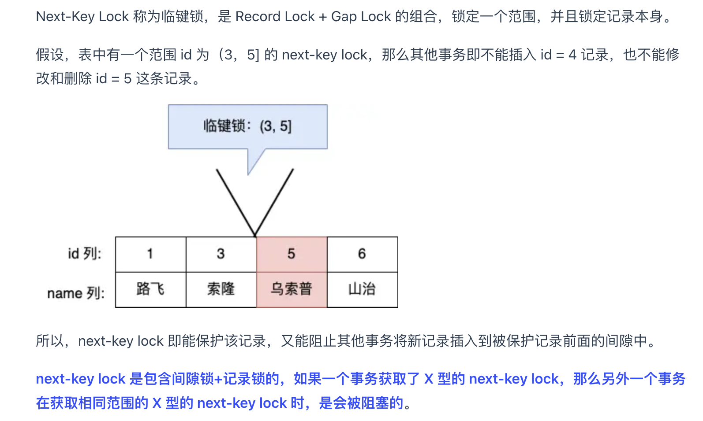

面试题

https://www.nowcoder.com/tutorial/94/36e2c89b4b4641f8b3c566758fdc879d

# 八股文

## 一、数据结构算法

### 有序的set、map


c++的set和map都是有序的，基于红黑树，而unorderedset才是哈希表，没有红黑树，红黑树是用来排序的。

而java的treemap也是红黑树来实现的，因为有序，但是hashmap虽然无序，但是也用了红黑树，原因是在java的hashmap中，不是用红黑树来管理hashmap，而是在hash值相同的情况下（且重复数量大于8），用红黑树来管理数据

> java8不是用红黑树来管理hashmap，而是在hash值相同的情况下（且重复数量大于8），用红黑树来管理数据。 红黑树相当于排序数据，可以自动的使用二分法进行定位，性能较高。一般情况下，hash值做的比较好的话基本上用不到红黑树。
> 红黑树牺牲了一些查找性能 但其本身并不是完全平衡的二叉树。因此插入删除操作效率略高于AVL树。

### 空间换时间

有很多。

- tire、线段树、树状数组、ST表、跳表
- 动态规划：子问题会重叠，直接用数组保存之前的值
- hash表、前缀和

> 时间换空间的算法：LRU淘汰算法

### Tire

Tire，又叫字典树、前缀树，高效的进行字符串存储、查询的数据结构。在英文字符串中可以理解成一棵26叉树，是一种典型的空间换时间的算法。

应用：词频统计、字符串检索、字符串排序、实现敏感词过滤等

可以用来进行敏感词过滤，性能非常高，达到O（n），其中n是待检测文本的长度

### 动态规划与分治算法区别

相同点：将大的问题转换成子问题解决。

区别：子问题是否相互重叠

虽然两种方法有很多的相似之处，但也有不同之处，最本 质的区别是：子问题是否相互重叠。分治算法分解的子问题， 它们内部数据的计算不需要其他子问题的参与，是相互独立 的，例如我们举的例子：归并排序。而动态规划利用子问题之 间的关系，是子问题调用子问题进行求解。

### 拓扑排序的思路

BFS的过程。统计所有节点的入度，初始化把所有入度是0的加入队列，然后进行循环，当队列中没有元素时停止循环。

拓扑序列不唯一

也可以用来判断是不是有环

### 判断一个有向图是否有环

拓扑排序，最后操作的次数是不是等于顶点数

### 平衡树

先讲一下各种平衡搜索[二叉树](https://www.zhihu.com/search?q=二叉树&search_source=Entity&hybrid_search_source=Entity&hybrid_search_extra={"sourceType"%3A"answer"%2C"sourceId"%3A3531196892})之间的对比。如下这一系列的结构，其实就是为了实现有序表的功能，而那些常用的经典方法，你不管用哪个结构，[时间复杂度](https://www.zhihu.com/search?q=时间复杂度&search_source=Entity&hybrid_search_source=Entity&hybrid_search_extra={"sourceType"%3A"answer"%2C"sourceId"%3A3531196892})都能做到O(log n)，换句话说，这些结构都是可以彼此平替的，区别只在于常数时间。

- 二叉搜索树

  左小右大

- AVL树：具有最严格的平衡性，任意子树上，左树和右树**的高度差绝对值不超过1**。它是理解左旋、右旋最基础的结构，也是理解一系列平衡搜索二叉树的起点结构。

- size-balanced-tree：俗称sb树。平衡性进行了适当阉割，任意子树上，左树和右树的节点个数的倍数，最多到2倍的规模，时间复杂度不受影响还是O(log n)。

- 红黑树：平衡性进行了阉割，任意子树上，从头节点到叶节点的链，**最长链和最短链的长度比值，最多到2倍的规模**。没错！你不需要管红黑树那些繁琐的规定，它想实现的平衡性就是这个。时间复杂度不受影响还是O(log n)。

  c++的set，java的hashmap和treemap，hashset，treeset

- 跳表：不是平衡搜索二叉树，但是利用随机化规避倾斜数据，也能实现有序表的一系列功能，常见功能也能时间复杂度O(log n)，**常数时间稍差**。


### B树

B树是m叉搜索树，是一棵m叉的搜索树，**每个节点都存储信息**，一颗m阶的B树满足如下条件：

- 每个节点最多只有m个子节点。
- 除根节点外，每个非叶子节点具有至少有 m/2（向下取整）个子节点。
- 非叶子节点的根节点至少有两个子节点。
- 有k颗子树的非叶节点有k-1个键，键按照递增顺序排列。
- 叶节点都在同一层中。

例子如下图所示：


### B+树

B+树是**应文件系统所需而产生**的B树的变形树。一颗m阶的B+树满足如下条件：

- 每个节点最多只有m个子节点。
- 除根节点外，每个非叶子节点具有至少有 m/2（向下取整）个子节点。
- 非叶子节点的根节点至少有两个子节点。
- 有k颗子树的非叶节点有k个键，键按照递增顺序排列。
- 叶节点都在同一层中。


区别

- 双向链表

  B+树叶子节点是连通的（双向链表），B树没有

- 存储信息的节点

  B+树只有叶子存储信息，非叶子存储索引；B树每个节点都存储信息

- 节点中键的个数不同

  B+树中，有m个子树的节点中包含m个键；B树中，有m个子树的节点中包含m-1个键


### 红黑树

- 定义

  红黑树是一种自平衡的**二叉查找树**，是一种高效的查找树，**它是具备了某些特性的二叉搜索树**。红黑树具有良好的效率，它可在 O(logN) 时间内完成查找、增加、删除等操作。

- 为什么有红黑树

  对于二叉搜索树，如果插入的数据是随机的，那么它就是接近平衡的二叉树，它的操作效率（查询，插入，删除）效率较高，时间复杂度是O（logN）。

  但是可能会出现一种极端的情况，那就是插入的数据是有序的（递增或者递减），那么所有的节点都会在根节点的右侧或左侧，此时，二叉搜索树就变为了一个链表，它的操作效率就降低了，时间复杂度为O(N)，所以可以认为二叉搜索树的时间复杂度介于O（logN）和O(N)之间，视情况而定。

  那么为了应对这种极端情况，红黑树就出现了，**它是具备了某些特性的二叉搜索树**，能解决非平衡树问题，红黑树是一种接近平衡的二叉树（说它是接近平衡因为它并没有像AVL树的平衡因子的概念，它只是靠着满足红黑节点的5条性质来维持一种接近平衡的结构，进而提升整体的性能，并没有严格的卡定某个平衡因子来维持绝对平衡）。

- 核心思想

  红黑树保证**最长路径不超过最短路径的二倍**，因而近似平衡

  它在每个节点增加了一个存储位记录节点的颜色，可以是RED,也可以是BLACK；通过任意一条从根到叶子简单路径上颜色的约束，

- 定义

  1. 节点是红色或黑色
  2. 根是黑色
  3. 叶子节点（外部节点，空节点）都是黑色，这里的叶子节点指的是最底层的空节点（外部节点），下图中的那些null节点才是叶子节点，null节点的父节点在红黑树里不将其看作叶子节点
  4. 红色节点的子节点都是黑色
     1. 红色节点的父节点都是黑色
     2. 从根节点到叶子节点的所有路径上不能有 2 个连续的红色节点
  5. 从任一节点到叶子节点的所有路径都包含相同数目的黑色节点
     

原文链接：https://blog.csdn.net/cy973071263/article/details/122543826


### 跳表

链表+二分。在链表的基础上再建立多层索引

跳表是一个“概率型”的数据结构，在很多应用场景中可以替代平衡树。与平衡树相比，有相似的渐进期望时间边界，但是它更快，更简单也更省空间。

是一个分层结构的多级链表，最下层链表包括所有数据，每个层级都是下一层级的索引，是一个用空间换时间的方案

- 红黑树：插入、查找为O(logn)，但常数项较小；无锁实现的复杂性很高，一般需要加锁；数据天然有序。
- SkipList：插入、查找为O(logn)，但常数项比红黑树要大；底层结构为链表，可无锁实现；数据天然有序。


特点：

- 跳跃表的层数，我们称之为维度，从上到下，我们称之为降维，它由很多个维度维成。
- 每一层都是一个有序的链表。
- 每一层中相同的元素，我们称为“同位素”。
- Skip List主要思想是将链表与二分查找相结合，它维护了一个多层级的链表结构（用空间换取时间），可以把Skip List看作一个含有多个行的链表集合，每一行就是一条链表，这样的一行链表被称为一层，每一层都是下一层的"快速通道"，即如果x层和y层都含有元素a，那么x层的a会与y层的a相互连接（垂直）。最底层的链表是含有所有节点的普通序列，而越接近顶层的链表，含有的节点则越少。
- 最底层的链表，即包含了所有元素节点的链表是L1层，或称基础层。除此以外的所有链表层都称为跳跃层。
- 基础层包括所有的元素。
- 对一个目标元素的搜索会从顶层链表的头部元素开始，然后遍历该链表，直到找到元素大于或等于目标元素的节点，如果当前元素正好等于目标，那么就直接返回它。如果当前元素小于目标元素，那么就垂直下降到下一层继续搜索，如果当前元素大于目标或到达链表尾部，则移动到前一个节点的位置，然后垂直下降到下一层。
- Skip List还有一个明显的特征，即它是一个不准确的概率性结构，这是因为Skip List在决定是否将节点冗余复制到上一层的时候（而在到达或超过顶层时，需要构建新的顶层）依赖于一个概率函数，举个栗子，我们使用一个最简单的概率函数：丢硬币，即概率P为0.5，那么依赖于该概率函数实现的Skip List会不断地"丢硬币"，如果硬币为正面就将节点复制到上一层，直到硬币为反。
- 相比于二叉查找树，跳表维持结构平衡的成本比较低，完全靠随机。而二叉查找树需要Rebalance来重新调整平衡的结构。
- 删除时自上而下，查找第一次出现节点的索引，并逐层找到每一层对应的节点，删除每一层查找到的节点，如果该层只剩下1个节点，删除整个一层(原链表除外)。

### 堆排序

是一个基于堆（大根/小根）的排序算法，堆是一个**完全二叉树**

如果要得到升序，就是大根堆；否则降序，需要小根堆

1. 构建大顶堆
2. 将堆顶元素与最后一个元素交换，然后此时堆顶下移，此时确定了一个元素的最终位置


## 二、计算机网络

### OSI七层参考模型


- IP：ipv4等协议，遵循一定的逻辑地址协议

- ARP协议：将IP地址解析为MAC地址的协议

- ICMP协议：ICMP（Internet Control Message Protocol）Internet控制报文协议。它是TCP/IP协议簇的一个子协议，用于在IP主机、路由器之间传递控制消息。

  是一种面向无连接的协议，用于传输出错报告控制信息，比如：在cmd窗口ping其它网络时，返回的数据。

- SMTP是一种提供可靠且有效的电子邮件传输的协议。


[计算机七层参考模型](https://blog.csdn.net/m0_57515995/article/details/124154074?spm=1001.2101.3001.6650.1&utm_medium=distribute.pc_relevant.none-task-blog-2%7Edefault%7ECTRLIST%7ERate-1-124154074-blog-127949640.235%5Ev38%5Epc_relevant_anti_t3_base&depth_1-utm_source=distribute.pc_relevant.none-task-blog-2%7Edefault%7ECTRLIST%7ERate-1-124154074-blog-127949640.235%5Ev38%5Epc_relevant_anti_t3_base&utm_relevant_index=2)

### 为什么要OSI七层模型

分层独立、标准化、故障隔离

- 分层结构与技术独立

  **分层结构**：OSI七层模型将计算机网络通信过程划分为七个层次，每个层次处理特定的任务。这种分层结构使得网络设计和实现更加**模块化、灵活**和易于维护。每一层都使用相邻下层提供的服务，并向相邻上层提供服务，从而实现复杂问题的分而治之。

  技术**独立**：由于每个层次的功能相对独立，因此某一层次的技术变化不会对其他层次产生直接影响。这种技术独立性使得网络协议可以根据需要进行升级和修改，而不会影响到整个网络系统的稳定性和可靠性。

- 促进**标准化**，有利于快速发展：
  
  分层模型为每一层都定义了**标准化的接口和协议**，有助于不同厂商生产的设备在网络中实现互操作性，从而使计算机飞速发展

- 隔离，便于故障诊断与协议分析

  **故障诊断**：在OSI七层模型中，每一层都有明确的协议和功能定义。当网络出现故障时，可以根据故障现象逐层排查和定位问题所在，从而快速排除故障。

### 五层模型

五层模型是对OSI七层模型的一种简化，它保留了OSI模型中的核心层次，但去除了会话层和表示层，将剩下的层次重新划分为五层：

1. **应用层**：与OSI模型中的应用层相同，负责为应用程序提供网络服务接口。
2. **传输层**：与OSI模型中的传输层相同，负责数据的端到端传输和可靠性控制。
3. **网络层**：与OSI模型中的网络层相同，负责数据的路由和转发。
4. **数据链路层**：与OSI模型中的数据链路层相同，负责数据的封装成帧和传输介质上的传输。
5. **物理层**：与OSI模型中的物理层相同，定义了物理设备标准和比特流的传输方式。

### TCP/IP四层模型

TCP/IP（Transmission Control Protocol/Internet Protocol）模型是互联网上广泛使用的网络体系结构模型，它将网络通信过程划分为四个层次：

1. **网络接口层**：对应OSI模型中的物理层和数据链路层，负责数据的物理传输和封装成帧。
2. **网络层**：与OSI模型中的网络层相同，负责数据的路由和转发。
3. **传输层**：与OSI模型中的传输层相同，负责数据的端到端传输和可靠性控制。
4. **应用层**：与OSI模型中的应用层相同，为应用程序提供网络服务接口。但TCP/IP模型的应用层协议更加丰富多样，如HTTP、FTP、SMTP等。

### 路由器、交换机工作在哪一层

- 路由器工作在在**网络层**工作 

- 交换机在**数据链路层**工作

### CORS

**跨域请求**：在请求头中会既包含要请求的主机还包括当前的源主机名，如果这两者不一致，那就是跨域请求。

解决方法：在后端处理跨域问题

- 方案1：实现WebMvcConfigurer接口，重写addCorsMappings方法


- 方案2：**添加一个CORS的过滤器**

### AJAX发送同步异步请求

AJAX中根据async的值不同分为同步（async = false）和异步（async = true）

https://blog.csdn.net/xiaoguang44/article/details/6454727

> asynchronous：异步

### 介绍HTTP

定义、端口号、明文、状态码、为什么有、请求、参数

- 定义

- 端口号

- 明文

- 常见http请求

- http状态码

- http请求头参数
  
  - 内容长度、内容类型、host、编码类型、设置长连接
  
- 为什么不用裸的TCP

  知道了为什么应用层数据传输不能裸tcp，会出现粘包。也知道了应用层基于tcp延伸的协议和格式，主要是定义了包体的长度、大小等，用于避免粘包


###  GET和POST 区别

- get是url传参，post是在请求体中，

- get比post更加不安全，因为参数暴露在url中

- get参数长度有限制，post没有

- 使用场景

  get适合查询，post适合修改


### 幂等性和安全性

- 幂等性：多次发送同一个请求，造成的执行结果不变（造成的影响一样）

- 安全性：请求对服务器无破坏

- get和post
  -  get请求是满足幂等性、安全性的 
  -  post请求不满足幂等性（修改操作结果不一样）、安全性（修改操作会影响做数据库） 

  所以，一般get请求可以**浏览器缓存**，因为满足幂等性，而post请求不进行缓存。


### HTTPS与HTTP

- 概念：http是超文本传输协议，https是带有ssl安全协议的http

- http是明文传输，https是加密传输

- 端口，80；443

- https需要到ca申请证书，需要费用

- 速度

  **HTTPS的传输速度通常比HTTP稍慢。** 这是因为HTTPS在HTTP的基础上加入了SSL/TLS加密，这需要在数据传输前进行加密和数据传输后的解密，这个过程需要额外的计算资源，从而影响了传输速度

### HTTP短连接和长连接

- 短连接

  是指每次请求-响应交互都会建立一个新的TCP连接。这意味着每个HTTP请求都需要经历TCP的三次握手和四次挥手过程，这些过程会消耗时间和资源。一旦响应完成，连接就会立即关闭。这是HTTP/1.0的默认行为。 

- 长连接

  （也称为持久连接或HTTP Keep-Alive），允许在同一连接上进行多次请求-响应交互。这样，客户端和服务器之间的TCP连接在一段时间内保持打开状态，可以重复使用，而不必重复建立和关闭连接。这大大减少了连接建立和拆除的开销，提高了性能和效率。长连接是HTTP/1.1的默认行为。

- 开启方式

  在客户端，我们需要确保发出的HTTP请求中包含适当的头部字段，以指示服务器我们希望使用长连接。这主要涉及到两个HTTP头部字段：`Connection` 和 `Keep-Alive`。

- 对比

  使用HTTP长连接有许多优势，特别是在高流量和高并发的情况下：

  1. **减少连接建立和拆除的开销**：长连接避免了不必要的TCP握手和挥手过程，减少了网络延迟和资源消耗。
  2. **提高性能**：客户端和服务器之间的持久连接允许更多的请求-响应交互，从而加速了数据传输。
  3. **降低服务器负载**：长连接减少了服务器上同时打开的连接数，减轻了服务器的负担，提高了可伸缩性。
  4. **更好的用户体验**：用户可以更快地加载网页和应用程序，因为连接保持打开状态，减少了等待时间。

### HTTPS

>  带有SSL安全协议的HTTP，本质是加入了加密策略

- https在http的基础之上引入了加密机制(加密层)。https加密的一系列流程是由SSL(后来改名为了TLS)协议来规定的

- https加密的目标

  对http的header和body进行加密。

- 加密算法

  使用对称加密算法加解密请求内容，使用非对称加密算法加密对称密钥

  - 基本思路

    客户端使用密钥对数据进行**对称加密**，服务器拿着同一个密钥对数据进行解密。由于黑客没有密钥，所以黑客无法获取到加密之前的内容。

  - 存在问题

    不能使用同一个密钥，要每个客户端一个，并且服务端不能维护（服务器来维护多个客户端和多个密钥之间一一对应的关系，那么服务器的开销太大了），所以要放到请求中，但是放到请求中很容易泄漏，所以要对对称密钥进行加密

  - 用非对称加密算法加密密钥

    - ①服务器生成一对公钥和私钥，服务器把公钥返回给客户端，服务器自身把私钥藏好。

    - ②客户端仍然生成对称密钥，使用服务器的**公钥对对称密钥进行加密**，然后把这个加密后的对称密钥发送给服务器。

      如果黑客拿到加密后的对称密钥是无法对其进行解密的，因为公钥加密后的对称密钥需要用私钥才能解密，而私钥只有服务器才有。

    - ③加密后的对称密钥到达服务器之后服务器用私钥解密出对称密钥，然后服务器返回一个响应给客户端告诉客户端这次传输确认用的是这个对称密钥(响应用对称密钥进行加密)。

    - ④接下来客户端和服务器就使用这个对称密钥对业务数据进行加密即可。

- 为什么不全部流程都用非对称加密呢

  因为非对称加密和解密的运算成本很高速度慢，对称加密运算成本低速度快，如果全部流程都使用非对称加密则数据整体的传输效率将会变得很慢。

- 中间人攻击问题

  出现中间人攻击问题是因为客户端对发过来的公钥没有分辨能力，比如客户端无法识别出公钥2是黑客发送过来的而不是服务器发送过来的。因此要引入第三方公正机构，让公正机构来辨别发过来给客户端的公钥是黑客生成的公钥还是服务器生成的公钥。

- 使用证书来校验客户端收到的公钥是否是服务器生成的公钥

  1. 开发人员搭建服务器的时候会生成一份公钥和私钥(这里的公钥和私钥只要一份就行，不用像对称密钥那样每个客户端都要有不一样的对称密钥。因为针对每个客户端都要有不同的一份公钥和私钥的话那服务器的压力太大了，服务器针对每个客户端都要生成公钥和私钥并且保存，还要验证是哪个客户端发来的信息并解密等)。

  2. 然后服务器向公证机构提出申请(提交申请要有材料比如域名、服务器的公钥、厂商……)，公证机构对申请进行审核，审核通过就会给服务器颁发一个证书，服务器会保存好这个证书。证书是一段结构化的数据，这段结构化的数据包括一些重要信息，比如网站域名、服务器的公钥、证书的过期时间、数字签名……

  3. 然后客户端发送询问服务器证书的请求

  4. 客户端拿到证书以及公钥

- 证书的校验（检查数字签名）

  ①数字签名(被加密后的证书的校验和)：证书中有一个数字签名，数字签名是一个被加密后的证书的校验和。公正机构在颁发证书给服务器的时候，会把针对证书中的内容计算出校验和并且对这个校验和进行加密，这个加密后的校验和就是数字签名。
  ②得到数字签名(被加密后的证书的校验和)的加密过程：数字签名的加密是非对称加密。公证机构会生成一对自己的公钥和私钥，公证机构自己持有私钥，公钥发布给各个客户端设备(公钥会内置到主机的操作系统中)，然后公正机构用自己的私钥对证书的校验和进行加密就得到了数字签名。
  ③客户端收到服务器发来的证书之后，也就拿到了数字签名，然后客户端通过操作系统内置的公正机构的公钥对数字签名进行解密得到证书的校验和。客户端再重新计算发送过来的证书的校验和，和解密出来的校验和进行对比，如果两个校验和一致，就认为证书没有被黑客篡改过，证书的公钥就是服务器生成的公钥而不是黑客生成的公钥。

  有了证书的校验这一套机制，就可以有效缓解中间人攻击问题了，因为如果黑客篡改了证书中的内容会很容易被发现，而且黑客也无法申请一个证书来替换掉服务器的证书。

https://blog.csdn.net/zhanlongsiqu/article/details/134088762

### 三次握手

TCP协议是7层⽹络协议中的传输层协议，负责数据的可靠传输。 

在建⽴TCP连接时，需要通过三次握⼿来建⽴，过程是： 

1. 客户端向服务端发送⼀个SYN 

2. 服务端接收到SYN后，给客户端发送⼀个SYN_ACK 

3. 客户端接收到SYN_ACK后，再给服务端发送⼀个ACK 

- 为什么要进行三次握手？

  三次握手的作用：能够让双方都能明确自己和对方的收、发能力是正常的。

  （1）.第一次握手时：客户端发送网络包，服务端收到了。

  这样服务端就能得出结论：客户端的发送能力、服务端的接收能力是正常的。

  （2）.第二次握手时：服务端发包，客户端收到了。

  这样客户端就能得出结论：服务端的接收、发送能力，客户端的接收、发送能力是正常的。

  （3）.第三次握手时：客户端发包，服务端收到了。

  这样服务端就能得出结论：客户端的接收、发送能力，服务端的发送、接收能力是正常的。


### 四次挥手

在断开TCP连接时，需要通过四次挥⼿来断开，过程是： 

1. 客户端向服务端发送FIN 

2. 服务端接收FIN后，向客户端发送ACK，表示我接收到了断开连接的请求，客户端你可以不发数据 了，不过服务端这边可能还有数据正在处理 

3. 服务端处理完所有数据后，向客户端发送FIN，表示服务端现在可以断开连接 

4. 客户端收到服务端的FIN，向服务端发送ACK，表示客户端也会断开连接了 

- 为什么是四次不是三次挥手

  原因在于客户端请求断开连接后，但是**服务端可能还存在没有传输完的数据，如果此时服务端就直接断开连接那势必会造成数据的丢失，TCP也就不可靠了**。
  
- 什么情况会出现三次挥手的情况

  当设置了**TCP延迟响应**的时候，会将第二ACK、第三次挥手FIN合并在一起发送。

  解释：如果只发送ACK，没有响应数据的话，那么**ACK的网络效率不高**，所以TCP延迟响应会等待有数据响应的时候再和数据一起他送，也就是说，在这种情况下，ACK和FIN一起发送给了客户端。

  具体的策略：如果下一次客户端又发了请求，也会让ACK直接发

### TCP 与 UDP区别


总结：

- TCP向上层提供面向连接的可靠服务 ，UDP向上层提供无连接不可靠服务。
- 虽然 UDP 并没有 TCP 传输来的准确，但是也能在很多实时性要求高的地方有所作为
- 对数据准确性要求高，速度可以相对较慢的，可以选用TCP

### TCP如何保证可靠传输

TCP协议通过多种机制保证数据传输的可靠性，主要包括：

- 连接建立和维护：TCP通过三次握手过程在通信双方之间建立连接，交换序列号和其他控制信息，确保彼此的状态正确。连接建立后，TCP会维护连接状态，定期发送确认信号以保持连接活跃。
- 序列号和确认：TCP为每个发送的数据包进行编号，接收方收到数据后会发送确认，确认序列号。发送方根据确认来决定是否需要重传数据，以确保数据的准确到达。
- 超时和重传：TCP设置一个定时器来监视发送数据的确认情况，如果在一定时间内没有收到确认，就会认为数据丢失，触发重传机制。重传的数据包会在发送队列中等待，直到收到确认或达到最大重传次数为止。
- 流量控制：TCP使用滑动窗口机制来控制数据的流量。发送方根据接收方的处理能力来调整发送速率，以防止数据丢失或拥塞。接收方通过通告窗口大小来告知发送方自己的接收能力，发送方根据这个信息来控制发送数据的速率。
- 拥塞控制：TCP使用拥塞窗口来控制数据的发送速率，以避免网络拥塞。当网络出现拥塞时，TCP会减小拥塞窗口的大小，从而减少发送数据的速率，以缓解拥塞。当网络情况改善时，TCP会逐渐增大拥塞窗口，以提高发送数据的速率。
- 错误检测和校验：TCP使用校验和来检测数据包在传输过程中是否发生了错误。接收方会计算接收到的数据包的校验和，并与发送方发送的校验和进行比较，以检测出任何数据损坏。如果数据包损坏或校验和不匹配，接收方会要求发送方重传数据。
- 有限状态机：TCP使用有限状态机来管理连接的状态转换，确保连接建立、数据传输和连接关闭等过程按照规定的顺序进行。

通过这些机制，TCP能够提供高度可靠的数据传输服务，在不可靠的网络环境中确保数据的准确性和完整性。


### UDP是否可以用于HTTP

HTTP是基于可靠传输协议的，UDP不可靠。正常情况下是不会使用UDP来实现HTTP，非得需要，要在UDP上加一些功能吧。

###  TCP 粘包

我们在涉及TCP协议的应用中，经常会出现粘包的问题。所谓粘包，简单地讲，就是我有两条消息，明明发送端的代码是分两次发送的，但是在接收端却一次性就接收到了两条消息。

- 原因：其中跟粘包关系最大的就是基于**字节流**这个特点。字节流，简单来说就是一大堆 01 串。这些 01 串之间没有任何边界。应用层传到 TCP 协议的数据，不是以消息报为单位向目的主机发送，而是以字节流的方式发送到下游，这些数据可能被切割和组装成各种数据包，**接收端接收到这些数据包后没有正确还原之前的消息，因此出现粘包现象**。

- 解决方法

  定义信息规则：**在信息中加入特殊的标志作为分隔符**、**加入信息的长度**，用于区分不同信息，比如http就是做了这件事。

- 延伸

  此外，由于只有裸的TCP会出现各种问题，所以各个公司都会做封装，为了有一个统一的标准所以后来诞生了HTTP，统一了所有公司的标准


### TCP中的拥塞控制有哪4种方法

网络传输过程中，某段时间如果网络中某一资源的需求超过了该资源所能提供的可用部分，网络性能就会变坏，这种情况就叫做**网络拥塞**
为解决这个问题，TCP中使用了四种拥塞控制算法

1. 慢开始
2. 拥塞避免
3. 快重传
4. 快恢复


### ddos攻击（结合三次握手）

DDoS攻击是指分布式拒绝服务攻击，通过利用大量的恶意流量来超载目标系统或网络，使其无法正常提供服务。三次握手是TCP协议中建立连接的过程，是DDoS攻击的一个潜在攻击点。

 解答思路：在DDoS攻击中，攻击者可以利用三次握手中的SYN Flood攻击来消耗目标系统资源。攻击者发送大量**伪造的TCP连接请求（SYN包）**，**导致目标系统不断响应并等待客户端的ACK确认**，最终耗尽系统资源无法正常处理合法请求。

### POST和PUT的区别

POST和PUT请求的区别：一个例子是网不好的时候，post提交后没收到响应，于是客户端再次尝试提交，成功后刷新看到新建了两条资源，如果用put的话就不会出现这样的情况。所以尽量使用put去代替post

### 输入url发生了什么？

输入url发生了什么？DNS 解析、建立tcp三次握手、发送http、服务器处理、服务器相应、浏览器处理服务端响应、渲染、关闭tcp


### DNS流程

1. **用户发起请求**：当用户在浏览器中输入一个域名时，浏览器会向本地DNS客户端发送请求，请求解析该域名对应的IP地址。
2. **本地缓存查找**：首先，浏览器和操作系统会在自己的缓存中查找是否有该域名的记录。如果缓存中有，则直接返回IP地址；否则，继续下一步。
3. **互联网服务提供商DNS缓存查找**：如果本地缓存中没有找到，浏览器会检查互联网服务提供商（ISP）的DNS缓存中是否有该域名的记录。
4. **根域名服务器查询**：如果ISP的DNS缓存中也没有找到，浏览器会将请求发送给根域名服务器。全球有13台根域名服务器，它们分布在战略位置，由不同的组织运营。
5. **权威域名服务器查询**：顶级域名服务器返回权威域名服务器的地址后，浏览器向权威域名服务器发送请求，获取域名对应的IP地址。
6. **结果缓存**：一旦获取到IP地址，本地DNS服务器会将这个解析结果缓存起来，以便将来相同的请求可以直接从本地缓存中获取，提高解析速度。

比如访问：s.tool.chinaz.com


### DNS是基于什么协议的

DNS是应用层协议，而DNS是基于UDP进行传输的。

原因：虽然可靠性不高，但是UDP速度快，性能好，即使失败了，扩展了重试机制就可以了

### Ping用的什么协议

用的ICMP协议（网络层），**ping为什么不用UDP，要用ICMP**，因为：ICMP是网络层，快，更偏向底层，UDP是传输层，还需要封装其他的数据和报文，**ping只需要一个判断**，**不需要发送数据和报文**，UDP还需要封装数据和报文。

### http常见状态码

**200 OK**：请求成功，服务器返回客户端请求的数据。
201 Created：请求成功并且服务器创建了新的资源。
204 No Content：请求成功，但服务器没有返回任何内容。
301 Moved Permanently：永久重定向，资源已永久分配新的 URL。
302 Found：临时重定向，资源临时被分配了新的 URL。
304 Not Modified：自上次请求后，请求的资源未被修改，可以使用缓存的数据。
**400 Bad Request**：服务器无法理解请求的格式，客户端不应该尝试再次使用相同的内容进行请求。
401 Unauthorized：请求未授权，请求要求用户的身份验证。
**403 Forbidden**：服务器理解请求客户端的请求，但是拒绝执行此请求。
404 Not Found：在服务器上没有找到请求的资源。没有信息告诉用户这种情况是临时的还是永久的。
**500 Internal Server Error**：服务器遇到了不知道如何处理的情况。
502 Bad Gateway：服务器作为网关或代理，从上游服务器收到无效响应。
**503 Service Unavailable**：服务器不可用，可能是由于维护或者负载过重。


### cookie和session的区别

- cookie客户端、session服务器端

- 流程（sessionId）

  第一次访问服务器，生成一个session，并返回一个sessionId，保存在cookie中，后续都携带一个sessionId给服务端发送请求，从而根据sessionId进行查询。


### 常见HTTP请求头

content-type、content-length、Authorization

### HTTP请求的幂等性

- 幂等的

  get、put、delete、OPTIONS（获取请求支持的方法）、HEAD（判断某个资源是否存在，只返回请求头）

- 不幂等的

  post

### 接口的幂等性

- 含义: 

  幂等其实是一个数学概念，被引用到计算机领悟中，某一个请求被多次调用，只被影响一次。多次修改(增加 修改 删除）操作其结果是一样的。比如说多次创建订单，最终只会创建一个订单。查询不需要保证幂等。

- 原因: 

  1. 用户重复提交或者恶意攻击下可能出现。2.分布式场景下 由于网络是不可靠，所以会设置超时重试，接口层面需要保证幂等。

-  解决手段

  - select insert

    insert前先看看有没有

  - insert + 唯一索引约束

    插入违反唯一性约束直接拒绝执行

  - 新建防重表

    多时候，我们业务表唯一流水号希望后端系统生成，又或者我们希望防重功能与业务表分隔开来，这时候我们可以单独搞个防重表。当然防重表也是利用主键/索引的唯一性，如果插入防重表冲突即直接返回成功，如果插入成功，即去处理请求。

  - 乐观锁

    （版本号机制）

  - 悲观锁

    （更新的时候锁表：加写锁for update）

  - 分布式锁

    先去尝试获得分布式锁，如果获得成功，就执行业务逻辑，反之获取失败的话，就舍弃请求直接返回成功

  - token令牌机制

    1. 客户端请求申请获取token，服务端生成token返回
    2. 客户端带着token请求，服务端校验token
  
  - 状态机
  
    0-待处理，1-处理中、2-成功、3-失败状态。
  
    第1次请求来时，bizSeq流水号是 666，该流水的状态是处理中，值是 1，要更新为2-成功的状态，所以该update语句可以正常更新数据，sql执行结果的影响行数是1，流水状态最后变成了2。
  
    第2请求也过来了，如果它的流水号还是 666，因为该流水状态已经2-成功的状态了，所以更新结果是0，不会再处理业务逻辑，接口直接返回。
  
-  具体方案: 

  - 1.唯一性约束

    唯一索引或唯一组合索引来防止新增数据存在脏数据 （当表存在唯一索引，并发时新增异常时触发数据库唯一性约束异常，避免了多次执行，再查询一次就可以了，数据应该已经存在了，返回结果即可）。

    > 以博客点赞为例，要想防止一个人重复点赞，可以设计一张去重表，将博客 id 与用户 id 绑定建立唯一索引，每当用户点赞时就往表中写入一条数据，这样重复点赞的数据就无法写入了。

  - 2.token机制

    服务端提供了发送token的接口。我们在分析业务的时候，哪些业务是存在幂等问题的，就必须在执行业务前，先去获取token，服务器会把token保存到redis中。（微服务肯定是分布式了，如果单机就适用jvm缓存）。

    然后调用业务接口请求时，把token携带过去，一般放在请求头部。服务器判断token是否存在redis中，存在表示第一次请求，这时把redis中的token删除，继续执行业务。如果判断token不存在redis中，就表示是重复操作，直接返回重复标记给client，这样就保证了业务代码，不被重复执行。

    > 缺点：业务请求每次请求，都会有额外的请求（一次获取token请求、判断token是否存在的业务）。其实真实的生产环境中，1万请求也许只会存在10个左右的请求会发生重试，为了这10个请求，我们让9990个请求都发生了额外的请求。（当然redis性能很好，耗时不会太明显）

  - 3.**乐观锁**

    给数据库表增加一个version字段，可以通过这个字段来判断是否已经被修改了

  - 4.分布式锁

    分布式锁实现幂等性的逻辑是，在每次执行方法之前判断，是否可以获取到分布式锁，如果可以，则表示为第一次执行方法，否则直接舍弃请求即可。

    比如可以基于Redis的SetNX 机制，写入Redis，被消费过了就不会被消费，一般消息队列中比较多。

  - 5.状态机

    状态在不同的情况下会发生变更，一般情况下存在有限状态机，这时候，如果状态机已经处于下一个状态，这时候来了一个上一个状态的变更，理论上是不能够变更的，这样的话，保证了有限状态机的幂等。

    **状态机控制**这种方法适合在有状态机流转的情况下，比如就会订单的创建和付款，订单的付款肯定是在之前，这时我们可以通过在设计状态字段时，使用int类型，并且通过值类型的大小来做幂等，比如订单的创建为0，付款成功为100。付款失败为99。在做状态机更新时，我们就这可以这样控制：update `order` set status=#{status} where id=#{id} and status<#{status}


### HTTP2.0

很晚出来的，2015年，做了很多的改动，甚至gRPC协议都直接使用了HTTP2.0

比如能够支持Socket通信

### RPC

远程过程调用


- RPC和HTTP

  - 为什么有了HTTP还要RPC

    rpc其实更早。

  - 使用场景

    http更适用Web应用的通信，RPC更适合分布式系统中的服务调用

## 三、操作系统

### 页面置换算法

当内存容量达到上限时，需要删除数据，那么删除什么数据，由具体的页面置换算法决定，比如

- 最近最少使用页面置换算法（LRU）

  下面有

- 最少使用置换算法（LFU）

- 最佳置换算法（OPT）

  理想的算法，不可能实现

- 先进先出置换算法（FIFO）

### LRU 

> 是一种内存管理、页面置换算法

LRU，Least recently used，最近最少使用。

- 思想：如果数据最近被访问过，那么将来被访问的几率也更高

- 操作：
  - 删除元素
  - 插入元素
    - 插入后不超过上限，直接插入
    - 插入后超过上限，先删除最后一个，再插入

- 核心：删除未出现时间最长节点

- 实现思路：使用双向链表，每一次访问的节点，将节点放到（移到）表头。每一次达到内存上限后的删除，删除尾节点。为了能存储数据，每个节点是一个map。所以实现LRU的策略是【双向链表+哈希表】
- 实现
  - Java：linkedHashMap
  - Python： OrderedDict
  - 原生：双向链表+哈希表

```
// putNode(Node node) 删除节点并更新到最后

// pushEnd(Node node)

//removeNode(Node node)
```


### LFU 

LFU，Least Frequently Used，最少使用置换算法

该算法选择最近时期内使用次数最少的页作为淘汰页。这种算法为每个页保留一个用于记录 页被访问次数 的计数器，每次选择其访问计数器值最小的页换出。

哈希表+懒删除堆

```
```


### 堆区和栈区的区别

本质上堆区和栈区没有区别，都是一块内存区域，只是用法不同（使用场景不同）

堆和栈的区别：

- 内存管理方面不同；

  堆是由程序员通过调用系统库函数来管理内存，所以管理不好就会出现常说的内存泄漏

  栈，是操作系统控制

- 生命周期不同； 

  如果希望变量的生命周期受到函数局部变量控制，就是放在栈区

  如果希望变量的生命周期**受到自己控制**，就是放在堆区

- 申请和释放的规律

  栈区中满足先进后出，而堆是没有规律的

- 性能

  栈的操作O（1）的，堆的操作很慢，因为生命周期首程序员控制堆没有规律，不知道访问哪一个	

- 空间

  栈区大小是固定的，相对较小，收到操作系统控制。

  堆区容量更大，受到进程地址空间控制，有内存泄漏的风险（栈没有）

> 堆和栈的场景换一下不行吗？
>
> 答：如果将栈的场景放到堆中，那么性能会下降，因为栈是O（1）的；如果将堆的场景放到栈中，就不满足了，因为对象的生命周期不一定满足先进后出。

### 栈内存和堆内存哪个周期久

栈内存的更新速度很快,因为局部变量的生命周期都很短;一个对象/实体,没有引用数据类型指向的时候,它在堆内存中不会被释放,而被当做一个垃圾

### 并发和并行

并发是**某个时间间隔内**，多个线程同时执行

并行是**某个时刻**，多个线程同时执行

### 并发的好处

并发的目的是提高系统的效率，减少等待时间，**CPU能够等待IO的时候能够做一些其他的事情** 

- 1.提高**资源利用率**

  一个线程等待IO操作完成时，其他线程还可以继续执行计算任务，**避免因单一任务阻塞导致CPU等资源空闲**。由此可以获得更高的CPU利用率。

- 2.提高**性能**：并发技术可以让程序同时执行多个任务，从而提高程序的处理速度和效率。例如，多线程技术可以让程序同时执行多个任务，从而**减少等待时间**，提高程序的响应速度。

-  3.**改善用户体验**：并发技术可以让程序在后台执行一些任务，而不会阻塞用户界面，从而改善用户体验。例如，在移动应用程序中，使用异步任务可以让程序在后台执行一数据处理任务，而不会阻塞用户界面，提高用户体验。

> 为什么我的多线程demo中，多线程对于性能是没有提升的？
>
> 主要是我的demo中的业务太简单，每个线程没有IO，所以就是没有等待时间，所以看不出性能的差异，如果加上IO，多线程就能够将等待IO的时间让CPU交给其他线程执行，而不是在傻等着IO结束。


### 进程和线程的区别

，一个进程包括多个线程

1. 资源分配：进程是资源分配的基本单位，线程是CPU调度的基本单位

2. 包含关系：一个进程包括多个线程，

3. 通信：进程间通信（IPC）**需要使用特定的机制**，如管道、共享内存等，而**同一进程下的多个线程可以直接进行通信**

4. 切换开销：**线程切换开销较小**，因为线程共享进程的地址空间，切换只需要**保存/恢复寄存器和栈**。进程切换开销较大，**因为需要切换整个进程的地址空间**，包括内存映射、文件描述符等。

5. 并发性能：由于**线程共享内存，访问共享数据较为快速**，适合在多核系统上进行并发操作。进程之间的数据隔离较好，但由于进程间通信开销较大，适用于多核或分布式系统。

6. **健壮性**（安全性）：进程好、线程弱。

   进程相对独立，一个进程崩溃后，在保护模式下不会对其他进程产生影响。

   线程则不同，由于它们共享同一进程的资源和上下文环境，因此**一个线程崩溃可能会导致整个进程崩溃**，从而有可能影响其他线程。

7. 适用场景：多线程适合在需要共享数据、执行密集型任务、或在UI编程中实现并发操作。多进程适合在需要数据隔离、稳定性要求较高、或利用多核优势的情况下进行并发操作。

#### 进程切换和线程切换哪个快

**线程切换开销较小**，因为线程共享进程的地址空间，切换只需要**保存/恢复寄存器和栈**。进程切换开销较大，**因为需要切换整个进程的地址空间**，包括内存映射、文件描述符等。

### 协程和多线程的区别

协程（Coroutines）和多线程（Multithreading）在并发编程中都是重要的概念，但它们之间存在显著的区别。以下是关于协程和多线程区别的详细分析：

1. 实现方式

   - **协程**：协程是一种**轻量级的“线程”**，依赖于语言的支持（如Python的asyncio，或者是Go语言的goroutine）来实现并发。协程的调度不是由操作系统管理，而是由应用程序通过**协程库管理**。协程在执行过程中可以主动“挂起”（yield）和“恢复”（resume），允许在单个线程内执行多个任务的“并发”。
   - **多线程**：多线程允许一个程序并发运行多个线程，每个线程作为程序中的一个执行路径。线程的创建、销毁和调度由操作系统内核管理，可以在多个处理器上并行运行，或在单个处理器上通过时间分片来实现并发。

2. 资源消耗

   多线程上下文切换耗资源，协程资源没有这个消耗，适合高并发

   - **多线程**：每个线程拥有自己的栈空间，线程的创建和销毁、上下文切换都需要相对较多的资源和时间。在高并发场景下，线程的大量使用可能会导致资源消耗大，效率下降。
   - **协程**：协程在单个线程内通过任务的挂起和恢复来实现并发，因此减少了上下文切换的开销。协程的创建和销毁、切换的成本远低于线程，更加适合高并发的场景。

3. 使用场景

   

   - **多线程**：适用于**计算密集型任务**（如图像处理、大规模数值计算等），以及真正需要**并行**处理能力的场景，特别是在多核CPU上可以显著提高程序的执行效率。
   - **协程**：适用于**IO密集型任务**（如网络请求、文件读写等），在这些任务中，程序经常需要等待外部事件完成，协程可以在这些等待时间中挂起当前任务，转而执行其他任务，从而提高程序的整体效率。

4. 并发问题的处理

   - **多线程**：线程间的同步和通信（如使用互斥锁、信号量等）可能会导致程序逻辑变得复杂，增加死锁、竞态条件等并发问题的风险。
   - **协程**：由于协程通常在单个线程内运行，因此减少了线程间同步的需求，简化了并发程序的编写。但是，协程的调度逻辑和状态管理需要程序员自行控制，这也可能带来一定的复杂度。

### 浅拷贝和深拷贝

简单来说，浅拷贝只是拷贝了它在栈中存储的指针，它们指向的都是同一个堆内存地址，所以浅拷贝在某些情况会造成改变数据后导致别的另一份数据也同步被改变的情况；

而深拷贝是直接将堆内存中存储的数据直接复制一份，不会有浅拷贝互相影响的问题。


### 操作系统的用户态和内核态，是否可以没有用户态？

可以没有用户态，但不能没有内核态。 

用户态和内核态是为了区分程序运行权限而设计的，如果没有用户态，所有程序都将以最高权限在内核态下运行。用户态和内核态是操作系统为了区分不同权限级别的程序运行状态而设计的概念。在用户态下，程序只能访问受限资源，而在内核态下，程序可以访问系统的所有资源。如果一个系统没有用户态，那么所有程序都将以最高权限在操作系统内核态下运行，这样会增加系统的不稳定性和安全性风险。

### 银行家算法

https://www.cnblogs.com/wkfvawl/p/11929508.html
银行家算法的实质就是**要设法保证系统动态分配资源后不进入不安全状态，以避免可能产生的死锁。**即没当进程提出资源请求且系统的资源能够满足该请求时，

过程：系统将判断**假设分配此次资源请求后系统状态是否安全**，如果判断结果为安全，则给该进程分配资源，否则不分配资源，申请资源的进程将阻塞。


## 四、JAVA基础

### java优点

简单易用

面向对象

跨平台

多线程

安全

分布式

### 占多少字节

```
byte     1字节               
short    2字节               
int      4字节               
long     8字节               
char     2字节（C语言中是1字节）可以存储一个汉字
float    4字节               
double   8字节               
boolean  false/true(理论上占用1bit,1/8字节，实际处理按1byte处理) 
```

### 重载和重写

重载是方法名相同的一些方法，他们的形式参数列表不同（参数类型不同或参数个数不同或者参数顺序不同），与返回值类型、访问修饰符无关。发生在编译时。

重写是子类重写父类的方法，有两同两小一大原则，发生在运行期间。如果父类访问修饰符是private，则子类不能重写该方法

- 两同两小一大原则：

  方法名相同，参数列表相同

  子类返回类型小于等于父类方法返回类型，
  子类抛出异常小于等于父类方法抛出异常，
  子类访问权限大于等于父类方法访问权限。

### 接口和抽象类的区别

- 接口是全虚的类、抽象类是半虚半实的类

- 接口中的方法都是抽象方法；而抽象类中既可以有抽象方法，也可以有具体方法
- 接口中的方法都是使用public abstract修饰，变量都是使用public static final修饰；抽象类中的抽象方法可以由除private外的修饰符修饰
- 一个类可以实现多个接口但是只能继承一个抽象类

- 设计层面来将，接口是一种行为（业务）的描述，抽象类目的是代码的复用

### List和Set的区别

- set不可重复，list可以重复

- list有序，set无序

- list可以有多个空对象，set最多有一个空

- list可以下标访问list.get(index)，set不行


### BigDecimal

```
public class MyBigDecimal {
    public static void main(String[] args) {
    	//要传string类型
        a = new BigDecimal("1.1");
        b = new BigDecimal("2.2");
        System.out.println(a.add(b));//3.3
        
        
        //不能传double类型的参数
        BigDecimal a = new BigDecimal(1.1);
        BigDecimal b = new BigDecimal(2.2);
        System.out.println(a.add(b));//3.30000000000000026645
        
        //正常是精度丢失的
        double c = 0.1;
        double d = 0.2;
        System.out.println(c+d);//0.30000000000000004
    }
}
```

### ArrayList扩容

Arraylist的初始长度是10，每一次扩容都会变成1.5倍

ArrayList当调用add方法时，会判断加入一个元素后数组长度会不会超。如果超了则调用grow方法进行扩容，每次扩容为旧数组长度的1.5倍。

> （1）new ArrayList(20)，就扩容了0次
>
> （2） new ArrayList(),如果超了后，list.add(1)，就扩容了1次

### ArrayList和LinkedList的区别（浅层）

ArrayList基于数组，连续存储空间，存取快增删慢。扩容机制：因为数组长度是固定的， 所以超出长度时会新建一个数组，将老数组拷贝到新数组。

LinkedList基于链表，可以存储在分散的内存中，增删快，存取慢

### 自动装箱/拆箱

- 自动装箱

  自动装箱是 Java 编译器在*基本类型和它们对应的包装类之间进行的自动转换*。例如，将 int 类型转换为 Integer 类型，将 double 类型转换为 Double 型等等。

  相当于调用valueOf()方法

  ```
  Integer x = 1;//自动装箱
  
  底层是这样的
  
  Integer x = Integer.valueOf(1);
  ```

  valueOf底层

  首先判断数值是否在-128~127之间，如果在，就直接返回常量池

  ```
  	//源码版本：java17
      public static Integer valueOf(int i) {
          if (i >= IntegerCache.low && i <= IntegerCache.high)
              return IntegerCache.cache[i + (-IntegerCache.low)];
          return new Integer(i);
      }
  ```

- 自动拆箱

  将包装类型转换成基本类型

  ```
  Integer a = new Integer(1);
  int b = a;//自动拆箱
  ```

  

### Integer比大小

通过==和equals()

- 可以通过equals()方法比较包装类型的内容大小
- ==比较两个基本数据类型的大小，比较包装类型的内存地址。

- Integer变量和int变量比较，会**自动拆箱**，然后比较数值

  只要两个变量的值是相等的，则结果为true（因为包装类Integer和基本数据类型int比较时，java会自动将Integer**拆箱**为int，然后进行比较，实际上就变为两个int变量的比较）

- 两个Integer对象比较

  - 两个new生成的Integer比较，比较的是**地址**

    由于Integer变量实际上是对一个Integer对象的引用，所以两个通过new生成的Integer变量永远是不相等的（因为new生成的是两个对象，其内存地址不同）。

  -  非new生成的Integer变量和new Integer()生成的变量比较时，结果为false。

    因为非new生成的Integer变量指向的是java常量池中的对象，而new Integer()生成的变量指向堆中新建的对象，两者在内存中的地址不同

  -  对于两个非new生成的Integer对象，取决于是否在**常量池**中

    进行比较时，如果两个变量的值在区间-128到127之间，则比较结果为true，如果两个变量的值不在此区间，则比较结果为false

> 思路：equals()、==、Integer和int比较、Integer和Integer比较（3种情况）

### GC如何判断对象可以被回收

- 引用计数法：每个对象都有一个引用计数属性，新增一个引用，计数加1，释放一个引用就减1，如果计数为0就回收
- 可达性分析法：从GC Roots开始向下搜索，没有走到的对象就是不可用的，就回收

> 引用计数法不好，可能出现a引用b,b引用a，永远不会回收，java中不采用这种方法，java中使用可达性分析法

### GC垃圾回收4种算法

- **1.标记清除**

  **根节点(GC Roots)**，标记所有从根节点开始的对象，未被标记的对象就是未被引用的垃圾对象。然后，在清除阶段，清除所有未被标记的对象。

  - 容易产生内存碎片
  - 适用于老年代：大量对象不变

- **2.复制算法**

  需要两块内存区域，每次只使用一个。

  从根集合节点进行扫描，标记出所有的存活对象，并将这些存活的对象复制到一块儿新的内存上去，之后将原来的那一块儿内存全部回收掉

  - 需要复制移动对象
  - 适合**年轻代**：基本上98%的对象是”朝生夕死”的，存活下来的会很少

- 3.**标记压缩**

  标记-压缩算法是一种老年代的回收算法，它在标记-清除算法的基础上做了一些优化。

  首先也需要从根节点开始对所有可达对象做一次标记，但之后，它并不简单地清理未标记的对象，而是将所有的存活对象压缩到内存的一端。之后，清理边界外所有的空间。这种方法既避免了碎片的产生，又不需要两块相同的内存空间，因此，其性价比比较高。

  - 适合老年代

- 4.**分代收集算法**

  **分代收集算法就是目前虚拟机使用的回收算法**，一般情况下将堆区划分为老年代（Tenured Generation）和新生代（Young Generation），在堆区之外还有一个代就是永久代（Permanet Generation）。

  在不同年代使用不同的算法，从而使用最合适的算法，新生代存活率低，可以使用复制算法。而老年代对象存活率高，没有额外空间对它进行分配担保，所以只能使用标记清除或者标记整理算法。

### GC什么时候触发

Java中垃圾回收（GC）的触发主要由以下几种情况引起：

- 系统内存不足：当Java堆内存中的空闲空间不足以满足新对象的分配请求时，JVM的垃圾回收器可能会被触发，以回收不再使用的对象并释放内存空间。
- 显式调用System.gc()：虽然这个方法并不保证会立即触发垃圾回收，但它会向JVM的垃圾回收器发出一个建议，提示它可以运行垃圾回收。然而，由于垃圾回收的时机和频率是由JVM控制的，因此这个方法并不总是有效。 

- 当JVM检测到有垃圾对象（即不再被引用的对象）存在时，会触发GC来回收这些对象。

### Java内存模型

每一个线程在操作共享变量的时候，都将共享变量拷贝一份到自己的工作区间中（因为如果多个线程同时在CPU中操作数据，就像CPU与内存直接交互一样，速度非常慢），等到当前线程的CPU运算完之后，再写回主内存。


### volatile关键字

volatile是JVM提供的轻量级的**同步机制**

- 保证内存可见性

  某个线程修改了资源A，其他线程的资源A的副本也会被修改

- 保证有序性，禁止指令重排

  优化执行顺序，从而提高性能

- 不保证原子性（需要借助synchronized或者CAS)

实战：

```
volatile实战/**
 * @Author: Mr.Q
 * @Date: 2020-06-10 09:47
 * @Description:JMM内存模型验证--volatile保证可见性测试
 */
public class VolatileVisibilityTest {

    //此处是否添加volatile,来验证内存模型
    private static boolean initFlag = false; 

    public static void main(String[] args) throws InterruptedException {
        new Thread(() -> {
            System.out.println("等待数据中....");
            while (!initFlag) {

            }
            System.out.println("--------------success-----------");
        }).start();

        Thread.sleep(3000);

        new Thread(() -> {
            prepareData();
        }).start();
    }

    public static void prepareData() {
        System.out.println("\n准备数据中....");
        initFlag = true; //此处为第30行代码
        System.out.println("initFlag = " + initFlag);
        System.out.println("数据准备完成！");
    }
}

```


### JVM分区

 Java语言区别于C、C++语言其中一个原因是关于内存的管理方式。Java语言是JVM启动时向操作系统申请整个运行所需要内存自由支配并管理。 JVM将申请的内存（逻辑内存）进行划分，分为如图所示结构。


### 为什么元空间放到直接内存？

JVM的内存主要包括堆内存和方法区（元空间）内存。堆内存用于存储对象实例和数组，而方法区（元空间）用于存储类信息、常量池、静态变量等。元空间被放到直接内存主要是为了**避免频繁的Full GC**（垃圾回收器的一种），**直接内存由操作系统管理，不由JVM管理**，减轻了垃圾回收器的压力，提高了性能。

> 一般来说，Java 虚拟机里面有一个运行时数据区，[JVM](https://so.csdn.net/so/search?q=JVM&spm=1001.2101.3001.7020) 运行期间产生的信息都是在 JVM 管理的内存里面，但是在一些场景里，会使用到本地的内存，例如元空间。

### 介绍一下Java中的IO流

按照数据的流向，可以将流分为输入流和输出流。其中，输入流只能读取数据、不能写入数据，而输出流只能写入数据、不能读取数据。

  按照数据的类型，可以将流分为字节流和字符流。其中，字节流操作的数据单元是byte（8位的字节），而字符流操作的数据单元是char（16位的字符）。

  按照使用的场景，可以将流分为节点流和处理流。其中，节点流可以直接从/向一个特定的IO设备读/写数据，也称为低级流。而处理流则是对节点流的连接或封装，用于简化数据读/写功能或提高效率，也成为高级流。

  Java中的IO流主要有4个基类：InputStream、OutputStream、Reader、Writer。其中，InputStream代表字节输入流，OutputStream代表字节输出流，Reader代表字符输入流，Writer代表字符输出流。其他的IO流都是从这4个基类派生而来的，并且子类的名字往往以基类的名字结尾，所以通过类名我们很容易识别某个流的作用。

  Java为我们提供了大量的IO流实现，我们没办法逐个介绍，下面举一些较为常用的例子：

1. 用于访问文件的FileInputStream、FileOutputStream、FileReader、FileWriter。

2. 带有缓冲功能的BufferedInputStream、BufferedOutputStream、BufferedReader、BufferedWriter。

3. 具有转换功能的InputStreamReader、OutputStreamWriter。

4. 支持打印功能的PrintStream、PrintWriter。

下表给大家整理了一些常用的类，黑色字体是抽象基类，红色字体是节点流，蓝色字体是处理流。


### 面向对象

首先，与面向对象相对的是面向过程，面向过程的侧重点在与事情的步骤，而面向对象的侧重点在事情的参与者，举个简单的例子，比如：洗衣服，面向过程：打开洗衣机、放衣服、放洗衣粉、清洗、烘干；面向对象，我：打开洗衣机、放衣服、放洗衣粉，洗衣机：洗衣服、烘干。

其次面向对象三大特性：封装、继承、多态

比较：面向过程比较直接高效、面向对象更易于复用、扩展、维护

### ==与equals

==：如果是基本数据类型，⽐较是值，如果是引⽤类型，⽐较的是引⽤地址是否相同

equals：是Object类中的方法，不重写默认是==，重写equals⽅法之后比较内容是否相同

### NIO

Java NIO（New IO）是从 Java 1.4 版本开始引入的一个新的 IO API，可以替代标准的 Java IO API。NIO 与原来的 IO 有同样的作用和目的，但是使用方式完全不同，NIO 支持面向缓冲区的、基于通道的 IO 操作。NIO 将以更加高效的方式进行文件的读写操作。

Java NIO 系统的核心在于：通道（Channel）和缓冲区（Buffer）。通道表示打开到 IO 设备（例如：文件、套接字）的连接。若需要使用 NIO 系统，需要获取用于连接 IO 设备的通道以及用于容纳数据的缓冲区。然后操作缓冲区，对数据进行处理。简而言之，Channel 负责传输，Buffer 负责存储。

- 传统IO

  

- NIO


- 区别

  （1）IO面向流，NIO面向缓冲区；

  （2）IO流堵塞，NIO流不堵塞；

  （3）NIO有选择，但IO没有。

  

  

### String、String Builder、String Buffer

String是final修饰的、长度不可变的字符串，每次改变都会重新产生新的对象（内存开销比较大）

String Builder、String Buffer都是在原对象上进行操作（也是final）

String Builder是线程不安全的；String Buffer是线程安全的，支持同步操作，其中的每个方法都使用synchronized修饰

性能：String Builder > String Buffer > String

应用场景：如果要经常改变字符串内容使用后两个，优先使用String Builder，多线程共享变量时使用String Buffer

测试：

> System.identityHashCode(s)：返回原始hashcode值（即内存地址）

```java
//String每次改变都会重新new一个对象
String s="a";
System.out.println(System.identityHashCode(s));
s="d";
System.out.println(System.identityHashCode(s));
System.out.println("====================");

//而StringBuilder是在修改原对象
StringBuilder sb=new StringBuilder("a");
System.out.println(System.identityHashCode(sb));
sb.append("a");
System.out.println(sb);
System.out.println(System.identityHashCode(sb));
```


### 字符串判空API

StringUtils.isBlank()适用三种情况

在校验一个String类型的变量是否为空时，通常存在3中情况

1. 是否为 null
2. 是否为 “”
3. 是否为空字符串(引号中间有空格) 如： " "。

StringUtils的isBlank()方法可以一次性校验这三种情况，返回值都是true,否则为false


###　HashCode和equals区别

Object的hashCode()默认是返回内存地址的，重写过后返回哈希值（散列值），实际返回一个int整数，特点是可以根据key快速检索出值

equals也是Object的方法，默认是==，重写后返回对象是否相同

- JAVA的规定：如果两个对象相等（equals方法返回true），则hashcode一定相等
- 如果两个对象hashcode值相同，对象不一定相同
- 重写equals方法时，hashcode方法也必须一起重写

### Java类加载器

过程：将类的字节码文件（.class文件）加载到Java虚拟机（JVM）中，并为其分配内存空间、初始化变量等步骤。

JDK自带有三个类加载器：bootstrap ClassLoader、ExtClassLoader、AppClassLoader。


### 双亲委派模型

- 工作原理

  如果一个类加载器收到了类加载的请求，它并不会自己先去加载，而是把这个请求委托给父类的加载器去执行，父类加载器还有父类加载器，依次递归，最终到达顶层的类加载器，如果可以完成加载就成功返回，如果不能，则子类才会去加载

- 好处

  可以有效避免某些恶意类的加载，例如：自定义了Object类，一般而言双亲委派模型不会调用自定义的Object，而是会加载系统的Object类

### ThreadLocal

- `ThreadLocal`提供了线程局部变量，每个线程都有自己独立的变量副本，互不干扰。主要用于解决多线程环境下的变量隔离问题。

- Threadlocal底层是通过ThreadlocalMap来实现的，每Thread对象(注意不是ThreadLocal对象)中都存在一个ThreadlocalMap，Map的key为ThreadLocal对象，Map的value为需要缓存的值

- 与线程池一起使用

  在使用线程池和threadlocal的时候会出现内存泄漏的问题，每一个threadlocal都通过map维护，通过强引用指向map，当结束时，这个线程不会被销毁，所以这个entry也不会被销毁，所以内存泄漏了。

  - 解决方法：在使用了ThreadLocal对象之后，手动调用ThreadLocal的remove方法，手动清除Entry对象

  > 如果使用线程池的线程，那么使用Threadlocal会造成内存泄漏，因为当ThreadLocal对象使用完之后，应该要把设置的key，value，也就是Entry对象进行回收。但线程池中的线程不会回收，而线程对象是通过引用指向ThreadLocalMap，ThreadlocalMap也是通过强引用指向Entry对象，线程不被收，Entry对象也就不会被回收，从而出现内存泄漏，解决办法是，在使用了ThreadLocal对象之后，手动调用ThreadLocal的remove方法，手动清除Entry对象

  

### stream流

> stream流操作是Java 8提供一个重要新特性，它允许开发人员以声明性方式处理集合，其核心类库主要改进了对集合类的 API和新增Stream操作。Stream类中每一个方法都对应集合上的一种操作。将真正的函数式编程引入到Java中，能 让代码更加简洁，极大地简化了集合的处理操作，提高了开发的效率和生产力。
> 同时stream不是一种数据结构，它只是某种数据源的一个视图，数据源可以是一个数组，Java容器或I/O channel等。在Stream中的操作每一次都会产生新的流，内部不会像普通集合操作一样立刻获取值，而是 **惰性取值** ，只有等到用户真正需要结果的时候才会执行。 **并且对于现在调用的方法，本身都是一种高层次构件，与线程模型无关。因此在并行使用中，开发者们无需再去操 心线程和锁了。Stream内部都已经做好了** 。
> 关于对Stream流的理解，你可以把他当成工厂中的流水线，每个stream流的操作过程遵循着创建 -->操作 -->获取结果的过程，就像流水线上的节点一样组成一个个链条。除此之外你还可以把他理解成sql的视图，集合就相当于数据表中的数据，获取stream流的过程就是确定数据表的属性和元数据的过程，元数据的每一个元素就是表中的数据，对stream流进行操作的过程就是通过sql对这些数据进行查找、过滤、组合、计算、操作、分组等过程，获取结果就是sql执行完毕之后获取的结果视图一样，深入理解stream流可以让我们使用更加简洁的代码获取自己想要的数据。

https://www.cnblogs.com/MrYuChen-Blog/p/14042801.html

### 线程创建的四种方式

- 1.继承thread类

- 2.实现Runable接口

- 3.实现Callable接口

  Thread对象包裹FutureTask对象，FutureTask对象包裹Callable对象

- 4.线程池

### 并发问题（线程安全）

**回答：**

1. **加锁：** 使用`sychronized`或`ReentrantLock`等锁机制。
2. **使用线程安全的集合：** 如`ConcurrentHashMap`、`CopyOnWriteArrayList`等。
3. **原子类：** 使用`AtomicInteger`、`AtomicReference`等基于CAS原语的原子类进行操作。
3. 本地线程变量ThreadLocal
3. 局部变量
3. 不可变对象，final

- 重点

  除了加锁还有什么方法，有没有无锁化方法


https://blog.csdn.net/u011296842/article/details/132127942

### 线程池

#### 线程池的意义

开辟子线程，异步的执行，不影响主线程，不让非核心的业务影响主要的业务

#### 线程池解决什么问题

**回答：** 线程池主要解决了线程的创建和销毁开销大、线程数量不受控的问题。优点包括：

1. **提高性能：** 通过复用线程，减少线程创建和销毁的开销。
2. **资源管理：** 可以控制并发线程的数量，避免资源耗尽。
3. **任务管理：** 可以统一管理和调度任务，提高系统的响应速度。

#### 线程池的参数

- **corePoolSize**：核心线程数，即线程池中始终保持存活的线程数量。

- **maximumPoolSize**：最大线程数，即线程池中允许的最大线程数量。 

- **keepAliveTime**：线程的存活时间。当线程池中的线程数量超过核心线程数时，多余的空闲线程在终止前等待新任务的最长时间。 

- **unit**：时间单位，`keepAliveTime`的时间单位。 

- **workQueue**：任务队列，用于保存等待执行的任务。 

- **threadFactory**：线程工厂，用于创建新线程。  

- **handler**：拒绝策略，当任务无法执行时如何处理。 

  - 直接抛出异常

  - 直接丢掉这个任务（不抛出异常）

  - 使用调用者的线程来处理(多出的相当于没使用线程池)

    只要线程池没有关闭，就会把任务给到当前线程处理。这种策略下，任务由**提交任务的线程自己执行**，如果多次提交任务，可能会阻塞后续任务的执行，导致性能和效率变慢。

  - 丢掉最老的任务

#### 处理流程

1. **提交任务**： 当一个新任务通过execute方法提交到线程池时，线程池会根据当前线程数量和任务队列的状态决定如何处理这个任务。
2. **核心线程处理**： 如果当前线程数量少于核心线程数corePoolSize，则创建一个新线程来处理这个任务。
3. **任务队列处理**： 如果当前线程数量已经达到或超过核心线程数，则将任务加入到任务队列workQueue中进行排队。
4. **非核心线程处理**： 如果任务队列已满且当前线程数小于最大线程数maximumPoolSize，则创建一个新线程来处理这个任务。如果任务队列已满且当前线程数已达到最大线程数，则执行拒绝策略handler。
5. **任务执行**： 核心线程和非核心线程会不断从任务队列中获取任务并执行。
6. **线程回收**： 如果一个非核心线程在等待时间超过keepAliveTime后仍未获得新任务，该线程将被终止，以节省资源。

#### 如果任务队列满了怎么办

- 1、启动非核心线程

  只要不超过最大线程上限，就重新开辟，并设置过期时间

- 2、四种拒绝策略


#### keepAliveTime对核心线程是否生效，是否能杀死核心线程

**回答：** keepAliveTime默认对核心线程不生效，只对非核心线程生效。如果要对核心线程生效，需要调用`allowCoreThreadTimeOut(true)`。

#### 那如果我想杀死核心线程应该怎么做

**回答：** 可以通过设置核心线程的过期时间来实现。调用`allowCoreThreadTimeOut(true)`，然后设置`keepAliveTime`，核心线程在空闲时间超过`keepAliveTime`后也会被回收。


作者：程序员世杰
链接：https://www.nowcoder.com/discuss/642293651615285248
来源：牛客网

#### 线程池是怎么区分核心线程和非核心线程的？

答案：其实线程池是没有区分核心线程和非核心线程的！

线程池只有coresize和maximumsize，在数量上进行的逻辑处理，并没有在线程个体上做区分。 之所以所有的教ba程gu都在强调核心线程和非核心线程，个人猜测是引入核心线程和非核心线程的概念，更便于理解学习。但是又在具体实现上又不加以说明。

当新建了线程，线程首先执行任务；执行完成之后会从workQueue队列中取任务。队列可能为空，因此线程取任务可能会阻塞。在从队列获取任务前，线程池会先进行判断，当线程数量>coreSize时，说明可以消减线程了，就会给该线程设置从队列取任务的最长阻塞时间（keepAliveTime），超时返回null，即表示该线程空闲了keepAliveTime时间，并且线程池数大于corePoolSize核心线程数，就会将该线程销毁。
https://blog.csdn.net/qq_41257358/article/details/122202547

#### 线程池和ThreadLocal一起用会有什么问题吗

**回答：** 主要问题是内存泄漏。因为线程池中的线程是复用的，`ThreadLocal`变量不会被回收，可能导致**内存泄漏**。此外，还可能有**脏数据**的问题，因为线程复用时，`ThreadLocal`变量中的数据可能没有及时清理。


### String底层，为啥不能改，不能改有啥好处

String是被final修饰的。见《final的意义》

- 1.性能

  修改影响

- 2.安全

  防止用户恶意修改

- 3.线程安全

### final关键字

final关键字在Java中用于确保某些内容是不可变的，即它们在定义后不能再被修改。

- **修饰类**：当一个类被声明为final时，表示该类不能被其他类继承。例如，Java中的String、System和StringBuffer类都被声明为final，这意味着它们是最终类，不会被继承。使用final修饰的类确保了类的稳定性和安全性，因为继承这些类将不允许添加或修改任何方法。
- **修饰方法**：当一个方法被声明为final时，表示该方法不能在子类中被重写。这有助于防止子类意外地破坏父类方法的行为。例如，如果一个方法已经实现了所需的功能并且工作正常，那么将其声明为final可以防止任何意外的修改。
- **修饰变量**：final变量是常量，意味着它们一旦被赋值就不能再被修改。final可以修饰局部变量、成员变量（包括实例变量和类变量）。使用final修饰的变量确保了变量的值在初始化后不会改变，这有助于提高代码的可读性和可维护性。

### final的意义

String是被final修饰的，以String为例，String类被设计为final主要是出于效率、安全性和线程安全的考虑。

- 性能。将String类设置为final，意味着它不能被继承。这样做可以避免因频繁的继承和重写操作导致的性能开销。Java编译器在编译时会寻找机会内联所有的final方法，从而提高程序的平均性能
- 安全性。String类在Java程序中广泛使用，与操作系统底层交互频繁。如果String类可以被继承，并且其方法被重写，那么可能会引入安全隐患，比如被恶意修改用于攻击操作系统。
- 线程安全。由于String是不可变的，它在多线程环境中是安全的。多个线程可以共享同一个字符串实例，而不需要担心数据被意外修改。 

### finalize

final：可用来定义变量、方法传入的参数、类、方法。

finally：只能跟在try/catch语句中，并且附带一个语句块，表示最后执行。

finalize：是垃圾回收器操作的运行机制中的一部分，进行垃圾回收器操作时会调用finalize方法，因为finalize方法是object的方法，所以每个类都有这个方法并且可以重写这个方法，在这个方法里实现释放系统资源及其他清理工作，JVM不保证此方法总被调用。

### sleep()、wait()、join()、yield()的区别

- sleep 是 Thread 类的静态本地方法，wait 则是 Object 类的本地方法
- sleep就是在一段时间内将cpu让出去，一段时间后重新占有cpu，sleep不会释放锁，不需要被唤醒
- wait加入到等待队列，会释放锁，需要被唤醒


- yield（）执行后线程直接进入就绪状态，马上释放了cpu的执行权，但是依然保留了cpu的执行资格，

  所以有可能cpu下次进行线程调度还会让这个线程获取到执行权继续执行

- join（）执行后线程进入阻塞状态，例如在线程B中调用线程A的join（），那线程B会进入到阻塞队

  列，直到线程A结束或中断线程

### HashMap

- 精简

  根据hashcode计算下标：

  我们要知道hashmap中数组的长度有限制，2^n。

  数组下标=hashcode & (length-1)= hashcode%length

  https://www.cnblogs.com/itplay/p/10030292.html

使用哈希函数计算的值是一个数组索引，很小，不超过数组长度

- 数据结构

  HashMap内部存储数据的对象是一个实现Entry接口的Node数组，也称为哈希桶transient Node<K,V>[] table，后面我们称Node数组为Entry数组。Entry数组初始的大小是16。

  Node节点的内部属性key、value分别代表键和值，hash代表key的hash值，而next则是指向下一个链表节点的指针。

  ```
  static class Node<K,V> implements Map.Entry<K,V> {
      final int hash;
      final K key;
      V value;
      Node<K,V> next;
  }
  
  ```

- hash原理步骤：（put的原理）

  1. 通过散列函数计算key的hash值，根据散列值计算出数组下标（不是简简单单的取模，使用位运算）
  2. 在这个位置上，如果没有哈希冲突，则将整个对象放到数组中
  3. 如果发生冲突，那么插入到链表中。具体过程：先进行equals比较（key），相同则覆盖该元素，不同则插入到链表中，当链表长度大于8时转换成红黑树 

  

- 红黑树

  jdk1.7：数组+链表

  jdk1.8：数组+链表+红黑树，即链表长度大于8时，由链表转换为红黑树，小于6时，由红黑树转换为链表。

  红黑树的引入目的：在链表长度较长的情况下，优化查找效率。

- hashmap的put流程：

  根据key和哈希函数计算哈希值，根据哈希值计算索引位置（再通过该hash值与Entry数组的长度**相与**，得到要存储到的索引位置`int index = (table.length - 1) & hash`。如果该索引位置是空的，会把键值直接添加到表头，如果哈希冲突了则会用**链表法**形成一条链表。），如果该索引位置是空的，会把键值直接添加到表头，如果哈希冲突了则会用**链表法**形成一条链表。当链表长度到达8时，变成红黑树

- 负载因子（装填因子）

  数据添加后，会判断当前容量是否到达了threshold阈值，threshold等于负载因子loadFactor * 哈希表长度table.length。**负载因子初始默认是0.75**，threshold第一次扩容时为0.75 * 16 = 12。如果到达阈值了则会对Entry数组进行扩容，扩容成为原来两倍容量的Entry数组。

  > Entry数组初始的大小是**16**。
  >
  > - 为什么要装填因子？
  >
  >   随着哈希表中插入的元素越来越多，那么发生冲突的概率必然会越来越大，相应的查找效率也会越来越低。这就说明影响哈希表性能的因素除了哈希函数和处理冲突的方法之外，还与哈希表的**装填因子**有关。

  从上面的公式可以看出，装填因子α的值越小，产生哈希冲突的概率也就越小，查找的效率也就越高。而减小α装填因子的方式就是扩大哈希表的容量，但是这样会降低哈希表的使用率，这是一个矛盾关系，没有完美的解决方案，只能根据实际场景设置最佳的装填因子，一般装填因子设置的范围是在0.65 ~ 0.9 之间。而HashMap的装填因子设置的是 0.75。一旦HashMap的装填因子大于0.75的时候，为了减少哈希冲突，就需要对哈希表进行扩容的操作了。比如我们把原来的哈希表长度扩大2倍。

- 扩容

  > 数组扩容：和arraylist中类似。但是略有区别。
  >
  > Arraylist：初始长度10，每次扩容1.5倍，满了再扩容
  >
  > HashMap：初始长度16，每次扩容2倍，个数超过目前总数的【装填因子】个就会扩容

- 扩容后重新hash

  - 每次扩容变成2倍

  扩容并不是在原有的基础上进行扩容，而是重新生成一个长度为2倍的哈希表。因此扩容之后就需要把原来哈希表中的数据从新进行哈希地址的计算，然后存放到新的哈希表中，这个过程我们称之为 **Rehash**。

  HashMap源码中定义的默认装填因子为0.75：

  static final float DEFAULT_LOAD_FACTOR = 0.75f;

  Rehash的操作将会把已经存储的数据全部重新计算哈希地址，这样的操作会涉及大量元素的移动，也是一个非常耗性能的操作，因此我们在开发中尽量避免Rehash的出现，提前预估好元素的个数，指定哈希表的长度，这样就可以有效的减少Rehash了，比如HashMap的默认初始容量为16。源码中的定义如下：

  static final int DEFAULT_INITIAL_CAPACITY = 1 << 4; // aka 16


#### hashset

在Java中，HashSet内部是使用HashMap来存储元素的(将整个元素作为key)

- 底层使用哈希表hashmap实现的，比如add方法就是调用的put
- 元素不可重复
- 排列无序
- 存取速度快

#### [HashMap 的长度为什么是 2 的幂次方](https://javaguide.cn/java/collection/java-collection-questions-02.html#hashmap-的长度为什么是-2-的幂次方)

使用2的幂的好处

- 正常思路是使用取模的方法，得到的余数，映射到一个数组空间

- 性能，位运算&性能好，相比于%

  当length是2的幂时，hash & (n-1)就表示取模

  n-1 的二进制就是全1，能够映射到0~n-1的所有数。


#### hashmap遍历

- 迭代器

  next()

- for each entry_set

- for each key_set

- lambda

  .foreach()

- stream

https://mp.weixin.qq.com/s/zQBN3UvJDhRTKP6SzcZFKw


#### [HashMap 和 Hashtable 的区别](https://javaguide.cn/java/collection/java-collection-questions-02.html#hashmap-和-hashtable-的区别)

- **线程是否安全：**`HashMap` 是非线程安全的，`Hashtable` 是线程安全的,因为 `Hashtable` 内部的方法基本都经过`synchronized` 修饰。（如果你要保证线程安全的话就使用 `ConcurrentHashMap` 吧！）；
- **效率：** 因为线程安全的问题，`HashMap` 要比 `Hashtable` 效率高一点。另外，`Hashtable` 基本被淘汰，不要在代码中使用它；


#### ConcurrentHashMap 

采用 `Node + CAS + synchronized`

- 数据结构

  JDK7采用数组+链表的数据结构，JDK8采用数组+链表+红黑树的数据结构

- 线程安全机制 

  JDK7采用Segment分段锁实现线程安全，. JDK8采用CAS+synchronized+Node 保证线程安全

- 锁的粒度

  JDK7对Segment进行加锁，JDK8对数组中每个元素(Node)加锁

> CAS:
>
> synchronized 是悲观锁，这种线程一旦得到锁，其他需要锁的线程就挂起的情况就是悲观锁。
>
> CAS 操作的就是乐观锁，每次不加锁而是假设没有冲突而去完成某项操作，如果因为冲突失败就重试，直到成功为止。
>
> CAS 是英文单词 Compare And Swap 的缩写，比较并替换。 CAS 机制当中使用了 3 个基本操作数：内存地址 V，旧的预期值 A，要修改的新值 B。更新一个变量的时候，只有当变量的预期值 A 和内存地址 V 当中的实际值相同时，才会将内存地址 V 对应的值修改为 B。


### 内存泄漏

有现成工具检查，

thread local会导致

### 内存溢出OOM怎么解决？

1.检查内存泄漏，用现成的工具检查代码

2.创建大的数组对象

3.内存开太小了，实际使用超过了


### ReentrantLock

https://www.bilibili.com/video/BV1CN4y1a7Kq/?spm_id_from=333.337.search-card.all.click&vd_source=9df13446957cfa1b1efd5650c5e3a393

是可重入的排他锁，解决多线程共享资源竞争的问题，核心特性：

- 支持可重入
- 支持公平和非公平

```
		private Lock lock = new ReentrantLock();
		
		lock.lock(); // 获取锁
        try {
            count++; // 进行临界区操作
        } finally {
            lock.unlock(); // 释放锁
        }
```

例子

```

public class ReentrantLockExample {
    private int count = 0;
    private Lock lock = new ReentrantLock();

    public void increment() {
        lock.lock(); // 获取锁
        try {
            count++; // 进行临界区操作
        } finally {
            lock.unlock(); // 释放锁
        }
    }

    public int getCount() {
        return count;
    }

    public static void main(String[] args) {
        ReentrantLockExample example = new ReentrantLockExample();

        Runnable task = () -> {
            for (int i = 0; i < 1000; i++) {
                example.increment();
            }
        };

        Thread thread1 = new Thread(task);
        Thread thread2 = new Thread(task);

        thread1.start();
        thread2.start();

        try {
            thread1.join();
            thread2.join();
        } catch (InterruptedException e) {
            e.printStackTrace();
        }
		//如果increment不加锁就会导致结果不是2000，因为多个线程可能同时获取到同一个变量值
        System.out.println("Final count: " + example.getCount());
    }
}
```

### 阻塞队列

https://blog.csdn.net/Booleaning/article/details/140314810

- JAVA API 中有两种

  LinkedBlockingQueue和ArrayBlockingQueue

- 底层例子

  ```
  
  public class MyBlockingQueue2 {
  
      Queue<Integer> q =  new LinkedList<>();
      int capacity;
      ReentrantLock lock = new ReentrantLock();
      //notEmpty:队列非空条件，当队列空时执行消费操作时会被阻塞（当前线程阻塞在notEmpty上）
      // 等到下一次生产操作后，队列就非空了，唤醒notEmpty即可
      Condition notEmpty = lock.newCondition();
      Condition notFull = lock.newCondition();
  
      public MyBlockingQueue2(int capacity) {
          this.capacity = capacity;
      }
  
      //生产
      void put(int val) throws InterruptedException {
          try {
              lock.lockInterruptibly();
              //需要循环等待，而不是if，因为可能出现“虚假唤醒”
              while(size()==capacity)
                  notFull.await();
              q.add(val);
              notEmpty.signalAll();//唤醒
          }finally {
              lock.unlock();
          }
      }
  
      //消费
      int take() throws InterruptedException{
          try {
              lock.lockInterruptibly();
              while (size()==0)
                  notEmpty.await();
              int res = q.poll();
              notFull.signalAll();
              return res;
          }finally {
              lock.unlock();
          }
      }
  
      int size() {
          return q.size();
      }
  }
  ```

  

- API例子

  ```
  public class MyBlockingQueue1 {
      // BlockingQueue<Integer> q = new ArrayBlockingQueue<>(2);
      BlockingQueue<Integer> q = new LinkedBlockingQueue<>(2);
  
      void put(int v) throws InterruptedException {
          q.put(v);//不能是add，也不能是offer，只有put能阻塞
      }
  
      int take() throws InterruptedException {
          return q.take();//只能是take，不能是poll
      }
  
  
      public static void main(String[] args) throws InterruptedException {
          MyBlockingQueue1 bq = new MyBlockingQueue1();
  
          //测试集是否阻塞
          // bq.add(1);
          // bq.add(2);
          // bq.add(3);
  
          //测试多线程
          //可能测试程序没有加锁，所以实际情况和输出可能存在不一致
          Thread producer = new Thread(()->{
              try {
                  for (int i = 0; i < 10; i++) {
                      bq.put(1);
                      System.out.println("生产了一个");
                      Thread.sleep(new Random().nextInt(2000));
                  }
              } catch (InterruptedException e) {
                  e.printStackTrace();
              }
          });
          Thread consumer = new Thread(()->{
              try {
                  for (int i = 0; i < 10; i++) {
                      bq.take();
                      System.out.println("消费了一个");
                      Thread.sleep(new Random().nextInt(2000));
                  }
  
              } catch (InterruptedException e) {
                  e.printStackTrace();
              }
          });
          producer.start();
          consumer.start();
  
          producer.join();
          consumer.join();
      }
  }
  ```

  

### 可重入锁

可重入锁是指在同一线程在持有锁的情况下，可以多次进入同步代码块而不会被阻塞。这种特性可以避免死锁的发生，提高了并发性能。

当一个线程第一次获得锁时，会将锁关联上线程 ID，并将持有计数器加一；当同一线程再次获得锁时，只需将持有计数器加一即可，而不会导致阻塞。这种机制保证了同一线程可以多次进入同步代码块，而其他线程在没有释放锁之前会被阻塞。在 Java 中，ReentrantLock 就是一种可重入锁的实现。

### 公平锁和非公平锁

Java中的公平锁和非公平锁是通过ReentrantLock类实现的。公平锁会按照线程请求的顺序来获取锁，而非公平锁则可能会插队获取锁。

公平锁和非公平锁的主要区别在于**获取锁的顺序**，公平锁会优先考虑等待时间最长的线程，确保锁的获取是按照请求的顺序进行的，而非公平锁则允许新请求的线程插队获取锁

公平锁通过队列来维护等待锁的线程，而非公平锁则会先尝试获取锁，如果失败再加入等待队列。

公平锁的实现较为复杂，需要考虑线程的排队顺序和等待时间，而非公平锁则相对简单，但可能导致某些线程长时间无法获取到锁。

### 读写锁

Java读写锁是一种支持读写分离的锁机制，允许多个线程同时读取共享数据，但只允许一个线程写入共享数据。在读操作时不会阻塞其他读操作，但会阻塞写操作；在写操作时会阻塞其他读操作和写操作。如果要实现一个读写锁，可以使用ReentrantReadWriteLock类

### jdk8用的哪个垃圾收集器

在JDK 8中，主要使用的垃圾收集器是G1（Garbage-First）垃圾收集器。G1垃圾收集器是一种面向服务端应用的垃圾收集器，具有高吞吐量和低停顿时间的特点。它采用分代收集算法，将堆内存划分为多个区域（Region），通过并发标记-整理算法来实现垃圾收集。

### JAVA只能用new创建对象吗？

- 使用反射（Reflection）：

   Java的反射API可以在运行时动态地创建对象。通过Class类的newInstance()方法可以创建一个类的实例，但是这种方法需要该类有一个无参的构造函数。 MyClass myObject = MyClass.class.newInstance();


- 使用克隆（Clone）

   如果一个对象实现了Cloneable接口，并重写了clone()方法，那么可以调用这个clone()方法来复制一个对象。
   MyClass myObject = new MyClass();
   MyClass clonedObject = (MyClass) myObject.clone(); 


- 使用反序列化（Deserialization）

   如果对象实现了Serializable接口，那么可以通过反序列化从文件或网络中恢复这个对象。
   FileInputStream fis = new FileInputStream("object.ser");
   ObjectInputStream ois = new ObjectInputStream(fis);
   MyClass myObject = (MyClass) ois.readObject();
   ois.close();
   fis.close();
  https://blog.csdn.net/meizhenglong123/article/details/139836222

## JUC

### 阻塞队列

BlockingQueue即阻塞队列，从阻塞这个词可以看出，在某些情况下对阻塞队列的访问可能会造成阻塞。被阻塞的情况主要有如下两种：1.当队列满了的时候进行入队列操作2. 当队列空了的时候进行出队列操作。比如消费者来消费时，发现没有商品，此时就无法执行，具体有几种处理方案。

1. 直接抛异常（add、remove）
2. 线程阻塞（put、take）
3. 返回bool值（offer、poll）


- 实现

  JUC中是有BlockingQueue的实现的 ，比如ArrayBlockingQueue、LinkedBlockingQueue。可以直接使用

- 使用案例

  ```java
  
  public class MyBlockingQueue1 {
      // BlockingQueue<Integer> q = new ArrayBlockingQueue<>(2);
      BlockingQueue<Integer> q = new LinkedBlockingQueue<>(2);
  
      void put(int v) throws InterruptedException {
          q.put(v);//不能是add，也不能是offer，只有put能阻塞
      }
  
      int take() throws InterruptedException {
          return q.take();//只能是take，不能是poll
      }
  
  
      public static void main(String[] args) throws InterruptedException {
          MyBlockingQueue1 bq = new MyBlockingQueue1();
  
          //测试集是否阻塞
          // bq.add(1);
          // bq.add(2);
          // bq.add(3);
  
          //测试多线程
          //可能测试程序没有加锁，所以实际情况和输出可能存在不一致
          Thread producer = new Thread(()->{
              try {
                  for (int i = 0; i < 10; i++) {
                      bq.put(1);
                      System.out.println("生产了一个");
                      Thread.sleep(new Random().nextInt(2000));
                  }
              } catch (InterruptedException e) {
                  e.printStackTrace();
              }
          });
          Thread consumer = new Thread(()->{
              try {
                  for (int i = 0; i < 10; i++) {
                      bq.take();
                      System.out.println("消费了一个");
                      Thread.sleep(new Random().nextInt(2000));
                  }
  
              } catch (InterruptedException e) {
                  e.printStackTrace();
              }
          });
          producer.start();
          consumer.start();
  
          producer.join();
          consumer.join();
      }
  }
  
  ```

- 底层实现

  https://www.jb51.net/program/323738uyq.htm

  - 方法1：使用wait()和notify()配合syncronized

    - 为什么不用不推荐用这个方式

      wait()和notify()是Object类的方法，notify()无法唤醒指定线程，而方法2有condition

  - 方法2：使用ReentrantLock和Condition

    ```java
    public class MyBlockingQueue {
    
        Queue<Integer> q =  new LinkedList<>();
        int capacity;
        ReentrantLock lock = new ReentrantLock();
        //notEmpty:队列非空条件，当队列空时执行消费操作时会被阻塞（当前线程阻塞在notEmpty上）
        // 等到下一次生产操作后，队列就非空了，唤醒notEmpty即可
        Condition notEmpty = lock.newCondition();
        Condition notFull = lock.newCondition();
    
        public MyBlockingQueue(int capacity) {
            this.capacity = capacity;
        }
    
        //生产
        void put(int val) throws InterruptedException {
            try {
                lock.lockInterruptibly();
                //需要循环等待，而不是if，因为可能出现“虚假唤醒”
                while(size()==capacity)
                    notFull.await();
                q.add(val);
                notEmpty.signalAll();//唤醒
            }finally {
                lock.unlock();
            }
        }
    
        //消费
        int take() throws InterruptedException{
            try {
                lock.lockInterruptibly();
                while (size()==0)
                    notEmpty.await();
                int res = q.poll();
                notFull.signalAll();
                return res;
            }finally {
                lock.unlock();
            }
        }
    
        int size() {
            return q.size();
        }
    }
    
    ```

    - notFull.await();

      表示，占用了notFull锁的当前线程阻塞

    - 为什么要用while等待而不是if

      在多线程编程中，当一个线程等待在某个条件变量（如 notFull）上时，它可能会因为多种原因被唤醒，而不仅仅是因为条件（如队列未满）确实发生了改变，使用 if 语句检查条件并直接继续执行可能会导致线程在条件尚未满足的情况下继续执行，从而引发错误或异常。

    - 测试

      ```
      
      ```

- ArrayBlockingQueue和LinkedBlockingQueue对比

  B是读写分离的，一般都是用LinkedBlockingQueue。核心点：

  - 锁机制

    A是一把锁（锁操作数组），B是两把锁，一把入队锁，一把出队锁（锁Node节点）

    原因是：固定长度的数组，如果不控制加锁，可能出现并发问题（比如数组长度2，一次生成了10个，那么前面的都会被覆盖），而链表不会

  - 数据结构

  - 构造方法

    LinkedBlockingQueue有默认的容量大小为：Integer.MAX_VALUE，当然也可以传入指定的容量大小。ArrayBlockingQueue在初始化的时候，必须传入一个容量大小的值。

  

## 五、框架

### IOC

IOC是控制反转，就是将创建对象的控制器交给容器管理，是一种设计思想。Spring中实现控制反转的是IOC容器，实现方式是依赖注入DI。我的理解：之前是要程序主动创建对象，现在是被动接受对象。

>  控制反转IoC（Inversion of Control），是一种设计思想，获得依赖对象的方式反转了，本来是主导创建对象，现在是被动创建，将创建对象的方式交给容器。说到IoC就不得不说DI（Dependency Injection），DI（依赖注入）是实现IoC的一种方法，包含有构造器注入、set注入、接口注入等。


### AOP

是面向切面编程，是一种横向编程的思想，在不影响原业务代码的情况下实现动态增强，主要应用在公共业务上，如事务、日志等，本质上是动态代理，底层是大量反射。概念包括：切面、切入点、增强（环绕增强、前置增强、后置增强）

```
public class LogAspect {
    @Pointcut("@annotation(top.ambtwill.blog.common.aop.LogAnnotation)")//切入点标记为注解
    public void logPointCut(){}

    @Around("logPointCut()")//标记切入点
    public Object around(ProceedingJoinPoint point) throws Throwable {
        long beginTime = System.currentTimeMillis();
        //执行方法
        Object result = point.proceed();
        //执行时长(毫秒)
        long time = System.currentTimeMillis() - beginTime;
        //保存日志
        recordLog(point, time);
        return result;
    }
    
    @Before
    
    @After
}
```


### SpringMVC执行流程


### springboot框架

springboot进行开发，那你对这个框架了解吗？讲一下它的启动原理吧。

- 有很多starter,有之前，都是有很多个maven依赖需要一个一个引入，现在一个starter就包括了很多个依赖，更简便了

- 自动装配

  SpringBoot启动后就会进行自动装配，@AutoConfiguration，之前都是要在xml中配置

- 摆脱配置地狱

  之前Spring的模式要写很多个xml配置，SPring的配置、SpringMVC的配置，一大堆，现在基本不需要了

### bean的生命周期


### bean的作用域


### spring事务失效场景

1.事务方法非public修饰 

2.非事务方法调用事务方法

3.事务方法的异常被捕获

4.事务异常类型不对

5.类没有被Spring管理，没有用@service

- 同一类中A调用B方法，怎么让B的事务生效？

  可以把方法B放到另外一个service或者dao，然后把这个service或者dao通过@Autowired注入到方法A的bean里面，这样即使方法A没用事务，方法B也可以执行自己的事务了。


### 过滤器、拦截器、AOP的区别

- 概念

  - 过滤器

    拦截web访问url地址。	

    过滤器（Filter）是与servlet相关联的一个接口，主要适用于java web项目中，依赖于Servlet容器，是利用java的回调机制来实现过滤拦截来自浏览器端的http请求，可以拦截到访问URL对应的方法的请求和响应（ServletRequest request, ServletResponse response），但是不能对请求和响应信息中的值进行修改；一般用于设置字符编码、鉴权操作等；

  - 拦截器 HandlerInterceptor (控制层Controller)

    在请求到来之前进行拦截，也就是在SpringMVC的之前，过滤器和拦截器的功能很类似，但是拦截器的适用范围比过滤器更小；

  - AOP(service层)

    面向切面编程

- 区别

  - 作用域

    - 过滤器依赖于servlet容器，只能在 servlet容器，web环境下使用，对请求-响应入口处进行过滤拦截；

    - 拦截器依赖于springMVC，可以在SpringMVC项目中使用，而SpringMVC的核心是DispatcherServlet，而DispatcherServlet又属于Servlet的子类，因此作用域和过滤器类似；
    - AOP对作用域没有限制，只要定义好切点，可以在controller层拦截处理，也可以在service层拦截处理；

  - 颗粒度

    - 过滤器的控制颗粒度比较粗，只能在doFilter()中对请求和响应进行过虑和拦截处理；
    - 拦截器提供更精细颗粒度的控制，有preHandle()、postHandle()、afterCompletion()，可以在controller对请求处理之前、请求处理后、请求响应完毕织入一些业务操作；- 
    - SpringAOP，提供了前置通知、后置通知、返回后通知、异常通知、环绕通知，比拦截器更加精细化的颗粒度控制，甚至可以修改返回值；

  - 执行顺序

    执行顺序：过滤前---拦截前---Action处理---拦截后---过滤后。

- 代码

  - 过滤器

    ```
    import javax.servlet.*;
    import javax.servlet.http.HttpServletRequest;
    import java.io.IOException;
     
    public class MyFilter implements Filter {
    
        @Override
        public void doFilter(ServletRequest request, ServletResponse response, FilterChain chain) 
            throws IOException, ServletException {
            // 过滤请求
            HttpServletRequest req = (HttpServletRequest) request;
            // 可以在这里写逻辑
            chain.doFilter(request, response); // 继续执行其他过滤器或servlet
        }
    
    }
    ```

  - 拦截器

    ```
    import org.springframework.web.servlet.HandlerInterceptor;
     
    public class MyInterceptor implements HandlerInterceptor {
        @Override
        public boolean preHandle(HttpServletRequest request, HttpServletResponse response, Object handler) {
            // 在处理请求之前执行
            return true; // 继续流程
        }
     
        @Override
        public void postHandle(HttpServletRequest request, HttpServletResponse response, Object handler, ModelAndView modelAndView) {
            // 请求处理之后，视图渲染之前执行
        }
     
        @Override
        public void afterCompletion(HttpServletRequest request, HttpServletResponse response, Object handler, Exception ex) {
            // 在整个请求结束之后执行
        }
    }
    ```

  - AOP

    ```
    import org.aspectj.lang.annotation.Aspect;
    import org.aspectj.lang.annotation.Before;
    import org.springframework.stereotype.Component;
     
    @Aspect
    @Component
    public class MyAspect {
        @Before("execution(* com.example.service.*.*(..))")
        public void beforeMethod() {
            // 在Service层方法执行前执行
        }
    }
    ```

### jar包版本冲突

jar包冲突指的是一个jar包中可能包含其他多个jar包，那么就会出现某两个jar包同时引入了同一个jar包，但是版本又不同，导致最终实际的版本也不匹配。

> 

- 方法1：第一声明优先原则

  ·pom.xml文件按从上至下的顺序，哪个jar包的坐标在上面，这个jar包就是先声明的

- 方法2：直接依赖优先

  简单点说，包A依赖包B（间接引入），如果单独引入B（直接引入），不论顺序怎么样，优先B的版本

  -> spring-context 5.2.4.RELEASE 会依赖一个 spring-core 5.2.4.RELEASE [传递依赖路径]

  -> spring-beans 4.2.4.RELEASE 会依赖一个 spring-core 4.2.4.RELEASE [传递依赖路径]

  -> spring-core 5.1.0.RELEASE [直接依赖路径]

  所以最终[直接依赖路径]的 spring-core 5.1.0.RELEASE 成功进入了项目中

  ```
  <dependency>
      <groupId>org.springframework</groupId>
      <artifactId>spring-context</artifactId>
      <version>5.2.4.RELEASE</version>
  </dependency>
   
  <dependency>
      <groupId>org.springframework</groupId>
      <artifactId>spring-beans</artifactId>
      <version>4.2.4.RELEASE</version>
  </dependency>
   
  <dependency>
      <groupId>org.springframework</groupId>
      <artifactId>spring-core</artifactId>
      <version>5.1.0.RELEASE</version>
  </dependency>
  ```

  

- 方法3：排除依赖

  使用子标签exclusion

  ```
  <dependency>
      <groupId>org.springframework</groupId>
      <artifactId>spring-beans</artifactId>
      <version>4.2.4.RELEASE</version>
      <exclusions>
          <exclusion>
              <groupId>org.springframework</groupId>
              <artifactId>spring-core</artifactId>
          </exclusion>
      </exclusions>
  </dependency>
   
  <dependency>
      <groupId>org.springframework</groupId>
      <artifactId>spring-context</artifactId>
      <version>5.2.4.RELEASE</version>
  </dependency>
  ```

- 锁定jar包

  使用dependencyManagement标签进行锁定，锁定后，不论dependencies的顺序，都能固定版本

  ```
  <dependencyManagement>
      <dependencies>
          <dependency>
              <groupId>org.springframework</groupId>
              <artifactId>spring-core</artifactId>
              <version>5.2.4.RELEASE</version>
          </dependency>
      </dependencies>
  </dependencyManagement>
   
  <dependencies>
      <dependency>
          <groupId>org.springframework</groupId>
          <artifactId>spring-beans</artifactId>
          <version>4.2.4.RELEASE</version>
      </dependency>
      <dependency>
          <groupId>org.springframework</groupId>
          <artifactId>spring-context</artifactId>
          <version>5.2.4.RELEASE</version>
      </dependency>
  </dependencies>
  ```

### 日志级别

日志输出优先级顺序从低到高是：DEBUG < INFO < WARN < ERROR < FATAL

当日志级别设置成某个级别时，低级别的就不会打印

例如，日志等级设置为error 或者info之类的等级，在这两个等级下debug的内容是输出不了的

将日志设置为不同的级别，会记录不同级别的日志，对应关系关系如下：

```
FATAL：FATAL

ERROR：ERROR，FATAL

WARN：WARN，ERROR，FATAL

INFO：INFO，WARN，ERROR，FATAL

DEBUG：DEBUG，INFO，WARN，ERROR，FATAL

TRACE：TRACE，DEBUG，INFO，WARN，ERROR，FATAL
```

### @Transactional底层

- @Transactional作用域

  - 作用于类：当把@Transactional 注解放在类上时，表示所有该类的public方法都配置相同的事务属性信息。
  - 作用于方法：当类配置了@Transactional，方法也配置了@Transactional，方法的事务会覆盖类的事务配置信息。
  - 作用于接口：不推荐这种使用方法，因为一旦标注在Interface上并且配置了Spring AOP 使用CGLib动态代理，将会导致@Transactional注解失效

- @Transactional失效场景

-  底层实现

  是基于AOP的，进行方法调用时，需要先获取切面逻辑，@Transactional注解的切面逻辑类似于@Around，在spring中是实现一种类似代理逻辑。

  

- 事务的使用

  - 1. 编程式事务(开发用的很少了)

    ,基于底层的API，如`PlatformTransactionManager`、`TransactionDefinition` 和 `TransactionTemplate` 等核心接口，开发者完全可以通过编程的方式来进行[事务管理](https://so.csdn.net/so/search?q=事务管理&spm=1001.2101.3001.7020)。

    ```
     @Test
        public void transactionManagerTest(){
            //事务基础信息 超时时间、隔离级别、传播属性等
            DefaultTransactionDefinition def = new DefaultTransactionDefinition();; // 定义事务属性
            // 设置传播行为属性， 默认事务级别。 当前无事务则新建事务，已有事务则加入事务。
            def.setPropagationBehavior(DefaultTransactionDefinition.PROPAGATION_REQUIRED);
            // 获得事务状态
            TransactionStatus status = transactionManager.getTransaction(def);
    
            try {
                log.info("执行事务方法");
                // 这里用到 lombok 的链式编程，很简单的原理，set一般不是返回void吗，只需要改为返回当前对象，就是this，就可以实现此功能了
                User user = new User().setName("张三");
                // 事务操作
                // 数据库操作
                userService.insertUser(user);
                //手动设置异常
                int i = 1 / 0;
                // 事务提交
                transactionManager.commit(status);// 提交事务
            } catch (Exception e) {
                // 事务提交
                transactionManager.rollback(status);
                log.error("执行事务异常，需要回滚");
            }
    
    ```

  - 声明式事务@Transactional

    ```
    	@Transactional(rollbackFor = Exception.class)
        public void transactionalTest(){
            // 只用正常些业务代码就可以了，一切交给 Spring 来处理，这里 @Transactional 注解用到的知识就是 AOP
            try {
                User user = new User().setName("张三");
                // 数据库操作
                userService.insertUser(user);
                // 手动设置异常
                int i = 1 / 0;
            } catch (Exception e) {
                log.error("执行事务异常，需要回滚",e);
                // 如果异常被 try 、 catch 吞了是不会回滚的，所有手动抛出去
                throw e;
            }
        }
    ```

    

- 

  

  https://blog.csdn.net/qq_57581439/article/details/132086303

## 六、数据库

### SQL执行顺序

```
(1) from
(3) join
(2) on
(4) where
(5) group by(mysql中这里开始使用select中的别名，后面的语句中都可以使用)
(6) avg,sum…
(7) having
(8) select
(9) distinct
(10) order by
```

- 例子

  ```
  SELECT DISTINCT player_id, player_name, count(*) as num #顺序5
  FROM player JOIN team ON player.team_id = team.team_id #顺序1
  WHERE height > 1.80 #顺序2
  GROUP BY player.team_id #顺序3
  HAVING num > 2 #顺序4
  ORDER BY num DESC #顺序6
  LIMIT 2 #顺序7
  ```

### MYSQL的执行顺序

mysql中，select在group by之前执行，而在SQL定义中，select在group by之后执行

因为MySQL对查询做了增强没有严格遵循SQL的执行顺序，where后面不能用select中的别名，但是group by 是可以的，Oracle数据库严格遵循了SQL执行顺序，在Oracle里group by是不能引用select里的别名的

Mysql执行顺序应该是 from,where,select,group by,having,order by,limit

### 范式

- 第一范式：每一列不可分隔

- 第二范式：在1NF的基础上，消除非主属性对码的部分函数依赖

- 第三范式：在2NF的基础上，消除非主属性对码的传递函数依赖

- BC范式：在3NF的基础上，消除主属性对码的部分、传递函数依赖

- 第四范式：在BCNF的基础上，消除非平凡且非函数的多值依赖（消除单字段多值依赖）

  > 第四范式也就是消除表中单字段多值依赖
  >
  > 如一个字段记录员工的技能，可能有很多个值：比如A员工：JS，Python，SQL，B员工：JS，C，C++
  >
  > 这个数据库属性存在多个值，这就可能造成数据库内容不一致的问题。解决办法是将多值属性放入一个新表。
  >
  > 新建skill表，字段：EmployeeID，skill
  
  

### 删除表中的所有数据

- 方法1：delete

  ```sql
  delete from 表名 where 1=1
  # 没有*
  ```

  是逐行删除速度极慢，不适合大量数据删除。写入日志

  > 1=1有什么用：https://blog.csdn.net/litlit023/article/details/109492145

- 方法2：truncate 

  ```sql
  truncate table 表名
  ```

  删除所有数据，保留表结构。属于DDL，不写入日志，不能回滚

- 方法3：drop

  删除表、再建表

总结：1，2这两种方法在处理大量数据的时候都比较慢，往往要等待许久才能清空完成。3种方式是首先对原先表进行删除，然后再重建，已达到清楚表数据的效果，要比前两种方式快很多。

> 补充：truncate与drop,delete的对比
> 上面说过truncate与delete，drop很相似，其实这三者还是与很大的不同的，下面简单对比下三者的异同。
>
> - truncate与drop是DDL语句，执行后无法回滚；delete是DML语句，可回滚。
> - truncate会清空表中的所有行，但表结构及其约束、索引等保持不变；drop会删除表的结构及其所依赖的约束、索引等。
> - truncate只能作用于表；delete，drop可作用于表、视图等。
> - truncate会重置表的自增值；delete不会。
>   truncate不会激活与表有关的删除触发器；delete可以。
> - truncate后会使表和索引所占用的空间会恢复到初始大小；delete操作不会减少表或索引所占用的空间，drop语句将表所占用的空间全释放掉。

### 存储引擎

#### [MySQL 支持哪些存储引擎？](https://javaguide.cn/database/mysql/mysql-questions-01.html#mysql-支持哪些存储引擎-默认使用哪个)

MySQL 支持多种存储引擎，你可以通过 `SHOW ENGINES` 命令来查看 MySQL 支持的所有存储引擎。 MySQL 当前默认的存储引擎是 InnoDB。并且，所有的存储引擎中只有 InnoDB 是事务性存储引擎，也就是说只有 InnoDB 支持事务。

MySQL 5.5.5 之前，MyISAM 是 MySQL 的默认存储引擎。5.5.5 版本之后，InnoDB 是 MySQL 的默认存储引擎。

#### [MyISAM 和 InnoDB 有什么区别？](https://javaguide.cn/database/mysql/mysql-questions-01.html#myisam-和-innodb-有什么区别)

MySQL 5.5 之前，MyISAM 引擎是 MySQL 的默认存储引擎，可谓是风光一时。

虽然，MyISAM 的性能还行，各种特性也还不错（比如全文索引、压缩、空间函数等）。但是，MyISAM 不支持事务和行级锁，而且最大的缺陷就是崩溃后无法安全恢复。

MySQL 5.5 版本之后，InnoDB 是 MySQL 的默认存储引擎

**1、是否支持行级锁**

MyISAM 只有表级锁(table-level locking)，而 InnoDB 支持行级锁(row-level locking)和表级锁,默认为行级锁。

也就说，MyISAM 一锁就是锁住了整张表，这在并发写的情况下是多么滴憨憨啊！这也是为什么 InnoDB 在并发写的时候，性能更牛皮了！

**2、是否支持事务**

MyISAM 不提供事务支持。

InnoDB 提供事务支持，实现了 SQL 标准定义了四个隔离级别，具有提交(commit)和回滚(rollback)事务的能力。并且，InnoDB 默认使用的 REPEATABLE-READ（可重读）隔离级别是可以解决幻读问题发生的（基于 MVCC 和 Next-Key Lock）。

3、**是否支持外键**

MyISAM 不支持，而 InnoDB 支持。

外键对于维护数据一致性非常有帮助，但是对性能有一定的损耗。因此，通常情况下，我们是不建议在实际生产项目中使用外键的，在业务代码中进行约束即可

**4、是否支持数据库异常崩溃后的安全恢复**

MyISAM 不支持，而 InnoDB 支持。

使用 InnoDB 的数据库在异常崩溃后，数据库重新启动的时候会保证数据库恢复到崩溃前的状态。这个恢复的过程依赖于 `redo log` 。

**5、是否支持 MVCC**

MyISAM 不支持，而 InnoDB 支持。

讲真，这个对比有点废话，毕竟 MyISAM 连行级锁都不支持。MVCC 可以看作是行级锁的一个升级，可以有效减少加锁操作，提高性能。


### 事务

#### 什么是事务

事务是访问和更新数据库的程序执行单元。有四个属性，称为原子性、一致性、隔离性和持久性 (ACID) 属性，只有这样才能成为一个事务。


#### ACID原则

有四个属性，称为原子性、一致性、隔离性和持久性 (ACID) 属性

- 原子性

  每个事务不可再分，要么都成功，要么都失败

- 一致性

  事务内的数据流通一致，比如-500，那边要+500

- 隔离性

  不同事务相互隔离

- 持久性

  事务的操作都将持久化到数据库，如果还没有持久化就宕机了，也可以恢复


#### 并发事务问题

这些都是现象

- 脏读：读到其他事务未提交的数据；
- 不可重复读：前后读取的**数据**不一致；
- 幻读：前后读取满足条件的**记录不一致（结果集不同）**。


#### 事务隔离级别

- 读未提交（read uncommited）
- 读提交(read committed)：**不会读到另一个事务未提交的数据**（MVCC+锁）
- 可重复读(repeatable read)：不管其他事务做了什么，我的查询结果都是一致（MVCC+锁）
- 串行化(serializable)：串行，效率最低


从上到下，事务隔离级别越高，安全性越来越高，性能越来越差

> mysql默认：可重复读；Oracle默认：读提交
>
> Oracle数据库好像只有读提交、串行化两种

查看事务隔离级别：

```
select @@tx_isolation;
或者
show variables like 'tx_isolation';
```

设置隔离级别：

- 设置当前回话

  ```
  set session transaction isolation level read uncommitted;
  ```

- 设置全局(但是当前回话不会立即生效，要重新打开回话)

  ```
  set global transaction isolation level repeatable read;
  ```

- 看[【参考文章】](https://jingyan.baidu.com/article/2f9b480d63f23c01ca6cc23d.html)

#### 如何解决幻读

解决幻读问题的方法主要有三种，一种是通过设置合适的**事务隔离级别**来避免幻读问题的发生，另一种是通过使用**行级锁**来避免幻读问题的发生，还有一种是**通过MVCC**。

- 设置串行化

  在MySQL中，使用Serializable隔离级别可以完全避免幻读问题的发生，但是会导致性能下降。因此，在实际应用中，需要根据具体情况进行设置，选择合适的事务隔离级别来平衡数据的一致性和性能。

- MVCC

  解决快照读中的幻读问题

- 行级锁

  除了设置事务隔离级别外，还可以使用行级锁来避免幻读问题的发生。行级锁可以锁定某一行的数据，其他事务无法修改该行的数据，从而避免幻读问题的发生。不过，在使用行级锁时需要注意锁定的粒度，过大的锁粒度会降低并发性能，过小的锁粒度会增加锁的开销，影响系统性能。

链接：https://www.zhihu.com/question/593101030/answer/3004288307


#### MYSQL如何解决幻读

MYSQL默认的可重复读，是怎么解决幻读的问题的？

- 总结

  - 快照读

    使用了MVCC的机制。基于一次的ReadView，在后续根据ReadView的事务id找到对应版本的值

  - 当前读

    使用间隙锁。事务开启后，第一次查询后，给对应位置上加上间隙锁，从而阻塞其他事务对他的修改。

详细：

- **快照读**如何避免

  可重复读隔离级是由 MVCC（多版本并发控制）实现的，实现的方式是开始事务后（执行 begin 语句后），在执行第一个查询语句后，会创建一个 Read View，后续的查询语句利用这个 Read View，通过这个  Read View 就可以在 undo log 版本链找到事务开始时的数据，所以事务过程中每次查询的数据都是一样的，即使中途有其他事务插入了新纪录，是查询不出来这条数据的，所以就很好了避免幻读问题。

- **当前读**如何避免

  MySQL 里除了普通查询是快照读，其他都是当前读，比如 update、insert、delete，这些语句执行前都会查询最新版本的数据，然后再做进一步的操作。这很好理解，假设你要 update 一个记录，另一个事务已经 delete 这条记录并且提交事务了，这样不是会产生冲突吗，所以 update 的时候肯定要知道最新的数据。select ... for update 这种查询语句是当前读，每次执行的时候都是读取最新的数据。

  Innodb 引擎为了解决「可重复读」隔离级别使用「当前读」而造成的幻读问题，就引出了间隙锁。

  - 间隙锁

    假设，表中有一个范围 id 为（3，5）间隙锁，那么其他事务就无法插入 id = 4 这条记录了，这样就有效的防止幻读现象的发生。

    

> 快照读和当前读的区别：
>
> 快照读：普通select语句
>
> 当前读：update、insert、delete语句，因为这些修改就必须在最新结果基础上修改


### MVCC

多版本并发控制 mutiple version concurrency control

解决读写冲突的问题，**读写操作带来的并发问题**，同时**高效**，因为不需要读写操作中加入锁.

MVCC是事务隔离级别的无锁实现

- 核心

  事务中查询的时候，创建一个Read View的快照信息，根据Read View的信息（当前事务id、之前相关的未提交的最小事务id）去在保存数据的历史版本undo log中寻找满足的那一个版本的信息（小于未提交事务id的最大事务id），进行CAS比较，从而得到对应版本的信息，从而达到读取数据的时候不需要加锁就可以保证事务隔离性的效果。 

  > 事务id单调增，id小的事务先发生

- 不同隔离级别

  - 读未提交：不需要MVCC
  - 读已提交：用了MVCC，多次查询，每次都会进行Read View
  - 可重复读：用了MVCC，多次查询，只会进行一次Read View，其他的查询都会使用第一次的ReadView结果
  - 串行化：表锁/行锁

- 底层

  MVCC的实现原理是依靠：记录中的3个隐含字段、undo log日志、Read View实现的。

  

  - 1:隐含字段：
        DB_TRX_ID:记录操作该数据事务的**事务id**；
        DB_ROLL_PTR：指向上一个版本数据在undo log里的**位置指针**
        DB_ROW_ID：隐藏ID，当创建表没有合适的索引作为聚集索引时，会用该隐藏ID创建聚集索引

  - 2:undo log日志:
    insert undo log：事务进行插入操作时产生、在事务回滚时需要，提交事务后可以被立即丢

    update undo log：进行update、delete时产生的undo log、不仅在回滚事务时需要、在快照读时也需要。所以不能随便删除，只有在快速读或事务回滚不涉及该日志时，对应的日志才会被purge线程统一清除（purge类似jvm中的gc垃圾回收器）

  - 3:Read View(读视图)
    read view读视图就是在进行快照读时会产生一个read view视图、在该事务执行的快照读的那一刻，会生成数据库系统当前的一个快照，记录并维护系统当前活跃事务的ID(当每个事务开启时，都会被分配一个ID, 这个ID是递增的，所以最新的事务，ID值越大)。

    总的来说，就是用来记录发生快照读那一刻所有的记录，当你下次就算有执行新的事务记录改变了，read view没变，读出来的数据依然是不变的。而隔离级别中的RR（可重复读）、和RC（提交读）不同就是差在快照读时，前者创建一个快照和Read View，并且下次快照读时使用的还是同一个Read View所以其他事务修改数据对他是不可见的、解决了不可重复读问题。后者则是每次快照读时都会产生新的快照和Read View、所以就会产生不可重复读问题。

  > https://www.bilibili.com/video/BV1Gx4y1S7pc/?spm_id_from=333.337.search-card.all.click&vd_source=9df13446957cfa1b1efd5650c5e3a393

- 总结

  InnoDB 每一行数据都有一个指向上一个版本数据在undo log日志里的位置指针。如果要执行更新操作，会将原记录放入 undo log 中，并通过隐藏的回滚指针指向 undo log 中的原记录。其它事务此时需要查询时，就是查询 undo log 中这行数据的最后一个历史版本。

  MVCC 最大的好处是**读不加锁，读写不冲突**，极大地增加了 MySQL 的并发性。通过 MVCC，保证了事务的隔离性。

### MYSQL锁

#### MYSQL有哪些锁


- 全局锁

  要使用全局锁，则要执行这条命令：

  ```
  flush tables with read lock
  ```

  执行后，整个数据库变成只读状态，其他线程的任何操作都被阻塞

  应用场景：全库逻辑备份，这样在备份数据库期间，不会因为数据或表结构的更新，而出现备份文件的数据与预期的不一样。

- 表级锁

  - 表锁

    可以对表加锁

    ```
    //表级别的共享锁，也就是读锁；
    lock tables t_student read;
    
    //表级别的独占锁，也就是写锁；
    lock tables t_stuent write;
    ```

    需要注意的是，表锁除了会限制别的线程的读写外，也会限制本线程接下来的读写操作。

    一般要避免使用表锁，因为粒度太大

  - 元数据锁

  - 意向锁

  - AUTO-INC 锁

- 行级锁

  Innodb支持行级锁，但是MyISAM不支持。前面也提到，普通的 select 语句是不会对记录加锁的，因为它属于快照读。如果要在查询时对记录加行锁，可以使用下面这两个方式，这种查询会加锁的语句称为锁定读。

  ```
  select ... lock in share mode;
  
  select ... for update;
  ```

  

  行级锁主要有三类：

  - Record Lock

    **记录锁**，也就是仅仅把一条记录锁上；而且记录锁是有 S 锁和 X 锁之分的：

    - 当一个事务对一条记录加了 S 型记录锁后，其他事务也可以继续对该记录加 S 型记录锁（S 型与 S 锁兼容），但是不可以对该记录加 X 型记录锁（S 型与 X 锁不兼容）;
    - 当一个事务对一条记录加了 X 型记录锁后，其他事务既不可以对该记录加 S 型记录锁（S 型与 X 锁不兼容），也不可以对该记录加 X 型记录锁（X 型与 X 锁不兼容）。

    > S锁和X锁？
    >
    > S锁像是读锁，占有时，其他事务的读锁也能访问，写锁不行
    >
    > X锁像是写锁，占有时，其他事务的读锁写锁都不能访问。

  - Gap Lock

    **间隙锁**，锁定一个范围，但是不包含记录本身；

    

  - Next-Key Lock 临键锁

    Record Lock + Gap Lock 的组合，锁定一个范围，并且锁定记录本身。

    > **next-key lock 是前开后闭区间，而间隙锁是前开后开区间**。

    

#### MYSQL是怎么加锁的

- 哪些SQL语句会加锁

  普通的 select 语句是不会对记录加锁的（除了串行化隔离级别），因为它属于快照读，是通过  MVCC（多版本并发控制）实现的。

  如果要在查询时对记录加行级锁，可以使用下面这两个方式，这两种查询会加锁的语句称为

  ```
  //加共享锁
  select ... lock in share mode;
  //加独占锁
  select ... for update;
  ```

  上面这两条语句必须在一个事务中，因为当事务提交了，锁就会被释放，所以在使用这两条语句的时候，要加上 begin 或者 start transaction 开启事务的语句。

  除了上面这两条锁定读语句会加行级锁之外，update 和 delete 操作都会加行级锁，且锁的类型都是独占锁(X型锁)

- MYSQL怎么加行级锁的

  行级锁加锁规则比较复杂，不同的场景，加锁的形式是不同的。**加锁的对象是索引，加锁的基本单位是 next-key lock**，它是由记录锁和间隙锁组合而成的，next-key lock 是前开后闭区间，而间隙锁是前开后开区间，但是，next-key lock 在一些场景下会退化成记录锁或间隙锁。

  总结：在能使用记录锁或者间隙锁就能避免幻读现象的场景下， next-key lock  就会退化成记录锁或间隙锁

  - 唯一索引等值查询

    - 当查询的记录是「存在」的，在索引树上定位到这一条记录后，将该记录的索引中的 next-key lock 会退化成**记录锁**

    - 当查询的记录是「不存在」的，在索引树找到第一条大于该查询记录的记录后，将该记录的索引中的 next-key lock 会退化成**间隙锁**。

  - 唯一索引范围查询

  - .
  - .

  - 没有加索引的查询

    前面的案例，我们的查询语句都有使用索引查询，也就是查询记录的时候，是通过索引扫描的方式查询的，然后对扫描出来的记录进行加锁。

    **如果锁定读查询语句(select ... for update)，没有使用索引列作为查询条件，或者查询语句没有走索引查询，导致扫描是全表扫描。那么，每一条记录的索引上都会加 next-key 锁，这样就相当于锁住的全表，这时如果其他事务对该表进行增、删、改操作的时候，都会被阻塞**

    > 这里的锁定读查询语句指的是用户自己编写会锁住表的SQL的情况，例如select ... for update

#### update没加索引会锁全表？

是的，行级锁会加在索引上，**在 InnoDB 事务中，对记录加锁带基本单位是 next-key 锁，但是会因为一些条件会退化成间隙锁，或者记录锁。加锁的位置准确的说，锁是加在索引上的而非行上。**比如，在 update 语句的 where 条件使用了唯一索引，那么 next-key 锁会退化成记录锁，也就是只会给一行记录加锁。反过来，如果没有where语句的字段没有索引，那么就是全表扫描，对表中所有记录进行加next-key锁，相当于锁住了整个表。


### 锁


#### 死锁

概念：**两个线程都在等待对方释放锁**


- 死锁的四个必要条件
  - 互斥条件；
  - 持有并等待条件；
  - 不可剥夺条件；
  - 循环等待条件；

- 避免死锁的方法

  破坏死锁的必要条件，在数据库层面，有两种策略通过「打破循环等待条件」来解除死锁状态：

  - 设置事务等待锁的超时时间

    当一个事务的等待时间超过该值后，就对这个事务进行回滚，于是锁就释放了，另一个事务就可以继续执行了。在 InnoDB 中，参数 innodb_lock_wait_timeout 是用来设置超时时间的，默认值时 50 秒。

  - 开启主动死锁检测

    主动死锁检测在发现死锁后，主动回滚死锁链条中的某一个事务，让其他事务得以继续执行。将参数 innodb_deadlock_detect 设置为 on，表示开启这个逻辑，默认就开启。

  其他：

  通过[互斥锁](https://so.csdn.net/so/search?q=互斥锁&spm=1001.2101.3001.7020)实现线程同步  --避免死锁

  多检查

  使用trylock 替换

- 排查死锁

  定位到代码，找到出问题的线程，top查看CPU、内存占用情况（进程如果发成死锁会处于阻塞状态 因此基本不占用CPU，所以CPU利用率和内存占用率会比较低），如果它们的CPU利用率、内存都是0，很有可能发生了死锁。

- 可能的原因

  1.加锁后忘记解锁

  2.重复加锁，造成死锁

#### 读写锁

读写锁从字面意思我们也可以知道，它由「读锁」和「写锁」两部分构成，如果只读取共享资源用「读锁」加锁，如果要修改共享资源则用「写锁」加锁。

所以，**读写锁适用于能明确区分读操作和写操作的场景**。

读写锁的工作原理是：

- 当「写锁」没有被线程持有时，多个线程能够并发地持有读锁，这大大提高了共享资源的访问效率，因为「读锁」是用于读取共享资源的场景，所以多个线程同时持有读锁也不会破坏共享资源的数据。
- 但是，一旦「写锁」被线程持有后，读线程的获取读锁的操作会被阻塞，而且其他写线程的获取写锁的操作也会被阻塞。

所以说，写锁是独占锁，因为任何时刻只能有一个线程持有写锁，类似互斥锁和自旋锁，而读锁是共享锁，因为读锁可以被多个线程同时持有。

知道了读写锁的工作原理后，我们可以发现，**读写锁在读多写少的场景，能发挥出优势**。


#### 乐观锁、悲观锁

前面提到的互斥锁、自旋锁、读写锁，都是属于悲观锁。

悲观锁做事比较悲观，它认为**多线程同时修改共享资源的概率比较高，于是很容易出现冲突，所以访问共享资源前，先要上锁**。

乐观锁做事比较乐观，它假定冲突的概率很低，它的工作方式是：**先修改完共享资源，再验证这段时间内有没有发生冲突，如果没有其他线程在修改资源，那么操作完成，如果发现有其他线程已经修改过这个资源，就放弃本次操作**。

- 乐观锁
  - 版本号机制
  - CAS

> 这里举一个场景例子：在线文档。
>
> 我们都知道在线文档可以同时多人编辑的，如果使用了悲观锁，那么只要有一个用户正在编辑文档，此时其他用户就无法打开相同的文档了，这用户体验当然不好了。
>
> 那实现多人同时编辑，实际上是用了乐观锁，它允许多个用户打开同一个文档进行编辑，编辑完提交之后才验证修改的内容是否有冲突。
>
> 怎么样才算发生冲突？这里举个例子，比如用户 A 先在浏览器编辑文档，之后用户B在浏览器也打开了相同的文档进行编辑，但是用户 B 比用户 A 提交早，这一过程用户 A 是不知道的，当 A 提交修改完的内容时，那么 A 和 B 之间并行修改的地方就会发生冲突。

服务端要怎么验证是否冲突了呢？通常方案如下：**版本号机制**

- 由于发生冲突的概率比较低，所以先让用户编辑文档，但是浏览器在下载文档时会记录下服务端返回的文档版本号；
- 当用户提交修改时，发给服务端的请求会带上原始文档版本号，服务器收到后将它与当前版本号进行比较，如果版本号不一致则提交失败，如果版本号一致则修改成功，然后服务端版本号更新到最新的版本号。

实际上，我们常见的 SVN 和 Git 也是用了乐观锁的思想，先让用户编辑代码，然后提交的时候，通过版本号来判断是否产生了冲突，发生了冲突的地方，需要我们自己修改后，再重新提交。

乐观锁虽然去除了加锁解锁的操作，但是一旦发生冲突，重试的成本非常高，所以**只有在冲突概率非常低，且加锁成本非常高的场景时，才考虑使用乐观锁。**


- 乐观锁和悲观锁的应用场景

  - 乐观锁 适合 读操作多，它的优点在于 程序实现 , 不存在死锁 问题

  - 悲观锁 适合 写操作多，因为写的操作具有 排它性
  

#### CAS

CAS 是英文单词 Compare And Swap 的缩写，比较并替换。 CAS 机制当中使用了 3 个基本操作数：内存地址 V，旧的预期值 A，要修改的新值 B。更新一个变量的时候，只有当变量的预期值 A 和内存地址 V 当中的实际值相同时，才会将内存地址 V 对应的值修改为 B。

- synchronized 是悲观锁，这种线程一旦得到锁，其他需要锁的线程就挂起的情况就是悲观锁。

- CAS 操作的就是乐观锁，每次不加锁而是假设没有冲突而去完成某项操作，如果因为冲突失败就重试，直到成功为止。

CAS 的缺点：

> 1. CPU 开销较大：在并发量比较高的情况下，如果许多线程反复尝试更新某一个变量，却又一直更新不成功，循环往复，会给 CPU 带来很大的压力。
> 2. 不能保证代码块的原子性：CAS 机制所保证的只是一个变量的原子性操作，而不能保证整个代码块的原子性。比如需要保证 3 个变量共同进行原子性的更新，就不得不使用 Synchronized 了。


### 索引

> 事务保证数据的完整性一致性，是安全问题；索引保证查询的效率问题

#### 什么是索引

目录、提升查询性能、底层B+树，空间换时间

傻瓜都知道时间是宝贵的，当然是选择在书的目录去找，找到后再翻到对应的页。书中的**目录**，就是充当**索引**的角色，方便我们快速查找书中的内容，所以索引是以**空间换时间**的设计思想。

那换到数据库中，索引的定义就是帮助存储引擎快速获取数据的一种数据结构，形象的说就是**索引是数据的目录**。所谓的存储引擎，说白了就是如何存储数据、如何为存储的数据建立索引和如何更新、查询数据等技术的实现方法。MySQL 存储引擎有 MyISAM 、InnoDB、Memory，其中 InnoDB 是在 MySQL 5.5 之后成为默认的存储引擎。

- 用什么数据结构

  B+Tree 是一种多叉树，**叶子节点才存放数据，非叶子节点只存放索引**，而且每个节点里的数据是**按主键顺序存放**的

#### 索引类型

按照底层存储方式角度划分：

- 聚簇索引（聚集索引）：**索引结构和数据一起存放的索引**，还存储其他信息，InnoDB 中的主键索引就属于聚簇索引。
- 非聚簇索引（非聚集索引）：索引结构和数据**分开存放**的索引，二级索引(辅助索引)就属于非聚簇索引。MySQL 的 MyISAM 引擎，不管主键还是非主键，使用的都是非聚簇索引。

按照应用维度划分：

- 主键索引：加速查询 + 列值唯一（不可以有 NULL）+ 表中只有一个。
- 普通索引：仅加速查询。
- 唯一索引：加速查询 + 列值唯一（可以有 NULL）。
- 覆盖索引：索引包含所有需要查询的字段的值。不需要回表
- 联合索引：多列值组成一个索引，专门用于组合搜索，其效率大于索引合并

#### 索引下推

**MySQL 5.6** 版本中提供的一项索引优化功能，它允许存储引擎在索引遍历过程中，执行部分 `WHERE`字句的判断条件，直接过滤掉不满足条件的记录，从而减少回表次数，提高查询效率。

> 例子：
>
> 假设我们有一个名为 `user` 的表，其中包含 `id`, `username`, `zipcode`和 `birthdate` 4 个字段，创建了联合索引`(zipcode, birthdate)`。
>
> 执行：SELECT * FROM user WHERE zipcode = '431200' AND MONTH(birthdate) = 3;
>
> - 没有索引下推之前，即使 `zipcode` 字段利用索引可以帮助我们快速定位到 `zipcode = '431200'` 的用户，但我们仍然需要对每一个找到的用户进行回表操作，获取完整的用户数据，再去判断 `MONTH(birthdate) = 3`。
>
> - 有了索引下推之后，存储引擎会在使用`zipcode` 字段索引查找`zipcode = '431200'` 的用户时，同时判断`MONTH(birthdate) = 3`。这样，只有同时满足条件的记录才会被返回，减少了回表次数

#### 小结


#### Mysql 里面为什么用 B+ 树

要解释这个问题，其实不单单要从**数据结构**的角度出发，还要考虑**磁盘 I/O 操作次数**，因为 MySQL 的数据是存储在磁盘中的嘛。

直接点说

- 便于范围查询

  B树在提高了IO性能的同时并没有解决**元素遍历的效率低**下的问题，正是为了解决这个问题，B+树应用而生。B+树只需要通过链表去遍历叶子节点就可以实现整棵树的遍历。

  补充：B树的范围查找用的是中序遍历，而B+树用的是在链表上遍历。

- B+树的磁盘读写代价更低

  B+树的内部结点并没有指向关键字具体信息的指针。因此其内部结点相对B 树更小。如果把所有同一内部结点的关键字存放在同一盘块中，那么盘块所能容纳的关键字数量也越多。一次性读入内存中的需要查找的关键字也就越多。相对来说IO读写次数也就降低了；

- 查询效率稳定性

  B+所有的叶子在同一层，查询效率稳定

  由于非终结点并不是最终指向文件内容的结点，而只是叶子结点中关键字的索引。所以任何关键字的查找必须走一条从根结点到叶子结点的路。所有关键字查询的路径长度相同，导致每一个数据的查询效率相当；

对比其他数据结构来说

- 二叉树、AVL树会退化为链表，层数可能也会很多

- 红黑树只是优化了插入、更新，但是是二叉树，树高度过多，虽然是一个量级，实际访问多几十次

  红黑树一般是内存中使用，而B+树是在磁盘级别IO。内存IO的时间消耗：纳秒级，磁盘IO：毫秒级（很大）

- B树 vs B +树场景

  - 单点查询

    B树快，因为非叶子会更快遍历到

  - 修改、删除

    B+树快，因为B树删除非叶子的时候，树的结构会造成较大的变化，而B+树的非叶子本就是冗余的

  - 区间检索

    B 树没有将所有叶子节点用链表串联起来的结构，因此只能通过树的遍历来完成范围查询，这会涉及多个节点的磁盘 I/O 操作，范围查询效率不如 B+ 树。

  因此，存在大量**范围检索**的场景，适合使用 B+树，比如数据库。而对于大量的**单个索引查询**的场景，可以考虑 B 树，比如 nosql 的MongoDB。

- 哈希范围查询很慢。


#### 联合索引范围查询

核心：判断联合索引(a,b)的具体字段是否走了索引，只要看b是否有序

- 遵循最左优先--where语句使用最频繁的放在左边
- (a,b,c)索引-则有(a), (a.b),(a,b,c)
- where语句 a b c d可以换顺序，有SQL优化器
  where b=1 and  a=1没问题
  where  b =1 无法使用索引
- 遇到>,<,between, like 就会导致**下一个字段**停止匹配索引

例子

> Q1: `select * from t_table where a > 1 and b = 2`，联合索引（a, b）哪一个字段用到了联合索引的 B+Tree？
>
> > **Q1 这条查询语句只有 a 字段用到了联合索引进行索引查询，而 b 字段并没有使用到联合索引**。
>
> Q2: `select * from t_table where a >= 1 and b = 2`，联合索引（a, b）哪一个字段用到了联合索引的 B+Tree？
>
> > **Q2 这条查询语句 a 和 b 字段都用到了联合索引进行索引查询**。
>
> Q3: `SELECT * FROM t_table WHERE a BETWEEN 2 AND 8 AND b = 2`，联合索引（a, b）哪一个字段用到了联合索引的 B+Tree？
>
> >  **Q3 这条查询语句 a 和 b 字段都用到了联合索引进行索引查询**。
>
> Q4: `SELECT * FROM t_user WHERE name like 'j%' and age = 22`，联合索引（name, age）哪一个字段用到了联合索引的 B+Tree？
>
> > **Q4 这条查询语句 a 和 b 字段都用到了联合索引进行索引查询**。

总结：

- **联合索引的最左匹配原则，在遇到范围查询（如 >、<）的时候，就会停止匹配，也就是范围查询的字段可以用到联合索引，但是在范围查询字段的后面的字段无法用到联合索引。**（联合索引只用到了a，没用到b）

- **注意，对于 >=、<=、BETWEEN、like 前缀匹配的范围查询，并不会停止匹配，是，前面我也用了四个例子说明了**。（联合索引a,b都用到了）

  因为当a=1时的b是有序的，会继续寻找最近的一个b

#### 什么时候用索引

索引最大的好处是提高查询速度，但是索引也是有缺点的，比如：

- 需要占用物理空间，数量越大，占用空间越大；
- 创建索引和维护索引要耗费时间，这种时间随着数据量的增加而增大；
- 会降低表的增删改的效率，因为每次增删改索引，B+ 树为了维护索引有序性，都需要进行动态维护。

所以，索引不是万能钥匙，它也是根据场景来使用的。


- 什么时候适用索引
  - 字段有唯一性限制的，比如商品编码；
  - 经常用于 `WHERE` 查询条件的字段，这样能够提高整个表的查询速度，如果查询条件不是一个字段，可以建立联合索引。
  - 经常用于 `GROUP BY` 和 `ORDER BY` 的字段，这样在查询的时候就不需要再去做一次排序了，因为我们都已经知道了建立索引之后在 B+Tree 中的记录都是排序好的。

- 什么时候不需要创建索引？
  - `WHERE` 条件，`GROUP BY`，`ORDER BY` 里用不到的字段，索引的价值是快速定位，如果起不到定位的字段通常是不需要创建索引的，因为索引是会占用物理空间的。
  - **表数据太少**的时候，不需要创建索引；
  - **经常更新的字段不用创建索引**，比如不要对电商项目的用户余额建立索引，因为索引字段频繁修改，由于要维护 B+Tree的有序性，那么就需要频繁的重建索引，这个过程是会影响数据库性能的。
  - **字段中存在大量重复数据**，不需要创建索引，比如性别字段，只有男女，如果数据库表中，男女的记录分布均匀，那么无论搜索哪个值都可能得到一半的数据。在这些情况下，还不如不要索引，因为 MySQL 还有一个查询优化器，查询优化器发现某个值出现在表的数据行中的百分比很高的时候，它一般会忽略索引，进行全表扫描。


#### Explain字段

explain关键字可以模拟优化器执行SQL查询语句获取sql的执行信息


***几个重要字段 为：id、type、key、rows、Extra***

- id

  id列的编号就是select 的序列号，也可以理解为SQL执行顺序，有几个子查询select 就有几个id，多个子查询就有几个Id,,id值越大优先级越高,越先被执行。

  

- type（重要）

  它提供了判断查询是否高效的重要依据依据。type显示查询使用了何种查询范围，主要有以下几种，从最好到最坏依次是：

  ```
  ALL < index < range ~ index_merge < ref < eq_ref < const < system
  ```

  - **system:** 表中只有一条数据， 这个类型是特殊的 const 类型。
  - **const: 针对主键或唯一索引的等值查询扫描，表示通过索引一次就找到了，最多只返回一行数据。** const 查询速度非常快， 因为它仅仅读取一次即可。例如下面的这个查询，它使用了主键索引，因此 type 就是 const 类型的：explain select * from user_info where id = 2；
  - **eq_ref: 唯一性索引扫描此类型通常出现在多表的 join 查询**，表示对于前表的每一个结果，都只能匹配到后表的一行结果。并且查询的比较操作通常是 =，查询效率较高。例如：explain select * from user_info, order_info where user_info.id = order_info.user_id;
  - **ref: 此类型通常出现在多表的 join 查询，针对于非唯一或非主键索引**，或者是使用了 最左前缀规则索引的查询。例如下面这个例子中， 就使用到了 ref 类型的查询：explain select * from user_info, order_info where user_info.id = order_info.user_id AND order_info.user_id = 5
  - **range: 表示使用索引范围查询**，通过索引字段范围获取表中部分数据记录。这个类型通常出现在 =, <>, >, >=, <, <=, IS NULL, <=>, BETWEEN, IN() 操作中。例如下面的例子就是一个范围查询：explain select * from user_info where id between 2 and 8；
  - **index: 表示全索引扫描(full index scan)，和 ALL 类型类似，只不过 ALL 类型是全表扫描，而 index 类型则仅仅扫描所有的索引**， 而不扫描数据。index 类型通常出现在：所要查询的数据直接在索引树中就可以获取到, 而不需要扫描数据。当是这种情况时，Extra 字段 会显示 Using index。
  - **ALL: 表示全表扫描**，这个类型的查询是性能最差的查询之一。通常来说， 我们的查询不应该出现 ALL 类型的查询，因为这样的查询在数据量大的情况下，对数据库的性能是巨大的灾难。 如一个查询是 ALL 类型查询， 那么一般来说可以对相应的字段添加索引来避免。
  - **NULL: MySQL在优化过程中分解语句，执行时甚至不用访问表或索引**

- rows

  表示MySQL根据表统计信息及索引选用情况，大致估算的找到所需的目标记录所需要读取的行数，不是精确值。这个值非常直观的显示 sql 效率好坏， 原则上 rows 越少越好

- extra

  - **Using index**
    说明查询是覆盖了索引的，不需要读取数据文件，从索引树（索引文件）中即可获得信息。如果同时出现using where，表明索引被用来执行索引键值的查找，没有using where，表明索引用来读取数据而非执行查找动作。这是MySQL服务层完成的，但无需再回表查询记录。

  - **Using index condition**
    这是MySQL 5.6出来的新特性，叫做“索引下推”。简单说一点就是MySQL原来在索引上是不能执行如like这样的操作的，但是现在可以了，这样减少了不必要的IO操作，但是只能用在二级索引上。 

- key

  显示查询实际使用哪个索引来优化对该表的访问；

- select_type

  查询的类型，主要是用于区分普通查询、联合查询、子查询等复杂的查询


[如何分析语句是否走索引查询](https://javaguide.cn/database/mysql/mysql-index.html#知道如何分析语句是否走索引查询)

我们可以使用 `EXPLAIN` 命令来分析 SQL 的 **执行计划** ，这样就知道语句是否命中索引了。执行计划是指一条 SQL 语句在经过 MySQL 查询优化器的优化会后，具体的执行方式。

`EXPLAIN` 并不会真的去执行相关的语句，而是通过 **查询优化器** 对语句进行分析，找出最优的查询方案，并显示对应的信息。

`EXPLAIN` 的输出格式如下：


type 字段就是描述了找到所需数据时使用的扫描方式是什么，常见扫描类型的**执行效率从低到高的顺序为**：

- All（全表扫描）；
- index（全索引扫描）；
- range（索引范围扫描）；
- ref（非唯一索引扫描）；
- eq_ref（唯一索引扫描）；
- const（结果只有一条的主键或唯一索引扫描）。

#### 索引失效有哪些

- 左/右模糊查询

  当我们使用左或者左右模糊匹配的时候，也就是 `like %xx` 或者 `like %xx%` 这两种方式都会造成索引失效。

  > 为什么 like 关键字左或者左右模糊匹配无法走索引呢？

  **因为索引 B+ 树是按照「索引值」有序排列存储的，只能根据前缀进行比较。**

- 使用函数

  ```
  select * from t_user where length(name)=6;
  ```

  > 为什么对索引使用函数，就无法走索引了呢？

  因为索引保存的是索引字段的原始值，而不是经过函数计算后的值，自然就没办法走索引了。

- 表达式计算

  原因跟对索引使用函数差不多。

  因为索引保存的是索引字段的原始值，而不是 id + 1 表达式计算后的值，所以无法走索引，只能通过把索引字段的取值都取出来，然后依次进行表达式的计算来进行条件判断，因此采用的就是全表扫描的方式。

- 联合索引非最左匹配

  联合索引不满足最左匹配，就会索引失效

- WHERE 子句中的 OR

  在 WHERE 子句中，如果在 OR 前的条件列是索引列，而在 OR 后的条件列不是索引列，那么索引会失效。举个例子，比如下面的查询语句，id 是主键，age 是普通列，从执行计划的结果看，是走了全表扫描。

  ```text
  select * from t_user where id = 1 or age = 18;
  ```

  这是因为 OR 的含义就是两个只要满足一个即可，因此只有一个条件列是索引列是没有意义的，只要有条件列不是索引列，就会进行全表扫描。

  要解决办法很简单，将 age 字段设置为索引即可。（单独设置age）

#### 使用 like “%x“，索引一定会失效吗？


答案：

- 题目1

  1、2都触发了索引，属于range范围查询，3、4没触发

- 题目2

  1、2、3、4都触发了索引

  第一条和第二条模糊查询语句也是一样可以走索引扫描，第二条查询语句的执行计划如下，Extra 里的 Using index 说明用上了覆盖索引

  第三条查询语句的type是index，用到了name索引，也用到了覆盖索引。

  > 说明
  >
  > 首先，这张表的字段没有「非索引」字段，所以 `select *` 相当于 `select id,name`，然后**这个查询的数据都在二级索引的 B+ 树，因为二级索引的 B+ 树的叶子节点包含「索引值+主键值」，所以查二级索引的 B+ 树就能查到全部结果了，这个就是覆盖索引。**
  >
  > 但是执行计划里的 type 是 `index`，这代表着是通过**全扫描**二级索引的 B+ 树的方式查询到数据的，也就是遍历了整颗索引树。
  >
  > 而第一和第二条查询语句的执行计划中 type 是 `range`，表示对索引列进行范围查询，也就是利用了索引树的有序性的特点，通过查询比较的方式，快速定位到了数据行。
  >
  > 所以，type=range 的查询效率会比 type=index 的高一些。

  - > 为什么选择全扫描二级索引树，而不扫描聚簇索引树呢？

    简洁：索引表包含了全部信息，不需要回表了，聚簇索引树会存储大量额外信息

    因为二级索引树的记录东西很少，就只有「索引列+主键值」，而聚簇索引记录的东西会更多，比如聚簇索引中的叶子节点则记录了主键值、事务 id、用于事务和 MVCC 的回滚指针以及所有的剩余列。

    再加上，这个 select * 不用执行回表操作。

    所以， MySQL 优化器认为直接遍历二级索引树要比遍历聚簇索引树的成本要小的多，因此 MySQL 选择了「全扫描二级索引树」的方式查询数据。

  - > 为什么这个数据表加了非索引字段，执行同样的查询语句后，怎么变成走的是全表扫描呢？

    简洁：如果先走全扫描索引树，再去回表，优化器认为太麻烦，不如直接全表扫描

    加了其他字段后，`select * from t_user where name like "%xx";` 要查询的数据就不能**只在二级索引树**里找了，得需要**回表操作才能完成查询的工作**，再加上是左模糊匹配，无法利用索引树的有序性来快速定位数据，所以得在二级索引树逐一遍历，获取主键值后，再到聚簇索引树检索到对应的数据行，这样实在太累了。

    所以，优化器认为上面这样的查询过程的成本实在太高了，所以直接选择全表扫描的方式来查询数据。

- 总结

  从这个思考题我们知道了，使用左模糊匹配（like "%xx"）并不一定会走全表扫描，关键还是看数据表中的字段。

  如果数据库表中的字段只有主键+二级索引，那么即使使用了左模糊匹配，也不会走全表扫描（type=all），而是走全扫描二级索引树(type=index)。	

- 几种扫描方式

  - 全表扫描all
  - 全扫描索引树index
  - 范围扫描索引树range

#### 如何强制走索引？

要强制MySQL使用特定的索引，可以使用FORCE INDEX或USE INDEX语句

FORCE INDEX是一种MySQL查询提示，它允许用户指定查询优化器在查询时使用的索引。

```
SELECT * FROM table_name FORCE INDEX (index_name) WHERE condition;  
```

#### 回表

在[MySQL数据库](https://so.csdn.net/so/search?q=MySQL数据库&spm=1001.2101.3001.7020)中，回表（`Look Up`）指的是在进行索引查询时，首先通过索引定位到对应页，然后再根据行的物理地址找到所需的数据行。换句话说，回表是指根据索引查询到的**主键值**再去访问主键索引，从而获取完整的数据记录。

- 何时会回表

  - 索引不Cover所有需要查询的字段
  - 使用了非聚簇索引
  - 使用了覆盖索引但超过了最大索引长度

- 何时不会回表

  - 覆盖索引

  - 使用了聚簇索引

- 减少回表次数

  - mysql 5.6之后引入的一个特性,索引下推通过减少回表的次数来提高数据库的查询效率;  	


### 日志

当我们执行一条update语句，底层最终是如何更新的呢？更新语句的流程会涉及到 undo log（回滚日志）、redo log（重做日志） 、binlog （归档日志）这三种日志：

- **undo log（回滚日志）**：是 Innodb 存储引擎层生成的日志，实现了事务中的**原子性**，主要**用于事务回滚和 MVCC**。
- **redo log（重做日志）**：是 Innodb 存储引擎层生成的日志，实现了事务中的**持久性**，主要**用于掉电等故障恢复**；
- **binlog （归档日志）**：是 Server 层生成的日志，保存了所有更新操作语句，主要**用于数据备份、主从复制**；

#### 为什么要undo log

- 实现事务回滚，保证原子性

  我们在执行执行一条“增删改”语句的时候，虽然没有输入开始开启事务和提交事务，但是MvSOL会**隐式开启事务**来执行"增删改"语句的，执行完就自动提交事务的，这样就保证了执行完"增删改"语句后，我们可以及时在数据库表看到"增删改”的结果了。底层就是通过undo log实现的

- 实现MVCC

  MVCC基于ReadView和undo log实现的。undo log 为每条记录保存多份历史数据，MySQL 在执行快照读（普通 select 语句）的时候，会根据事务的 Read View 里的信息，顺着 undo log 的版本链找到满足其可见性的记录。

####  undo log 是如何刷盘 (持久化到磁盘)的?

undo log 和数据页的刷盘策略是一样的，**都需要通过 redo log 保证持久化**。

buffer pool 中有 undo 页，对undo 页的修改也都会记录到 redo log。redo log 会每秒刷盘，提交事务时也会刷盘，数据页和 undo 页都是靠这个机制保证持久化的。


#### 为什么需要BufferPool

>  MySQL 的数据都是存在磁盘中的，那么我们要更新一条记录的时候，得先要从磁盘读取该记录，然后在内存中修改这条记录。那修改完这条记录是选择直接写回到磁盘，还是选择缓存起来呢?
>
> 当然是缓存起来好，这样下次有查询语句命中了这条记录，直接读取缓存中的记录，就不需要从磁盘获取数据了。为此，Innodb 存储引擎设计了一个缓冲池 (Buffer Pool)，来提高数据库的读写性能,

有了 Buffer Poo 后:

当读取数据时，如果数据存在于 Bufer Pool 中，客户端就会直接读取 Buffer Pool 中的数据，否则再去磁盘中读取

当修改数据时，如果数据存在于 Buffer Pool 中，那直接修改 Buffer Pool 中数据所在的页，然后将其页设置为脏页 (该页的内存数据和磁盘上的数据已经不一致)，为了减少磁盘JO，不会立即将脏页写》磁盘，后续由后台线程选择一个合适的时机将脏页写入到磁盘。

- 那么BufferPool缓存什么呢？

  lnnoDB 会把存储的数据划分为若干个**页**，以页作为磁盘和内存交互的基本单位，一个页的默认大小为16KB。因此，Buffer Pool 同样需要按页，来划分

  在MySQL 启动的时候，InnoDB 会为 Buffer Pool 申请一片连续的内存空间，然后按照默认的 16KB 的大小划分出一个个的页，Buffer Pool中的页就叫做缓存页。此时这些缓存页都是空闲的，之后随着程序的运行，才会有磁盘上的页被缓存到 Buffer Pool 中。

- 查询一条记录，就只需要缓冲一条记录吗?

  不是的。

  当我们查询一条记录时，InnoDB 是会把整个页的数据加载到 Buffer Pool 中，将页加载到 Buffer Pool后，再通过页里的 页目录，去定位到某条具体的记录。

#### 为什么需要redo log

>  Buffer Pool 是提高了读写效率没错，但是问题来了，Buffer Pool 是基于内存的，而内存总是不可靠，万一断电重启，还没来得及落盘的脏页数据就会丢失。
>
> 为了防止断电导致数据丢失的问题，当有一条记录需要更新的时候，lnnoDB 引擎就会先更新内存 (同时标记为脏页)，然后将本次对这个页的修改以 redo log 的形式记录下来，这个时候更新就算完成了
>
> 后续，InnoDB 引擎会在适当的时候，由后台线程将缓存在 Buffer Pool 的脏页刷新到磁盘里，这就是WAL(Write-Ahead Logging)技术。WAL 技术指的是，**MySQL 的写操作并不是立刻写到磁盘上，而是先写日志**，然后在合适的时间再写到磁盘上。

至此，针对为什么需要 redo log 这个问题我们有两个答案:

1. 实现事务的持久性，让 MySQL 有 crash-safe 的能力，能够保证 MySQL 在任何时间段突然崩溃，重启后之前已提交的记录都不会丢失;
2. 将写操作从 [随机写]，变成了 [顺序写J，提升 MySQL 写入磁盘的性能

- 什么是Redo log

  redo log是物理日志。数据库更新操作后，都会记录在这里面。

  事务提交时，直接将redo log的内容更新到磁盘即可，不需要等到buffer pool中的内容更新到磁盘（如果不提交事务，后面定时从redolog中更新）

  当系统崩溃后，缓存中没保存的磁盘脏数据没更新，但是redo log更新了，所以直接读redo log就行了

- redo log 和 undo log 区别在哪?
  这两种日志是属于 InnoDB 存储引擎的日志，它们的区别在于:

  - redo log 记录了此次事务 **完成后**，的数据状态，记录的是更新之后的值;

  - undo log 记录了此次事务 **开始前**，的数据状态，记录的是更新之前的值;
    事务提交之前发生了崩溃，重启后会通过 undo log 回滚事务，事务提交之后发生了崩溃，重启后会通过redo log 恢复事务，

    所以有了 redo log，再通过 WAL 技术，InnoDB 就可以保证即使数据库发生异常重启，之前已提交的记录都不会丢失，这个能力称为 crash-safe (崩溃恢复)。可以看出来，redo log 保证了事务四大特性中的持久性。

- redo log 要写到磁盘，数据也要写磁盘，为什么要多此一举？

  > 多此一举：方案A：数据更新了直接写入磁盘；方案B数据更新了，先更新redo log，再将redo log写入磁盘。核心原因：写入redo log后可以实现顺序写，提升了性能

  写入 redo log 的方式使用了追加操作，所以磁盘操作是顺序写，而写入数据需要先找到写入位置，然后才写到磁盘，所以磁盘操作是随机写。磁盘的顺序写，比[随机写] 高效的多，因此 redo log 写入磁盘的开销更小。

  > 针对[顺序写，为什么比[随机写，更快这个问题，可以比喻为你有一个本子，按照顺序一页一页写肯定比写一个字都要找到对应页写快得多。

  可以说这是 WAL 技术的另外一个优点: MySQL 的写操作从磁盘的随机写， 变成了[顺序写J，提升语句的执行性能。这是因为 MySQL 的写操作并不是立刻更新到磁盘上，而是先记录在日志上，然后在合适的时间再更新到磁盘上。
  至此， 针对为什么需要 redo log 这个问题我们有两个答案：

  - 实现事务的持久性，让 MySQL 有 crash-safe 的能力，能够保证 MySQL 在任何时间段突然崩溃，重启后之前已提交的记录都不会丢失;
  - 将写操作从[随机写，变成了顺序写J，提升 MySQL 写入磁盘的性能.

- 产生的 redo log 是直接写入磁盘的吗?
  不是的。
  实际上，执行一个事务的过程中，产生的 redo log 也不是直接写入磁盘的，因为这样会产生大量的I/O操作，而且磁盘的运行速度远慢于内存。
  所以，redo log 也有自己的缓存-**redo log buffer**，每当产生一条redo log 时，会先写入到 redo log buffer，后续在持久化到磁盘如下图

- **redo log 什么时候刷盘？**

  缓存在 redo log buffer 里的 redo log 还是在内存中，它什么时候刷新到磁盘?
  主要有下面几个时机:

  - MySQL 正常关闭时;

  - 当redo log buffer 中记录的写入量大于 redo log buffer 内存空间的一半时，会触发落盘:

  - InnoDB 的后台线程每隔1秒，将 redo log buffer 持久化到磁盘。

  - 每次事务提交时

    都将缓存在 redo log buffer 里的 redo log 直接持久化到磁盘 (这个策略可由innodb flush log_at_trx commit 参数控制，下面会说)。

-  **redo log 文件写满了怎么办？**

  > 当 buffer pool中的数据被同步到redo log中时，如果redo log文件内容存储空间超出了上限该怎么办。（虽然最慢每秒会更新一次，但是无法保证单次没有超出的情况）

  - 简洁结论

    MYSQL被阻塞，用来将待更新的数据信息全部更新到磁盘中，也就是Buffer Pool 中的脏页刷新到磁盘中，从而标记redo log 哪些记录可以被擦除，接着对旧的 redo log 记录进行擦除，腾出空间后恢复正常。

  如果write pos 追上了 checkpoint，就意味着redo log 文件满了，这时 MySQL 不能再执行新的更新探作，也就是说 MySQL 会被阻塞 (因此所以针对并发量大的系统，适当设置redo log 的文件大小非常重要，此时会停下来将 Buffer Pool 中的脏页刷新到磁盘中，然后标记redo log 哪些记录可以被擦除，接着对旧的 redo log 记录进行擦除，等擦除完旧记录腾出了空间，checkpoint 就会往后移动 (图中顺时针)，然后 MySQL 恢复正常运行，继续执行新的更新操作。
  所以，一次 checkpoint 的过程就是脏页刷新到磁盘中变成干净页，然后标记 redo log 哪些记录可以被覆盖的过程。

#### 为什么要binlog

> 前面介绍的 undo log 和 redo log 这两个日志都是 Innodb 存储引擎生成的,MySQL 在完成一条更新操作后，Server 层还会生成一条 binlog，等之后事务提交的时候，会将该事物执行过程中产生的所有 binlog 统一写 入 binlog 文件。
> binlog 文件是记录了所有数据库表结构变更和表数据修改的日志，不会记录查询类的操作，比如 SELECT和 SHOW 操作。

- binlog 和 redolog有什么区别

  - 适用对象不同

    redo log是Innodb存储引擎实现的日志

    bin log 是MYSQL的Server层实现的，任何存储引擎都能用

  - 文件格式不同

  - 写入方式不同

    binlog是追加写，写满就创建新的文件

    redo log是循环写，文件大小固定，写满了就刷盘清空

    > 刷盘：将日志中还没更新的数据更新到数据库磁盘中

  - 作用不同

    binlog用于备份，主从复制

    redo log用于断电恢复

- 如果不小心整个数据库的数据被删除了，能使用 redo log 文件恢复数据吗？

  不行，redo log是增量的，需要恢复binlog，binlog才是全量的

#### 主从复制是怎么实现的


在完成主从复制之后，你就可以在写数据时只写主库，在读数据时只读从库，这样即使写请求会锁表或者锁记录，也不会影响读请求的执行，从而提升了性能。

- 从库是不是越多越好？

  不是，多了会影响性能。

  因为从库数量增加，从库连接上来的I0 线程也比较多，主库也要创建同样多的 log dump **线程**来处理复制的请求，对主库资源消耗比较高，同时还受限于主库的网络带宽
  所以在实际使用中，一个主库一般跟 2~3 个从库 (1套数据库，1主2从1备主)，这就是一主多从的MySQL 集群结构。

- MySQL 主从复制还有哪些模型？

  - 同步复制:

    MySQL 主库提交事务的线程要等待所有从库的复制成功响应，才返回客户端结果。这种方式在实际项目中，基本上没法用，原因有两个:一是性能很差，因为要复制到所有节点才返回响应;二是可用性也很差，主库和所有从库任何一个数据库出问题，都会影响业务。

  - 异步复制(默认模型): 

    MySQL 主库提交事务的线程并不会等待 binlog 同步到各从库，就返回客户端结果。这种模式一旦主库宕机，数据就会发生丢失。

  - 半同步复制:

    完成一个从库的同步后，就直接返回

    MySQL 5.7 版本之后增加的一种复制方式，介于两者之间，事务线程不用等待所有的从库复制成功响应，只要一部分复制成功响应回来就行，比如一主二从的集群，只要数据成功复制到任意一个从库上，主库的事务线程就可以返回给客户端。这种半同步复制的方式，兼顾了异步复制和同步复制的优点，即使出现主库宕机，至少还有一个从库有最新的数据，不存在数据丢失的风险。

#### binlog怎么刷盘

事务执行过程中，先把日志写到 binlog cache (Server 层的 cache)，事务提交的时候，再把 binlogcache 写到 binlog 文件中。

一个事务的 binlog 是不能被拆开的，因此无论这个事务有多大(比如有很多条语句)，也要保证一次性写入。这是因为有一个线程只能同时有一个事务在执行的设定，所以每当执行一个 begin/start transaction的时候，就会默认提交上一个事务，这样如果一个事务的 binlog 被拆开的时候，在备库执行就会被当做多个事务分段自行，这样破坏了原子性，是有问题的。

MySQL 给每个线程分配了一片内存用于缓冲 binlog，该内存叫 binlog cache，参数 binlog_cache_size用于控制单个线程内 binlog cache 所占内存的大小。如果超过了这个参数规定的大小，就要暂存到磁盘。

- 什么时候 binlog cache 会写到 binlog 文件？ 

  事务提交的时候，写入binlog，并清空binlog cache

  


#### update底层逻辑


#### 为什么需要两阶段提交？


#### 执行顺序

InnoDB为了保证ACID的原子性与持久性，需要利用undo log和redo log这两种技术。这两者的写入顺序是：先写undo log，再写redo log和binlog

这是因为：
undo log是用于事务回滚，当一个事务开始时，就需要记录undo log。
redo log是用于保证事务的持久性，在事务提交时写入。


### count(*) 和 count(1) 有什么区别？哪个性能最好？


count(1)、 count(*)、 count(主键字段)在执行的时候，如果表里存在二级索引，优化器就会选择二级索引进行扫描。

所以，如果要执行 count(1)、 count(*)、 count(主键字段) 时，尽量在数据表上建立二级索引，这样优化器会自动采用 key_len 最小的二级索引进行扫描，相比于扫描主键索引效率会高一些。


- 优化count(*)

  如果对一张大表经常用 count(*) 来做统计，其实是很不好的。

  比如下面我这个案例，表 t_order 共有 1200+ 万条记录，我也创建了二级索引，但是执行一次 `select count(*) from t_order` 要花费差不多 5 秒！

  方法：近似值

  如果你的业务对于统计个数不需要很精确，比如搜索引擎在搜索关键词的时候，给出的搜索结果条数是一个大概值。

  这时，我们就可以使用 show table status 或者 explain 命令来表进行估算。

  执行 explain 命令效率是很高的，因为它并不会真正的去查询，下图中的 rows 字段值就是 explain 命令对表 t_order 记录的估算值。

  


### 慢SQL排查思路

线上排查思路：

- 没有加索引、索引失效

  查看执行计划，查看慢查询日志

  可以打开MySQL的慢查询日志，收集一段时间的慢查询日志内容，然后找出耗时最长的SQL语句，对这些SQL语句进行分析。如果没有走索引，那么优化SQL，比如索引失效条件。

  此外，可以讲讲具体SQL怎么优化，看《慢SQL调优》

- 单表中数据量过大

  分库分表。具体的，将一个表拆分成很多个表，如果子表很多，再对这些表分库

  比如我们已经拆分完1000表，然后，把后缀为0-100的表放到同一个数据库实例中，然后，100-200的表放到另一个数据库实例中，依此类推把1000表存放到10个数据库实例中。这样的话，我们就可以根据业务主键把请求路由到不同数据库实例，从而让每一个数据库实例承担的流量比较小，达到提高数据库性能的目的。

- 网络原因或者机器负载过高

  **读写分离**。比如MySQL支持**一主多从的分布式部署**，我们可以将主库只用来处理写数据的操作，而多个从库只用来处理读操作。在流量比较大的场景中，可以增加从库来提高数据库的负载能力，从而提升数据库的总体性能。

- **热点数据**导致单点负载不均衡

  加缓存。这种情况下，除了对数据库本身的调整以外，还可以增加缓存。将查询**比较频繁的热点数据预存到缓存**当中，比如Redis、MongoDB、ES等，以此来缓解数据的压力，从而提高数据库的响应速度。

> [思路参考](https://blog.csdn.net/gnwu1111/article/details/135741028?ops_request_misc=%257B%2522request%255Fid%2522%253A%25226D887923-67E4-4A8A-B6DD-8FE4AE2476AE%2522%252C%2522scm%2522%253A%252220140713.130102334..%2522%257D&request_id=6D887923-67E4-4A8A-B6DD-8FE4AE2476AE&biz_id=0&utm_medium=distribute.pc_search_result.none-task-blog-2~all~baidu_landing_v2~default-4-135741028-null-null.142^v100^pc_search_result_base3&utm_term=%E6%85%A2SQL%E6%8E%92%E6%9F%A5%E6%80%9D%E8%B7%AF&spm=1018.2226.3001.4187)
> [实践案例参考](https://blog.csdn.net/qq_44082755/article/details/139636610?ops_request_misc=%257B%2522request%255Fid%2522%253A%252214C4A1EB-42F9-4218-BA6D-1E8FD9A43A72%2522%252C%2522scm%2522%253A%252220140713.130102334.pc%255Fall.%2522%257D&request_id=14C4A1EB-42F9-4218-BA6D-1E8FD9A43A72&biz_id=0&utm_medium=distribute.pc_search_result.none-task-blog-2~all~first_rank_ecpm_v1~hot_rank-4-139636610-null-null.142^v100^pc_search_result_base3&utm_term=%E6%85%A2SQL%E6%8E%92%E6%9F%A5%E6%80%9D%E8%B7%AF&spm=1018.2226.3001.4187)


具体SQL思路

1. 先运行看SQL出看是否真的很慢，注意设置SQL NOCACHE
2. where条件单表查，锁定最小返回记录表
   查询语句的where都应用到表中返回的记录数最小的表开始查起，单表每个字段分别查询，确认区分度最高的字段
3. explain查看执行计划
4. order by limit形式的sql语句让排序的表优先查
5. 了解业务方使用场景
6. 加索引时参照索引的几大原则


### 慢SQL调优

一条SQL运行时间超过0.5s就被认为是慢SQL

> 1. select *
> 2. 索引优化：联合索引、覆盖索引、前缀索引
> 3. 分页优化：limit
> 4. 联表优化：小表驱动大表，子查询，分别查询，冗余字段
> 5. Union 优化：where id !=10

- **避免查询不必要的列**

  查询应该精准的查出需要的列，对于select * 的写法要避免，因为所有字段查出来不仅sql查询执行慢，若是直接返回给前端，大量的数据也会影响网络传输效率。

- **分页优化**

  对于数据量特别大，这时分页会比较深，查询扫描的数据量会比较大效率自然低，我们就需要进行分页优化

  假设我们有一个包含大量订单记录的订单表，其中每个订单都有一个唯一的不包含业务逻辑的主键，并且我们想要查询最近一个月的订单并按照订单id从小到大进行分页显示某页。

  假设出现深分页的sql如下：

  ```
  select * from orders where order_date >= date_sub(now(), interval 1 month)order by id limit 100000, 10;
  ```

  **执行此SQL时需要先扫描到100000行，然后再去取10行，但是随着扫描的记录数越多，SQL的性能就会越差，因为扫描的记录越多，MySQL需要扫描越多的数据来定位到具体的多少行，这样耗费大量的 IO 成本和时间成本。**

  - 方法1：**延迟关联**

    先把满足的所有id查出来，再关联，最后查询

    ```
    
    select o.*
    from (
    select id
    from orders
    where order_date >= date_sub(now(), interval 1 month)
    order by id
    limit 100000, 10
    ) as sub
    join orders as o on sub.id = o.id;
    ```

    

  - 方法2：id偏移

    把第一个id查到（利用id排序后走索引）

    然后根据id查，最后limit 10
    
    ```
    select *
    from user
    where id >= (select id from user order by id limit 100000, 1)
    order by id
    limit 10;
    ```

- **索引优化**

  - **覆盖索引**

    合理使用**覆盖索引**，如下所示：

    ```
    select login_name, nick_name from member where login_name = ?
    ```

    login_name, nick_name两个字段建立组合索引，比login_name简单索引要更快。

  - **适当使用前缀索引**

  - **联合索引**

- **JOIN优化**

  - **优化子查询**

    尽量使用 Join 语句来替代子査询，因为子査询是嵌套查询，而嵌套查询会新创建一张临时表，而临时表的创建与销毁会占用一定的系统资源以及花费一定的时间，同时对于返回结果集比较大的子查询，其对查询性能的影响更大

  - **小表驱动大表**

    关联查询的时候要拿小表去驱动大表，因为关联的时候，MySQL内部会遍历驱动表，再去连接被驱动表

    ```
    select name from 小表 left join 大表;
    ```

  - **适当增加冗余字段**

    增加冗余字段可以减少大量的连表查询，因为多张表的连表查询性能很低，所有可以适当的增加冗余字段，以减少多张表的关联查询，这是以空间换时间的优化策略。

  - **避免使用 JOIN 关联太多的表**

    《阿里巴巴 Java 开发手册》规定不要 join 超过三张表，第一join 太多降低査询的速度，第二 join 的buffer 会占用更多的内存。

- 排序优化

- **UNION 优化**

  举例如下，查询金额不为100元的订单：

  select id from orders where amount != 100;
  如果金额为100的订单极少，这种数据分布严重不均的情况下，有可能使用索引。鉴于这种不确定性，采用union聚合搜索结果，改写方法如下：

  ```
  (select id from orders where amount > 100)
   union all
  (select id from orders where amount < 100 and amount > 0)
  ```

  

  


### 一条SQL执行流程

1.连接器建立连接

2.查询缓存直接返回

3.解析器，进行词法分析、语法分析

4.预处理器，判断表、字段是否存在

5.优化器，优化用户的SQL，使得更符合底层的执行逻辑

6.执行器，具体调用底层API执行


### Left Join

LEFT JOIN 关键字从左表（student）返回所有的行，即使右表（teacher）中没有匹配。如果右表中没有匹配，则结果为 NULL。

> 左右的概念：SQL中先出现的表就是左，后出现的就是右，而left join关键字夹在两表中间


```sql
SELECT * FROM student s
LEFT JOIN teacher t
ON s.tid=t.id;
# mysql中的ssm_crud库中
```

### 窗口函数

文章：https://www.zhihu.com/tardis/bd/art/92654574?source_id=1001

- 为什么要用窗口函数

  组内排序，（group by 分组后会的结果会合并成1行，而窗口函数不会 ）

- 语法

  ```
  <窗口函数> over (
  	partition by <用于分组的列名>
      order by <用于排序的列名>)
  ```

  <窗口函数>的位置，可以放以下两种函数：

  1） 专用窗口函数，比如rank, dense_rank, row_number等

  2） 聚合函数，如sum. avg, count, max, min等

  - rank() 正常排名（有并列、占用下个位置）

    如果有并列名次的行，会占用下一名次的位置。比如正常排名是1，2，3，4，但是现在前3名是并列的名次，结果是：**1，1，1**，4。

  - dense_rank() 全局排名（有并列、不占用下个位置）

    果有并列名次的行，不占用下一名次的位置。比如正常排名是1，2，3，4，但是现在前3名是并列的名次，结果是：**1，1，1**，2。

  - row_number() 全局排名（无并列、绝对单增）

    不考虑并列名次的情况。比如前3名是并列的名次，排名是正常的**1，2，3**，4。

- **窗口函数有以下功能：**

  1）同时具有分组（partition by）和排序（order by）的功能

  2）**不减少原表的行数（group by分完组后结果会合并成1行，而窗口函数不会）**，所以经常用来在每组内排名

  窗口函数原则上只能写在select子句中

- 应用场景

  业务需求“**在每组内排名”**，比如：

  > 排名问题：每个部门按业绩来排名
  > topN问题：找出每个部门排名前N的员工进行奖励

- 例子：[牛客SQL33找出每个学校GPA最低的同学id](nowcoder.com/practice/90778f5ab7d64d35a40dc1095ff79065?tpId=199&tqId=1980672&ru=/exam/oj&qru=/ta/sql-quick-study/question-ranking&sourceUrl=%2Fexam%2Foj%3Fpage%3D1%26tab%3DSQL%25E7%25AF%2587%26topicId%3D199)

  - 方法1：子查询

  ```
  select 
      a.device_id,b.university,b.gpa
  from user_profile a
  right join
  (
      select 
          university,
          min(gpa) as gpa
      from user_profile
      group by university
      order by university
  )as b
  on a.university = b.university and a.gpa=b.gpa
  ```

  - 方法2：窗口函数

  ```
  select device_id,university,gpa
  from
      (
      	//窗口函数对组内排序，
          select
              device_id,university,gpa,rank() over (
                  partition by
                      university
                  order by
                      gpa
              ) as ranking
          from
              user_profile
          order by
              university
      ) as a
  where a.ranking=1
  ```

### 分页的底层实现

分页本质就是利用的offset和limit语法实现的。

- 数据库底层，是支持从下标offset1开始选择limit1个的机制
- 应用层，是根据页号（page），每页记录数（limit2）进行查询

底层实现就是，页号从1开始，limit1 = limit2，offset1 = (page-1) * limit，


### SQL题

- 查询成绩第三的学生的所有信息？

  ```
     select * from student order by grades desc limit 2,1
     select * from student order by grades desc offset 2, limit 1
  ```

  含义：desc：降序   limit 2,1就是从第二条信息开始读，读取1条信息（也就是第三条数据）

- 

  

### 数据库碎片怎么清理

- 查看MYSQL表空间是否有碎片

  show status可以查看MySQL服务器运行状态值。而show table status from db_name可以查询db_name [数据库](https://so.csdn.net/so/search?q=数据库&spm=1001.2101.3001.7020)里所有表的信息，是否有索引碎片等。

  这个命令中 Data_free 字段，如果该字段不为 0，则产生了数据碎片。

- 碎片产生的原因

  - 经常进行 delete 操作

    经常进行 delete 操作，产生空白空间，久而久之就产生了碎片；

  - update 更新
    update 更新可变长度的字段(例如 varchar 类型)，将长的字符串更新成短的。之前存储的内容长，后来存储是短的，即使后来插入新数据，那么有一些空白区域还是没能有效利用的。

  由于碎片空间是不连续的，导致这些空间不能充分被利用；由于碎片的存在，导致数据库的磁盘 I/O 操作变成离散随机读写，加重了磁盘 I/O 的负担。

- 解决方法

  - 定期执行 OPTIMIZE TABLE tableName;

    它重建表以更新索引统计信息并释放聚簇索引中未使用的空间。

  - 定期执行 ALTER TABLE tableName ENGINE = InnoDB;

  

- 缺陷

  注意：optimize、ALTER TABLE是高危操作，会锁表，影响业务，建议在低峰期操作。

https://blog.csdn.net/weixin_52120555/article/details/141865806


## 七、Redis

### 介绍Redis

**回答：**Redis是一种基于内存的高性能键值对存储数据库，常用于缓存、会话存储、排行榜等场景。它支持丰富的数据结构，如字符串、哈希、列表、集合、有序集合等，提供了持久化、事务、Lua脚本、复制、高可用和分区等功能。

- Redis是基于键值对的NOSQL数据库
- 基于内存的数据库，性能非常惊人
- 应用场景：缓存、计数器、排行榜、分布式锁
- Redis是用C语言写的

### Redis为什么性能好

- 内存

- 单线程

  避免了多个线程切换的损耗，线程竞争的损耗

- 高效的数据结构

  正是因为有了这些数据结构，Redis 在存储与读取上的速度才不受阻碍

- IO多路复用

  - **I/O** ：网络 I/O
  - **多路**：多个 TCP 连接
  - **复用**：共用一个线程或进程

  **采用了epoll模型，可以同时处理大量客户端请求。**
  
  生产环境中的使用，通常是多个客户端连接 Redis，然后各自发送命令至 Redis 服务器，最后服务端处理这些请求返回结果。应对大量的请求，**Redis 中使用 I/O 多路复用程序同时监听多个Socket**，并将这些事件推送到一个队列里，然后逐个被执行。最终将结果返回给客户端。

### IO多路复用epoll


select、poll和epoll都是用于实现 I/O 多路复用的方式，可以在同一时间内监听多个文件描述符的就绪状态。 

- select 是一种比较老的方式，它使用位图来表示文件描述符的状态。调用 select 时，内核需要遍历整个**位图**，检查每个文件描述符是否就绪。这种**轮询**的方式在连接数量很少时还是很有效的，但当连接数量增多时，性能会下降。由于使用位图来保存描述符，所以 select 还有描述符个数的限制，一般只能支持 2048 个，不过 select 的跨平台性比较好，几乎所有的平台都可以支持。 poll 使用链表结构来表示文件描述符的状态，没有最大连接数的限制。

- 和 select 函数一样，poll 返回后，需要轮询来获取就绪的描述符，因此随着监视的描述符数量的增长，其效率也会线性下降。 

- epoll 是 Linux 特有的一种方式，它使用了**事件驱动的模型**，没有最大连接数的限制。它将文件描述符添加到 epoll 的事件集合中，等待事件的发生。与 select 和 poll 不同的是，**epoll 不需要轮询，它使用回调的方式**，只关注真正发生事件的文件描述符。这使得epoll在大规模高并发连接下具有卓越的性能。

   应用场景上，select和poll适用于连接数量较少的场景，而epoll则适用于需要处理大规模并发连接且性能要求较高的场景。

### 数据类型

#### 基本数据类型

包括5种常见数据类型


- 字符串

  但是C语言处理[字符串](https://so.csdn.net/so/search?q=字符串&spm=1001.2101.3001.7020)和数组的成本是很高的，有如下的问题

  - 极其容易造成缓冲区溢出问题，比如用strcat()，在用这个函数之前必须要先给目标变量分配足够的空间，否则就会溢出。
  - 如果要获取字符串的长度，没有数据结构的支撑，可能就需要遍历，它的复杂度是O(N)。
  - 内存重分配。C字符串的每次变更(曾长或缩短)都会对数组作内存重分配。同样，如果是缩短，没有处理好多余的空间，也会造成内存泄漏。

  所以，Redis自己构建了一种名叫Simple dynamic string(SDS)的数据结构

  https://blog.csdn.net/chen772209/article/details/106815232

- 链表

  双向链表

- 哈希

  - 数组+链表，它没有使用红黑树优化

  - 采用链地址法来处理冲突

  - rehash优化

    Redis在这里做了优化，渐进式rehash。它的**好处**：采用分而治之的思想，将庞大的迁移工作量划分到每一次CURD中，避免了服务繁忙。

    https://blog.csdn.net/chen772209/article/details/106815232

- Set

- Zset

  跳表 + 哈希表

  

随着 Redis 版本的更新，后面又支持了四种数据类型： **BitMap（2.2 版新增）、HyperLogLog（2.8 版新增）、GEO（3.2 版新增）、Stream（5.0 版新增）**。


#### BitMap

Bitmap，即位图，是一串连续的二进制数组（0和1），可以通过偏移量（offset）定位元素。BitMap通过最小的单位bit来进行`0|1`的设置，表示某个元素的值或者状态，时间复杂度为O(1)。特别适合一些数据量大且使用**二值统计的场景**。

```
# 设置值，其中value只能是 0 和 1
SETBIT key offset value

# 获取值
GETBIT key offset

# 获取指定范围内值为 1 的个数
# start 和 end 以字节为单位
BITCOUNT key start end
```

- 使用场景

1. 签到统计

   签到统计时，每个用户一天的签到用 1 个 bit 位就能表示，一个月（假设是 31 天）的签到情况用 31 个 bit 位就可以，而一年的签到也只需要用 365 个 bit 位，根本不用太复杂的集合类型。

2. 登录状态

   只需要一个 key = login_status 表示存储用户登陆状态集合数据， 将用户 ID 作为 offset，在线就设置为 1，下线设置 0

3. 连续签到3天用户总数

   我们把每天的日期作为 Bitmap 的 key，userId 作为 offset，若是打卡则将 offset 位置的 bit 设置成 1。

   ```
   # 与操作
   BITOP AND destmap bitmap:01 bitmap:02 bitmap:03
   # 统计 bit 位 =  1 的个数
   BITCOUNT destmap
   ```

#### 布隆过滤器

> 这篇文章很好：https://zhuanlan.zhihu.com/p/94433082
>
> 布隆过滤器是基于Bitmap的

- 作用

  布隆过滤器可以用于检索一个元素是否在一个集合中。

- 底层

  它实际上是一个很长的**二进制数组**和**m个不同的哈希函数**。

- 核心思想：必要条件

  判断x在不在集合中，只需要对x进行m个hash，得到hash1,hash2,...，从而根据这些哈希值找到位置上的二进制值，是0还是1，只要有1个0，说明x不在集合中。也就是说，x在集合中的必要条件是：hash1=hash2=... = 1

- 优点

  它的优点是**空间效率**和查询**时间都比**一般的算法要好的多，缺点是**有一定概率会识别错误**和删除困难

  - 时间复杂度低

    增加和查询元素的时间复杂为O(N)，（N为哈希函数的个数，通常情况比较小）

  - 存储空间小，如果允许存在一定的误判，布隆过滤器是非常节省空间的（相比其他数据结构如Set集合）

    虽然长度也很大，但是不需要存储元素值，只需要存0或1，所以内存消耗好很多

  - 保密性强，布隆过滤器不存储元素本身

- 误判率 fpp 

  有一系列的数学公式来计算，布隆过滤器有很多实现和优化

  由 Google 开发著名的 Guava 库就提供了布隆过滤器（Bloom Filter）的实现，它默认的误判率是0.03，如果如果要提高匹配精度的话，用户也可以指定自定义误判率，代价就是：要让匹配的准确率越高，误判率 fpp 的值越小，当减少误判率 fpp 的值，需要的存储空间也越大，所以在实际使用过程中需要在误判率和存储空间之间做个权衡。

  - 布隆过滤器的长度

    布隆过滤器的长度 m 可以根据给定的误判率（FFP）的和期望添加的元素个数 n 的通过如下公式计算：

    

    实际中，布隆过滤器的长度m要大于元素个数n，当误判率是1%时，n和m近似同一个级别的。

- 使用场景

  - 网页爬虫对 URL 去重，避免爬取相同的 URL 地址；
  - 反垃圾邮件，从数十亿个垃圾邮件列表中判断某邮箱是否垃圾邮箱；

#### HyperLogLog

是一种用于「统计基数」的数据集合类型，基数统计就是指统计一个集合中不重复的元素个数。但要注意，HyperLogLog 是统计规则是基于概率完成的，不是非常准确，标准误算率是 0.81%。

- 作用

  简单来说 HyperLogLog **提供不精确的去重计数**，用于估计数量级。

  这也就意味着，你使用 HyperLogLog 统计的 UV 是 100 万，但实际的 UV 可能是 101 万。虽然误差率不算大，但是，如果你需要精确统计结果的话，最好还是继续用 Set 或 Hash 类型。

- HyperLogLog 的优点

  在输入元素的数量或者体积非常非常大时，计算基数所需的**内存空间总是固定的**、并且是很小的。和元素越多就越耗费内存的 Set 和 Hash 类型相比，HyperLogLog 就非常节省空间。

- 底层

  HyperLogLog 的实现涉及到很多数学问题，太费脑子了

- 常见命令

  ```shell
  # 添加指定元素到 HyperLogLog 中
  PFADD key element [element ...]
  
  # 返回给定 HyperLogLog 的基数估算值。
  PFCOUNT key [key ...]
  
  # 将多个 HyperLogLog 合并为一个 HyperLogLog
  PFMERGE destkey sourcekey [sourcekey ...]
  ```

- 应用场景

  - 百万级网页 UV 计数

    UV：unique visitor 即独立访客数

#### GEO

- 作用

  主要用于存储地理位置信息，并对存储的信息进行操作。在日常生活中，我们越来越依赖搜索“附近的餐馆”、在打车软件上叫车，这些都离不开基于位置信息服务（Location-Based Service，LBS）的应用。LBS 应用访问的数据是和人或物关联的一组经纬度信息，而且要能查询相邻的经纬度范围，GEO 就非常适合应用在 LBS 服务的场景中。

- 底层

  GEO 本身并没有设计新的底层数据结构，而是直接使用了 Sorted Set 集合类型。GEO 类型使用 GeoHash 编码方法实现了**经纬度到 Sorted Set 中元素权重分数的转换**，这其中的两个关键机制就是「对二维地图做区间划分」和「对区间进行编码」。一组经纬度落在某个区间后，就用区间的编码值来表示，并把编码值作为 Sorted Set 元素的权重分数。

- 应用场景

  这里以滴滴叫车的场景为例，介绍下具体如何使用 GEO 命令：GEOADD 和 GEORADIUS 这两个命令。

  假设车辆 ID 是 33，经纬度位置是（116.034579，39.030452），我们可以用一个 GEO 集合保存所有车辆的经纬度，集合 key 是 cars:locations。

  执行下面的这个命令，就可以把 ID 号为 33 的车辆的当前经纬度位置存入 GEO 集合中：

  ```shell
  GEOADD cars:locations 116.034579 39.030452 33
  ```

  当用户想要寻找自己附近的网约车时，LBS 应用就可以使用 GEORADIUS 命令。

  例如，LBS 应用执行下面的命令时，Redis 会根据输入的用户的经纬度信息（116.054579，39.030452 ），查找以这个经纬度为中心的 5 公里内的车辆信息，并返回给 LBS 应用。

  ```shell
  GEORADIUS cars:locations 116.054579 39.030452 5 km ASC COUNT 10
  ```

#### Stream

Redis Stream 是 Redis 5.0 版本新增加的数据类型，Redis 专门为消息队列设计的数据类型。

#### 基于 Stream的Redis 消息队列与专业MQ有哪些差距？

一个专业的消息队列，必须要做到两大块：1.消息不丢。2.消息可堆积。

- Redis Stream 消息有丢失的风险

  - Redis 生产者会不会丢消息？

    生产者会不会丢消息，取决于生产者对于异常情况的处理是否合理。 从消息被生产出来，然后提交给 MQ 的过程中，只要能正常收到 （ MQ 中间件） 的 ack 确认响应，就表示发送成功，所以只要处理好返回值和异常，如果返回异常则进行消息重发，那么这个阶段是不会出现消息丢失的。

  - Redis 消费者会不会丢消息？

    不会，因为 Stream （ MQ 中间件）会自动使用内部队列（也称为 PENDING List）留存消费组里每个消费者读取的消息，但是未被确认的消息。消费者可以在重启后，用 XPENDING 命令查看已读取、但尚未确认处理完成的消息。等到消费者执行完业务逻辑后，再发送消费确认 XACK 命令，也能保证消息的不丢失。

  - Redis 消息中间件会不会丢消息？

    会，Redis 在以下 2 个场景下，都会导致数据丢失：

    - AOF 持久化配置为每秒写盘，但这个写盘过程是异步的，Redis 宕机时会存在数据丢失的可能
    - 主从复制也是异步的，[主从切换时，也存在丢失数据的可能 (opens new window)](https://xiaolincoding.com/redis/cluster/master_slave_replication.html#redis-主从切换如何减少数据丢失)。

  可以看到，Redis 在队列中间件环节**无法保证消息不丢**。像 RabbitMQ 或 Kafka 这类专业的队列中间件，在使用时是部署一个集群，生产者在发布消息时，队列中间件通常会写「多个节点」，也就是有多个副本，这样一来，即便其中一个节点挂了，也能保证集群的数据不丢失。

- Redis Stream 消息可堆积吗？

  Redis 的数据都存储在内存中，这就意味着一旦发生消息积压，则会导致 Redis 的内存持续增长，如果超过机器内存上限，就会面临被 OOM（Out Of Memory）的风险。

  但 Kafka、RabbitMQ 专业的消息队列它们的数据都是存储在磁盘上，当消息积压时，无非就是多占用一些磁盘空间。

所以，能不能将 Redis 作为消息队列来使用，关键看你的业务场景：

- 如果你的业务场景足够简单，对于数据丢失不敏感，而且消息积压概率比较小的情况下，把 Redis 当作队列是完全可以的。
- 如果你的业务有海量消息，消息积压的概率比较大，并且不能接受数据丢失，那么还是用专业的消息队列中间件吧。

- - 

#### Zset的跳表的设计

zset 结构体里有两个数据结构：一个是跳表，一个是哈希表。这样的好处是既能进行高效的范围查询，也能进行高效单点查询。

```
typedef struct zset {
    dict *dict;
    zskiplist *zsl;
} zset;
```

链表在查找元素的时候，因为需要逐一查找，所以查询效率非常低，时间复杂度是O(N)，于是就出现了跳表。**跳表是在链表基础上改进过来的，实现了一种「多层」的有序链表**，这样的好处是能快读定位数据。


- 跳表（zskiplist）结构：

  分为：头跳表节点指针、尾跳表节点指针、长度、层级

  ```
  typedef struct zskiplist {
      struct zskiplistNode *header, *tail;
      unsigned long length;
      int level;
  } zskiplist;
  ```

- 跳表节点（zskiplistNode）结构

  ```
  typedef struct zskiplistNode {
      //Zset 对象的元素值
      sds ele;
      //元素权重值
      double score;
      //前驱节点指针
      struct zskiplistNode *backward;
    
      //节点的level数组，保存每层上的后继节点指针和跨度
      struct zskiplistLevel {
          struct zskiplistNode *forward;
          unsigned long span;
      } level[];
  } zskiplistNode;
  ```

  **跨度是计算相邻节点的距离，实际上是为了计算这个节点在跳表中的排位**。


####  Zset为什么用跳表而不用平衡树？

这里插一个常见的面试题：为什么 Zset 的实现用跳表而不用平衡树（如 AVL树、红黑树等）？

简单翻译一下，主要是从内存占用、对范围查找的支持、实现难易程度这三方面总结的原因：

- 从内存占用上来比较，跳表比平衡树**内存的性能**更好。平衡树每个节点包含 2 个指针（分别指向左右子树），而跳表每个节点包含的指针数目平均为 1/(1-p)，具体取决于参数 p 的大小。如果像 Redis里的实现一样，取 p=1/4，那么平均每个节点包含 1.33 个指针，比平衡树更有优势。
- 在做**范围查找**的时候，跳表比平衡树操作要简单。在平衡树上，我们找到指定范围的小值之后，还需要以中序遍历的顺序继续寻找其它不超过大值的节点。如果不对平衡树进行一定的改造，这里的中序遍历并不容易实现。而在跳表上进行范围查找就非常简单，只需要在找到小值之后，对第 1 层链表进行若干步的遍历就可以实现。
- 从**算法实现复杂度**上来比较，跳表比平衡树要简单得多。平衡树的插入和删除操作可能引发子树的调整，逻辑复杂，而跳表的插入和删除只需要修改相邻节点的指针，操作简单又快速。


为什么用跳表不用B树？

- 内存效率

  B树在内存中的性能可能不如跳表。

  B树，因为节点大小适中，节点中包含多个key，节点空间大，**适合磁盘I/O操作**，不适合内存。

- 范围查询

- 实现复杂度

  跳表实现复杂度较低


### Redis线程

#### Redis是单线程的吗

**Redis 单线程指的是「接收客户端请求->解析请求 ->进行数据读写等操作->发送数据给客户端」这个过程是由一个线程（主线程）来完成的**，这也是我们常说 Redis 是单线程的原因。

但是，**Redis 程序并不是单线程的**，Redis 在启动的时候，是会**启动后台线程**（BIO）的

之所以 Redis 为「关闭文件、AOF 刷盘、释放内存」这些任务创建单独的线程来处理，是因为这些任务的操作都是很耗时的，如果把这些任务都放在主线程来处理，那么 Redis 主线程就很容易发生阻塞，这样就无法处理后续的请求了。

#### Redis单线程模式是怎样的？


#### Redis 采用单线程为什么还这么快

**单线程的 Redis 吞吐量可以达到 10W/每秒**

之所以 Redis 采用单线程（网络 I/O 和执行命令）那么快，有如下几个原因：

- Redis 的大部分操作**都在内存中完成**，并且采用了高效的数据结构，因此 Redis 瓶颈可能是机器的内存或者网络带宽，而并非 CPU，既然 CPU 不是瓶颈，那么自然就采用单线程的解决方案了；
- Redis 采用单线程模型可以**避免了多线程之间的竞争**，省去了多线程切换带来的时间和性能上的开销，而且也不会导致死锁问题。
- Redis 采用了 **I/O 多路复用机制**处理大量的客户端 Socket 请求，IO 多路复用机制是指一个线程处理多个 IO 流，就是我们经常听到的 select/epoll 机制。简单来说，在 Redis 只运行单线程的情况下，该机制允许内核中，同时存在多个监听 Socket 和已连接 Socket。内核会一直监听这些 Socket 上的连接请求或数据请求。一旦有请求到达，就会交给 Redis 线程处理，这就实现了一个 Redis 线程处理多个 IO 流的效果。

#### 单线程缺点，不太适用的场景

**回答：** 缺点：

1. **CPU利用率：** 无法充分利用多核CPU，CPU密集型任务性能不佳。
2. **阻塞操作：** 如果有阻塞操作，会阻塞整个线程，影响性能。

不适用的场景：

1. **复杂的计算任务：** 无法利用多核CPU的优势。
2. **大量阻塞操作：** 需要频繁的I/O操作时，性能下降明显。


作者：程序员世杰
链接：https://www.nowcoder.com/discuss/642293651615285248
来源：牛客网


#### Redis 6.0前为什么用单线程

**CPU 并不是制约 Redis 性能表现的瓶颈所在**，更多情况下是受到**内存**大小和**网络I/O**的限制，所以 Redis 核心网络模型使用单线程并没有什么问题，如果你想要使用服务的多核CPU，可以在一台服务器上启动多个节点或者采用分片集群的方式。

除了上面的官方回答，选择单线程的原因也有下面的考虑。

使用了单线程后，**可维护性高**，多线程模型虽然在某些方面表现优异，但是它却引入了程序执行顺序的不确定性，带来了并发读写的一系列问题，**增加了系统复杂度、同时可能存在线程切换、甚至加锁解锁、死锁造成的性能损耗**。

#### Redis 6.0后为什么用多线程

虽然 Redis 的主要工作（网络 I/O 和执行命令）一直是单线程模型，但是**在 Redis 6.0 版本之后，也采用了多个 I/O 线程来处理网络请求**，**这是因为随着网络硬件的性能提升，Redis 的性能瓶颈有时会出现在网络 I/O 的处理上**。

所以为了提高网络 I/O 的并行度，Redis 6.0 对于网络 I/O 采用多线程来处理。**但是对于命令的执行，Redis 仍然使用单线程来处理，**所以大家不要误解 Redis 有多线程同时执行命令。

### Redis持久化

#### Redis 如何实现数据不丢失？

Redis 的读写操作都是在内存中，所以 Redis 性能才会高，但是当 Redis 重启后，内存中的数据就会丢失，那为了保证内存中的数据不会丢失，Redis 实现了数据持久化的机制，这个机制会把数据存储到磁盘，这样在 Redis 重启就能够从磁盘中恢复原有的数据。

Redis 共有三种数据持久化的方式：

- **AOF 日志**：每执行一条写操作命令，就把该命令以追加的方式写入到一个文件里；
- **RDB 快照**：将某一时刻的内存数据，以二进制的方式写入磁盘；
- **混合持久化方式**：Redis 4.0 新增的方式，集成了 AOF 和 RBD 的优点；


#### AOF 日志

Append Only File

Redis 在执行完一条写操作命令后，就会把该命令以追加的方式写入到一个文件里，然后 Redis 重启时，会读取该文件记录的命令，然后逐一执行命令的方式来进行数据恢复。


#### RDB 快照

Redis DataBase 

因为 AOF 日志记录的是操作命令，不是实际的数据，所以用 AOF 方法做故障恢复时，需要全量把日志都执行一遍，一旦 AOF 日志非常多，势必会造成 Redis 的恢复操作缓慢。

为了解决这个问题，Redis 增加了 RDB 快照。所谓的快照，就是记录某一个瞬间东西，比如当我们给风景拍照时，那一个瞬间的画面和信息就记录到了一张照片。

所以，RDB 快照就是记录某一个瞬间的内存数据，记录的是实际数据，而 AOF 文件记录的是命令操作的日志，而不是实际的数据。

因此在 Redis 恢复数据时， RDB 恢复数据的效率会比 AOF 高些，因为直接将 RDB 文件读入内存就可以，不需要像 AOF 那样还需要额外执行操作命令的步骤才能恢复数据。

#### 混合持久化

RDB 优点是数据恢复速度快，但是快照的频率不好把握。频率太低，丢失的数据就会比较多，频率太高，就会影响性能。

AOF 优点是丢失数据少，但是数据恢复不快。

为了集成了两者的优点， Redis 4.0 提出了**混合使用 AOF 日志和内存快照**，也叫混合持久化，既保证了 Redis 重启速度，又降低数据丢失风险。

混合持久化工作在 **AOF 日志重写过程**，当开启了混合持久化时，在 AOF 重写日志时，fork 出来的重写子进程会先将与主线程共享的内存数据以 RDB 方式写入到 AOF 文件，然后主线程处理的操作命令会被记录在重写缓冲区里，重写缓冲区里的增量命令会以 AOF 方式写入到 AOF 文件，写入完成后通知主进程将新的含有 RDB 格式和 AOF 格式的 AOF 文件替换旧的的 AOF 文件。

也就是说，使用了混合持久化，AOF 文件的**前半部分是 RDB 格式的全量数据，后半部分是 AOF 格式的增量数据**。

这样的好处在于，重启 Redis 加载数据的时候，由于前半部分是 RDB 内容，这样**加载的时候速度会很快**。

加载完 RDB 的内容后，才会加载后半部分的 AOF 内容，这里的内容是 Redis 后台子进程重写 AOF 期间，主线程处理的操作命令，可以使得**数据更少的丢失**。

**混合持久化优点：**

- 混合持久化结合了 RDB 和 AOF 持久化的优点，开头为 RDB 的格式，使得 Redis 可以更快的启动，同时结合 AOF 的优点，有减低了大量数据丢失的风险。

**混合持久化缺点：**

- AOF 文件中添加了 RDB 格式的内容，使得 AOF 文件的可读性变得很差；
- 兼容性差，如果开启混合持久化，那么此混合持久化 AOF 文件，就不能用在 Redis 4.0 之前版本了。

### 过期删除与内存淘汰

#### key过期策略

- 惰性删除

  一个key过期了，不会被立刻删除，而是等到下一次查询的时候判断是否过期，再进行删除

- 定期删除

  Redis会将每个设置了过期日期的键放入一个单独的字典中，并定期遍历字典以删除过期的键。

  默认情况下，Redis每秒执行10次过期扫描(每100ms一次)。过期扫描不是遍历过期字典中的所有键，而是使用一个简单的贪婪策略。

  1、从过期字典中随机抽取20个键;
  2、从20个密钥中删除过期的密钥。
  3、如果过期密钥的比例超过1/4，请重复执行步骤1。
  redis 默认每 100ms 随机抽取一些设置了过期时间的密钥，检查密钥是否过期，如果过期则删除密钥。注意，这是一个随机选择。为什么随机?如果你认为redis节省了数十万个键，并每100ms迭代所有设置过期时间的键，这将给CPU带来很大的负载。


#### 内存淘汰策略

两个维度

- 首先是删除的对象

  一种是从设置了过期时间的key中删除，另一种是从所有的key中删除

- 其次是内存淘汰算法，比如lru,lfu,ttl,fifo

  - 近似LRU算法

    Redis中的LRU算法并没有严格按照常规的LRU算法的方式实现，而是基于LRU算法的思想做了自己的优化。

    近似LRU算法：每次随机挑选5个Key,选出最久的一个Key，删除它，好处：比LRU算法节约内存，性能与LRU算法接近。

    > LRU思想：如果数据最近被访问过，那么将来被访问的几率也更高
    >
    > 实现LRU算法时，需要维护一个双向链表，将所有的数据按照访问时间距离当前时间的长短排序放到一个双向链表中，基于这个链表实现数据的淘汰。但Redis中存储的数据量是非常庞大的，如果要基于常规的LRU算法，就需要把所有的key全部放到这个双向链表中，这样就会导致这个链表非常非常大，不止需要提供更多的内存来存放这个链表结构，而且操作这么庞大的链表的性能也是比较差的。

  

#### Redis怎么设置过期时间，底层

**回答：** 设置过期时间可以通过`EXPIRE`命令，或者在设置键值时直接指定过期时间，如`SET key value EX 10`。

底层实现：

1. **定期删除：** Redis会定期扫描设置了过期时间的键，删除已过期的键。
2. **惰性删除：** 当访问一个键时，如果发现它已经过期，则删除这个键。


### 缓存


#### 缓存穿透

- 概念

  大量的请求访问数据库根本不存在的数据，先访问缓存，缓存中不存在，所有的查询落到数据库，从而导致数据库挂掉。

- 解决方法
  - 缓存空对象
  - 布隆过滤器


#### 缓存雪崩

- 概念

  同一时间，可能有大量的key同时过期，导致大量的请求落到数据库

- 解决方法

  - 在原本过期时间基础上增加一个随机数，使得他们过期时间离散
  - 永不过期
  - 增加多级缓存，降低数据库访问几率

#### Redis宕机

针对 Redis 故障宕机而引发的缓存雪崩问题，常见的应对方法有下面这几种：

- 1.服务熔断或请求限流机制；

  因为 Redis 故障宕机而导致缓存雪崩问题时，我们可以启动**服务熔断**机制，**暂停业务应用对缓存服务的访问，直接返回错误**，不用再继续访问数据库

  为了减少对业务的影响，我们可以启用**请求限流**机制，**只将少部分请求发送到数据库进行处理，再多的请求就在入口直接拒绝服务**，等到 Redis 恢复正常并把缓存预热完后，再解除请求限流的机制。

- 2.构建 Redis 缓存高可靠集群；

  我们最好通过**主从节点的方式构建 Redis 缓存高可靠集群**。

  如果 Redis 缓存的主节点故障宕机，从节点可以切换成为主节点，继续提供缓存服务，避免了由于 Redis 故障宕机而导致的缓存雪崩问题。


#### 缓存击穿

- 概念

  某一条数据访问量非常大，在其缓存失效的瞬间，所有请求直达数据库，从而导致数据库压力过大。

- 解决方法
  - 加互斥锁
  - 永不过期


#### 缓存为什么设置过期时间

1. 内存
2. 业务，数据具有时效性
3. 如果不设置过期时间，服务器宕机就会导致锁永远不会被释放

#### 过期时间该怎么设置？

- 短过期时间策略：当资源经常修改时，适合设置较短的过期时间，以减少缓存资源的频繁更新。 

- 长过期时间策略：当资源不经常修改时，适合设置较长的过期时间，以提高缓存的利用率。

#### 数据库和缓存如何保证一致性？

> https://xiaolincoding.com/redis/architecture/mysql_redis_consistency.html#%E6%95%B0%E6%8D%AE%E5%BA%93%E5%92%8C%E7%BC%93%E5%AD%98%E5%A6%82%E4%BD%95%E4%BF%9D%E8%AF%81%E4%B8%80%E8%87%B4%E6%80%A7

为什么要用缓存，减少数据库IO次数，让缓存承担。带来的问题：数据库和缓存的一致性问题（值不一样）。

##### 1. 先更新数据库，还是先更新缓存？

- 先更新数据库，再更新缓存

  举个例子，比如「请求 A 」和「请求 B 」两个请求，同时更新「同一条」数据，则可能出现这样的顺序：

  

  A 请求先将数据库的数据更新为 1，然后在更新缓存前，请求 B 将数据库的数据更新为 2，紧接着也把缓存更新为 2，然后 A 请求更新缓存为 1。

  此时，数据库中的数据是 2，而缓存中的数据却是 1，**出现了缓存和数据库中的数据不一致的现象**

  > 该方法实际中也会考虑，因为该方法会保证缓存一直存在，提高缓存命中率

- 先更新缓存，再更新数据库

  类似的也会有缓存一致性问题

所以，**无论是「先更新数据库，再更新缓存」，还是「先更新缓存，再更新数据库」，这两个方案都存在并发问题，当两个请求并发更新同一条数据的时候，可能会出现缓存和数据库中的数据不一致的现象**。

##### 2. 采用【删除缓存】的策略

阿旺定位出问题后，思考了一番后，决定在更新数据时，**不更新缓存，而是删除缓存(删除性能好且不容易出错)中的数据。**然后，到读取数据时，发现缓存中没了数据之后，再从数据库中读取数据，更新到缓存中。

阿旺想的这个策略是有名字的，是叫 **Cache Aside 策略**，中文是叫旁路缓存策略。

**写策略的步骤：**

- 更新数据库中的数据；
- 删除缓存中的数据。

**读策略的步骤：**

- 如果读取的数据命中了缓存，则直接返回数据；
- 如果读取的数据没有命中缓存，则从数据库中读取数据，然后将数据写入到缓存，并且返回给用户。

那么是 先更新数据库，还是先【删除缓存】呢？

##### 3.先删除缓存，再更新数据库

- 问题：刚删了，别的线程又更新了缓存

  第1个线程：缓存未命中、查询数据库、更新缓存，第2个线程：先删除缓存，再更新数据库

- 解决方法：「**延迟双删**」

  在更新了数据库后，过一段时间（等其他线程完成「从数据库读取数据，再把缺失的缓存写入缓存」的操作），再把缓存删除

  ```
  #删除缓存
  redis.delKey(X)
  #更新数据库
  db.update(X)
  #睡眠
  Thread.sleep(N)
  #再删除缓存
  redis.delKey(X)
  ```

##### 4.先更新数据库，再删除缓存（正常用这个）

- 可能的问题

  缓存被删了后，又被其他的线程更新了旧缓存

  > 第1个线程：先更新数据库，再删除缓存，第2个线程：缓存未命中、查询数据库、更新缓存

  - 实际

    这个问题概率小，**因为缓存的写入通常要远远快于数据库的写入**

一般都是使用该策略

- 缺点

  虽然避免了数据一致性的问题，但是由于一直删除缓存，造成缓存缓存命中率低。

  解决方法：一般是使用**「更新数据库 + 更新缓存」**，再配合**分布式锁**机制

##### 5. 先更新数据库，再更新缓存，分布式锁

「先更新数据库，再删除缓存」的方案虽然保证了数据库与缓存的数据一致性，但是每次更新数据的时候，缓存的数据都会被删除，这样会对**缓存的命中率**带来影响。

所以，**如果我们的业务对缓存命中率有很高的要求，我们可以采用「更新数据库 + 更新缓存」的方案，因为更新缓存并不会出现缓存未命中的情况**。

但是这个方案前面我们也分析过，在两个更新请求并发执行的时候，会出现数据不一致的问题，因为更新数据库和更新缓存这两个操作是独立的，而我们又没有对操作做任何并发控制，那么当两个线程并发更新它们的话，就会因为写入顺序的不同造成数据的不一致。

所以我们得增加一些手段来解决这个问题，这里提供两种做法：

- 在更新缓存前先加个**分布式锁**，保证同一时间只运行一个请求更新缓存，就会不会产生并发问题了，当然引入了锁后，对于写入的性能就会带来影响。
- 在更新完缓存时，给缓存加上较短的**过期时间**，这样即时出现缓存不一致的情况，缓存的数据也会很快过期，对业务还是能接受的。

##### 6.如何保证两个操作都能执行成功？

新问题：「先更新数据库， 再删除缓存」其实是两个操作，这次客户投诉的问题就在于，**在删除缓存（第二个操作）的时候失败了，导致缓存中的数据是旧值，而数据库是最新值**。

其实不管是先操作数据库，还是先操作缓存，只要第二个操作失败都会出现数据一致的问题。

问题原因知道了，该怎么解决呢？有两种方法：

1. 消息队列重试机制。

2. 订阅 MySQL binlog，再操作缓存。

- 消息队列重试机制。

  我们可以引入**消息队列**，将第二个操作（删除缓存）要操作的数据加入到消息队列，由消费者来操作数据，也就是让消费者进行删除缓存，并开启重试的机制。

  - 如果应用**删除缓存失败**，可以从消息队列中重新读取数据，然后再次删除缓存，这个就是**重试机制**。当然，如果重试超过的一定次数，还是没有成功，我们就需要向业务层发送报错信息了。
  - 如果**删除缓存成功**，就要把数据从消息队列中移除，避免重复操作，否则就继续重试。

- binlog + MQ

  简单说，数据库更新后，业务代码中不主动删除缓存了，然后让消费者订阅binlog，一旦Binlog中更新了，就删除这个记录的缓存，并且进行重试机制，这样就在代码中不需要[加入消息队列]这一步了，好处没有了代码入侵。

  更新了数据库后，就会存在binlog的更新了，将binlog日志采集发送到MQ队列里面，然后编写一个简单的缓存删除消息者，并且订阅binlog日志，根据更新log删除缓存，并且通过ACK机制确认处理这条更新log，从而保证数据缓存一致性。

所以，如果要想保证「先更新数据库，再删缓存」策略第二个操作能执行成功，我们可以使用「消息队列来重试缓存的删除」，或者「订阅 MySQL binlog 再操作缓存」，这两种方法有一个共同的特点，都是采用**异步操作**缓存。


#### binlog和MQ实现异步操作

> 《6.如何保证两个操作都能执行成功？》：【先更新数据库，再删除缓存】操作中，针对删除缓存可能会失败的问题中，因此在设计重试机制时，提到了一种使用MYSQL的binlog的异步的解决方案，能够防止其他代码对业务的入侵，并且在面试中也被问到了该方案，所以单独记录一下。

- 基于binlog的方案的优点

  能够防止代码入侵，比如：

  - 在缓存一致性问题中，不需要主动在代码中出现[删除缓存]的操作；
  - 为了实现重试机制，不需要在缓存一致性问题中，主动在代码中出现[将待删除的缓存加入MQ]的操作
  - 在数据库和Elastic Seacrch的双写中，不需要在代码中出现[将数据同步写入ES中]的操作

- binlog方案的思考

  - 使用该方案就是基于binlog日志的更新，进行相应的同步操作，比如缓存的更新、其他数据库的同步写入

  - 一般该方案都是需要进行异步的操作，所以使用消息队列进行异步处理，一般就是写一个消费者即可，订阅binlog就行啦

- 具体思路

  [先更新数据库，再删缓存]的策略的第一步是更新数据库，那么更新数据库成功，就会产生一条变更日志，记录在 binlog 里。于是我们就可以通过订阅 binlog 日志，拿到具体要操作的数据，然后再执行缓存删除，阿里巴巴开源的 Canal 中间件就是基于这个实现的。

- 开源组件Canal

  **canal** 翻译为管道，主要用途是基于 MySQL 数据库的增量日志 [Binlog](https://so.csdn.net/so/search?q=Binlog&spm=1001.2101.3001.7020) 解析，提供增量数据订阅和消费。

  基于日志增量订阅和消费的业务包括

  - 数据库镜像；
  - 数据库实时备份；
  - 索引构建和实时维护（拆分异构索引、倒排索引等）；
  - 业务 cache 刷新；
  - 带业务逻辑的增量数据处理；

  [Canal教程](https://blog.csdn.net/Qingai521/article/details/131510386?ops_request_misc=%257B%2522request%255Fid%2522%253A%2522A9F7AF2F-43AE-44E6-A020-8EDF1608003C%2522%252C%2522scm%2522%253A%252220140713.130102334..%2522%257D&request_id=A9F7AF2F-43AE-44E6-A020-8EDF1608003C&biz_id=0&utm_medium=distribute.pc_search_result.none-task-blog-2~all~top_positive~default-1-131510386-null-null.142^v100^pc_search_result_base3&utm_term=Canal&spm=1018.2226.3001.4187)

  Canal 模拟 MySQL 主从复制的交互协议，把自己伪装成一个 MySQL 的从节点，向 MySQL 主节点发送 dump 请求，MySQL 收到请求后，就会开始推送 Binlog 给 Canal，Canal 解析 Binlog 字节流之后，转换为便于读取的结构化数据，供下游程序订阅使用。

  

  前面我们说到直接用消息队列重试机制方案的话，会对代码造成入侵，那么 Canal 方案就能很好的规避这个问题，因为它是直接订阅 binlog 日志的，和业务代码没有藕合关系，因此我们可以通过 Canal+ 消息队列的方案来保证数据缓存的一致性。

- 具体方案

  将binlog日志采集发送到MQ队列里面，然后编写一个简单的缓存删除消息者，订阅binlog日志，根据更新log删除缓存，并且通过ACK机制确认处理这条更新log，保证数据缓存一致性

  这里有一个很关键的点，必须是删除缓存成功，再回 ack 机制给消息队列，否则可能会造成消息丢失的问题，比如消费服务从消息队列拿到事件之后，直接回了 ack，然后再执行删除缓存操作的话，如果删除缓存的操作还是失败了，那么因为提前给消息队列回 ack了，就没办重试了。

  - 消费者代码只负责删除缓存，通过返回值保证是否重试（删除成功了就返回ACK，那么就从队列中删除）
  - 使用Canal后，binlog的增量数据会被自动发送到MQ中，所以我们只需要写消费者程序就行。


#### 为什么是删除缓存，而不是更新缓存呢？

- 删除一个数据，相比更新数据更加**简单，轻量级**，出问题的**概率更小**。

- 懒更新的思想


### 分布式锁

分布式锁有两个方法 zookeeper和redis。


#### Redisson

Redission已经实现了分布式锁了，直接用就行了。

- Redission的核心点： 

  1.看门狗机制（每隔10s看下，如果还持有锁就延长过期时间）为了解决过期时间到了还没执行完具体的业务

  2.UUID+线程ID。将线程ID和锁的ID捆绑存储，防止释放其他线程的锁


#### 用Redis实现分布式锁

Redis 的 SET 命令有个 NX 参数可以实现「key不存在才插入」，所以可以用它来实现分布式锁：

- 如果 key 不存在，返回True，则显示插入成功，可以用来表示加锁成功；
- 如果 key 存在，返回False，则会显示插入失败，可以用来表示加锁失败。


#### 背景介绍

- 1.小明在写秒杀的接口，但是发现超卖了，代码如下


- 2.为了解决并发问题，小明加了锁synchronized


- 3.但是性能到了瓶颈，很慢
- 4.用了nginx负载均衡技术，将压力分配到各个服务器中


- 5.经过分析发现，是同步锁的问题，因为synchronized是JVM级别的锁，每台服务器都会锁住一个线程，所以并发问题又出现了


- 6.小明知道一个分布式锁的技术，于是用分布式锁，知道了可以用SET NX特性。当用户来了后，设置true，并锁住

- 7.问题又来了，发现，一个服务器占有锁了，但是突然宕机了，其他服务器永远无法获取锁了，所以**要加过期时间**，从而不影响其他服务器

- 8.当业务的处理时间超过了过期时间时，锁就被释放了，其他线程就趁虚而入了。

  问题分析：两个问题，1.锁过期了还在执行业务2.处理完释放了别人的锁

  解决方法：1.看门狗机制：子线程每过10s检查一下是否持有锁，如果持有就继续加时间（重设时间）2.给锁加上唯一的ID

- 9.小明发现实现起来不容易，还要保证健壮性，于是发现有现成的Redisson实现了这些操作

https://www.bilibili.com/video/BV16h411K7jS/?spm_id_from=333.337.search-card.all.click&vd_source=9df13446957cfa1b1efd5650c5e3a393

https://xiaolincoding.com/redis/base/redis_interview.html#%E5%A6%82%E4%BD%95%E7%94%A8-redis-%E5%AE%9E%E7%8E%B0%E5%88%86%E5%B8%83%E5%BC%8F%E9%94%81%E7%9A%84


给锁加上唯一ID


### Redis的大key问题

**回答：** 大key是指单个键对应的数据量非常大，可能是一个包含大量元素的集合或列表。

- 产生大key的原因可能是：

1. **数据设计不合理：** 没有合理分片，导致数据集中在单个key下。
2. **误用数据结构：** 使用了不适合的数据结构，比如将大量数据存储在一个列表或哈希表中。


### redis为什么要用lua脚本？

- 减少网络开销。

  可以将多个请求通过脚本的形式一次发送，减少网络时延。

- 原子操作。

  Redis会将整个脚本作为一个整体执行，中间不会被其他请求插入。因此在脚本运行过程中无需担心会出现竞态条件，无需使用事务。

- 替代事务功能（回滚）

  由于Redis原生的事务功能不支持错误**回滚**，**官方推荐使用Lua脚本来替代**，因为Lua脚本支持错误回滚操作，提供了更完整的事务功能。

### redis哨兵模式

Redis哨兵模式（Redis Sentinel）是一个用于监控Redis主从节点健康状况，并在主节点故障时自动进行故障转移的系统，旨在提高Redis集群的可用性和稳定性。以下是关于Redis哨兵模式的详细解释：

- 有什么用

  负责**监控Redis主从结构中的每台服务器**。当某个服务器（无论是主节点还是从节点）出现故障时，哨兵系统会通过**投票机制**自动选择新的主节点，并将所有从节点连接到新的主节点上，从而实现**故障转移**和**自动恢复**。

- 怎么工作

  哨兵节点主要负责三件事情：**监控、选主、通知**。

- 要搞清楚三件事：

  哨兵节点是如何监控节点的？又是如何判断主节点是否真的故障了？

  根据什么规则选择一个从节点切换为主节点？

  怎么把新主节点的相关信息通知给从节点和客户端呢？

- 哨兵怎么判断节点是否故障了

  【底层就是ping】哨兵会每隔 1 秒给所有主从节点发送 PING 命令，当主从节点收到 PING 命令后，会发送一个响应命令给哨兵，这样就可以判断它们是否在正常运行。如果在一定时间没有响应，就标记成“主观下线”，相应的，客观下线只适用于主节点。

  【客观下线、主观下线】之所以针对「主节点」设计「主观下线」和「客观下线」两个状态，是因为有可能「主节点」其实并没有故障，可能只是因为主节点的系统压力比较大或者网络发送了拥塞，导致主节点没有在规定时间内响应哨兵的 PING 命令。

  【哨兵集群】所以，为了减少误判的情况，哨兵在部署的时候不会只部署一个节点，而是用多个节点部署成哨兵集群(最少需要三台机器来部署哨兵集群)，通过多个哨兵节点一起判断，就可以就可以避免单个哨兵因为自身网络状况不好，而误判主节点下线的情况。同时，多个哨兵的网络同时不稳定的概率较小，由它们一起做决策，误判率也能降低。

  【投票机制】当一个哨兵判断主节点为「主观下线」后，就会向其他哨兵发起命令，其他哨兵收到这个命令后，就会根据自身和主节点的网络状况，做出赞成投票或者拒绝投票的响应。当这个哨兵的赞同票数达到哨兵配置文件中的 quorum 配置项设定的值后，这时主节点就会被该哨兵标记为「客观下线」。哨兵判断完主节点客观下线后，哨兵就要开始在多个「从节点」中，选出一个从节点来做新主节点。

  

- 哪个哨兵进行主从转移

  ......

  https://xiaolincoding.com/redis/cluster/sentinel.html#%E7%94%B1%E5%93%AA%E4%B8%AA%E5%93%A8%E5%85%B5%E8%BF%9B%E8%A1%8C%E4%B8%BB%E4%BB%8E%E6%95%85%E9%9A%9C%E8%BD%AC%E7%A7%BB

- 主从故障转移过程

  在哨兵集群中通过投票的方式，选举出了哨兵 leader 后，就可以进行主从故障转移的过程了，如下图：

  ....

## 八、MQ

### 为什么要用消息队列

好处：

- 流量削峰：不管发布事件的流量波动多大，都由Broker接收，订阅者可以按照自己的速度去处理事件

- 应用解耦：隔离开

- 吞吐量提升：无需等待订阅者处理完成，响应更快速

- 故障隔离：服务没有直接调用，异步处理，不存在级联失败问题

- 调用间没有阻塞，不会造成无效的资源占用

  

缺点：

- 架构复杂了，业务没有明显的流程线，不好管理
- 需要依赖于Broker的可靠、安全、性能

### kafka为什么性能好

- kafka是性能最好的消息队列（吞吐量方面就是最大的ＭＱ）
- Kafka吞吐量大

原因：

- 磁盘顺序读写

  众所周知Kafka是将消息记录持久化到本地磁盘中的，一般人会认为磁盘读写性能差，可能会对Kafka性能如何保证提出质疑。实际上不管是内存还是磁盘，快或慢关键在于寻址的方式，磁盘分为顺序读写与随机读写，内存也一样分为顺序读写与随机读写。基于磁盘的随机读写确实很慢，但磁盘的顺序读写性能却很高，一般而言要高出磁盘随机读写三个数量级，一些情况下磁盘顺序读写性能甚至要高于内存随机读写。

- Page Cache

  为了优化读写性能，Kafka利用了操作系统本身的Page Cache，就是利用操作系统自身的内存，而不是JVM空间内存。这样做的好处有：

  1避免Object消耗：如果是使用 Java 堆，Java对象的内存消耗比较大，通常是所存储数据的两倍甚至更多。

  2避免GC问题：随着JVM中数据不断增多，垃圾回收将会变得复杂与缓慢，使用系统缓存就不会存在GC问题

  通过操作系统的Page Cache，Kafka的读写操作基本上是基于内存的，读写速度得到了极大的提升。

- 零拷贝

  linux操作系统 “零拷贝” 机制使用了sendfile方法， 允许操作系统将数据从Page Cache 直接发送到网络，只需要最后一步的copy操作将数据复制到 NIC 缓冲区， 这样避免重新复制数据 。示意图如下：

  

  当Kafka客户端从服务器读取数据时，如果不使用零拷贝技术，那么大致需要经历这样的一个过程：

  1.操作系统将数据从磁盘上读入到内核空间的读缓冲区中。

  2.应用程序（也就是Kafka）从内核空间的读缓冲区将数据拷贝到用户空间的缓冲区中。

  3.应用程序将数据从用户空间的缓冲区再写回到内核空间的socket缓冲区中。

  4.操作系统将socket缓冲区中的数据拷贝到NIC（net interface control网络接口控制）缓冲区中，然后通过网络发送给客户端。

- 批量读写

  Kafka数据读写也是批量的而不是单条的。

  除了利用底层的技术外，Kafka还在应用程序层面提供了一些手段来提升性能。最明显的就是使用批次。在向Kafka写入数据时，可以启用批次写入，这样可以避免在网络上频繁传输单个消息带来的延迟和带宽开销

- 批量压缩

### 应用场景：流量消峰、应用解耦

1. 简单消息模型
2. 一生产、多消费
3. 有交换机（fanout，广播，都能够收到）
4. 有交换机（direct）,定位
5. 有交换机（topic），通配符，#：任意多个，* ：单个


## 九、设计模式

### 单例模式

单例模式是一种**创建型设计模式**， 它的核心思想是保证**一个类只有一个实例，并提供一个全局访问点来访问这个实例。**

- 全局控制：保证只有一个实例，这样就可以严格的控制客户怎样访问它以及何时访问它，简单的说就是对唯一实例的受控访问（引用自《大话设计模式》第21章）
- 节省资源：也正是因为只有一个实例存在，就避免多次创建了相同的对象，从而节省了系统资源，而且多个模块还可以通过单例实例共享数据。

```
public class Singleton {
    private static final Singleton instance = new Singleton();
    
    private Singleton() {
        // 私有构造方法，防止外部实例化
    }
    
    public static Singleton getInstance() {
        return instance;
    }
}
```

- 应用场景

  在许多流行的工具和库中，也都使用到了单例设计模式，比如Java中的`Runtime`类就是一个经典的单例，表示程序的运行时环境。

  此外 Spring 框架中的应用上下文 (`ApplicationContext`) 也被设计为单例，以提供对应用程序中所有 bean 的集中式访问点。


### 工厂方法模式

- 简单工厂模式

  只有一个工厂类

- 工厂方法模式

  工厂方法模式也是一种创建型设计模式，简单工厂模式只有一个工厂类，负责创建所有产品，如果要添加新的产品，通常需要修改工厂类的代码。而工厂方法模式引入了**抽象工厂**和**具体工厂**的概念，每个具体工厂只负责创建一个具体产品，添加新的产品只需要添加新的工厂类而无需修改原来的代码，这样就使得产品的生产更加灵活，支持扩展，符合开闭原则。

```
// 抽象产品
interface Shape {
    void draw();
}

// 具体产品 - 圆形
class Circle implements Shape {
    @Override
    public void draw() {
        System.out.println("Circle");
    }
}

// 具体产品 - 正方形
class Square implements Shape {
    @Override
    public void draw() {
        System.out.println("Square");
    }
}

// 抽象工厂
interface ShapeFactory {
    Shape createShape();
}

// 具体工厂 - 创建圆形
class CircleFactory implements ShapeFactory {
    @Override
    public Shape createShape() {
        return new Circle();
    }
}

// 具体工厂 - 创建正方形
class SquareFactory implements ShapeFactory {
    @Override
    public Shape createShape() {
        return new Square();
    }
}

// 客户端代码
public class Client {
    public static void main(String[] args) {
        ShapeFactory circleFactory = new CircleFactory();
        Shape circle = circleFactory.createShape();
        circle.draw();  // 输出：Circle

        ShapeFactory squareFactory = new SquareFactory();
        Shape square = squareFactory.createShape();
        square.draw();  // 输出：Square
    }
}
```

- 应用场景
  - Spring 框架中的 Bean 工厂：通过配置文件或注解，Spring 可以根据配置信息动态地创建和管理对象。
  - JDBC 中的 Connection 工厂：在 Java 数据库连接中，`DriverManager` 使用工厂方法模式来创建数据库连接。不同的数据库驱动（如 MySQL、PostgreSQL 等）都有对应的工厂来创建连接

### 抽象工厂模式

> 之前我们已经介绍了“工厂方法模式”，那为什么还有要抽象工厂模式呢？
>
> 这就涉及到创建“多类”对象了，在工厂方法模式中，每个具体工厂只负责创建**单一**的产品。但是如果有多类产品呢，比如说“手机”，一个品牌的手机有高端机、中低端机之分，这些具体的产品都需要建立一个单独的工厂类，但是它们都是相互关联的，都共同属于同一个品牌，这就可以使用到【抽象工厂模式】。
>
> 抽象工厂模式可以确保一系列相关的产品被一起创建，这些产品能够相互配合使用，再举个例子，有一些家具，比如沙发、茶几、椅子，都具有古典风格的和现代风格的，抽象工厂模式可以将生产现代风格的家具放在一个工厂类中，将生产古典风格的家具放在另一个工厂类中，这样每个工厂类就可以生产一系列的家具。

- 简单工厂、工厂方法、抽象工厂的区别
  - 简单工厂模式：一个工厂方法创建所有具体产品
  - 工厂方法模式：一个工厂方法创建一个具体产品
  - 抽象工厂模式：一个工厂方法可以创建一类具体产品


```
// 1. 定义抽象产品
// 抽象产品A
interface ProductA {
    void display();
}

// 抽象产品B
interface ProductB {
    void show();
}

// 2. 实现具体产品类 
// 具体产品A1
class ConcreteProductA1 implements ProductA {
    @Override
    public void display() {
        System.out.println("Concrete Product A1");
    }
}

// 具体产品A2
class ConcreteProductA2 implements ProductA {
    @Override
    public void display() {
        System.out.println("Concrete Product A2");
    }
}

// 具体产品B1
class ConcreteProductB1 implements ProductB {
    @Override
    public void show() {
        System.out.println("Concrete Product B1");
    }
}

// 具体产品B2
class ConcreteProductB2 implements ProductB {
    @Override
    public void show() {
        System.out.println("Concrete Product B2");
    }
}

// 3. 定义抽象工厂接口
interface AbstractFactory {
    ProductA createProductA();
    ProductB createProductB();
}
// 4. 实现具体工厂类
// 具体工厂1，生产产品A1和B1
class ConcreteFactory1 implements AbstractFactory {
    @Override
    public ProductA createProductA() {
        return new ConcreteProductA1();
    }

    @Override
    public ProductB createProductB() {
        return new ConcreteProductB1();
    }
}

// 具体工厂2,生产产品A2和B2
class ConcreteFactory2 implements AbstractFactory {
    @Override
    public ProductA createProductA() {
        return new ConcreteProductA2();
    }

    @Override
    public ProductB createProductB() {
        return new ConcreteProductB2();
    }
}

```

### 建造者模式

建造者模式（也被成为生成器模式），是一种创建型设计模式，软件开发过程中有的时候需要创建很复杂的对象，而建造者模式的主要思想是**将对象的构建过程分为多个步骤，并为每个步骤定义一个抽象的接口。具体的构建过程由实现了这些接口的具体建造者类来完成。**同时有一个指导者类负责协调建造者的工作，按照一定的顺序或逻辑来执行构建步骤，最终生成产品。

建造者模式有下面几个关键角色：

- 产品`Product`：被构建的复杂对象, 包含多个组成部分。
- 抽象建造者`Builder`: 定义构建产品各个部分的抽象接口和一个返回复杂产品的方法`getResult`
- 具体建造者`Concrete Builder`：实现抽象建造者接口，构建产品的各个组成部分，并提供一个方法返回最终的产品。
- 指导者`Director`：调用具体建造者的方法，按照一定的顺序或逻辑来构建产品。


建造者模式的实现步骤通常包括以下几个阶段

1. 定义产品类：产品类应该包含多个组成部分，这些部分的属性和方法构成了产品的接口

```java
// 产品类
class Product {
    private String part1;
    private String part2;

    public void setPart1(String part1) {
        this.part1 = part1;
    }

    public void setPart2(String part2) {
        this.part2 = part2;
    }

    // 其他属性和方法
}
```

2. 定义抽象建造者接口：创建一个接口，包含构建产品各个部分的抽象方法。这些方法通常用于设置产品的各个属性。

```JAVA
// 抽象建造者接口
interface Builder {
    void buildPart1(String part1);
    void buildPart2(String part2);
    Product getResult();
}
```

3. 创建具体建造者：实现抽象建造者接口，构建具体的产品。

```java
// 具体建造者类
class ConcreteBuilder implements Builder {
    private Product product = new Product();

    @Override
    public void buildPart1(String part1) {
        product.setPart1(part1);
    }

    @Override
    public void buildPart2(String part2) {
        product.setPart2(part2);
    }

    @Override
    public Product getResult() {
        return product;
    }
}
```

4. 定义`Director`类： 指导者类来控制构建产品的顺序和步骤。

```JAVA
// 指导者类
class Director {
    private Builder builder;

    public Director(Builder builder) {
        this.builder = builder;
    }
	// 调用方法构建产品
    public void construct() {
        builder.buildPart1("Part1");
        builder.buildPart2("Part2");
    }
}
```

5. 客户端使用建造者模式：在客户端中创建【具体建造者对象】和【指导者对象】，通过指导者来构建产品。

```JAVA
// 客户端代码
public class Main{
    public static void main(String[] args) {
        // 创建具体建造者
        Builder builder = new ConcreteBuilder();

        // 创建指导者
        Director director = new Director(builder);

        // 指导者构建产品
        director.construct();

        // 获取构建好的产品
        Product product = builder.getResult();
        
        // 输出产品信息
        System.out.println(product);
    }
}
```

- 使用场景

  使用建造者模式有下面几处优点：

  - 使用建造者模式可以**将一个复杂对象的构建与其表示分离，**通过将构建复杂对象的过程抽象出来，可以使客户端代码与具体的构建过程解耦

  - **同样的构建过程可以创建不同的表示**，可以有多个具体的建造者(相互独立），可以更加灵活地创建不同组合的对象。

  对应的，建造者模式适用于复杂对象的创建，当对象构建过程相对复杂时可以考虑使用建造者模式，但是当产品的构建过程发生变化时，可能需要同时修改指导类和建造者类，这就使得重构变得相对困难。

### 原型模式

原型模式一种创建型设计模式，该模式的核心思想是**基于现有的对象创建新的对象**，而不是从头开始创建。

- 意义：

  如果一个对象的创建过程比较复杂时（比如需要经过一系列的计算和资源消耗），那每次创建该对象都需要消耗资源，而通过原型模式就可以**复制现有的一个对象来迅速创建/克隆一个新对象**，不必关心具体的创建细节，可以降低对象创建的成本。

### 适配器模式

适配器模式`Adapter`是一种结构型设计模式，它可以将一个类的接口转换成客户希望的另一个接口，主要目的是充当两个不同接口之间的桥梁，使得原本接口不兼容的类能够一起工作。

适配器模式分为以下几个基本角色：

> 可以把适配器模式理解成拓展坞，起到转接的作用，原有的接口是USB，但是客户端需要使用`type-c`， 便使用拓展坞提供一个`type-c`接口给客户端使用


- 目标接口`Target`:  客户端希望使用的接口
- 适配器类`Adapter`: 实现客户端使用的目标接口，持有一个需要适配的类实例。
- 被适配者`Adaptee`: 需要被适配的类

这样，客户端就可以使用目标接口，而不需要对原来的`Adaptee`进行修改，`Adapter`起到一个转接扩展的作用。

具体来说，适配器模式有着以下应用：

- 不同的项目和库可能使用不同的日志框架，不同的日志框架提供的API也不同，因此引入了适配器模式使得不同的API适配为统一接口。

- Spring MVC中，`HandlerAdapter` 接口是适配器模式的一种应用。它负责将处理器（Handler）适配到框架中，使得不同类型的处理器能够统一处理请求。
- 在`.NET`中，`DataAdapter` 用于在数据源（如数据库）和 `DataSet` 之间建立适配器，将数据从数据源适配到 `DataSet` 中，以便在.NET应用程序中使用。

```
// 测试程序
import java.util.Scanner;
// USB 接口
interface USB {
    void charge();
}

// TypeC 接口
interface TypeC {
    void chargeWithTypeC();
}

// 适配器类
class TypeCAdapter implements USB {
    private TypeC typeC;

    public TypeCAdapter(TypeC typeC) {
        this.typeC = typeC;
    }	

    @Override
    public void charge() {
        typeC.chargeWithTypeC();
    }
}

// 新电脑类，使用 TypeC 接口
class NewComputer implements TypeC {
    @Override
    public void chargeWithTypeC() {
        System.out.println("TypeC");
    }
}

// 适配器充电器类，使用 USB 接口
class AdapterCharger implements USB {
    @Override
    public void charge() {
        System.out.println("USB Adapter");
    }
}


public class Main {
    public static void main(String[] args) {
        Scanner scanner = new Scanner(System.in);

        // 读取连接次数
        int N = scanner.nextInt();
        scanner.nextLine(); // 消耗换行符

        for (int i = 0; i < N; i++) {
            // 读取用户选择
            int choice = scanner.nextInt();

            // 根据用户的选择创建相应对象
            if (choice == 1) {
                TypeC newComputer = new NewComputer();
                newComputer.chargeWithTypeC();
            } else if (choice == 2) {
                USB usbAdapter = new AdapterCharger();
                usbAdapter.charge();
            }
        }
        scanner.close();
    }
}
```

### 代理模式

> 一个公司A（具体类）能够生产手机（业务接口），一家公司B能够有手机客户资源（代理类），那么B就会订购A的手机，然后卖个客户，但是客户对接的是公司B，而不是公司A，而公司B的底层就是使用了公司A的具体接口，进行代理。

代理模式`Proxy Pattern`是一种结构型设计模式，**用于控制对其他对象的访问**。

在代理模式中，允许一个对象（代理）充当另一个对象（真实对象）的接口，以控制对这个对象的访问。通常用于在访问某个对象时引入一些间接层(中介的作用)，这样可以在访问对象时添加额外的控制逻辑，比如限制访问权限，延迟加载。

代理模式的基本实现分为以下几个步骤：

1. 定义抽象主题,  一般是接口或者抽象类，声明真实主题和代理对象实现的业务方法。

```java
// 1. 定义抽象主题
interface Subject {
    void request();
}
```

2. 定义真实主题，实现抽象主题中的具体业务

```java
// 2. 定义真实主题
class RealSubject implements Subject {
    @Override
    public void request() {
        System.out.println("RealSubject handles the request.");
    }
}
```

3. 定义代理类，包含对`RealSubject`的引用，并提供和真实主题相同的接口，这样代理就可以替代真实主题，并对真实主题进行功能扩展。

```java
// 3. 定义代理
class Proxy implements Subject {
    // 包含一个引用
    private RealSubject realSubject;

    @Override
    public void request() {
        // 在访问真实主题之前可以添加额外的逻辑
        if (realSubject == null) {
            realSubject = new RealSubject();
        }
        // 调用真实主题的方法
        realSubject.request();

        // 在访问真实主题之后可以添加额外的逻辑
    }
}
```

4. 客户端使用代理

```JAVA
// 4. 客户端使用代理
public class Main {
    public static void main(String[] args) {
        // 使用代理
        Subject proxy = new Proxy();
        proxy.request();
    }
}
```


### 装饰器模式

> 装饰器类中通过构造函数可以引入具体的实体类，从而对具体类进行新功能的装饰

通常情况下，扩展类的功能可以通过继承实现，但是扩展越多，子类越多，装饰模式（`Decorator Pattern`, 结构型设计模式）可以在**不定义子类的情况下动态的给对象添加一些额外的功能。**具体的做法是将原始对象放入包含行为的特殊封装类(装饰类)，从而为原始对象动态添加新的行为，而无需修改其代码。

举个简单的例子，假设你有一个基础的图形类，你想要为图形类添加颜色、边框、阴影等功能，如果每个功能都实现一个子类，就会导致产生大量的类，这时就可以考虑使用装饰模式来动态地添加，而不需要修改图形类本身的代码，这样可以使得代码更加灵活、更容易维护和扩展。具体来说，设计一个颜色装饰器，装饰具体的图形。


- 组件`Component`：通常是抽象类或者接口，是具体组件和装饰者的父类，定义了具体组件需要实现的方法，比如说我们定义`Coffee`为组件。
- 具体组件`ConcreteComponent`: 实现了Component接口的具体类，是**被装饰的对象**。
- 装饰类`Decorator`:  一个抽象类，给具体组件添加功能，但是具体的功能由其子类具体装饰者完成，持有一个指向Component对象的引用。
- 具体装饰类`ConcreteDecorator`: 扩展Decorator类，负责向Component对象添加新的行为，加牛奶的咖啡是一个具体装饰类，加糖的咖啡也是一个具体装饰类。

例子：

1. 定义Component接口

```JAVA
// 组件接口
public interface Component {
    void operation();
}
```

2. 实现 ConcreteComponent

```JAVA
// 具体组件
public class ConcreteComponent implements Component {
    @Override
    public void operation() {
        System.out.println("ConcreteComponent operation");
    }
}
```

3. 定义Decorator装饰类，继承自Component

```JAVA
// 定义一个抽象的装饰者类，继承自Component
public abstract class Decorator implements Component {
    protected Component component;

    //关键
    public Decorator(Component component) {
        this.component = component;
    }

    @Override
    public void operation() {
        component.operation();
    }
}
```

4. 定义具体的装饰者实现，给具体组件对象添加功能。

```java
// 具体的装饰者实现
public class ConcreteDecorator extends Decorator {
    public ConcreteDecorator(Component component) {
        super(component);
    }

    // 根据需要添加额外的方法

    @Override
    public void operation() {
        // 可以在调用前后添加额外的行为
        System.out.println("Before operation in ConcreteDecorator");
        super.operation();
        System.out.println("After operation in ConcreteDecorator");
    }
}
```


#### 代理、适配器、装饰模式有什么区别

代理模式的主要目的是**控制**对对象的访问。通常用于在访问真实对象时引入一些额外的控制逻辑，如权限控制、延迟加载等。

适配器模式的主要目的是**使接口不兼容的对象能够协同工作**。适配器模式允许将一个类的接口转换成另一个类的接口，使得不同接口的类可以协同工作。

装饰模式的目的是为了让你**不生成子类就可以给对象添加职责**，也就是为了动态的增加功能

### 开闭原则

一个软件实体应该通过扩展来实现变化，而不是通过修改已有的代码来实现变化的。

## 十、Linux

### 常用的Linux命令

top、grep、tail -f

1. 常规命令，比如ll,grep进行文本内容查找，可以用正则表达式，压缩解压缩命令tar -zcvf，-zxvf。
2. vim的命令，通过vim进入到编辑器模式的命令行模式，此时还不能输入，需要再按i进入到插入模式，此时可以编辑，按esc退回到命令行模式，此时可以对文本进行相关的命令比如dd,按：进入ex模式，可以进行保存和不保存的命令
3. tmux命令，一般关闭了窗口，所有的运行状态和命令历史都会被删除，如果突然停电，也无法找回，tmux就解决了这个问题，实现了窗口和会话的解绑。快捷键一般都是以ctrl b作为前缀键

### ElasticSearch

> ES 搜索引擎，相当于也是一个数据库，只不过这个数据库能够自动的对字符串进行分词后再搜索，字符串的分词方法用户可以指定，通过插件的方式，比如下面的都是使用的中文分词插件ik。在业务中，相当于把支持搜索的内容在ES中再存储了一份，搜索时直接查ES数据库，只不过在向ES中更新的时候，是采用的异步的方式，具体就是发送一个Event给mq去处理，再通过mq监听到后插入到ES数据库中。

数据会在ES里再存一份，可以理解成一个数据库

倒排索引

术语：

索引（index）：相当于数据库中的库

类型（type）：相当于数据表

文档（document）：相当于表里的一行数据（json结构）

字段（field）：列

ps:从es6.0后，类型被废弃，索引相当于表

集群（cluster）：多台服务器就是一个集群，分布式部署

节点（node）：一台服务器

分片（shards）：对索引进行划分

副本（replicas）：是对分片的备份


## 其他

### JWT和token有什么区别？


如果我是求职者，我会这么回答：

- Token其实就是一个加密的字符串，通过MD5等一些不可逆加密算法实现的，可以保证唯一性。
- JWT是json web token缩写，是一种特定类型的Token，它采用了JSON格式来存储有关用户身份和访问权限的信息。JWT会把用户信息加密到token里，服务器不保存任何用户信息，服务器通过使用保存的密钥来验证JWT Token。
  JWT由三部分组成，分别是头部（Header）、载荷（Payload）和签名（Signature），头部包含有关JWT的元数据和算法信息，载荷包含实际的用户数据，例如用户ID、角色等，签名用于验证JWT的完整性和真实性。
- JWT和token的区别主要体现在**是否需要查询数据库**。对了Token来说，服务端验证客户端发送过来的 Token 时，还需要查询数据库获取用户信息，然后验证 Token 是否有效。而JWT则不需要，因为用户的信息及加密信息、过期时间，都存储在JWT里，服务端只需要使用密钥解密进行校验即可，不需要查询或者减少查询数据库。 
- JWT 的token是存储在请求头中的，不是cookie

### 负载均衡

负载均衡（Load Balance)是集群技术（Cluster）的一种应用。

指将负载（工作任务）进行平衡、分摊到多个单元操作上进行运行，从而提高并发处理能力。

### copy on write

copy on write也就是说，在一份共享资源，被多个调用者共同消费时，若出现修改资源的操作，我们并不直接对资源进行修改，而是对将资源修改操作，划分为三个步骤：

第一：先将资源进行复制，复制出一个新的资源备份；
第二：往这个资源备份里面添加新的数据；
第三：将原先资源地址指向资源备份的地址。

- 好处

  我们在读数据时不需要加锁，因为资源是不变的，这类似与一种**读写分离**的操作，将写和读两种操作作用于两个不同的地址上，互不干扰。

### 分库分表

例如，一些电商平台可能会采用分库分表来优化其订单系统、用户系统或商品系统等关键业务模块。通过将数据分散到多个数据库或表中，可以**提高系统的吞吐量**和**响应速度**，同时保证数据的可靠性和一致性。

- 垂直划分

  - 数据库垂直拆分

    电商库——>订单库、会员库、商品库

  - 表垂直划分

    把user表拆分成user_base表和user_info表（use_base负责存储登录，user_info负责存储基本用户信息）

- 水平划分

  - 数据库水平拆分

    会员库——>会员1库、会员2库

  - 表水平拆分

     用户表——>用户1表、用户2表

- 分库分表算法

  可以按照某种规则（如hash取模、range），把数据切分到多张表去。其实这个规则它是一种路由算法，决定了一条数据具体应该存在哪个数据库的哪张表里。常见的有 `取模算法 、范围限定算法、范围+取模算法 、预定义算法`

  - 哈希取模算法

    指定的路由key（一般是user_id、订单id作为key）对分表总数进行取模，把数据分散到各个表中。

    > 优点：hash取模的方式，不会存在明显的热点问题。
    >
    > 缺点：如果一开始按照hash取模分成4个表了，未来某个时候，表数据量又到瓶颈了，需要扩容，这就比较棘手了。比如你从4张表，又扩容成8张表，那之前id=5的数据是在（5%4=1，即第一张表），现在应该放到（5%8=5，即第5张表），也就是说历史数据要做迁移了。

  - range算法

    即范围策略划分表。比如我们可以将表的主键，按照从0~1000万的划分为一个表，1000~2000万划分到另外一个表

    > 优点：
    >
    > 这种方案有利于扩容，不需要数据迁移。假设数据量增加到5千万，我们只需要水平增加一张表就好啦，之前0~4000万的数据，不需要迁移。
    >
    > 缺点：
    >
    > 这种方案会有热点问题，因为订单id是一直在增大的，也就是说最近一段时间都是汇聚在一张表里面的。比如最近一个月的订单都在1000万~2000万之间，平时用户一般都查最近一个月的订单比较多，请求都打到order_1表啦，这就导致表的数据热点问题。

  - range+hash取模混合

    既然range存在热点数据问题，hash取模扩容迁移数据比较困难，我们可以综合两种方案一起嘛，取之之长，弃之之短。
    比较简单的做法就是，在拆分库的时候，我们可以先用range范围方案，比如订单id在0~4000万的区间，划分为订单库1，id在4000万~8000万的数据，划分到订单库2,将来要扩容时，id在8000万~1.2亿的数据，划分到订单库3。然后订单库内，再用hash取模的策略，把不同订单划分到不同的表。

### 一致性哈希算法

> 在分库分表中，需要映射到指定的库的指定表中，提到了使用哈希算法，基于哈希算法在读写的时候可以快速得到数据对应的库的位置，但是就会有个问题：表的数量需要初始预定义好了，再哈希。如果数据表需要扩容，那么就需要重新哈希，甚至如果直接迁移就会导致数据无法获取的问题。

- 核心

  将资源和服务器节点都映射到一个环形空间，然后绑定离资源最近的节点，进行访问与插入

- 原理

  【哈希圆环】一致性哈希算法是通过将哈希空间分为1-2^32的圆环，我们把服务器节点（cache节点）、我们需要存储的object对象数据hash运算以后分别映射到圆环上的位置。

  【顺时针的第一个节点】然后会把对象的哈希值，在圆环上按照顺时针绑定到第一个节点上，实现数据与节点的绑定，这样做的好处就是如果节点发生增删，都只影响临近的那个数据变更，可以最大程度上抑制了键的重新分布（生产中也就是指服务器缓存的重新分布）。
  

  原文链接：https://blog.csdn.net/ChaoticNg/article/details/115401478

- 偏斜问题（数据过度集中在一个节点）

  使用这个方法会导致数据更分几种在某一个节点上，导致负载不均衡，可能会导致数据倾斜和缓存雪崩，我们可以引入**虚拟节点**，让虚拟节点哈希后得到真实节点，使得相对均衡，来解决这个问题。

  具体来说就是，将一个真实服务器节点映射出多个虚拟节点，这些资源就能均匀分散，从而解决问题。

  - 怎么保证均匀

    均匀分布是概率上的均匀，当虚拟节点足够时，就能保证大概均匀了。

  - 虚拟节点的好处

    - 解决偏斜问题

    - 节点下线时分散压力

      是当某个机器因为扛不住崩溃了，可以防止环上的下个机器需要扛住2倍的流量

- 应用场景

  该算法不仅仅适用于分库分表场景，主要适用于所有数据划分、负载均衡、缓存等问题

> 入门：https://www.bilibili.com/video/BV1Hs411j73w/?spm_id_from=333.337.search-card.all.click&vd_source=9df13446957cfa1b1efd5650c5e3a393
>
> https://blog.csdn.net/ChaoticNg/article/details/115401478


### hello world的底层执行

“一条命令`helloworld`的底层执行“

- 1.编写代码（高级语言）

- 2.编译、链接得到可执行文件

  ```
  gcc -o helloworld helloworld.c
  ```

- 3.运行exe文件

  linux上：./helloworld

  windows上：命令提示符运行

- 底层

  1.  **加载和执行器（Loader and Executor）**：操作系统识别出要执行的命令（如`./helloworld`），并调用相应的加载器和执行器（在Linux/Unix中是内核的一部分，在Windows中是ntdll.dll等）。 
  2. **解析命令**：系统解析命令，找到对应的可执行文件或脚本文件。 
  3. **创建进程**：系统为要执行的程序或脚本创建一个新的进程，分配必要的资源（如内存、文件描述符等）。 
  4. **执行代码**： * 对于编译后的程序加载进内存中
  5. **输出**结果：程序或脚本的输出通过标准输出（stdout）或错误输出（stderr）被显示到终端或重定向到文件中。
  6. **进程结束**：程序或脚本执行完毕后，操作系统回收分配给它的资源，进程结束。

### 扩展开放修改封闭的缺点

1. 增加设计的复杂性
   - 为了遵循开放封闭原则，开发人员需要进行更多的抽象和接口设计。这可能会增加系统的复杂性，使得新手难以理解和维护系统。
2. 可能导致过多的类或接口
   - 随着系统的发展，为了保持对扩展的开放性，可能会创建大量的类或接口。这可能会使系统变得庞大且难以管理。
3. 对开发人员的要求较高
   - 遵循开放封闭原则需要开发人员具备较高的设计能力和抽象思维能力。如果开发人员对面向对象设计原则理解不够深入，可能会导致设计不当或实现困难。
4. 可能影响性能
   - 在某些情况下，为了遵循开放封闭原则而进行的抽象和接口设计可能会引入额外的性能开销。这可能会影响系统的整体性能。

### 为什么用Restful

1. **充分利用HTTP协议**：RESTful架构充分利用了HTTP协议的标准方法（GET、POST、PUT、DELETE等），每种方法都对应着对资源的特定操作（如获取资源、创建新资源、更新资源、删除资源等）。这种设计方式使得RESTful API更加直观、易于理解和使用。
2. **无状态性**：RESTful服务是无状态的，即服务器不会在客户端之间保留会话信息。客户端的每次请求都必须包含足够的信息来让服务器理解并处理该请求。这种无状态性简化了服务器的设计，提高了系统的可扩展性和可靠性。
3. **缓存友好**：RESTful架构鼓励使用HTTP的缓存机制，这可以显著提高性能，减少服务器负载和响应时间。HTTP协议中定义的缓存控制头（如Cache-Control、Expires等）可以很容易地在RESTful API中使用。
4. **分层系统**：RESTful允许客户端和服务器之间的通信通过一个或多个中间层（如负载均衡器、安全层等）来传递，这些中间层不会改变请求或响应的语义。这种分层系统增强了系统的灵活性和可扩展性。
5. **统一的接口**：RESTful架构通过为资源设计统一的接口（即URI），使得不同的资源可以通过相同的接口来访问和操作。这种统一性降低了客户端和服务器之间的耦合度，提高了系统的可维护性和可扩展性。
6. **支持多种客户端**：由于RESTful API是基于HTTP协议的，因此它可以很容易地被多种类型的客户端（如浏览器、移动应用、桌面应用等）所访问和使用。这种跨平台的能力使得RESTful架构在构建Web服务和API时非常受欢迎。
7. **易于测试和调试**：RESTful API可以通过简单的HTTP请求来进行测试和调试，无需特殊的客户端工具或库。这使得开发者能够更容易地验证API的正确性和性能。

### 光猫和路由器

- 光猫负责将光纤信号转换为电信号，提供互联网接入点；
- 而路由器则负责连接多台设备，实现内部网络的通信，同时通过无线WiFi功能覆盖家庭区域。因此，虽然光猫和路由器各有各的功能，但它们在家庭网络设置中是不可或缺的。 

### 数据传输方式（序列化协议）

编写接口后，将数据返回给前端，叫做数据传输，也就是序列化，也就是将对象转换成二进制的过程。不同项目的序列化协议不同。

将对象转换成有两种方法

- 方式1：Json

  Java项目一般是这个。springboot项目中使用@ResponseBody或者@RestController自动的将对象转化成json字符串传递给前端（原理是默认使用jackson包进行的处理）

- 方式2：protobuf

  golang的项目一般是这个，自动生成RPC、HTTP的，自动生成序列化的代码

总结：

这两个方法都是简化我们开发的，不管是Java的项目还是Golang的项目中，我们接口返回时都不需要自己手动将对象序列化，因为这个两个协议中都已经做好了，我们只需要在接口层返回具体对象类型即可。

### 正向代理和反向代理

- 正向代理

  伪装成客户端访问服务器，主要用于跳过访问限制

  

- 反向代理

  伪装成服务器，接收客户端的请求。常用于负载均衡、安全防护、缓存，最常见的反向代理是nginx

  

- 区别

  - 代理对象伪装客户端还是服务器
  - 服务器对于客户端是否可见


### SPI

- 定义

  服务提供者接口，Service  Provider Interface（SPI），**服务发现机制**。

  是一个基于ClassLoader的机制

  

- 设计思想

  面向接口 + 配置文件 + 反射

  定义好了一套标准接口，所有厂商（MYSQL、ORACLE）都自己安装这个标准实现，用户可以根据自己的需求选择合适厂商的依赖，直接加载配置进来，而不需要修改代码。

- 优点

  **面向接口编程**思想、实现模块之间的**解耦**、灵活

  其实和DI的目的是一样的。完全的面向接口编程，实现类像插件一样通过配置提供而不是代码直接生成。

- JAVA SPI在JDBC的应用

  主要是在加载数据库驱动这一步做了优化。

  SPI之前需要手动编写代码进行注册驱动：Class.forName("mysql.jdbc.Driver")

  

  但是数据库有很多厂商，所以想到把驱动链接放到配置文件中，如下：

  此外，为了方便，数据库厂商也直接把配置文件提供得了，那么JAVA如何读取文件呢，看下方

  从而就叫它SPI机制

  以后用户就只要把jar包导进来就行啦

  

  

- JAVA SPI

  

- 

- 应用场景

  JDBC、SLF4J、Servlet容器初始化

  

Spi只是一种设计思想，Java工具包提供这种思想的一种实现而已

> [视频](https://www.bilibili.com/video/BV1RY4y1v7mN/?spm_id_from=333.337.search-card.all.click&vd_source=9df13446957cfa1b1efd5650c5e3a393)
>
> [文档](https://blog.csdn.net/qq_52423918/article/details/130968307?ops_request_misc=%257B%2522request%255Fid%2522%253A%2522A77EAF5F-6430-4B88-9109-D10641047353%2522%252C%2522scm%2522%253A%252220140713.130102334..%2522%257D&request_id=A77EAF5F-6430-4B88-9109-D10641047353&biz_id=0&utm_medium=distribute.pc_search_result.none-task-blog-2~all~top_positive~default-1-130968307-null-null.142^v100^pc_search_result_base3&utm_term=JAVA%20SPI&spm=1018.2226.3001.4187)

## docker

### 常见docker命令

https://www.acwing.com/blog/content/10878/

镜像

- docker pull ubuntu:20.04：拉取一个镜像
- docker images：列出本地所有镜像
- docker image rm ubuntu:20.04 或 docker rmi ubuntu:20.04：删除镜像ubuntu:20.04
- docker [container] commit CONTAINER IMAGE_NAME:TAG：**创建某个container的镜像**
- docker save -o ubuntu_20_04.tar ubuntu:20.04：将镜像ubuntu:20.04导出到本地文件ubuntu_20_04.tar中
- docker load -i ubuntu_20_04.tar：将镜像ubuntu:20.04从本地文件ubuntu_20_04.tar中加载出来

容器

- docker [container] create -it ubuntu:20.04：利用镜像ubuntu:20.04创建一个容器，容器并不启动。

- docker ps -a：查看本地的所有容器

- docker [container] start CONTAINER：启动容器

- docker [container] stop CONTAINER：停止容器

- docker [container] restart CONTAINER：重启容器

- docker [contaienr] run -itd ubuntu:20.04：**创建并启动**一个容器

  > -i：--interactive，表示交互式
  >
  > -t:--tty，为容器分配一个伪终端
  >
  > -d:--detach：以后台模式运行容器，并返回容器ID

  > -it一般同时使用
  >
  > -d：如果在 `docker run -it` 不使用 `-d` 那么启动容器后，就会直接进入容器，并且如果你使用 `ctrl+c` 或 `exit` 退出交互模式，docker容器会停止运行。
  >
  > 一般创建的docker容器都需要使用 `-d` ，除非你想创建一个前台运行的容器，操作完成后就想让它停止

- docker [container] attach CONTAINER：**进入容器**
  先按Ctrl-p，再按Ctrl-q可以挂起容器。否则直接exit就会导致容器停止

- docker [container] exec CONTAINER COMMAND：**在容器中执行命令**

  - docker  exec -it xxx，以交互的方式在容器内执行命令

- docker cp xxx CONTAINER:xxx 或 docker cp CONTAINER:xxx xxx：在本地和容器间**复制**文件

- docker [container] rm CONTAINER：删除容器

- docker container prune：删除所有已停止的容器

- docker export -o xxx.tar CONTAINER：将容器CONTAINER导出到本地文件xxx.tar中

- docker import xxx.tar image_name:tag：将本地文件xxx.tar导入成镜像，并将镜像命名为image_name:tag

- docker export/import与docker save/load的区别：

  - export/import会丢弃历史记录和元数据信息，仅保存容器当时的快照状态

  - save/load会保存完整记录，体积更大 

- docker top CONTAINER：**查看某个容器内的所有进程**
- docker stats：**查看所有容器的统计信息**，包括CPU、内存、存储、网络等信息
- docker rename CONTAINER1 CONTAINER2：重命名容器
- docker update CONTAINER --memory 500MB：修改容器限制 

作者：yxc
链接：https://www.acwing.com/blog/content/10878/
来源：AcWing
著作权归作者所有。商业转载请联系作者获得授权，非商业转载请注明出处。

### 进入docker的shell模式

四种方法

- 使用docker attach

  ```
  docker attach 44fc0f0582d9  
  ```

- 使用SSH

- 使用exec

  ```
  docker exec -it 44fc0f0582d9 /bin/bash
  ```

  这里的`-it`参数是为了让shell以交互模式运行，并且分配一个伪TTY

- 使用nsenter

### docker创建镜像的方式

有两种方式

- 方式1：通过`docker commit`命令，基于一个已存在的容器构建出镜像。

  ```
  docker [container] commit CONTAINERID IMAGE_NAME:TAG
  ```

- 方式2：编写 `Dockerfile` 文件，并使用`docker build`命令来构建镜像。

  ```
  docker build -f DockerfileName -t IMAGENAME:tag .
  ```

对比：推荐使用`Dockerfile`文件的方式创建 

原因：

- Dockerfile 包含了镜像制作的完整操作流程，其他开发者可以通过 Dockerfile 了解并复现制作过程。
- Dockerfile 中的每一条指令都会创建新的镜像层，这些镜像可以被 Docker Daemnon 缓存。再次制作镜像时，Docker 会尽量复用缓存的镜像层（using cache），而不是重新逐层构建，这样可以节省时间和磁盘空间。

## k8s


## 工具

### hutool

Hutool是一个Java工具包，它帮助我们简化每一行代码，避免重复造轮子。**如果你有需要用到某些工具方法的时候，不妨在Hutool里面找找，可能就有**。本文将对Hutool中的常用工具类和方法进行介绍。

https://www.cnblogs.com/tomingto/p/11717916.html


