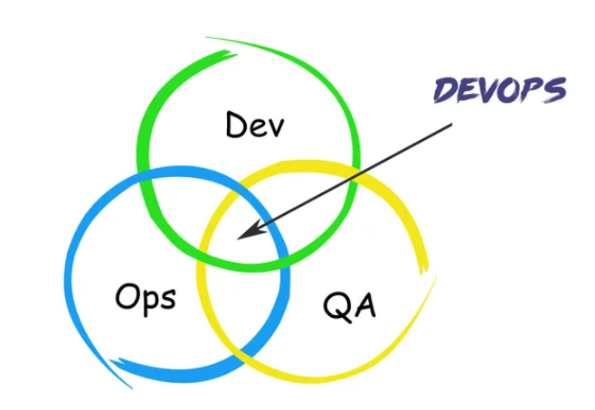
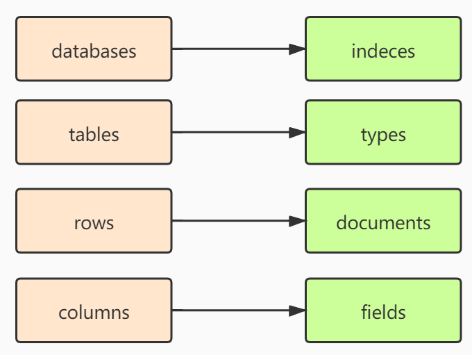

### DevOps

传统的「瀑布型」（开发、测试、发布）的流程已经不能满足快速交付的需求。

DevOps指的是：开发运维一体化，通过高度自动化工具与流程来使得软件构建、测试、发布，加快了软件交付的速度。是一种文化



### 为什么要用JWT

JWT（JSON Web Token）是一种开放标准（RFC 7519），用于在网络上安全传输信息的简洁、自包含的方式。它通常被用于身份验证和授权机制。JWT 由三部分组成：头部（Header）、载荷（Payload）和签名（Signature）。

JWT 相较于传统的基于会话（Session）的认证机制，具有以下优势：

1. 无需服务器存储状态：传统的基于会话的认证机制需要服务器在会话中存储用户的状态信息，包括用户的登录状态、权限等。而使用 JWT，服务器无需存储任何会话状态信息，所有的认证和授权信息都包含在 JWT 中，使得系统可以更容易地进行水平扩展。
2. 跨域支持：由于 JWT 包含了完整的认证和授权信息，因此可以轻松地在多个域之间进行传递和使用，实现跨域授权。
3. 适应微服务架构：在微服务架构中，很多服务是独立部署并且可以横向扩展的，这就需要保证认证和授权的无状态性。使用 JWT 可以满足这种需求，每次请求携带 JWT 即可实现认证和授权。
4. 自包含：JWT 包含了认证和授权信息，以及其他自定义的声明，这些信息都被编码在 JWT 中，在服务端解码后使用。JWT 的自包含性减少了对服务端资源的依赖，并提供了统一的安全机制。
5. 扩展性：JWT 可以被扩展和定制，可以按照需求添加自定义的声明和数据，灵活性更高。

总结来说，**使用 JWT 相较于传统的基于会话的认证机制，可以减少服务器存储开销和管理复杂性**，实现跨域支持和水平扩展，并且更适应无状态和微服务架构。

- 组成

  在紧凑的形式中，JWT包含三个由点（.）分隔的部分，JWT结构通常如下所示：`xxxxx.yyyyy.zzzzz`，它们分别是：

  - Header头

    包含2部分，1.令牌的类型，即JWT，2.加密算法类型，如HMAC SHA256或RSA，最后Base64编码

    ```
    {
     "alg": "HS256",
     "typ": "JWT"
    }
    ```

  - Payload负载

    这里放声明内容，可以说就是存放沟通讯息的地方，如

    ```
    {
     "sub": "1234567890",
     "name": "John Doe",
     "admin": true
    }
    ```

  - Signature签名

- JWT 使用

  在 Java 开发中，可以借助 JWT 工具类来方便的操作 JWT，例如 HuTool 框架中的 JWTUtil。

  HuTool 介绍：https://doc.hutool.cn/pages/JWTUtil/

###  JWT与session的区别是什么？

- 状态性

  session是存储在服务器上的，每次用户发出请求时，都会发送一个session ID，服务器用这个ID来查找对应的session。因此，session是状态的，需要服务器存储每个用户的状态信息。

  JWT是存储在客户端的，服务器不存储任何关于JWT的信息。因此，JWT是无状态的，能减少服务器的存储负担。每次用户发出请求时，都会发送JWT，服务器用这个JWT来验证用户的身份并提取出必要的信息。

- 可扩展性

  JWT保存在客户端，不依赖服务端，在分布式架构中很方便，不同的服务器可以处理同一个用户的不同请求。否则如果用session，还需要用redis存储session，这样就复杂了。

  > JWT与分布式系统：你是对的，JWT 在分布式系统中非常有用。因为 JWT 是无状态的，并将认证信息存储在令牌本身，不需要服务器去维护或验证用户的 session。这种方式在微服务架构和负载均衡等环境中非常方便，因为不同的服务器可以处理同一个用户的不同请求，而无需共享用户的 session 数据。
  >
  > Session和分布式系统：你正确地指出了，如果你要在分布式系统中使用基于 session 的认证，你需要一个共享的存储来保存所有的 session 数据，以确保每个服务器都可以访问。常见的解决方案是使用像 Redis 这样的内存数据存储系统来保存 session 数据。这增加了系统的复杂性，但也使你能够利用 session 的优点，比如服务器端控制的 session 生命周期和更丰富的授权选项。

  

- 3 Session被盗用的风险：确实，如果攻击者盗取了用户的 session ID，他们就可以冒充该用户发出请求。然而，攻击者无法直接访问到存储在服务器端 session 中的信息。需要注意的是，这个风险也适用于 JWT，如果攻击者盗取了 JWT，他们也可以冒充用户发送请求。不过，由于 JWT 是自包含的，攻击者还可以查看 JWT 的内容，**所以不能在 JWT 中存储敏感信息。**

  原文链接：https://blog.csdn.net/yxg520s/article/details/131829433


### ElasticSearch的作用是什么

ElasticSearch的目标就是**实现搜索**。在数据量少的时候，我们可以通过索引去搜索[关系型数据库](https://www.yisu.com/mysql/)中的数据，但是如果数据量很大，搜索的效率就会很低，这个时候我们就需要一种分布式的搜索引擎。Elasticsearch是一个**基于Lucene的搜索[服务器](https://www.yisu.com/)**。它提供了一个分布式多用户能力的全文搜索引擎，基于**RESTful web接口**。

你可以把ES理解为他是一个面向文档的数据库。下面用一张图描述ES和关系型数据库之间的相似之处：




### 为什么编程语言会有精度丢失问题

> 比如小数0.1输出时就不是0.1。

因为在计算机中使用的是有限位数的**二进制**表示数值，而很多**小数无法用二进制精确表示**，比如二进制无法精确表示0.1和0.2，所以就会存在精度问题。0.1的二进制表示是一个无限循环的数（0.1转化成二进制是：0.0 0011 0011……）

> 0.1怎么转换为二进制?  
>
> 0.1转化成二进制的算法：
>
> 0.1*2=0.2，取出整数部分0
>
> 0.2*2=0.4，取出整数部分0
>
> 0.4*2=0.8，取出整数部分0
>
> 0.8*2=1.6，取出整数部分1

- 比如说python，cpp是用什么办法解决精度丢失问题的？
  科学计数法

### CAP理论

CAP理论，指的是在一个[分布式系统](https://so.csdn.net/so/search?q=分布式系统&spm=1001.2101.3001.7020)中，Consistency(一致性)、Availability(可用性)、Partition Tolerance(分区容错性)，不能同时成立。

分区容错性必选，C和A最多选一个

https://blog.csdn.net/weixin_43322048/article/details/127652235


### UUID

全球唯一的标识id，由32个16进制数组成，最多有 16^32 = 2^128 = 10^34个不同的ID，也就是说若每纳秒产生1兆个UUID，要花100亿年才会将所有UUID用完。

- 作用：

  UUID的是让分布式系统中的所有元素都能有唯一的辨识信息，而不需要通过中央控制端来做辨识信息的指定。如此一来，每个人都可以创建不与其它人冲突的UUID

- 组成

  UUID由以下几部分的组合：

  - 当前日期和时间，UUID的第一个部分与时间有关，如果你在生成一个UUID之后，过几秒又生成一个UUID，则第一个部分不同，其余相同。
  - [时钟序列](https://zhida.zhihu.com/search?content_id=185592174&content_type=Article&match_order=1&q=时钟序列&zhida_source=entity)。
  - 全局唯一的IEEE[机器识别号](https://zhida.zhihu.com/search?content_id=185592174&content_type=Article&match_order=1&q=机器识别号&zhida_source=entity)，如果有网卡，从网卡MAC地址获得，没有网卡以其他方式获得。

https://zhuanlan.zhihu.com/p/438580928

