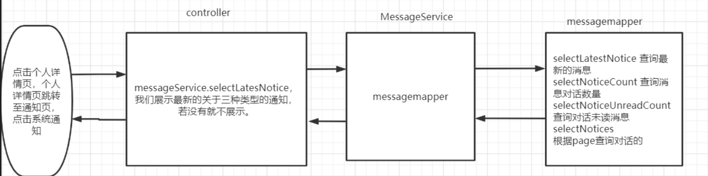
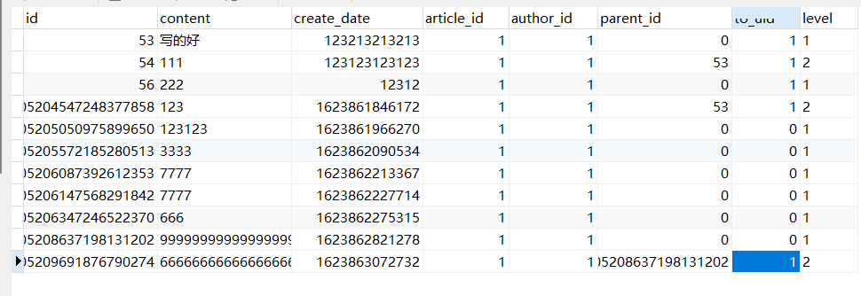

# 面试常规问题

### 工资

一个月30天（4周多2天）
	双休：22天
		日薪：	月薪：
	          	130	3K
		180	4K
		220	5K
	单休：26天
		100	2600
		150	3900
		200	5200

上班：一周以内

### 自我介绍：

面试官好，我叫张渭，目前就读于南京审计大学计算机专业，我本人对算法和计算机技术有着浓厚的兴趣，在校期间我积极参加各种竞赛，曾经获得过蓝桥杯Java研究生组全国总决赛二等奖的成绩，全国第15；本人从大二开始写个人博客，用于记录学习经历，目前总访问量已达到50W；编程语言方面，本科期间进入了程序设计校队，熟练使用C++ STL写算法，熟练使用Java写工程和算法，研究生期间，研究方向：自然语言处理，能够熟练使用Python的语法特性。本人曾经有过两份实习经历，谢谢。

1.比赛 2.博客3. 语言 4.实习

### 实习干了什么

- tiannuo

  公司：是一家做生态环境相关业务的公司

  项目：是一个环境检测的项目，实现物候云平台的开发

  我：后端开发，实现一些业务逻辑功能、图像处理方面的需要、复现论文的公式

- calix

  公司：一家做网络带宽的业务的美资企业，主要是给运营商提供接入网的解决方案

  部门：主要做云平台cloud端的工作

  我：虚拟设备sandbox的开发和测试的工作。

  > 云平台主要用于对物理设备OLT、ONT的管理、运营商、最终客户的管理，OLT是光线路终端，ONT是光网络终端，OLT设备下面会接很多ONT设备，ONT类似于家里的光猫设备
  >
  > 在实际的业务中，物理的设备都需要连接到云平台，如果每次都将大量的物理设备连接到云平台上，仅仅是用于测试的话，不管是人工成本还是经济成本，都非常高，所以有一种解决方法，是使用虚拟的设备替代物理的设备去对云平台进行测试

  

### 实习的收获：

- 熟悉了流程跟踪软件Jira的使用，wiki软件Confluence
- 计算机网络知识提升，带宽业务水平提升，Python使用更加熟练
- 对linux下的shell，vim等工具使用更加熟练，docker理解加深
- python更加熟练了

技术水平提升了，框架使用熟练，增加了实际的开发经验，增加了版本控制工具git的使用经验。
技术：定时任务，注解，quartz。opencv的java api。

### 优点：

首先，对计算机技术比较感兴趣，比赛，编程能力良好；学习能力（奖学金）
其次，做事认真负责、有耐心、抗压能力

### 缺点：

会把问题想的太复杂、有时会犹豫不决

### 反问：

工作内容

部门规模（贵公司这个岗位所在的部门有多少开发和测试人员）

技术栈

工作时间

在贵公司工作是什么样的体验？加班情况
对于我有什么建议

### 谈薪资：

期望薪水：根据实际情况，要比心里预期高一点
不好意思，这个薪水可能和我预期有点差距，我可能无法接受
不要痛快接受，去夸奖公司环境，hr能力

回答自己会的问题
1.总分的思想

### 回答不会的问题

：不好意思，这个知识点我之前没接触过，但是我自学能力还是有的，之前学过相关的XXX，如果公司需要，我相信能够在很短的时间内学会。

### 开发中遇到的问题/Bug

- 概括：我遇到印象最深的一个问题是在做定时任务功能的时候，使用到了第三方定时任务管理框架Quartz

- 问题描述

  SpringBoot整合Quartz后，定时任务对象job中需要将数据持久化到数据库，所以需要在job类中注入的业务service，使用@Autowired获取这个service对象报了空指针异常。

- 原因分析

  起初以为是没加@Component导致的原因，后来发现没那么简单。

  **定时任务对象在spring容器加载时候，能够注入bean，但是调度时，每一次job对象会重新创建，此时就是导致已经注入的service丢失，因此报空指针异常。**

- 解决方法

  实现ApplicationContextAware，就可以拿到应用上下文ApplicationContext，也就是拿到Spring容器，再从中获取这个service.

- 常见问题

  - Spring注入流程

    具体的，项目启动时，service的bean是能够被注入到Spring容器中，并且在job类中的@Autowired也能将容器的service注入进去，但是因为quartz每一次调度的时候，都会重新去创建一个新的job对象，从而导致这个job对象中的service没有被注入进去

  - 能手动应用上下文中拿到，为什么不能自动拿到

    因为quartz每次都会重新创建一个job对象。

    这个对象不被Spring创建，而是由第三方框架quartz创建
    
  - 为什么要用Quartz？为什么不用Timer？

    Timer也能进行调度，但是是单线程的（性能、抛异常会阻塞所有任务），并且Timer不支持复杂定时规则（星期天上午8点），Quartz的优势：是基于多线程的

  - 用Quartz解决了什么问题？

    定时任务何时执行

- 进阶

  - 方法2：使用自定义的JobFactory替代quartz默认的

    job对象的创建由这个工厂创建，我们在创建这个对象的时候可以让他支持注入bean的操作，通过 `AutowireCapableBeanFactory` 的autowireBean方法将创建好的 Job 对象，中的bean能够通过@autowired注入

    ```java
    @Configuration
    public class CustomJobFactory extends AdaptableJobFactory {
        @Autowired
        private AutowireCapableBeanFactory autowireCapableBeanFactory;
    
        @Override
        protected Object createJobInstance(TriggerFiredBundle bundle) throws Exception {
            Object jobInstance = super.createJobInstance(bundle);
            autowireCapableBeanFactory.autowireBean(jobInstance);
            return jobInstance;
        }
    }
    ```

    https://zhuanlan.zhihu.com/p/146060950

  - 方法3：Spring Boot 2.x版本的支持

    Spring Boot 2.x 版本通过 `spring-boot-starter-quartz` 集成之后，默认就是可以在 Job 对象中使用 `@Autowired` 的，并且实现的思路和我们是一致的，通过 `AutowireCapableBeanFactory` 将 Job 对象放入 Spring 容器中才是正确做法。
  
- 定时任务各种解决方案

  https://www.jb51.net/program/288721deb.htm

  Java 中常用的定时调度框架有以下几种：

  - Timer：JDK标准库中提供的一个定时调度工具，可以在指定的时间点或时间间隔内执行任务。

    - 定时规则过于简单

      不支持cron，只能设置多久执行一次

    - 单线程

      Timer有且仅有一个线程去执行定时任务，串行地执行所有任务，如果存在多个任务，且任务时间过长，会导致性能很差。

    - 当任务抛出异常时的缺陷

      因为都是串行的，如果TimerTask抛出RuntimeException，Timer会停止所有任务的运行。

  - ScheduledExecutorService：基于线程池的定时任务调度框架。

    不支持cron表达式，与 Timer 相比，支持多线程和异常处理机制较强。

  - **@Scheduled**：Spring 框架中提供的一个定时调度工具，例如，可以用于执行定时任务、异步任务等。优点：支持多种时间表达式（cron表达式）、操作简单，缺点：无法调度

  - Quartz：一个用于定时调度的开源框架，可以在指定的时间点或时间间隔内自动执行任务。

    支持cron表达式、支持多线程

### 实习项目

#### 警报、通知模块

Alarm

- 方案1：设备坏了（ONT Missing）
  1. 设备坏了，存入数据库
  2. 定时查数据库，查询到后，触发警报事件、通知事件
  3. 每次请求后，postHandle更新通知数量（具体是放在http请求头中？？？？）
  4. 编写接口，查询报警业务、通知业务
- 方案2：数据变更
  1. 数据变更了，达到了警报的要求，生产警报事件、通知事件，放入kafka
  2. kafka消费警报事件、通知事件
  3. 每次请求后，postHandle更新通知数量
  4. 编写接口，查询报警业务、通知业务

#### 自定义配置通知模块

客户自定义配置Alarm

#### 自动通知功能



- 每一次访问请求后，都拦截一下，执行一下通知的更新

  ```
  @Component
  public class MessageInterator implements HandlerInterceptor {
      @Autowired
      private HostHolder hostHolder;
      @Autowired
      private MessageService messageService;
      @Override
      public void postHandle(HttpServletRequest request, HttpServletResponse response, Object handler, ModelAndView modelAndView) throws Exception {
  
              int letterUnreadCount = messageService.findLetterUnreadCount(user.getId(), null);
              int noticeUnreadCount = messageService.findNoticeUnreadCount(user.getId(), null);
              int unreadCount = letterUnreadCount+noticeUnreadCount;
              modelAndView.addObject("unreadCount",unreadCount);
          }
      }
  }
  
  ```

-  问题

  - 为什么要用消息队列

    - 流量削峰

      客户是运营商，每个运营商有很多最终用户，消费者，多家运营商，所以平台的用户数量有一定的，防止某一个时段用户过多导致服务器崩溃。

    - 应用解耦

    - 吞吐量提升

  - 为什么要用kafka

    - 性能最好的消息队列
    - 吞吐量大

  - 为什么kafka快

### 个人项目

#### 登录

使用JWT+Redis实现用户登录，

- login业务具体步骤：

  1. 检查参数是否合法
  2. 根据用户名和密码去user中查询是否存在
  3. 不存在，登录失败
  4. 存在，使用JWT生成TOKEN 返回给前端
  5. 将token放入redis中，redis存储 key为token值为user对象信息，设置过期时间

- 问题

  - JWT和Token区别

    一个存数据库，一个不存，并且存在redis中，并返回给用户

  - 为什么要将信息存到redis中

    为了登录拦截器中直接获取用户信息，并存到threadlocal中

  - JWT token存在哪里

    JWT token放在HTTP请求头中，`Authorization`参数
    
  - JWT登录的流程
  
    

#### 登录拦截器

每次访问需要登录的资源的时候，都需要在代码中进行判断，那么可不可以统一进行登录判断呢？使用拦截器，进行登录拦截

handler包下建立LoginInterceptor拦截器

- 步骤
  1. 判断接口请求是否为HandlerMethod（Controller方法）
  2. 判断token是否为null，空则登录
  3. 检查token是否真实存在（JwtUtil）
  4. 认证成功就应该直接放行
  5. 根据token从redis中获取用户信息，将用户信息存储在Threadlocal中，这样我就能在Controller中直接获取用户信息了

- 问题

  - 为什么用Threadlocal存用户信息

    - **减少参数传递**：在复杂的Web应用程序中，用户信息（如用户ID、用户名、权限等）可能需要跨越多层方法调用。如果每次调用都需要将用户信息作为参数传递，那么代码会变得非常繁琐和难以维护。

    - 线程安全

      通过使用`ThreadLocal`，每个线程都维护了自己的用户信息副本，从而避免了这些问题。

  - 为什么要登录拦截

    每次访问需要登录的资源的时候，都需要在代码中进行判断，重复的工作
    
  - JWT登录拦截流程
  
    通过验证JWT token来进行校验，和Redis无关（为了threadlocal）

### 校园论坛

#### 表结构与关联

校园论坛

- 管理员admin

- 权限表permission

- 管理员权限admin_permission

- 用户表user

- 文章表article

  文章title、summary、浏览量

  作者author_id、文章内容body_id、分类category_id

- 文章体article_body

- 分类表category

- 标签表tag

- 文章和标签article_tag（多对多）

- 评论表

  评论内容、评论文章id、评论人id、父评论id、评论等级、评论对象id

  


#### 仿牛客项目面试题

https://blog.csdn.net/huahuahuaz/article/details/125554369


#### 点赞关注功能（set）

点赞、关注可以用set，也可以用zset。

具体就是每一个帖子一个set，根据Util得到帖子a的set，值存放所有点赞的用户id

#### 排行榜功能（热帖）

结合Redis和Quartz来实时计算和更新论坛热帖排行。

- 帖子分数

  根据帖子的加精状态、评论数量和点赞数量等权重计算得出，然后更新到数据库和搜索引擎。

- 流程

  当用户对帖子A进行点赞、收藏、评论等操作时，帖子A会被放入Redis的一个Set中，表示当前帖子A的分数需要重新计算，定时任务通过Quartz每5分钟执行一次分数更新，计算帖子的分数并更新（找到刚刚那个set，拿出所有的帖子，重新计算分数），最后存入分数zset中。

- 调用

  给出接口getPost(type = “hot”)，根据类型进行查询，访问接口时同步数据。

- 参考

  https://blog.csdn.net/weixin_46133743/article/details/118855123

  https://blog.csdn.net/weixin_42033436/article/details/117649839