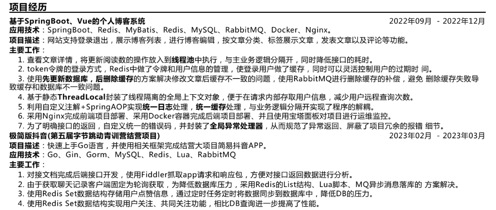
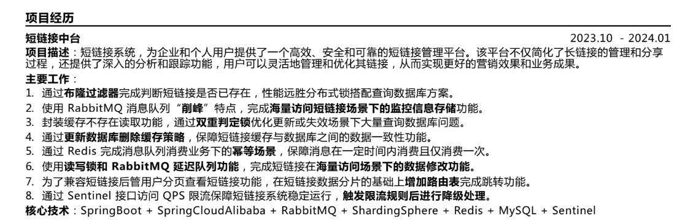
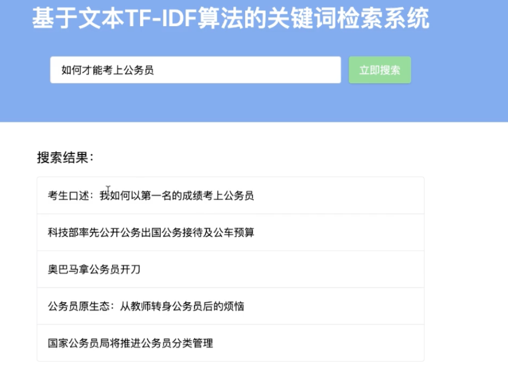

# **简历优化**

- 

  

改简历 ？融入技术：慢SQL优化、设计模式

## **项目经历**

### 抖音青训营项目

### 微型搜索引擎

​	对于给定文本库，用户提交检索关键词，在文本库中查询与检索关键词最相关的 k 个文本，并根据文本与检索关键词的相关度，对这 k 个文本进行排序，将排序后的结果返回给用户。

​	（1）利用 TF-IDF 模型提取关键词，为文本库中的文本倒排索引，提高查询性能

​	（2）使用jieba分词和加载停用词表

​	（3）使用Flask实现后端业务逻辑，使用Vue实现基本前端功能

​		

- 用GPT生成前端代码、Flask代码

​	 清华大学数据集

### 代码溯源分析系统

队长

### 手势识别系统

### 婴儿哭声识别

### **7天rpc**

​	**1.服务发现和注册**

​	**2.负载均衡**

​	GeeRPC 选择从零实现 Go 语言官方的标准库 net/rpc，并在此基础上，新增了协议交换(protocol exchange)、注册中心(registry)、服务发现(service discovery)、负载均衡(load balance)、超时处理(timeout processing)等特性。

### **7天分布式cache**

​	1.LRU

​	2.一致性哈希

​	3.缓存击穿、protobuf

## **论文**

​	《基于对抗训练和迁移学习的命名实体识别方法研究》

​		

​	《互联网+环境应急响应模式》

​	知识图谱构建研究

## **软著2个**

​	《基于Java的网上书店设计与实现》

​	《停车场寻车系统》

## 知识点扩充

**3设计模式**

复习、学习剩下的设计模式

怎么加到简历的项目/实习中去？看牛客简历、看代码中有没有

## 其他

### github迁移

1. [**tiny-search-engine**](https://gitee.com/weiambt/tiny-search-engine)

[**https://blog.csdn.net/Supreme7/article/details/136657574?ops_request_misc=%257B%2522request%255Fid%2522%253A%2522F4F54ADF-76ED-4B7A-A4BD-1433071568F5%2522%252C%2522scm%2522%253A%252220140713.130102334.pc%255Fblog.%2522%257D&request_id=F4F54ADF-76ED-4B7A-A4BD-1433071568F5&biz_id=0&utm_medium=distribute.pc_search_result.none-task-blog-2~blog~first_rank_ecpm_v1~rank_v31_ecpm-6-136657574-null-null.nonecase&utm_term=git&spm=1018.2226.3001.4450**](https://blog.csdn.net/Supreme7/article/details/136657574?ops_request_misc=%7B%22request%5Fid%22%3A%22F4F54ADF-76ED-4B7A-A4BD-1433071568F5%22%2C%22scm%22%3A%2220140713.130102334.pc%5Fblog.%22%7D&request_id=F4F54ADF-76ED-4B7A-A4BD-1433071568F5&biz_id=0&utm_medium=distribute.pc_search_result.none-task-blog-2~blog~first_rank_ecpm_v1~rank_v31_ecpm-6-136657574-null-null.nonecase&utm_term=git&spm=1018.2226.3001.4450)

​	