### 2023上半年周赛题目总结

https://leetcode.cn/circle/discuss/v2RXSN/

#### 一、技巧类题目

##### 双指针

子数组/滑动窗口部分问题汇总：https://leetcode.cn/circle/discuss/iIVPQc/

双指针时使用滑动窗口，不是求区间最大值，就是求个数，一般题目限制是最多X个

1. [2730. 找到最长的半重复子字符串](https://leetcode.cn/problems/find-the-longest-semi-repetitive-substring/)

> 给你一个下标从 **0** 开始的字符串 `s` ，这个字符串只包含 `0` 到 `9` 的数字字符。
>
> 如果一个字符串 `t` 中至多有一对相邻字符是相等的，那么称这个字符串 `t` 是 **半重复的** 。例如，`0010` 、`002020` 、`0123` 、`2002` 和 `54944` 是半重复字符串，而 `00101022` 和 `1101234883` 不是。
>
> 请你返回 `s` 中最长 **半重复** 子字符串的长度。
>
> 一个 **子字符串** 是一个字符串中一段连续 **非空** 的字符。
>
> 1502：因为n很小所以分很低

本题O（n）的解法

```
class Solution:
    def longestSemiRepetitiveSubstring(self, s: str) -> int:
        n = len(s)
        left = 0
        ans = 1
        cnt = 0
        for right,x in range(1,n):
            x = s[right]
            if x==s[right-1]:
                if cnt==1:
                    while left<n and s[left]!=s[left+1]:
                        left+=1
                    left+=1
                else: cnt+=1
            ans = max(ans,right-left+1)
        return ans
```


 双指针

2. [2653. 滑动子数组的美丽值](https://leetcode.cn/problems/sliding-subarray-beauty/)（双指针里藏着暴力）

> 给你一个长度为 `n` 的整数数组 `nums` ，请你求出每个长度为 `k` 的子数组的 **美丽值** 。
>
> 一个子数组的 **美丽值** 定义为：如果子数组中第 `x` **小整数** 是 **负数** ，那么美丽值为第 `x` 小的数，否则美丽值为 `0` 。
>
> 请你返回一个包含 `n - k + 1` 个整数的数组，**依次** 表示数组中从第一个下标开始，每个长度为 `k` 的子数组的 **美丽值** 。
>
> - 子数组指的是数组中一段连续 **非空** 的元素序列。
> - `1 <= n <= 105`
> - `-50 <= nums[i] <= 50 `
>
> 1786

本题其实藏着一个枚举，注意题目数据范围

```
class Solution:
    def getSubarrayBeauty(self, nums: List[int], k: int, idx: int) -> List[int]:
        n = len(nums)
        mp = Counter()
        ans = []
        left = 0
        for right in range(n):
            if right-k+1>left:
                mp[nums[left]]-=1
                left+=1
            mp[nums[right]]+=1
            if right>=k-1:
                cnt = 0
                for x in range(-50,51,1):
                    if mp[x]:
                        cnt+=mp[x]
                        if cnt>=idx:
                            ans.append(x if x<0 else 0)
                            break
        return ans
```

3. [2537. 统计好子数组的数目](https://leetcode.cn/problems/count-the-number-of-good-subarrays/)（点对、最少）

> 给你一个整数数组 `nums` 和一个整数 `k` ，请你返回 `nums` 中 **好** 子数组的数目。
>
> 一个子数组 `arr` 如果有 **至少** `k` 对下标 `(i, j)` 满足 `i < j` 且 `arr[i] == arr[j]` ，那么称它是一个 **好** 子数组。
>
> **子数组** 是原数组中一段连续 **非空** 的元素序列。
>
> 1892

有思维，双指针也有略微不同

想清楚窗口中的点对是如何变化的？

- 如果当前窗口中已经有c个元素x了，再来一个x，会增加c对
- 如果当前窗口中已经有c个元素x了，去掉一个x，会减少c-1对

此外，如果小区间是好子数组，那么所有包含它的大区间一定都满足题意，所以找到临界点，再把所有固定了右端点时的大区间的左端点全部加上


    class Solution:
        def countGood(self, nums: List[int], k: int) -> int:
            n = len(nums)
            mp = Counter()
            cnt = ans = 0
            left = 0
            # 枚举right作为好子数组的右端点
            for right in range(n): 
                cnt += mp[nums[right]]
                mp[nums[right]]+=1
                if cnt>=k:
                    ans+=1
            # 找到左端点的最大值，那么前面的点都满足
            while cnt - (mp[nums[left]]-1)>=k: 
                cnt -= mp[nums[left]]-1
                mp[nums[left]]-=1
                left+=1
            ans += left # 大的区间一定也是好子数组
        return ans

4. [2555. 两个线段获得的最多奖品](https://leetcode.cn/problems/maximize-win-from-two-segments/)（两个不同子数组和的最大值）

> 在 **X轴** 上有一些奖品。给你一个整数数组 `prizePositions` ，它按照 **非递减** 顺序排列，其中 `prizePositions[i]` 是第 `i` 件奖品的位置。数轴上一个位置可能会有多件奖品。再给你一个整数 `k` 。
>
> 你可以选择两个端点为整数的线段。每个线段的长度都必须是 `k` 。你可以获得位置在任一线段上的所有奖品（包括线段的两个端点）。注意，两个线段可能会有相交。
>
> - 比方说 `k = 2` ，你可以选择线段 `[1, 3]` 和 `[2, 4]` ，你可以获得满足 `1 <= prizePositions[i] <= 3` 或者 `2 <= prizePositions[i] <= 4` 的所有奖品 i 。
>
> 请你返回在选择两个最优线段的前提下，可以获得的 **最多** 奖品数目。
>
> 2081

双指针好题+简单dp

```
class Solution:
    def maximizeWin(self, prizePositions: List[int], k: int) -> int:
        # 最多奖品个数 = 双指针区间长度最大值
        # 线段长度必须是k：只需要prizePositions[right]-prizePositions[left]<=k即可
        n = len(prizePositions)
        ans = 0
        left = 0
        res = [0]*n # res[i]表示前i个奖品中选择的最大奖品数
        for right in range(n):
            while prizePositions[right]-prizePositions[left]>k:
                left+=1
            # 当前区间全选，并且加上前left-1个奖品中的最佳选择
            ans = max(ans,right-left+1 + (res[left-1] if left else 0))
            res[right] = max(res[right-1],right-left+1)
        return ans
```

5. [2576. 求出最多标记下标](https://leetcode.cn/problems/find-the-maximum-number-of-marked-indices/)

> 给你一个下标从 **0** 开始的整数数组 `nums` 。
>
> 一开始，所有下标都没有被标记。你可以执行以下操作任意次：
>
> - 选择两个 **互不相同且未标记** 的下标 `i` 和 `j` ，满足 `2 * nums[i] <= nums[j]` ，标记下标 `i` 和 `j` 。
>
> 请你执行上述操作任意次，返回 `nums` 中最多可以标记的下标数目。
>
> 1843

本题有两个方法：1.二分答案 2. 双指针

细节：ans一定是偶数，把题目转化成求k对

难点：本题结论：**从小到大排序后，如果存在 k 对匹配，那么一定可以让"最小的 k个数"和"最大的 k个数"匹配。**

解释：左边选的数越大，越无法匹配，右边同理，所以猜一手排序后最小的k个和最大的k个匹配

> 证明：
> 链接：https://leetcode.cn/problems/find-the-maximum-number-of-marked-indices/solutions/2134078/er-fen-da-an-pythonjavacgo-by-endlessche-t9f5/

所以只需要看最小的 k 个数和最大的 k 个数能否匹配

双指针解法：

```
class Solution:
    def maxNumOfMarkedIndices(self, nums: List[int]) -> int:
        n = len(nums)
        nums.sort()
        ans = 0
        right_start = n//2 if n%2==0 else (n//2+1)
        left = 0
        for x in enumerate(nums[right_start:]):
            if 2*nums[left] <= x:
                left+=1
                ans += 1
        return ans*2
```

##### 后缀枚举

[2718. 查询后矩阵的和](https://leetcode.cn/problems/sum-of-matrix-after-queries/)

```
class Solution:
    def matrixSumQueries(self, n: int, queries: List[List[int]]) -> int:
        hang = set()
        lie = set()
        ans = 0
        for i in range(len(queries)-1,-1,-1):
            op,idx,val = queries[i][0],queries[i][1],queries[i][2]
            if op==0 and idx not in hang:
                ans += (n-len(lie))*val
                hang.add(idx)
            elif op==1 and idx not in lie:
                ans += (n-len(hang))*val
                lie.add(idx)
            print(ans)
        return ans
```

##### 二分

1. [2602. 使数组元素全部相等的最少操作次数](https://leetcode.cn/problems/minimum-operations-to-make-all-array-elements-equal/)

> 给你一个正整数数组 `nums` 。
>
> 同时给你一个长度为 `m` 的整数数组 `queries` 。第 `i` 个查询中，你需要将 `nums` 中所有元素变成 `queries[i]` 。你可以执行以下操作 **任意** 次：
>
> - 将数组里一个元素 **增大** 或者 **减小** `1` 。
>
> 请你返回一个长度为 `m` 的数组 `answer` ，其中 `answer[i]`是将 `nums` 中所有元素变成 `queries[i]` 的 **最少** 操作次数。
>
> **注意**，每次查询后，数组变回最开始的值。
>
> 1903

排序+二分+前缀和

本题要用logn的时间计算操作次数，需要想到二分的做法，对于次数，需要站在整个数组的角度考虑，初始数组，目标数组

```
class Solution:
    def minOperations(self, nums: List[int], queries: List[int]) -> List[int]:
        n = len(nums)
        nums.sort()
        s = [0]*(n+1)
        for i in range(n):
            s[i] = s[i-1]+nums[i]
        ans = []
        for q in queries:
            idx = bisect.bisect_right(nums,q)
            cnt = s[n-1]-s[idx-1] - (n-idx)*q
            cnt += idx*q - s[idx-1]
            ans.append(cnt)
        return ans
```

3. 


##### 二分答案

二分答案的前提：单调性，如果ans = x满足要求，那么当ans < x的所有情况也都满足。

二分答案的本质：用logn把中间的部分情况全部算出来

思路：看到【求最小的最大值】【求最大的最小值】就要想到二分答案，这是一个固定的套路。

为什么？一般来说，二分的值越大，越能/不能满足要求；二分的值越小，越不能/能满足要求，有单调性，可以二分。

> 例子：让你求完成这个任务的最少花费时间？
>
> 假设能在t时间完成这个任务，那么t+1,t+2,...也能完成这个任务，同理，如果在t时间完不成，那么t-1,t-2,...也完不成，所以满足单调性，所以可以二分答案。
>
> 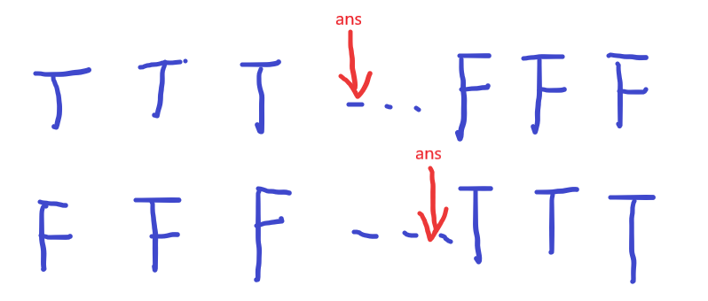

类似的题目在先前的周赛中出现过多次，例如：


1. [2576. 求出最多标记下标](https://leetcode.cn/problems/find-the-maximum-number-of-marked-indices/)（点对最大个数）

> 给你一个下标从 **0** 开始的整数数组 `nums` 。
>
> 一开始，所有下标都没有被标记。你可以执行以下操作任意次：
>
> - 选择两个 **互不相同且未标记** 的下标 `i` 和 `j` ，满足 `2 * nums[i] <= nums[j]` ，标记下标 `i` 和 `j` 。
>
> 请你执行上述操作任意次，返回 `nums` 中最多可以标记的下标数目。
>
> 1843

本题有两个方法：1.二分答案 2. 双指针

本题有结论，要靠猜。在上文双指针中有介绍该题

二分答案解法：

```
先枚举对数k，再check是否前后能凑出k对
```

2. [2594. 修车的最少时间](https://leetcode.cn/problems/minimum-time-to-repair-cars/)

> 给你一个整数数组 `ranks` ，表示一些机械工的 **能力值** 。`ranksi` 是第 `i` 位机械工的能力值。能力值为 `r` 的机械工可以在 `r * n2` 分钟内修好 `n` 辆车。
>
> 同时给你一个整数 `cars` ，表示总共需要修理的汽车数目。
>
> 请你返回修理所有汽车 **最少** 需要多少时间。
>
> **注意：**所有机械工可以同时修理汽车。
>
> - `1 <= ranks.length <= 105`
> - `1 <= ranks[i] <= 100`
> - `1 <= cars <= 106`
>
>  1915

搞清楚，多个工人可以一起修

```python
class Solution:
    def repairCars(self, ranks: List[int], cars: int) -> int:
        # 二分答案t
        # 假设修改所有汽车需要t的时间，检查t时间内能否修好cars辆车
        # 如何检查？
        # 注意：每个工人可以同时工作而不是串行
        # 一个工人t时间内最多能修多少车？ sqrt(t//r)
        # 那么n个工人t时间内最多共能修多少车？求和即可，记作sum
        # 所以检查：sum>=cars
        def check(t):
            s = 0
            for r in ranks:
                s += floor(sqrt(t//r)) # floor()对浮点数下取整
            return s>=cars
        n = len(ranks)
        l,r = 1,min(ranks)*cars*cars
        while l<r:
            mid = l+r>>1
            if check(mid):
                r = mid
            else:
                l = mid+1
        return l
```

时间复杂度O（nlogn）

优化：上面的check函数可以优化，由于ranks[i]<=100，也就是1e5个数的值域是1~100，而且我们check的时候只关心每个元素的能力值，所以，可以对于能力值相同的人可以分到同一组，用哈希表记录个数即可，这样时间可以优化很多，从1e5的枚举优化成了100次枚举

```
        mp = Counter()
        for r in ranks:
            mp[r]+=1
        def check(t):
            s = 0
            for r in mp:
                s += floor(sqrt(t//r))*mp[r]
            return s>=cars
```

题单：

```
875. 爱吃香蕉的珂珂
2187. 完成旅途的最少时间
2226. 每个小孩最多能分到多少糖果
1552. 两球之间的磁力
2439. 最小化数组中的最大值
2513. 最小化两个数组中的最大值
2517. 礼盒的最大甜蜜度
2528. 最大化城市的最小供电站数目
```

3. [2560. 打家劫舍 IV](https://leetcode.cn/problems/house-robber-iv/)(二分+dp)

> 沿街有一排连续的房屋。每间房屋内都藏有一定的现金。现在有一位小偷计划从这些房屋中窃取现金。
>
> 由于相邻的房屋装有相互连通的防盗系统，所以小偷 **不会窃取相邻的房屋** 。
>
> 小偷的 **窃取能力** 定义为他在窃取过程中能从单间房屋中窃取的 **最大金额** 。
>
> 给你一个整数数组 `nums` 表示每间房屋存放的现金金额。形式上，从左起第 `i` 间房屋中放有 `nums[i]` 美元。
>
> 另给你一个整数 `k` ，表示窃贼将会窃取的 **最少** 房屋数。小偷总能窃取至少 `k` 间房屋。
>
> 返回小偷的 **最小** 窃取能力。
>
> - `1 <= nums.length <= 105`
> - `1 <= nums[i] <= 109`
> - `1 <= k <= (nums.length + 1)/2`
>
> 2081

本题难在如何写出一个O（n）的dp，由于限制了选择的房屋的个数k，所以正常写是O(n^2)，本题的dp思路非常非常妙。

dp[i] 表示前i个中选，不超过mx的最大个数,最后判断是否dp[n-1]>=k

dp[i] = max(dp[i-1],dp[i-2]+(nums[i]<=mx))

```
class Solution:
    def minCapability(self, nums: List[int], k: int) -> int:
        # 判断nums中是否存在一种选法，使得窃取能力是mx
        # 选择k个数，使得max（...） = mx，此外这些数不相邻
        # dp[i] 表示前i个中选，不超过mx的最大个数,最后判断是否dp[n-1]>=k
        n = len(nums)
        def check(mx):
            dp = [0]*(n+1)
            for i in range(n):
                dp[i] = dp[i-1]
                if nums[i]<=mx:
                    dp[i] = max(dp[i],dp[i-2]+1)
            return dp[n-1]>=k

        l,r = 0,10**9
        while l<r:
            mid = l+r>>1
            if check(mid):
                r = mid
            else:
                l = mid+1
        return l
```

此外，需要思考为什么不需要判断最后的答案是否包含mx？

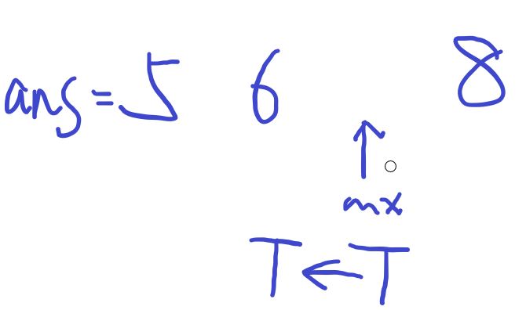

当mx = 7时，7不在nums中，此时<=7时的个数能选出来==k，满足题意，由于7不在Nums中，所以相当于<=6的情况也是True。False的情况也是一样，所以最后一定是落在nums中的值的位置。

##### 前后缀预处理

- 统计上升四元组(特殊枚举+特殊前后缀预处理+dp)

  > [2552. 统计上升四元组](https://leetcode.cn/problems/count-increasing-quadruplets/)
  >
  > 给你一个长度为 `n` 下标从 **0** 开始的整数数组 `nums` ，它包含 `1` 到 `n` 的所有数字，请你返回上升四元组的数目。
  >
  > 如果一个四元组 `(i, j, k, l)` 满足以下条件，我们称它是上升的：
  >
  > - `0 <= i < j < k < l < n` 且
  > - `nums[i] < nums[k] < nums[j] < nums[l]` 。
  >
  > 2433

  枚举中间两个数，然后找左右两边比它大/小的数的个数

  本题的值域是个全排列，所以可以不用树状数组。

  本题的难点是**前后缀预处理**，这里的预处理比较特殊，有难度，像是动态规划

  

  枚举 j和 k 这两个**中间**的，会更容易计算。

  ```python
  class Solution:
      def countQuadruplets(self, nums: List[int]) -> int:
          # 1.找k右边的比nums[j]大的数的个数
          # 2.找j左边的比nums[k]小的数的个数
          # 乍一看每个计算内部都需要两个变量，需要在枚举的时候才能求出来。比如求greater，其实由于nums是一个n的全排列，那么当nums[k+1] = x，那么此时,k右边的，比1~x-1大的数的个数都+1。或者说，当nums[k+1] = x，此时x对其他数的贡献就是greater[k][1~x-1]++
          n = len(nums)
          # greater[i][x]表示i右边的，比x大的数的个数
          greater = [[0]*(n+1) for _ in range(n+1)]
          less = [[0]*(n+1) for _ in range(n+1)]
          for k in range(n-2,1,-1):
              greater[k] = greater[k+1][:] # 上一时刻的状态要转移
              for x in range(1,nums[k+1]):
                  greater[k][x] += 1
          ans = 0
          for j in range(1,n-2,1):
              less[j] = less[j-1][:]
              for x in range(nums[j-1]+1,n+1):
                  less[j][x] += 1
              for k in range(j+1,n-1,1):
                  if nums[j]>nums[k]:
                      ans += less[j][nums[k]] * greater[k][nums[j]]
          return ans
  ```

  对于前后缀预处理的dp,可能上面的代码不好理解，下面的代码更好理解

  ```
  greater[k][x] = greater[k+1][x] + (nums[k+1]>x)
  ```

  详细代码如下：

  ```
  class Solution:
      def countQuadruplets(self, nums: List[int]) -> int:
          n = len(nums)
          # greater[i][x]表示i右边的，比x大的数的个数
          greater = [[0]*(n+1) for _ in range(n+1)]
          less = [0]*(n+1)
          for k in range(n-2,1,-1):
              for x in range(1,n+1):
                  greater[k][x] = greater[k+1][x] + (nums[k+1]>x)
          ans = 0
          for j in range(1,n-2,1):
              for x in range(1,n+1):
                  less[x] = less[x] + (nums[j-1]<x)
              for k in range(j+1,n-1,1):
                  if nums[j]>nums[k]:
                      ans += less[nums[k]] * greater[k][nums[j]]
          return ans
  ```

  但是这个代码在py里会TLE，可能用其他代码写不会TLE

  这个技巧在去年的周赛题 [2242. 节点序列的最大得分](https://leetcode.cn/problems/maximum-score-of-a-node-sequence/) 出现过。


> 还有三题没做
>
> 2616.最小化数对的最大差值	2155	二分答案+贪心
> 2528.最大化城市的最小供电站数目	2236	二分答案+前缀和+差分+贪心
> 2565.最少得分子序列	2432	前后缀分解

#### 二、动态规划

1. [2606. 找到最大开销的子字符串](https://leetcode.cn/problems/find-the-substring-with-maximum-cost/)

> 给你一个字符串 `s` ，一个字符 **互不相同** 的字符串 `chars` 和一个长度与 `chars` 相同的整数数组 `vals` 。
>
> **子字符串的开销** 是一个子字符串中所有字符对应价值之和。空字符串的开销是 `0` 。
>
> **字符的价值** 定义如下：
>
> - 如果字符不在字符串 chars中，那么它的价值是它在字母表中的位置（下标从1开始）。
>   - 比方说，`'a'` 的价值为 `1` ，`'b'` 的价值为 `2` ，以此类推，`'z'` 的价值为 `26` 。
> - 否则，如果这个字符在 `chars` 中的位置为 `i` ，那么它的价值就是 `vals[i]` 。
>
> 请你返回字符串 `s` 的所有子字符串中的最大开销。
>
> 1422

dp[i]表示以s[i]结尾的子数组的最大开销

状态划分：s[i]必选，此时的划分就是0~i-1的前缀选或不选，如果选，就是dp[i-1]+val[i]，如果不选就是val[i]

```
class Solution:
    def maximumCostSubstring(self, s: str, chars: str, vals: List[int]) -> int:
        ans = 0
        dp = [0]*(len(s)+1)
        for i,x in enumerate(s):
            val = ord(x)-ord('a')+1 if x not in chars else vals[chars.index(x)]
            dp[i] = max(dp[i-1] + val,val)
            ans = max(ans,dp[i])
        return ans
```

2. [2707. 字符串中的额外字符](https://leetcode.cn/problems/extra-characters-in-a-string/)

   > 给你一个下标从 **0** 开始的字符串 `s` 和一个单词字典 `dictionary` 。你需要将 `s` 分割成若干个 **互不重叠** 的子字符串，每个子字符串都在 `dictionary` 中出现过。`s` 中可能会有一些 **额外的字符** 不在任何子字符串中。
   >
   > 请你采取最优策略分割 `s` ，使剩下的字符 **最少** 。
   >
   > - `1 <= s.length <= 50`
   > - `1 <= dictionary.length <= 50`
   >
   > 1736

   想清楚dp[i]表示前i个的最小开销，最后的答案是dp[n-1]

   状态划分：枚举所有字典中的字符串d，是否能找到某一个d，使得与第i个元素为结尾某个后缀串相等，相等则划分。

   ```
   class Solution:
       def minExtraChar(self, s: str, dictionary: List[str]) -> int:
           n = len(s)
           dp = [inf]*(n+1)
           dp[-1] = 0
           for i,x in enumerate(s):
               dp[i] = dp[i-1]+1
               for d in dictionary:
                   if i+1>=len(d) and d == s[i-len(d)+1:i+1]:
                       dp[i] = min(dp[i],dp[i-len(d)])
           return dp[n-1]
   ```

3. [2585. 获得分数的方法数](https://leetcode.cn/problems/number-of-ways-to-earn-points/)

   > 考试中有 `n` 种类型的题目。给你一个整数 `target` 和一个下标从 **0** 开始的二维整数数组 `types` ，其中 `types[i] = [counti, marksi] `表示第 `i` 种类型的题目有 `counti` 道，每道题目对应 `marksi` 分。
   >
   > 返回你在考试中恰好得到 `target` 分的方法数。由于答案可能很大，结果需要对 `109 +7` 取余。
   >
   > **注意**，同类型题目无法区分。
   >
   > - 比如说，如果有 `3` 道同类型题目，那么解答第 `1` 和第 `2` 道题目与解答第 `1` 和第 `3` 道题目或者第 `2` 和第 `3` 道题目是相同的。
   >
   > 1910

   多重背包裸题

   ```
   class Solution:
       def waysToReachTarget(self, target: int, types: List[List[int]]) -> int:
           mod = 10**9+7
           n = len(types)
           m = 1000
           dp = [[0]*(m+1) for _ in range(n+1)]
           dp[-1][0] = 1
           for i in range(n):
               for j in range(target+1):
                   cnt,point = types[i][0],types[i][1]
                   for k in range(cnt+1):
                       if k*point <= j:
                           dp[i][j] += dp[i-1][j-k*point]
           return dp[n-1][target]%mod
   ```

   注意本题不能二进制优化，原因：

   > 不能二进制优化是因为题目说"同类型的题目无法区分"。对于只有两道题的题型，比如样例一的第三类题，二进制优化后是[3,3]。根据题意，只有三种选法，0分，3分，6分。二进制优化后有四种选法，即 都不选，选第一题，选第二题，两题都选。所以二进制优化之后答案会多出一部分。如果去掉这个条件，每道题都是独立的，就可以用二进制优化做。


### lc第 352 场周赛（递推推公式、滑动窗口）2题

> 2023年7月2日

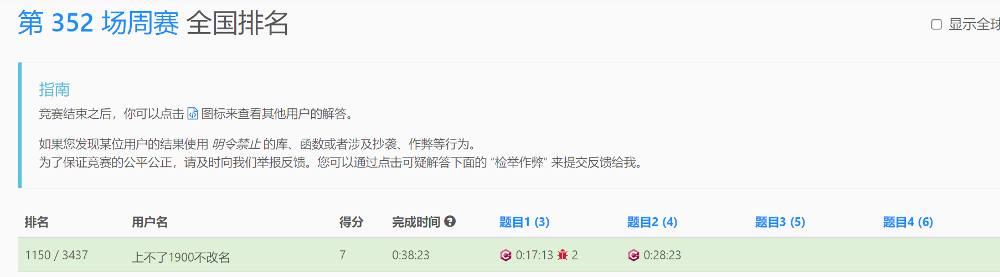

- 模拟

- 质数筛

- \6911不间断子数组（思维+滑动窗口维护treemap）

  好题，滑动窗口、treemap、multiset（不去重排序集合）

  https://leetcode.cn/problems/continuous-subarrays/solutions/2327658/6911-bu-jian-duan-zi-shu-zu-si-wei-hua-d-rpve/

  > multiset用法：https://blog.csdn.net/sodacoco/article/details/84798621

- \6894. 所有子数组中不平衡数字之和（想不到）

  O（n^2）枚举，vis数组，找关键点：`sarr[i+1] - sarr[i] > 1`，找相邻两个子数组对答案的递推关系

  https://leetcode.cn/problems/sum-of-imbalance-numbers-of-all-subarrays/solutions/2327759/suo-you-zi-shu-zu-zhong-bu-ping-heng-shu-rab8/

### lc第108 场双周赛(哈希、dp)3题

> 2023年7月8日 


- \6913. 最长交替子序列

  模拟

- \6469. 重新放置石块

  哈希

- \6923. 将字符串分割为最少的美丽子字符串（没做出来）

  回溯或者dp

  同类型：\131. 分割回文串

- \6928. 黑格子的数目

  哈希+枚举

### lc第 353 场周赛(差分、dp)3题

> 2023年7月9日 

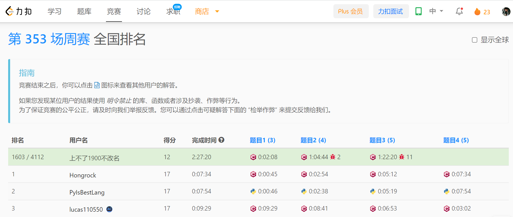

- \6451. 找出最大的可达成数字

  简单公式

- \6899. 达到末尾下标所需的最大跳跃次数（dp好题）

  dp

  最大跳跃问题，dp[i]表示以i结尾的最大跳跃次数

- \6912. 构造最长非递减子数组（dp好题）

  dp，每一轮有两个状态`dp[i][1]和dp[i][2]`

  列状态转移方程

- \6919. 使数组中的所有元素都等于零（没做出来）

  差分+思维


### lc第 354场周赛(字典树、双指针、前后缀)2题
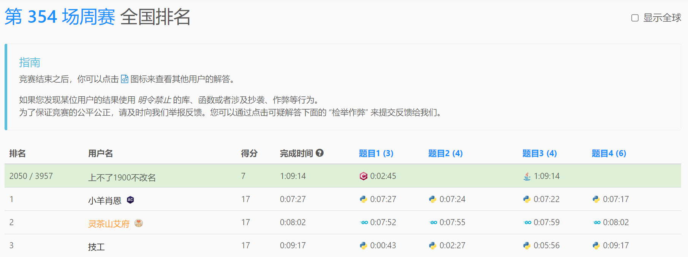

- 特殊元素平方和

  模拟

- 数组的最大美丽值（没做出来）

  >  值相等的子序列的最大长度，就是排序转换成子数组，再双指针

  思维+排序贪心+双指针

  想复杂了，比赛时一直在想是根据左端点排序，还是右端点,实际就根据nums排序就行

  https://leetcode.cn/problems/maximum-beauty-of-an-array-after-applying-operation/

- 合法分割的最小下标

  预处理前后缀

  https://leetcode.cn/problems/minimum-index-of-a-valid-split/

- 最长合法子字符串的长度（没看）

  字典树/双指针

  题解：https://leetcode.cn/problems/length-of-the-longest-valid-substring/solutions/2346183/6924-zui-chang-he-fa-zi-zi-fu-chuan-de-c-s5hf/

  https://leetcode.cn/problems/length-of-the-longest-valid-substring/


### 第 109 场双周赛(dp)3题，差6minAK


- 模拟题

- 字符串排序

- 动态规划（以i结尾）

  这题比赛的时候花了太久，debug了很久，有以下问题。

  1、三目运算符在表达式里要加小括号，否则优先级导致结果不对。

  2、long long 类型的max函数需要手写，库中不支持long long

  3、中间结果用的int没用long long 导致答案不对

- 动态规划（背包求方案数）（晚了6minAC）

  一开始没有将所有数预处理到nums里面，导致越界风险，答案不对，有几组数据过不去

### 第 355 场周赛（贪心、位运算）2题

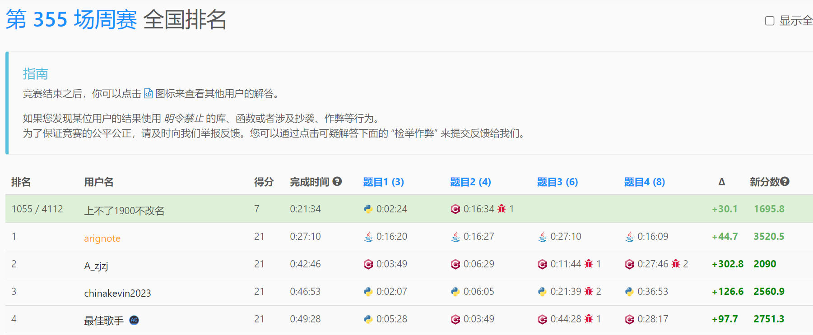

- 字符串split
- 贪心（倒序枚举）
- 很难
- 很难


### 第 356 场周赛（数位dp、贪心）2题

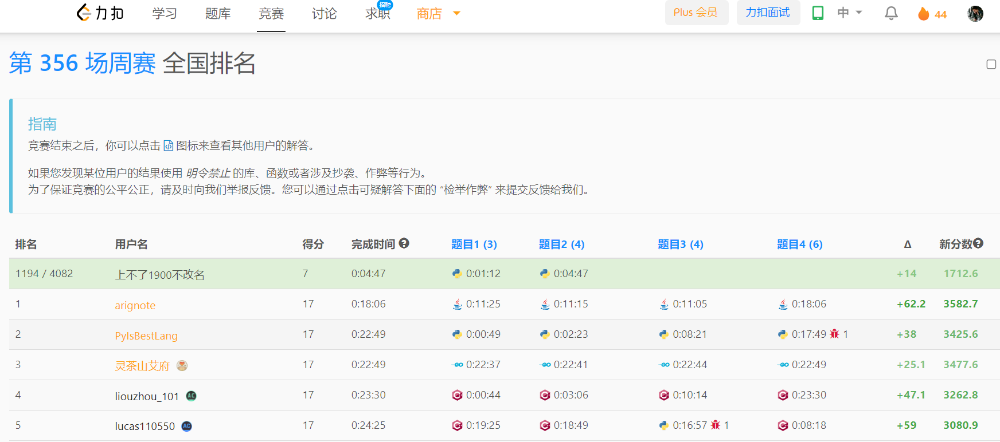

- P1：水题

- P2：[6900. 统计完全子数组的数目](https://leetcode.cn/problems/count-complete-subarrays-in-an-array/)

  O（n^2）枚举+哈希表

  进阶：O（n）还没看

- P3: [6918. 包含三个字符串的最短字符串](https://leetcode.cn/problems/shortest-string-that-contains-three-strings/description/)

  贪心，把两个字符串合并，相当于找到前串的后缀以及后串的前缀，在相等时的最大的长度，然后合并这两个串，消去相同部分。

  此外，因为有三个字符串合并，并且对于任意两个串a,b，(a,b)和(b,a)的合并方案是不同的，所以相当于3个串进行全排列，共有3！=6种方案。枚举6种找到最小值

  AC代码1：python全排列API

  ```python
  class Solution:
      def minimumString(self, a: str, b: str, c: str) -> str:
          ans = ""
          def merge(s: str, t: str) -> str:
              # 先特判完全包含的情况
              if t in s: return s
              if s in t: return t
              for i in range(min(len(s), len(t)), 0, -1):
                  # 枚举：s 的后 i 个字母和 t 的前 i 个字母是一样的
                  if s[-i:] == t[:i]:
                      return s + t[i:]
              return s + t
  
          # a,b,c的全排列
          for a,b,c in permutations((a,b,c)):
              s = merge(merge(a,b),c)
              if ans=="" or len(s)<len(ans) or (len(s)==len(ans) and s<ans):
                  ans = s
          return ans
  ```

  AC代码2：打表全排列

- P4：[2801. 统计范围内的步进数字数目](https://leetcode.cn/problems/count-stepping-numbers-in-range/)

  > 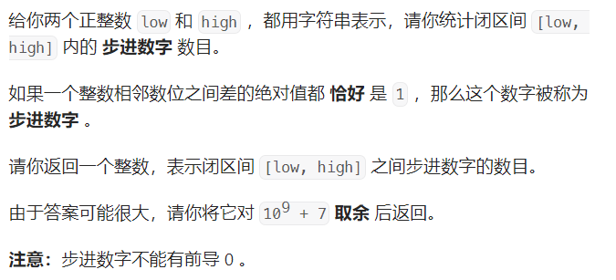

  数位dp

  ```python
  class Solution:
      def countSteppingNumbers(self, low: str, high: str) -> int:
          Mod = 10**9+7
          # i表示当前要处理第i位
          # pre表示第i-1个数
          # is_limit 表示第i位的取值上界是否有上限，如果有，第i位最大是int(s[i]);否则就是9
          # is_num 表示前i-1位是否填了有效数字（决定第i位的取值下界），如果是，下界就是0；否则下界是1.（用来处理前导0）
          def cal(s:str)->int:
              @cache
              def f(i:int, pre:int, is_limit:bool, is_num:bool)->int:
                  if i == len(s):
                      return int(is_num) 
                  res = 0
                  if not is_num:
                      res = f(i+1,pre,False,False) 
                  up = int(s[i]) if is_limit else 9 
                  low = 0 if is_num else 1 
                  for d in range(low,up+1): 
                      if not is_num or abs(d-pre)==1: # 这里是关键，如果前面都是无效数字，那么都可以选
                          res += f(i+1,d,is_limit and d==up,True)
                  return res % Mod
              return f(0,0,True,False) 
  
          # 特判s是否满足条件
          def valid(s:str)->int:
              for i in range(len(s)-1):
                  if abs(int(s[i])-int(s[i+1]))!=1:
                      return 0
              return 1
          return (cal(high)-cal(low)+valid(low))%Mod
  ```


### 第 110 场双周赛（哈希表、dp）3题

> 2023年8月5日 

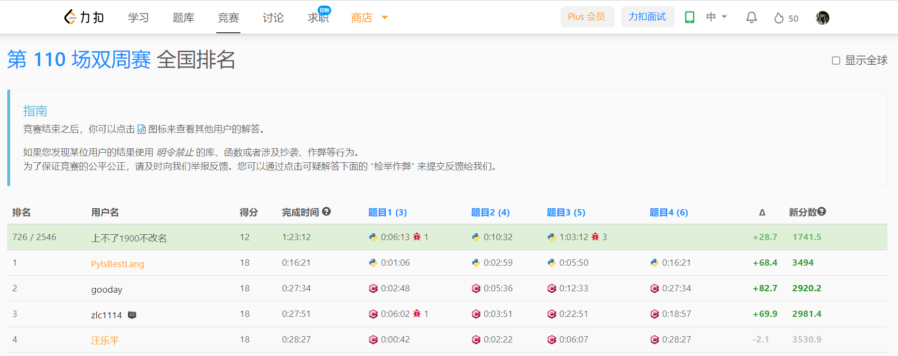

- P1：模拟

- P2：6940. 在链表中插入最大公约数

  链表插入+gcd

- P3：6956. 使循环数组所有元素相等的最少秒数

  题意：扩散元素，每个点向左右两边扩散，求使得数组值都相等的最少扩散次数

  思维+哈希表

  找相同值的下标

- P4：6987. 使数组和小于等于 x 的最少时间（还没做）

  贪心+动态规划

  收菜思路，先收长得慢的菜，最后收长得快的菜

  

### 第 357场周赛（DFS、反悔贪心、思维）1题

> 2023年8月6日
>
> 一直在死磕第三题，以为第三题好写，先做的第三题，最后有7组数据死活过不去，最后发现是方法问题，错误的以为是dp，其实不是。然后第二题也没时间看了。

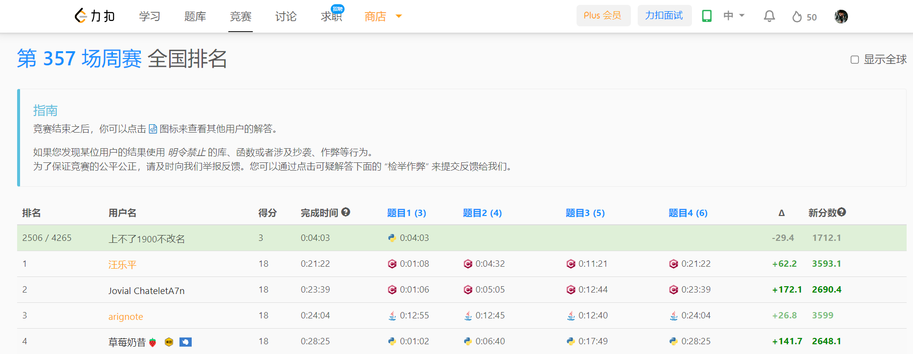

- T1：故障键盘

  模拟

- T2：6953.判断是否能拆分数组（没做出来）

  - 方法1：思维+结论，脑筋急转弯

  对于 n≥3的情况，无论按照何种方式分割，一定会在某个时刻，分割出一个长为 2的子数组。如果 nums中任何长为 2 的子数组的元素和都小于 m，那么无法满足要求。

  否则，可以用这个子数组作为「核心」，像剥洋葱一样，从 nums 一个一个地去掉首尾元素，最后得到这个子数组。由于子数组的元素和 ≥m，所以每次分割时，长度超过 1的子数组的元素和也必然是 ≥m 的，满足要求。

  > 前提：数组每个元素的值都大于0，所以如果小区间的和>m，那么大区间的和也>m

  所以问题变成判断数组中是否有两个相邻数字 ≥m 即可。

  ```
  class Solution:
      def canSplitArray(self, nums: List[int], m: int) -> bool:
          if len(nums)<=2:
              return True
          for i in range(0,len(nums)-1):
              if nums[i] + nums[i+1] >= m:
                  return True
          return False
  ```

  - 区间dp（待看）

    ```
    class Solution {
        public boolean canSplitArray(List<Integer> nums, int m) {
            int n = nums.size();
            int[] pre = new int[n + 1];
            for (int i = 1; i <= n; i++) {
                pre[i] = pre[i - 1] + nums.get(i - 1);
            }
            
            boolean[][] f = new boolean[n + 1][n + 1];
            for (int len = 1; len <= n; len++) {
                for (int l = 1; l + len - 1 <= n; l++) {
                    int r = l + len - 1;
                    if (len <= 2) {
                        f[l][r] = true;
                    } else {
                        for (int i = l; i < r; i++) {
                            boolean left = pre[i] - pre[l - 1] >= m || i == l;
                            boolean right = pre[r] - pre[i] >= m || i + 1 == r;
                            f[l][r] |= left && right && f[l][i] && f[i + 1][r];
                        }
                    }
                }
            }
            return f[1][n];
        }
    }
    ```

    

- T3：6951. 找出最安全路径（没做出来）

  [6951. 找出最安全路径](https://leetcode.cn/problems/find-the-safest-path-in-a-grid/)

  BFS+二分+DFS或者BFS+并查集

  比赛的时候想错了，用的数字三角形dp做的，有8组数据过不去，实际上路径可以弯弯绕绕的，所以不是dp，本题没想到可以用二分

  ```python
  class Solution {
  public:
      int n,m,ans;
      int dist[500][500],vis[500][500];
      int dx[4] = {1,0,-1,0};
      int dy[4] = {0,1,0,-1};
      void bfs(vector<vector<int>>& grid){
          queue<pair<int,int>> q;
          
          for(int i=0;i<n;i++){
              for(int j=0;j<m;j++){
                  if(grid[i][j]){
                      q.push({i,j});
                      dist[i][j] = 0;
                  }else dist[i][j] = -1;
              }
          }
          while(q.size()){
              auto top = q.front();
              q.pop();
              for(int i=0;i<4;i++){
                  int nx = dx[i]+top.first;
                  int ny = dy[i]+top.second;
                  if(nx>=0 && nx<n && ny>=0 &&ny<m && dist[nx][ny]==-1){
                      q.push({nx,ny});
                      dist[nx][ny] = dist[top.first][top.second]+1;
                  }
              }
          }
      }
  
      bool dfs(int x,int y,int minDist){
          if(x==n-1 && y==m-1)
              return true;
          for(int i=0;i<4;i++){
              int nx = x+dx[i];
              int ny = y+dy[i];
              if(nx>=0 && nx<n && ny>=0 &&ny<m && vis[nx][ny]==0 && dist[nx][ny]>=minDist){
                  vis[nx][ny] = 1;
                  bool res= dfs(nx,ny,minDist);
                  if(res) return true;
              }
          }
          return false;
      }
  
      int maximumSafenessFactor(vector<vector<int>>& grid) {
          n = grid.size();
          m = grid[0].size();
          if(grid[n-1][m-1]==1 || grid[0][0]==1)
              return 0;
          bfs(grid);
          
          int l = 0,r = 2*n;
          while(l<r){
              int mid = (l+r+1)>>1;
              cout<<mid<<" ";
              memset(vis,0,sizeof(vis));
              vis[0][0] = 1;
              
              bool res = dist[0][0]>=mid && dfs(0,0,mid); //特判第一个点是否满足
              if(res) l = mid;
              else r = mid-1;
          }
          return l;
          
      }
  };
  ```

  

- T4：6932. 子序列最大优雅度

  反悔贪心

  不会

### 第 111 场双周赛（数位dp、dp、双指针）2题

> 2023年8月19日
>
> 第二题太慢了，以为很麻烦先做的后面的第三题，第三题没有贪心出来，回过来才发现第二题竟然是一个双指针，还是不够敏感，第三题数据范围是100，我想到了可能是枚举，但是就是没想到到底枚举什么，是要枚举区间的长度。T4数位dp，用的灵神板子，一上来板子的py缩进就调了20分钟，最后把方法移到了外面，写完了，但是MLE了，掉分的一场！！！
>
> 双指针、枚举、dp、数位dp

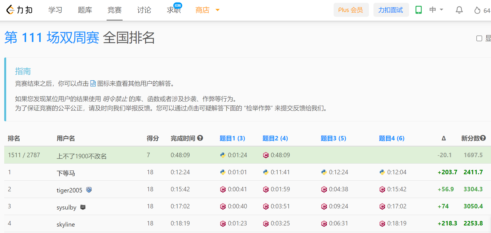

- T1:[6954. 统计和小于目标的下标对数目](https://leetcode.cn/problems/count-pairs-whose-sum-is-less-than-target/)

  > `0 <= i < j < n` 且 `nums[i] + nums[j] < target` 的下标对 `(i, j)` 的数目。

  暴力O (n^2)，但是本题有排序+双指针做法.

  排序后，左右指针（相向指针），如果a[i] + a[j] < target，那么比a[j]小的那些数x也满足a[i] + x < target，共i-j个，然后i++；否则j--

  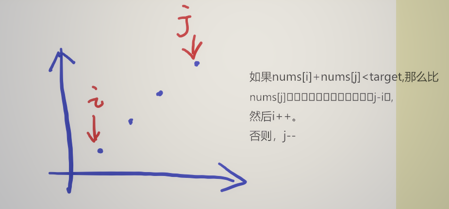

  ```
  class Solution:
      def countPairs(self, nums: List[int], target: int) -> int:
          n = len(nums)
          nums.sort()
          ans = 0
          left,right = 0,n-1
          
          while left<right:
              if nums[left]+nums[right]<target:
                  ans += right-left
                  left += 1
              else:
                  right -= 1
          return ans
  ```

- T2：[8014. 循环增长使字符串子序列等于另一个字符串](https://leetcode.cn/problems/make-string-a-subsequence-using-cyclic-increments/)

  > 一次操作中，你选择 `str1` 中的若干下标。对于选中的每一个下标 `i` ，你将 `str1[i]` **循环** 递增，变成下一个字符。也就是说 `'a'` 变成 `'b'` ，`'b'` 变成 `'c'` ，以此类推，`'z'` 变成 `'a'` 。
  >
  > 如果执行以上操作 **至多一次** ，可以让 `str2` 成为 `str1` 的子序列，请你返回 `true` ，否则返回 `false` 。

  思路：双指针，i指向str1,j指向str2，如果i指向的位置满足str2[j]的要求，那么j++，每一次都i++，最后判断j是否完整扫描过一遍

  ```
  class Solution:
      def canMakeSubsequence(self, str1: str, str2: str) -> bool:
          i,j = 0,0
          while i < len(str1) and j < len(str2):
              x = chr(ord(str1[i])+1) if str1[i] != 'z' else 'a'
              if str2[j] == x or str2[j] == str1[i]:
                  j+=1
              i+=1
          return j==len(str2)
  ```

- T3:[6941. 将三个组排序](https://leetcode.cn/problems/sorting-three-groups/)

  > 从 `0` 到 `n - 1` 的数字被分为编号从 `1` 到 `3` 的三个组，数字 `i` 所在的组是 `nums[i]`
  >
  > 你可以执行以下操作任意次：
  >
  > - 选择数字 `x` 并改变它的组。更正式的，你可以将 `nums[x]` 改为数字 `1` 到 `3` 中的任意一个。
  >
  > 你将按照以下过程构建一个新的数组 `res` ：
  >
  > 1. 将每个组中的数字分别排序。
  > 2. 将组 `1` ，`2` 和 `3` 中的元素 **依次** 连接以得到 `res` 。
  >
  > 如果得到的 `res` 是 **非递减**顺序的，那么我们称数组 `nums` 是 **美丽数组** 。
  >
  > 请你返回将 `nums` 变为 **美丽数组** 需要的最少步数。

  比赛的时候想到了根据每组的长度去做，错误的以为初始三个组的长度就是最终组的长度，没想到要枚举所有的组的长度

  - 方法1：暴力，O（n^3）

    n的范围是100，要想到枚举，本题只需枚举第一组和第二组的长度，然后再去判断每个元素是否归位了。

    思维点：如果最终三个组的元素个数确定了，那么为了让三个组合并后有序，每个元素必须都**归位**，比如枚举的第一组长度是3，此时第一组的三个元素必须是0,1,2，如果不在，就计数，表示这个元素需要移动。

    ```
        def minimumOperations(self, nums: List[int]) -> int:
            n = len(nums)
            ans = inf
            for a in range(n+1):
                for b in range(n-a+1):
                    cnt = 0
                    for x in range(n):
                        if 0<=x<=a-1:
                            cnt += (nums[x]!=1)
                        elif a<=x<=a+b-1:
                            cnt += (nums[x]!=2)
                        else:
                            cnt += (nums[x]!=3)
                    ans = min(ans,cnt)
            return ans
    ```

  - 方法2：状态机dp

    

  - 方法3：最长上升子序列（LIS问题）

    也可以使用O（nlogn）的LIS解法

    ```
    	def minimumOperations(self, nums: List[int]) -> int:
            n = len(nums)
            dp = [0]*n
            for i,x in enumerate(nums):
                dp[i] = 1
                for j in range(i):
                    if nums[j]<=x:
                        dp[i] = max(dp[i],dp[j]+1)
            return n - max(dp)
    ```

- T4：

  数位dp

  关键在于被k整除这个点上，如果只是保留每一个数的值，那么会MLE，因为10^9的数太多，状态个数太多，所以需要对整除k做优化。

  如果 (pre∗10+choice)%k==0，那么有 ((pre%k)∗10+choice)%k==0，我们可以提前对 pre 取模抽取出特征因子。例如，23%k = (2*10 + 3)%k = ((2%k) *10 + 3)%k ，也就是说23的取余数，可以从2的取余数过渡过来。

  ```python
      def numberOfBeautifulIntegers(self, low: int, high: int, k: int) -> int:
          def cal(s:str):
              @cache
              def dfs(i:int, is_limit:bool, is_num:bool,sub:int,odd:int,even:int)->int:
                  if i == len(s):
                      return int(is_num) and sub==0 and odd==even
                  res = 0
                  if not is_num:
                      res = dfs(i+1,0,0,0,False,False) 
                  up = int(s[i]) if is_limit else 9
                  low = 0 if is_num else 1
                  for d in range(low,up+1):
                      oo = odd + (d%2==1)
                      ee = even + (d%2==0)
                      res += dfs(i+1,is_limit and d==up,True,(sub*10+d)%k,oo,ee) 
                  return res
              return dfs(0,True,False,0,0,0)
          return cal(str(high))-cal(str(low-1))
  ```

  

### 第 359 场周赛（dp、滑动窗口、贪心）2题

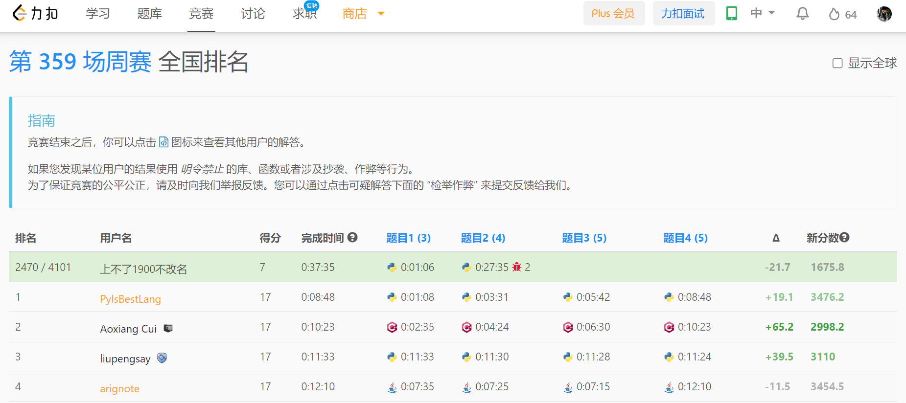

> 2023年8月20日
>
> T2贪心，但是读错题，以为是子序列之和不能是k，”元素对“。T3是dp，比赛搞出来一个n^2的dp，然后用堆维护，但是比较麻烦，还是TLE。T4思维，需要对题意转化，然后用滑动窗口，比赛写了个n^2的代码，TLE了，又是掉分的一场，感觉还是思维不够灵活
>
> 贪心、dp、滑动窗口、二分

- T1:[7004. 判别首字母缩略词](https://leetcode.cn/problems/check-if-a-string-is-an-acronym-of-words/)

  枚举

- T2：[6450. k-avoiding 数组的最小总和](https://leetcode.cn/problems/determine-the-minimum-sum-of-a-k-avoiding-array/)

  > 给你两个整数 `n` 和 `k` 。
  >
  > 对于一个由 **不同** 正整数组成的数组，如果其中不存在任何求和等于 k 的不同元素对，则称其为 **k-avoiding** 数组。
  >
  > 返回长度为 `n` 的 **k-avoiding** 数组的可能的最小总和。

  贪心+思维

  和是k的数对，列举处理如下，不能使得和是k，那么每组数对中至少有一个不选，那么为了使总和最小，那就把大的数给删除，此时会剩下所有小的数，从小的数中依次选，如果n很大，那么小的数选完后，再从k开始依次向后选

  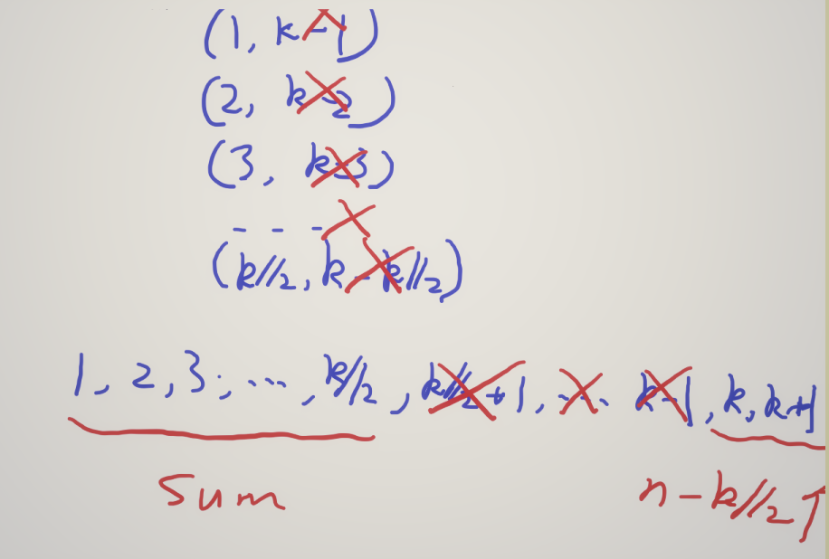

  - 方法1：公式

    推导在上

    ```
    class Solution:
        def minimumSum(self, n: int, k: int) -> int:
            sz = min(k//2,n)
            return (k + k+n-sz-1)*(n-sz)//2 + (1+sz)*sz//2 
    ```

  - 方法2：哈希表

    ```
    class Solution:
        def minimumSum(self, n: int, k: int) -> int:
            se = set()
            i=1
            ans = cnt = 0
            while cnt<n:
                if k-i in se:
                    i+=1
                    continue
                else:
                    se.add(i)
                    ans+=i
                    i+=1
                    cnt+=1
            return ans 
    ```

- T3:[7006. 销售利润最大化](https://leetcode.cn/problems/maximize-the-profit-as-the-salesman/)

  > 给你一个整数 `n` 表示数轴上的房屋数量，编号从 `0` 到 `n - 1` 。
  >
  > 另给你一个二维整数数组 `offers` ，其中 `offers[i] = [starti, endi, goldi]` 表示第 `i` 个买家想要以 `goldi` 枚金币的价格购买从 `starti` 到 `endi` 的所有房屋。
  >
  > 作为一名销售，你需要有策略地选择并销售房屋使自己的收入最大化。
  >
  > 返回你可以赚取的金币的最大数目。

  动态规划

  - 方法1：线性dp+枚举选哪个+预处理分组信息

    ```python
    class Solution:
        def maximizeTheProfit(self, n: int, offers: List[List[int]]) -> int:
            m = len(offers)
            groups = [[] for _ in range(n)]
            for s,e,val in offers:
                groups[e].append((s,val))
            
            dp = [0]*(n+1) # 开成n就会WA
            for i in range(n):
                dp[i] = dp[i-1]
                for s,val in groups[i]:
                    dp[i] = max(dp[i],dp[s-1]+val)
            return dp[n-1]
    ```

    - 相似题目

      [2008. 出租车的最大盈利](https://leetcode.cn/problems/maximum-earnings-from-taxi/)

      [1235. 规划兼职工作](https://leetcode.cn/problems/maximum-profit-in-job-scheduling/)（数据范围更大的情况）

      [1751. 最多可以参加的会议数目 II](https://leetcode.cn/problems/maximum-number-of-events-that-can-be-attended-ii/)（区间个数限制）

      [2054. 两个最好的不重叠活动](https://leetcode.cn/problems/two-best-non-overlapping-events/)

  - 方法2：排序+dp

    

- T4：[6467. 找出最长等值子数组](https://leetcode.cn/problems/find-the-longest-equal-subarray/)

  > 给你一个下标从 **0** 开始的整数数组 `nums` 和一个整数 `k` 。
  >
  > 如果子数组中所有元素都相等，则认为子数组是一个 **等值子数组** 。注意，空数组是 **等值子数组** 。
  >
  > 从 `nums` 中删除最多 `k` 个元素后，返回可能的最长等值子数组的长度。
  >
  > **子数组** 是数组中一个连续且可能为空的元素序列。

  思维、双指针、技巧

  问题转化：某一个子数组，元素个数是n，某元素出现的次数最大是mx，那么此时需要删除的次数就是n-mx，检查n-mx是否满足条件，即n-mx<=k，不满足就左指针移动

  - 方法1：滑动窗口（不理解、**有思维**）

    不理解为什么left指针无脑向右移到后面而不需要更新最大值？

    原因：**left向右滑动时不会出现比当前res更长的候选窗口**
  
    ```
    lass Solution:
        def longestEqualSubarray(self, nums: List[int], k: int) -> int:
            ans = 0
            max_count = 0
            count = Counter()
            left = 0
            for right in range(len(nums)):
                count[nums[right]] += 1
                max_count = max(max_count, count[nums[right]])
                ans = max(ans, max_count)
                while right - left + 1 - max_count > k:
                    count[nums[left]] -= 1
                    left += 1
          return ans
    ```

  - 方法2：分组+双指针

    参考灵神
  
    ```
    class Solution:
        def longestEqualSubarray(self, nums: List[int], k: int) -> int:
            n = len(nums)
            pos = [[] for _ in range(n+1)]
            # 计算下标数组pos
            for i,x in enumerate(nums):
                pos[x].append(i)
            ans = 0
            for ps in pos: # 枚举某一个相同值下的所有下标
                left = 0 # left和right是下标数组的下标，idx是真实下标
                for right,idx in enumerate(ps):
                    while idx - ps[left]+1 - (right-left+1) > k:
                        left+=1
                    ans = max(ans,right-left+1)
            return ans
    ```
    
  - 类似题目：[424. 替换后的最长重复字符](https://leetcode.cn/problems/longest-repeating-character-replacement/)
  
    本题由于求的答案是完整子数组的最大长度，不是删除后的最大长度，所以就只能用滑动窗口做。
  
    有些同学会有疑问，为啥left向右滑动时只更新了mp，却没有更新maxLen？
  
    这是因为**left向右滑动时不会出现比当前res更长的候选窗口**，并且此时maxLen不会增大。想获得比当前res更长的候选窗口，必须保证right和maxLen都是相比之前变大的，所以只有right右滑的时候才会有更长的候选窗口出现。left右滑的时候不会涉及到res的更新，即使maxCount未更新导致候选窗口没有严格的满足条件right - left + 1 - maxLen<= k，也是不影响结果res的，所以没必要更新maxCount。当然想更新也是可以的，多几行代码，只是没有必要。
  
    ```
    class Solution:
        def characterReplacement(self, s: str, k: int) -> int:
            # 思路：子数组内最多修改k次，相当于长度-最大次数<=k,
            # 但是答案是求删除前的子数组的最大长度，不是删除后的最大长度，所以不能分组
            ss = []
            for i,x in enumerate(s):
                ss.append(str(ord(x)-ord('A')))
            ans = 0
            left = right = 0
            mp = Counter()
            maxlen = 0
            for right,x in enumerate(ss):
                mp[x]+=1
                maxlen = max(maxlen,mp[x])
                while right-left+1 - maxlen > k: 
                    # 不需要更新maxlen，因为这里不会出现比ans更好的答案
                    mp[ss[left]]-=1
                    left+=1
                ans = max(ans,right-left+1)
            return ans
    ```
  
  - 难以理解的点：
  
    maxCount 在内层循环「左边界向右移动一个位置」的过程中，没有维护它的定义，结论是否正确？
    答：结论依然正确。「左边界向右移动一个位置」的时候，maxCount 或者不变，或者值减 111。
  
    maxCount 的值虽然不维护，但数组 freq 的值是被正确维护的；
    当「左边界向右移动」之前：
    如果有两种字符长度相等，左边界向右移动不改变 maxCount 的值。例如 s = [AAABBB]、k = 2，左边界 A 移除以后，窗口内字符出现次数不变，依然为 333；
    如果左边界移除以后，使得此时 maxCount 的值变小，又由于 我们要找的只是最长替换 k 次以后重复子串的长度。接下来我们继续让右边界向右移动一格，有两种情况：① 右边界如果读到了刚才移出左边界的字符，恰好 maxCount 的值被正确维护；② 右边界如果读到了不是刚才移出左边界的字符，新的子串要想在符合题意的条件下变得更长，maxCount 一定要比之前的值还要更多，因此不会错过更优的解。
    
    - 求最多删除k个元素时，等值子数组的最大长度
      当a[right+1]是最大次数等值时，那么最大次数是会增加的，也就是ans会增加，而left一定不会移动，因为上一个状态[left,right]是合法的，此时a[right+1]不是累赘。
      当a[right+1]不是最大次数等值时，此时a[right+1]是累赘，left可能移动，也可能不移动。如果移动，那么最大长度就一定不会超过ans，所以left移动的过程不用更新答案ans；如果left不移动，也是不会超过ans。所以当这种情况时，不管left是否移动，都无法更新ans。
      其实，不需要关心a[right+1]是多少，对于每一次right+1，直接维护ans就行了(我们心里知道当a[right+1]不是最大次数等值时就不会有最优情况)，但是在更新ans之前，需要先更新等值最大次数mx。由于等值最大次数mx只会在right移动时变大，所以更新right指向的点的次数+1，使用哈希表，再用right的次数更新mx。
    - left++时不更新mxCnt的原因：在这个过程中不可能有比mxCnt还大的情况，所以不需要维护mxCnt，只需要哈希表统计即可
    - if right-left+1-mxCnt>k不理解为什么只向后移动一位：多几个就移除几个而不是跟新了mxCnt后再重新判断的原因：如果当前right是最大次数等值，那么left就不会移动，否则那就是多了个累赘，

### 第 360 场周赛（倍增、位运算、贪心）2题

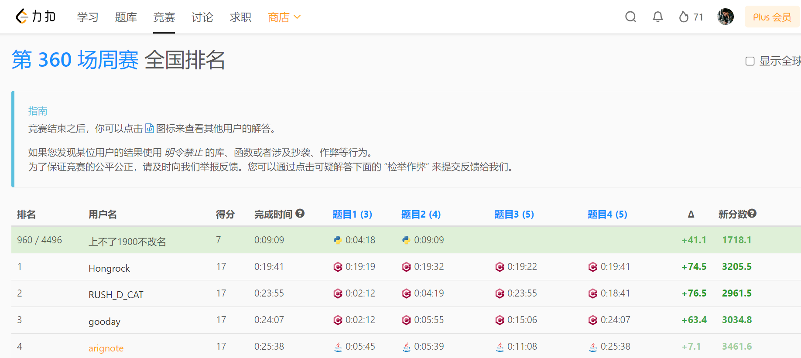

> 2023年8月27日
>
> Q3、Q4比赛的时候都是midium，结束以后都改成了Hard
>
> 倍增、贪心

- [8015. 距离原点最远的点](https://leetcode.cn/problems/furthest-point-from-origin/)

  > 给你一个长度为 `n` 的字符串 `moves` ，该字符串仅由字符 `'L'`、`'R'` 和 `'_'` 组成。字符串表示你在一条原点为 `0` 的数轴上的若干次移动。
  >
  > 你的初始位置就在原点（`0`），第 `i` 次移动过程中，你可以根据对应字符选择移动方向：
  >
  > - 如果 `moves[i] = 'L'` 或 `moves[i] = '_'` ，可以选择向左移动一个单位距离
  > - 如果 `moves[i] = 'R'` 或 `moves[i] = '_'` ，可以选择向右移动一个单位距离
  >
  > 移动 `n` 次之后，请你找出可以到达的距离原点 **最远** 的点，并返回 **从原点到这一点的距离** 。

  脑筋急转弯

  `_`可以任意变，贪心的思路，要么全向左，要么全向右

  先看一下不算`_`时，移动的位置，也就是pos = r-l，然后再看看pos是大于0还是小于0，为了使得距离最大，如果大于0，那么`_`就全算在右边，否则就是左边

  ```
  class Solution:
      def furthestDistanceFromOrigin(self, moves: str) -> int:
          l = moves.count('L')
          r = moves.count('R')
          _ = moves.count('_')
          return max(abs(r-l-_),abs(r-l+_))
  ```

- [8022. 找出美丽数组的最小和](https://leetcode.cn/problems/find-the-minimum-possible-sum-of-a-beautiful-array/)

  > 给你两个正整数：`n` 和 `target` 。
  >
  > 如果数组 `nums` 满足下述条件，则称其为 **美丽数组** 。
  >
  > - `nums.length == n`.
  > - `nums` 由两两互不相同的正整数组成。
  > - 在范围 `[0, n-1]` 内，**不存在** 两个 **不同** 下标 `i` 和 `j` ，使得 `nums[i] + nums[j] == target` 。
  >
  > 返回符合条件的美丽数组所可能具备的 **最小** 和。

  上周原题，贪心

  ```
  class Solution:
      def minimumPossibleSum(self, n: int, target: int) -> int:
          se = set()
          i=1
          while i:
              if target-i not in se:
                  se.add(i)
              if len(se)==n:
                  break
              i+=1
          return sum(se)
  ```

- [2835. 使子序列的和等于目标的最少操作次数](https://leetcode.cn/problems/minimum-operations-to-form-subsequence-with-target-sum/)

  > 你一个下标从 **0** 开始的数组 `nums` ，它包含 **非负** 整数，且全部为 `2` 的幂，同时给你一个整数 `target` 
  >
  > 一次操作中，你必须对数组做以下修改：
  >
  > - 选择数组中一个元素 `nums[i]` ，满足 `nums[i] > 1` 。
  > - 将 `nums[i]` 从数组中删除。
  > - 在 `nums` 的 **末尾** 添加 **两个** 数，值都为 `nums[i] / 2` 。
  >
  > 你的目标是让 `nums` 的一个 **子序列** 的元素和等于 `target` ，请你返回达成这一目标的 **最少操作次数** 。如果无法得到这样的子序列，请你返回 `-1` 。
  >
  > 数组中一个 **子序列** 是通过删除原数组中一些元素，并且不改变剩余元素顺序得到的剩余数组。
  >
  > - `1 <= nums.length <= 1000`
  > - `1 <= nums[i] <= 230`
  > - `nums` 只包含非负整数，且均为 2 的幂。
  > - `1 <= target < 231`

  贪心+数学证明

  比较麻烦

- [2836. 在传球游戏中最大化函数值](https://leetcode.cn/problems/maximize-value-of-function-in-a-ball-passing-game/)

  > 给你一个长度为 `n` 下标从 **0** 开始的整数数组 `receiver` 和一个整数 `k` 。
  >
  > 总共有 `n` 名玩家，玩家 **编号** 互不相同，且为 `[0, n - 1]` 中的整数。这些玩家玩一个传球游戏，`receiver[i]` 表示编号为 `i` 的玩家会传球给编号为 `receiver[i]` 的玩家。玩家可以传球给自己，也就是说 `receiver[i]` 可能等于 `i` 。
  >
  > 你需要从 `n` 名玩家中选择一名玩家作为游戏开始时唯一手中有球的玩家，球会被传 **恰好** `k` 次。
  >
  > 如果选择编号为 `x` 的玩家作为开始玩家，定义函数 `f(x)` 表示从编号为 `x` 的玩家开始，`k` 次传球内所有接触过球玩家的编号之 **和** ，如果有玩家多次触球，则 **累加多次** 。换句话说， `f(x) = x + receiver[x] + receiver[receiver[x]] + ... + receiver(k)[x]` 。
  >
  > 你的任务时选择开始玩家 `x` ，目的是 **最大化** `f(x)` 。
  >
  > 请你返回函数的 **最大值** 。
  >
  > **注意：**`receiver` 可能含有重复元素。
  >
  > - `1 <= receiver.length == n <= 105`
  > - `0 <= receiver[i] <= n - 1`
  > - `1 <= k <= 10^10`

  树上倍增。内向基环树，由于k非常大，dp会TLE

  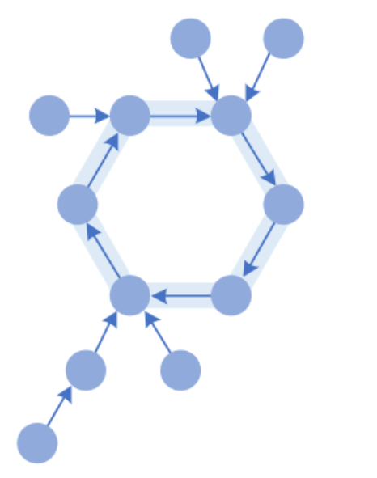

  思路：

  利用倍增算法，预处理每个节点 x 的第 2^i个祖先节点，以及从 x 的父节点到 x 的第 2^i个祖先节点的节点编号之和。

  最后枚举起点 xxx，一边向上跳一边累加节点编号。

  ```python
  class Solution:
      def getMaxFunctionValue(self, receiver: List[int], k: int) -> int:
          n = len(receiver)
          m = 34
          # dp[i][j]表示节点i向上移动2^i步的节点，值是个元组（a,b）,a表示节点下标，b表示这一段距离的长度
          dp = [[None]*(m+1) for x in range(n)]
          # 初始化每个节点的父节点状态
          for idx,x in enumerate(receiver):
              dp[idx][0] = (x,x)
          # 初始化倍增数组
          for i in range(1,m):
              for j in range(n):
                  p,s = dp[j][i-1]
                  pp,ss = dp[p][i-1]
                  dp[j][i] = (pp,ss+s)
          ans = 0
          # 枚举起点
          for i in range(n):
              s = i
              start = i
              # 走k步，相当于走k = 1+2+4+8+...步
              for j in range(m-1,-1,-1):
                  if (k>>j)&1:
                      start,last_sum = dp[start][j]
                      s += last_sum
              ans = max(ans,s)
          return ans
  ```
  
  - [957. N 天后的牢房](https://leetcode.cn/problems/prison-cells-after-n-days/)
  
    > 监狱中 `8` 间牢房排成一排，每间牢房可能被占用或空置。
    >
    > 每天，无论牢房是被占用或空置，都会根据以下规则进行变更：
    >
    > - 如果一间牢房的两个相邻的房间都被占用或都是空的，那么该牢房就会被占用。
    > - 否则，它就会被空置。
    >
    > **注意**：由于监狱中的牢房排成一行，所以行中的第一个和最后一个牢房不存在两个相邻的房间。
    >
    > 给你一个整数数组 `cells` ，用于表示牢房的初始状态：如果第 `i` 间牢房被占用，则 `cell[i]==1`，否则 `cell[i]==0` 。另给你一个整数 `n` 。
    >
    > 请你返回 `n` 天后监狱的状况（即，按上文描述进行 `n` 次变更）。
    >
    > - `cells.length == 8`
    > - `cells[i]` 为 `0` 或 `1`
    > - `1 <= n <= 109`
  
    方法1：找规律（周期是14）
  
    方法2：倍增、位运算
  
    ```
    class Solution:
        def prisonAfterNDays(self, cells: List[int], k: int) -> List[int]:
            n = len(cells)
            # dp[i][j]表示状态i，经过2^j天的状态
            mx_len = floor(log2(k))
            dp = [[inf] * (mx_len + 1) for _ in range(1 << n)]
    
            def move(state):
                s1 = state << 1
                s2 = state >> 1
                # 相等时，返回1，否则返回0
                ans = s1 ^ s2 ^ (0b11111111)
                ans &= (0b01111110)
                return ans
    
            for i in range(1 << n):
                dp[i][0] = move(i)
                # print(i,dp[i][0])
    
            for j in range(1, mx_len + 1):
                for i in range(1 << n):
                    dp[i][j] = dp[dp[i][j - 1]][j - 1]
    
            state = int(''.join(list(map(str, cells))), base=2)
            for i in range(mx_len, -1, -1):
                if k >> i & 1:
                    state = dp[state][i]
            # 48 -> [0,0,1,1,0,0,0,0]
            ans = []
            for i in range(n-1, -1, -1):
                if state >> i & 1:
                    ans.append(1)
                else:
                    ans.append(0)
            return ans
    ```
  
    


### 第 112 场双周赛（滑动窗口、组合数学）3题

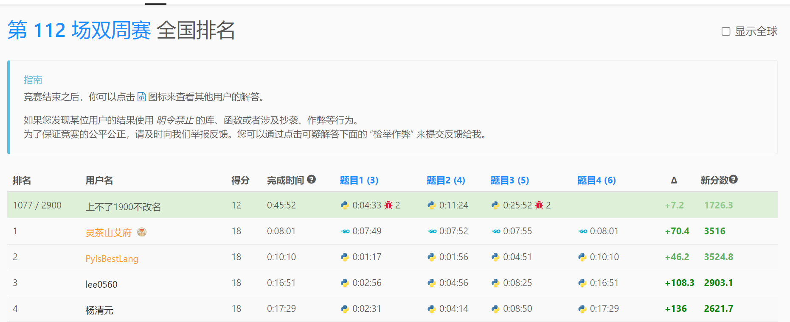

> 这场前三题WA太多了，Q3滑动窗口还是不熟练，第四题组合数学没看出公式

- Q1：[7021. 判断通过操作能否让字符串相等 I](https://leetcode.cn/problems/check-if-strings-can-be-made-equal-with-operations-i/)

  模拟

- Q2：[7005. 判断通过操作能否让字符串相等 II](https://leetcode.cn/problems/check-if-strings-can-be-made-equal-with-operations-ii/)

  找结论，用Q1代码能过

- Q3：[2841. 几乎唯一子数组的最大和](https://leetcode.cn/problems/maximum-sum-of-almost-unique-subarray/)

  简单滑动窗口，但是比赛的时候还是不熟练

- Q4：[2842. 统计一个字符串的 k 子序列美丽值最大的数目](https://leetcode.cn/problems/count-k-subsequences-of-a-string-with-maximum-beauty/)

> 给你一个字符串 `s` 和一个整数 `k` 。
>
> **k 子序列**指的是 `s` 的一个长度为 `k` 的 **子序列** ，且所有字符都是 **唯一** 的，也就是说每个字符在子序列里只出现过一次。
>
> 定义 `f(c)` 为字符 `c` 在 `s` 中出现的次数。
>
> k 子序列的 **美丽值** 定义为这个子序列中每一个字符 `c` 的 `f(c)` 之 **和** 。
>
> 比方说，`s = "abbbdd"` 和 `k = 2` ，我们有：
>
> - `f('a') = 1`, `f('b') = 3`, `f('d') = 2`
>
> - ```
>   s
>   ```
>
>    的部分 k 子序列为：
>
>   - `"***ab***bbdd"` -> `"ab"` ，美丽值为 `f('a') + f('b') = 4`
>   - `"***a***bbb***d***d"` -> `"ad"` ，美丽值为 `f('a') + f('d') = 3`
>   - `"a***b***bb***d***d"` -> `"bd"` ，美丽值为 `f('b') + f('d') = 5`
>
> 请你返回一个整数，表示所有 **k 子序列** 里面 **美丽值** 是 **最大值** 的子序列数目。由于答案可能很大，将结果对 `109 + 7` 取余后返回。
>
> 一个字符串的子序列指的是从原字符串里面删除一些字符（也可能一个字符也不删除），不改变剩下字符顺序连接得到的新字符串。
>
> **注意：**
>
> - `f(c)` 指的是字符 `c` 在字符串 `s` 的出现次数，不是在 k 子序列里的出现次数。
> - 两个 k 子序列如果有任何一个字符在原字符串中的下标不同，则它们是两个不同的子序列。所以两个不同的 k 子序列可能产生相同的字符串。

比赛的时候一直在算最大值，最后才发现是最大值时的方案个数

子问题：从每个字符均出现相同次数len、共cnt个不同字符的字符串s中选，选择满足条件的字符序列的个数，条件是：子序列的长度是k，并且子字符序列中无相同字符。下标不同就是一对不同的字符序列。

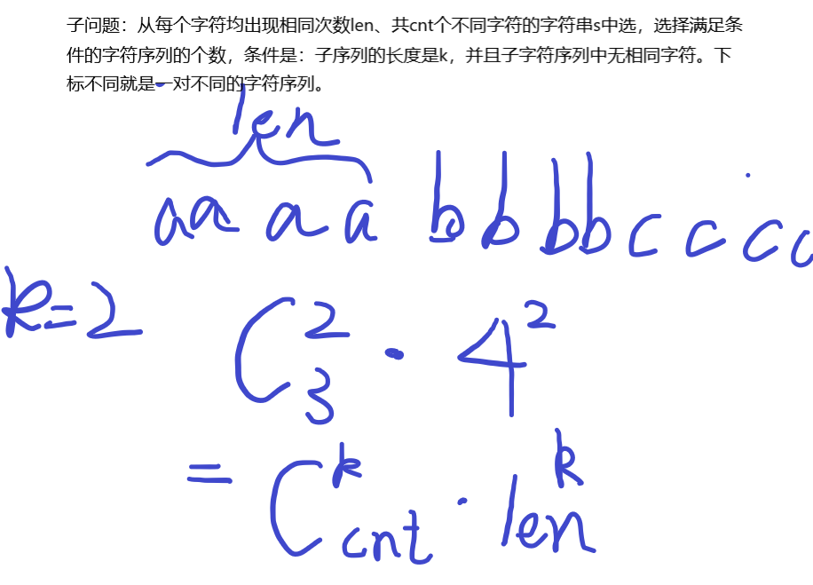

python自带的组合数函数：comb（a,b）

python自带的求幂函数

```
class Solution:
    def countKSubsequencesWithMaxBeauty(self, s: str, k: int) -> int:
        mod = 10**9+7
        n = len(s)
        mp = Counter(s)
        # 次数的出现次数
        cntt = Counter(mp.values())
        ans = 1
        for c,val in sorted(cntt.items(),reverse=True):
            if k<=val:
                ans *= pow(c,k,mod) * comb(val,k)
                return ans%mod
            else:
                ans *= pow(c,val,mod)
                k -= val
        return 0
```

### 第 361 场周赛（数学、前缀和、哈希表、LCA）2题

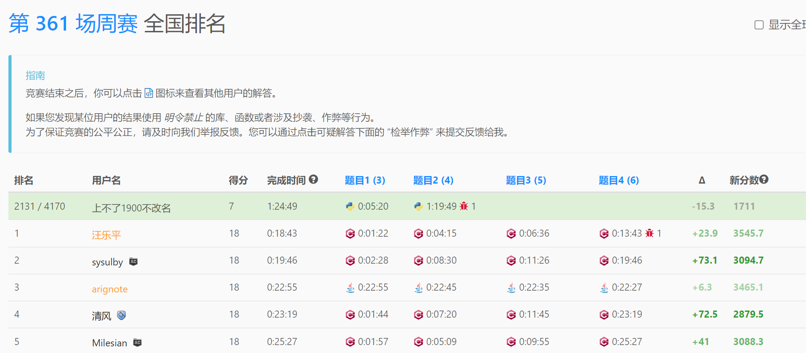

> 掉分的一场，第二题数学思维，比赛最后才想到，所以掉了大分，Q3感觉像滑动窗口，但是不是

- Q1：[7020. 统计对称整数的数目](https://leetcode.cn/problems/count-symmetric-integers/)

  模拟、字符串

- Q2：[8040. 生成特殊数字的最少操作](https://leetcode.cn/problems/minimum-operations-to-make-a-special-number/)

  数学！！！到比赛结束才想到

  25的倍数只有这四种后缀：25,50,75,00

- Q3：[6952. 统计趣味子数组的数目](https://leetcode.cn/problems/count-of-interesting-subarrays/)

  > 给你一个下标从 **0** 开始的整数数组 `nums` ，以及整数 `modulo` 和整数 `k` 。
  >
  > 请你找出并统计数组中 **趣味子数组** 的数目。
  >
  > 如果 **子数组** `nums[l..r]` 满足下述条件，则称其为 **趣味子数组** ：
  >
  > - 在范围 `[l, r]` 内，设 `cnt` 为满足 `nums[i] % modulo == k` 的索引 `i` 的数量。并且 `cnt % modulo == k` 。
  >
  > 以整数形式表示并返回趣味子数组的数目。
  >
  > **注意：**子数组是数组中的一个连续非空的元素序列。

  前缀和+哈希表+同余

  ```
  class Solution:
      def countInterestingSubarrays(self, nums: List[int], modulo: int, k: int) -> int:
          n = len(nums)
          pre = [0]*(n+1)
          for i in range(n):
              pre[i] = pre[i-1]+(nums[i]%modulo==k)
          ans = 0
          mp = Counter()
          mp[0] = 1
          for i in range(n):
              ans += mp[(pre[i]-k)%modulo]
              mp[pre[i]%modulo]+=1
          return ans
  ```

  - 相似题目（前缀和+哈希表）
    推荐按照顺序完成。
    - 560.和为 K 的子数组
    - 974.和可被 K 整除的子数组
    - 523.连续的子数组和
    - 525.连续数组（WA了）

  

- Q4：[100018. 边权重均等查询](https://leetcode.cn/problems/minimum-edge-weight-equilibrium-queries-in-a-tree/)

  LCA、倍增、难

###  第 362 场周赛（数学场、矩阵快速幂、爆搜）2题

> 2023年9月10日 
>
> Q3爆搜被一个if条件卡住了，赛后才发现，Q2一开始没看数据范围写了个BFS，后面才发现MLE了，后来找结论又WA了几次

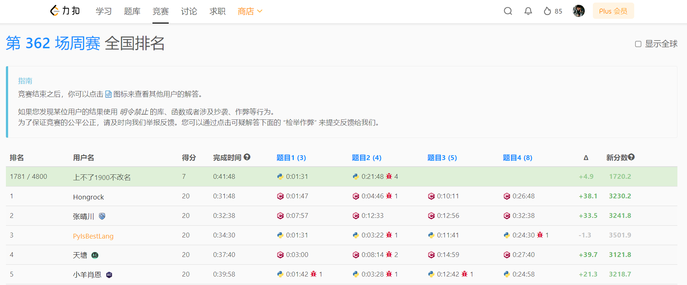

- Q1：[8029. 与车相交的点](https://leetcode.cn/problems/points-that-intersect-with-cars/)

  > 给你一个下标从 **0** 开始的二维整数数组 `nums` 表示汽车停放在数轴上的坐标。对于任意下标 `i`，`nums[i] = [starti, endi]` ，其中 `starti` 是第 `i` 辆车的起点，`endi` 是第 `i` 辆车的终点。
  >
  > 返回数轴上被车 **任意部分** 覆盖的整数点的数目。

  模拟

  线性做法：差分

  ```
  class Solution:
      def numberOfPoints(self, nums: List[List[int]]) -> int:
          n = len(nums)
          end = max(e for _,e in nums)
          chafen = [0]*(end+2)
          for a,b in nums:
              chafen[a]+=1
              chafen[b+1]-=1
          
          s = 0
          ans = 0
          for i in range(end+1):
              s = s+chafen[i]
              if s:
                  ans+=1
          return ans
  ```

  

- Q2：[8049. 判断能否在给定时间到达单元格](https://leetcode.cn/problems/determine-if-a-cell-is-reachable-at-a-given-time/)

  > 给你四个整数 `sx`、`sy`、`fx`、`fy` 以及一个 **非负整数** `t` 。
  >
  > 在一个无限的二维网格中，你从单元格 `(sx, sy)` 开始出发。每一秒，你 **必须** 移动到任一与之前所处单元格相邻的单元格中。
  >
  > 如果你能在 **恰好** `t` **秒** 后到达单元格 `(fx, fy)` ，返回 `true` ；否则，返回 `false` 。
  >
  > 单元格的 **相邻单元格** 是指该单元格周围与其至少共享一个角的 8 个单元格。你可以多次访问同一个单元格。
  >
  > - `1 <= sx, sy, fx, fy <= 10^9`
  > - `0 <= t <= 10^9`
  >
  > 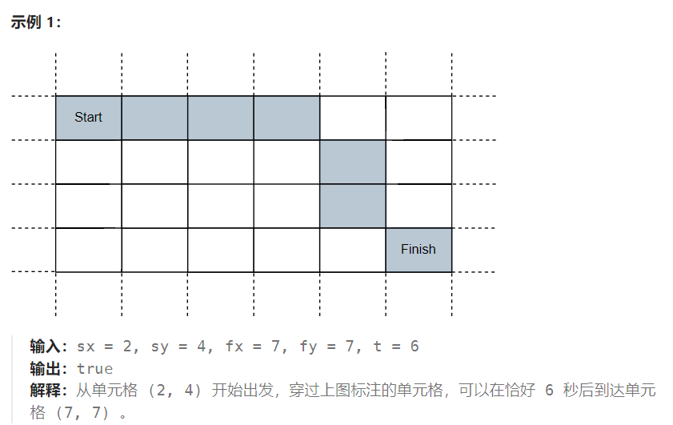

  数学、曼哈顿距离

  特殊的BFS用数学做法,本题图中没有障碍物，不用BFS

  直接做会TLE，用数学思维

  ```
  class Solution:
      def isReachableAtTime(self, sx: int, sy: int, fx: int, fy: int, t: int) -> bool:
          if sx==fx and sy==fy:
              return t!=1
          return max(abs(fx-sx),abs(fy-sy)) <= t    
  ```

  

- Q3：[将石头分散到网格图的最少移动次数](https://leetcode.cn/problems/minimum-moves-to-spread-stones-over-grid/)

  > 给你一个大小为 `3 * 3` ，下标从 **0** 开始的二维整数矩阵 `grid` ，分别表示每一个格子里石头的数目。网格图中总共恰好有 `9` 个石头，一个格子里可能会有 **多个** 石头。
  >
  > 每一次操作中，你可以将一个石头从它当前所在格子移动到一个至少有一条公共边的相邻格子。
  >
  > 请你返回每个格子恰好有一个石头的 **最少移动次数** 。
  >
  >  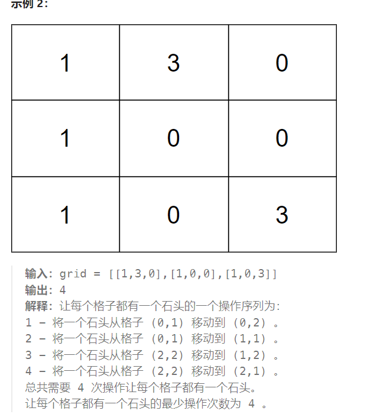

  爆搜、回溯、网络流模版题

  陷阱：以为是多源BFS，但是BFS做不了

  枚举每一个0的位置从哪个有石头的地方移动

  比赛时卡在了if条件

  写法1：枚举每一个0的选法

  ```
  class Solution:
      def minimumMoves(self, grid: List[List[int]]) -> int:
          n = 3
          s = []
          e = []
          mp = [[0]*n for _ in range(n)]
          for i in range(n):
              for j in range(n):
                  if grid[i][j]>1:
                      s.append((i,j))
                      # 这里要减1，因为这个位置也要留一个石头
                      mp[i][j] = grid[i][j]-1 
                  elif grid[i][j]<1:
                      e.append((i,j))
          ans = inf
          def dfs(i,cnt):
              if i==len(e):
                  nonlocal ans
                  ans = min(ans,cnt)
                  return
              for x,y in s:
                  if mp[x][y]>0:
                      mp[x][y]-=1
                      le = abs(x-e[i][0])+abs(y-e[i][1])
                      dfs(i+1,cnt+le)
                      mp[x][y]+=1
          dfs(0,0)        
          return ans
  ```

  写法2：用全排列api

  本质也是枚举所有选法

  ```
  
  ```

  

  - 方法2：网络流

- Q4：[8020. 字符串转换](https://leetcode.cn/problems/string-transformation/)

  矩阵快速幂优化DP，难


### 第113场双周赛（找规律、暴力异或哈希表、换根dp）1题

> 2023年9月16日
>
> 掉大分的一场。第一题，太慢了，比赛是一直在想O（n）的做法，最后再第16min的时候做出来了，赛后也会在想，为什么移动的这个操作我比赛的时候没有暴力的思路？ **第二题，思维难度太大**，没想出来，比赛的时候想了好几种贪心的做法都不行。第三题，注意到了k=100，已知a+b = k，但是怎么也没想到竟然直接枚举a就行了，再利用异或的性质，感觉主要是被加号给难住了。第四题没看。

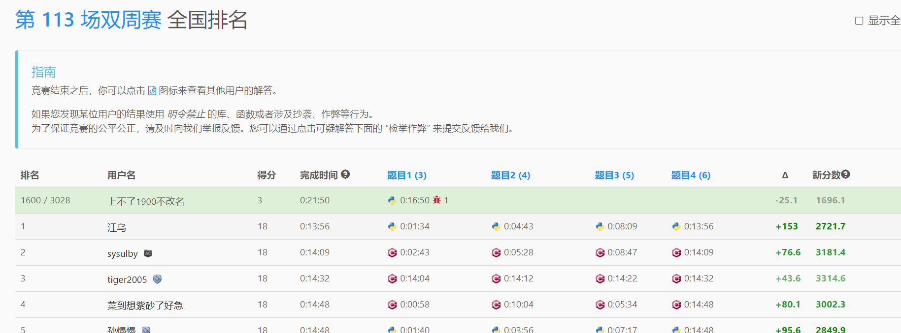


- T1：[8039. 使数组成为递增数组的最少右移次数](https://leetcode.cn/problems/minimum-right-shifts-to-sort-the-array/)

  > 给你一个长度为 `n` 下标从 **0** 开始的数组 `nums` ，数组中的元素为 **互不相同** 的正整数。请你返回让 `nums` 成为递增数组的 **最少右移** 次数，如果无法得到递增数组，返回 `-1` 。
  >
  > 一次 **右移** 指的是同时对所有下标进行操作，将下标为 `i` 的元素移动到下标 `(i + 1) % n` 处。

  有思考量，比赛的时候没考虑模拟，想的是O（n）的做法所以花了很久

  暴力做法：

  ```
  class Solution:
      def minimumRightShifts(self, nums: List[int]) -> int:
          n = len(nums)
          for i in range(n):
              ne = nums[-i:]+nums[:-i]
              if all(a<b for a,b in zip(ne,ne[1:])):
                  return i
          return -1
  ```

  线性做法：

  思路：元素大小关系必须是这样的才能合法

  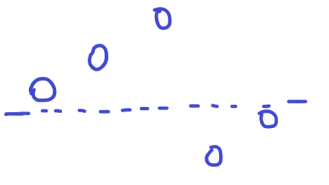

  ```
  class Solution:
      def minimumRightShifts(self, nums: List[int]) -> int:
          n = len(nums)
          # 找到单调性改变的位置
          s = n
          for i in range(1,n):
              if nums[i-1]>nums[i]:
                  s = i
                  break
          # 检查是否合法
          for i in range(s,n):
              if nums[i]>nums[0]:
                  return -1
              elif nums[i] > nums[(i+1)%n]:
                  return -1
          return n-s
  ```

  

- T2：[2856. 删除数对后的最小数组长度](https://leetcode.cn/contest/biweekly-contest-113/problems/minimum-array-length-after-pair-removals/)

  > 给你一个下标从 **0** 开始的 **非递减** 整数数组 `nums` 。
  >
  > 你可以执行以下操作任意次：
  >
  > - 选择 **两个** 下标 `i` 和 `j` ，满足 `i < j` 且 `nums[i] < nums[j]` 。
  > - 将 `nums` 中下标在 `i` 和 `j` 处的元素删除。剩余元素按照原来的顺序组成新的数组，下标也重新从 **0** 开始编号。
  >
  > 请你返回一个整数，表示执行以上操作任意次后（可以执行 **0** 次），`nums` 数组的 **最小** 数组长度。
  >
  > 请注意，`nums` 数组是按 **非降序** 排序的。
  >
  > - `1 <= nums.length <= 105`
  > - `1 <= nums[i] <= 109`
  > - `nums` 是 **非递减** 数组。

  找规律、**思维难度很大**

  ```
  
  ```

  

- T3：[6988. 统计距离为 k 的点对](https://leetcode.cn/problems/count-pairs-of-points-with-distance-k/)

  > 给你一个 **二维** 整数数组 `coordinates` 和一个整数 `k` ，其中 `coordinates[i] = [xi, yi]` 是第 `i` 个点在二维平面里的坐标。
  >
  > 我们定义两个点 `(x1, y1)` 和 `(x2, y2)` 的 **距离** 为 `(x1 XOR x2) + (y1 XOR y2)` ，`XOR` 指的是按位异或运算。
  >
  > 请你返回满足 `i < j` 且点 `i` 和点 `j`之间距离为 `k` 的点对数目。
  >
  > - `2 <= coordinates.length <= 50000`
  > - `0 <= xi, yi <= 106`
  > - `0 <= k <= 100`

  暴力、异或、哈希表

  ```
  class Solution:
      def countPairs(self, coordinates: List[List[int]], k: int) -> int:
          mp = Counter()
          ans = 0
          for x,y in coordinates:
              for a in range(k+1):
                  b = k-a
                  nx,ny = x^a,y^b
                  ans += mp[nx,ny]
              mp[x,y] += 1
          return ans
  ```

- T4：[2858. 可以到达每一个节点的最少边反转次数](https://leetcode.cn/problems/minimum-edge-reversals-so-every-node-is-reachable/)

  > 给你一个 `n` 个点的 **简单有向图** （没有重复边的有向图），节点编号为 `0` 到 `n - 1` 。如果这些边是双向边，那么这个图形成一棵 **树** 。
>
  > 给你一个整数 `n` 和一个 **二维** 整数数组 `edges` ，其中 `edges[i] = [ui, vi]` 表示从节点 `ui` 到节点 `vi` 有一条 **有向边** 。
>
  > **边反转** 指的是将一条边的方向反转，也就是说一条从节点 `ui` 到节点 `vi` 的边会变为一条从节点 `vi` 到节点 `ui` 的边。
  >
  > 对于范围 `[0, n - 1]` 中的每一个节点 `i` ，你的任务是分别 **独立** 计算 **最少** 需要多少次 **边反转** ，从节点 `i` 出发经过 **一系列有向边** ，可以到达所有的节点。
  >
  > 请你返回一个长度为 `n` 的整数数组 `answer` ，其中 `answer[i]`表示从节点 `i` 出发，可以到达所有节点的 **最少边反转** 次数。

  

  换根dp本质找递推关系

  ```
  class Solution:
      def minEdgeReversals(self, n: int, edges: List[List[int]]) -> List[int]:
        	e = [[] for _ in range(n)]
          for a,b in edges:
            e[a].append((b,1))
            e[b].append((a,-1))
          ans = [0]*n
          def dfs1(i,fa):
              for j,direction in e[i]:
                  if j != fa:
                      ans[0] += int(direction == -1)
                      dfs1(j,i)
          dfs1(0,-1)
          # ans[0]已经确定了
  
          def dfs(i,fa):
              for j,direction in e[i]:
                  if j != fa:
                      ans[j] = ans[i] + direction
                      dfs(j,i)
          dfs(0,-1)
          return ans
  ```

  > [【图解】一张图秒懂换根 DP！](https://leetcode.cn/problems/sum-of-distances-in-tree/solution/tu-jie-yi-zhang-tu-miao-dong-huan-gen-dp-6bgb/)

  - [310. 最小高度树](https://leetcode.cn/problems/minimum-height-trees/)
  - [834. 树中距离之和](https://leetcode.cn/problems/sum-of-distances-in-tree/)
  - [2538. 最大价值和与最小价值和的差值](https://leetcode.cn/problems/difference-between-maximum-and-minimum-price-sum/)
  - [2581. 统计可能的树根数目](https://leetcode.cn/problems/count-number-of-possible-root-nodes/)

#### 正反双向建图

在邻接表中e[a].append(b,direction)表示a和b有边，如果direction是1，就表示a->b，否则就是反向边，即b->a

        for a,b in edges:
          e[a].append((b,1))
          e[b].append((a,-1))


### 第 363 场周赛（找规律、大模拟题二分答案）3题

> 2023年9月17日
>
> 昨晚掉打分，今早的周赛还好，604名
>
> T2找规律题，**思维难度是有的**，需要去分析条件的本质，T3题意非常复杂，需要想到枚举完分组后再二分，因为预算非常大有1e8，T4没想出来完全平方数的下标组成

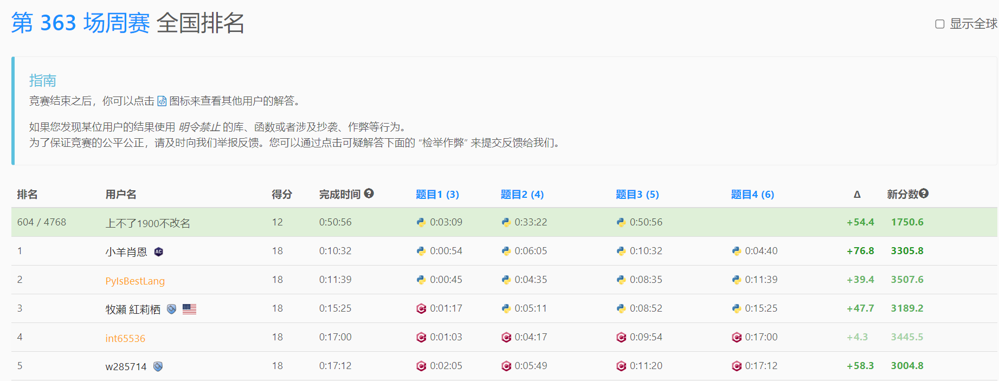

- T1：[计算 K 置位下标对应元素的和](https://leetcode.cn/problems/sum-of-values-at-indices-with-k-set-bits/)

  模拟

- T2：[让所有学生保持开心的分组方法数](https://leetcode.cn/problems/happy-students/)

  > 给你一个下标从 **0** 开始、长度为 `n` 的整数数组 `nums` ，其中 `n` 是班级中学生的总数。班主任希望能够在让所有学生保持开心的情况下选出一组学生：
  >
  > 如果能够满足下述两个条件之一，则认为第 `i` 位学生将会保持开心：
  >
  > - 这位学生被选中，并且被选中的学生人数 **严格大于** `nums[i]` 。
  > - 这位学生没有被选中，并且被选中的学生人数 **严格小于** `nums[i]` 。
  >
  > 返回能够满足让所有学生保持开心的分组方法的数目。
  >
  > - `1 <= nums.length <= 105`
  > - `0 <= nums[i] < nums.length`

  思维题，有思考量

  ```
  class Solution:
      def countWays(self, nums: List[int]) -> int:
          n = len(nums)
          nums.sort()
          ans = 0 if min(nums)==0 else 1
          for i in range(n-1):
              if i+1 > nums[i] and i+1 < nums[i+1]:
                  ans += 1
          return ans+1
  ```

  

- T3：[最大合金数](https://leetcode.cn/problems/maximum-number-of-alloys/)

  > 假设你是一家合金制造公司的老板，你的公司使用多种金属来制造合金。现在共有 `n` 种不同类型的金属可以使用，并且你可以使用 `k` 台机器来制造合金。每台机器都需要特定数量的每种金属来创建合金。
  >
  > 对于第 `i` 台机器而言，创建合金需要 `composition[i][j]` 份 `j` 类型金属。最初，你拥有 `stock[i]` 份 `i` 类型金属，而每购入一份 `i` 类型金属需要花费 `cost[i]` 的金钱。
  >
  > 给你整数 `n`、`k`、`budget`，下标从 **1** 开始的二维数组 `composition`，两个下标从 **1** 开始的数组 `stock` 和 `cost`，请你在预算不超过 `budget` 金钱的前提下，**最大化** 公司制造合金的数量。
  >
  > **所有合金都需要由同一台机器制造。**
  >
  > 返回公司可以制造的最大合金数。
  >
  > - `1 <= n, k <= 100`
  > - `0 <= budget <= 108`

  大模拟+二分答案

  ```
  class Solution:
      def maxNumberOfAlloys(self, n: int, k: int, budget: int, composition: List[List[int]], stock: List[int], cost: List[int]) -> int:
          # 枚举机器，对于每个机器，二分购买数量，得到购买数量的最大值，check一下这个数量是否能买到
          
          # 每组最多买1e8个？？？初始最大就有1e8
          def check(cnt,zu):
              # check（购买数量需要的每个金属的个数，减掉初始值，是否小于预算）
              need = [0]*n
              qian = 0
              for i in range(n):
                  need[i] = cnt*composition[zu][i]
                  need[i] = need[i] - stock[i] if need[i] - stock[i]>=0 else 0
                  qian += need[i]*cost[i]
              return qian <= budget
              
          ans = 0
          for i in range(k):
              l = 0
              r = int(1e9)
              while l<r:
                  mid = l+r+1>>1
                  if check(mid,i):
                      l = mid
                  else:
                      r = mid-1
              ans = max(ans,l)
          return ans
  ```

  

- T4：[完全子集的最大元素和](https://leetcode.cn/problems/maximum-element-sum-of-a-complete-subset-of-indices/)

  > 给你一个下标从 **1** 开始、由 `n` 个整数组成的数组。
  >
  > 如果一组数字中每对元素的乘积都是一个完全平方数，则称这组数字是一个 **完全集** 。
  >
  > 下标集 `{1, 2, ..., n}` 的子集可以表示为 `{i1, i2, ..., ik}`，我们定义对应该子集的 **元素和** 为 `nums[i1] + nums[i2] + ... + nums[ik]` 。
  >
  > 返回下标集 `{1, 2, ..., n}` 的 **完全子集** 所能取到的 **最大元素和** 。
  >
  > 完全平方数是指可以表示为一个整数和其自身相乘的数。
  >
  > - `1 <= n == nums.length <= 104`
  > - `1 <= nums[i] <= 109`

  找规律

  ```
  //举例子
  //  1 4 9 16 25 ... 都是i^2  所以任意两两组合都是(i*j)^2，是完全平方数，满足条件
  //现在枚举i=2时
  //  2 8 18 32 50...  都是2*(i^2)  那么任意两两组合都是2^2*(i*j)^2=(2*i*j)^2 也是完全平方数，满足条件
  //同理i=3      都是(3*i*j)^2
  // ....
  ```

  ```
  class Solution:
      def maximumSum(self, nums: List[int]) -> int:
          n = len(nums)
          ans = 0
          for i in range(1,n+1):
              res = 0
              j = 1
              while i*j*j-1 < n:
                  res += nums[i*j*j-1]
                  j+=1
              ans = max(ans,res)
          return ans
  ```


### 第 364 场力扣周赛（单调栈+dp+前后缀、树形dp/并查集）2题

> 2023年9月24日 15:30:00
>
> 不开心，又是两题选手
>
> T3有思维量，是一个dp好题
>
> T4树形dp，公式推错

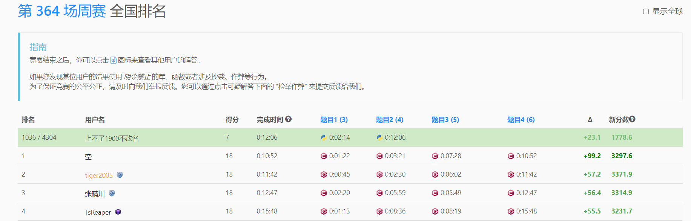

- T1：[8048. 最大二进制奇数](https://leetcode.cn/problems/maximum-odd-binary-number/)

  > 给你一个 **二进制** 字符串 `s` ，其中至少包含一个 `'1'` 。
  >
  > 你必须按某种方式 **重新排列** 字符串中的位，使得到的二进制数字是可以由该组合生成的 **最大二进制奇数** 。
  >
  > 以字符串形式，表示并返回可以由给定组合生成的最大二进制奇数。
  >
  > **注意** 返回的结果字符串 **可以** 含前导零。

  模拟

  ```
  class Solution:
      def maximumOddBinaryNumber(self, s: str) -> str:
          cnt = s.count('1')
          n = len(s)
          ans = '1'*(cnt-1)
          ans += '0'*(n-cnt)
          ans += '1'
          return ans
  ```

  

- T2：[100049. 美丽塔 I](https://leetcode.cn/problems/beautiful-towers-i/)

  > 给你一个长度为 `n` 下标从 **0** 开始的整数数组 `maxHeights` 。
  >
  > 你的任务是在坐标轴上建 `n` 座塔。第 `i` 座塔的下标为 `i` ，高度为 `heights[i]` 。
  >
  > 如果以下条件满足，我们称这些塔是 **美丽** 的：
  >
  > 1. `1 <= heights[i] <= maxHeights[i]`
  > 2. `heights` 是一个 **山状** 数组。
  >
  > 如果存在下标 `i` 满足以下条件，那么我们称数组 `heights` 是一个 **山状** 数组：
  >
  > - 对于所有 `0 < j <= i` ，都有 `heights[j - 1] <= heights[j]`
  > - 对于所有 `i <= k < n - 1` ，都有 `heights[k + 1] <= heights[k]`
  >
  > 请你返回满足 **美丽塔** 要求的方案中，**高度和的最大值** 。
  >
  >  `1 <= n == maxHeights <= 103``
  >
  > ``1 <= maxHeights[i] <= 109`

  枚举山峰

  ```
  class Solution:
      def maximumSumOfHeights(self, maxHeights: List[int]) -> int:
          n = len(maxHeights)
          ans = 0
          for i in range(n):
              select = [0]*n
              select[i] = maxHeights[i]
              for j in range(i-1,-1,-1):
                  select[j] = min(select[j+1],maxHeights[j])
              for j in range(i+1,n):
                  select[j] = min(select[j-1],maxHeights[j])
              ans = max(ans,sum(select))
          return ans
  ```

  

- T3：[100048. 美丽塔 II](https://leetcode.cn/problems/beautiful-towers-ii/)（单调栈、dp、前后缀）

  > 题意和上一题完全一样，但是数据范围不一样
  >
  > - `1 <= n == maxHeights <= 105`
  > - `1 <= maxHeights[i] <= 109`

  dp好题、动态规划、前后缀、单调栈 

  思路

  算前缀最大值时，枚举到i，找到左边离i最近的j，使得a[j]<=a[i]，用j的最大值更新i，对于中间的部分，这些数x比a[i]大，那么就将x变成a[i]，加到pre[i]中，后缀同理

  ```
  class Solution:
      def maximumSumOfHeights(self, maxHeights: List[int]) -> int:
          n = len(maxHeights)
          pre = [0]*n
          suf = [0]*n
          stk = deque()
          ans = 0
          for i in range(n):
              while len(stk) and maxHeights[stk[-1]]>maxHeights[i]:
                  stk.pop()
              if len(stk)==0:
                  cnt = i+1
              else:
                  cnt = i-stk[-1]
                  pre[i] = pre[stk[-1]]
              pre[i] += maxHeights[i]*cnt
              stk.append(i)
          # print(pre)
          stk = deque()
          for i in range(n-1,-1,-1):
              while len(stk) and maxHeights[stk[-1]]>maxHeights[i]:
                  stk.pop()
              if len(stk)==0:
                  cnt = n-i
              else:
                  cnt = stk[-1]-i
                  suf[i] = suf[stk[-1]]
              suf[i] += maxHeights[i]*cnt
              stk.append(i)
              ans = max(ans,pre[i]+suf[i]-maxHeights[i])
          # print(suf)
          return ans
  ```

  

- T4：[100047. 统计树中的合法路径数目](https://leetcode.cn/problems/count-valid-paths-in-a-tree/)

  > 给你一棵 `n` 个节点的无向树，节点编号为 `1` 到 `n` 。给你一个整数 `n` 和一个长度为 `n - 1` 的二维整数数组 `edges` ，其中 `edges[i] = [ui, vi]` 表示节点 `ui` 和 `vi` 在树中有一条边。
  >
  > 请你返回树中的 **合法路径数目** 。
  >
  > 如果在节点 `a` 到节点 `b` 之间 **恰好有一个** 节点的编号是质数，那么我们称路径 `(a, b)` 是 **合法的** 。
  >
  > **注意：**
  >
  > - 路径 `(a, b)` 指的是一条从节点 `a` 开始到节点 `b` 结束的一个节点序列，序列中的节点 **互不相同** ，且相邻节点之间在树上有一条边。
  > - 路径 `(a, b)` 和路径 `(b, a)` 视为 **同一条** 路径，且只计入答案 **一次** 。

  树形dp，没做出来，要推公式，公式推错了比赛的时候，还需要优化，否则TLE

  公式：

  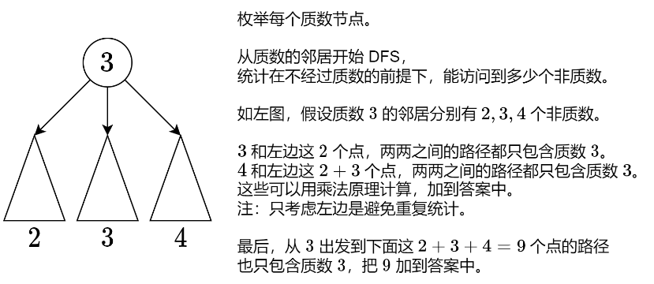

  TLE代码：

  ```
  class Solution:
      def countPaths(self, n: int, edges: List[List[int]]) -> int:
  
          e = [[] for _ in range(n+1)]
          for a,b in edges:
              e[a].append(b)
              e[b].append(a)
          def dfs(i,fa):
              s = 1
              # print(i,fa)
              for j in e[i]:
                  if j!=fa and vis[j]==1:
                      s += dfs(j,i)
              return s
          ans = 0
          for x in primes:
              if x>n:break
              res = 1
              s = 0
              for j in e[x]:
                  if vis[j]==0:continue
                  cnt = dfs(j,x)
                  ans += cnt*s
                  s += cnt
              ans += s 
              # print(x,s , res)
          return ans
  ```

  当一种特殊的情况，每个质数都会把所有的点遍历一遍，就会TLE

  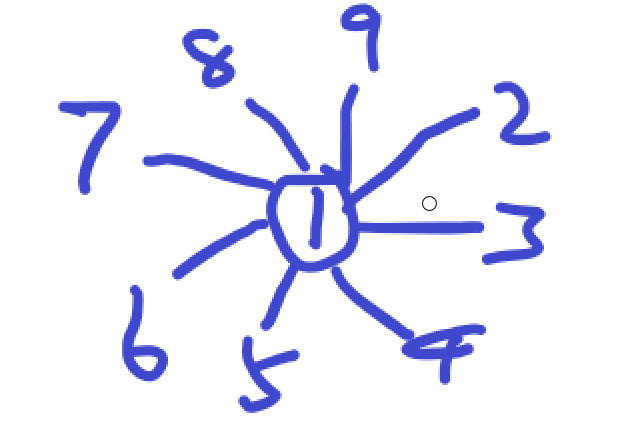

  AC代码:

  sz[j]表示j所在非质数连通块的大小

  ```
  mx = 10**5
  primes = []
  vis = [0]*(mx+1)
  for i in range(2,mx+1):
      if vis[i]==0:
          primes.append(i)
          for j in range(i+i,mx+1,i):
              vis[j] = 1
  vis[1] = 1
  
  # print(primes)
  class Solution:
      def countPaths(self, n: int, edges: List[List[int]]) -> int:
  
          e = [[] for _ in range(n+1)]
          sz = [0]*(n+1)
          for a,b in edges:
              e[a].append(b)
              e[b].append(a)
  
          def dfs(i,fa):
              nodes.append(i)
              for j in e[i]:
                  if j!=fa and vis[j]==1:
                      dfs(j,i)
          ans = 0
          for x in primes:
              if x>n:break
              s = 0
              for j in e[x]:
                  if vis[j]==0:continue
                  if sz[j]==0:
                      nodes = []
                      dfs(j,x)
                      for x in nodes:
                          sz[x] = len(nodes)
                  ans += sz[j]*s
                  s += sz[j]
              ans += s 
          return ans
  ```

  方法2：并查集

  ```
  mx = 10**5
  primes = []
  vis = [0]*(mx+1)
  for i in range(2,mx+1):
      if vis[i]==0:
          primes.append(i)
          for j in range(i+i,mx+1,i):
              vis[j] = 1
  vis[1] = 1
  
  # print(primes)
  class Solution:
      def countPaths(self, n: int, edges: List[List[int]]) -> int:
          
          e = [[] for _ in range(n+1)]
          uf = UnionFind(n)
          for a,b in edges:
              e[a].append(b)
              e[b].append(a)
              if vis[a]==1 and vis[b]==1:
                  uf.union(a,b)
          
          ans = 0
          for x in primes:
              if x>n:break
              s = 0
              for j in e[x]:
                  if vis[j]==0:continue
                  sub_cnt = uf.cnt[uf.find(j)]
                  ans += sub_cnt * s
                  s += sub_cnt
              ans += s    
          return ans
  class UnionFind:
      def __init__(self,n):
          fa = [i for i in range(n+1)]
          cnt = [1]*(n+1)
          self.fa = fa
          self.cnt = cnt
      def find(self,x):
          if self.fa[x]==x:
              return x
          self.fa[x] = self.find(self.fa[x])
          return self.fa[x]
      def union(self,a,b):
          a = self.find(a)
          b = self.find(b)
          if a==b: return 
          self.cnt[b] += self.cnt[a]
          self.fa[a] = b
          return 
  ```


### 第 114 场双周赛（树形dp、位运算贪心）2题

> 2023年9月30日
>
> 双周赛第900名就扣分了，感觉以后双周赛是否要开个小号打？

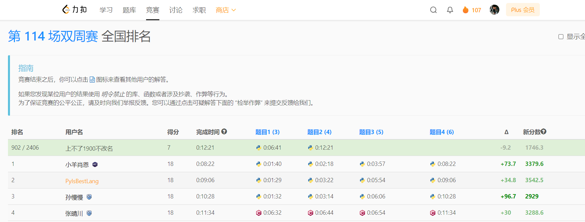

- T1：[8038. 收集元素的最少操作次数](https://leetcode.cn/problems/minimum-operations-to-collect-elements/)

  > 给你一个正整数数组 `nums` 和一个整数 `k` 。
  >
  > 一次操作中，你可以将数组的最后一个元素删除，将该元素添加到一个集合中。
  >
  > 请你返回收集元素 `1, 2, ..., k` 需要的 **最少操作次数** 。

  模拟、哈希表

  ```
  class Solution:
      def minOperations(self, nums: List[int], k: int) -> int:
          n = len(nums)
          se = set()
          for i in range(n-1,-1,-1):
              if nums[i]>k:continue
              se.add(nums[i])
              if len(se)==k:
                  return n-i
  ```

  方法2：位运算

  因为nums[i]最大是50，可以用64位整数作为集合存储这个数。

  ```
  class Solution:
      def minOperations(self, nums: List[int], k: int) -> int:
          n = len(nums)
          # 移位优先级很低
          # 1~k位是1对应的二进制
          u = (1<<(k+1)) - 2
          s = 0
          for i in range(n-1,-1,-1):
              # 加入到集合中
              s |= 1<<nums[i]
              # 当s包含u时
              if s&u == u:
                  return n-i
  ```

  

- T2：[100032. 使数组为空的最少操作次数](https://leetcode.cn/problems/minimum-number-of-operations-to-make-array-empty/)

  > 给你一个下标从 **0** 开始的正整数数组 `nums` 。
  >
  > 你可以对数组执行以下两种操作 **任意次** ：
  >
  > - 从数组中选择 **两个** 值 **相等** 的元素，并将它们从数组中 **删除** 。
  > - 从数组中选择 **三个** 值 **相等** 的元素，并将它们从数组中 **删除** 。
  >
  > 请你返回使数组为空的 **最少** 操作次数，如果无法达成，请返回 `-1` 。
  >
  > - `2 <= nums.length <= 105`

  方法1：找规律

  方法2：dp、爬楼梯、不用动脑子

  ```
  mx = 10**6+10
  dp = [inf]*mx
  dp[2] = 1
  dp[3] = 1
  for i in range(4,mx):
      dp[i] = min(dp[i-2],dp[i-3])+1
  class Solution:
      def minOperations(self, nums: List[int]) -> int:
          mp = Counter(nums)
          n = len(nums)
          ans = 0
          for x in mp:
              if dp[mp[x]]==inf:
                  return -1
              ans += dp[mp[x]]
          return ans
  ```

- T3：[100019. 将数组分割成最多数目的子数组](https://leetcode.cn/problems/split-array-into-maximum-number-of-subarrays/)

  > 给你一个只包含 **非负** 整数的数组 `nums` 。
  >
  > 我们定义满足 `l <= r` 的子数组 `nums[l..r]` 的分数为 `nums[l] AND nums[l + 1] AND ... AND nums[r]` ，其中 **AND** 是按位与运算。
  >
  > 请你将数组分割成一个或者更多子数组，满足：
  >
  > - **每个** 元素都 **只** 属于一个子数组。
  > - 子数组分数之和尽可能 **小** 。
  >
  > 请你在满足以上要求的条件下，返回 **最多** 可以得到多少个子数组。
  >
  > 一个 **子数组** 是一个数组中一段连续的元素。
  >
  > - `1 <= nums.length <= 105`

  位运算、贪心、有思考量

  ```
  class Solution:
      def maxSubarrays(self, nums: List[int]) -> int:
          n = len(nums)
          # 性质：随着元素增多，按位与（AND）的结果越来越小
          # ans:求分数最小的情况下，最多的子数组个数
          # 思考：分数最小是多少？最小是0
          # 假设AND（nums）= a(每个子数组的AND都>=a)，思考是否能找到一个划分使得分数和小于a
          # 1.如果a>0，此时假设划分2个子数组,那么每个子数组都>=a,和也大于a
          # 所以对于a>0的情况，此时最小值就是当整个数组不被划分的时候，也就是子数组的个数是1
          # 2.如果a==0,此时最小值就是0，下面思考如何让子数组最多
          # 根据样例1思考如何划分，其实就是每当一个按位与操作等于0的时候就切一刀
          # 例子：思考[2,0,1,2]这个例子中，该如何切分？
          # 这一刀到底是在0后面且还是在1后面切呢，2&0 = 0,2&0&1 = 0
          # 必须切在0后面，如果切在1后面，那么最后一个2就无法置0，因为1&2 = 0
          # 划分策略：每一次到0的时候就立刻划分，把下一个数留到下一次划分使用，从而才能使后面尽可能小
          # 在写代码的时候a>0的情况最后和1取max即可
          s = -1 # -1代表全1，也就是0xffff
          ans = 0
          for x in nums:
              s &= x
              if s==0:
                  ans += 1
                  s = -1
          return max(ans,1)
  ```

  - 位运算知识点：

    随着元素增多，按位与（AND）的结果越来越小

    随着元素增多，按位或（OR）的结果越来越大

- T4：[2872. 可以被 K 整除连通块的最大数目](https://leetcode.cn/problems/maximum-number-of-k-divisible-components/)

  > 给你一棵 `n` 个节点的无向树，节点编号为 `0` 到 `n - 1` 。给你整数 `n` 和一个长度为 `n - 1` 的二维整数数组 `edges` ，其中 `edges[i] = [ai, bi]` 表示树中节点 `ai` 和 `bi` 有一条边。
  >
  > 同时给你一个下标从 **0** 开始长度为 `n` 的整数数组 `values` ，其中 `values[i]` 是第 `i` 个节点的 **值** 。再给你一个整数 `k` 。
  >
  > 你可以从树中删除一些边，也可以一条边也不删，得到若干连通块。一个 **连通块的值** 定义为连通块中所有节点值之和。如果所有连通块的值都可以被 `k` 整除，那么我们说这是一个 **合法分割** 。
  >
  > 请你返回所有合法分割中，**连通块数目的最大值** 。
>
  > - `1 <= n <= 3 * 104`
> - `edges.length == n - 1`
  > - `edges[i].length == 2`
> - `0 <= ai, bi < n`
  > - `values.length == n`
  > - `0 <= values[i] <= 109`
  > - `1 <= k <= 109`
  > - `values` 之和可以被 `k` 整除。
  > - 输入保证 `edges` 是一棵无向树。

  树形dp、连通块的个数

  判断子树点权和是否为 k 的倍数

  关键点：由于题目保证 **values之和可以被 k 整除**。那么只需要看一侧的点权和是否为 k 的倍数。如果一侧是，那么另一侧的也一定是k的倍数。

  ```
  class Solution:
      def maxKDivisibleComponents(self, n: int, edges: List[List[int]], nums: List[int], k: int) -> int:
          g = [[] for _ in range(n)]
          for x, y in edges:
              g[x].append(y)
              g[y].append(x)
          ans = 0
        # 返回x为子树的价值和
          def dfs(x: int, fa: int) -> int:
            s = nums[x]
              for y in g[x]:
                  if y != fa:
                      s += dfs(y, x)
              nonlocal ans
              ans += s%k==0
              return s
          dfs(0,-1)
          return ans
  ```

  - 扩展

  如果这题没有了条件： **values之和可以被 k 整除**，那么也是可以做的，思路就是把一侧的和sub_sum算出来，如果是k的倍数，然后再判断整棵树中节点之和sum 减去 sub_sum是否是k的倍数，如果是就ans++

  ```
  class Solution:
      def maxKDivisibleComponents(self, n: int, edges: List[List[int]], nums: List[int], k: int) -> int:
          g = [[] for _ in range(n)]
          for x, y in edges:
              g[x].append(y)
              g[y].append(x)
          ans = 0
          total_sum = sum(nums)
          # 返回x为子树的价值和
          def dfs(x: int, fa: int) -> int:
              sub_sum = nums[x]
              for y in g[x]:
                  if y != fa:
                      sub_sum += dfs(y, x)
              nonlocal ans
              if sub_sum%k==0 and (total_sum-sub_sum)%k==0:
                  ans+=1
              return sub_sum
          dfs(0,-1)
          return ans
  ```

  > 本题和第89场双周赛的T4及其相似，代码拿过来改改就能过。随便选定一个节点作为根进行DFS，在遍历的过程中需要计算以u为根节点的子树点权和w（被DFS函数返回），只要w可以被k整除，就马上把这一个连通块划分出去，并向上返回0，表示这个连通块被划分出去了，上面的节点在统计时不考虑这个连通块的点权和。题目：[2440. 创建价值相同的连通块](https://leetcode.cn/problems/create-components-with-same-value/)

  - [2440. 创建价值相同的连通块](https://leetcode.cn/problems/create-components-with-same-value/)
  
    > 有一棵 `n` 个节点的无向树，节点编号为 `0` 到 `n - 1` 。
    >
    > 给你一个长度为 `n` 下标从 **0** 开始的整数数组 `nums` ，其中 `nums[i]` 表示第 `i` 个节点的值。同时给你一个长度为 `n - 1` 的二维整数数组 `edges` ，其中 `edges[i] = [ai, bi]` 表示节点 `ai` 与 `bi` 之间有一条边。
    >
    > 你可以 **删除** 一些边，将这棵树分成几个连通块。一个连通块的 **价值** 定义为这个连通块中 **所有** 节点 `i` 对应的 `nums[i]` 之和。
    >
    > 你需要删除一些边，删除后得到的各个连通块的价值都相等。请返回你可以删除的边数 **最多** 为多少。
    >
    > 2460
  
    枚举+树形dp
  
    dfs返回向下删除了所有合法的连通块后的节点和
  
    时间复杂度思考：枚举所有的因子的时间怎么思考？n的因子的个数是n**(1/3)个，所以1e6最多有1e2个因子，所以会进行1e2级别次的dfs，每一次都是1e4次，所以是能过的
  
    ```
    class Solution:
        def componentValue(self, nums: List[int], edges: List[List[int]]) -> int:
            n = len(nums)
            e = [[] for _ in range(n)]
            for a,b in edges:
                e[a].append(b)
                e[b].append(a)
            # 返回节点u向下的子树删除了所有合法连通块后的节点之和
            def dfs(u,fa):
                s = nums[u]
                for j in e[u]:
                    if j!=fa:
                        s += dfs(j,u)
                # 自底向上
                # 如果和是target，就把这一棵子树删除
                if s == target:
                    return 0
                return s
            
            total = sum(nums)
            # 枚举连通块的个数
            for i in range(n,0,-1):
                if total%i==0:
                    target = total//i # 每个连通块的价值
                    # 如果整棵树向下的节点和是0：删除了所有合法连通块后就是答案
                    if dfs(0,-1)==0:
                        return i-1
    ```
  
    > 这个代码还可以剪枝，看灵神题解：https://leetcode.cn/problems/create-components-with-same-value/solutions/1895302/by-endlesscheng-u03q/
  
  - 扩展题：https://codeforces.com/problemset/problem/767/C

### 第 365 场周赛（基环树、滑窗）

> 2023年10月1日
>
> 单周赛第600名，但是这次人数比较少，只有3000人左右

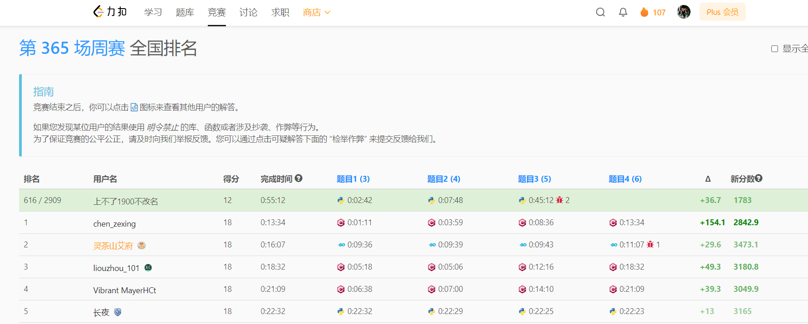

- T1：[100088. 有序三元组中的最大值 I](https://leetcode.cn/problems/maximum-value-of-an-ordered-triplet-i/)

  > 给你一个下标从 **0** 开始的整数数组 `nums` 。
  >
  > 请你从所有满足 `i < j < k` 的下标三元组 `(i, j, k)` 中，找出并返回下标三元组的最大值。如果所有满足条件的三元组的值都是负数，则返回 `0` 。
  >
  > **下标三元组** `(i, j, k)` 的值等于 `(nums[i] - nums[j]) * nums[k]` 。
  >
  > - `3 <= nums.length <= 100`

  三重循环暴力

  ```
  class Solution:
      def maximumTripletValue(self, nums: List[int]) -> int:
          n = len(nums)
          ans = 0
          for i in range(n):
              for j in range(i+1,n):
                  for k in range(j+1,n):
                      ans = max(ans,(nums[i] - nums[j]) * nums[k])
          return ans
  ```

- T2：[100086. 有序三元组中的最大值 II](https://leetcode.cn/problems/maximum-value-of-an-ordered-triplet-ii/)

  > 给你一个下标从 **0** 开始的整数数组 `nums` 。
  >
  > 请你从所有满足 `i < j < k` 的下标三元组 `(i, j, k)` 中，找出并返回下标三元组的最大值。如果所有满足条件的三元组的值都是负数，则返回 `0` 。
  >
  > **下标三元组** `(i, j, k)` 的值等于 `(nums[i] - nums[j]) * nums[k]` 。
  >
  > - `3 <= nums.length <= 105`

  上一题的线性做法

  写法1：枚举k

  这种写法比较需要思维，需要维护nums[i]-nums[j]的最大值，从而需要维护nums[i]的最大值

  ```
  class Solution:
      def maximumTripletValue(self, nums: List[int]) -> int:
          n = len(nums)
          mx_x = max(nums[0],nums[1])
          mx_cha = nums[0]-nums[1]
          ans = 0
          # 枚举k
          for i in range(2,n):
              ans = max(ans,mx_cha*nums[i])
              # 更新(nums[i] - nums[j])的最大值
              mx_cha = max(mx_cha,mx_x-nums[i])
              # 更新nums[i]的最大值
              mx_x = max(mx_x,nums[i])
          return ans
  ```

  写法2：枚举j

  ```
      def maximumTripletValue(self, nums: List[int]) -> int:
          n = len(nums)
          pre_max = [0]*n
          suf_max = [0]*n
          for i in range(n):
              pre_max[i] = max(pre_max[i-1],nums[i])
          for i in range(n-1,-1,-1):
              suf_max[i] = max(suf_max[i+1],nums[i]) if i!=n-1 else nums[i]
          ans = 0
          for j in range(1,n-1):
              ans = max(ans,(pre_max[j-1]-nums[j])*suf_max[j+1])
          return ans
  ```

- T3：[100076. 无限数组的最短子数组](https://leetcode.cn/problems/minimum-size-subarray-in-infinite-array/)（滑动窗口、前缀和哈希表）

  > 给你一个下标从 **0** 开始的数组 `nums` 和一个整数 `target` 。
  >
  > 下标从 **0** 开始的数组 `infinite_nums` 是通过无限地将 nums 的元素追加到自己之后生成的。
  >
  > 请你从 `infinite_nums` 中找出满足 **元素和** 等于 `target` 的 **最短** 子数组，并返回该子数组的长度。如果不存在满足条件的子数组，返回 `-1` 。
  >
  > - `1 <= nums.length <= 105`
  > - `1 <= nums[i] <= 105`

  找规律、滑动窗口或前缀和哈希表

  target如果很大一定横跨很多个长度是n的数组，先把这些重复的给去掉，最后再分析子数组的和是否存在

  - 方法1：滑动窗口

    由于本题的nums[i]都是非负数，满足单调性，所以可以使用滑动窗口。

    > 如果nums[i]中有负数，那么就不能滑动窗口了，因为无法保证左端点一定向右，就需要看方法2了

  ```
  class Solution:
      def minSizeSubarray(self, nums: List[int], target: int) -> int:
          n = len(nums)
          ans = 0
          s = sum(nums)
          if target > s:
              ans = target//s * n
              target %= s
          if target==0:
              return ans
          # 滑动窗口求和是target的子数组（前提：nums[i]>=0）
          i,j = 0,0
          s = 0
          res = inf
          while i<2*n:
              s += nums[i%n]
              while s>target and j<=i:
                  s-=nums[j%n]
                  j+=1
              if s==target:
                  res = min(res,i-j+1)
              i+=1
  
          return ans+res if res!=inf else -1
  ```

  

  - 方法2：哈希表+前缀和 

    哈希表+前缀和 的思路适合所有求子数组和的区间，无论nums[i]是否大于0

  ```
  class Solution:
      def minSizeSubarray(self, nums: List[int], target: int) -> int:
          n = len(nums)
          ans = 0
          s = sum(nums)
          # 去除周期
          if target > s:
              ans = target//s * n
              target %= s
          if target==0:
              return ans
          mp = Counter()
          # 长度为2n的数组的前缀和
          s = [0]*(2*n+1)
          for i in range(n):
              s[i] = s[i-1]+nums[i]
          for i in range(n,2*n):
              s[i] = s[i-1]+nums[i-n]
          res = inf
          # 检查是否存在一个和是target的子数组
          for i in range(2*n):
              su = s[i]-target
              if su in mp:
                  res = min(res,i-mp[su])
              mp[s[i]] = i
          return ans+res if res!=inf else -1
  ```

- T4：[100075. 有向图访问计数](https://leetcode.cn/problems/count-visited-nodes-in-a-directed-graph/)

  > 现有一个有向图，其中包含 `n` 个节点，节点编号从 `0` 到 `n - 1` 。此外，该图还包含了 `n` 条有向边。
  >
  > 给你一个下标从 **0** 开始的数组 `edges` ，其中 `edges[i]` 表示存在一条从节点 `i` 到节点 `edges[i]` 的边。
  >
  > 想象在图上发生以下过程：
  >
  > - 你从节点 `x` 开始，通过边访问其他节点，直到你在 **此过程** 中再次访问到之前已经访问过的节点。
  >
  > 返回数组 `answer` 作为答案，其中 `answer[i]` 表示如果从节点 `i` 开始执行该过程，你可以访问到的不同节点数。
  
  内向基环树
  
  解法：环上的点的答案就是所在环的节点个数，不在环上的点的答案就是自己距离环的路径
  
  思路：拓扑排序删除环外的其他节点（一层一层删除叶子），找到所有的环，计算环中节点个数，再从环dfs到所有的非环上节点，从而更新距离。
  
  建图：由于是**内向**基环树，所有节点都朝向环，所以本题的建图方式是采用**反向建图**。最后从环的dfs也是基于这个反向图进行反向dfs。如果需要节点a的出边该怎么办呢？其实题目已经给了,数组edges[a]就是了。
  
  ```
  class Solution:
      def countVisitedNodes(self, g: List[int]) -> List[int]:
          n = len(g)
          rg = [[]for _ in range(n)]
          deg = [0]*n
          for a,b in enumerate(g):
              # 反图，存储所有到达b的节点，比如a->b，那么就rg[b].append(a)
              rg[b].append(a) 
              deg[b]+=1
          
          # 拓扑排序去掉所有叶子
          q = deque()
          for i in range(n):
              if deg[i]==0:
                  q.append(i)
          while len(q):
              u = q.popleft()
              deg[g[u]]-=1
              if deg[g[u]]==0:
                  q.append(g[u])
          ans = [-1]*n
          def rdfs(u,depth):
              ans[u] = depth
              for j in rg[u]:
                  if deg[j]==0:
                      rdfs(j,depth+1)
          # 找出所有环
          for i in range(n):
              if deg[i]<=0:continue
              # 找出一个环
              ring = []
              t = i
              while True:
                  ring.append(t)
                  deg[t] = -1 # 环上点下次不再访问
                  t = g[t]
                  if t==i:break
              # 从环上的点反向dfs更新深度
              for p in ring:
                  rdfs(p,len(ring))
          return ans
  ```

#### 反向建图

反向图中，一般用rg表示，rg[b]存的是能到达节点b的所有顶点

正常的邻接表存储的是这样的，g[a]表示a能到达的所有节点

#### 基环树题单

https://leetcode.cn/problems/maximum-employees-to-be-invited-to-a-meeting/solutions/1187830/nei-xiang-ji-huan-shu-tuo-bu-pai-xu-fen-c1i1b/

- 概念
  - 基环树：有n个点，n条边的树（多一条边就正好有环），且每个点有一个出边

- [2127. 参加会议的最多员工数](https://leetcode.cn/problems/maximum-employees-to-be-invited-to-a-meeting/)
- [2359. 找到离给定两个节点最近的节点](https://leetcode.cn/problems/find-closest-node-to-given-two-nodes/)
- [2360. 图中的最长环](https://leetcode.cn/problems/longest-cycle-in-a-graph/)
- [2836. 在传球游戏中最大化函数值](https://leetcode.cn/problems/maximize-value-of-function-in-a-ball-passing-game)


#### 滑动窗口题单

```
题单（右边的数字是题目难度）
定长滑动窗口
1456. 定长子串中元音的最大数目 1263
2269. 找到一个数字的 K 美丽值 1280
1984. 学生分数的最小差值 1306
643. 子数组最大平均数 I
1343. 大小为 K 且平均值大于等于阈值的子数组数目 1317
2090. 半径为 k 的子数组平均值 1358
2379. 得到 K 个黑块的最少涂色次数 1360
1052. 爱生气的书店老板 1418
2841. 几乎唯一子数组的最大和 1546
2461. 长度为 K 子数组中的最大和 1553
1423. 可获得的最大点数 1574
2134. 最少交换次数来组合所有的 1 II 1748
2653. 滑动子数组的美丽值 1786
567. 字符串的排列
438. 找到字符串中所有字母异位词
2156. 查找给定哈希值的子串 2063
346. 数据流中的移动平均值（会员题）
1100. 长度为 K 的无重复字符子串（会员题）
不定长滑动窗口（求最长/最大）
3. 无重复字符的最长子串
1493. 删掉一个元素以后全为 1 的最长子数组 1423
904. 水果成篮 1516
1695. 删除子数组的最大得分 1529
2841. 几乎唯一子数组的最大和 1546
2024. 考试的最大困扰度 1643
1004. 最大连续1的个数 III 1656
1438. 绝对差不超过限制的最长连续子数组 1672
2401. 最长优雅子数组 1750
1658. 将 x 减到 0 的最小操作数 1817
1838. 最高频元素的频数 1876
2831. 找出最长等值子数组 1976
2106. 摘水果 2062
1610. 可见点的最大数目 2147
159. 至多包含两个不同字符的最长子串（会员题）
340. 至多包含 K 个不同字符的最长子串（会员题）
不定长滑动窗口（求最短/最小）
209. 长度最小的子数组
1234. 替换子串得到平衡字符串 1878
1574. 删除最短的子数组使剩余数组有序 1932
76. 最小覆盖子串
不定长滑动窗口（求子数组个数）
2799. 统计完全子数组的数目 1398
713. 乘积小于 K 的子数组
1358. 包含所有三种字符的子字符串数目 1646
2302. 统计得分小于 K 的子数组数目 1808
2537. 统计好子数组的数目 1892
2762. 不间断子数组 1940
多指针滑动窗口
930. 和相同的二元子数组 1592
1248. 统计「优美子数组」 1624
1712. 将数组分成三个子数组的方案数 2079
2444. 统计定界子数组的数目 2093
992. K 个不同整数的子数组 2210

作者：灵茶山艾府
链接：https://leetcode.cn/problems/minimum-size-subarray-in-infinite-array/solutions/2464878/hua-dong-chuang-kou-on-shi-jian-o1-kong-cqawc/
来源：力扣（LeetCode）
著作权归作者所有。商业转载请联系作者获得授权，非商业转载请注明出处。
```

### 第 366场周赛(位运算、dp) 2题

> 2023年10月8日
>
> T3的dp非常多的人没想出来，可以O (n^2)，可以O(n)，也可以O(n^3)区间dp
>
> T4位运算又没做出来

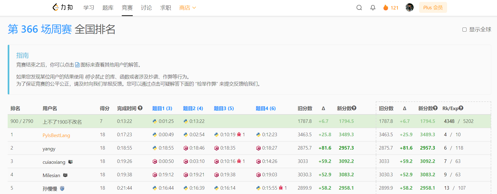

- T1:[分类求和并作差](https://leetcode.cn/problems/divisible-and-non-divisible-sums-difference/)

  模拟

- T2:[最小处理时间](https://leetcode.cn/problems/minimum-processing-time/)

  > 你有 `n` 颗处理器，每颗处理器都有 `4` 个核心。现有 `n * 4` 个待执行任务，每个核心只执行 **一个** 任务。
  >
  > 给你一个下标从 **0** 开始的整数数组 `processorTime` ，表示每颗处理器最早空闲时间。另给你一个下标从 **0** 开始的整数数组 `tasks` ，表示执行每个任务所需的时间。返回所有任务都执行完毕需要的 **最小时间** 。
  >
  > 注意：每个核心独立执行任务。
  >
  > - `1 <= n == processorTime.length <= 25000`
  > - `1 <= tasks.length <= 105`

  贪心

  ```
  class Solution:
      def minProcessingTime(self, processorTime: List[int], tasks: List[int]) -> int:
          n = len(processorTime)
          tasks.sort(key=lambda x:-x)
          processorTime.sort()
          ans = 0
  
          for i in range(n):
              s = -inf
              for j in range(i*4,i*4+4,1):
                  s = max(s,tasks[j])
  
              ans = max(ans,s+processorTime[i])
          return ans
  ```

  

- T3:[执行操作使两个字符串相等](https://leetcode.cn/problems/apply-operations-to-make-two-strings-equal/)（动态规划，过的人很少）

  > 给你两个下标从 **0** 开始的二进制字符串 `s1` 和 `s2` ，两个字符串的长度都是 `n` ，再给你一个正整数 `x` 。
  >
  > 你可以对字符串 `s1` 执行以下操作 **任意次** ：
  >
  > - 选择两个下标 `i` 和 `j` ，将 `s1[i]` 和 `s1[j]` 都反转，操作的代价为 `x` 。
  > - 选择满足 `i < n - 1` 的下标 `i` ，反转 `s1[i]` 和 `s1[i + 1]` ，操作的代价为 `1` 。
  >
  > 请你返回使字符串 `s1` 和 `s2` 相等的 **最小** 操作代价之和，如果无法让二者相等，返回 `-1` 。
  >
  > **注意** ，反转字符的意思是将 `0` 变成 `1` ，或者 `1` 变成 `0` 。
  >
  > - `n == s1.length == s2.length`
  > - `1 <= n, x <= 500`

  ```
  
  ```

  

- T4:[对数组执行操作使平方和最大](https://leetcode.cn/problems/apply-operations-on-array-to-maximize-sum-of-squares/) (位运算)

  > 给你一个下标从 **0** 开始的整数数组 `nums` 和一个 **正** 整数 `k` 。
  >
  > 你可以对数组执行以下操作 **任意次** ：
  >
  > - 选择两个互不相同的下标 `i` 和 `j` ，**同时** 将 `nums[i]` 更新为 `(nums[i] AND nums[j])` 且将 `nums[j]` 更新为 `(nums[i] OR nums[j])` ，`OR` 表示按位 **或** 运算，`AND` 表示按位 **与** 运算。
  >
  > 你需要从最终的数组里选择 `k` 个元素，并计算它们的 **平方** 之和。
  >
  > 请你返回你可以得到的 **最大** 平方和。
  >
  > 由于答案可能会很大，将答案对 `109 + 7` **取余** 后返回。
  >
  > - `1 <= k <= nums.length <= 105`
  > - `1 <= nums[i] <= 109`

### 第 115 场双周赛（多重背包dp的优化、LIS求路径）3题

> 2023年10月15日
>
> dp专场，T2、T3都是LIS，T4是多重背包优化dp（前缀和优化）

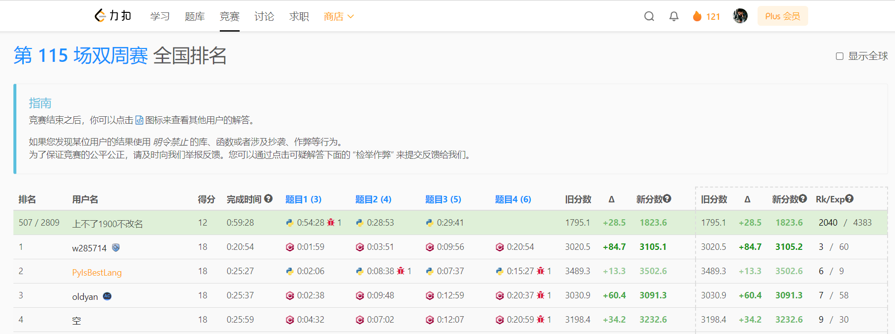

- [100095. 上一个遍历的整数](https://leetcode.cn/problems/last-visited-integers/)（阅读理解题）

  > 给你一个下标从 **0** 开始的字符串数组 `words` ，其中 `words[i]` 要么是一个字符串形式的正整数，要么是字符串 `"prev"` 。
  >
  > 我们从数组的开头开始遍历，对于 `words` 中的每个 `"prev"` 字符串，找到 `words` 中的 **上一个遍历的整数** ，定义如下：
  >
  > - `k` 表示到当前位置为止的连续 `"prev"` 字符串数目（包含当前字符串），令下标从 **0** 开始的 **整数** 数组 `nums` 表示目前为止遍历过的所有整数，同时用 `nums_reverse` 表示 `nums` 反转得到的数组，那么当前 `"prev"` 对应的 **上一个遍历的整数** 是 `nums_reverse` 数组中下标为 `(k - 1)` 的整数。
  > - 如果 `k` 比目前为止遍历过的整数数目 **更多** ，那么上一个遍历的整数为 `-1` 。
  >
  > 请你返回一个整数数组，包含所有上一个遍历的整数。

  题目意思非常绕，这题比赛做了20min

  ```
  class Solution:
      def lastVisitedIntegers(self, words: List[str]) -> List[int]:
          q = []
          n = len(words)
          ans = []
          k = 0
          for i in range(n):
              if words[i]=='prev':
                  k+=1
                  if k>len(q):
                      ans.append(-1)
                  else:
                      ans.append(int(q[::-1][k-1]))
              else:
                  q.append(words[i])
                  k = 0
          return ans
  ```

- [100078. 最长相邻不相等子序列 I](https://leetcode.cn/problems/longest-unequal-adjacent-groups-subsequence-i/)

  > 给你一个整数 `n` 和一个下标从 **0** 开始的字符串数组 `words` ，和一个下标从 **0** 开始的 **二进制** 数组 `groups` ，两个数组长度都是 `n` 。
  >
  > 你需要从下标 `[0, 1, ..., n - 1]` 中选出一个 **最长子序列** ，将这个子序列记作长度为 `k` 的 `[i0, i1, ..., ik - 1]` ，对于所有满足 `0 < j + 1 < k` 的 `j` 都有 `groups[ij] != groups[ij + 1]` 。
  >
  > 请你返回一个字符串数组，它是下标子序列 **依次** 对应 `words` 数组中的字符串连接形成的字符串数组。如果有多个答案，返回任意一个。
  >
  > **子序列** 指的是从原数组中删掉一些（也可能一个也不删掉）元素，剩余元素不改变相对位置得到的新的数组。
  >
  > **注意：**`words` 中的字符串长度可能 **不相等** 。
  >
  > - `1 <= n == words.length == groups.length <= 100`
  > - `1 <= words[i].length <= 10`

  可以贪心做，我用的dp

  ```
  class Solution:
      def getWordsInLongestSubsequence(self, n: int, words: List[str], groups: List[int]) -> List[str]:
          dp = [0]*(n)
          path = [-1]*(n)
          dp[0] = 1
          res = 1
          for i in range(n):
              j = i-1
              while j>=0:
                  if groups[j]!=groups[i]:
                      if dp[j]+1 > dp[i]:
                          dp[i] = dp[j]+1
                          path[i] = j
                  j-=1
              res = max(res,dp[i])
          ans = []
          for i in range(n-1,-1,-1):
              if dp[i]==res:
                  t = i
                  while t!=-1:
                      ans.append(words[t])
                      t = path[t]
                  break
          return ans[::-1]
  ```

- [100077. 最长相邻不相等子序列 II](https://leetcode.cn/problems/longest-unequal-adjacent-groups-subsequence-ii/)

  > 给你一个整数 `n` 和一个下标从 **0** 开始的字符串数组 `words` ，和一个下标从 **0** 开始的 **二进制** 数组 `groups` ，两个数组长度都是 `n` 。
  >
  > 两个长度相等字符串的 **汉明距离** 定义为对应位置字符 **不同** 的数目。
  >
  > 你需要从下标 `[0, 1, ..., n - 1]` 中选出一个 **最长子序列** ，将这个子序列记作长度为 `k` 的 `[i0, i1, ..., ik - 1]` ，它需要满足以下条件：
  >
  > - **相邻** 下标对应的 `groups` 值 **不同**。即，对于所有满足 `0 < j + 1 < k` 的 `j` 都有 `groups[ij] != groups[ij + 1]` 。
  > - 对于所有 `0 < j + 1 < k` 的下标 `j` ，都满足 `words[ij]` 和 `words[ij + 1]` 的长度 **相等** ，且两个字符串之间的 **汉明距离** 为 `1` 。
  >
  > 请你返回一个字符串数组，它是下标子序列 **依次** 对应 `words` 数组中的字符串连接形成的字符串数组。如果有多个答案，返回任意一个。
  >
  > **子序列** 指的是从原数组中删掉一些（也可能一个也不删掉）元素，剩余元素不改变相对位置得到的新的数组。
  >
  > **注意：**`words` 中的字符串长度可能 **不相等** 。
  >
  > - `1 <= n == words.length == groups.length <= 1000`
  > - `1 <= words[i].length <= 10`

  比上题增加了一个汉明距离的条件，本质还是LIS

  ```
  class Solution:
      def getWordsInLongestSubsequence(self, n: int, words: List[str], groups: List[int]) -> List[str]:
          dp = [0]*(n)
          path = [-1]*(n)
          dp[0] = 1
          ans = 0
          dist = [[-1]*n for _ in range(n)]
          for i in range(n):
              for j in range(i+1,n):
                  if len(words[i])==len(words[j]):
                      cnt = 0
                      for k in range(len(words[i])):
                          cnt += words[i][k]!=words[j][k]
                      dist[i][j] = cnt
          for i in range(n):
              j = i-1
              dp[i] = 1
              while j>=0:
                  if groups[j]!=groups[i] and dist[j][i]==1:
                      if dp[j]+1 > dp[i]:
                          dp[i] = dp[j]+1
                          path[i] = j
                  j-=1
              ans = max(ans,dp[i])
          res = []
          for i in range(n-1,-1,-1):
              if dp[i]==ans:
                  t = i
                  while t!=-1:
                      res.append(words[t])
                      t = path[t]
                  break
          return res[::-1]
  ```

- [100029. 和带限制的子多重集合的数目](https://leetcode.cn/problems/count-of-sub-multisets-with-bounded-sum/)（多重背包优化）

  > 给你一个下标从 **0** 开始的非负整数数组 `nums` 和两个整数 `l` 和 `r` 。
  >
  > 请你返回 `nums` 中子多重集合的和在闭区间 `[l, r]` 之间的 **子多重集合的数目** 。
  >
  > 由于答案可能很大，请你将答案对 `109 + 7` 取余后返回。
  >
  > **子多重集合** 指的是从数组中选出一些元素构成的 **无序** 集合，每个元素 `x` 出现的次数可以是 `0, 1, ..., occ[x]` 次，其中 `occ[x]` 是元素 `x` 在数组中的出现次数。
  >
  > **注意：**
  >
  > - 如果两个子多重集合中的元素排序后一模一样，那么它们两个是相同的 **子多重集合** 。
  > - **空** 集合的和是 `0` 。
  >
  > - `1 <= nums.length <= 2 * 104`
  > - `0 <= nums[i] <= 2 * 104`
  > - `nums` 的和不超过 `2 * 104` 。
  > - `0 <= l <= r <= 2 * 104`

  每个集合中同一个元素x可以被选任一次，上限是cnt[x]，要想到多重背包

  多重背包的求最大方案的解法：暴力版本是`O(n*m*cnt)`,二进制优化是`O(n*m*sqrt(cnt))`，单调队列优化是

  多重背包的求方案数：暴力`O(n*m*cnt)`,优化后是O()

  ```
  
  ```

  

### 第 367 场周赛（前后缀、双指针）AK

> 2023年10月15日
>
> 第一次AK的场，T4一开始没想到，是现查现写的
>
> T2 双指针，T3 双指针维护最大最小值，比赛用排序二分做的， T4前后缀预处理

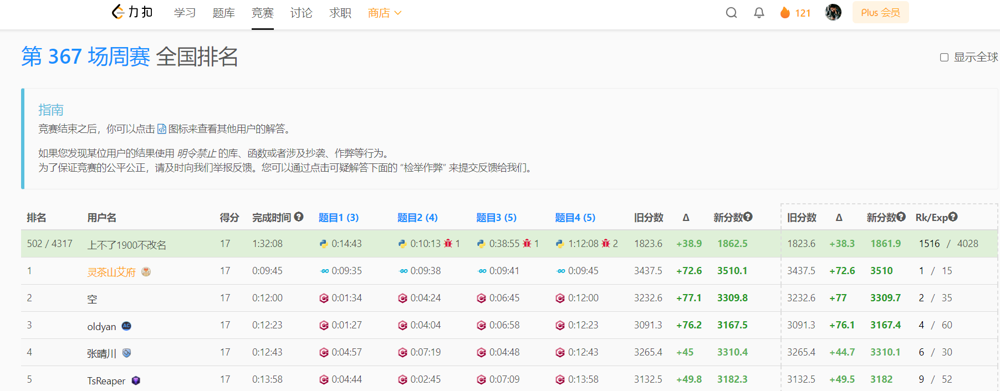


- T1：[100096. 找出满足差值条件的下标 I](https://leetcode.cn/problems/find-indices-with-index-and-value-difference-i/)

  > 给你一个下标从 **0** 开始、长度为 `n` 的整数数组 `nums` ，以及整数 `indexDifference` 和整数 `valueDifference` 。
  >
  > 你的任务是从范围 `[0, n - 1]` 内找出 **2** 个满足下述所有条件的下标 `i` 和 `j` ：
  >
  > - `abs(i - j) >= indexDifference` 且
  > - `abs(nums[i] - nums[j]) >= valueDifference`
  >
  > 返回整数数组 `answer`。如果存在满足题目要求的两个下标，则 `answer = [i, j]` ；否则，`answer = [-1, -1]` 。如果存在多组可供选择的下标对，只需要返回其中任意一组即可。
  >
  > **注意：**`i` 和 `j` 可能 **相等** 。
  >
  > - `1 <= n == nums.length <= 100`
  > - `0 <= nums[i] <= 50`

  暴力做

- T2：[最短且字典序最小的美丽子字符串](https://leetcode.cn/problems/shortest-and-lexicographically-smallest-beautiful-string/)

  > 给你一个二进制字符串 `s` 和一个正整数 `k` 。
  >
  > 如果 `s` 的某个子字符串中 `1` 的个数恰好等于 `k` ，则称这个子字符串是一个 **美丽子字符串** 。
  >
  > 令 `len` 等于 **最短** 美丽子字符串的长度。
  >
  > 返回长度等于 `len` 且字典序 **最小** 的美丽子字符串。如果 `s` 中不含美丽子字符串，则返回一个 **空** 字符串。
  >
  > 对于相同长度的两个字符串 `a` 和 `b` ，如果在 `a` 和 `b` 出现不同的第一个位置上，`a` 中该位置上的字符严格大于 `b` 中的对应字符，则认为字符串 `a` 字典序 **大于** 字符串 `b` 。
  >
  > - 例如，`"abcd"` 的字典序大于 `"abcc"` ，因为两个字符串出现不同的第一个位置对应第四个字符，而 `d` 大于 `c` 。
  >
  > `1 <= s.length <= 100`
  >
  > `1 <= k <= s.length`

  双指针O（n）

  ```
  class Solution:
      def shortestBeautifulSubstring(self, s: str, k: int) -> str:
          n = len(s)
          ans = s
          cnt = 0
          mi = inf
          j = 0
          for i in range(n):
              cnt += s[i]=='1'
              while j<n and (cnt>k or s[j]=='0'):
                  cnt -= s[j]=='1'
                  j+=1
              if cnt==k:
                  if i-j+1<mi:
                      mi = i-j+1
                      ans = s[j:i+1]
                  elif i-j+1==mi:
                      ans = min(ans,s[j:i+1])
          return ans if mi!=inf else ''
  ```

  枚举子串长度O（n^2）

  ```
  class Solution:
      def shortestBeautifulSubstring(self, s: str, k: int) -> str:
          n = len(s)
          ans = s
          if s.count('1')<k:
              return ''
          for sz in range(1,n+1):
              flag = 0
              for i in range(n-sz+1):
                  sub = s[i:i+sz]
                  print(sub)
                  if sub.count('1')==k:
                      if len(ans) > len(sub) or (len(ans) == len(sub) and sub<=ans):
                          ans = sub
                          flag = 1
              if flag:
                  break
          return ans 
  ```

  

- T3：[找出满足差值条件的下标 II](https://leetcode.cn/problems/find-indices-with-index-and-value-difference-ii/)（经典双指针）

  > 给你一个下标从 **0** 开始、长度为 `n` 的整数数组 `nums` ，以及整数 `indexDifference` 和整数 `valueDifference` 。
  >
  > 你的任务是从范围 `[0, n - 1]` 内找出 **2** 个满足下述所有条件的下标 `i` 和 `j` ：
  >
  > - `abs(i - j) >= indexDifference` 且
  > - `abs(nums[i] - nums[j]) >= valueDifference`
  >
  > 返回整数数组 `answer`。如果存在满足题目要求的两个下标，则 `answer = [i, j]` ；否则，`answer = [-1, -1]` 。如果存在多组可供选择的下标对，只需要返回其中任意一组即可。
  >
  > **注意：**`i` 和 `j` 可能 **相等** 。
  >
  > - `1 <= n == nums.length <= 105`
  > - `0 <= nums[i] <= 109`

  经典双指针

  ```
  class Solution:
      def findIndices(self, nums: List[int], indexDifference: int, valueDifference: int) -> List[int]:
          n = len(nums)
          j = 0
          miIdx,maIdx = 0,0
          for i in range(indexDifference,n):
              if nums[miIdx]>=nums[j]:
                  miIdx = j
              if nums[maIdx]<=nums[j]:
                  maIdx = j
              if abs(nums[i]-nums[maIdx])>=valueDifference:
                  return [maIdx,i]
              if abs(nums[i]-nums[miIdx])>=valueDifference:
                  return [miIdx,i]
              j+=1
          return [-1,-1]
  ```

  比赛时用二分做的

  ```
  class Solution:
      def findIndices(self, nums: List[int], indexDifference: int, valueDifference: int) -> List[int]:
          n = len(nums)
          a = [(x,idx)for idx,x in enumerate(nums)]
          a.sort()
  
          for i in range(n):
              tar = a[i][0]+valueDifference
              idd = bisect.bisect_left(a,(tar,0),i,n)
              if idd<n and a[idd][0]>=tar and abs(a[idd][1]-a[i][1])>=indexDifference:
                  return [a[i][1],a[idd][1]]
              # 找到的点的下标不一定满足
              t = idd+1
              while t<n and a[t][0]>=tar:
                  if t<n and a[t][0]>=tar and abs(a[t][1]-a[i][1])>=indexDifference:
                      return [a[i][1],a[t][1]]
                  t+=1
          return [-1,-1]
  ```

  

- T4：[构造乘积矩阵](https://leetcode.cn/problems/construct-product-matrix/)

  > 给你一个下标从 **0** 开始、大小为 `n * m` 的二维整数矩阵 `grid` ，定义一个下标从 **0** 开始、大小为 `n * m` 的的二维矩阵 `p`。如果满足以下条件，则称 `p` 为 `grid` 的 **乘积矩阵** ：
  >
  > - 对于每个元素 `p[i][j]` ，它的值等于除了 `grid[i][j]` 外所有元素的乘积。乘积对 `12345` 取余数。
  >
  > 返回 `grid` 的乘积矩阵。
  >
  > - `1 <= n == grid.length <= 105`
  > - `1 <= m == grid[i].length <= 105`
  > - `2 <= n * m <= 105`
  > - `1 <= grid[i][j] <= 109`****

  前后缀分解

  本题如果正常思路总的乘积除以`grid[i][j]`的思路做行不通，因为要**取模**，在中间取模最后就没法用除法，取模数是12345就是告诉我们不要往逆元思考。

  ```
  class Solution:
      def constructProductMatrix(self, grid: List[List[int]]) -> List[List[int]]:
          n = len(grid)
          m = len(grid[0])
          mod = 12345
          pre = [[1]*m for _ in range(n)]
          s = 1
          for i in range(n):
              for j in range(m):
                  pre[i][j] = s
                  s = (s*grid[i][j])%mod
          s = 1
          suf = [[1]*m for _ in range(n)]
          for i in range(n-1,-1,-1):
              for j in range(m-1,-1,-1):
                  suf[i][j] = s
                  s = (s*grid[i][j])%mod
          ans = [[-1]*m for _ in range(n)]
          for i in range(n):
              for j in range(m):
                  ans[i][j] = pre[i][j]%mod*suf[i][j]%mod
          return ans
  ```

  这题改编自【238. 除自身以外数组的乘积】,和本题几乎一样

  此外，如果这题直接用大数做不取模的话，会TLE

  高精度TLE代码：

  ```
  class Solution:
      def constructProductMatrix(self, grid: List[List[int]]) -> List[List[int]]:
          n = len(grid)
          m = len(grid[0])
          mod = 12345
          s = 1
          for i in range(n):
              for j in range(m):
                  s *= grid[i][j]
          ans = [[-1]*m for _ in range(n)]
          for i in range(n):
              for j in range(m):
                  ans[i][j] = s//grid[i][j]%mod
          return ans
  ```

  

  - 2256.最小平均差

  ```
  class Solution:
      def minimumAverageDifference(self, nums: List[int]) -> int:
          n = len(nums)
          suf = [0]*n
          s = nums[-1]
          for i in range(n-2,-1,-1):
              suf[i] = s//(n-1-i)
              s += nums[i]
          s = 0
          ans = inf
          ansIdx = -1
          for i in range(n):
              s += nums[i]
              if abs(s//(i+1) - suf[i])<ans:
                  ans = abs(s//(i+1) - suf[i])
                  ansIdx = i
          return ansIdx
  ```
```
  2483. 商店的最少代价 1495
  2484. 找到所有好下标 1695
  2485. 移除所有载有违禁货物车厢所需的最少时间 2219
  2486. 统计回文子序列数目 2223
  2487. 最少得分子序列 2432
  2488. 统计上升四元组 2433
  2489. 接雨水
```

### 第368场周赛（划分型dp、假二分真枚举）小号2题

- T1、T2：[2909. 元素和最小的山形三元组 II](https://leetcode.cn/problems/minimum-sum-of-mountain-triplets-ii/)

  > 给你一个下标从 **0** 开始的整数数组 `nums` 。
  >
  > 如果下标三元组 `(i, j, k)` 满足下述全部条件，则认为它是一个 **山形三元组** ：
  >
  > - `i < j < k`
  > - `nums[i] < nums[j]` 且 `nums[k] < nums[j]`
  >
  > 请你找出 `nums` 中 **元素和最小** 的山形三元组，并返回其 **元素和** 。如果不存在满足条件的三元组，返回 `-1` 。
  >
  > - `3 <= nums.length <= 105`
  > - `1 <= nums[i] <= 108`

  前后缀

  ```
  class Solution:
      def minimumSum(self, nums: List[int]) -> int:
          n = len(nums)
          suf = [inf]*(n+1)
          for i in range(n-1,-1,-1):
              suf[i] = min(suf[i+1],nums[i])
          pre = nums[0]
          ans = inf
          for i in range(1,n-1):
              if pre < nums[i] > suf[i+1]:
                  ans = min(ans,pre+nums[i]+suf[i+1])
              pre = min(pre,nums[i])
          return ans if ans!=inf else -1
  ```

- T3：[2910. 合法分组的最少组数](https://leetcode.cn/problems/minimum-number-of-groups-to-create-a-valid-assignment/)（虚假的二分）

  > 给你一个长度为 `n` 下标从 **0** 开始的整数数组 `nums` 。
  >
  > 我们想将下标进行分组，使得 `[0, n - 1]` 内所有下标 `i` 都 **恰好** 被分到其中一组。
  >
  > 如果以下条件成立，我们说这个分组方案是合法的：
  >
  > - 对于每个组 `g` ，同一组内所有下标在 `nums` 中对应的数值都相等。
  > - 对于任意两个组 `g1` 和 `g2` ，两个组中 **下标数量** 的 **差值不超过** `1` 。
  >
  > 请你返回一个整数，表示得到一个合法分组方案的 **最少** 组数。
  不满足二分的单调性，当能分成k组时，不代表k+1组能分成。不能分成k组时，不代表k-1组也分不成。所以这题不能二分。

  正确做法是枚举组内元素个数k，需要自己推公式。

  时间复杂度O（n）不会超的

  ```
  class Solution:
      def minGroupsForValidAssignment(self, nums: List[int]) -> int:
          vals = Counter(nums).values()
          # 分成的组的组内元素个数不是k,就是k+1
          # 枚举组数个数k
          for k in range(min(vals), 0, -1):
              ans = 0
              for c in vals:
                  # q是分的总组数，r是元素个数是k+1的组数
                  q, r = c//k,c%k
                  if q < r:
                      break
                  ans += ceil(c / (k + 1))
              else:
                  return ans
  ```

  推公式：当k=1时，1,2是能被分成1组的，3,4是能被分成2组的，5,6是能被分成3组的

- T4：


### 第 116 场双周赛（带懒标记的线段树优化dp（nlogn统计所有子数组）、01背包）3题

> 此战创下周赛最佳排名270名
>
> T1的文字描述非常麻烦，建议直接看样例

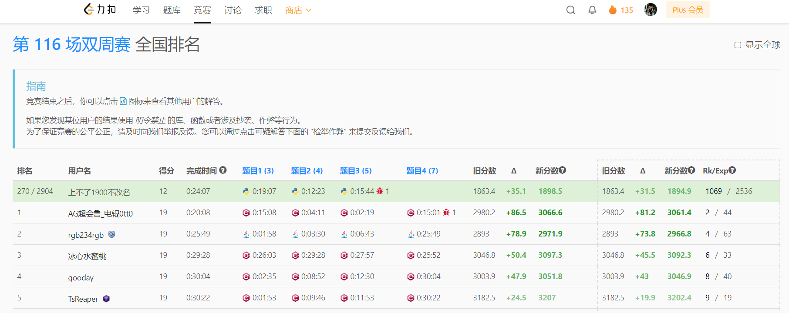

- T1：[100094. 子数组不同元素数目的平方和 I](https://leetcode.cn/problems/subarrays-distinct-element-sum-of-squares-i/)

  > 给你一个下标从 **0** 开始的整数数组 `nums` 。
  >
  > 定义 `nums` 一个子数组的 **不同计数** 值如下：
  >
  > - 令 `nums[i..j]` 表示 `nums` 中所有下标在 `i` 到 `j` 范围内的元素构成的子数组（满足 `0 <= i <= j < nums.length` ），那么我们称子数组 `nums[i..j]` 中不同值的数目为 `nums[i..j]` 的不同计数。
  >
  > 请你返回 `nums` 中所有子数组的 **不同计数** 的 **平方** 和。
  >
  > 由于答案可能会很大，请你将它对 `109 + 7` **取余** 后返回。
  >
  > 子数组指的是一个数组里面一段连续 **非空** 的元素序列。	

  枚举所有的子数组

  ```
  class Solution:
      def sumCounts(self, nums: List[int]) -> int:
          mod = 10**9+7
          n = len(nums)
          ans = 0
          for i in range(n):
              se = set()
              for j in range(i,n):
                  se.add(nums[j])
                  ans += len(se)**2
                  ans %= mod
          return ans
  ```

- [100104. 使二进制字符串变美丽的最少修改次数](https://leetcode.cn/problems/minimum-number-of-changes-to-make-binary-string-beautiful/)（贪心）

  > 给你一个长度为偶数下标从 **0** 开始的二进制字符串 `s` 。
  >
  > 如果可以将一个字符串分割成一个或者更多满足以下条件的子字符串，那么我们称这个字符串是 **美丽的** ：
  >
  > - 每个子字符串的长度都是 **偶数** 。
  > - 每个子字符串都 **只** 包含 `1` 或 **只** 包含 `0` 。
  >
  > 你可以将 `s` 中任一字符改成 `0` 或者 `1` 。
  >
  > 请你返回让字符串 `s` 美丽的 **最少** 字符修改次数。
  >
  > - `2 <= s.length <= 105`
  > - `s` 的长度为偶数。
  > - `s[i]` 要么是 `'0'` ，要么是 `'1'` 。

  贪心

  分成长度是4的合法的数，一定可以再划分成两个长度是2的合法的数，所以我们只需要考虑能否分成长度是2的合法的数，不能就次数+1

  ```
  class Solution:
      def minChanges(self, s: str) -> int:
          n = len(s)
          ans = 0
          for i in range(0,n-1,2):
              if s[i]!=s[i+1]: 
                  ans += 1
          return ans
  ```


- [100042. 和为目标值的最长子序列的长度](https://leetcode.cn/problems/length-of-the-longest-subsequence-that-sums-to-target/)（01背包）

  > 给你一个下标从 **0** 开始的整数数组 `nums` 和一个整数 `target` 。
  >
  > 返回和为 `target` 的 `nums` 子序列中，子序列 **长度的最大值** 。如果不存在和为 `target` 的子序列，返回 `-1` 。
  >
  > **子序列** 指的是从原数组中删除一些或者不删除任何元素后，剩余元素保持原来的顺序构成的数组。
  >
  > - `1 <= nums.length <= 1000`
  > - `1 <= nums[i] <= 1000`
  > - `1 <= target <= 1000`

  01背包

  ```
  class Solution:
      def lengthOfLongestSubsequence(self, nums: List[int], target: int) -> int:
          n = len(nums)
          dp = [[-inf]*(target+1) for _ in range(n)]
          for i in range(n):
              dp[i][0] = 0
          for i in range(n):
              for j in range(target+1):
                  dp[i][j] = dp[i-1][j]
                  if j>=nums[i]:
                      dp[i][j] = max(dp[i][j],dp[i-1][j-nums[i]]+1)
          return dp[n-1][target] if dp[n-1][target]>0 else -1
  ```

  一维写法：

  ```
  class Solution:
      def lengthOfLongestSubsequence(self, nums: List[int], target: int) -> int:
          n = len(nums)
          dp = [-inf]*(target+1) 
          dp[0] = 0
          for i in range(n):
              for j in range(target,nums[i]-1,-1):
                  dp[j] = max(dp[j],dp[j-nums[i]]+1)
          return dp[target] if dp[target]>0 else -1
  ```

  

- [100074. 子数组不同元素数目的平方和 II](https://leetcode.cn/problems/subarrays-distinct-element-sum-of-squares-ii/)（带懒标记的线段树）

  > 给你一个下标从 **0** 开始的整数数组 `nums` 。
  >
  > 定义 `nums` 一个子数组的 **不同计数** 值如下：
  >
  > - 令 `nums[i..j]` 表示 `nums` 中所有下标在 `i` 到 `j` 范围内的元素构成的子数组（满足 `0 <= i <= j < nums.length` ），那么我们称子数组 `nums[i..j]` 中不同值的数目为 `nums[i..j]` 的不同计数。
  >
  > 请你返回 `nums` 中所有子数组的 **不同计数** 的 **平方** 和。
  >
  > 由于答案可能会很大，请你将它对 `109 + 7` **取余** 后返回。
  >
  > 子数组指的是一个数组里面一段连续 **非空** 的元素序列。
  >
  > - `1 <= nums.length <= 10^5`
  > - `1 <= nums[i] <= 10^5`

  本题属于数据结构优化dp，具体使用带懒标记的线段树优化。
  
  先做本题的简化版本：[2262. 字符串的总引力](https://leetcode.cn/problems/total-appeal-of-a-string/)
  
  > 发现递推关系（dp）：
  >
  > 前提：使用last数组记录元素的上一次出现的下标，枚举所有子数组的右端点right，different_cnt[i]表示以i作为左端点，当前迭代右指针right为右端点的子区间的不同元素的个数。
  >
  > 可以思考，当前数nums[right]作为一个新数出现在哪些子数组中？出现在左端点为last[right]+1 ~ right这一段，的所有子数组中，所以对这一段都加1，然后再统计这一段的个数的平方和，更新到ans中
  
  思路代码：
  
  ```
  class Solution:
      def sumCounts(self, nums: List[int]) -> int:
          n = len(nums)
          mod = 10**9+7
          last = [-1]*101000
  
          # different_cnt[i]表示以i作为左端点，当前迭代右指针right为右端点的子区间的不同元素的个数
          different_cnt = [0]*n
  
          ans = 0
          for right in range(n):
              # last[right]+1 ~ right 这一段区间内的子区间的值都要变大
              for i in range(last[nums[right]]+1,right+1):
                  different_cnt[i] += 1
              for i in range(right+1):
                  ans += different_cnt[i]**2
                  ans %= mod
              last[nums[right]] = right
          return ans
  ```
  
  然后根据这个思路就可以使用线段树以O（logn）完成区间修改、区间查询这件事情了，具体的，由于是要计算平方和，也是本题的一个难点。
  
  ```
  假设一个子数组的「不同计数」为 x，那么它的「不同计数的平方」为 x^2。
  
  如果这个子数组的「不同计数」增加了 1，那么它的「不同计数的平方」为(x+1)^2，增加量为：(x+1)^2 - x^2 = 2*x + 1
  ```
  
  所以如果是多个数那么增加量就是2*(x1 + x2 + ...xk)  + k
  
  线段树本身维护每个子数组中【不同计数】的个数，通过加上2*x+1更新所有【不同计数的平方】，然后再执行线段树区间修改+1
  
  AC代码：O（nlogn）
  
  ```
   class Solution {
  	static long mod = 1000000007;
  	static int N = 101000;
  	static int n;
  	
  	public int sumCounts(int[] nums) {
  		n = nums.length;
  		SegTree_lz seg = new SegTree_lz();
  		seg.build(1,1,n);
  
  		//last[x]表示x上一次出现的下标
  		int[] last = new int[N];
  		Arrays.fill(last,-1);
  
  		long ans = 0,s = 0;
  		for(int right=0;right<n;right++){
  			//由于nums的下标和线段树的下标偏移了一位，所以需要重新计算找到线段树的下标
  			int tree_l = last[nums[right]]+2;
  			int tree_r = right+1;
  			// 递推
  			// s存储平方和， x^2 -> (x+1)^2 相当于多了2*x+1
  			s += 2*seg.query(1,tree_l,tree_r)+tree_r-tree_l+1;
  			s %= mod;
  			ans += s;
  			ans %= mod;
  			//修改tree [l,r]内的每个数+1
  			seg.modify(1,tree_l,tree_r,1);
  			last[nums[right]] = right;
  		}
  		return (int)ans;
  	}
  }
  
  class SegTree_lz{
  	static int N = 101000;
  	static Node[] tree = new Node[4*N];
  	
  	//向上更新：用子节点的值更新父节点
  	static void pushUp(int u) {
  		tree[u].val = tree[u<<1].val + tree[u<<1|1].val;
  	}
  	//向下更新：用父节点的状态更新子节点，把懒标记给儿子节点
  	//把父亲的账给儿子算清
  	static void pushDown(int u) {
  	    //传递懒标记
  		tree[u<<1].add += tree[u].add;
  		tree[u<<1|1].add += tree[u].add;
  		//传递
  		tree[u<<1].val += tree[u].add * (tree[u<<1].r-tree[u<<1].l+1);
  		tree[u<<1|1].val += tree[u].add * (tree[u<<1|1].r-tree[u<<1|1].l+1);
  		tree[u].add = 0;//清空父节点的标记
  	}
  	static void build(int u,int l,int r) {
  		if(l==r) {
  			tree[u] = new Node(l,r,0,0);
  		}else {
  			tree[u] = new Node(l,r,0,0);
  			int mid = l+r>>1;
  			build(u<<1,l,mid);
  			build(u<<1|1,mid+1,r);
  			pushUp(u);
  		}
  	}
  
      //区间修改：将[l,r]的值都+val
  	static void modify(int u,int l,int r,int val) {
  	    //如果这个节点的区间被完全覆盖，就加上懒标记
  		if(tree[u].l>=l && tree[u].r<=r) {
  			tree[u].add += val;
  			tree[u].val += val*(tree[u].r-tree[u].l+1);
  		}else {//否则，不被完全覆盖，先把账算清再修改区间，最后更新到父节点
  			pushDown(u);
  			int mid = tree[u].l+tree[u].r>>1;
  			if(mid>=l) modify(u<<1,l,r,val);
  			if(mid+1<=r) modify(u<<1|1,l,r,val);
  			pushUp(u);
  		}
  	}
  
  	//区间求和
  	static long query(int u,int l,int r) {
  		if(tree[u].l>=l && tree[u].r<=r)
  			return tree[u].val;
  		//先算清账，再求内部的值
  		pushDown(u);
  		long res = 0;
  		int mid = tree[u].l+tree[u].r>>1;
  		if(l<=mid) res += query(u<<1,l,r);
  		if(mid+1<=r) res += query(u<<1|1,l,r);
  		return res;
  	}
  	static class Node{
  			int l,r;
  			long val;
  			long add;//懒标记
  			public Node(int l,int r,long val,long add) {
  					this.l = l;this.r = r;this.val = val;this.add = add;
  			}
  	}
  }
  ```
  
  - [2262. 字符串的总引力](https://leetcode.cn/problems/total-appeal-of-a-string/)
  
    > 字符串的 **引力** 定义为：字符串中 **不同** 字符的数量。
    >
    > - 例如，`"abbca"` 的引力为 `3` ，因为其中有 `3` 个不同字符 `'a'`、`'b'` 和 `'c'` 
    >
    > 给你一个字符串 `s` ，返回 **其所有子字符串的总引力** **。**
    >
    > **子字符串** 定义为：字符串中的一个连续字符序列。
    >
    > 2033
  
    本题因为只需要维护和，而且和之间有递推关系，所以可以不用线段树，如果最后的答案是统计平方和，那么就要必须要用线段树了，也就是周赛这题
  
    - 方法1：递推
  
    ```
    class Solution {
        
        static int n;
        public long appealSum(String s) {
            n = s.length();
            int[] last = new int[26];
            Arrays.fill(last,-1);
            long ans = 0, sum= 0;
            for(int i=0;i<n;i++){
                sum += i-last[s.charAt(i)-'a'];
                ans += sum;
                last[s.charAt(i)-'a'] = i;
            }
            return ans;
        }
    }
    ```
  
    - 方法2：lz线段树
  
    ```
    class Solution {
        
        static int n;
        public long appealSum(String s) {
            n = s.length();
            int[] last = new int[26];
            Arrays.fill(last,-1);
            SegTree_lz seg = new SegTree_lz();
            seg.build(1,1,n);
            long ans = 0;
            for(int i=0;i<n;i++){
                int tree_l = last[s.charAt(i)-'a']+2;
                int tree_r = i+1;
                seg.modify(1,tree_l,tree_r,1);
                ans += seg.query(1,1,tree_r);
                last[s.charAt(i)-'a'] = i;
            }
            return ans;
        }
    }
    class SegTree_lz{
    	static int N = 101000;
    	static Node[] tree = new Node[4*N];
    	
    	//向上更新：用子节点的值更新父节点
    	static void pushUp(int u) {
    		tree[u].val = tree[u<<1].val + tree[u<<1|1].val;
    	}
    	//向下更新：用父节点的状态更新子节点，把懒标记给儿子节点
    	//把父亲的账给儿子算清
    	static void pushDown(int u) {
    	    //传递懒标记
    		tree[u<<1].add += tree[u].add;
    		tree[u<<1|1].add += tree[u].add;
    		//传递
    		tree[u<<1].val += tree[u].add * (tree[u<<1].r-tree[u<<1].l+1);
    		tree[u<<1|1].val += tree[u].add * (tree[u<<1|1].r-tree[u<<1|1].l+1);
    		tree[u].add = 0;//清空父节点的标记
    	}
    	static void build(int u,int l,int r) {
    		if(l==r) {
    			tree[u] = new Node(l,r,0,0);
    		}else {
    			tree[u] = new Node(l,r,0,0);
    			int mid = l+r>>1;
    			build(u<<1,l,mid);
    			build(u<<1|1,mid+1,r);
    			pushUp(u);
    		}
    	}
    
        //区间修改：将[l,r]的值都+val
    	static void modify(int u,int l,int r,int val) {
    	    //如果这个节点的区间被完全覆盖，就加上懒标记
    		if(tree[u].l>=l && tree[u].r<=r) {
    			tree[u].add += val;
    			tree[u].val += val*(tree[u].r-tree[u].l+1);
    		}else {//否则，不被完全覆盖，先把账算清再修改区间，最后更新到父节点
    			pushDown(u);
    			int mid = tree[u].l+tree[u].r>>1;
    			if(mid>=l) modify(u<<1,l,r,val);
    			if(mid+1<=r) modify(u<<1|1,l,r,val);
    			pushUp(u);
    		}
    	}
    
    	//区间求和
    	static long query(int u,int l,int r) {
    		if(tree[u].l>=l && tree[u].r<=r)
    			return tree[u].val;
    		//先算清账，再求内部的值
    		pushDown(u);
    		long res = 0;
    		int mid = tree[u].l+tree[u].r>>1;
    		if(l<=mid) res += query(u<<1,l,r);
    		if(mid+1<=r) res += query(u<<1|1,l,r);
    		return res;
    	}
    	static class Node{
    			int l,r;
    			long val;
    			long add;//懒标记
    			public Node(int l,int r,long val,long add) {
    					this.l = l;this.r = r;this.val = val;this.add = add;
    			}
    	}
    }
    ```
  
    


### 第 369 场力扣周赛（树形dp、奇妙的dp）小号2题

> T3的dp太巧妙了，没做出来
>
> T4树形dp也差点意思，比赛的时候准备ALL in T4，但是WA了，只能过400/500组数据

- T1：[100111. 找出数组中的 K-or 值](https://leetcode.cn/problems/find-the-k-or-of-an-array/)（枚举）

  > 给你一个下标从 **0** 开始的整数数组 `nums` 和一个整数 `k` 。
  >
  > `nums` 中的 **K-or** 是一个满足以下条件的非负整数：
  >
  > - 只有在 `nums` 中，至少存在 `k` 个元素的第 `i` 位值为 1 ，那么 K-or 中的第 `i` 位的值才是 1 。
  >
  > 返回 `nums` 的 **K-or** 值。
  >
  > **注意** ：对于整数 `x` ，如果 `(2i AND x) == 2i` ，则 `x` 中的第 `i` 位值为 1 ，其中 `AND` 为按位与运算符。
  >
  > - `1 <= nums.length <= 50`
  > - `0 <= nums[i] < 231`
  > - `1 <= k <= nums.length`

  ```
  class Solution:
      def findKOr(self, nums: List[int], k: int) -> int:
          n = len(nums)
          ans = 0
          for i in range(32):
              cnt = 0
              for x in nums:
                  cnt += ((x>>i)&1)
              if cnt>=k:
                  ans += 1<<i
          return ans
  ```

- T2：[100102. 数组的最小相等和](https://leetcode.cn/problems/minimum-equal-sum-of-two-arrays-after-replacing-zeros/)（分类讨论）

  > 给你两个由正整数和 `0` 组成的数组 `nums1` 和 `nums2` 。
  >
  > 你必须将两个数组中的 **所有** `0` 替换为 **严格** 正整数，并且满足两个数组中所有元素的和 **相等** 。
  >
  > 返回 **最小** 相等和 ，如果无法使两数组相等，则返回 `-1` 。
  >
  > - `1 <= nums1.length, nums2.length <= 105`
  > - `0 <= nums1[i], nums2[i] <= 106`

  ```
  class Solution:
      def minSum(self, nums1: List[int], nums2: List[int]) -> int:
          s1,s2 = sum(nums1),sum(nums2)
          c1,c2 = nums1.count(0),nums2.count(0)
          if c1==0 and c2 == 0 and s1!=s2:
              return -1
          if c1==0:
              if s1<s2+c2:
                  return -1
          elif c2==0:
              if s1+c1>s2:
                  return -1
          return max(s1+c1,s2+c2)
  ```

- T3： [使数组变美的最小增量运算数](https://leetcode.cn/problems/minimum-increment-operations-to-make-array-beautiful/)（很巧妙的dp）

  > 给你一个下标从 **0** 开始、长度为 `n` 的整数数组 `nums` ，和一个整数 `k` 。
  >
  > 你可以执行下述 **递增** 运算 **任意** 次（可以是 **0** 次）：
  >
  > - 从范围 `[0, n - 1]` 中选则一个下标 `i` ，并将 `nums[i]` 的值加 `1` 。
  >
  > 如果数组中任何长度 **大于或等于 3** 的子数组，其 **最大** 元素都大于或等于 `k` ，则认为数组是一个 **美丽数组** 。
  >
  > 以整数形式返回使数组变为 **美丽数组** 需要执行的 **最小** 递增运算数。
  >
  > 子数组是数组中的一个连续 **非空** 元素序列。
  >
  > - `3 <= n == nums.length <= 105`
  > - `0 <= nums[i] <= 109`
  > - `0 <= k <= 109`

  ```
  
  ```

  

- T4：[100108. 收集所有金币可获得的最大积分](https://leetcode.cn/problems/maximum-points-after-collecting-coins-from-all-nodes/)（树形dp）

  > 节点 `0` 处现有一棵由 `n` 个节点组成的无向树，节点编号从 `0` 到 `n - 1` 。给你一个长度为 `n - 1` 的二维 **整数** 数组 `edges` ，其中 `edges[i] = [ai, bi]` 表示在树上的节点 `ai` 和 `bi` 之间存在一条边。另给你一个下标从 **0** 开始、长度为 `n` 的数组 `coins` 和一个整数 `k` ，其中 `coins[i]` 表示节点 `i` 处的金币数量。
  >
  > 从根节点开始，你必须收集所有金币。要想收集节点上的金币，必须先收集该节点的祖先节点上的金币。
  >
  > 节点 `i` 上的金币可以用下述方法之一进行收集：
  >
  > - 收集所有金币，得到共计 `coins[i] - k` 点积分。如果 `coins[i] - k` 是负数，你将会失去 `abs(coins[i] - k)` 点积分。
  > - 收集所有金币，得到共计 `floor(coins[i] / 2)` 点积分。如果采用这种方法，节点 `i` 子树中所有节点 `j` 的金币数 `coins[j]` 将会减少至 `floor(coins[j] / 2)` 。
  >
  > 返回收集 **所有** 树节点的金币之后可以获得的最大积分。
  >
  > - `n == coins.length`
  > - `2 <= n <= 105`
  > - `0 <= coins[i] <= 104`
  > - `edges.length == n - 1`
  > - `0 <= edges[i][0], edges[i][1] < n`
  > - `0 <= k <= 104`

  AC代码

  ```
  class Solution:
      def maximumPoints(self, edges: List[List[int]], coins: List[int], k: int) -> int:
          n = len(coins)
          g = [[] for _ in range(n)]
          for a, b in edges:
              g[a].append(b)
              g[b].append(a)
          # floor(coins[i] / 2)操作就是整除2，整除2就是相当于右移一位
          # optimization:1e4最多被整除14次就变成0了，所以这个状态个数最大14
          # dp[i][j]表示节点u为根的子树中，所有字节的被整除了j次，的方案的最大值
          dp = [[-1] * 14 for _ in range(n)]
  
          def dfs(u, fa, cnt):
              if dp[u][cnt] != -1:
                  return dp[u][cnt]
              res1, res2 = (coins[u] >> cnt) - k, (coins[u] >> (cnt + 1))
  
              for j in g[u]:
                  if j != fa:
                      res1 += dfs(j, u, cnt)
                      if cnt + 1 < 14:
                          res2 += dfs(j, u, cnt + 1)
              dp[u][cnt] = max(res1, res2)
              return dp[u][cnt]
  
          return dfs(0, -1, 0)
  ```
  
  
  
  WA代码

  ```
  class Solution:
      def maximumPoints(self, edges: List[List[int]], coins: List[int], k: int) -> int:
          n = len(coins)
          e = [[] for _ in range(n)]
          for a,b in edges:
              e[a].append(b)
              e[b].append(a)
          dp = [[0]*2 for _ in range(n)]
          def dfs(u,divcnt,fa):
              # 计算coins
              new_coins = coins[u]
              if divcnt:
                  while divcnt and new_coins%2:
                      new_coins = floor(new_coins/2)
                      divcnt -= 1
                  if divcnt:
                      new_coins = new_coins//(2**divcnt)
              
              res0 = new_coins-k
              res1 = floor(new_coins/2)
              # print(u,state,res)
              for j in e[u]:
                  if j!=fa:
                      res0 += dfs(j,divcnt,u)
              for j in e[u]:
                  if j!=fa:
                      res1 += dfs(j,divcnt+1,u)
              
              return max(res0,res1)
          return dfs(0,0,-1)
  ```
  
  

### 第 370 场周赛（树状数组优化dp、树形dp）3题

> 2023年11月5日
>
> 第3题从正面做的，比较麻烦，所以做的久了点

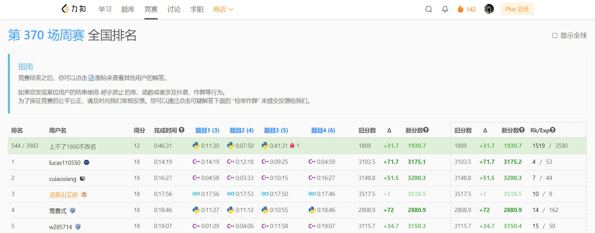

- [100115. 找到冠军 I](https://leetcode.cn/problems/find-champion-i/)

  > 一场比赛中共有 `n` 支队伍，按从 `0` 到 `n - 1` 编号。
  >
  > 给你一个下标从 **0** 开始、大小为 `n * n` 的二维布尔矩阵 `grid` 。对于满足 `0 <= i, j <= n - 1` 且 `i != j` 的所有 `i, j` ：如果 `grid[i][j] == 1`，那么 `i` 队比 `j` 队 **强** ；否则，`j` 队比 `i` 队 **强** 。
  >
  > 在这场比赛中，如果不存在某支强于 `a` 队的队伍，则认为 `a` 队将会是 **冠军** 。
  >
  > 返回这场比赛中将会成为冠军的队伍。

  ```
  class Solution:
      def findChampion(self, grid: List[List[int]]) -> int:
          n = len(grid)
          for i in range(n):
              flag = 1
              for j in range(n):
                  if i==j:continue
                  if grid[i][j]!=1:
                      flag = 0
                      break
              if flag:
                  return i
          return -1
                  
  ```

  

- [100116. 找到冠军 II](https://leetcode.cn/problems/find-champion-ii/)

  > 一场比赛中共有 `n` 支队伍，按从 `0` 到 `n - 1` 编号。每支队伍也是 **有向无环图（DAG）** 上的一个节点。
  >
  > 给你一个整数 `n` 和一个下标从 **0** 开始、长度为 `m` 的二维整数数组 `edges` 表示这个有向无环图，其中 `edges[i] = [ui, vi]` 表示图中存在一条从 `ui` 队到 `vi` 队的有向边。
  >
  > 从 `a` 队到 `b` 队的有向边意味着 `a` 队比 `b` 队 **强** ，也就是 `b` 队比 `a` 队 **弱** 。
  >
  > 在这场比赛中，如果不存在某支强于 `a` 队的队伍，则认为 `a` 队将会是 **冠军** 。
  >
  > 如果这场比赛存在 **唯一** 一个冠军，则返回将会成为冠军的队伍。否则，返回 `-1` *。*
  >
  > - `1 <= n <= 100`
  > - `m == edges.length`
  > - `0 <= m <= n * (n - 1) / 2`

  ```
  class Solution:
      def findChampion(self, n: int, edges: List[List[int]]) -> int:
          du = [0]*n
          for a,b in edges:
              du[b]+=1
          ans = 0
          node = -1
          for i in range(n):
              if du[i]==0:
                  if ans+1>1:
                      return -1
                  ans = 1
                  node = i
          return node
  ```

- [100118. 在树上执行操作以后得到的最大分数](https://leetcode.cn/problems/maximum-score-after-applying-operations-on-a-tree/)

  > 有一棵 `n` 个节点的无向树，节点编号为 `0` 到 `n - 1` ，根节点编号为 `0` 。给你一个长度为 `n - 1` 的二维整数数组 `edges` 表示这棵树，其中 `edges[i] = [ai, bi]` 表示树中节点 `ai` 和 `bi` 有一条边。
  >
  > 同时给你一个长度为 `n` 下标从 **0** 开始的整数数组 `values` ，其中 `values[i]` 表示第 `i` 个节点的值。
  >
  > 一开始你的分数为 `0` ，每次操作中，你将执行：
  >
  > - 选择节点 `i` 。
  > - 将 `values[i]` 加入你的分数。
  > - 将 `values[i]` 变为 `0` 。
  >
  > 如果从根节点出发，到任意叶子节点经过的路径上的节点值之和都不等于 0 ，那么我们称这棵树是 **健康的** 。
  >
  > 你可以对这棵树执行任意次操作，但要求执行完所有操作以后树是 **健康的** ，请你返回你可以获得的 **最大分数** 。

  正难则反，

  ```
  class Solution:
      def maximumScoreAfterOperations(self, edges: List[List[int]], values: List[int]) -> int:
          g = [[] for _ in values]
          g[0].append(-1)  # 避免误把根节点当作叶子
          for x, y in edges:
              g[x].append(y)
              g[y].append(x)
  
          # dfs(x, fa) 计算以 x 为根的子树是健康时，失去的最小分数
          def dfs(x: int, fa: int) -> int:
              if len(g[x]) == 1:  # x 是叶子
                  return values[x]
              loss = 0  # 不选 values[x]
              for y in g[x]:
                  if y != fa:
                      loss += dfs(y, x)  # 计算以 y 为根的子树是健康时，失去的最小分数
              return min(values[x], loss)  # 选/不选 values[x]，取最小值
          return sum(values) - dfs(0, -1)
  ```

  

  正向解决

  ```
  class Solution:
      def maximumScoreAfterOperations(self, edges: List[List[int]], values: List[int]) -> int:
          n = len(values)
          e = [[]for _ in range(n)]
          for a,b in edges:
              e[a].append(b)
              e[b].append(a)
          @cache
          # 节点u为根节点的子树，liu表示该子树是否需要留出一个节点：不选
          # liu==0表示该子树节点全选
          def dfs(u,liu,fa):
              if len(e[u])==1 and u!=0:
                  if liu:
                      return 0
                  else:
                      return values[u]
              if liu==0:
                  res1 = values[u]
                  for j in e[u]:
                      if j!=fa:
                          res1 += dfs(j,0,u)
                  return res1
              else:    
                  # 选择u了
                  res1 = values[u]
                  for j in e[u]:
                      if j!=fa:
                          res1 += dfs(j,1,u)
                  # 不选择u
                  res2 = 0
                  for j in e[u]:
                      if j!=fa:
                          res2 += dfs(j,0,u)
              return max(res1,res2)
          return dfs(0,1,-1)
  ```

- [100112. 平衡子序列的最大和](https://leetcode.cn/problems/maximum-balanced-subsequence-sum/)（树状数组优化dp）

  > 给你一个下标从 **0** 开始的整数数组 `nums` 。
  >
  > `nums` 一个长度为 `k` 的 **子序列** 指的是选出 `k` 个 **下标** `i0 < i1 < ... < ik-1` ，如果这个子序列满足以下条件，我们说它是 **平衡的** ：
  >
  > - 对于范围 `[1, k - 1]` 内的所有 `j` ，`nums[ij] - nums[ij-1] >= ij - ij-1` 都成立。
  >
  > `nums` 长度为 `1` 的 **子序列** 是平衡的。
  >
  > 请你返回一个整数，表示 `nums` **平衡** 子序列里面的 **最大元素和** 。
  >
  > 一个数组的 **子序列** 指的是从原数组中删除一些元素（**也可能一个元素也不删除**）后，剩余元素保持相对顺序得到的 **非空** 新数组。
  >
  > - `1 <= nums.length <= 105`
  > - `-109 <= nums[i] <= 109`

  离散化+权值树状数组+LIS模型(dp)

  ```
   class Solution {
  		static int N = 101000;
		static long INF = Long.MAX_VALUE;
      public long maxBalancedSubsequenceSum(int[] nums) {
          tree = new long[N];
          int n = nums.length;
  				//离散化
  				TreeSet<Long> se = new TreeSet<Long>();
  				for(int i=0;i<n;i++)
  					se.add((long)nums[i]-i);
          Long[] order = se.toArray(new Long[0]);
  
  				long ans = -INF;
          for(int i=0;i<n;i++){
  						//查找下标，树状数组下标从1开始
  						int idx = find(order,nums[i]-i)+1;
              long pre_mx = query(idx);
              long cur_mx = Math.max((long)nums[i],pre_mx+nums[i]);
  						// System.out.println(idx+" "+pre_mx);
              add(idx,cur_mx);
              ans = Math.max(ans,cur_mx);
          }
          return ans;
      }
  		static int find(Long[] order,int x){
  				int l = 0,r = order.length-1;
  				while(l<r){
  						int mid = l+r+1>>1;
  						if(order[mid]<=x) l = mid;
  						else r = mid-1;
  				}
  				return l;
  		}
  		static long[] tree;
  			//原数组:arr,树状数组：tree,
  		static int lowbit(int x) {
  			return x&-x;
  		}
  		//在arr[idx]的值添加v
  		static void add(int idx,long v) {
  			//arr[idx] += v;//如果将idx变成v
  			for(int i=idx;i<N;i+=lowbit(i)) 
  				tree[i] = Math.max(tree[i],v);
  		}
  		//计算arr[1~x]的max
  		static long query(int idx) {
  			long res = -INF;
  			for(int i=idx;i>0;i-=lowbit(i)) 
  				res = Math.max(tree[i],res);
  			if(res != -INF)
  				return res;
  			else return 0;
  		}
  }
  ```
  


### 第 117 场双周赛（容斥原理、数学）3题

> 数学专场，T3比T4难

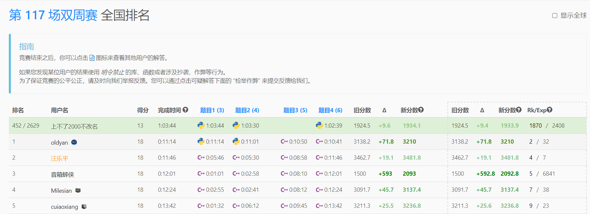

- [100125. 给小朋友们分糖果 I](https://leetcode.cn/problems/distribute-candies-among-children-i/)

- [100127. 给小朋友们分糖果 II](https://leetcode.cn/problems/distribute-candies-among-children-ii/)

  > 给你两个正整数 `n` 和 `limit` 。
  >
  > 请你将 `n` 颗糖果分给 `3` 位小朋友，确保没有任何小朋友得到超过 `limit` 颗糖果，请你返回满足此条件下的 **总方案数** 。
  >
  > - `1 <= n <= 106`
  > - `1 <= limit <= 106`

  数学、

  讨论上下届

  ```
  class Solution:
      def distributeCandies(self, n: int, limit: int) -> int:
          ans = 0
          for i in range(0,min(limit,n)+1):
              s = n-i
              l,r = max(0,s-limit),min(limit,s)
              ans += max(r-l+1,0)
          return ans
              
  ```

  

- [重新排列后包含指定子字符串的字符串数目](https://leetcode.cn/problems/number-of-strings-which-can-be-rearranged-to-contain-substring/)

  > 给你一个整数 `n` 。
  >
  > 如果一个字符串 `s` 只包含小写英文字母，**且** 将 `s` 的字符重新排列后，新字符串包含 **子字符串** `"leet"` ，那么我们称字符串 `s` 是一个 **好** 字符串。
  >
  > 比方说：
  >
  > - 字符串 `"lteer"` 是好字符串，因为重新排列后可以得到 `"leetr"` 。
  > - `"letl"` 不是好字符串，因为无法重新排列并得到子字符串 `"leet"` 。
  >
  > 请你返回长度为 `n` 的好字符串 **总** 数目。
  >
  > 由于答案可能很大，将答案对 `109 + 7` **取余** 后返回。
  >
  > **子字符串** 是一个字符串中一段连续的字符序列。
  >
  > - `1 <= n <= 105`

  容斥原理

  ```
  
  ```

  

- [购买物品的最大开销](https://leetcode.cn/problems/maximum-spending-after-buying-items/)

  > 给你一个下标从 **0** 开始大小为 `m * n` 的整数矩阵 `values` ，表示 `m` 个不同商店里 `m * n` 件不同的物品。每个商店有 `n` 件物品，第 `i` 个商店的第 `j` 件物品的价值为 `values[i][j]` 。除此以外，第 `i` 个商店的物品已经按照价值非递增排好序了，也就是说对于所有 `0 <= j < n - 1` 都有 `values[i][j] >= values[i][j + 1]` 。
  >
  > 每一天，你可以在一个商店里购买一件物品。具体来说，在第 `d` 天，你可以：
  >
  > - 选择商店 `i` 。
  > - 购买数组中最右边的物品 `j` ，开销为 `values[i][j] * d` 。换句话说，选择该商店中还没购买过的物品中最大的下标 `j` ，并且花费 `values[i][j] * d` 去购买。
  >
  > **注意**，所有物品都视为不同的物品。比方说如果你已经从商店 `1` 购买了物品 `0` ，你还可以在别的商店里购买其他商店的物品 `0` 。
  >
  > 请你返回购买所有 `m * n` 件物品需要的 **最大开销** 。
  >
  > - `1 <= m == values.length <= 10`
  > - `1 <= n == values[i].length <= 104`
  > - `1 <= values[i][j] <= 106`
  > - `values[i]` 按照非递增顺序排序。

  甚至都不需要堆

  ```
  class Solution:
      def maxSpending(self, values: List[List[int]]) -> int:
          m,n = len(values),len(values[0])
          q = []
          for i in range(m):
              heappush(q,(values[i][n-1],i,n-1))
          d = 1
          ans = 0
          while len(q):
              val,dian,idx = heappop(q)
              ans += val*d
              d += 1
              if idx!=0:
                  heappush(q,(values[dian][idx-1],dian,idx-1))
          return ans
  ```

  

### 第 371 场力扣周赛（Tire树、滑动窗口）3题

> 前几天每日一题刚出过01字典树，这次T4就考了

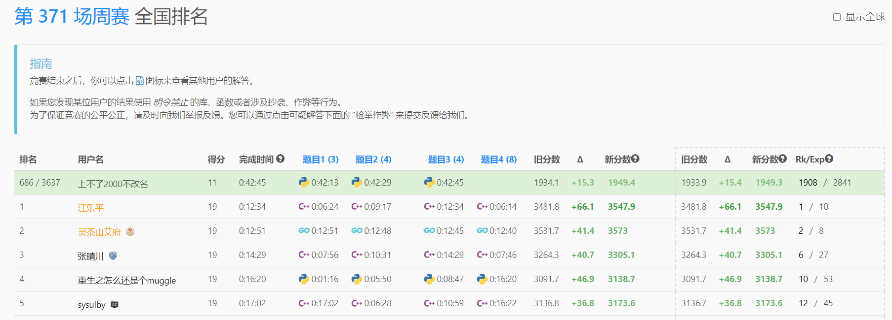

- [100120. 找出强数对的最大异或值 I](https://leetcode.cn/problems/maximum-strong-pair-xor-i/)

  > 给你一个下标从 **0** 开始的整数数组 `nums` 。如果一对整数 `x` 和 `y` 满足以下条件，则称其为 **强数对** ：
  >
  > - `|x - y| <= min(x, y)`
  >
  > 你需要从 `nums` 中选出两个整数，且满足：这两个整数可以形成一个强数对，并且它们的按位异或（`XOR`）值是在该数组所有强数对中的 **最大值** 。
  >
  > 返回数组 `nums` 所有可能的强数对中的 **最大** 异或值。
  >
  > **注意**，你可以选择同一个整数两次来形成一个强数对
  >
  > - `1 <= nums.length <= 50`
  > - `1 <= nums[i] <= 100`

- [高访问员工](https://leetcode.cn/problems/high-access-employees/)

  > 给你一个长度为 `n` 、下标从 **0** 开始的二维字符串数组 `access_times` 。对于每个 `i`（`0 <= i <= n - 1` ），`access_times[i][0]` 表示某位员工的姓名，`access_times[i][1]` 表示该员工的访问时间。`access_times` 中的所有条目都发生在同一天内。
  >
  > 访问时间用 **四位** 数字表示， 符合 **24 小时制** ，例如 `"0800"` 或 `"2250"` 。
  >
  > 如果员工在 **同一小时内** 访问系统 **三次或更多** ，则称其为 **高访问** 员工。
  >
  > 时间间隔正好相差一小时的时间 **不** 被视为同一小时内。例如，`"0815"` 和 `"0915"` 不属于同一小时内。
  >
  > 一天开始和结束时的访问时间不被计算为同一小时内。例如，`"0005"` 和 `"2350"` 不属于同一小时内。
  >
  > 以列表形式，按任意顺序，返回所有 **高访问** 员工的姓名。
  >
  > - `1 <= access_times.length <= 100`
  > - `access_times[i].length == 2`
  > - `1 <= access_times[i][0].length <= 10`
  > - `access_times[i][0]` 仅由小写英文字母组成。
  > - `access_times[i][1].length == 4`
  > - `access_times[i][1]` 采用24小时制表示时间。
  > - `access_times[i][1]` 仅由数字 `'0'` 到 `'9'` 组成。

  滑窗+模拟

  ```
  class Solution:
      def findHighAccessEmployees(self, access_times: List[List[str]]) -> List[str]:
          n = len(access_times)
          se = set()
          ans = []
          for i in range(n):
              se.add(access_times[i][0])
          for x in se:
              time = []
              cnt = 0
              for i in range(n):
                  if access_times[i][0]==x:
                      t = access_times[i][1]
                      t_int = int(t[:2])*60 + int(t[2:])
                      time.append(t_int)
              time.sort()
              i = 0
              while i<len(time):
                  j = i+1
                  flag = 0
                  while j<len(time) and abs(time[j]-time[i])<60:
                      if j-i+1>=3:
                          flag = 1
                          break
                      j+=1
                  if flag:
                      ans.append(x)
                      break    
                  i = i+1
          return ans
  ```

- [100117. 最大化数组末位元素的最少操作次数](https://leetcode.cn/problems/minimum-operations-to-maximize-last-elements-in-arrays/)

  > 给你两个下标从 **0** 开始的整数数组 `nums1` 和 `nums2` ，这两个数组的长度都是 `n` 。
  >
  > 你可以执行一系列 **操作（可能不执行）**。
  >
  > 在每次操作中，你可以选择一个在范围 `[0, n - 1]` 内的下标 `i` ，并交换 `nums1[i]` 和 `nums2[i]` 的值。
  >
  > 你的任务是找到满足以下条件所需的 **最小** 操作次数：
  >
  > - `nums1[n - 1]` 等于 `nums1` 中所有元素的 **最大值** ，即 `nums1[n - 1] = max(nums1[0], nums1[1], ..., nums1[n - 1])` 。
  > - `nums2[n - 1]` 等于 `nums2` 中所有元素的 **最大值** ，即 `nums2[n - 1] = max(nums2[0], nums2[1], ..., nums2[n - 1])` 。
  >
  > 以整数形式，表示并返回满足上述 **全部** 条件所需的 **最小** 操作次数，如果无法同时满足两个条件，则返回 `-1` 。

  脑筋急转弯+贪心

  就2种情况，不交换最后一个元素，交换最后一个元素

  ```
  class Solution:
      def minOperations(self, nums1: List[int], nums2: List[int]) -> int:
          n = len(nums1)
          mx1 = max(nums1[-1],nums2[-1])
          mx2 = min(nums1[-1],nums2[-1])
          for i in range(n):
              if max(nums1[i],nums2[i])>mx1:
                  return -1
              if min(nums1[i],nums2[i])>mx2:
                  return -1
          ans = inf
          res = 0
          for i in range(n-1):
              if nums1[i]>nums1[-1] or nums2[i]>nums2[-1]:
                  res += 1
          ans = res
          
          nums1[-1],nums2[-1] = nums2[-1],nums1[-1]
          res = 1
          for i in range(n-1):
              if nums1[i]>nums1[-1] or nums2[i]>nums2[-1]:
                  res += 1
          ans = min(ans,res)
          return ans
  ```

  

- [100124. 找出强数对的最大异或值 II](https://leetcode.cn/problems/maximum-strong-pair-xor-ii/)

  > 给你一个下标从 **0** 开始的整数数组 `nums` 。如果一对整数 `x` 和 `y` 满足以下条件，则称其为 **强数对** ：
  >
  > - `|x - y| <= min(x, y)`
  >
  > 你需要从 `nums` 中选出两个整数，且满足：这两个整数可以形成一个强数对，并且它们的按位异或（`XOR`）值是在该数组所有强数对中的 **最大值** 。
  >
  > 返回数组 `nums` 所有可能的强数对中的 **最大** 异或值。
  >
  > **注意**，你可以选择同一个整数两次来形成一个强数对。
  >
  > - `1 <= nums.length <= 5 * 104`
  > - `1 <= nums[i] <= 220 - 1`

  - 方法1：待删除操作的01字典树

  ```
  class Solution {
      public int maximumStrongPairXor(int[] nums) {
          int n = nums.length;
          //清空Trie，防止之前的数据对后面的数据产生影响
          for(int i=0;i<idx;i++){
              son[i][0] = son[i][1] = 0;
              cnt[i]=0;
          }
              
          idx = 0;
          
          Arrays.sort(nums);
          int ans = 0;
          int left = 0;
          for(int i=0;i<n;i++){
              //因为两数可以重合，所以先插入
              insert(convert(nums[i]));
              // x - 2y <=0 ,要删除的就是x-2y>0的
              
              while (left<i && nums[i]-2*nums[left]>0){
                  remove(convert(nums[left]));
                  left+=1;
              }
              int res = 0,cur = 0;
  
              //查询nums[i]时取最大值的另一个数
              for(int j=MAX_bit-1;j>=0;j--){
                  int bit = (nums[i]>>j)&1;
                  
                  //为了让异或值等于1，保证两个数不同
                  //cnt[son[cur][bit^1]]>0保证子树中有元素
                  if(son[cur][bit^1]!=0 && cnt[son[cur][bit^1]]>0){
                      cur = son[cur][bit^1];
                      res += 1<<j;
                  }else
                      cur = son[cur][bit];   
              }
              ans = Math.max(ans,res);
          }
          return ans;
      }
      
      //将十进制数x转换成二进制数，并且补充前导0，最后返回字符数组
      static char[] convert(Integer x){
          String new_x = Integer.toString(x,2);
          int sz = new_x.length();
          while(sz+1<=MAX_bit){
              new_x = "0"+new_x;
              sz+=1;
          }
          return new_x.toCharArray();
      }
      
      static int N = (int)2e5*32;//所有字符串的长度和（s1.len + s2.len + ...）的最大值
      static int MAX_bit = 20;//最大数位长度
      static int[][] son = new int[N][2];
      static int[] cnt = new int[N];//记录每个节点的子树中的元素个数
      //son[i][k] = j表示：节点i的下一个位置存放的字符是k的节点索引是j
      static int idx = 0;
  
      //插入一个字符串
      static void insert(char[] str) {
          int p=0;//字典树指针，初始时指向根节点0
          for(int i=0;i<str.length;i++) {
              int u = str[i]-'0';
              if(son[p][u]==0) //如果是0，就代表这个节点不存在，那么创建一个
                  son[p][u]= ++idx;
              cnt[son[p][u]] += 1;
              p = son[p][u];
          }
      }
      static void remove(char[] str){
          int p = 0;
          for(int i=0;i<str.length;i++) {
              int u = str[i]-'0';
              p = son[p][u];
              cnt[p] -= 1;
          }
      }
  }
  ```

  - 方法2：哈希表

  ```
  
  ```


### 第 372 场周赛（异或、离线线段树/单调栈二分）小号1题

> T1理解错题意了，好久没有1题了

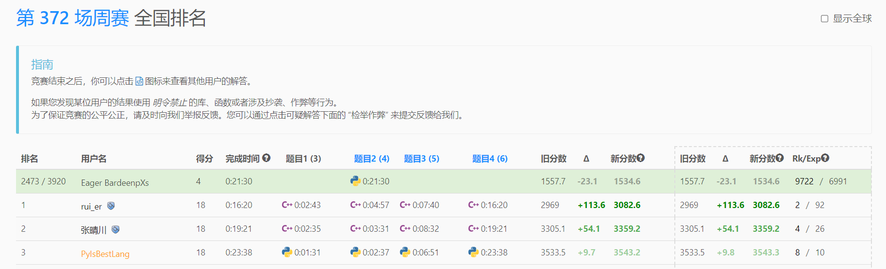

- [使三个字符串相等](https://leetcode.cn/problems/make-three-strings-equal/)（没做出来）

  > 题意容易误导

- [区分黑球与白球](https://leetcode.cn/problems/separate-black-and-white-balls/)

  

- [最大异或乘积](https://leetcode.cn/problems/maximum-xor-product/)（异或）

  > 给你三个整数 `a` ，`b` 和 `n` ，请你返回 `(a XOR x) * (b XOR x)` 的 **最大值** 且 `x` 需要满足 `0 <= x < 2n`。
  >
  > 由于答案可能会很大，返回它对 `109 + 7` **取余** 后的结果。
  >
  > **注意**，`XOR` 是按位异或操作。
  >
  > - `0 <= a, b < 250`
  > - `0 <= n <= 50`
  >
  > 2128

  ```
  
  ```

  

- [找到 Alice 和 Bob 可以相遇的建筑](https://leetcode.cn/problems/find-building-where-alice-and-bob-can-meet/)（离线线段树/单调栈二分）

  > 给你一个下标从 **0** 开始的正整数数组 `heights` ，其中 `heights[i]` 表示第 `i` 栋建筑的高度。
  >
  > 如果一个人在建筑 `i` ，且存在 `i < j` 的建筑 `j` 满足 `heights[i] < heights[j]` ，那么这个人可以移动到建筑 `j` 。
  >
  > 给你另外一个数组 `queries` ，其中 `queries[i] = [ai, bi]` 。第 `i` 个查询中，Alice 在建筑 `ai` ，Bob 在建筑 `bi` 。
  >
  > 请你能返回一个数组 `ans` ，其中 `ans[i]` 是第 `i` 个查询中，Alice 和 Bob 可以相遇的 **最左边的建筑** 。如果对于查询 `i` ，Alice 和 Bob 不能相遇，令 `ans[i]` 为 `-1` 。
  >
  > - `1 <= heights.length <= 5 * 104`
  > - `1 <= heights[i] <= 109`
  > - `1 <= queries.length <= 5 * 104`
  >
  > 2327

  ```
  
  ```

  

### 第 118 场双周赛（线性dp、单调队列优化dp（比赛只有38人AC））3题

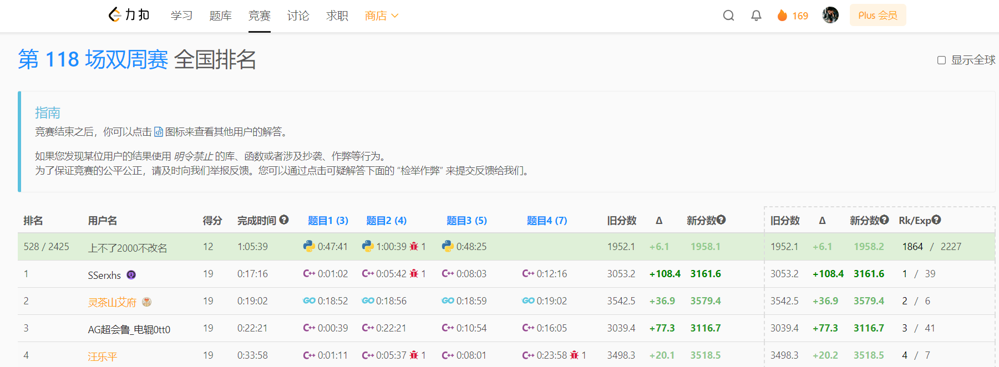

- [查找包含给定字符的单词](https://leetcode.cn/problems/find-words-containing-character/)

- [最大化网格图中正方形空洞的面积](https://leetcode.cn/problems/maximize-area-of-square-hole-in-grid/)

  > 给你一个网格图，由 `n + 2` 条 **横线段** 和 `m + 2` 条 **竖线段** 组成，一开始所有区域均为 `1 x 1` 的单元格。
  >
  > 所有线段的编号从 **1** 开始。
  >
  > 给你两个整数 `n` 和 `m` 。
  >
  > 同时给你两个整数数组 `hBars` 和 `vBars` 。
  >
  > - `hBars` 包含区间 `[2, n + 1]` 内 **互不相同** 的横线段编号。
  > - `vBars` 包含 `[2, m + 1]` 内 **互不相同的** 竖线段编号。
  >
  > 如果满足以下条件之一，你可以 **移除** 两个数组中的部分线段：
  >
  > - 如果移除的是横线段，它必须是 `hBars` 中的值。
  > - 如果移除的是竖线段，它必须是 `vBars` 中的值。
  >
  > 请你返回移除一些线段后（**可能不移除任何线段）**，剩余网格图中 **最大正方形** 空洞的面积，正方形空洞的意思是正方形 **内部** 不含有任何线段。
  >
  > - `1 <= n <= 109`
  > - `1 <= m <= 109`

  找连续块的最大长度

  ```
  class Solution:
      def maximizeSquareHoleArea(self, n: int, m: int, not_v: List[int], not_h: List[int]) -> int:
          
          not_h.sort()
          not_v.sort()
          # print(not_h)
          vm,hm = 0,0
          i = 0
          while i< len(not_v):
              j = i+1
              while j<len(not_v) and not_v[j]==not_v[j-1]+1:
                  j += 1
              vm = max(vm,j-i)
              i = j
          i = 0
          while i<len(not_h):
              j = i+1
              while j<len(not_h) and not_h[j]==not_h[j-1]+1:
                  j += 1
              hm = max(hm,j-i)
              i = j
          hm += 1
          vm += 1
                  
          a = min(vm,hm)
          return a*a
                  
  ```

  

- [购买水果需要的最少金币数](https://leetcode.cn/problems/minimum-number-of-coins-for-fruits/)

  > 你在一个水果超市里，货架上摆满了玲琅满目的奇珍异果。
  >
  > 给你一个下标从 **1** 开始的数组 `prices` ，其中 `prices[i]` 表示你购买第 `i` 个水果需要花费的金币数目。
  >
  > 水果超市有如下促销活动：
  >
  > - 如果你花费 `price[i]` 购买了水果 `i` ，那么接下来的 `i` 个水果你都可以免费获得。
  >
  > **注意** ，即使你 **可以** 免费获得水果 `j` ，你仍然可以花费 `prices[j]` 个金币去购买它以便能免费获得接下来的 `j` 个水果。
  >
  > 请你返回获得所有水果所需要的 **最少** 金币数。
  >
  > - `1 <= prices.length <= 1000`
  > - `1 <= prices[i] <= 105`

  ```
  class Solution:
      def minimumCoins(self, prices: List[int]) -> int:
          n = len(prices)
          dp = [[inf]*2 for _ in range(n)]
          # dp[x][0] # 买第x个
          # dp[x][1] # 送第x个
          for i in range(n):
              
              if i==0:
                  dp[0][0] = prices[i]
              else:
                  dp[i][0] = min(dp[i-1][0],dp[i-1][1]) + prices[i]
              
              j = i-1
              while j>=0 and j+j+2>=i+1:
                  dp[i][1] = min(dp[i][1],dp[j][0])
                  j-=1
          print(dp)
          return min(dp[i])
  ```

  

- [找到最大非递减数组的长度](https://leetcode.cn/problems/find-maximum-non-decreasing-array-length/)

  > 给你一个下标从 **0** 开始的整数数组 `nums` 。
  >
  > 你可以执行任意次操作。每次操作中，你需要选择一个 **子数组** ，并将这个子数组用它所包含元素的 **和** 替换。比方说，给定数组是 `[1,3,5,6]` ，你可以选择子数组 `[3,5]` ，用子数组的和 `8` 替换掉子数组，然后数组会变为 `[1,8,6]` 。
  >
  > 请你返回执行任意次操作以后，可以得到的 **最长非递减** 数组的长度。
  >
  > **子数组** 指的是一个数组中一段连续 **非空** 的元素序列。
  >
  > - `1 <= nums.length <= 105`
  > - `1 <= nums[i] <= 105`

  ```
  
  ```

  


### 第 373 场周赛（分组、数学）小号2题

- [循环移位后的矩阵相似检查](https://leetcode.cn/problems/matrix-similarity-after-cyclic-shifts/)

- [统计美丽子字符串 I](https://leetcode.cn/problems/count-beautiful-substrings-i/)

- [交换得到字典序最小的数组](https://leetcode.cn/problems/make-lexicographically-smallest-array-by-swapping-elements/)

  > 给你一个下标从 **0** 开始的 **正整数** 数组 `nums` 和一个 **正整数** `limit` 。
  >
  > 在一次操作中，你可以选择任意两个下标 `i` 和 `j`，**如果** 满足 `|nums[i] - nums[j]| <= limit` ，则交换 `nums[i]` 和 `nums[j]` 。
  >
  > 返回执行任意次操作后能得到的 **字典序最小的数组** 。
  >
  > 如果在数组 `a` 和数组 `b` 第一个不同的位置上，数组 `a` 中的对应字符比数组 `b` 中的对应字符的字典序更小，则认为数组 `a` 就比数组 `b` 字典序更小。例如，数组 `[2,10,3]` 比数组 `[10,2,3]` 字典序更小，下标 `0` 处是两个数组第一个不同的位置，且 `2 < 10` 。
  >
  > - `1 <= nums.length <= 105`
  > - `1 <= nums[i] <= 109`
  > - `1 <= limit <= 109`

  排序+分组

  ```
  
  ```

  

-  [统计美丽子字符串 II](https://leetcode.cn/problems/count-beautiful-substrings-ii/)

  > 给你一个字符串 `s` 和一个正整数 `k` 。
  >
  > 用 `vowels` 和 `consonants` 分别表示字符串中元音字母和辅音字母的数量。
  >
  > 如果某个字符串满足以下条件，则称其为 **美丽字符串** ：
  >
  > - `vowels == consonants`，即元音字母和辅音字母的数量相等。
  > - `(vowels * consonants) % k == 0`，即元音字母和辅音字母的数量的乘积能被 `k` 整除。
  >
  > 返回字符串 `s` 中 **非空美丽子字符串** 的数量。
  >
  > 子字符串是字符串中的一个连续字符序列。
  >
  > 英语中的 **元音字母** 为 `'a'`、`'e'`、`'i'`、`'o'` 和 `'u'` 。
  >
  > 英语中的 **辅音字母** 为除了元音字母之外的所有字母。
  >
  > - `1 <= s.length <= 5 * 104`
  > - `1 <= k <= 1000`

  分解质因子+前缀和+哈希表

  ```
  
  ```

  


### 第374场周赛（思维、暴力滑窗、组合数学）小号1题

> 难度大
>
> T2思维难度大，没见过
>
> T3滑窗条件太多，就不会了，也没想到暴力枚举26个字符
>
> T4组合数学，想不到

- [找出峰值](https://leetcode.cn/problems/find-the-peaks/)

- [需要添加的硬币的最小数量](https://leetcode.cn/problems/minimum-number-of-coins-to-be-added/)

  > 给你一个下标从 **0** 开始的整数数组 `coins`，表示可用的硬币的面值，以及一个整数 `target` 。
  >
  > 如果存在某个 `coins` 的子序列总和为 `x`，那么整数 `x` 就是一个 **可取得的金额** 。
  >
  > 返回需要添加到数组中的 **任意面值** 硬币的 **最小数量** ，使范围 `[1, target]` 内的每个整数都属于 **可取得的金额** 。
  >
  > 数组的 **子序列** 是通过删除原始数组的一些（**可能不删除**）元素而形成的新的 **非空** 数组，删除过程不会改变剩余元素的相对位置。
  >
  > - `1 <= target <= 105`
  > - `1 <= coins.length <= 105`

  ```
  
  ```

  

- [100145. 统计完全子字符串](https://leetcode.cn/problems/count-complete-substrings/)

  > 给你一个字符串 `word` 和一个整数 `k` 。
  >
  > 如果 `word` 的一个子字符串 `s` 满足以下条件，我们称它是 **完全字符串：**
  >
  > - `s` 中每个字符 **恰好** 出现 `k` 次。
  > - 相邻字符在字母表中的顺序 **至多** 相差 `2` 。也就是说，`s` 中两个相邻字符 `c1` 和 `c2` ，它们在字母表中的位置相差 **至多** 为 `2` 。
  >
  > 请你返回 `word` 中 **完全** 子字符串的数目。
  >
  > **子字符串** 指的是一个字符串中一段连续 **非空** 的字符序列。
  >
  > - `1 <= word.length <= 105`

  ```
  class Solution {
  public:
      int countCompleteSubstrings(string word, int k) {
          int n = word.size();
          int i = 0,ans = 0;
          while(i<n){
              int j = i+1;
              //找到最长子串满足：相邻字符在字母表中的顺序 至多 相差 2 
              while(j<n && abs(word[j]-word[j-1])<=2)
                  j += 1;
              string ss = word.substr(i,j-i);
              ans += getCnt(ss,k);
              i = j;  
          }
          return ans;
      }
      //统计子串str的所有合法的数量
      int getCnt(string str,int k){
          //枚举不同字符的个数
          int res = 0;
          for(int sz=1;sz<=26;sz++){
              //子串长度是sz*k个
              int window_sz = sz*k;
              //定长滑动窗口
              int mp[26];
              memset(mp,0,sizeof(mp));
              for(int i=0;i<str.size();i++){
                  mp[str[i]-'a'] += 1;
                  if(i>=window_sz)
                      mp[str[i-window_sz]-'a'] -= 1;
                  else if(i<window_sz-1)
                      continue;
                  //检查每个字符 恰好 出现 k 次。
                  int flag = 1;
                  for(int c=0;c<26;c++){
                      if(mp[c]>0 && mp[c]!=k){
                          flag = 0;
                          break;
                      }
                  }
                  if(flag) res += 1;
              }
          }
          return res;
      }
  };
  ```

  优化：可以用O（1）判断每个字符恰好出现 k 次。方法：使用存个数的哈希表，出现次数是k的数量是不是不同字符的个数 (sz)

- [统计感冒序列的数目](https://leetcode.cn/problems/count-the-number-of-infection-sequences/)

  > 给你一个整数 `n` 和一个下标从 **0** 开始的整数数组 `sick` ，数组按 **升序** 排序。
  >
  > 有 `n` 位小朋友站成一排，按顺序编号为 `0` 到 `n - 1` 。数组 `sick` 包含一开始得了感冒的小朋友的位置。如果位置为 `i` 的小朋友得了感冒，他会传染给下标为 `i - 1` 或者 `i + 1` 的小朋友，**前提** 是被传染的小朋友存在且还没有得感冒。每一秒中， **至多一位** 还没感冒的小朋友会被传染。
  >
  > 经过有限的秒数后，队列中所有小朋友都会感冒。**感冒序列** 指的是 **所有** 一开始没有感冒的小朋友最后得感冒的顺序序列。请你返回所有感冒序列的数目。
  >
  > 由于答案可能很大，请你将答案对 `109 + 7` 取余后返回。
  >
  > **注意**，感冒序列 **不** 包含一开始就得了感冒的小朋友的下标。

  组合数学+逆元

  ```
  
  ```

  

### 第 119 场双周赛（爆搜+floyd，双指针）AK

> 首先说双周赛，前三题很顺利，但是T4调了太久了，先是重边没考虑到，然后又WA，调了半天发现是floyd板子错了，得先枚举k。！！！
>
> T2 有部分思考量
>
> T4：爆搜+floyd

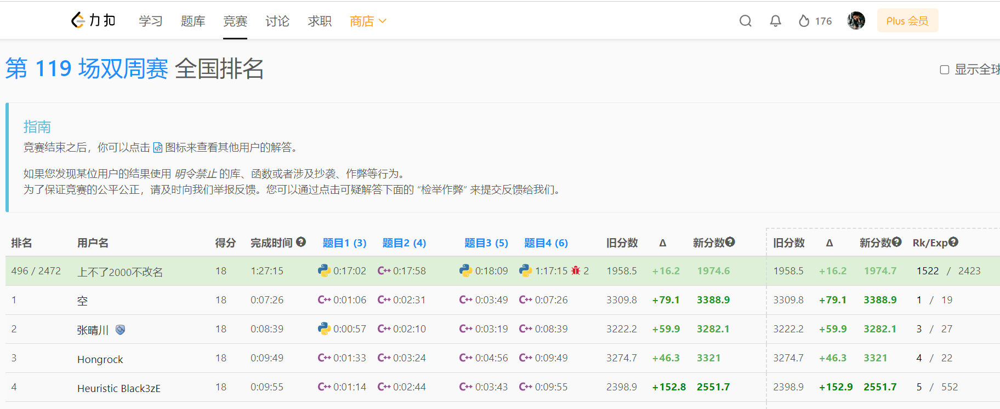

- [找到两个数组中的公共元素](https://leetcode.cn/problems/find-common-elements-between-two-arrays/)

  模拟

- [消除相邻近似相等字符](https://leetcode.cn/problems/remove-adjacent-almost-equal-characters/)

  > 给你一个下标从 **0** 开始的字符串 `word` 。
  >
  > 一次操作中，你可以选择 `word` 中任意一个下标 `i` ，将 `word[i]` 修改成任意一个小写英文字母。
  >
  > 请你返回消除 `word` 中所有相邻 **近似相等** 字符的 **最少** 操作次数。
  >
  > 两个字符 `a` 和 `b` 如果满足 `a == b` 或者 `a` 和 `b` 在字母表中是相邻的，那么我们称它们是 **近似相等** 字符。
  >
  > n = 1e5

  - 思路1

    前面一个数改了，后面一个数一定不用改，因为可以改成一个和下个数不一样的数

  - 思路2

    从左到右遍历 s，如果发现 s[i−1] 和 s[i]近似相等，应当改 s[i−1]还是 s[i]？

    如果改 s[i−1]，那么 s[i] 和 s[i+1]是可能近似相等的，但如果改 s[i]，就可以避免 s[i]和 s[i+1] 近似相等。

    所以每次发现两个相邻字母近似相等，就改右边那个。

  ```
  class Solution {
  public:
      int removeAlmostEqualCharacters(string word) {
          string t = word;
          int n = word.size();
          int ans = 0,res = 0;
          int pre = 0;//上一个数改没改，如果改了，这个数一定不用改
          for(int i=1;i<n;i++){
              if (abs(word[i] - word[i-1])<=1 and pre==0){
                  res += 1;
                  pre = 1;
              } else pre = 0;  
          }
          ans = max(ans,res);
          return ans;
      }
  };
  ```

  

-  [最多 K 个重复元素的最长子数组](https://leetcode.cn/problems/length-of-longest-subarray-with-at-most-k-frequency/)

  > 给你一个整数数组 `nums` 和一个整数 `k` 。
  >
  > 一个元素 `x` 在数组中的 **频率** 指的是它在数组中的出现次数。
  >
  > 如果一个数组中所有元素的频率都 **小于等于** `k` ，那么我们称这个数组是 **好** 数组。
  >
  > 请你返回 `nums` 中 **最长好** 子数组的长度。
  >
  > **子数组** 指的是一个数组中一段连续非空的元素序列。
  >
  > - `1 <= nums.length <= 105`
  > - `1 <= nums[i] <= 109`

  双指针

  ```
  class Solution:
      def maxSubarrayLength(self, nums: List[int], k: int) -> int:
          n = len(nums)
          j = 0
          mp = Counter()
          ans = 0
          for i in range(n):
              mp[nums[i]] += 1
              while j<i and mp[nums[i]]>k:
                  mp[nums[j]] -= 1
                  j += 1
              ans = max(ans,i-j+1)
          return ans
  ```

  

-  [关闭分部的可行集合数目](https://leetcode.cn/problems/number-of-possible-sets-of-closing-branches/)

  > 一个公司在全国有 `n` 个分部，它们之间有的有道路连接。一开始，所有分部通过这些道路两两之间互相可以到达。
  >
  > 公司意识到在分部之间旅行花费了太多时间，所以它们决定关闭一些分部（**也可能不关闭任何分部**），同时保证剩下的分部之间两两互相可以到达且最远距离不超过 `maxDistance` 。
  >
  > 两个分部之间的 **距离** 是通过道路长度之和的 **最小值** 。
  >
  > 给你整数 `n` ，`maxDistance` 和下标从 **0** 开始的二维整数数组 `roads` ，其中 `roads[i] = [ui, vi, wi]` 表示一条从 `ui` 到 `vi` 长度为 `wi`的 **无向** 道路。
  >
  > 请你返回关闭分部的可行方案数目，满足每个方案里剩余分部之间的最远距离不超过 `maxDistance`。
  >
  > **注意**，关闭一个分部后，与之相连的所有道路不可通行。
  >
  > **注意**，两个分部之间可能会有多条道路。
  >
  > - `1 <= n <= 10`
  > - `1 <= maxDistance <= 105`
  > - `0 <= roads.length <= 1000`

  爆搜回溯+floyd

  ```
  class Solution:
      def numberOfSets(self, n: int, maxDistance: int, roads: List[List[int]]) -> int:
          g = [[inf]*n for _ in range(n)]
          for i in range(n):
              g[i][i] = 0
          for a,b,c in roads:
              g[a][b] = min(g[a][b],c)
              g[b][a] = min(g[b][a],c)
              
          tmp = [[inf]*n for _ in range(n)]
          for i in range(n):
              for j in range(n):
                  tmp[i][j] = g[i][j]
          
          vis = [-1]*n
          ans = 0
          
          def dfs(u):
              if u==n:
                  for i in range(n):
                      for j in range(n):
                          g[i][j] = tmp[i][j]
                  nodes = [i for i in range(n) if vis[i]==1]
                  # floyd
                  for k in nodes:
                      for i in nodes:
                          for j in nodes:
                              g[i][j] = min(g[i][j],g[i][k]+g[k][j])
                  for i in nodes:
                      for j in nodes:
                          if i!=j and g[i][j]>maxDistance:
                              return
                  nonlocal ans
                  ans += 1
                  return
  
              vis[u] = 1
              dfs(u+1)
              vis[u] = 0
              dfs(u+1)
          dfs(0)
          return ans
  ```

  位运算枚举集合

  ```
  class Solution:
      def numberOfSets(self, n: int, maxDistance: int, roads: List[List[int]]) -> int:
          g = [[inf]*n for _ in range(n)]
          for i in range(n):
              g[i][i] = 0
          for a,b,c in roads:
              g[a][b] = min(g[a][b],c)
              g[b][a] = min(g[b][a],c)
              
          tmp = [[inf]*n for _ in range(n)]
          for i in range(n):
              for j in range(n):
                  tmp[i][j] = g[i][j]
          ans = 0
          
          def check(se):
              for i in range(n):
                  for j in range(n):
                      g[i][j] = tmp[i][j]
              
              nodes = [i for i in range(n) if (se>>i)&1]
              # floyd
              for k in nodes:
                  for i in nodes:
                      for j in nodes:
                          g[i][j] = min(g[i][j],g[i][k]+g[k][j])
              for i in nodes:
                  for j in nodes:
                      if i!=j and g[i][j]>maxDistance:
                          return 0
              return 1
          # 用位运算枚举集合
          return sum(check(i) for i in range(1<<n))  
  ```

  


### 第375场周赛（组合数学+离散化、双指针）AK

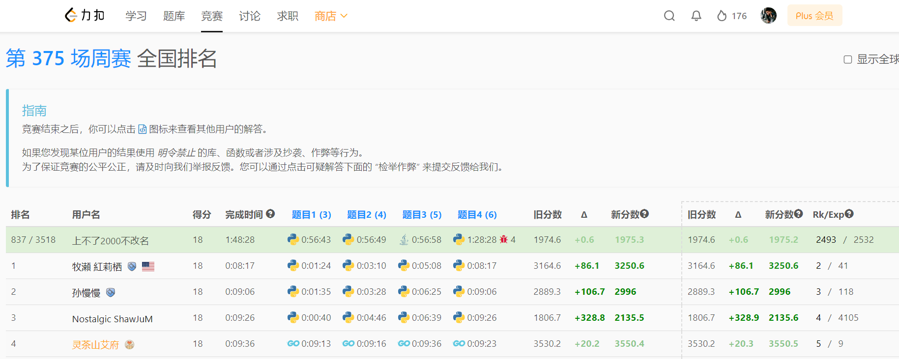

- [统计已测试设备](https://leetcode.cn/problems/count-tested-devices-after-test-operations/)

  > 给你一个长度为 `n` 、下标从 **0** 开始的整数数组 `batteryPercentages` ，表示 `n` 个设备的电池百分比。
  >
  > 你的任务是按照顺序测试每个设备 `i`，执行以下测试操作：
  >
  > - 如果batteryPercentages[i]大于0：
  >   - **增加** 已测试设备的计数。
  >   - 将下标在 `[i + 1, n - 1]` 的所有设备的电池百分比减少 `1`，确保它们的电池百分比 **不会低于** `0` ，即 `batteryPercentages[j] = max(0, batteryPercentages[j] - 1)`。
  >   - 移动到下一个设备。
  > - 否则，移动到下一个设备而不执行任何测试。
  >
  > 返回一个整数，表示按顺序执行测试操作后 **已测试设备** 的数量。
  >
  > - `1 <= n == batteryPercentages.length <= 100 `

  - 暴力O（n^2）

  - O(n)做法

    差分，但是因为操作的是后面的数，所以只需要用一个变量操作即可

    ```
    
    ```

- [双模幂运算](https://leetcode.cn/problems/double-modular-exponentiation/)

  > 给你一个下标从 **0** 开始的二维数组 `variables` ，其中 `variables[i] = [ai, bi, ci, mi]`，以及一个整数 `target` 。
  >
  > 如果满足以下公式，则下标 `i` 是 **好下标**：
  >
  > - `0 <= i < variables.length`
  > - `((aibi % 10)ci) % mi == target`
  >
  > 返回一个由 **好下标** 组成的数组，**顺序不限** 。

  模拟 /快速幂

- [统计最大元素出现至少 K 次的子数组](https://leetcode.cn/problems/count-subarrays-where-max-element-appears-at-least-k-times/)

  > 给你一个整数数组 `nums` 和一个 **正整数** `k` 。
  >
  > 请你统计有多少满足 「 `nums` 中的 **最大** 元素」至少出现 `k` 次的子数组，并返回满足这一条件的子数组的数目。
  >
  > 子数组是数组中的一个连续元素序列。

  注意是**nums的最大元素**，而不是子数组的最大值！！！

  计数型双指针

  ```
  class Solution {
  
      public long countSubarrays(int[] nums, int k) {
          long ans = 0;
          int n = nums.length;
          int mx = 0;
          for(int i=0;i<n;i++)
              mx = Math.max(mx,nums[i]);
          int j = 0;
          HashMap<Integer,Integer> mp = new HashMap<>();
          for(int i=0;i<n;i++){
              mp.put(nums[i],mp.getOrDefault(nums[i],0)+1);
              while (j<=i && mp.getOrDefault(mx,0)>=k){
                  mp.put(nums[j],mp.getOrDefault(nums[j],0)-1);
                  ans += n-1-i+1;
                  j += 1;
              }
          }
          return ans;
      }
  
  }
  ```

  - 如果是子数组的最大值最大出现K次的代码：

    线段树维护子数组最值

    ```
    class Solution {
    
        public long countSubarrays(int[] nums, int k) {
            long ans = 0;
            int n = nums.length;
            
            //初始化
            build(1,1,n,nums);
    
            int j = 0;
            HashMap<Integer,Integer> mp = new HashMap<>();
            for(int i=0;i<n;i++){
                mp.put(nums[i],mp.getOrDefault(nums[i],0)+1);
                while (j<=i && mp.get(query(1,j+1,i+1))>=k){
                    mp.put(nums[j],mp.getOrDefault(nums[j],0)-1);
                    ans += n-1-i+1;
                    j += 1;
                }
            }
            return ans;
        }
        static int N = 101000;
    	static Node[] tree = new Node[4*N];//线段树数组
    
    	//向上更新，根节点是u
    	static void pushup(int u) {
    		tree[u].val = Math.max(tree[u<<1].val,tree[u<<1|1].val);
    	}
    
    	//构建线段树函数，根节点u，构建区间[l,r]
    	static void build(int u,int l,int r,int[] nums) {
    		//叶子节点直接记录权值
    		if(l==r) 
    			tree[u] = new Node(l, r, nums[l-1]);
    		else {
    			tree[u] = new Node(l, r, 0);//值先记为0，pushup再更新
    			int mid = l+r>>1;
    			build(u<<1, l, mid,nums);//构建左子树
    			build(u<<1|1, mid+1, r,nums);//构建右子树
    			pushup(u);//向上更新val
    		}
    	}
    	
    	//计算当前节点u下的在[l,r]范围内的和，u代表当前节点(递归的时候l,r是不变的)
    	static int query(int u,int l,int r) {
    		//如果区间和val完全包含当前节点，就直接加上
    		if(tree[u].l>=l && tree[u].r<=r) 
    			return tree[u].val;
    		//否则，当前节点的范围一分为二
    		int mid = tree[u].l + tree[u].r >>1;
    		int mx = 0;
    		if(l <= mid) mx = Math.max(mx,query(u<<1,l,r)) ;
    		if(r >= mid+1) mx = Math.max(mx,query(u<<1|1, l, r));
    		return mx;
    	}
    
        static class Node{
            Integer l,r,val;
            public Node(Integer l,Integer r,Integer val) {
                this.l = l;
                this.r = r;
                this.val = val;
            }
        }
    }
    ```

    

- [统计好分割方案的数目](https://leetcode.cn/problems/count-the-number-of-good-partitions/)

  > 给你一个下标从 **0** 开始、由 **正整数** 组成的数组 `nums`。
  >
  > 将数组分割成一个或多个 **连续** 子数组，如果不存在包含了相同数字的两个子数组，则认为是一种 **好分割方案** 。
  >
  > 返回 `nums` 的 **好分割方案** 的 **数目**。
  >
  > 由于答案可能很大，请返回答案对 `109 + 7` **取余** 的结果。

  组合数学

  找分块的个数cnt，最后2**(cnt-1)

  ```
  class Solution:
      def numberOfGoodPartitions(self, nums: List[int]) -> int:
          n = len(nums)
  
          l = {}
          r = {}
          for i in range(n):
              r[nums[i]] = i
          for i in range(n-1,-1,-1):
              l[nums[i]] = i  
  
          last = -1
          ans = 0
          for i in range(n):
              if l[nums[i]]>last:
                  ans += 1
              last = max(r[nums[i]],last)
          return 2**(ans-1) % (10**9+7)
  ```

  

### 第 376 场力扣周赛（T4滑动窗口、回文数、排序中位数）3题

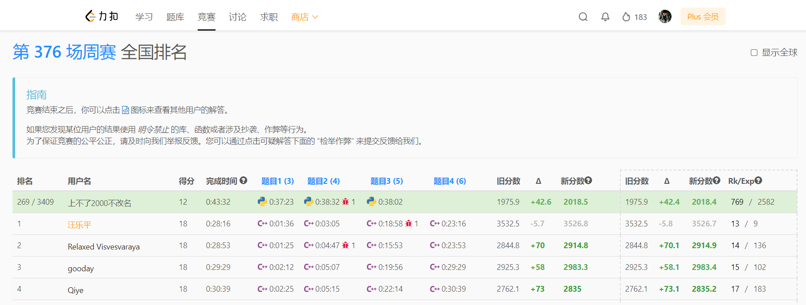

- `3 分` - [找出缺失和重复的数字](https://leetcode.cn/problems/find-missing-and-repeated-values/)

  

- `4 分` - [划分数组并满足最大差限制](https://leetcode.cn/problems/divide-array-into-arrays-with-max-difference/)

  > 给你一个长度为 `n` 的整数数组 `nums`，以及一个正整数 `k` 。
  >
  > 将这个数组划分为一个或多个长度为 `3` 的子数组，并满足以下条件：
  >
  > - `nums` 中的 **每个** 元素都必须 **恰好** 存在于某个子数组中。
  > - 子数组中 **任意** 两个元素的差必须小于或等于 `k` 。
  >
  > 返回一个 **二维数组** ，包含所有的子数组。如果不可能满足条件，就返回一个空数组。如果有多个答案，返回 **任意一个** 即可。
  >
  > - `n == nums.length`
  > - `1 <= n <= 105`
  > - `n` 是 `3` 的倍数
  > - `1 <= nums[i] <= 105`
  > - `1 <= k <= 105`

  ```
  class Solution:
      def divideArray(self, nums: List[int], k: int) -> List[List[int]]:
          n = len(nums)
          nums.sort()
          j = 0
          ans = []
          for i in range(n):
              if abs(nums[i]-nums[j])>k or i-j==3:
                  if i-j!=3:
                      return []
                  ans.append(nums[j:i])
                  j = i
              else: continue
          ans.append(nums[j:n])
          return ans
  ```

  

- `5 分` - [使数组成为等数数组的最小代价](https://leetcode.cn/problems/minimum-cost-to-make-array-equalindromic/)

  > 给你一个长度为 `n` 下标从 **0** 开始的整数数组 `nums` 。
  >
  > 你可以对 `nums` 执行特殊操作 **任意次** （也可以 **0** 次）。每一次特殊操作中，你需要 **按顺序** 执行以下步骤：
  >
  > - 从范围 `[0, n - 1]` 里选择一个下标 `i` 和一个 **正** 整数 `x` 。
  > - 将 `|nums[i] - x|` 添加到总代价里。
  > - 将 `nums[i]` 变为 `x` 。
  >
  > 如果一个正整数正着读和反着读都相同，那么我们称这个数是 **回文数** 。比方说，`121` ，`2552` 和 `65756` 都是回文数，但是 `24` ，`46` ，`235` 都不是回文数。
  >
  > 如果一个数组中的所有元素都等于一个整数 `y` ，且 `y` 是一个小于 `109` 的 **回文数** ，那么我们称这个数组是一个 **等数数组** 。
  >
  > 请你返回一个整数，表示执行任意次特殊操作后使 `nums` 成为 **等数数组** 的 **最小** 总代价。
  >
  > - `1 <= n <= 105`
  > - `1 <= nums[i] <= 109`

  暴力枚举可以过，

  可以预处理回文数O（sqrt(n)）

  ```
  
  ```

  

- `6 分` - [执行操作使频率分数最大](https://leetcode.cn/problems/apply-operations-to-maximize-frequency-score/) 

  > 给你一个下标从 **0** 开始的整数数组 `nums` 和一个整数 `k` 。
  >
  > 你可以对数组执行 **至多** `k` 次操作：
  >
  > - 从数组中选择一个下标 `i` ，将 `nums[i]` **增加** 或者 **减少** `1` 。
  >
  > 最终数组的频率分数定义为数组中众数的 **频率** 。
  >
  > 请你返回你可以得到的 **最大** 频率分数。
  >
  > 众数指的是数组中出现次数最多的数。一个元素的频率指的是数组中这个元素的出现次数。
  >
  > - `1 <= nums.length <= 105`
  > - `1 <= nums[i] <= 109`
  > - `0 <= k <= 1014`

  - 关键点1：修改若干个数，这些个数是连续的，所以是**连续子数组**的问题
  - 关键点2：**中位数贪心**，计算所有点距离某一个位置的**最小距离和**，这个位置就是中位数上最小，如果是奇数个，刚好是中间的，偶数个，是中间两个元素的一段区间上都行
  - 关键点3：前缀和优化，用前缀和可以把计算最小距离和优化成O（1）的

  写法1：二分答案

  ```
  class Solution:
      def maxFrequencyScore(self, nums: List[int], k: int) -> int:
          n = len(nums)
          nums.sort()
          s = [0]*(n+1)
          for i in range(n):
              s[i] = s[i-1]+nums[i]
          # 检查最大频率是fre时，是否存在满足的方案，满足修改次数<=k
          def check(fre):
              # 考虑长度是fre的所有子数组，对于每个子数组，O（1）计算最少修改次数
              i = 0
              while i<n:
                  j = i+fre-1
                  if j>=n:
                      break
                  # 计算这个子数组的最小消耗
                  # 将 a 的所有元素变为a的中位数是最优的。
                  mid = i+j>>1
                  left_sum = (mid-i+1)*nums[mid] - (s[mid]-s[i-1])
                  right_sum = s[j] - s[mid-1] - (j-mid+1)*nums[mid]
                  # print(fre,i,j,left_sum+right_sum)
                  if left_sum+right_sum<=k:
                      return True
                  i += 1  
              return False
  
          l,r = 1,n
          while l<r:
              mid = l+r+1>>1
              if check(mid):
                  l = mid
              else:
                  r = mid-1
          return l
  ```

  写法2：滑动窗口

  ```
  
  ```

  > 模板题：[462. 最小操作次数使数组元素相等 II](https://leetcode.cn/problems/minimum-moves-to-equal-array-elements-ii/)
  >
  > > 给你一个长度为 `n` 的整数数组 `nums` ，返回使所有数组元素相等需要的最小操作数。
  > >
  > > 在一次操作中，你可以使数组中的一个元素加 `1` 或者减 `1` 。
  >
  > - 方法1：枚举
  > - 方法2：前缀和优化（O(1)计算最小距离和）
  >
  > ```
  > class Solution:
  >     def minMoves2(self, nums: List[int]) -> int:
  >         n = len(nums)
  >         nums.sort()
  >         s = [0]*(n+1)
  >         for i in range(n):
  >             s[i] = s[i-1]+nums[i]
  >         # 中位数
  >         mid = n//2
  >         # O(1)计算最小距离和（前缀和优化）
  >         s = (mid+1)*nums[mid]-s[mid] + s[n-1]-s[mid-1] - (n-mid)*nums[mid]
  >         return s
  > 
  > ```
  >


### 第 120 场双周赛（树形dp、前后缀双指针）3题

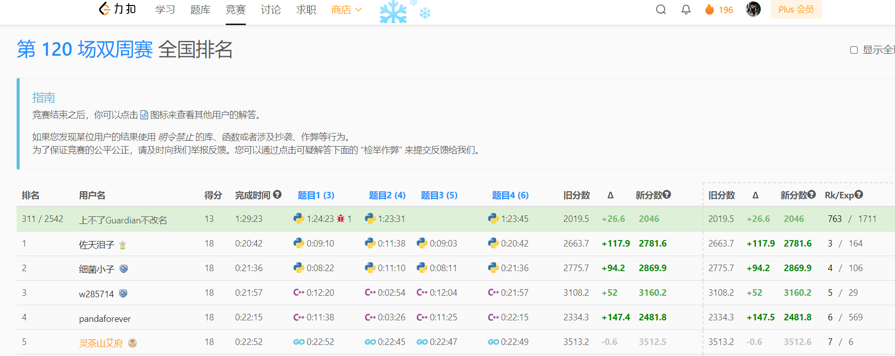

- [统计移除递增子数组的数目 I](https://leetcode.cn/problems/count-the-number-of-incremovable-subarrays-i/)

  模拟

-  [找到最大周长的多边形](https://leetcode.cn/problems/find-polygon-with-the-largest-perimeter/)

  > 给你一个长度为 `n` 的 **正** 整数数组 `nums` 。
  >
  > **多边形** 指的是一个至少有 `3` 条边的封闭二维图形。多边形的 **最长边** 一定 **小于** 所有其他边长度之和。
  >
  > 如果你有 `k` （`k >= 3`）个 **正** 数 `a1`，`a2`，`a3`, ...，`ak` 满足 `a1 <= a2 <= a3 <= ... <= ak` **且** `a1 + a2 + a3 + ... + ak-1 > ak` ，那么 **一定** 存在一个 `k` 条边的多边形，每条边的长度分别为 `a1` ，`a2` ，`a3` ， ...，`ak` 。
  >
  > 一个多边形的 **周长** 指的是它所有边之和。
  >
  > 请你返回从 `nums` 中可以构造的 **多边形** 的 **最大周长** 。如果不能构造出任何多边形，请你返回 `-1` 。

  枚举

  ```
  class Solution:
      def largestPerimeter(self, nums: List[int]) -> int:
          n = len(nums)
          nums.sort()
          ans = -1
          s = nums[0]+nums[1]
          for i in range(2,n):
              if nums[i]<s:
                  ans = max(ans,nums[i]+s)
              s += nums[i]
          return ans
              
  ```

  

- [统计移除递增子数组的数目 II](https://leetcode.cn/problems/count-the-number-of-incremovable-subarrays-ii/)

  > 给你一个下标从 **0** 开始的 **正** 整数数组 `nums` 。
  >
  > 如果 `nums` 的一个子数组满足：移除这个子数组后剩余元素 **严格递增** ，那么我们称这个子数组为 **移除递增** 子数组。比方说，`[5, 3, 4, 6, 7]` 中的 `[3, 4]` 是一个移除递增子数组，因为移除该子数组后，`[5, 3, 4, 6, 7]` 变为 `[5, 6, 7]` ，是严格递增的。
  >
  > 请你返回 `nums` 中 **移除递增** 子数组的总数目。
  >
  > **注意** ，剩余元素为空的数组也视为是递增的。
  >
  > **子数组** 指的是一个数组中一段连续的元素序列。
  >
  > - `1 <= nums.length <= 105`

  方法1：前后缀+双指针

  ```
  
  ```

  方法2：二分

  ```
  
  ```

  

- [树中每个节点放置的金币数目](https://leetcode.cn/problems/find-number-of-coins-to-place-in-tree-nodes/)

  > 给你一棵 `n` 个节点的 **无向** 树，节点编号为 `0` 到 `n - 1` ，树的根节点在节点 `0` 处。同时给你一个长度为 `n - 1` 的二维整数数组 `edges` ，其中 `edges[i] = [ai, bi]` 表示树中节点 `ai` 和 `bi` 之间有一条边。
  >
  > 给你一个长度为 `n` 下标从 **0** 开始的整数数组 `cost` ，其中 `cost[i]` 是第 `i` 个节点的 **开销** 。
  >
  > 你需要在树中每个节点都放置金币，在节点 `i` 处的金币数目计算方法如下：
  >
  > - 如果节点 `i` 对应的子树中的节点数目小于 `3` ，那么放 `1` 个金币。
  > - 否则，计算节点 `i` 对应的子树内 `3` 个不同节点的开销乘积的 **最大值** ，并在节点 `i` 处放置对应数目的金币。如果最大乘积是 **负数** ，那么放置 `0` 个金币。
  >
  > 请你返回一个长度为 `n` 的数组 `coin` ，`coin[i]`是节点 `i` 处的金币数目。
  >
  > - `2 <= n <= 2 * 104`

  树形dp

  ```
  class Solution:
      def placedCoins(self, edges: List[List[int]], cost: List[int]) -> List[int]:
          n = len(cost)
          e = [[]for _ in range(n)]
          for a,b in edges:
              e[a].append(b)
              e[b].append(a)
          ans = [0]*n
          def dfs(u,fa):
              cnt = 1
              zheng = [0]*3
              fu = [0]*2
              for j in e[u]:
                  if j!=fa:
                      jcnt,jz,jf = dfs(j,u)
                      cnt += jcnt
                      for x in jz:
                          if x>=zheng[0]:
                              zheng[2] = zheng[1]
                              zheng[1] = zheng[0]
                              zheng[0] = x
                          elif x>=zheng[1]:
                              zheng[2] = zheng[1]
                              zheng[1] = x
                          elif x>zheng[2]:
                              zheng[2] = x
                      for x in jf:
                          if x<=fu[0]:
                              fu[1] = fu[0]
                              fu[0] = x
                          elif x<=fu[1]:
                              fu[1] = x
              
              x = cost[u]
              if x>0:
                  if x>=zheng[0]:
                      zheng[2] = zheng[1]
                      zheng[1] = zheng[0]
                      zheng[0] = x
                  elif x>=zheng[1]:
                      zheng[2] = zheng[1]
                      zheng[1] = x
                  elif x>zheng[2]:
                      zheng[2] = x
              else:
                  if x<=fu[0]:
                      fu[1] = fu[0]
                      fu[0] = x
                  elif x<=fu[1]:
                      fu[1] = x
              if cnt<3:
                  ans[u] = 1
              else:
                  if fu[0]!=0 and fu[1]!=0:
                      ans[u] = fu[0]*fu[1]*zheng[0]
                  if zheng[0]!=0 and zheng[1]!=0 and zheng[2]!=0:
                      ans[u] = max(ans[u],zheng[0]*zheng[1]*zheng[2])
              return cnt,zheng,fu
  
                          
          dfs(0,-1)
          return ans
  ```

  

  

### 第 377 场周赛（划分型dp+Tire+Floyd、暴力思维）2题

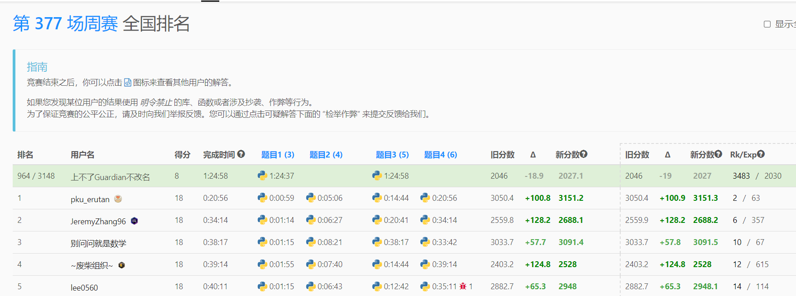

- [最小数字游戏](https://leetcode.cn/problems/minimum-number-game/)

  模拟

- [移除栅栏得到的正方形田地的最大面积](https://leetcode.cn/problems/maximum-square-area-by-removing-fences-from-a-field/)（没做出来）

  > 有一个大型的 `(m - 1) x (n - 1)` 矩形田地，其两个对角分别是 `(1, 1)` 和 `(m, n)` ，田地内部有一些水平栅栏和垂直栅栏，分别由数组 `hFences` 和 `vFences` 给出。
  >
  > 水平栅栏为坐标 `(hFences[i], 1)` 到 `(hFences[i], n)`，垂直栅栏为坐标 `(1, vFences[i])` 到 `(m, vFences[i])` 。
  >
  > 返回通过 **移除** 一些栅栏（**可能不移除**）所能形成的最大面积的 **正方形** 田地的面积，或者如果无法形成正方形田地则返回 `-1`。
  >
  > 由于答案可能很大，所以请返回结果对 `109 + 7` **取余** 后的值。
  >
  > **注意：**田地外围两个水平栅栏（坐标 `(1, 1)` 到 `(1, n)` 和坐标 `(m, 1)` 到 `(m, n)` ）以及两个垂直栅栏（坐标 `(1, 1)` 到 `(m, 1)` 和坐标 `(1, n)` 到 `(m, n)` ）所包围。这些栅栏 **不能** 被移除。
  >
  > - `3 <= m, n <= 109`
  > - `1 <= hFences.length, vFences.length <= 600`

  ```
  class Solution:
      def maximizeSquareArea(self, m: int, n: int, h: List[int], v: List[int]) -> int:
          h.append(1)
          h.append(m)
          v.append(1)
          v.append(n)
          h.sort()
          v.sort()
          
          sev = set()
          seh = set()
  
          for i in range(len(h)):
              for j in range(i):
                  seh.add(h[i]-h[j])
          for i in range(len(v)):
              for j in range(i):
                  sev.add(v[i]-v[j])
          # print(seh)
          # print(sev)
          a = 0
          for x in seh:
              if x in sev:
                  a = max(a,x)
          return a*a %(10**9+7) if a else -1
  ```

  

-  [转换字符串的最小成本 I](https://leetcode.cn/problems/minimum-cost-to-convert-string-i/)

  > 给你两个下标从 **0** 开始的字符串 `source` 和 `target` ，它们的长度均为 `n` 并且由 **小写** 英文字母组成。
  >
  > 另给你两个下标从 **0** 开始的字符数组 `original` 和 `changed` ，以及一个整数数组 `cost` ，其中 `cost[i]` 代表将字符 `original[i]` 更改为字符 `changed[i]` 的成本。
  >
  > 你从字符串 `source` 开始。在一次操作中，**如果** 存在 **任意** 下标 `j` 满足 `cost[j] == z` 、`original[j] == x` 以及 `changed[j] == y` 。你就可以选择字符串中的一个字符 `x` 并以 `z` 的成本将其更改为字符 `y` 。
  >
  > 返回将字符串 `source` 转换为字符串 `target` 所需的 **最小** 成本。如果不可能完成转换，则返回 `-1` 。
  >
  > **注意**，可能存在下标 `i` 、`j` 使得 `original[j] == original[i]` 且 `changed[j] == changed[i]` 。
  >
  > - `1 <= source.length == target.length <= 105`
  > - `source`、`target` 均由小写英文字母组成
  > - `1 <= cost.length== original.length == changed.length <= 2000`

  裸floyd

  ```
  class Solution:
      def minimumCost(self, source: str, target: str, original: List[str], changed: List[str], cost: List[int]) -> int:
  
          n = len(source)
  
          dp = [[inf]*26 for _ in range(26)]
          for i in range(26):
              dp[i][i] = 0
          for pre,cur,cos in zip(original,changed,cost):
              a,b = ord(pre)-ord('a'),ord(cur)-ord('a')
              dp[a][b] = min(dp[a][b],cos)
  
          for k in range(26):
              for i in range(26):
                  for j in range(26):
                      dp[i][j] = min(dp[i][j],dp[i][k]+dp[k][j])
          
          ans = 0
          for i in range(n):
              # print(i,(source[i],target[i]))
              a,b = ord(source[i])-ord('a'),ord(target[i])-ord('a')
              if source[i]==target[i]:
                  continue
              elif dp[a][b]!=inf:
                  ans += dp[a][b]
              else:
                  return -1
          return ans
  ```

  

- [转换字符串的最小成本 II](https://leetcode.cn/problems/minimum-cost-to-convert-string-ii/)

  > 给你两个下标从 **0** 开始的字符串 `source` 和 `target` ，它们的长度均为 `n` 并且由 **小写** 英文字母组成。
  >
  > 另给你两个下标从 **0** 开始的字符串数组 `original` 和 `changed` ，以及一个整数数组 `cost` ，其中 `cost[i]` 代表将字符串 `original[i]` 更改为字符串 `changed[i]` 的成本。
  >
  > 你从字符串 `source` 开始。在一次操作中，**如果** 存在 **任意** 下标 `j` 满足 `cost[j] == z` 、`original[j] == x` 以及 `changed[j] == y` ，你就可以选择字符串中的 **子串** `x` 并以 `z` 的成本将其更改为 `y` 。 你可以执行 **任意数量** 的操作，但是任两次操作必须满足 **以下两个** 条件 **之一** ：
  >
  > - 在两次操作中选择的子串分别是 `source[a..b]` 和 `source[c..d]` ，满足 `b < c` **或** `d < a` 。换句话说，两次操作中选择的下标 **不相交** 。
  > - 在两次操作中选择的子串分别是 `source[a..b]` 和 `source[c..d]` ，满足 `a == c` **且** `b == d` 。换句话说，两次操作中选择的下标 **相同** 。
  >
  > 返回将字符串 `source` 转换为字符串 `target` 所需的 **最小** 成本。如果不可能完成转换，则返回 `-1` 。
  >
  > **注意**，可能存在下标 `i` 、`j` 使得 `original[j] == original[i]` 且 `changed[j] == changed[i]` 。
  >
  > - `1 <= source.length == target.length <= 1000`
  > - `source`、`target` 均由小写英文字母组成
  > - `1 <= cost.length == original.length == changed.length <= 100`

  floyd + 划分型dp

  ```
  
  ```

  