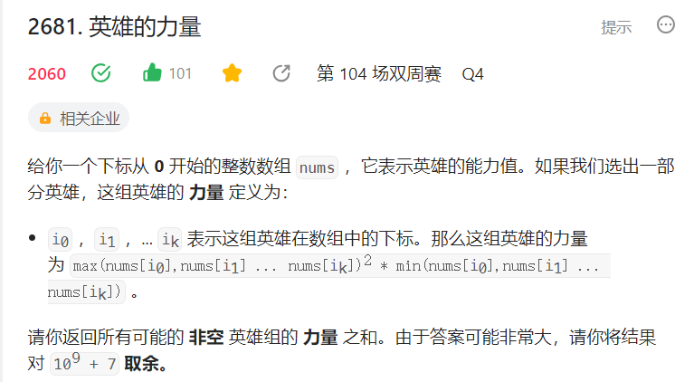
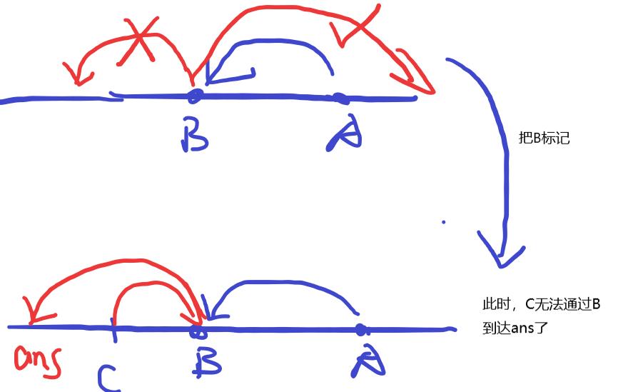

# 每日一题

### 2023年7月18日 （离线）

> 1851包含每个查询的最小区间（离线查询+排序+堆）
>
> 本题2286分，Hard难度

离线查询 把所有区间全部读入后统一处理（排序）

贪心 对查询区间从小到大排序，对下标排序 所有区间按照左端点排序

小根堆 堆的第一维度存放长度

步骤： 枚举查询区间，内层用指针j指向internals数组，j只向右移动，像是双指针的感觉。然后内层维护一个堆，先循环区间，如果左端点满足条件，就加入堆中；再循环出队，如果堆顶元素右端点不满足，就循环出堆。最后，如果堆中有元素就记录答案。

> 题解：https://leetcode.cn/problems/minimum-interval-to-include-each-query/solutions/2349353/1851-bao-han-mei-ge-cha-xun-de-zui-xiao-c3dhp/

### 2023年7月19日（哈希表）

> \874. 模拟行走机器人
>
> 1846分

哈希表+模拟题

将旋转和四个方向保持一致，比如向右转，指针就加1，此外，偏移量也要向右排（顺时针）

> https://leetcode.cn/problems/walking-robot-simulation/solutions/2350804/mo-ni-xing-zou-ji-qi-ren-mo-ni-ha-xi-bia-2sgr/


### 2023年7月20日（dp）

> 918环形子数组的最大和
>
> 1777分

环形连续子数组的最大和（动态规划）

思路：先求一遍连续子数组的最大和，再考虑环形的

>  https://leetcode.cn/problems/maximum-sum-circular-subarray/solutions/2352211/918-huan-xing-zi-shu-zu-de-zui-da-he-dp-87xk6/

### 2023年7月21日（单调队列）

> [1499. 满足不等式的最大值](https://leetcode.cn/problems/max-value-of-equation/)
>
> 2456分
>
> 给定一个节点数组points（横坐标 x 的值从小到大排序），求`yi + yj + |xi - xj|` 的 **最大值**，其中 `|xi - xj| <= k` 且 `i < j`

公式化简 + 堆/单调队列

> 题解：https://leetcode.cn/problems/max-value-of-equation/solutions/2353594/man-zu-bu-deng-shi-de-zui-da-zhi-gong-sh-wyo4/

### 2023年7月22日（模拟）

>  [860. 柠檬水找零](https://leetcode.cn/problems/lemonade-change/)
>
> 1286分

模拟题

### 2023年7月23日（双指针）

> 42. 接雨水
>
> 给定 `n` 个非负整数表示每个宽度为 `1` 的柱子的高度图，计算按此排列的柱子，下雨之后能接多少雨水。
>
> 本题是11. 盛最多水的容器的变形

方法1：前后缀预处理，找到前缀/后缀最大值，再计算这个格子的贡献

方法2：左右双指针（待补）

> 视频讲解：https://www.bilibili.com/video/BV1Qg411q7ia/?vd_source=9df13446957cfa1b1efd5650c5e3a393

> 原型：[11. 盛最多水的容器](https://leetcode.cn/problems/container-with-most-water/)

### 2023年7月24日（模拟）

> 模拟水题

### 2023年7月25日（堆）

> [2208. 将数组和减半的最少操作次数](https://leetcode.cn/problems/minimum-operations-to-halve-array-sum/)
>
> 1550分

贪心+堆

```python
class Solution:
    def halveArray(self, nums: List[int]) -> int:
        s = sum(nums)
        nums = [-x for x in nums]
        pq = []
        for x in nums:
            heappush(pq,x)
        t = 0
        ans = 0
        while len(pq):
            x = -heappop(pq)
            t += x/2
            ans += 1
            if t >= s/2:
                break
            heappush(pq,-x/2)
        return ans
```

### 2023年7月26日（线段树）

> [2569. 更新数组后处理求和查询](https://leetcode.cn/problems/handling-sum-queries-after-update/)
>
> 
>
> 2398分。
>
> 

思维+带懒标记的线段树
思路：

只需要在操作3的时候输出，而且是求出1~n的和，所以query函数不需要写，看操作2，可以简化成，上一个sum和当前sum的关系就是，每次新增p*c，其中c是nums1中1的个数。所以线段树维护区间1的个数就行了，剩下就是操作1怎么转换的问题了，假如[l,r]中1的个数是cnt，那么反转整个区间就相当于个数变成r-l+1-cnt。

> 线段树代码里有些没看懂，1.flip的作用 2.tree[1]可以直接拿到，而不需要query查询


> 题解：https://leetcode.cn/problems/handling-sum-queries-after-update/solutions/2119436/xian-duan-shu-by-endlesscheng-vx80/

### 2023年7月27日（贪心）

> [2500. 删除每行中的最大值](https://leetcode.cn/problems/delete-greatest-value-in-each-row/)
>
> 1310

排序+贪心


### 2023年7月28日（dp、图）

> [2050. 并行课程 III](https://leetcode.cn/problems/parallel-courses-iii/)
> 
>
> 2084分

本题就是求AUG中关键路径的长度，也就是算从一些起点到最终点的最长路径长度。

动态规划+拓扑排序

思路：

初始时将所有入度是0的节点全部进队，每一次出队更新入度，若有入度是0的就加入队列中。

此外，需要求起点到终点的最长的路径，这里可以利用动态规划的思路，dp[i]表示从初始点到节点i的最长路径，那么dp[i] = max(dp[j]+time[i]),其中j->i。最后的答案就是max(dp[i])

```c++
class Solution {
public:
    int ru[50100],dp[50100];
    int minimumTime(int n, vector<vector<int>>& relations, vector<int>& time) {
        vector<vector<int>> e(n);
        for(int i=0;i<relations.size();i++){
            int x = relations[i][0]-1;
            int y = relations[i][1]-1;
            ru[y]++;
            e[x].push_back(y);
        }
        queue<int> q;
        int ans = 0;
        for(int i=0;i<n;i++){
            if(ru[i]==0){
                q.push(i);
                dp[i] = time[i];
                ans = max(ans,dp[i]);
            }   
        }

        while(q.size()){
            int ver = q.front();
            q.pop();
            int val = time[ver];

            for(int k=0;k<e[ver].size();k++){
                int j = e[ver][k];
                if(--ru[j]==0)
                    q.push(j);
                dp[j] = max(dp[j],dp[ver]+time[j]);
                ans = max(ans,dp[j]);
            }  
        }
        return ans;
    }
};
```

WA思路：

每一层出队，都把最大的加到答案上，不知道为什么不对。 10 / 42 个通过的测试用例

> 题解：https://leetcode.cn/problems/parallel-courses-iii/post-solution/2050-bing-xing-ke-cheng-iiituo-bu-pai-xu-kq19/

- [128. 最长连续序列](https://leetcode.cn/problems/longest-consecutive-sequence/)

  > 给定一个未排序的整数数组 `nums` ，找出数字连续的最长序列（不要求序列元素在原数组中连续）的长度。
  >
  > 请你设计并实现时间复杂度为 `O(n)` 的算法解决此问题。

  方法1：排序

  方法2：哈希表（有思考量）

  ```python
  class Solution(object):
      def longestConsecutive(self, nums):
          hash_dict = dict()
          # hash_dict[i]中存放包含节点i的最大连续长度
          max_length = 0
          for num in nums:
              if num not in hash_dict:
                  left = hash_dict.get(num - 1, 0)
                  right = hash_dict.get(num + 1, 0)
                  
                  cur_length = 1 + left + right
   
                  ans = max(ans,cur_length)
                  
                  hash_dict[num] = cur_length
                  hash_dict[num - left] = cur_length
                  hash_dict[num + right] = cur_length
                  
          return ans
  ```

  


### 2023年7月29日（链表）

> [141. 环形链表](https://leetcode.cn/problems/linked-list-cycle/)
>
> 题意：判断链表是否有环

快慢指针

- 方法1：快慢指针（灵神思路）

  快指针每次走2格，慢指针每次走1格，那么如果有环，快指针一定能追上慢指针

```python3
class Solution:
    def hasCycle(self, head: Optional[ListNode]) -> bool:
        fast = head
        slow = head
        while fast and fast.next:
            fast = fast.next.next
            if fast == slow:
                return True
            slow = slow.next
        return False
```

> 视频讲解：https://www.bilibili.com/video/BV1KG4y1G7cu/?vd_source=9df13446957cfa1b1efd5650c5e3a393

- 方法2：val打上标记

```
class Solution:
    def hasCycle(self, head: Optional[ListNode]) -> bool:
        while head and head.val != 0x3f3f3f3f:
            head.val = 0x3f3f3f3f
            head = head.next
        if not head:
            return False
        return True
```

- [876. 链表的中间结点](https://leetcode.cn/problems/middle-of-the-linked-list/)

  > 请你找出并返回链表的中间结点。

  思路：快慢指针。

  快指针每次走2格，慢指针每次走1格

  ```python
  def middleNode(self, head: ListNode) -> ListNode:
          slow = fast = head
          while fast and fast.next:
              fast = fast.next.next
              slow = slow.next
          return slow
  ```

  

- [142. 环形链表 II](https://leetcode.cn/problems/linked-list-cycle-ii/)

  这题和141的不同点是需要输出循环点的地址。

  - 方法1：用set做。

  - 方法2：灵神快慢指针（这里不理解）

    > https://www.bilibili.com/video/BV1KG4y1G7cu/?vd_source=9df13446957cfa1b1efd5650c5e3a393

- [143. 重排链表](https://leetcode.cn/problems/reorder-list/)

  > 已知链表：L0 → L1 → … → Ln - 1 → Ln
  >
  > 返回链表：L0 → Ln → L1 → Ln - 1 → L2 → Ln - 2 → …

  思路：反转链表+找到链表中间节点

  

  ```python
  class Solution:
      # 206反转链表
      def reverseList(self,head: Optional[ListNode]):
          pre = None
          cur = head
          while cur:
              nxt = cur.next
              cur.next = pre
              pre = cur
              cur = nxt
          return pre
      # 876链表的中间节点
      def getMidList(self,head: Optional[ListNode]):
          l = r = head
          while r and r.next:
              r = r.next.next
              l = l.next
          return l
  	# 核心函数
      def reorderList(self, head: Optional[ListNode]) -> None:
          mid = self.getMidList(head)
          head2 = self.reverseList(mid)
          while head2.next:
              h1next = head.next
              h2next = head2.next
              head.next = head2
              head2.next = h1next
              head = h1next
              head2 = h2next
  ```

  > 两道基础题的结合，链表好题

### 2023年7月30日（链表）

[142. 环形链表 II](https://leetcode.cn/problems/linked-list-cycle-ii/)


### 数位dp模版

简洁模版：(计算1~n的满足条件的)

```python
class Solution:
    def countSpecialNumbers(self, n: int) -> int:
        s = str(n)
        @cache
        def f(i:int, mask:int, is_limit:bool, is_num:bool)->int:
            if i == len(s):
                return int(is_num) # 0不满足条件
            res = 0
            if not is_num:
                res = f(i+1,mask,False,False) # 前i-1位都是无效数字
            up = int(s[i]) if is_limit else 9 
            low = 0 if is_num else 1 
            for d in range(low,up+1): 
                if mask>>d&1 == 0: 
                    res += f(i+1,mask|(1<<d),is_limit and d==up,True) 
            return res
        return f(0,0,True,False) 
```

计算low~high的满足条件的个数

```python
class Solution:
    def count(self, num1: str, num2: str) -> int:
        mod = 10**9+7
    	def cal(s:str):
            @cache
            def f(i:int, pre:int, is_limit:bool, is_num:bool)->int:
                if i == len(s):
                    return int(is_num) 
                res = 0
                if not is_num:
                    res = f(i+1,pre,False,False) 
                up = int(s[i]) if is_limit else 9
                low = 0 if is_num else 1
                for d in range(low,up+1):
                    if not is_num or abs(pre-d)==1:
                        res += f(i+1,d,is_limit and d==up,True) 
                return res%mod
            return f(0,0,True,False)
       	# ans
        return (cal(high) - cal(str(int(low)-1)) )%mod
```

- 参数1：i表示当前要处理第i位

- 参数2：mask表示前i-1的状态。这里是需要变化的，可以是pre,也可以是cnt

    - 集合映射成一个整数

      比如 1,2,5,9。那么mask == 2^1+2^2+2^5+2^9

    - 判断数位x是否被集合选择过

      ```
      if mask>>d&1 == 0:
      ```

    - 把数位d加入到集合中

      ```
      mask = mask|(1<<d)
      ```

      

- 参数3：is_limit 表示第i位的取值上界是否有上限，如果True，第i位最大是int(s[i]);否则就是9。

    第i位是否有上界，取决于前i位是否都是在右子树上，如果是，就是有上界

- 参数4：is_num 表示前i-1位是否填了有效数字（决定第i位的取值下界），如果是，下界就是0；否则下界是1.（用来处理前导0的情况）

    - 简单的说，如果前导0对答案没有影响，那么这个参数is_num就不需要，如果前导0对答案有影响，就需要这个参数。

    - 具体的，如果题目要求的条件是：每个数位都不相同，那么000001是满足答案的，但是在数位dp的代码里面前导0会被当作相同的数位，从而导致1不是满足条件的，所以我们需要把前导0的满足条件的也加上，所以有下面的代码

        ```
            if not is_num:
               res = f(i+1,pre,False,False) 
        ```

    - 此外，在递归的出口处，需要写成如下的形式。如果is_num是True，代表是一个数，就计数；如果is_num是False，代表所有数位都是前导0，表示空集，什么都没选，一般都是不满足条件的

        ```
        	if i == len(s):
               return int(is_num) 
        ```

        
    


- [2376. 统计特殊整数](https://leetcode.cn/problems/count-special-integers/)

> 题意：如果一个正整数每一个数位都是 **互不相同** 的，我们称它是 **特殊整数** 。
>
> 给你一个 **正** 整数 `n` ，请你返回区间 `[1, n]` 之间特殊整数的数目

```python
class Solution:
    def countSpecialNumbers(self, n: int) -> int:
        s = str(n)
        # i表示当前要处理第i位
        # mask表示前i-1的状态
        # is_limit 表示第i位的取值上界是否有上限，如果有，第i位最大是int(s[i]);否则就是9
        # is_num 表示前i-1位是否填了有效数字（决定第i位的取值下界），如果是，下界就是0；否则下界是1.（用来处理前导0）
        @cache
        def f(i:int, mask:int, is_limit:bool, is_num:bool)->int:
            if i == len(s):
                return int(is_num) # 0不满足条件
            res = 0
            if not is_num:
                res = f(i+1,mask,False,False) # 前i-1位都是无效数字
            up = int(s[i]) if is_limit else 9 # 第i位的上界
            low = 0 if is_num else 1 # 第i位的下界
            for d in range(low,up+1): # 枚举第i位取值
                if mask>>d&1 == 0: # 判断d之前是否使用过
                    res += f(i+1,mask|(1<<d),is_limit and d==up,True) 
                    # 第i位选择d，is_limit下一位是True，必须前i-1轮满足，并且第i个数也满足
            return res
        return f(0,0,True,False) # 初始时：集合是空，第0位也是有上界的，第0位以前没有有效数字
```

视频讲解：https://www.bilibili.com/video/BV1rS4y1s721/?spm_id_from=333.999.0.0&vd_source=9df13446957cfa1b1efd5650c5e3a393

题解：https://leetcode.cn/problems/count-special-integers/solutions/1746956/shu-wei-dp-mo-ban-by-endlesscheng-xtgx/


例题

- [2376. 统计特殊整数](https://leetcode.cn/problems/count-special-integers/)

  经典mask例子

- [233. 数字 1 的个数](https://leetcode.cn/problems/number-of-digit-one/)

  本题不需要考虑前导0的影响，所以第四个参数不需要

  ```python
  class Solution:
      def countDigitOne(self, n: int) -> int:
          s = str(n)
          @cache
          def f(i:int, cnt1:int, is_limit:bool)->int:
              if i == len(s):
                  return cnt1
              res = 0
              up = int(s[i]) if is_limit else 9 # 第i位的上界
              for d in range(0,up+1): # 枚举第i位取值
                  res += f(i+1,cnt1 + (d==1),is_limit and d==up) 
              return res
          return f(0,0,True)
  ```

- [面试题 17.06. 2出现的次数](https://leetcode.cn/problems/number-of-2s-in-range-lcci/)

  cnt类型，统计个数

- [600. 不含连续1的非负整数](https://leetcode.cn/problems/non-negative-integers-without-consecutive-ones/)

  pre类型

- [2801. 统计范围内的步进数字数目](https://leetcode.cn/problems/count-stepping-numbers-in-range/)（这题有不一样的地方）

  计算[low,high]内的个数，pre模型

  枚举数位时，如果前面没选过，那么第一个数可以任意选

  ```
  if not is_num or abs(pre-d)==1:
  ```

- [902. 最大为 N 的数字组合](https://leetcode.cn/problems/numbers-at-most-n-given-digit-set/)

  不需要上一层的状态，选法告诉了，每位用字符串

- [2719. 统计整数数目](https://leetcode.cn/problems/count-of-integers/)

  pre模型，去区间，前导0无影响

- [1012. 至少有 1 位重复的数字](https://leetcode.cn/problems/numbers-with-repeated-digits/)

  反向思考，求补集，求所有不存在重复数字的个数

- [1397. 找到所有好字符串](https://leetcode.cn/problems/find-all-good-strings/)（有难度，需要结合一个经典字符串算法）

  还没做，dp

- [788. 旋转数字](https://leetcode.cn/problems/rotated-digits/)

  还没做

  

### 2023年7月31日（链表）

[143. 重排链表](https://leetcode.cn/problems/reorder-list/)

### 2023年8月1日（贡献法）

[2681. 英雄的力量](https://leetcode.cn/problems/power-of-heroes/)

> 

贡献法好题，找递推关系

```python
class Solution:
    def sumOfPower(self, nums: List[int]) -> int:
        mod = 10**9+7
        nums.sort()
        t = 0
        ans = 0
        for i in range(len(nums)):
            x = nums[i]
            ans += x**2 * t # x作为最大值时的贡献
            t = t*2 + x # 迭代，下一轮的x的贡献
            ans += x**3 # 单个元素成组的贡献
        return ans%mod
```

> 我的题解：https://leetcode.cn/problems/power-of-heroes/solutions/2368413/2681-ying-xiong-de-li-liang-gong-xian-fa-u7fo/
>
> 灵神：https://leetcode.cn/problems/power-of-heroes/solutions/2268792/gong-xian-fa-pythonjavacgo-by-endlessche-d4jx/

专题训练：贡献法

- [907. 子数组的最小值之和](https://leetcode.cn/problems/sum-of-subarray-minimums/)
- [1856. 子数组最小乘积的最大值](https://leetcode.cn/problems/maximum-subarray-min-product/)
- [2104. 子数组范围和](https://leetcode.cn/problems/sum-of-subarray-ranges/)
- [2281. 巫师的总力量和](https://leetcode.cn/problems/sum-of-total-strength-of-wizards/)


### 2023年8月2日（思维）

> [822. 翻转卡片游戏](https://leetcode.cn/problems/card-flipping-game/)
>
> 思维题
>
> 1594

思维 + 哈希表
如果一个卡片正反面都是一个数，就筛了，那么这个数一定不是答案。
最后找到没有筛过的元素中最小的就是答案

```
class Solution:
    def flipgame(self, fronts: List[int], backs: List[int]) -> int:
        se = set(fronts)
        for x in backs:
            se.add(x)
        for x,y in zip(fronts,backs):
            if x==y and x in se:
                se.remove(x)
        return min(se) if len(se) else 0
```

### 2023年8月3日（正则）

[722. 删除注释](https://leetcode.cn/problems/remove-comments/)

> 模拟题

可以用正则表达式做

```python
class Solution:
    def removeComments(self, source: List[str]) -> List[str]:
        # 匹配所有 // 和 /* */，后者用非贪婪模式。将所有匹配结果替换成空串。最后移除多余空行。
        return list(filter(None, re.sub('//.*|/\*(.|\n)*?\*/', '', '\n'.join(source)).split('\n')))
```

### 2023年8月4日（DFS）

>  [980. 不同路径 III](https://leetcode.cn/problems/unique-paths-iii/)
>
> 1830分

DFS

求满足条件的路径的个数

### 2023年8月5日 （链表）

> [21. 合并两个有序链表](https://leetcode.cn/problems/merge-two-sorted-lists/)

合并链表、经典链表题

### 2023年8月6日（链表）

[24. 两两交换链表中的节点](https://leetcode.cn/problems/swap-nodes-in-pairs/)

链表好题

- 方法1

  正常做

- 方法2

  递归

### 2023年8月7日（语法)

[344. 反转字符串](https://leetcode.cn/problems/reverse-string/)

水题、有细节

> 将s反转怎么做？是s = ss[::-1]，那就错了

```
class Solution:
    def reverseString(self, s: List[str]) -> None:
        
        # 错误代码
        # s = ss[::-1]
        # 注意不能写成 s = s[::-1]，因为 s 只是一个局部变量，
        # 对它的修改不会影响到函数外部传入的实际参数。
		# 最快方法： s[:] = s[::-1] 
        ss = s[::-1]
        for i in range(len(ss)):
            s[i] = ss[i]       
```

### 2023年8月8日（dp）

> [1749. 任意子数组和的绝对值的最大值](https://leetcode.cn/problems/maximum-absolute-sum-of-any-subarray/)
>
> 1542

连续子数组的最大和问题的变形版本

dp好题，绝对值最大值，ans = max(最大值绝对值，最小值绝对值)

```python
class Solution:
    def maxAbsoluteSum(self, nums: List[int]) -> int:
        n = len(nums)
        dp = [-inf]*n
        dp2 = [inf]*n
        dp[0] = dp2[0] = nums[0]
        ans = abs(nums[0])
        for i in range(1,n):
            dp[i] = max(dp[i-1]+nums[i],nums[i])
            dp2[i] = min(dp2[i-1]+nums[i],nums[i])
            ans = max(ans,abs(dp[i]),abs(dp2[i]))
        return ans
```

练习

- [53. 最大子数组和](https://leetcode.cn/problems/maximum-subarray/)

- [2606. 找到最大开销的子字符串](https://leetcode.cn/problems/find-the-substring-with-maximum-cost/)

  ```
  class Solution:
      def maximumCostSubstring(self, s: str, chars: str, vals: List[int]) -> int:
          ans = 0
          dp = ans
  
          for i,x in enumerate(s):
              val = vals[chars.index(x)] if x in chars else ord(x)-ord('a')+1
              dp = max(dp+val,val)
              ans = max(ans,dp)
          return ans
  ```

  

- [918. 环形子数组的最大和](https://leetcode.cn/problems/maximum-sum-circular-subarray/)

  好题，有思考量

- [1186. 删除一次得到子数组最大和](https://leetcode.cn/problems/maximum-subarray-sum-with-one-deletion/)

  好题、背包、i结尾、状态机感觉

  子数组的dp要想到以i结尾类型

  ```
  class Solution:
      def maximumSum(self, arr: List[int]) -> int:
          n = len(arr)
          ans = -inf
          dp = [[-inf,-inf] for i in range(n)]
          # 子数组的dp要想到以i结尾
          # dp[i][j]:以i结尾，删j个的最大值
          # 划分：第i个删不删
  
          for i in range(n):
              dp[i][0] = max(dp[i-1][0],0) + arr[i]
              dp[i][1] = max(dp[i-1][1]+arr[i],dp[i-1][0])
              ans = max(ans,dp[i][0],dp[i][1])
          return ans
  ```

  

- [2321. 拼接数组的最大分数](https://leetcode.cn/problems/maximum-score-of-spliced-array/)

  公式化简、动态规划、以i结尾、好题、连续子数组最大和扩展

  ```python
  class Solution:
      def maximumsSplicedArray(self, nums1: List[int], nums2: List[int]) -> int:
          # new_s1 = s1 + diff[l]+diff[l+1]+...diff[r]
          # 其中diff[i] = nums2[i]-nums1[i]
          # 求new_s1的最大值，就是求diff[l]+diff[l+1]+...diff[r]最大值
          
          # 连续子数组的最大和
          def solve(nums):
              dp = -inf
              res = -inf
              for i,x in enumerate(nums):
                  dp = max(dp+x,x)
                  res = max(res,dp)
              return res
          diff = []
          for x,y in zip(nums1,nums2):
              diff.append(y-x)
          return max(sum(nums1)+solve(diff),sum(nums2)+solve([-x for x in diff]))
  ```

### 2023年8月9日（模拟）

> [1281. 整数的各位积和之差](https://leetcode.cn/problems/subtract-the-product-and-sum-of-digits-of-an-integer/)
>
> 1141

模拟

### 2023年8月10日（dp）

> [1289. 下降路径最小和 II](https://leetcode.cn/problems/minimum-falling-path-sum-ii/)
>
> 1697 Q4

数字三角形

常规：O（n^3）能AC

用变量优化：O（n^2）思路简单，但是实现起来有细节

```python
class Solution:
    def minFallingPathSum(self, grid: List[List[int]]) -> int:
        n = len(grid)
        if n==1:
            return grid[0][0]
        dp = [[inf]*n for i in range(n)]
        ans = inf
        d1 = d2 = inf
        for i in range(0,n):
            dd1,dd2 = d1,d2 # 将上一个状态存储下来
            d1 = d2 = inf # 要用来记录下一层的状态
            for j in range(n):
                if i==0:
                    dp[0][j] = grid[0][j]
                else:
                    mi = dd2 if dp[i-1][j]==dd1 else dd1
                    dp[i][j] = mi + grid[i][j]

                if dp[i][j] <= d1:
                    d2 = d1
                    d1 = dp[i][j]
                elif dp[i][j] < d2:
                    d2 = dp[i][j]
                if i==n-1:
                    ans = min(ans,dp[i][j])
        return ans
```

- 路径问题（目录）

  62.不同路径（中等）：路径问题第一讲

  63.不同路径 II（中等）：路径问题第二讲

  64.最小路径和（中等）：路径问题第三讲

  120.三角形最小路径和（中等）：路径问题第四讲

  931.下降路径最小和（中等）：路径问题第五讲

  1289.下降路径最小和 II（困难）：路径问题第六讲

  1575.统计所有可行路径（困难）：路径问题第七讲（记忆化搜索）

  1575.统计所有可行路径（困难）：路径问题第八讲（动态规划）

  576.出界的路径数（中等）：路径问题第九讲

  1301.最大得分的路径数目（困难）：路径问题第十讲

> https://leetcode.cn/problems/minimum-falling-path-sum-ii/solutions/665194/dong-tai-gui-hua-lu-jing-wen-ti-ben-xi-l-m85q/

### 2023年8月11日(模拟）

> [1572. 矩阵对角线元素的和](https://leetcode.cn/problems/matrix-diagonal-sum/)
>
> 1280

模拟题


### 2023年8月12日（分治）

>  [23. 合并 K 个升序链表](https://leetcode.cn/problems/merge-k-sorted-lists/)
>
> 困难

分治算法

```python
class Solution:
    def merge(self,a,b):
        res = ListNode(-1)
        t = res
        while a and b:
            if a.val <= b.val:
                t.next = a
                a = a.next
            else:
                t.next = b
                b = b.next
            t = t.next
        if a:
            t.next = a
        if b:
            t.next = b
        return res.next
    def mergeKLists(self, lists: List[Optional[ListNode]]) -> Optional[ListNode]:
        n = len(lists)
        if n==1:
            return lists[0]
        if n==0:
            return None

        mid = n//2
        x = self.mergeKLists(lists[:mid])
        y = self.mergeKLists(lists[mid:])
        return self.merge(x,y)
```


### 2023年8月13日(排序)

>  [88. 合并两个有序数组](https://leetcode.cn/problems/merge-sorted-array/) 


### 2023年8月14日(树)

>  [617. 合并二叉树](https://leetcode.cn/problems/merge-two-binary-trees/)

递归！

东拼西凑花了20分钟写出来了，但是灵神只有4行

```
class Solution:
    def mergeTrees(self, root1: Optional[TreeNode], root2: Optional[TreeNode]) -> Optional[TreeNode]:
        if root1 == None:
            return root2
        if root2 == None:
            return root1
        return TreeNode(root1.val + root2.val,self.mergeTrees(root1.left,root2.left),self.mergeTrees(root1.right,root2.right))
```

> [看到递归就晕？带你理解递归的本质！【基础算法精讲 09】](https://leetcode.cn/link/?target=https%3A%2F%2Fwww.bilibili.com%2Fvideo%2FBV1UD4y1Y769%2F)

扩展

- [100. 相同的树](https://leetcode.cn/problems/same-tree/)，[视频讲解](https://leetcode.cn/link/?target=https%3A%2F%2Fwww.bilibili.com%2Fvideo%2FBV18M411z7bb%2F)
- [101. 对称二叉树](https://leetcode.cn/problems/symmetric-tree/)
- [104. 二叉树的最大深度](https://leetcode.cn/problems/maximum-depth-of-binary-tree/)
- [111. 二叉树的最小深度](https://leetcode.cn/problems/minimum-depth-of-binary-tree/)
- [110. 平衡二叉树](https://leetcode.cn/problems/balanced-binary-tree/)
- [199. 二叉树的右视图](https://leetcode.cn/problems/binary-tree-right-side-view/)


### 2023年8月15日（模拟）

> [833. 字符串中的查找与替换](https://leetcode.cn/problems/find-and-replace-in-string/)
>
> 1461

以下方法不是最优

定义二维数组的方式不同会报错？？？，要这样写：    `e = [[] for i in range(n+1)]`

```python
class Solution:
    def findReplaceString(self, s: str, indices: List[int], sources: List[str], targets: List[str]) -> str:
        ans = []
        n = len(s)
        # e = [[]]*(n+1) # 报错
        e = defaultdict(list)
        for i,v in enumerate(indices):
            e[v].append(i)
        idx = 0
        
        while idx < n:
            flag = 0
            if e[idx]:
                for i in e[idx]:
                    if sources[i] == s[idx:idx+len(sources[i])]:
                        ans.append(targets[i])
                        idx = idx+len(sources[i])
                        flag = 1
                        break
            if not flag: 
                ans.append(s[idx])
                idx+=1
        return ''.join(ans)
```

### 2023年8月16日（模拟）

[2682. 找出转圈游戏输家](https://leetcode.cn/problems/find-the-losers-of-the-circular-game/)


#### 二分

>  [2563. 统计公平数对的数目](https://leetcode.cn/problems/count-the-number-of-fair-pairs/)
>
> 1721

不同语言的二分函数：

https://leetcode.cn/problems/count-the-number-of-fair-pairs/solutions/2391803/2563-tong-ji-gong-ping-shu-dui-de-shu-mu-upcu/

> [2817. 限制条件下元素之间的最小绝对差](https://leetcode.cn/problems/minimum-absolute-difference-between-elements-with-constraint/)
>
> 有序集合+二分

有序集合二分需要哨兵

题解：https://leetcode.cn/problems/minimum-absolute-difference-between-elements-with-constraint/solutions/2395267/xian-zhi-tiao-jian-xia-yuan-su-zhi-jian-nawsy/

- 二分的传参写法

  比如要在[l,r]的时候二分，那么我在调用二分函数的时候，是这样`lower_bound(l,r)`调吗？不推荐，推荐使用`lower_bound(l,r+1)`（找右边）或者`lower_bound(l-1,r)`（找左边）的方式，见下文。不是第一种方式不能做，也能做，但是二分完要自己再进行处理，比较麻烦。

  - 对于闭区间的传参写法（左闭右闭），二分是要一定有答案的，这里我们最后要自己特判最后一个位置是否合法。y总的都是这个写法
  - 对于开区间的传参写法（左闭右开、左开有闭），我们不需要特判，因为开区间的那个地方，就是不满足的位置。

  用库函数都是开区间的方式传参，如果用闭区间的方式传参，库函数我们无法在函数里判断，只能在外面判断，最后需要自己转化，就比较麻烦，所以如果图方便，可以在掉库函数的时候用自己将闭区间转成开区间传参，比如找右边，[i,n-1]中找，调用库函数就传参lower_bound(i+1,n)

- 在有序集合上的二分，涉及边界的地方我们要向集合中自己添加哨兵，因为边界位置没找到就会返回特殊字符

### 2023年8月17日（dp+二维前缀和）

> [1444. 切披萨的方案数](https://leetcode.cn/problems/number-of-ways-of-cutting-a-pizza/)
>
> 给你一个 `rows x cols` 大小的矩形披萨和一个整数 `k` ，矩形包含两种字符： `'A'` （表示苹果）和 `'.'` （表示空白格子）。你需要切披萨 `k-1` 次，得到 `k` 块披萨并送给别人。
>
> 切披萨的每一刀，先要选择是向垂直还是水平方向切，再在矩形的边界上选一个切的位置，将披萨一分为二。如果垂直地切披萨，那么需要把左边的部分送给一个人，如果水平地切，那么需要把上面的部分送给一个人。在切完最后一刀后，需要把剩下来的一块送给最后一个人。
>
> 请你返回确保每一块披萨包含 **至少** 一个苹果的切披萨方案数。由于答案可能是个很大的数字，请你返回它对 10^9 + 7 取余的结果。
>
> 2127

二维前缀和+dp、枚举切割点

O（n^4）

> 参考：https://leetcode.cn/problems/number-of-ways-of-cutting-a-pizza/solutions/2392051/ji-bai-100cong-di-gui-dao-di-tui-dao-you-dxz5/
>
> 我的题解：https://leetcode.cn/problems/number-of-ways-of-cutting-a-pizza/solutions/2393467/1444-qie-pi-sa-de-fang-an-shu-dong-tai-g-ws8s/

`dp[k][x][y]` 表示 (x,y)到(n,m)的矩阵可以切k次的最大方案数

对于每一组`dp[k][x][y]`，横竖分别枚举所有的分割点，判断上边/左边的子矩阵是否满足条件（有苹果），有苹果的合法方案就加上去。合法性的检查需要用二维前缀和去维护。

递归的出口是当剩下切割的次数是0的时候，并且最后一块还有苹果。

实现：下面提供记忆化搜索的代码。

python里不需要定义dp数组，可以直接用@cache解决，其他语言需要自己定义dp数组，初始化成-1，如果不是-1就直接返回

```python
class Solution:
    def ways(self, pizza: List[str], k: int) -> int:
        mod = 10**9 +7
        n = len(pizza)
        m = len(pizza[0])

        sum = MatrixSum(pizza)
        # (x,y)到(n,m)的矩阵可以切c次的最大方案数
        @cache
        def dfs(c,x,y):
            if c==0:
                return 1 if sum.query(x,y,n,m) else 0
            res = 0
            for i in range(x+1,n+1):# 枚举切割点（切割后的下一个位置）
                if sum.query(x,y,i-1,m):
                    res += dfs(c-1,i,y)
            for j in range(y+1,m+1):
                if sum.query(x,y,n,j-1):
                    res += dfs(c-1,x,j)
            return res
        return dfs(k-1,1,1)%mod

# 二维前缀和模板（'A' 视作 1，'.' 视作 0）
class MatrixSum:
    def __init__(self, matrix: List[str]):
        n, m = len(matrix), len(matrix[0])
        s = [[0] * (m + 1) for _ in range(n + 1)]
        for i, row in enumerate(matrix):
            for j, x in enumerate(row):
                s[i + 1][j + 1] = s[i + 1][j] + s[i][j + 1] - s[i][j] + (x == 'A')
        self.s = s

    # 返回左上角在 (i1,j1) 右下角在 (j2,j2) 的子矩阵元素和
    def query(self, i1: int, j1: int, i2: int, j2: int) -> int:
        return self.s[i2][j2] - self.s[i1-1][j2] - self.s[i2][j1-1] + self.s[i1-1][j1-1]
```

​	

### 2023年8月18日（打家劫舍进化版dp）

>  [1388. 3n 块披萨](https://leetcode.cn/problems/pizza-with-3n-slices/)
>
> 2410
>
> 题意转化：给一个长度为 3n 的环状序列，你可以在其中选择 n 个数，并且任意两个数不能相邻，求这 n 个数的最大值

- 方法1：dp、第二维枚举选几个。

打家劫舍的升级版本。

先分析非环形的dp情况，然后环形就是考虑nums[0]选还是不选，再转换成线性的

```python
class Solution:
    def maxSizeSlices(self, slices: List[int]) -> int:
        # 求的是线性的（非环形）选n个不相邻的pizza问题
        def rob(nums: List[int]) -> int:
            n = len(nums)
            m = (n+1)//3 # n+1的原因：需要让5个里面选3个
            if n == 0:
                return 0
            if n==1:
                return nums[0]
            dp = [[-inf]*(m+1) for _ in range(n+1)]
            dp[0][0] = 0
            dp[0][1] = nums[0]
            dp[1][0] = 0
            dp[1][1] = max(nums[0],nums[1])
            for i in range(2,n):
                dp[i][0] = 0
                for j in range(1,m+1):
                    dp[i][j] = max(dp[i-2][j-1]+nums[i],dp[i-1][j])
            return dp[n-1][m]
        return max(rob(slices[2:-1])+slices[0],rob(slices[1:]))
```

> 参考：这道题写了一年。。。最开始思路就错了。。。看题解后就这。。。关键是能否将题目等效成“给一个长度为 3n 的环状序列，你可以在其中选择 n 个数，并且任意两个数不能相邻，求这 n 个数的最大值”，想到这个就很好写了。
> class Solution {
>     public int maxSizeSlices(int[] slices) {
>         //这不就是首尾连接版本的射击气球获得硬币那道题吗？直接上区间dp
>         //dp[i][j]表示i~j的范围内可以获得披萨的最大值
>         //写了半天不行，滚去看题解。思路转换是关键：给一个长度为 3n 的环状序列，你可以在其中选择 n 个数，并且任意两个数不能相邻，求这 n 个数的最大值
>         //这不就是打家劫舍那道题么。。。
>         int n=slices.length,m=n/3;
>         return Math.max(h(slices,1,n-1),h(slices,2,n));
>     }
>     private int h(int[] slices,int lb,int ub){
>         int n=slices.length,m=n/3;
>         int[][] dp=new int[n+1][m+1];    //dp[i][j]表示前i个元素中选出j个不相邻元素的最大值
>         for(int i=lb;i<=ub;i++){
>             for(int j=1;j<=Math.min(i,m);j++){
>                 dp[i][j]=Math.max(dp[i-1][j],(i>=2?dp[i-2][j-1]:0)+slices[i-1]);
>             }
>         }
>         return dp[ub][m];
>     }
> }

- 方法2：堆+贪心

  ```
  
  ```

  


>  题源

- [198. 打家劫舍](https://leetcode.cn/problems/house-robber/)

  简单dp

  ```
  class Solution:
      def rob(self, nums: List[int]) -> int:
          n = len(nums)
          if n == 1:
              return nums[0]
          dp = [0]*n
          dp[0] = nums[0]
          dp[1] = max(nums[0],nums[1])
          for i in range(2,n):
              dp[i] = max(dp[i-2]+nums[i],dp[i-1])
          return dp[n-1]
  ```

- [213. 打家劫舍 II](https://leetcode.cn/problems/house-robber-ii/)

  环形打家劫舍（扩展版）

  搞清楚环形带来的本质影响

  ```python
  class Solution:
      def rob(self, nums: List[int]) -> int:
          def rob198(nums: List[int]) -> int:
              n = len(nums)
              if n==0:
                  return 0
              if n==1:
                  return nums[0]
              dp = [0]*n
              dp[0] = nums[0]
              dp[1] = max(nums[0],nums[1])
              for i in range(2,n):
                  dp[i] = max(dp[i-2]+nums[i],dp[i-1])
              return dp[n-1]
          n = len(nums)
          if n==1:
              return nums[0]
          if n==2:
              return max(nums[0],nums[1])
          ans = max(rob198(nums[2:-1])+nums[0],rob198(nums[1:]))
          return ans
  ```

  

### 2023年8月19日（水题）


#### 统计上升四元组(特殊枚举+特殊前后缀预处理)

> [2552. 统计上升四元组](https://leetcode.cn/problems/count-increasing-quadruplets/)
>
> 给你一个长度为 `n` 下标从 **0** 开始的整数数组 `nums` ，它包含 `1` 到 `n` 的所有数字，请你返回上升四元组的数目。
>
> 如果一个四元组 `(i, j, k, l)` 满足以下条件，我们称它是上升的：
>
> - `0 <= i < j < k < l < n` 且
> - `nums[i] < nums[k] < nums[j] < nums[l]` 。
>
> 2433

枚举中间两个数，然后找左右两边比它大/小的数的个数

本题的值域是个全排列，所以可以不用树状数组。

本题的难点是**前后缀预处理**，这里的预处理比较特殊，有难度，像是动态规划


枚举 j和 k 这两个**中间**的，会更容易计算。

```python
class Solution:
    def countQuadruplets(self, nums: List[int]) -> int:
        # 1.找k右边的比nums[j]大的数的个数
        # 2.找j左边的比nums[k]小的数的个数
        # 乍一看每个计算内部都需要两个变量，需要在枚举的时候才能求出来。比如求greater，其实由于nums是一个n的全排列，那么当nums[k+1] = x，那么此时,k右边的，比1~x-1大的数的个数都+1。或者说，当nums[k+1] = x，此时x对其他数的贡献就是greater[k][1~x-1]++
        n = len(nums)
        # greater[i][x]表示i右边的，比x大的数的个数
        greater = [[0]*(n+1) for _ in range(n+1)]
        less = [[0]*(n+1) for _ in range(n+1)]
        for k in range(n-2,1,-1):
            greater[k] = greater[k+1][:] # 上一时刻的状态要转移
            for x in range(1,nums[k+1]):
                greater[k][x] += 1
        ans = 0
        for j in range(1,n-2,1):
            less[j] = less[j-1][:]
            for x in range(nums[j-1]+1,n+1):
                less[j][x] += 1
            for k in range(j+1,n-1,1):
                if nums[j]>nums[k]:
                    ans += less[j][nums[k]] * greater[k][nums[j]]
        return ans
```

对于前后缀预处理的dp,可能上面的代码不好理解，下面的代码更好理解

```
greater[k][x] = greater[k+1][x] + (nums[k+1]>x)
```

详细代码如下：

```
class Solution:
    def countQuadruplets(self, nums: List[int]) -> int:
        n = len(nums)
        # greater[i][x]表示i右边的，比x大的数的个数
        greater = [[0]*(n+1) for _ in range(n+1)]
        less = [0]*(n+1)
        for k in range(n-2,1,-1):
            for x in range(1,n+1):
                greater[k][x] = greater[k+1][x] + (nums[k+1]>x)
        ans = 0
        for j in range(1,n-2,1):
            for x in range(1,n+1):
                less[x] = less[x] + (nums[j-1]<x)
            for k in range(j+1,n-1,1):
                if nums[j]>nums[k]:
                    ans += less[nums[k]] * greater[k][nums[j]]
        return ans
```

但是这个代码在py里会TLE，可能用其他代码写不会TLE

这个技巧在去年的周赛题 [2242. 节点序列的最大得分](https://leetcode.cn/problems/maximum-score-of-a-node-sequence/) 出现过。

### 2023年8月20日（水题）

### 2023年8月21日 （思维+双指针）

> 给你两个字符串 `start` 和 `target` ，长度均为 `n` 。每个字符串 **仅** 由字符 `'L'`、`'R'` 和 `'_'` 组成，其中：
>
> - 字符 `'L'` 和 `'R'` 表示片段，其中片段 `'L'` 只有在其左侧直接存在一个 **空位** 时才能向 **左** 移动，而片段 `'R'` 只有在其右侧直接存在一个 **空位** 时才能向 **右** 移动。
> - 字符 `'_'` 表示可以被 **任意** `'L'` 或 `'R'` 片段占据的空位。
>
> 如果在移动字符串 `start` 中的片段任意次之后可以得到字符串 `target` ，返回 `true` ；否则，返回 `false` 。

思维题、双指针

- 思路

  首先，无论怎么移动，由于 L 和 R 无法互相穿过对方，那么去掉 _ 后的剩余字符应该是相同的，否则返回 false。

  然后用双指针从左向右遍历 start和 target，分类讨论：

  - 如果当前字符为 L 且 i<j，由于 L 由于无法向右移动，返回 false；
  - 如果当前字符为 R 且 i>j，由于 R 由于无法向左移动，返回 false。

  遍历完，若中途没有返回 false 就返回 true。

https://leetcode.cn/problems/move-pieces-to-obtain-a-string/solutions/1658923/nao-jin-ji-zhuan-wan-pythonjavacgo-by-en-9sqt/

```python
class Solution:
    def canChange(self, start: str, target: str) -> bool:
        i,j = 0,0
        n = len(start)
        a = b = ''
        posa = []
        posb = []
        # 性质1：判断两个串的非_字符组成的串是否一一对应
        for i,x in enumerate(start):
            if x!='_':
                a+=x
                posa.append(i)
        for i,x in enumerate(target):
            if x!='_':
                b+=x
                posb.append(i)
        if a!=b:
            return False
        # 性质2：判断两个非_串的下标是否满足条件
        # 具体的，当字符是L，L只能向左移动，start中出现L的下标i一定要>=target中出现L的下标j
        for i,j in zip(posa,posb):
            if start[i]=='L':
                if i<j:
                    return False
            else:
                if i>j:
                    return False
        return True 
```


### 2023年8月22日（思维+枚举）

> 给你一个数组 `seats` 表示一排座位，其中 `seats[i] = 1` 代表有人坐在第 `i` 个座位上，`seats[i] = 0` 代表座位 `i` 上是空的（**下标从 0 开始**）。
>
> 至少有一个空座位，且至少有一人已经坐在座位上。
>
> 亚历克斯希望坐在一个能够使他与离他最近的人之间的距离达到最大化的座位上。
>
> 返回他到离他最近的人的最大距离。
>
> 1383

枚举计算相邻1的距离，注意起始1和中止1需要单独更新答案

```python
    def maxDistToClosest(self, seats: List[int]) -> int:
        n = len(seats)
        ans = 0
        last = -1
        for i,x in enumerate(seats):
            if x==1:
                if last==-1:
                    ans = max(ans,i) 
                else:
                    dist = i-last-1
                    ans = max(ans,dist//2+(1 if dist%2==1 else 0))
                last = i
        ans = max(ans,n-1-last)
        return ans
```

这题也可以，用分组的思想，先计算所有1的下标数组pos，再去枚举下标数组。

### 2023年8月23日（图论中的容斥定理）

> [1782. 统计点对的数目](https://leetcode.cn/problems/count-pairs-of-nodes/)
>
> 给你一个无向图，无向图由整数 `n` ，表示图中节点的数目，和 `edges` 组成，其中 `edges[i] = [ui, vi]` 表示 `ui` 和 `vi` 之间有一条无向边。同时给你一个代表查询的整数数组 `queries` 。
>
> 第 `j` 个查询的答案是满足如下条件的点对 `(a, b)` 的数目：
>
> - `a < b`
> - `cnt` 是与 `a` **或者** `b` 相连的边的数目，且 `cnt` **严格大于** `queries[j]` 。
>
> 请你返回一个数组 `answers` ，其中 `answers.length == queries.length` 且 `answers[j]` 是第 `j` 个查询的答案。
>
> 请注意，图中可能会有 **重复边** 。
>
> 2457

排序、二分、容斥定理

思路

    # d[i]+d[j]-cnt[(i,j)] > q
    # 容斥定理
    # 大区间（必要条件）：d[i]+d[j] > q，子区间：d[i]+d[j]-cnt[(i,j)] > q，求满足子区间的方案个数
    # 方法就是先求大区间的方案的个数ans，再找到特殊点是否满足子区间的补集，如果是，那就不是答案，就ans--
    
    # 1.假设所有的点对都没有重边:对d排序后，二分找第一个j，d[j] > q-d[i]，ans+=n-j
    # 2.枚举所有边，判断当前边的两个点是否被步骤1计算过，并且如果去除了重边后不满足了就ans--
题目给的节点是1~n，但是为了排序方便，节点映射到0~n-1

```python
class Solution:
    def countPairs(self, n: int, edges: List[List[int]], queries: List[int]) -> List[int]:
        # cnt存的是某边的个数，d是节点的度
        cnt = Counter()
        d = [0]*(n)
        for e in edges:
            e[0]-=1
            e[1]-=1
            a,b = e[0],e[1]
            x = tuple(sorted((a,b)))
            cnt[x]+=1
            d[a]+=1
            d[b]+=1

        ans = []
        nd = sorted(d)
        for qmi in queries:
            count = 0
            for i in range(0,n):
                j = bisect_right(nd,qmi-nd[i],i+1,n)
                count += n-j
            # 枚举cnt而不是edges
            for val,sz in cnt.items():
                a,b = val[0],val[1]
                if d[a]+d[b]>qmi and d[a]+d[b]-sz <= qmi:
                    count-=1
            ans.append(count)
        return ans
```

> 也可以用双指针

### 2023年8月24日（哈希表）

> [1267. 统计参与通信的服务器](https://leetcode.cn/problems/count-servers-that-communicate/)
>
> 这里有一幅服务器分布图，服务器的位置标识在 `m * n` 的整数矩阵网格 `grid` 中，1 表示单元格上有服务器，0 表示没有。
>
> 如果两台服务器位于同一行或者同一列，我们就认为它们之间可以进行通信。
>
> 请你统计并返回能够与至少一台其他服务器进行通信的服务器的数量。
>
> 1375

本题需要在4min内做出来

```
class Solution:
    def countServers(self, grid: List[List[int]]) -> int:
        n,m = len(grid),len(grid[0])
        hang = Counter()
        lie = Counter()
        ans = 0
        for i in range(n):
            for j in range(m):
                if grid[i][j]:
                    hang[i]+=1
                    lie[j]+=1
        for i in range(n):
            for j in range(m):
                if grid[i][j] == 1:
                    if hang[i]>1 or lie[j]>1:
                        ans+=1
        return ans    
```

### 2023年8月25日（树的递归）

> [1448. 统计二叉树中好节点的数目](https://leetcode.cn/problems/count-good-nodes-in-binary-tree/)
>
> 给你一棵根为 `root` 的二叉树，请你返回二叉树中好节点的数目。
>
> 「好节点」X 定义为：从根到该节点 X 所经过的节点中，没有任何节点的值大于 X 的值。
>
> 1360

```
class Solution:
    def goodNodes(self, root: TreeNode) -> int:
        ans = 0
        def dfs(root,pre):
            nonlocal ans
            if root.val >= pre.val:
                ans += 1
            root.val = max(root.val,pre.val)
            if root.left:
                dfs(root.left,root)
            if root.right:
                dfs(root.right,root)    
        dfs(root,TreeNode(-inf))
        return ans
```

扩展题

- [100. 相同的树](https://leetcode.cn/problems/same-tree/)

  > 给你两棵二叉树的根节点 p 和 q ，编写一个函数来检验这两棵树是否相同。
  >
  > 如果两个树在结构上相同，并且节点具有相同的值，则认为它们是相同的。

  ```
  class Solution:
      def isSameTree(self, p: Optional[TreeNode], q: Optional[TreeNode]) -> bool:
          if not p and not q:
              return True
          if not p or not q:
              return False
          return p.val == q.val and self.isSameTree(p.left,q.left) and self.isSameTree(p.right,q.right)
  ```

- [101. 对称二叉树](https://leetcode.cn/problems/symmetric-tree/)

  > 给你一个二叉树的根节点 `root` ， 检查它是否轴对称。

  检查两个子树是否相等（镜像相等）即可

  ```
  class Solution:
      def isSymmetric(self, root: Optional[TreeNode]) -> bool:
          # 修改 100.相同的树 的代码
          def isSame(p,q):
              if not p or not q:
                  return not p and not q
              return p.val == q.val and isSame(p.left,q.right) and isSame(p.right,q.left)
          return isSame(root.left,root.right)
  ```

- [110. 平衡二叉树](https://leetcode.cn/problems/balanced-binary-tree/)

  > 给定一个二叉树，判断它是否是高度平衡的二叉树。
  >
  > 本题中，一棵高度平衡二叉树定义为：
  >
  > > 一个二叉树*每个节点* 的左右两个子树的高度差的绝对值不超过 1 。

  ```
  class Solution:
      def isBalanced(self, root: Optional[TreeNode]) -> bool:
          def dfs(root)->int:
              if not root:
                  return 0
              return max(dfs(root.left),dfs(root.right))+1
          if not root:
              return True
          return abs(dfs(root.left)-dfs(root.right))<=1 and self.isBalanced(root.left) and self.isBalanced(root.right) 
  ```

### 2023年8月26日（双指针）

>  [228. 汇总区间](https://leetcode.cn/problems/summary-ranges/)
>
> 给定一个  **无重复元素** 的 **有序** 整数数组 `nums` 。
>
> 返回 ***恰好覆盖数组中所有数字** 的 **最小有序** 区间范围列表* 。也就是说，`nums` 的每个元素都恰好被某个区间范围所覆盖，并且不存在属于某个范围但不属于 `nums` 的数字 `x` 。

```
class Solution:
    def summaryRanges(self, nums: List[int]) -> List[str]:
        n = len(nums)
        ans = []
        i = 0
        while i<n:
            j = i+1
            while j<n and nums[j]==nums[j-1]+1:
                j+=1
            if i!=j-1:
                ans.append(str(nums[i])+'->'+str(nums[j-1]))
            else:
                ans.append(str(nums[i]))
            i = j
        return ans
```


### 2023年8月27日（贪心）

[56. 合并区间](https://leetcode.cn/problems/merge-intervals/)

> 以数组 `intervals` 表示若干个区间的集合，其中单个区间为 `intervals[i] = [starti, endi]` 。请你合并所有重叠的区间，并返回 *一个不重叠的区间数组，该数组需恰好覆盖输入中的所有区间* 。

贪心
左端点排序，维护右端点最大值

```
class Solution:
    def merge(self, intervals: List[List[int]]) -> List[List[int]]:
        intervals.sort(key=lambda x:x[0])
        ans = []
        start,end = intervals[0]
        for s,e in intervals:
            if s <= end:
                end = max(end,e)
            else:
                ans.append([start,end])
                start,end = s,e
        ans.append([start,end])
        return ans
```

### 2023年8月28日（模拟）

[57. 插入区间](https://leetcode.cn/problems/insert-interval/)

> 给你一个 **无重叠的** *，*按照区间起始端点排序的区间列表。
>
> 在列表中插入一个新的区间，你需要确保列表中的区间仍然有序且不重叠（如果有必要的话，可以合并区间）。

```
class Solution:
    def insert(self, intervals: List[List[int]], newInterval: List[int]) -> List[List[int]]:
        ss,ee = newInterval[0],newInterval[1]
        ans = []
        for s,e in intervals:

            if e<ss:
                ans.append([s,e])
            elif s>=ss and e<=ee:
                continue
            elif s>ee:
                ans.append([ss,ee])
                ss,ee = s,e
            else:
                if e>=ss and s<=ss:
                    ss = s
                if s<=ee and e>=ee:
                    ee = e
        ans.append([ss,ee])
        return ans
```


### 2023年8月29日（树形dp）

[823. 带因子的二叉树](https://leetcode.cn/problems/binary-trees-with-factors/)

> 给出一个含有不重复整数元素的数组 `arr` ，每个整数 `arr[i]` 均大于 1。
>
> 用这些整数来构建二叉树，每个整数可以使用任意次数。其中：每个非叶结点的值应等于它的两个子结点的值的乘积。
>
> 满足条件的二叉树一共有多少个？答案可能很大，返回 **对** `109 + 7` **取余** 的结果。
>
> - `1 <= arr.length <= 1000`
> - `2 <= arr[i] <= 109`
> - `arr` 中的所有值 **互不相同**
>
> 1900

树形dp

`dp[i]`表示以i为根节点的树的个数

`dp[i] = 1 + sum(dp[x] * dp[i//x]),其中x是i的因子,且x in arr`

python代码好写

```python
class Solution:
    def numFactoredBinaryTrees(self, arr: List[int]) -> int:
        se = set(arr)
        @cache
        def dfs(root):
            s = 1
            for x in arr:
                if root%x==0 and root//x in se:
                    s += dfs(x) * dfs(root//x)
            return s
        res = 0
        arr.sort(reverse=True)
        for x in arr:
            res += dfs(x)
        return res%(10**9+7)
```

其他语言没有装饰器，只能用数组记忆化搜索，此外必须使用数组下标进行dfs。见下方：

在dfs时的root换成该root所在arr的下标。

由于arr[i]最大会达到1e9，根本无法用数组存储，要么使用哈希表存储。所以可以把根节点换成root的下标

Java代码如下：

```java
class Solution {
    long mod = 1000000007;
    long[] dp = new long[1010];
    HashMap<Integer,Integer> mp = new HashMap<>();
    long dfs(int[] arr,int rootIdx){
        if(dp[rootIdx]!=-1)
            return dp[rootIdx];
        long s = 1;
        int root = arr[rootIdx];
        for(int i=0;i<arr.length;i++){
            int x = arr[i];
            if(root%x==0 && mp.containsKey(root/x))
                s = (s + dfs(arr,i)*dfs(arr,mp.get(root/x)))%mod;
        }
        return dp[rootIdx] = s;
    }
    public int numFactoredBinaryTrees(int[] arr) {
        int n = arr.length;
        Arrays.fill(dp,-1);
        Arrays.sort(arr);
        for(int i=0;i<n;i++)
            mp.put(arr[i],i);
        long ans = 0;
        for(int i=0;i<n;i++)
            ans = (ans + dfs(arr,i))%mod;
        return (int)(ans%mod);
    }
}
```

### 2023年8月30日（有限制的BFS + dp）

[1654. 到家的最少跳跃次数](https://leetcode.cn/problems/minimum-jumps-to-reach-home/)

> 有一只跳蚤的家在数轴上的位置 `x` 处。请你帮助它从位置 `0` 出发，到达它的家。
>
> 跳蚤跳跃的规则如下：
>
> - 它可以 **往前** 跳恰好 `a` 个位置（即往右跳）。
> - 它可以 **往后** 跳恰好 `b` 个位置（即往左跳）。
> - 它不能 **连续** 往后跳 `2` 次。
> - 它不能跳到任何 `forbidden` 数组中的位置。
>
> 跳蚤可以往前跳 **超过** 它的家的位置，但是它 **不能跳到负整数** 的位置。
>
> 给你一个整数数组 `forbidden` ，其中 `forbidden[i]` 是跳蚤不能跳到的位置，同时给你整数 `a`， `b` 和 `x` ，请你返回跳蚤到家的最少跳跃次数。如果没有恰好到达 `x` 的可行方案，请你返回 `-1` 。
>
> - `1 <= forbidden.length <= 1000`
> - `1 <= a, b, forbidden[i] <= 2000`
> - `0 <= x <= 2000`
>
> 2124

难点在于，每个点的有两个状态，对于点x,一个状态是向右过来的，另一个状态是向左过来的，不能混为一谈。

解释：当一个点A，发现可以回一步到B，那就就进队了，也就被访问过了，此时B无法再向后退了。过了很久，一个节点C向右移动到了点B，但是B已经被访问过了，此时还要访问吗？答案是要的，因为之前的那一次访问时B是不能后退的，而此时的B是可以后退的，所以，对于点B的标记，要分方向进行标记。



由于本题路径都是1，所以可以直接BFS，不使用dp数组转移。也就是在BFS时一层一层出队。

此外，最大要达到6000？？？为什么不是4000

vis数组用两个维度存储

```python
class Solution:
    def minimumJumps(self, forbidden: List[int], a: int, b: int, xx: int) -> int:
        MX = 6000
        def bfs():
            q = deque()
            # (x,pos)记录位置x的上一轮的方向是pos，pos=1表示上一次是右移动，否则pos=-1是左移
            q.append((0,1)) 
            # vis的(x,pos)来判断位置x的上一轮的方向是pos是否已经出现过
            vis = set([0])
            ans = 0
            while len(q):
                sz = len(q)
                # 一层一层扩展
                for i in range(sz):
                    top,op = q.popleft()
                    if top==xx:
                        return ans
                    if top+a < MX and (top+a,1) not in vis and top+a not in forbidden:
                        q.append((top+a,1))
                        vis.add((top+a,1))
                    if op==1 and top-b>=0 and (top-b,-1) not in vis and top-b not in forbidden:
                        q.append((top - b,-1))
                        vis.add((top-b,-1))
                ans += 1 
            return -1
        return bfs()
```

### 2023年8月31日（图）

[1761. 一个图中连通三元组的最小度数](https://leetcode.cn/problems/minimum-degree-of-a-connected-trio-in-a-graph/)

> 给你一个无向图，整数 `n` 表示图中节点的数目，`edges` 数组表示图中的边，其中 `edges[i] = [ui, vi]` ，表示 `ui` 和 `vi` 之间有一条无向边。
>
> 一个 **连通三元组** 指的是 **三个** 节点组成的集合且这三个点之间 **两两** 有边。
>
> **连通三元组的度数** 是所有满足此条件的边的数目：一个顶点在这个三元组内，而另一个顶点不在这个三元组内。
>
> 请你返回所有连通三元组中度数的 **最小值** ，如果图中没有连通三元组，那么返回 `-1` 。
>
> - `2 <= n <= 400`
> - `edges[i].length == 2`
> - `1 <= edges.length <= n * (n-1) / 2`
>
> 2005

邻接矩阵存储图、暴力枚举+剪枝

推公式：三元组的度数 = 每个店的度数和-6

三个点一定要有序的枚举，这样可以减少很多种重复的情况,否则会TLE，时间复杂度O（n^3）

千万不要用邻接表存储图，否则最坏会非常非常慢，会卡到400^3的极限拉满

```python
class Solution:
    def minTrioDegree(self, n: int, edges: List[List[int]]) -> int:
        degree = [0]*(n+1)
        g = [[0]*(n+1) for _ in range(n+1)]
        for a,b in edges:
            degree[a]+=1
            degree[b]+=1
            if a>b:
                a,b = b,a
            g[a][b] = 1
        ans = inf
        for x in range(1,n+1):
            for y in range(x+1,n+1):
                if not g[x][y]:
                    continue
                for z in range(y+1,n+1):
                    if g[x][z] and g[y][z]:
                        ans = min(ans,(degree[x]+degree[y]+degree[z]-6))
        return ans if ans != inf else -1
```

判断连通用邻接矩阵

### 2023年9月1日（枚举）

[2240. 买钢笔和铅笔的方案数](https://leetcode.cn/problems/number-of-ways-to-buy-pens-and-pencils/)

> 给你一个整数 `total` ，表示你拥有的总钱数。同时给你两个整数 `cost1` 和 `cost2` ，分别表示一支钢笔和一支铅笔的价格。你可以花费你部分或者全部的钱，去买任意数目的两种笔。
>
> 请你返回购买钢笔和铅笔的 **不同方案数目** 。
>
> 1400

统计二元组个数（枚举第一个数，计算第二个数的最大值）

```
class Solution:
    def waysToBuyPensPencils(self, total: int, cost1: int, cost2: int) -> int:
        ans = 0
        for i in range(total//cost1+1):
            j = (total - i*cost1)//cost2
            ans += j+1
        return ans
```

### 2023年9月2日（双指针）

[2511. 最多可以摧毁的敌人城堡数目](https://leetcode.cn/problems/maximum-enemy-forts-that-can-be-captured/)

> 1450

阅读理解，题目很绕，其实就是求-1和1之间的全是0时，0的个数的最大值

```
class Solution:
    def captureForts(self, forts: List[int]) -> int:
        n = len(forts)
        ans = 0 
        for i in range(n):
            if forts[i]==1:
                j = i-1
                while j>=0 and forts[j]==0:
                    j-=1
                if j>=0 and forts[j]==-1:
                    ans = max(ans,i-j-1)
                j = i+1
                while j<n and forts[j]==0:
                    j+=1
                if j<n and forts[j]==-1:
                    ans = max(ans,j-i-1)    
        return ans
```

### 2023年9月3日（贪心好题）

[1921. 消灭怪物的最大数量](https://leetcode.cn/problems/eliminate-maximum-number-of-monsters/)

> 你正在玩一款电子游戏，在游戏中你需要保护城市免受怪物侵袭。给你一个 **下标从 0 开始** 且长度为 `n` 的整数数组 `dist` ，其中 `dist[i]` 是第 `i` 个怪物与城市的 **初始距离**（单位：米）。
>
> 怪物以 **恒定** 的速度走向城市。给你一个长度为 `n` 的整数数组 `speed` 表示每个怪物的速度，其中 `speed[i]` 是第 `i` 个怪物的速度（单位：米/分）。
>
> 怪物从 **第 0 分钟** 时开始移动。你有一把武器，并可以 **选择** 在每一分钟的开始时使用，包括第 0 分钟。但是你无法在一分钟的中间使用武器。这种武器威力惊人，一次可以消灭任一还活着的怪物。
>
> 一旦任一怪物到达城市，你就输掉了这场游戏。如果某个怪物 **恰** 在某一分钟开始时到达城市，这会被视为 **输掉** 游戏，在你可以使用武器之前，游戏就会结束。
>
> 返回在你输掉游戏前可以消灭的怪物的 **最大** 数量。如果你可以在所有怪物到达城市前将它们全部消灭，返回 `n` 。
>
> 1528

根据到达时间排序
 dist[x]-1是因为5/5=1但是就杀不掉了

```
class Solution:
    def eliminateMaximum(self, dist: List[int], speed: List[int]) -> int:
        n = len(dist)
        idx = [0]*n
        for i in range(n):
            idx[i] = i
        # 根据到达时间排序
        # dist[x]-1是因为5/5=1但是就杀不掉了
        idx.sort(key = lambda x: (dist[x]-1)//speed[x])
        ans = 0
        for i in range(n):
            # print(i,speed[i]*ans)
            ii = idx[i]
            if dist[ii] <= speed[ii]*ans:
                break
            ans += 1
        return ans
```

### 2023年9月4日（不会、序列化和反序列化）

[449. 序列化和反序列化二叉搜索树](https://leetcode.cn/problems/serialize-and-deserialize-bst/)

> 序列化是将数据结构或对象转换为一系列位的过程，以便它可以存储在文件或内存缓冲区中，或通过网络连接链路传输，以便稍后在同一个或另一个计算机环境中重建。
>
> 设计一个算法来序列化和反序列化 **二叉搜索树** 。 对序列化/反序列化算法的工作方式没有限制。 您只需确保二叉搜索树可以序列化为字符串，并且可以将该字符串反序列化为最初的二叉搜索树。
>
> **编码的字符串应尽可能紧凑。**

```
class Codec:
    def serialize(self, root: Optional[TreeNode]) -> str:
        """Encodes a tree to a single string.
        """
        def dfs(root):
            if root is None:
                return
            nums.append(root.val)
            dfs(root.left)
            dfs(root.right)
        nums = []
        dfs(root)
        return ' '.join(map(str,nums))

    def deserialize(self, data: str) -> Optional[TreeNode]:
        """Decodes your encoded data to tree.
        """
        def dfs(mi,ma):
            nonlocal i
            if i==len(nums) or not mi<=nums[i]<=ma:
                return None
            x = nums[i]
            root = TreeNode(x)
            i+=1
            root.left = dfs(mi,x)
            root.right = dfs(x,ma)
            return root
        
        nums = list(map(int,data.split()))
        i = 0
        return dfs(-inf,inf)

```

### 2023年9月5日（模拟）

[2605. 从两个数字数组里生成最小数字](https://leetcode.cn/problems/form-smallest-number-from-two-digit-arrays/)

### 2023年9月6日（不会、简单lca）

[1123. 最深叶节点的最近公共祖先](https://leetcode.cn/problems/lowest-common-ancestor-of-deepest-leaves/)

> 给你一个有根节点 `root` 的二叉树，返回它 最深的叶节点的最近公共祖先 。
>
> 回想一下：
>
> - **叶节点** 是二叉树中没有子节点的节点
> - 树的根节点的 **深度** 为 `0`，如果某一节点的深度为 `d`，那它的子节点的深度就是 `d+1`
> - 如果我们假定 `A` 是一组节点 `S` 的 **最近公共祖先**，`S` 中的每个节点都在以 `A` 为根节点的子树中，且 `A` 的深度达到此条件下可能的最大值。
>
> 1607

```
class Solution:
    def lcaDeepestLeaves(self, root: Optional[TreeNode]) -> Optional[TreeNode]:
        def dfs(root):
            if not root:
                return 0,None
            d1,lca1 = dfs(root.left)
            d2,lca2 = dfs(root.right)
            if d1>d2:
                return d1+1,lca1
            elif d1<d2:
                return d2+1,lca2
            else:
                return d1+1,root
        return dfs(root)[1] 
```

https://leetcode.cn/problems/calculate-delayed-arrival-time/)

### 2023年9月7日（二分）题单

[2594. 修车的最少时间](https://leetcode.cn/problems/minimum-time-to-repair-cars/)

> 给你一个整数数组 `ranks` ，表示一些机械工的 **能力值** 。`ranksi` 是第 `i` 位机械工的能力值。能力值为 `r` 的机械工可以在 `r * n2` 分钟内修好 `n` 辆车。
>
> 同时给你一个整数 `cars` ，表示总共需要修理的汽车数目。
>
> 请你返回修理所有汽车 **最少** 需要多少时间。
>
> **注意：**所有机械工可以同时修理汽车。
>
> 1915

```
class Solution:
    def repairCars(self, ranks: List[int], cars: int) -> int:
        # 二分答案t
        # 假设修改所有汽车需要t的时间，检查t时间内能否修好cars辆车
        # 如何检查？
        # 注意：每个工人可以同时工作而不是串行
        # 一个工人t时间内最多能修多少车？ sqrt(t//r)
        # 那么n个工人t时间内最多共能修多少车？求和即可，记作sum
        # 所以检查：sum>=cars
        mp = Counter()
        for r in ranks:
            mp[r]+=1
        def check(t):
            s = 0
            for r in mp:
                s += floor(sqrt(t//r))*mp[r]
            return s>=cars
        l,r = 1,min(ranks)*cars*cars
        while l<r:
            mid = l+r>>1
            if check(mid):
                r = mid
            else:
                l = mid+1
        return l
```


```
二分答案（按照难度分排序）
875. 爱吃香蕉的珂珂
1283. 使结果不超过阈值的最小除数
2187. 完成旅途的最少时间
2226. 每个小孩最多能分到多少糖果
1870. 准时到达的列车最小时速
1011. 在 D 天内送达包裹的能力
2064. 分配给商店的最多商品的最小值
1760. 袋子里最少数目的球
1482. 制作 m 束花所需的最少天数
1642. 可以到达的最远建筑
1898. 可移除字符的最大数目
778. 水位上升的泳池中游泳
2258. 逃离火灾
最小化最大值
2439. 最小化数组中的最大值
2513. 最小化两个数组中的最大值
2560. 打家劫舍 IV
2616. 最小化数对的最大差值
最大化最小值
1552. 两球之间的磁力
2517. 礼盒的最大甜蜜度
2528. 最大化城市的最小供电站数目
第 K 小/大（部分题目还可以用堆解决）
373. 查找和最小的 K 对数字
378. 有序矩阵中第 K 小的元素
719. 找出第 K 小的数对距离
786. 第 K 个最小的素数分数
1439. 有序矩阵中的第 k 个最小数组和
2040. 两个有序数组的第 K 小乘积
2386. 找出数组的第 K 大和
我的其它题解（按 tag 分类）

作者：灵茶山艾府
链接：https://leetcode.cn/problems/minimum-time-to-repair-cars/solutions/2177199/er-fen-da-an-pythonjavacgo-by-endlessche-keqf/
来源：力扣（LeetCode）
著作权归作者所有。商业转载请联系作者获得授权，非商业转载请注明出处。
```

### 2023年9月8日（模拟）

[2651. 计算列车到站时间](https://leetcode.cn/problems/calculate-delayed-arrival-time/)

### 2023年9月9日（拓扑排序）

[207. 课程表](https://leetcode.cn/problems/course-schedule/)


```
class Solution:
    def canFinish(self, numCourses: int, prerequisites: List[List[int]]) -> bool:
        d = [0]*numCourses
        e = [[] for _ in range(numCourses)]
        cnt = 0
        for a,b in prerequisites:
            d[a]+=1
            e[b].append(a)
        q = deque()
        for i in range(numCourses):
            if d[i]==0:
                q.append(i)
                cnt+=1
        while len(q):
            v = q.popleft()
            for j in e[v]:
                d[j]-=1
                if d[j]==0:
                    q.append(j)
                    cnt += 1
        return cnt==numCourses
```

### 2023年9月10日（拓扑排序）

[210. 课程表 II](https://leetcode.cn/problems/course-schedule-ii/)

拓扑排序
```
class Solution:
    def findOrder(self, n: int, prerequisites: List[List[int]]) -> List[int]:
        d = [0]*n
        e = [[]for _ in range(n)]
        for a,b in prerequisites:
            e[b].append(a)
            d[a]+=1
        q = deque()
        ans = []
        for i in range(n):
            if d[i]==0:
                q.append(i)
        
        while len(q):
            v = q.popleft()
            ans.append(v)
            for j in e[v]:
                d[j]-=1
                if d[j]==0:
                    q.append(j)
        return ans if len(ans)==n else []
```

### 2023年9月11日（反悔贪心+堆）

[630. 课程表 III](https://leetcode.cn/problems/course-schedule-iii/description/)

> 这里有 `n` 门不同的在线课程，按从 `1` 到 `n` 编号。给你一个数组 `courses` ，其中 `courses[i] = [durationi, lastDayi]` 表示第 `i` 门课将会 **持续** 上 `durationi` 天课，并且必须在不晚于 `lastDayi` 的时候完成。
>
> 你的学期从第 `1` 天开始。且不能同时修读两门及两门以上的课程。
>
> 返回你最多可以修读的课程数目。
>
> - `1 <= courses.length <= 104`
> - `1 <= durationi, lastDayi <= 104`
>
> 困难

按照ddl升序排列，先选最先要截止的课程

如果当某一轮次选不了课程了，就向前看看能不能反悔，能不能把之前选的课退了（退持续时间最长的课程）

```
class Solution:
    def scheduleCourse(self, courses: List[List[int]]) -> int:
        n = len(courses)
        t = 0
        ans = 0
        q = []
        for dur,ddl in sorted(courses,key = lambda x:x[1]):
            # 能选上当前课程
            if t+dur <= ddl:
                t += dur
                ans += 1
                heappush(q,-dur)
            # 选不上，就反悔，去除一个持续时间最长的课程。
            # 先判断能不能反悔，如果最长的课程dur小于当前dur就不用反悔了因为不糊出现最优解
            elif len(q) and -q[0]>=dur:
                t -= -heappop(q)
                t += dur
                heappush(q,-dur)
        return ans
```


- [871. 最低加油次数](https://leetcode.cn/problems/minimum-number-of-refueling-stops/)

  > 汽车从起点出发驶向目的地，该目的地位于出发位置东面 `target` 英里处。
  >
  > 沿途有加油站，用数组 `stations` 表示。其中 `stations[i] = [positioni, fueli]` 表示第 `i` 个加油站位于出发位置东面 `positioni` 英里处，并且有 `fueli` 升汽油。
  >
  > 假设汽车油箱的容量是无限的，其中最初有 `startFuel` 升燃料。它每行驶 1 英里就会用掉 1 升汽油。当汽车到达加油站时，它可能停下来加油，将所有汽油从加油站转移到汽车中。
  >
  > 为了到达目的地，汽车所必要的最低加油次数是多少？如果无法到达目的地，则返回 `-1` 。
  >
  > 注意：如果汽车到达加油站时剩余燃料为 `0`，它仍然可以在那里加油。如果汽车到达目的地时剩余燃料为 `0`，仍然认为它已经到达目的地。
  >
  > - `1 <= target, startFuel <= 109`
  > - `0 <= stations.length <= 500`
  > - `1 <= positioni < positioni+1 < target`
  > - `1 <= fueli < 109`
  >
  > 2074

  方法1：反悔贪心+堆

  > 2023年lqb java研究生组省赛有个类似的题目。

  当前位置在cur，每一轮都有一个油量fuel，每一次先都不加油，直接把油耗完走到cur+fuel，此时判断有没有走到终点，如果走到了，就直接结束。否则，再回头看看这些路上的所有的加油站，那么到底选哪个加油站呢？本题是求最少的加油次数，对于每一次加油，一定是加满最好，所以就找到油量最大的那个加油站加满，用堆维护中间加油站的最大油量，选出最大的。

  时间复杂度:  O(nlogn)

  ```
  class Solution:
      def minRefuelStops(self, target: int, startFuel: int, stations: List[List[int]]) -> int:
          n = len(stations)
          fuel = startFuel
          cur = 0
          ans = 0
          idx = 0
          q = []
          
          while cur < target:
              cur += fuel
              while idx<n and stations[idx][0]<=cur:
                  heappush(q,-stations[idx][1])  
                  idx+=1
              if cur < target:
                  if len(q)==0:
                      break
                  else:
                      fuel = -heappop(q)
                      ans+=1
          return ans if cur>=target else -1
  ```

  方法2：动态规划

- [LCP 30. 魔塔游戏](https://leetcode.cn/problems/p0NxJO/)

  > 小扣当前位于魔塔游戏第一层，共有 `N` 个房间，编号为 `0 ~ N-1`。每个房间的补血道具/怪物对于血量影响记于数组 `nums`，其中正数表示道具补血数值，即血量增加对应数值；负数表示怪物造成伤害值，即血量减少对应数值；`0` 表示房间对血量无影响。
  >
  > **小扣初始血量为 1，且无上限**。假定小扣原计划按房间编号升序访问所有房间补血/打怪，**为保证血量始终为正值**，小扣需对房间访问顺序进行调整，**每次仅能将一个怪物房间（负数的房间）调整至访问顺序末尾**。请返回小扣最少需要调整几次，才能顺利访问所有房间。若调整顺序也无法访问完全部房间，请返回 -1。

  ```
  class Solution:
      def magicTower(self, nums: List[int]) -> int:
          if sum(nums)<0:
              return -1
          n = len(nums)
          q = []
          ans = 0
          cur = 1
          for x in nums:
              if x<0:
                  heappush(q,x)
                  if cur+x<=0:
                      guai = heappop(q)
                      ans += 1
                      cur -= guai
              cur += x
          return ans
  ```

  

- [2813. 子序列最大优雅度](https://leetcode.cn/problems/maximum-elegance-of-a-k-length-subsequence/)


### 2023年9月12日（拓扑排序/floyd判断连通性）

[1462. 课程表 IV](https://leetcode.cn/problems/course-schedule-iv/)

> 你总共需要上 `numCourses` 门课，课程编号依次为 `0` 到 `numCourses-1` 。你会得到一个数组 `prerequisite` ，其中 `prerequisites[i] = [ai, bi]` 表示如果你想选 `bi` 课程，你 **必须** 先选 `ai` 课程。
>
> - 有的课会有直接的先修课程，比如如果想上课程 `1` ，你必须先上课程 `0` ，那么会以 `[0,1]` 数对的形式给出先修课程数对。
>
> 先决条件也可以是 **间接** 的。如果课程 `a` 是课程 `b` 的先决条件，课程 `b` 是课程 `c` 的先决条件，那么课程 `a` 就是课程 `c` 的先决条件。
>
> 你也得到一个数组 `queries` ，其中 `queries[j] = [uj, vj]`。对于第 `j` 个查询，您应该回答课程 `uj` 是否是课程 `vj` 的先决条件。
>
> 返回一个布尔数组 `answer` ，其中 `answer[j]` 是第 `j` 个查询的答案。
>
> - `2 <= numCourses <= 100`
> - `0 <= prerequisites.length <= (numCourses * (numCourses - 1) / 2)`
> - `prerequisites[i].length == 2`
> - `0 <= ai, bi <= n - 1`
> - `ai != bi`
> - 每一对 `[ai, bi]` 都 **不同**
> - 先修课程图中没有环。
> - `1 <= queries.length <= 104`
> - `0 <= ui, vi <= n - 1`
> - `ui != vi`
>
> 1693

拓扑排序好题

判断节点连通性：传递闭包

用数组存所有连通状态，对于queries再O（1）去查询

- 暴力TLE代码

  查询的时候bfs会超时,时间复杂度O（queries * m）

  n是100，但是边数m会达到1e4,queries = 1e4

  ```
  class Solution:
      def checkIfPrerequisite(self, n: int, prerequisites: List[List[int]], queries: List[List[int]]) -> List[bool]:
          e = [[]for _ in range(n)]
          for a,b in prerequisites:
              e[a].append(b)
          ans = []
          for a,b in queries:
              flag = False
              q = deque()
              q.append(a)
              while len(q):
                  v = q.popleft()
                  if v==b:
                      flag = True
                      break
                  for j in e[v]:
                      q.append(j)
              ans.append(flag)
          return ans
  ```

- 方法1：拓扑排序+枚举节点

  判断两个节点是否联通

  

  当枚举到a->b的时候，a能到达b，所以check[a][b]=1，此外枚举所有节点，找到a的祖先节点i（check[i][a] = 1）,那么i和b就是连通的，所以check[i][b]。

  最后所有的queries查询check数组即可.

  

  我们需要保证每一次枚举到的a->b时,a的所有祖先都已经被全部更新了，所以我们在枚举的时候保证一个拓扑序就可以了。

  ```
  class Solution:
      def checkIfPrerequisite(self, n: int, prerequisites: List[List[int]], queries: List[List[int]]) -> List[bool]:
          e = [[]for _ in range(n)]
          d = [0]*n
          isPre = [[False] * n for _ in range(n)]
          for a,b in prerequisites:
              e[a].append(b)
              d[b]+=1
          q = deque()
          for i in range(n):
              if d[i]==0:
                  q.append(i)
          while len(q):
              top = q.popleft()
              for j in e[top]:
                  isPre[top][j] = True
                  # 枚举所有祖先
                  for s in range(n):
                      if isPre[s][top]:
                          isPre[s][j] = True
                  d[j] -= 1
                  if d[j]==0:
                      q.append(j)
          ans = []
          for a,b in queries:
              ans.append(isPre[a][b])
          return ans
  ```

  

- 方法2：弗洛伊德算法

  由于本题n只有100，很小，是可以用n^3的算法的

  floyd算法的本质是枚举中间节点，从而更新最短距离。

  利用这个思想，可以用中间节点来判断两个节点是否联通

  ```
  class Solution:
      def checkIfPrerequisite(self, n: int, prerequisites: List[List[int]], queries: List[List[int]]) -> List[bool]:
          isPre = [[False] * n for _ in range(n)]
          for a,b in prerequisites:
              isPre[a][b] = True
          # for i in range(n):
          #     isPre[i][i] = True
          for k in range(n):
              for i in range(n):
                  for j in range(n):
                      isPre[i][j] = isPre[i][j] or (isPre[i][k] and isPre[k][j])
          ans = []
          for a,b in queries:
              ans.append(isPre[a][b])
          return ans
  ```

  

### 2023年9月13日（dfs）

[2596. 检查骑士巡视方案](https://leetcode.cn/problems/check-knight-tour-configuration/)

> 骑士在一张 `n x n` 的棋盘上巡视。在 **有效** 的巡视方案中，骑士会从棋盘的 **左上角** 出发，并且访问棋盘上的每个格子 **恰好一次** 。
>
> 给你一个 `n x n` 的整数矩阵 `grid` ，由范围 `[0, n * n - 1]` 内的不同整数组成，其中 `grid[row][col]` 表示单元格 `(row, col)` 是骑士访问的第 `grid[row][col]` 个单元格。骑士的行动是从下标 **0** 开始的。
>
> 如果 `grid` 表示了骑士的有效巡视方案，返回 `true`；否则返回 `false`。
>
> **注意**，骑士行动时可以垂直移动两个格子且水平移动一个格子，或水平移动两个格子且垂直移动一个格子。下图展示了骑士从某个格子出发可能的八种行动路线。
>
> 1448

本质就是检查马走日

```
class Solution:
    def checkValidGrid(self, grid: List[List[int]]) -> bool:
        n = len(grid)
        dx = [1,2,-1,-2,1,2,-1,-2]
        dy = [2,1,2,1,-2,-1,-2,-1]
        path = [(-1,-1) for _ in range(n*n)]
        for i in range(n):
            for j in range(n):
                path[grid[i][j]] = (i,j)
        if grid[0][0]!=0:
            return False
        for a,b in zip(path,path[1:]):
            sx,sy = a[0],a[1]
            ex,ey = b[0],b[1]
            flag = 0
            for i in range(8):
                nx,ny = sx+dx[i],sy+dy[i]
                if nx==ex and ny==ey:
                    flag = 1
                    break
            if flag==0:
                return False
        return True
```


### 2023年9月14日（模拟）

[1222. 可以攻击国王的皇后](https://leetcode.cn/problems/queens-that-can-attack-the-king/)

> 在一个 **8x8** 的棋盘上，放置着若干「黑皇后」和一个「白国王」。
>
> 给定一个由整数坐标组成的数组 `queens` ，表示黑皇后的位置；以及一对坐标 `king` ，表示白国王的位置，返回所有可以攻击国王的皇后的坐标(任意顺序)。
>
> 1392

```
class Solution:
    def queensAttacktheKing(self, queens: List[List[int]], king: List[int]) -> List[List[int]]:
        def check(nx,ny):
            return nx >= 0 and nx < n and ny >= 0 and ny < n
        n = 8
        g = [[0]*8 for _ in range(n)]
        for a,b in queens:
            g[a][b] = 1
        sx,sy = king[0],king[1]
        ans = []
        for dx in range(-1,2):
            for dy in range(-1,2):
                if dx==0 and dy==0:
                    continue
                nx,ny = sx,sy
                while check(nx,ny) and g[nx][ny] == 0:
                    nx += dx
                    ny += dy
                if check(nx,ny):
                    ans.append([nx,ny])
        return ans
```

### 2023年9月15日（模拟）

[LCP 50. 宝石补给](https://leetcode.cn/problems/WHnhjV/)

### 2023年9月16日（dp打家劫舍）

[198. 打家劫舍](https://leetcode.cn/problems/house-robber/)

dp[i]表示从前i个节点中选的最大值

```
class Solution:
    def rob(self, nums: List[int]) -> int:
        n = len(nums)
        dp =[0]*(n+1)
        dp[0] = nums[0]
        for i in range(1,n):
            dp[i] = max(dp[i-1],dp[i-2]+nums[i])
        return dp[n-1]
```


### 2023年9月17日（dp环形打家劫舍）

[213. 打家劫舍 II](https://leetcode.cn/problems/house-robber-ii/)

> 你是一个专业的小偷，计划偷窃沿街的房屋，每间房内都藏有一定的现金。这个地方所有的房屋都 **围成一圈** ，这意味着第一个房屋和最后一个房屋是紧挨着的。同时，相邻的房屋装有相互连通的防盗系统，**如果两间相邻的房屋在同一晚上被小偷闯入，系统会自动报警** 。
>
> 给定一个代表每个房屋存放金额的非负整数数组，计算你 **在不触动警报装置的情况下** ，今晚能够偷窃到的最高金额。

环形打家劫舍

```
class Solution:
    def rob(self, nums: List[int]) -> int:
        # 198题的代码
        def rob198(nums: List[int]) -> int:
            n = len(nums)
            if n==0:
                return 0
            dp =[0]*(n+1)
            dp[0] = nums[0]
            for i in range(1,n):
                dp[i] = max(dp[i-1],dp[i-2]+nums[i])
            return dp[n-1]
        return max(rob198(nums[2:-1])+nums[0],rob198(nums[1:]))
```

### 2023年9月18日（树形dp、题单）

[337. 打家劫舍 III](https://leetcode.cn/problems/house-robber-iii/)

> 小偷又发现了一个新的可行窃的地区。这个地区只有一个入口，我们称之为 `root` 。
>
> 除了 `root` 之外，每栋房子有且只有一个“父“房子与之相连。一番侦察之后，聪明的小偷意识到“这个地方的所有房屋的排列类似于一棵二叉树”。 如果 **两个直接相连的房子在同一天晚上被打劫** ，房屋将自动报警。
>
> 给定二叉树的 `root` 。返回 ***在不触动警报的情况下** ，小偷能够盗取的最高金额* 。

树形dp

`dp[root][0]表示以root为根节点的子树并且不选root的最大值，dp[root][1]就是选root的情况`

```
class Solution:
    def rob(self, root: Optional[TreeNode]) -> int:
        def dfs(root, k):
            if root == None:
                return 0
            if k == 0:
                ans = max(dfs(root.left, 0), dfs(root.left, 1)) + max(dfs(root.right, 0), dfs(root.right, 1))
            else:
                ans = dfs(root.left, 0) + dfs(root.right, 0) + root.val
            # print(root.val, k, ans)
            return ans

        return max(dfs(root, 0), dfs(root, 1))
```

- [1377. T 秒后青蛙的位置](https://leetcode.cn/problems/frog-position-after-t-seconds/solution/dfs-ji-yi-ci-you-qu-de-hack-by-endlessch-jtsr/)，[题解](https://leetcode.cn/problems/frog-position-after-t-seconds/solution/dfs-ji-yi-ci-you-qu-de-hack-by-endlessch-jtsr/)

  >给你一棵由 `n` 个顶点组成的无向树，顶点编号从 `1` 到 `n`。青蛙从 **顶点 1** 开始起跳。规则如下：
  >
  >- 在一秒内，青蛙从它所在的当前顶点跳到另一个 **未访问** 过的顶点（如果它们直接相连）。
  >- 青蛙无法跳回已经访问过的顶点。
  >- 如果青蛙可以跳到多个不同顶点，那么它跳到其中任意一个顶点上的机率都相同。
  >- 如果青蛙不能跳到任何未访问过的顶点上，那么它每次跳跃都会停留在原地。
  >
  >无向树的边用数组 `edges` 描述，其中 `edges[i] = [ai, bi]` 意味着存在一条直接连通 `ai` 和 `bi` 两个顶点的边。
  >
  >返回青蛙在 *`t`* 秒后位于目标顶点 *`target`* 上的概率。与实际答案相差不超过 `10-5` 的结果将被视为正确答案。
  >
  >1824

  - 思路：

    首先，bfs算每个节点的最早到达时间early（其实只需要算target的最早到达时间）

    然后dfs每一个节点，如果是target节点，则：

    如果target是叶子节点，那么必须time >= early，才能有概率，否则概率是0

    如果target是非叶子节点，那么必须time == early，才能有概率，否则是0

  - 细节：
    - 无向树，所以邻接表存的时候需要存双向
    - dfs枚举无向树的时候，需要用fa存一个父节点
    - 在算树中当前节点的子节点的个数的时候需要把父节点排除在外

  ```
  class Solution:
      def frogPosition(self, n: int, edges: List[List[int]], t: int, target: int) -> float:
          early = [inf] * n
          e = [[] for _ in range(n)]
          for a,b in edges:
              e[a-1].append(b-1)
              e[b-1].append(a-1)
  
          # BFS
          q = deque()
          q.append(0)
          early[0] = 0
          while len(q):
              top = q.popleft()
              for j in e[top]:
                  if early[j] == inf:
                      early[j] = early[top]+1
                      q.append(j)
          ans = 0
          def dfs(root,res,fa): 
              sz = len(e[root]) if fa not in e[root] else len(e[root])-1
              if root == target-1:
                  nonlocal ans
                  if sz:
                      ans = res if t == early[target-1] else 0
                  else:
                      ans = res if t >= early[target-1] else 0
                  return True
              
              for j in e[root]:
                  if j != fa:
                      if dfs(j,res * (1/sz),root):
                          return True
          dfs(0,1.0,-1)
          return ans
  ```

  

- [2646. 最小化旅行的价格总和](https://leetcode.cn/problems/minimize-the-total-price-of-the-trips/)，[题解](https://leetcode.cn/problems/minimize-the-total-price-of-the-trips/solution/lei-si-da-jia-jie-she-iii-pythonjavacgo-4k3wq/)

  > 现有一棵无向、无根的树，树中有 `n` 个节点，按从 `0` 到 `n - 1` 编号。给你一个整数 `n` 和一个长度为 `n - 1` 的二维整数数组 `edges` ，其中 `edges[i] = [ai, bi]` 表示树中节点 `ai` 和 `bi` 之间存在一条边。
  >
  > 每个节点都关联一个价格。给你一个整数数组 `price` ，其中 `price[i]` 是第 `i` 个节点的价格。
  >
  > 给定路径的 **价格总和** 是该路径上所有节点的价格之和。
  >
  > 另给你一个二维整数数组 `trips` ，其中 `trips[i] = [starti, endi]` 表示您从节点 `starti` 开始第 `i` 次旅行，并通过任何你喜欢的路径前往节点 `endi` 。
  >
  > 在执行第一次旅行之前，你可以选择一些 **非相邻节点** 并将价格减半。
  >
  > 返回执行所有旅行的最小价格总和。
  >
  >  2238
  >
  > - `1 <= n <= 50`
  > - `edges.length == n - 1`
  > - `0 <= ai, bi <= n - 1`
  > - `edges` 表示一棵有效的树
  > - `price.length == n`
  > - `price[i]` 是一个偶数
  > - `1 <= price[i] <= 1000`
  > - `1 <= trips.length <= 100`
  > - `0 <= starti, endi <= n - 1`

  树上打家劫舍

  注意：打家劫舍如果是两个状态单独进行dfs的时候，需要加@cache，否则会TLE。用灵神的返回一个元组也行，就不用@cache了

  方法1：暴力统计访问次数 + dp（可以AC）

  **dfs思路有思考量**：起点到终点的路径上所有节点都+1，这里先返回True，再把父节点加上去。

  ```
  class Solution:
      def minimumTotalPrice(self, n: int, edges: List[List[int]], price: List[int], trips: List[List[int]]) -> int:
          # 先枚举所有trips，计算每个节点被访问的次数
          # 再dfs这个次数数组，进行树上打家劫舍
          e = [[] for _ in range(n)]
          for a,b in edges:
              e[a].append(b)
              e[b].append(a)
          cnt = [0]*n
          def dfs_cnt(root,end,fa):
              if root == end:
                  cnt[root]+=1
                  return True
              for j in e[root]:
                  if j != fa:
                      if dfs_cnt(j,end,root):
                          cnt[root]+=1
                          return True
              return False
          for a,b in trips:
              dfs_cnt(a,b,-1)
  
          # 树上打家劫舍
          @cache
          def dfs(root, k,fa):
              res = 0
              if k == 0:
                  res = cnt[root]*price[root]
                  for j in e[root]:
                      if j != fa:
                          res += min(dfs(j, 0, root), dfs(j, 1, root))
              else:
                  res = cnt[root] * price[root]//2
                  for j in e[root]:
                      if j != fa:
                          res += dfs(j, 0, root)
              return res
          return min(dfs(0, 0, -1), dfs(0, 1, -1))
  ```

  方法2：树上差分统计访问次数+dp

  ```
  
  ```

  

- [2467. 树上最大得分和路径](https://leetcode.cn/problems/most-profitable-path-in-a-tree/)

  > 一个 `n` 个节点的无向树，节点编号为 `0` 到 `n - 1` ，树的根结点是 `0` 号节点。给你一个长度为 `n - 1` 的二维整数数组 `edges` ，其中 `edges[i] = [ai, bi]` ，表示节点 `ai` 和 `bi` 在树中有一条边。
  >
  > 在每一个节点 `i` 处有一扇门。同时给你一个都是偶数的数组 `amount` ，其中 `amount[i]` 表示：
  >
  > - 如果 `amount[i]` 的值是负数，那么它表示打开节点 `i` 处门扣除的分数。
  > - 如果 `amount[i]` 的值是正数，那么它表示打开节点 `i` 处门加上的分数。
  >
  > 游戏按照如下规则进行：
  >
  > - 一开始，Alice 在节点 `0` 处，Bob 在节点 `bob` 处。
  > - 每一秒钟，Alice 和 Bob **分别** 移动到相邻的节点。Alice 朝着某个 **叶子结点** 移动，Bob 朝着节点 `0` 移动。
  > - 对于他们之间路径上的每一个节点，Alice 和 Bob 要么打开门并扣分，要么打开门并加分。注意：
  >   - 如果门 **已经打开** （被另一个人打开），不会有额外加分也不会扣分。
  >   - 如果 Alice 和 Bob **同时** 到达一个节点，他们会共享这个节点的加分或者扣分。换言之，如果打开这扇门扣 `c` 分，那么 Alice 和 Bob 分别扣 `c / 2` 分。如果这扇门的加分为 `c` ，那么他们分别加 `c / 2` 分。
  > - 如果 Alice 到达了一个叶子结点，她会停止移动。类似的，如果 Bob 到达了节点 `0` ，他也会停止移动。注意这些事件互相 **独立** ，不会影响另一方移动。
  >
  > 请你返回 Alice 朝最优叶子结点移动的 **最大** 净得分。
  >
  > - `2 <= n <= 105`
  > - `edges.length == n - 1`
  >
  > 2053
  
  先预处理bob的路径上各节点的到达时间，
  
  再alice进行dfs，讨论三种情况，根据当前时间time和bobtime[i]的关系
  
  最后dfs到叶节点就更新答案
  
  注意：递归的出口要注意，要先更新路径和，再更新答案返回
  
  ```
  class Solution:
      def mostProfitablePath(self, edges: List[List[int]], bob: int, amount: List[int]) -> int:
          # 预处理bob的路径，用bobtime[i]存bob到达该节点i的最早时间
          # dfs Alice的路径，如果当前Alice枚举到节点i，当前时间是time
          # 1.bobtime[i]>time, sum += amount[i]
          # 2.          <    ,  加0
          # 3.          ==   ,  sum += amount[i]//2
          # dfs的时候到达叶节点就更新ans
          n = len(amount)
          e = [[] for _ in range(n)]
          for a,b in edges:
              e[a].append(b)
              e[b].append(a)
          bobtime = [inf]*n
          def dfs_bob(i,time,fa):
              if i==0:
                  bobtime[i] = time
                  return True
              for j in e[i]:
                  if j!=fa:
                      if dfs_bob(j,time+1,i):
                          bobtime[i] = time
                          return True
              return False
          dfs_bob(bob,0,-1)
          ans = -inf
          def dfs_alice(i,time,fa,s):
              if bobtime[i]>time:
                  s += amount[i]
              elif bobtime[i]==time:
                  s += amount[i]//2
              if i!=0 and len(e[i])==1:
                  nonlocal ans
                  ans = max(ans,s)
                  return 
              for j in e[i]:
                  if j!=fa:
                      dfs_alice(j,time+1,i,s)
          dfs_alice(0,0,-1,0)
          return ans
  ```
  
  
  
  

### 2023年9月19日（二分答案+特殊dp）

[2560. 打家劫舍 IV](https://leetcode.cn/problems/house-robber-iv/)

> 沿街有一排连续的房屋。每间房屋内都藏有一定的现金。现在有一位小偷计划从这些房屋中窃取现金。
>
> 由于相邻的房屋装有相互连通的防盗系统，所以小偷 **不会窃取相邻的房屋** 。
>
> 小偷的 **窃取能力** 定义为他在窃取过程中能从单间房屋中窃取的 **最大金额** 。
>
> 给你一个整数数组 `nums` 表示每间房屋存放的现金金额。形式上，从左起第 `i` 间房屋中放有 `nums[i]` 美元。
>
> 另给你一个整数 `k` ，表示窃贼将会窃取的 **最少** 房屋数。小偷总能窃取至少 `k` 间房屋。
>
> 返回小偷的 **最小** 窃取能力。
>
> - `1 <= nums.length <= 105`
> - `1 <= nums[i] <= 109`
> - `1 <= k <= (nums.length + 1)/2`
>
> 2081

先二分答案，再跑一遍线性dp，这个**dp思路非常特殊，想不到**

```
class Solution:
    def minCapability(self, nums: List[int], k: int) -> int:
        # 判断nums中是否存在一种选法，使得窃取能力是mx
        # 选择k个数，使得max（...） = mx，此外这些数不相邻
        # dp[i] 表示前i个中选，不超过mx的最大个数,最后判断是否dp[n-1]>=k
        n = len(nums)
        def check(mx):
            dp = [0]*(n+1)
            for i in range(n):
                dp[i] = dp[i-1]
                if nums[i]<=mx:
                    dp[i] = max(dp[i],dp[i-2]+1)
            return dp[n-1]>=k

        l,r = 0,10**9
        while l<r:
            mid = l+r>>1
            if check(mid):
                r = mid
            else:
                l = mid+1
        return l
```


### 2023年9月20日（模拟）

[LCP 06. 拿硬币](https://leetcode.cn/problems/na-ying-bi/)

```
class Solution:
    def minCount(self, coins: List[int]) -> int:
        ans = 0
        for x in coins:
            ans += ceil(x/2)
        return ans
```

### 2023年9月21日（拓扑排序剥洋葱/换根dp）

[2603. 收集树中金币](https://leetcode.cn/problems/collect-coins-in-a-tree/)

> 给你一个 `n` 个节点的无向无根树，节点编号从 `0` 到 `n - 1` 。给你整数 `n` 和一个长度为 `n - 1` 的二维整数数组 `edges` ，其中 `edges[i] = [ai, bi]` 表示树中节点 `ai` 和 `bi` 之间有一条边。再给你一个长度为 `n` 的数组 `coins` ，其中 `coins[i]` 可能为 `0` 也可能为 `1` ，`1` 表示节点 `i` 处有一个金币。
>
> 一开始，你需要选择树中任意一个节点出发。你可以执行下述操作任意次：
>
> - 收集距离当前节点距离为 `2` 以内的所有金币，或者
> - 移动到树中一个相邻节点。
>
> 你需要收集树中所有的金币，并且回到出发节点，请你返回最少经过的边数。
>
> 如果你多次经过一条边，每一次经过都会给答案加一。
>
> - `n == coins.length`
> - `1 <= n <= 3 * 104`
>
> 2712

拓扑排序难题（也可以用换根dp，但是代码非常的麻烦）

思路：**剥洋葱**

先递归的把没有金币的叶子节点全部去掉，去完以后，再去掉带金币的叶子节点及上一层，即可剩下的边数*2就是ans

```
class Solution:
    def collectTheCoins(self, coins: List[int], edges: List[List[int]]) -> int:
        # 关键点
        # 1.从下往上看，所有没有金币的叶子节点都是不会被走到的，直接删除
        # 2.删除完后，此时最下方的带金币叶子节点下方的节点都是不会被走到的
        # 3.当所有叶节点都有金币时，由于可以收到距离是2的金币，所以，再向上删两层
        # 最后剩下的节点个数就是访问的节点的个数，算出边的个数，最后再对边个数乘2
        # 步骤
        # 1.拓扑排序删除所有不带金币的叶子节点
        # 2.拓扑排序删除所有带金币的叶子节点、这些节点的上一层节点
        # 3.得到剩下的边数再乘2
        n = len(coins)
        e = [[] for _ in range(n)]
        degree = [0]*n
        for a,b in edges:
            e[a].append(b)
            e[b].append(a) 
            degree[a]+=1
            degree[b]+=1
        
        left_edges = n-1
        # 删除所有不带金币的叶子节点
        q = deque()
        for i in range(n):
            if degree[i]==1 and coins[i]==0:
                q.append(i)
        while len(q):
            v = q.popleft()
            left_edges -= 1
            for j in e[v]:
                degree[j]-=1
                if degree[j]==1 and coins[j]==0:
                    q.append(j)
        
        # 删除所有带金币的叶子节点、这些节点的上一层节点
        for i in range(n):
            if degree[i]==1 and coins[i]==1:
                q.append((i,0))
        while len(q):
            v,cnt = q.popleft()
            left_edges -= 1
            if cnt<1:
                for j in e[v]:
                    degree[j]-=1
                    if degree[j]==1:
                        q.append((j,cnt+1))
        return max(left_edges*2,0)
```

换根dp解法：https://leetcode.cn/problems/collect-coins-in-a-tree/solutions/2451894/jian-dan-yi-dong-de-huan-gen-dpjiang-jie-d8od/?envType=daily-question&envId=2023-09-21

### 2023年9月22日（枚举）

[2591. 将钱分给最多的儿童](https://leetcode.cn/problems/distribute-money-to-maximum-children/)

> 给你一个整数 `money` ，表示你总共有的钱数（单位为美元）和另一个整数 `children` ，表示你要将钱分配给多少个儿童。
>
> 你需要按照如下规则分配：
>
> - 所有的钱都必须被分配。
> - 每个儿童至少获得 `1` 美元。
> - 没有人获得 `4` 美元。
>
> 请你按照上述规则分配金钱，并返回 **最多** 有多少个儿童获得 **恰好** `8` 美元。如果没有任何分配方案，返回 `-1` 。
>
> 1531

```
class Solution:
    def distMoney(self, money: int, children: int) -> int:
        for i in range(children,-1,-1):
            left_money = money - i*8
            left_chid = children - i
            if left_money<0:
                continue
            if left_chid==1 and left_money==4:
                continue
            if left_money < left_chid:
                continue
            if left_chid==0 and left_money!=0:
                continue
            return i
        return -1
```

### 2023年9月23日（DFS、模拟）

[1993. 树上的操作](https://leetcode.cn/problems/operations-on-tree/)

> 给你一棵 `n` 个节点的树，编号从 `0` 到 `n - 1` ，以父节点数组 `parent` 的形式给出，其中 `parent[i]` 是第 `i` 个节点的父节点。树的根节点为 `0` 号节点，所以 `parent[0] = -1` ，因为它没有父节点。你想要设计一个数据结构实现树里面对节点的加锁，解锁和升级操作。
>
> 数据结构需要支持如下函数：
>
> - **Lock：**指定用户给指定节点 **上锁** ，上锁后其他用户将无法给同一节点上锁。只有当节点处于未上锁的状态下，才能进行上锁操作。
> - **Unlock：**指定用户给指定节点 **解锁** ，只有当指定节点当前正被指定用户锁住时，才能执行该解锁操作。
> - **Upgrade**：指定用户给指定节点 上锁，并且将该节点的所有子孙节点 解锁。只有如下 3 个条件全满足时才能执行升级操作：
>   - 指定节点当前状态为未上锁。
>   - 指定节点至少有一个上锁状态的子孙节点（可以是 **任意** 用户上锁的）。
>   - 指定节点没有任何上锁的祖先节点。
>
> 请你实现 `LockingTree` 类：
>
> - `LockingTree(int[] parent)` 用父节点数组初始化数据结构。
> - `lock(int num, int user)` 如果 id 为 `user` 的用户可以给节点 `num` 上锁，那么返回 `true` ，否则返回 `false` 。如果可以执行此操作，节点 `num` 会被 id 为 `user` 的用户 **上锁** 。
> - `unlock(int num, int user)` 如果 id 为 `user` 的用户可以给节点 `num` 解锁，那么返回 `true` ，否则返回 `false` 。如果可以执行此操作，节点 `num` 变为 **未上锁** 状态。
> - `upgrade(int num, int user)` 如果 id 为 `user` 的用户可以给节点 `num` 升级，那么返回 `true` ，否则返回 `false` 。如果可以执行此操作，节点 `num` 会被 **升级** 。
>
> 1861

```
class LockingTree:

    def __init__(self, parent: List[int]):
        n = len(parent)
        vis = [-1]*n
        e = [[] for _ in range(n)]
        for i in range(1,n):
            e[parent[i]].append(i)
        self.n = n
        self.vis = vis
        self.e = e
        self.parent = parent
        

    def lock(self, num: int, user: int) -> bool:
        if self.vis[num]!=-1:
            return False
        self.vis[num] = user
        return True
    def unlock(self, num: int, user: int) -> bool:
        if self.vis[num]==user:
            self.vis[num] = -1
            return True
        return False

    def upgrade(self, num: int, user: int) -> bool:
        if self.vis[num]!=-1:
            return False
        # 指定节点没有任何上锁的祖先节点。
        t = self.parent[num]
        while t!=-1:
            if self.vis[t]!=-1:
                return False
            t = self.parent[t]
        #　指定节点至少有一个上锁状态的子孙节点（可以是 任意 用户上锁的）。
        def dfs(self,i):
            flag = False
            for j in self.e[i]:
                if self.vis[j]!=-1:
                    flag = True
                    self.vis[j]=-1
                # 只要有一个子节点被锁住就返回True
                flag |= dfs(self,j)
            return flag
        if not dfs(self,num):
            return False
        
        self.vis[num] = user
        return True
```

### 2023年9月24日（LRU、双向链表）

[146. LRU 缓存](https://leetcode.cn/problems/lru-cache/)

> 请你设计并实现一个满足 [LRU (最近最少使用) 缓存](https://baike.baidu.com/item/LRU) 约束的数据结构。
>
> 实现 `LRUCache` 类：
>
> - `LRUCache(int capacity)` 以 **正整数** 作为容量 `capacity` 初始化 LRU 缓存
> - `int get(int key)` 如果关键字 `key` 存在于缓存中，则返回关键字的值，否则返回 `-1` 。
> - `void put(int key, int value)` 如果关键字 `key` 已经存在，则变更其数据值 `value` ；如果不存在，则向缓存中插入该组 `key-value` 。如果插入操作导致关键字数量超过 `capacity` ，则应该 **逐出** 最久未使用的关键字。
>
> 函数 `get` 和 `put` 必须以 `O(1)` 的平均时间复杂度运行。

LRU算法思想：


解决方案：双向链表 + 哈希

- 方法1：自己实现双向链表+哈希

  参考JAVA的LinkedHashMap

  ```
  
  ```

  

- 方法2：使用python自带的有序字典：collections.OrderedDict可以简化代码 

  这个有序字典OrderedDict不是key的大小有序，而是key插入的顺序是有序的，底层是一个双向链表

  collections.OrderedDict的API

  ```
  p.clear(        p.fromkeys(     p.items(        p.move_to_end(  
  p.popitem(      p.update(		p.copy(         p.get(          
  p.keys(         p.pop(          p.setdefault(   p.values(
  ```

  - mp.popitem(last = False)：删除链表头节点
  - mp.move_to_end(key)：将该节点移到链表结尾

  ```
  class LRUCache:
      def __init__(self, capacity: int):
          mp = OrderedDict()
          self.mp = mp
          self.capacity = capacity
          self.cnt = 0
      def get(self, key: int) -> int:
          if key not in self.mp:
              return -1
          # 更新到最后
          self.mp.move_to_end(key)
          return self.mp[key]
  
      def put(self, key: int, value: int) -> None:
          if key not in self.mp:
              if self.cnt==self.capacity:
                  self.mp.popitem(last = False)# 删除头
              else:
                  self.cnt += 1
          self.mp[key] = value
          # 更新到最后
          self.mp.move_to_end(key)
  ```

  

### 2023年9月25日（LFU、双向链表、堆+惰性删除）

[460. LFU 缓存](https://leetcode.cn/problems/lfu-cache/)

> 请你为 [最不经常使用（LFU）](https://baike.baidu.com/item/缓存算法)缓存算法设计并实现数据结构。
>
> 实现 `LFUCache` 类：
>
> - `LFUCache(int capacity)` - 用数据结构的容量 `capacity` 初始化对象
> - `int get(int key)` - 如果键 `key` 存在于缓存中，则获取键的值，否则返回 `-1` 。
> - `void put(int key, int value)` - 如果键 `key` 已存在，则变更其值；如果键不存在，请插入键值对。当缓存达到其容量 `capacity` 时，则应该在插入新项之前，移除最不经常使用的项。在此问题中，当存在平局（即两个或更多个键具有相同使用频率）时，应该去除 **最久未使用** 的键。
>
> 为了确定最不常使用的键，可以为缓存中的每个键维护一个 **使用计数器** 。使用计数最小的键是最久未使用的键。
>
> 当一个键首次插入到缓存中时，它的使用计数器被设置为 `1` (由于 put 操作)。对缓存中的键执行 `get` 或 `put` 操作，使用计数器的值将会递增。
>
> 函数 `get` 和 `put` 必须以 `O(1)` 的平均时间复杂度运行。

- 方法1：双向链表+哈希

  题解：https://leetcode.cn/problems/lfu-cache/solutions/2457716/tu-jie-yi-zhang-tu-miao-dong-lfupythonja-f56h/?envType=daily-question&envId=2023-09-25

  ```
  
  ```

  

- 方法2：堆+ **惰性删除**，时间都是O（logN）的。

  这个解法的重点是**理解哈希表mp的值为什么要带上frequency**：每一次get和put都会使得frequency加1，让当前的状态进堆，每一轮淘汰，从堆顶拿元素，如果堆顶的状态不是最新的状态，那么当前堆顶的元素就是一个过期的状态，继续出堆。至于怎么判断当前堆顶元素是否是最新的状态？只需要判断一下当前堆顶存的frequency是否等于此刻真实的frequency（从哈希表中获取）。

  

  此外，排序策略是先frequency后时间，使用idx记录全局时间。

  ```python
  class LFUCache:
      def __init__(self, capacity: int):
          q = []
          mp = dict()
          self.q = q # item = (frequency,time,key)
          self.mp = mp # mp[key] = (value,frequency)
          self.idx = 0 # 时间戳
          self.capacity = capacity
          self.cnt = 0
  
      def get(self, key: int) -> int:
          if key not in self.mp:
              return -1
          fre = (self.mp[key][1] if key in self.mp else 0)+1
          heappush(self.q,(fre,self.idx,key))
          self.mp[key] = (self.mp[key][0],fre)
          self.idx += 1
          return self.mp[key][0]
  
      def put(self, key: int, value: int) -> None:
          if key not in self.mp:
              if self.cnt == self.capacity:
                  # 淘汰，策略：先fre小的，再time小的
                  while len(self.q):
                      frequency,time,k = heappop(self.q)
                      # 如果当前key的fre和真实的fre不相同，代表这个堆中的元素已经实效了，进入下一轮循环
                      if k in self.mp and frequency == self.mp[k][1]:
                          del self.mp[k]
                          break
              else:
                  self.cnt += 1
          fre = (self.mp[key][1] if key in self.mp else 0)+1
          heappush(self.q,(fre,self.idx,key))
          self.mp[key]= (value,fre)
          self.idx += 1
  ```

  > 一般在用堆的时候，比如对于状态state，之前某个时刻我将state放到了堆中去，但是后来我需要更新这个状态state的值，难道直接把之前存的state在堆中删除，然后再放进新的state到堆里去吗？一般不这么做。一般都是像本题一样，直接将最新的状态放进去，以后要用的时候，再去把实效的堆顶元素全部删除，这种等到用的时候删除的方法叫**惰性删除**。

### 2023年9月27日（排序）

[1333. 餐厅过滤器](https://leetcode.cn/problems/filter-restaurants-by-vegan-friendly-price-and-distance/)

> 给你一个餐馆信息数组 `restaurants`，其中 `restaurants[i] = [idi, ratingi, veganFriendlyi, pricei, distancei]`。你必须使用以下三个过滤器来过滤这些餐馆信息。
>
> 其中素食者友好过滤器 `veganFriendly` 的值可以为 `true` 或者 `false`，如果为 *true* 就意味着你应该只包括 `veganFriendlyi` 为 true 的餐馆，为 *false* 则意味着可以包括任何餐馆。此外，我们还有最大价格 `maxPrice` 和最大距离 `maxDistance` 两个过滤器，它们分别考虑餐厅的价格因素和距离因素的最大值。
>
> 过滤后返回餐馆的 ***id\***，按照 ***rating*** 从高到低排序。如果 ***rating*** 相同，那么按 ***id*** 从高到低排序。简单起见， `veganFriendlyi` 和 `veganFriendly` 为 *true* 时取值为 *1*，为 *false* 时，取值为 *0 。*
>
> 1423

自定义排序规则

```
class Solution:
    def filterRestaurants(self, restaurants: List[List[int]], veganFriendly: int, maxPrice: int, maxDistance: int) -> List[int]:
        ans = []
        n = len(restaurants)
        for i in range(n):
            if (veganFriendly and restaurants[i][2] or veganFriendly==0) and (restaurants[i][3]<=maxPrice) and (restaurants[i][4]<=maxDistance):
                ans.append(restaurants[i])
        ans.sort(key = lambda x:(-x[1],-x[0]))
        for i in range(len(ans)):
            ans[i] = ans[i][0]
        return ans
```

### 2023年9月28日（差分、离散化）

[2251. 花期内花的数目](https://leetcode.cn/problems/number-of-flowers-in-full-bloom/)

> 给你一个下标从 **0** 开始的二维整数数组 `flowers` ，其中 `flowers[i] = [starti, endi]` 表示第 `i` 朵花的 **花期** 从 `starti` 到 `endi` （都 **包含**）。同时给你一个下标从 **0** 开始大小为 `n` 的整数数组 `people` ，`people[i]` 是第 `i` 个人来看花的时间。
>
> 请你返回一个大小为 `n` 的整数数组 `answer` ，其中 `answer[i]`是第 `i` 个人到达时在花期内花的 **数目** 。
>
> 2022
>
> - `1 <= flowers.length <= 5 * 104`
> - `flowers[i].length == 2`
> - `1 <= starti <= endi <= 109`
> - `1 <= people.length <= 5 * 104`
> - `1 <= people[i] <= 109`

- 方法1：思维

  一个人在一个时间time来能看到哪些花？就是那些start在time前面的那些**减去**end在time前面的那些花链接：https://leetcode.cn/problems/number-of-flowers-in-full-bloom/solutions/1445000/chai-fen-pythonjavacgo-by-endlesscheng-wz35/

- 方法2：差分+离散化

  对于每一个区间，就将区间内的数+1，使用差分数组可以以O（1）的时间完成，最后再O（n）求前缀和即可。

  由于时间的范围是0~1e9，1e9是开不了这么大的数组的，如果开1e9的数组，会直接报错MLE；如果开1e5大小的数组只能拿部分分，所以需要离散化，将0~1e9离散化成0~1e5以内的区间

  ```python
  class Solution:
  
      def fullBloomFlowers(self, flowers: List[List[int]], people: List[int]) -> List[int]:
          n, m = len(flowers), len(people)
          # 离散化
          se = set()
          for x, y in flowers:
              se.add(x)
              se.add(y)
          for x in people:
              se.add(x)
          times = list(se)
          mx = len(times)
          times.sort()
  
          def find(x):
              return bisect.bisect_left(times, x, 0, mx)
  
          s = [0] * (mx + 2)
          for i in range(n):
              a, b = flowers[i]
              a, b = find(a), find(b)
              s[a] += 1
              s[b + 1] -= 1
  
          for i in range(mx):
              s[i] += s[i - 1]
          ans = []
          for x in people:
              ans.append(s[find(x)])
          return ans
  ```

  写法2：使用哈希表作为差分数组存储

  ```
  class Solution:
      def fullBloomFlowers(self, flowers: List[List[int]], people: List[int]) -> List[int]:
          diff = Counter()
          for start, end in flowers:
              diff[start] += 1
              diff[end + 1] -= 1
              # 将位置end放入哈希表中，为了求前缀和
              if end not in diff:
                  diff[end] = 0 
          for x in people:
               # 将位置x放入哈希表中，为了求前缀和
              if x not in diff:
                  diff[x] = 0
          times = sorted(diff.keys())
          for i,x in enumerate(times):
              if i:
                  diff[x] += diff[times[i-1]]
  
          ans = []
          for x in people:
              ans.append(diff[x])
          return ans
  ```

#### 离散化的解决方案

- 离散化的步骤

```
1. 排序
2. 去重
3. 二分查找

关键点：将所有用到的下标位置全部放到数组中再排序去重
```

- 方案1：直接离散化

  例子：

  ```
  		# 去重
  		se = set()
          for x in flowers:
              se.add(x)
          for x in people:
              se.add(x)
          times = list(se)
          mx = len(times)
          # 排序
          times.sort()
  		# 二分查下标
          def find(x):
              return bisect.bisect_left(times, x, 0, mx)
  ```

  

- 方案2：用哈希表作为差分数组

  例子

  ```
  		diff = Counter()
          for start, end in flowers:
              diff[start] += 1
              diff[end + 1] -= 1
              # 将位置end放入哈希表中，为了求前缀和
              if end not in diff:
                  diff[end] = 0 
          for x in people:
               # 将位置x放入哈希表中，为了求前缀和
              if x not in diff:
                  diff[x] = 0
          times = sorted(diff.keys())
          # 前缀和
          for i,x in enumerate(times):
              if i:
                  diff[x] += diff[times[i-1]]
  ```

  > Counter是无序的，所以我们要自己对key再排序。Java中也可以用这个对key排序的思路实现（如果用HashMap），也可以用TreeMap，但是需要用迭代器访问，可以看[题解](https://leetcode.cn/problems/number-of-flowers-in-full-bloom/solutions/1445000/chai-fen-pythonjavacgo-by-endlesscheng-wz35/?envType=daily-question&envId=2023-09-28)

  这里要注意差分操作改变的是点start和点end+1，但是我们也需要点end，所以end也要放到哈希表中。

- 差分题单

  ```
  1094. 拼车
  1109. 航班预订统计
  2381.字母移位 II
  2406. 将区间分为最少组数
  2772. 使数组中的所有元素都等于零
  2528. 最大化城市的最小供电站数目
  ```

  - [1094. 拼车](https://leetcode.cn/problems/car-pooling/)

    > 车上最初有 `capacity` 个空座位。车 **只能** 向一个方向行驶（也就是说，**不允许掉头或改变方向**）
    >
    > 给定整数 `capacity` 和一个数组 `trips` ,  `trip[i] = [numPassengersi, fromi, toi]` 表示第 `i` 次旅行有 `numPassengersi` 乘客，接他们和放他们的位置分别是 `fromi` 和 `toi` 。这些位置是从汽车的初始位置向东的公里数。
    >
    > 当且仅当你可以在所有给定的行程中接送所有乘客时，返回 `true`，否则请返回 `false`。

    差分 + 阅读理解

    ```
    class Solution:
        def carPooling(self, trips: List[List[int]], capacity: int) -> bool:
            mx = 1010
            chafen = [0]*mx
            for cnt,a,b in trips:
                # 乘客会在b的位置下车，所以b这个点不加
                # 每次只将[a,b-1]范围内的乘客加上
                chafen[a]+=cnt
                chafen[b]-=cnt
            for i in range(mx):
                chafen[i] += chafen[i-1]
                if chafen[i]>capacity:
                    return False
            return True
    ```

    

  - [1109. 航班预订统计](https://leetcode.cn/problems/corporate-flight-bookings/)

    差分裸题

    ```
    class Solution:
        def corpFlightBookings(self, bookings: List[List[int]], n: int) -> List[int]:
            mx = n+10
            chafen = [0]*mx
            for a,b,s in bookings:
                chafen[a]+=s
                chafen[b+1]-=s
            ans = []
            for i in range(1,n+1):
                chafen[i]+=chafen[i-1]
                ans.append(chafen[i])
            return ans
    ```

    

  - [2381. 字母移位 II](https://leetcode.cn/problems/shifting-letters-ii/)

    差分+字符串

    ```
    class Solution:
        def shiftingLetters(self, s: str, shifts: List[List[int]]) -> str:
            mx = 5*10**4+10
            chafen = [0]*mx
            for a,b,dire in shifts:
                if dire==0:
                    dire = -1
                chafen[a]+=dire
                chafen[b+1]-=dire
            for i in range(mx):
                chafen[i] += chafen[i-1]
            cs = ['']*26
            for i in range(26):
                cs[i] = chr(ord('a')+i)
            ans = []
            for i,x in enumerate(s):
                ans.append(cs[(ord(x)-ord('a')+chafen[i])%26])
            return ''.join(ans)
    ```

    

  - [2406. 将区间分为最少组数](https://leetcode.cn/problems/divide-intervals-into-minimum-number-of-groups/)

    方法1：贪心

    左端点排序+最小堆维护分组

    方法2：差分

    ```
    class Solution:
        def minGroups(self, intervals: List[List[int]]) -> int:
            n = len(intervals)
            mx = 10**6+10
            chafen = [0]*(mx)
            for a,b in intervals:
                chafen[a]+=1
                chafen[b+1]-=1
            ans = 0
            for i in range(mx):
                chafen[i] += chafen[i-1]
                ans = max(ans,chafen[i])
            return ans 
    ```

    

    


### 2023年9月29日（模拟）

[605. 种花问题](https://leetcode.cn/problems/can-place-flowers/)

```
class Solution:
    def canPlaceFlowers(self, flowerbed: List[int], n: int) -> bool:
        nn = len(flowerbed)
        for i in range(nn):
            if flowerbed[i]==0 and (i==nn-1 or flowerbed[i+1]==0) and (i==0 or flowerbed[i-1]==0 ):
                n-=1
                flowerbed[i]=1
        return n<=0
```

### 2023年9月30日（贪心）

[2136. 全部开花的最早一天](https://leetcode.cn/problems/earliest-possible-day-of-full-bloom/)

> 你有 `n` 枚花的种子。每枚种子必须先种下，才能开始生长、开花。播种需要时间，种子的生长也是如此。给你两个下标从 **0** 开始的整数数组 `plantTime` 和 `growTime` ，每个数组的长度都是 `n` ：
>
> - `plantTime[i]` 是 **播种** 第 `i` 枚种子所需的 **完整天数** 。每天，你只能为播种某一枚种子而劳作。**无须** 连续几天都在种同一枚种子，但是种子播种必须在你工作的天数达到 `plantTime[i]` 之后才算完成。
> - `growTime[i]` 是第 `i` 枚种子完全种下后生长所需的 **完整天数** 。在它生长的最后一天 **之后** ，将会开花并且永远 **绽放** 。
>
> 从第 `0` 开始，你可以按 **任意** 顺序播种种子。
>
> 返回所有种子都开花的 **最早** 一天是第几天。
>
> 2033

贪心
播种顺序：按照生长时间growTime从大到小播种。
样例的图非常误导。

```
class Solution:
    def earliestFullBloom(self, plantTime: List[int], growTime: List[int]) -> int:
        n = len(plantTime)
        idx = [i for i in range(n)]
        idx.sort(key = lambda x : -growTime[x])
        s = 0
        ans = 0
        for idd in idx:
            s += plantTime[idd]
            ans = max(ans,s+growTime[idd])
        return ans
```

### 2023年10月1日（只能卖一次的股票问题）

[121. 买卖股票的最佳时机](https://leetcode.cn/problems/best-time-to-buy-and-sell-stock/)

> 给定一个数组 `prices` ，它的第 `i` 个元素 `prices[i]` 表示一支给定股票第 `i` 天的价格。
>
> 你只能选择 **某一天** 买入这只股票，并选择在 **未来的某一个不同的日子** 卖出该股票。设计一个算法来计算你所能获取的最大利润。
>
> 返回你可以从这笔交易中获取的最大利润。如果你不能获取任何利润，返回 `0` 。

维护最小值（本质是动态规划，可以把dp[i]优化成只使用一个变量ans）

买卖一次的股票问题

```
class Solution:
    def maxProfit(self, prices: List[int]) -> int:
        mi = prices[0]
        ans = 0
        for x in prices:
            ans = max(ans,x-mi)
            mi = min(mi,x)
        return ans
```

### 2023年10月2日（买卖无限次的股票问题）

[122. 买卖股票的最佳时机 II](https://leetcode.cn/problems/best-time-to-buy-and-sell-stock-ii/)

> 给你一个整数数组 `prices` ，其中 `prices[i]` 表示某支股票第 `i` 天的价格。
>
> 在每一天，你可以决定是否购买和/或出售股票。你在任何时候 **最多** 只能持有 **一股** 股票。你也可以先购买，然后在 **同一天** 出售。
>
> 返回 *你能获得的 **最大** 利润* 。

简单状态机

```
class Solution:
    def maxProfit(self, prices: List[int]) -> int:
        n = len(prices)
        dp = [[-inf]*2 for _ in range(n+1)]
        dp[-1][0] = 0
        for i in range(n):
            dp[i][0] = max(dp[i-1][0],dp[i-1][1]+prices[i])
            dp[i][1] = max(dp[i-1][1],dp[i-1][0]-prices[i])
        return dp[n-1][0]
```


### 2023年10月3日（买卖最多2次的股票问题）

[123. 买卖股票的最佳时机 III](https://leetcode.cn/problems/best-time-to-buy-and-sell-stock-iii/)

> 给定一个数组，它的第 `i` 个元素是一支给定的股票在第 `i` 天的价格。
>
> 设计一个算法来计算你所能获取的最大利润。你最多可以完成 **两笔** 交易。
>
> **注意：**你不能同时参与多笔交易（你必须在再次购买前出售掉之前的股票）。

状态机模型，要想清楚初始化

```
class Solution:
    def maxProfit(self, prices: List[int]) -> int:
        n = len(prices)
        m = 3 # 共2笔交易，有3个状态：0,1,2
        # 进行了0笔交易会需要-1笔交易的状态，所以需要设置成4
        dp = [[[-inf,-inf] for __ in range(m+1)] for _ in range(n+1)]
        
        dp[-1][0][0] = 0
        for i in range(n):
            for j in range(0,m):
                dp[i][j][0] = max(dp[i-1][j][0],dp[i-1][j-1][1]+prices[i]) 
                dp[i][j][1] = max(dp[i-1][j][1],dp[i-1][j][0]-prices[i])
        return max(dp[n-1][2][0],dp[n-1][1][0],dp[n-1][0][0])
```

### 2023年10月4日（买卖最多k次的股票问题）

[188. 买卖股票的最佳时机 IV](https://leetcode.cn/problems/best-time-to-buy-and-sell-stock-iv/)

> 给你一个整数数组 `prices` 和一个整数 `k` ，其中 `prices[i]` 是某支给定的股票在第 `i` 天的价格。
>
> 设计一个算法来计算你所能获取的最大利润。你最多可以完成 `k` 笔交易。也就是说，你最多可以买 `k` 次，卖 `k` 次。
>
> **注意：**你不能同时参与多笔交易（你必须在再次购买前出售掉之前的股票）。

和昨天的代码差不多

这题的初始化也可以将`dp[-1][i][0]`设置成合法状态,最后直接返回`dp[n-1][k][0]`即可

```
class Solution:
    def maxProfit(self,k, prices: List[int]) -> int:
        n = len(prices)
        m = k+1 
        dp = [[[-inf,-inf] for __ in range(m+1)] for _ in range(n+1)]
        
        dp[-1][0][0] = 0
        for i in range(n):
            for j in range(0,m):
                dp[i][j][0] = max(dp[i-1][j][0],dp[i-1][j-1][1]+prices[i]) 
                dp[i][j][1] = max(dp[i-1][j][1],dp[i-1][j][0]-prices[i])
        ans = 0
        for i in range(k+1):
            ans = max(dp[n-1][i][0],ans)
        return ans
```


### 2023年10月5日（有冷冻期的股票买卖问题）

[309. 买卖股票的最佳时机含冷冻期](https://leetcode.cn/problems/best-time-to-buy-and-sell-stock-with-cooldown/)

> 给定一个整数数组`prices`，其中第 `prices[i]` 表示第 `*i*` 天的股票价格 。
>
> 设计一个算法计算出最大利润。在满足以下约束条件下，你可以尽可能地完成更多的交易（多次买卖一支股票）:
>
> - 卖出股票后，你无法在第二天买入股票 (即冷冻期为 1 天)。
>
> **注意：**你不能同时参与多笔交易（你必须在再次购买前出售掉之前的股票）。

```
class Solution:
    def maxProfit(self, prices: List[int]) -> int:
        n = len(prices)
        dp = [[-inf]*3 for _ in range(n+1)]
        dp[-1][1] = 0
        for i in range(n):
            dp[i][0] = dp[i-1][2]+prices[i]
            dp[i][1] = max(dp[i-1][1],dp[i-1][0])
            dp[i][2] = max(dp[i-1][2],dp[i-1][1]-prices[i])
        return max(dp[n-1][0],dp[n-1][1])
```

### 2023年10月6日（带手续费的无限次股票问题）

[714. 买卖股票的最佳时机含手续费](https://leetcode.cn/problems/best-time-to-buy-and-sell-stock-with-transaction-fee/)

> 给定一个整数数组 `prices`，其中 `prices[i]`表示第 `i` 天的股票价格 ；整数 `fee` 代表了交易股票的手续费用。
>
> 你可以无限次地完成交易，但是你每笔交易都需要付手续费。如果你已经购买了一个股票，在卖出它之前你就不能再继续购买股票了。
>
> 返回获得利润的最大值。
>
> **注意：**这里的一笔交易指买入持有并卖出股票的整个过程，每笔交易你只需要为支付一次手续费。

多了个障眼法fee，其实本质和无限次股票问题没区别
```
class Solution:
    def maxProfit(self, prices: List[int], fee: int) -> int:
        n = len(prices)
        dp = [[-inf,-inf] for _ in range(n+1)]
        dp[-1][0] = 0
        for i in range(n):
            dp[i][0] = max(dp[i-1][0],dp[i-1][1]+prices[i])
            dp[i][1] = max(dp[i-1][1],dp[i-1][0]-prices[i]-fee)
        return dp[n-1][0]
```

### 2023年10月7日（单调栈）

[901. 股票价格跨度](https://leetcode.cn/problems/online-stock-span/)

>  设计一个算法收集某些股票的每日报价，并返回该股票当日价格的 **跨度** 。
>
> 当日股票价格的 **跨度** 被定义为股票价格小于或等于今天价格的最大连续日数（从今天开始往回数，包括今天）。
>
> - 例如，如果未来 7 天股票的价格是 `[100,80,60,70,60,75,85]`，那么股票跨度将是 `[1,1,1,2,1,4,6]` 。
>
> 实现 `StockSpanner` 类：
>
> - `StockSpanner()` 初始化类对象。
> - `int next(int price)` 给出今天的股价 `price` ，返回该股票当日价格的 **跨度** 。
>
> `1 <= price <= 105`
>
> 1709

Python deque 模拟单调栈

```
class StockSpanner:
    def __init__(self):
        self.q = deque()
        self.q.append((-1, inf))
        self.idx = -1

    def next(self, price: int) -> int:
        self.idx += 1
        while price >= self.q[-1][1]:
            self.q.pop()
        self.q.append((self.idx, price))
        return self.idx - self.q[-2][0]
```

Java ArrayDeque模拟单调栈

```
class StockSpanner {

    Deque<int[]> stk = new ArrayDeque<>();
    int idx = 1;

    public StockSpanner() {
        stk.push(new int[]{0,0x3f3f3f3f});
    }
    
    public int next(int price) {
        while(stk.size()>0 && stk.peek()[1]<=price)
            stk.poll();

        int ans = idx - stk.peek()[0];
        stk.push(new int[]{idx,price});
        idx += 1;
        return ans;
    }
}
```

> API 对比							

| 功能名   | Python deque | Java ArrayDeque |
| -------- | ------------ | --------------- |
| 删除队首 | popleft      | pollFirst、poll |
| 添加队首 | appendleft   | addFirst、push  |
| 删除队尾 | pop          | pollLast        |
| 添加队尾 | append       | addLast、offer  |
| 获取队头 | q[0]         | peek            |
| 删除元素 | del q[x]     | remove          |


### 2023年10月8日（大小堆+哈希表）

[2034. 股票价格波动](https://leetcode.cn/problems/stock-price-fluctuation/)

> 给你一支股票价格的数据流。数据流中每一条记录包含一个 **时间戳** 和该时间点股票对应的 **价格** 。
>
> 不巧的是，由于股票市场内在的波动性，股票价格记录可能不是按时间顺序到来的。某些情况下，有的记录可能是错的。如果两个有相同时间戳的记录出现在数据流中，前一条记录视为错误记录，后出现的记录 **更正** 前一条错误的记录。
>
> 请你设计一个算法，实现：
>
> - **更新** 股票在某一时间戳的股票价格，如果有之前同一时间戳的价格，这一操作将 **更正** 之前的错误价格。
> - 找到当前记录里 **最新股票价格** 。**最新股票价格** 定义为时间戳最晚的股票价格。
> - 找到当前记录里股票的 **最高价格** 。
> - 找到当前记录里股票的 **最低价格** 。
>
> 请你实现 `StockPrice` 类：
>
> - `StockPrice()` 初始化对象，当前无股票价格记录。
> - `void update(int timestamp, int price)` 在时间点 `timestamp` 更新股票价格为 `price` 。
> - `int current()` 返回股票 **最新价格** 。
> - `int maximum()` 返回股票 **最高价格** 。
> - `int minimum()` 返回股票 **最低价格** 。

最大堆+最小堆+哈希表
堆维护最大最小值
检查堆元素状态是否合法，比较堆元素的值和哈希表的值是否一致

方法1：双堆+哈希表

```
class StockPrice:
    def __init__(self):
        self.high_price_q = []
        self.low_price_q = []
        self.idx = 0
        # mp[timestamp] = (idx,price)表示timestamp时刻的合法股票是下标是idx的股票
        self.mp = {}
        self.max_timestamp = -1

    def update(self, timestamp: int, price: int) -> None:
        self.mp[timestamp] = (self.idx,price)
        heappush(self.high_price_q,(-price,timestamp,self.idx))
        heappush(self.low_price_q,(price,timestamp,self.idx))
        self.max_timestamp = max(self.max_timestamp,timestamp)
        self.idx += 1

    def current(self) -> int:
        return self.mp[self.max_timestamp][1]

    def maximum(self) -> int:
        while len(self.high_price_q):
            price,timestamp,idx = self.high_price_q[0]
            price = -price
            if self.mp[timestamp][0]==idx:
                return price
            heappop(self.high_price_q)

    def minimum(self) -> int:
        while len(self.low_price_q):
            price,timestamp,idx = self.low_price_q[0]
            if self.mp[timestamp][0]==idx:
                return price
            heappop(self.low_price_q)
```

方法2：有序集合

C++中使用Multiset，很方便

py中用SortedList（可重复），和multiset类似，每一次remove一个元素

Java中使用TreeMap，由于Treemap的键唯一，所以无法维护不同时间多个相同的price的情况，所以这里用price的次数统计。

Java，Treemap如下：

```
class StockPrice {
    TreeMap<Integer,Integer> prices;// prices[x]=y表示价格是x的股票出现了y次
    HashMap<Integer,Integer> mp; 
    Integer maxTimestamp;

    public StockPrice() {
        prices = new TreeMap<>();
        mp = new HashMap<>();
        maxTimestamp = -1;
        // prices.put(1,2);
        // prices.put(1,3);
        // System.out.println(prices.firstEntry());
        // System.out.println(prices.lastEntry());
    }   
    
    public void update(int timestamp, int price) {
        //因为java没有C++的multiset这种可重复有序集合，所以需要用次数维护
        //如果是multiset，这边就可以直接从prices中删除一个price即可
        //拿到当前时刻的旧的price
        Integer oldPrice = mp.getOrDefault(timestamp,0);
        //如果不是第一次访问
        if(oldPrice>0){
            //获取旧price的次数，并-1，减到0就删除
            Integer cnt = prices.getOrDefault(oldPrice,0);
            prices.put(oldPrice,cnt-1);
            if (prices.get(oldPrice)==0){
                prices.remove(oldPrice);
            }
        }
        
        mp.put(timestamp,price);
        //当前新的price次数+1
        prices.put(price,prices.getOrDefault(price,0)+1);
        maxTimestamp = Math.max(maxTimestamp,timestamp);
    }
    
    public int current() {
        return mp.get(maxTimestamp);
    }
    
    public int maximum() {
        return prices.lastKey();
    }
    
    public int minimum() {
        return prices.firstKey();
    }
}
```

> Treemap中的元素（key）不能重复，但是我们存的时候可能会重复，所以treemap的value存储该值出现的次数。

Python，SortedList如下

```
from sortedcontainers import SortedList
class StockPrice:
    def __init__(self):
        self.sq = SortedList()
        # mp[timestamp] = price
        self.mp = {}
        self.max_timestamp = -1

    def update(self, timestamp: int, price: int) -> None:
        oldPrice = self.mp[timestamp] if timestamp in self.mp else -1
        # 去除timestamp时刻过期的price
        self.sq.discard(oldPrice) # 或者if oldPrice!=-1:self.sq.remove(oldPrice)
        self.mp[timestamp] = price
        self.sq.add(price)
        self.max_timestamp = max(self.max_timestamp,timestamp)

    def current(self) -> int:
        return self.mp[self.max_timestamp]

    def maximum(self) -> int:
        return self.sq[-1]

    def minimum(self) -> int:
        return self.sq[0]
```

> sq.discard(x)和sq.remove(x)的区别：
>
> 共同点：都是删除**一个**值是x的元素
>
> 不同点：如果x不存在于sq中，那么remove会报错，但是discard不会报错

C++，multiset

```
class StockPrice {
public:
    unordered_map<int,int> mp;
    multiset<int> sq;
    int maxTimestamp;
    StockPrice() {}
    
    void update(int timestamp, int price) {
        int oldPrice = mp[timestamp];
        if(oldPrice>0)
            sq.erase(sq.find(oldPrice)); //删除这个迭代器
        mp[timestamp] = price;
        sq.insert(price);
        maxTimestamp = max(maxTimestamp,timestamp);
    }
    
    int current() {
        return mp[maxTimestamp];
    }
    
    int maximum() {
        return *sq.rbegin();
    }
    
    int minimum() {
        return *sq.begin();
    }
};
```

> C++中都是迭代器
>
> multiset下的插入是insert，删除是 erase。其中erase的参数是迭代器，所以先用find(x)找到值为x的元素的迭代器，再调用erase方法
>
> 迭代器中，begin()第一个元素迭代器，end()最后一个元素的下一个位置迭代器；rbegin()是翻转后的头节点迭代器，相当于最后一个元素的迭代器，rend()是翻转后最后一个节点后一个位置迭代器，也就是第一个元素的前驱节点。例子：q = 1 -> 2 -> 3，其实底层是这样：rend()->1->2->3->end()，begin()=1,rbegin()=3

### 2023年10月9日（贪心）

[2578. 最小和分割](https://leetcode.cn/problems/split-with-minimum-sum/)

> 给你一个正整数 `num` ，请你将它分割成两个非负整数 `num1` 和 `num2` ，满足：
>
> num1和 num2直接连起来，得到 num各数位的一个排列。
>
> - 换句话说，`num1` 和 `num2` 中所有数字出现的次数之和等于 `num` 中所有数字出现的次数。
>
> - `num1` 和 `num2` 可以包含前导 0 。
>
> 请你返回 `num1` 和 `num2` 可以得到的和的 **最小** 值。
>
> 输入：num = 4325
> 输出：59
> 解释：我们可以将 4325 分割成 num1 = 24 和 num2 = 35 ，和为 59 ，59 是最小和。
> 59 = 24+35 = 25+34

排序后，依次给num1,num2分配数位

选择一种贪心方式即可(比如先分num1,再分num2)

```
class Solution:
    def splitNum(self, num: int) -> int:

        s = ''.join(sorted(str(num)))
        return int(s[::2])+int(s[1::2])
```


```
class Solution:
    def splitNum(self, num: int) -> int:
        s = str(num)
        a = list(map(int,s))
        a.sort()
        n1,n2 = 0,0
        for i in range(len(a)):
            if i%2:
                n1 = n1*10+a[i]
            else:
                n2 = n2 * 10 + a[i]
        return n1+n2
```

### 2023年10月10日（脑筋急转弯+贡献法）

[2731. 移动机器人](https://leetcode.cn/problems/movement-of-robots/)

> 有一些机器人分布在一条无限长的数轴上，他们初始坐标用一个下标从 **0** 开始的整数数组 `nums` 表示。当你给机器人下达命令时，它们以每秒钟一单位的速度开始移动。
>
> 给你一个字符串 `s` ，每个字符按顺序分别表示每个机器人移动的方向。`'L'` 表示机器人往左或者数轴的负方向移动，`'R'` 表示机器人往右或者数轴的正方向移动。
>
> 当两个机器人相撞时，它们开始沿着原本相反的方向移动。
>
> 请你返回指令重复执行 `d` 秒后，所有机器人之间两两距离之和。由于答案可能很大，请你将答案对 `109 + 7` 取余后返回。
>
> **注意：**
>
> - 对于坐标在 `i` 和 `j` 的两个机器人，`(i,j)` 和 `(j,i)` 视为相同的坐标对。也就是说，机器人视为无差别的。
> - 当机器人相撞时，它们 **立即改变** 它们的前进方向，这个过程不消耗任何时间。
> - 当两个机器人在同一时刻占据相同的位置时，就会相撞。
>   - 例如，如果一个机器人位于位置 0 并往右移动，另一个机器人位于位置 2 并往左移动，下一秒，它们都将占据位置 1，并改变方向。再下一秒钟后，第一个机器人位于位置 0 并往左移动，而另一个机器人位于位置 2 并往右移动。
>   - 例如，如果一个机器人位于位置 0 并往右移动，另一个机器人位于位置 1 并往左移动，下一秒，第一个机器人位于位置 0 并往左行驶，而另一个机器人位于位置 1 并往右移动。
> - `2 <= nums.length <= 105`
> - `-2 * 109 <= nums[i] <= 2 * 109`
> - `0 <= d <= 109`

脑筋急转弯：注意题目中，“**机器人视为无差别**”，是本题的切入点，两个机器人相遇了两者都会反向移动，如果机器人无差别，那么就相当于穿过去，因为最后我们不关心第i个机器人走到了哪里，我们关心的是这n个机器人最终会在哪些点停下来，然后就可以确定最终的距离之和了。

贡献法：如果求任意两个点的距离，如果正常思考需要两重循环，但是会TLE，思考相邻两个点的距离会被哪些距离给包围，比如：1,3,4,5,8；4和5之间的这一段距离到底被多少个大的距离包含，就是考虑大的距离的左右边界可以怎么选的问题，左端点可以选1,3,4，右端点可以选5,8，所以就是3*2=6种，所以这一小段长度是1的共有6份。

```
class Solution:
    def sumDistance(self, nums: List[int], s: str, d: int) -> int:
        n = len(nums)
        mod = 10**9+7
        nums = [x - d if s[idx]=='L' else x+d for idx,x in enumerate(nums)]
        nums.sort()
        ans = 0
        for i in range(n-1):
            ans = (ans + (i+1)*(n-i-1)*(nums[i+1]-nums[i]))%mod
        return ans
```

Java：取模很麻烦

```
class Solution {
    public int sumDistance(int[] a, String s, int d) {
        int n = a.length;
        long MOD = (long)1e9+7;
        // 不开long数组有坑，在相加的时候就超int
        long[] nums = new long[n];
        for(int i=0;i<n;i++){
            if(s.charAt(i)=='L')
                nums[i] = (long)a[i] - d;
            else nums[i] = (long)a[i] + d;
        }
        Arrays.sort(nums);
        long ans = 0;
        for(int i=0;i<n-1;i++)
            ans = (ans + (long) (i+1)*(n-i-1)%MOD*(nums[i+1]-nums[i]))%MOD;
        return (int)ans;
    }
}
```


### 2023年10月11日（堆）

[2512. 奖励最顶尖的 K 名学生](https://leetcode.cn/problems/reward-top-k-students/)

> 给你两个字符串数组 `positive_feedback` 和 `negative_feedback` ，分别包含表示正面的和负面的词汇。**不会** 有单词同时是正面的和负面的。
>
> 一开始，每位学生分数为 `0` 。每个正面的单词会给学生的分数 **加** `3` 分，每个负面的词会给学生的分数 **减** `1` 分。
>
> 给你 `n` 个学生的评语，用一个下标从 **0** 开始的字符串数组 `report` 和一个下标从 **0** 开始的整数数组 `student_id` 表示，其中 `student_id[i]` 表示这名学生的 ID ，这名学生的评语是 `report[i]` 。每名学生的 ID **互不相同**。
>
> 给你一个整数 `k` ，请你返回按照得分 **从高到低** 最顶尖的 `k` 名学生。如果有多名学生分数相同，ID 越小排名越前。
>
> 1637

排序/堆

```python
class Solution:
    def topStudents(self, positive_feedback: List[str], negative_feedback: List[str], report: List[str], student_id: List[int], k: int) -> List[int]:

        posi = set(positive_feedback)
        nega = set(negative_feedback)
        students = []
        for i in range(len(report)):
            points = 0
            for x in report[i].split():
                if x in posi:
                    points += 3
                elif x in nega:
                    points -= 1
            students.append((-points,student_id[i]))
        ans = []
        heapq.heapify(students)
        for i in range(k):
            _, id = heapq.heappop(students)
            ans.append(id)
        return ans
```

### 2023年10月12日（模拟）

[2562. 找出数组的串联值](https://leetcode.cn/problems/find-the-array-concatenation-value/)

> 给你一个下标从 **0** 开始的整数数组 `nums` 。
>
> 现定义两个数字的 **串联** 是由这两个数值串联起来形成的新数字。
>
> - 例如，`15` 和 `49` 的串联是 `1549` 。
>
> `nums` 的 **串联值** 最初等于 `0` 。执行下述操作直到 `nums` 变为空：
>
> - 如果 `nums` 中存在不止一个数字，分别选中 `nums` 中的第一个元素和最后一个元素，将二者串联得到的值加到 `nums` 的 **串联值** 上，然后从 `nums` 中删除第一个和最后一个元素。
> - 如果仅存在一个元素，则将该元素的值加到 `nums` 的串联值上，然后删除这个元素。
>
> 返回执行完所有操作后 `nums` 的串联值。

```
class Solution:
    def findTheArrayConcVal(self, nums: List[int]) -> int:
        n = len(nums)
        ans = 0
        for i in range(n//2):
            ans += int(str(nums[i]) + str(nums[n-1-i]))
        if n%2:
            ans += int(str(nums[n//2]))
        return ans
```

### 2023年10月13日（反悔贪心+二分）

> 你的国家有无数个湖泊，所有湖泊一开始都是空的。当第 `n` 个湖泊下雨前是空的，那么它就会装满水。如果第 `n` 个湖泊下雨前是 **满的** ，这个湖泊会发生 **洪水** 。你的目标是避免任意一个湖泊发生洪水。
>
> 给你一个整数数组 `rains` ，其中：
>
> - `rains[i] > 0` 表示第 `i` 天时，第 `rains[i]` 个湖泊会下雨。
> - `rains[i] == 0` 表示第 `i` 天没有湖泊会下雨，你可以选择 **一个** 湖泊并 **抽干** 这个湖泊的水。
>
> 请返回一个数组 `ans` ，满足：
>
> - `ans.length == rains.length`
> - 如果 `rains[i] > 0` ，那么`ans[i] == -1` 。
> - 如果 `rains[i] == 0` ，`ans[i]` 是你第 `i` 天选择抽干的湖泊。
>
> 如果有多种可行解，请返回它们中的 **任意一个** 。如果没办法阻止洪水，请返回一个 **空的数组** 。
>
> 请注意，如果你选择抽干一个装满水的湖泊，它会变成一个空的湖泊。但如果你选择抽干一个空的湖泊，那么将无事发生。
>
> - `1 <= rains.length <= 105`
> - `0 <= rains[i] <= 109`
>
>  1974

这题题意非常的绕。需要仔细看

每个没雨的日子去恢复清空一个湖泊，反着想，当一个湖泊被淹了以后向前看，中间到底有没有可以清空的位置

```
class Solution:
    def avoidFlood(self, rains: List[int]) -> List[int]:
        n = len(rains)
        ans = [1]*n
        
        # 每个没雨的日子去恢复清空一个湖泊
        # 思路：反着想，枚举到每个会发生洪水的时候去找没雨的日子，
        # 并且要找该湖泊上一个下雨的日子后面有没有空的日子
        # mp[hu] = time 表示hu上一次满水的日子
        mp = {}
        # q中放没雨的日子，单调增的        
        q = deque()
        
        for i in range(n):
            if rains[i]==0:
                q.append(i)
            else:
                ans[i] = -1
                if rains[i] in mp: 
                    day = bisect.bisect_right(q,mp[rains[i]])
                    # 如果mp[rains[i]]~i没有不下雨的日子，就直接返回
                    if day >= len(q):
                        return []
                    ans[q[day]] = rains[i]
                    del q[day]
                mp[rains[i]] = i
        return ans
```

Java Treemap

```
class Solution {
    public int[] avoidFlood(int[] rains) {
        int n = rains.length;
        int[] ans = new int[n];
        for(int i=0;i<n;i++) ans[i] = 1;
        TreeSet<Integer> se = new TreeSet<>();
        HashMap<Integer,Integer> mp = new HashMap<>();
        for(int i=0;i<n;i++){
            if (rains[i]==0)
                se.add(i);
            else{
                ans[i] = -1;
                if(mp.containsKey(rains[i])){
                    Integer day = se.higher(mp.get(rains[i]));
                    if(day==null) return new int[]{};
                    ans[day] = rains[i];
                    se.remove(day);
                }
                mp.put(rains[i],i);
            }
        }
        return ans;
    }
}
```

### 2023年10月14日（异或）

[136. 只出现一次的数字](https://leetcode.cn/problems/single-number/)

> 给你一个 **非空** 整数数组 `nums` ，除了某个元素只出现一次以外，其余每个元素均出现两次。找出那个只出现了一次的元素。
>
> 你必须设计并实现**线性时间复杂度**的算法来解决此问题，且该算法只使用**常量额外空间**。

两个相同元素异或等于0

```
class Solution:
    def singleNumber(self, nums: List[int]) -> int:
        ans = 0
        for x in nums:
            ans ^= x
        return ans
```


### 2023年10月15日（枚举数位）

[137. 只出现一次的数字 II](https://leetcode.cn/problems/single-number-ii/)

> 给你一个整数数组 `nums` ，除某个元素仅出现 **一次** 外，其余每个元素都恰出现 **三次 。**请你找出并返回那个只出现了一次的元素。
>
> 你必须设计并实现**线性时间复杂度**的算法且使用**常数级空间**来解决此问题。

统计每个数的每一数位的1的个数，如果个数不能被3整除，那就是那个要找的数

位运算+计数器写法：

```
class Solution:
    def singleNumber(self, nums: List[int]) -> int:
        n = len(nums)
        ans = 0
        mp = Counter()
        for x in nums:
            for j in range(31):
                mp[j] += (x>>j)&1
        for i in range(31):
            if mp[i]%3: # 不是0就是1
                ans += 1<<i
        # 如果是负数就是返回负数
        # flag统计负数个数
        flag = sum(1 if x<0 else 0 for x in nums)%3
        return ans if not flag else ans-0x7fffffff-1
```

纯位运算写法：

```
class Solution:
    def singleNumber(self, nums: List[int]) -> int:
        ans = 0

        for i in range(31):
            cnt = 0
            for x in nums:
                cnt += (x>>i)&1
            cnt %= 3
            # cnt不是0就是1
            if cnt:
                ans |= cnt<<i
            
        # 如果是负数就是返回负数
        # flag统计负数个数
        flag = sum(1 if x<0 else 0 for x in nums)%3
        return ans if not flag else ans-0x7fffffff-1
```


### 2023年10月16日（异或、lowbit、思维）

[260. 只出现一次的数字 III](https://leetcode.cn/problems/single-number-iii/)

> 给你一个整数数组 `nums`，其中恰好有两个元素只出现一次，其余所有元素均出现两次。 找出只出现一次的那两个元素。你可以按 **任意顺序** 返回答案。
>
> 你必须设计并实现**线性时间**复杂度的算法且仅使用**常量额外空间**来解决此问题。

需要将两个数分离开

用到lowbit

> 本题是[136. 只出现一次的数字](https://leetcode.cn/problems/single-number/)的扩展题
>
> 思考，分组后，为什么出现两次的元素一定都在同一个组内？

```
class Solution:
    def singleNumber(self, nums: List[int]) -> List[int]:
        res = 0
        # 去除所有相同元素
        for x in nums:
            res ^= x
        # 现在的res = ans1 ^ ans2
        # 因为ans1 != ans2，所以ans1和ans2至少有一个数位不同（异或是1）
        # 用lowbit找到最后一个1的位置
        tar_bit = int(log2(res&-res))
        # 枚举nums的所有的数的第tar_bit位，根据这一位的值分成2组
        # 这样就将ans1,ans2分隔开了
        # 下面再对每个组内求【136.只出现一次的数字】了
        num0,num1 = 0,0
        for x in nums:
            if (x>>tar_bit)&1:
                num1^=x
            else:
                num0^=x
        return [num0,num1]
```


### dfs剪枝：重复性剪枝

[698. 划分为k个相等的子集](https://leetcode.cn/problems/partition-to-k-equal-sum-subsets/)

> 给定一个整数数组 `nums` 和一个正整数 `k`，找出是否有可能把这个数组分成 `k` 个非空子集，其总和都相等。
>
> - `1 <= k <= len(nums) <= 16`
>
> - `0 < nums[i] < 10000`
>
>   第一次剪枝了很久也没剪出来

类似小猫爬山，dfs爆搜每个元素的分组
本题难点：
1.降序排列，减少分支数
2.**重复性剪枝**，如果上一组的和与当前组的和相同，就直接continue，因为上一组搜过了无解。

```
class Solution:
    def canPartitionKSubsets(self, nums: List[int], k: int) -> bool:
        n = len(nums)
        nums.sort(reverse=True) # 升序会TLE
        s = sum(nums)
        if s % k != 0: return False
        target = s // k
        zuSum = [0] * k

        def dfs(i):
            if i == n:
                return True
            for j in range(k):
                # 重复性剪枝：如果当前桶和上一个桶的和相等，那么结果是一样的
                # 因为当前这个数字放在前一个桶和后一个桶都是一样的，对后面的数字摆放没有影响。
                # 当前在枚举第i个元素放到哪个组中：
                # 当枚举到j，如果sum[j]==sum[j-1]表示第j组和第j-1组的和相同
                # 既然已经枚举到了j，那么说明当第i个元素放到第j-1个组的时候无法满足条件
                # 那么当前元素nums[i]放到第j组也一定无法满足条件
                # 因为逻辑上是分组的组合问题：组是不区分到底是哪个组的
                # 而代码实现时是区分哪个组的，所以要进行题意的重复性剪枝
                if j and zuSum[j] == zuSum[j-1]:
                    continue
                if zuSum[j] + nums[i] <= target:
                    zuSum[j] += nums[i]
                    res = dfs(i + 1)
                    zuSum[j] -= nums[i]
                    if res:
                        return True
            return False
        return dfs(0)

```

#### 重复性剪枝

zuSum = []*n存放每个组的元素和，在dfs的时候，枚举i分到哪一组的时候（第j组），

如果zuSum[j] == zuSum[j-1]，那么直接continue。因为当前这个数字放在前一个桶和后一个桶都是一样的，对后面的数字摆放没有影响。

当前在枚举第i个元素放到哪个组中：
当枚举到j，如果sum[j]==sum[j-1]表示第j组和第j-1组的和相同
既然已经枚举到了j，那么说明当第i个元素放到第j-1个组的时候无法满足条件
那么当前元素nums[i]放到第j组也一定无法满足条件
因为逻辑上是分组的组合问题：组是不区分到底是哪个组的
而代码实现时是区分哪个组的，所以要进行题意的重复性剪枝

### 2023年10月17日（枚举）

[2652. 倍数求和](https://leetcode.cn/problems/sum-multiples/)

### 2023年10月18日（堆）

[2530. 执行 K 次操作后的最大分数](https://leetcode.cn/problems/maximal-score-after-applying-k-operations/)

> 给你一个下标从 **0** 开始的整数数组 `nums` 和一个整数 `k` 。你的 **起始分数** 为 `0` 。
>
> 在一步 **操作** 中：
>
> 1. 选出一个满足 `0 <= i < nums.length` 的下标 `i` ，
> 2. 将你的 **分数** 增加 `nums[i]` ，并且
> 3. 将 `nums[i]` 替换为 `ceil(nums[i] / 3)` 。
>
> 返回在 **恰好** 执行 `k` 次操作后，你可能获得的最大分数。
>
> 向上取整函数 `ceil(val)` 的结果是大于或等于 `val` 的最小整数。
>
> 1386

```
class Solution:
    def maxKelements(self, q: List[int], k: int) -> int:
        q = [-x for x in q]
        heapq.heapify(q)
        ans = 0
        for i in range(k):
            mx = -heapq.heappop(q)
            ans += mx
            heapq.heappush(q, -ceil(mx / 3))

        return ans
```


### 2023年10月19日（哈希表、找规律、排列组合、思维)

[1726. 同积元组](https://leetcode.cn/problems/tuple-with-same-product/)

> 给你一个由 **不同** 正整数组成的数组 `nums` ，请你返回满足 `a * b = c * d` 的元组 `(a, b, c, d)` 的数量。其中 `a`、`b`、`c` 和 `d` 都是 `nums` 中的元素，且 `a != b != c != d` 。
>
> - `1 <= nums.length <= 1000`
> - `1 <= nums[i] <= 104`
> - `nums` 中的所有元素 **互不相同**

```
class Solution:
    def tupleSameProduct(self, nums: List[int]) -> int:
        n = len(nums)
        mp = Counter()
        for i in range(n):
            for j in range(i + 1, n):
                mp[nums[i] * nums[j]] += 1
        ans = 0
        # 乘积是k的数对个数是cnt
        # ans += C(cnt,2) * 8
        for k, cnt in mp.items():
            ans += cnt * (cnt - 1) * 4
        return ans
```


### 2023年10月20日（模拟）

[2525. 根据规则将箱子分类](https://leetcode.cn/problems/categorize-box-according-to-criteria/)

### 2023年10月21日（连通块排列组合/并查集）

[2316. 统计无向图中无法互相到达点对数](https://leetcode.cn/problems/count-unreachable-pairs-of-nodes-in-an-undirected-graph/)

> 给你一个整数 `n` ，表示一张 **无向图** 中有 `n` 个节点，编号为 `0` 到 `n - 1` 。同时给你一个二维整数数组 `edges` ，其中 `edges[i] = [ai, bi]` 表示节点 `ai` 和 `bi` 之间有一条 **无向** 边。
>
> 请你返回 **无法互相到达** 的不同 **点对数目** 。
>
> - `1 <= n <= 105`

数对是无序的，所以是组合问题。

> 排列问题组内是有序的，组合问题的组内是无序的。
>
> 但是，写代码的时候，排列问题是不需多考虑的，但是做组合问题是需要考虑顺序的，控制一个顺序就能保证选法唯一。

写法1：算组合（迭代算法、有思考量）

```python
class Solution:
    def countPairs(self, n: int, edges: List[List[int]]) -> int:
        e = [[]for _ in range(n)]
        for a,b in edges:
            e[a].append(b)
            e[b].append(a)
        vis = [0]*n
        def dfs(u):
            cnt = 1
            for j in e[u]:
                if vis[j]==0:
                    vis[j] = 1
                    cnt+=dfs(j)
            return cnt
        
        s = 0
        ans = 0
        for i in range(n):
            if vis[i]==0:
                vis[i] = 1
                cnt = dfs(i)
                ans += cnt*s
                s += cnt
        return ans
```

写法2：算排列

```python
class Solution:
    def countPairs(self, n: int, edges: List[List[int]]) -> int:
        e = [[]for _ in range(n)]
        for a,b in edges:
            e[a].append(b)
            e[b].append(a)
        vis = [0]*n
        def dfs(u):
            cnt = 1
            for j in e[u]:
                if vis[j]==0:
                    vis[j] = 1
                    cnt+=dfs(j)
            return cnt
        
        ans = 0
        for i in range(n):
            if vis[i]==0:
                vis[i] = 1
                cnt = dfs(i)
                ans += cnt*(n-cnt)
        return ans//2
```


### 2023年10月22日（递推贪心/01背包）

[1402. 做菜顺序](https://leetcode.cn/problems/reducing-dishes/)

> 一个厨师收集了他 `n` 道菜的满意程度 `satisfaction` ，这个厨师做出每道菜的时间都是 1 单位时间。
>
> 一道菜的 「 **like-time 系数** 」定义为烹饪这道菜结束的时间（包含之前每道菜所花费的时间）乘以这道菜的满意程度，也就是 `time[i]`*`satisfaction[i]` 。
>
> 返回厨师在准备了一定数量的菜肴后可以获得的最大 **like-time 系数** 总和。
>
> 你可以按 **任意** 顺序安排做菜的顺序，你也可以选择放弃做某些菜来获得更大的总和。
>
> - `n == satisfaction.length`
> - `1 <= n <= 500`

乍一看以为是LIS类型dp，其实不是（写了dp的代码但是不对）

方法一：贪心+递推

- 假设要做  道菜，应该选择 satisfaction中的哪两个数呢？

  选最大的两个数

- 假设 satisfaction 中最大的两个数分别是 4 和 3，先做哪道菜，后做哪道菜？

  大的后做

- 为了方便计算，把satisfaction **从大到小**排序。

  来看看做 k=1,2,3 道菜时，对应的总和 f(k)是多少。

  `f(k)=f(k−1)+(a[0]+a[1]+⋯+a[k−1])`

  在写代码的时候，后面就是一个前缀和，用s存储即可

  此外，由于后面会出现大量负数，那么什么时候和就会变小呢，观察递推式，当s<0时结束就行了

```
class Solution:
    def maxSatisfaction(self, satisfaction: List[int]) -> int:
        n = len(satisfaction)
        satisfaction.sort(reverse = True)
        ans = 0
        # 前缀和
        s = 0
        for i in range(n):
            s += satisfaction[i]
            if s<0:
                break
            ans += s
        return ans
```

方法2：01背包

```
class Solution:
    def maxSatisfaction(self, satisfaction: List[int]) -> int:
        n = len(satisfaction)
        dp = [[0 for _ in range(n + 1)] for _ in range(n + 1)]
        satisfaction.sort()
        res = 0
        for i in range(1, n + 1):
            for j in range(1, i + 1):
                dp[i][j] = dp[i - 1][j - 1] + satisfaction[i - 1] * j
                if j < i:
                    dp[i][j] = max(dp[i][j], dp[i - 1][j])
                res = max(res, dp[i][j])
        return res

作者：力扣官方题解
链接：https://leetcode.cn/problems/reducing-dishes/solutions/198214/zuo-cai-shun-xu-by-leetcode-solution/
来源：力扣（LeetCode）
著作权归作者所有。商业转载请联系作者获得授权，非商业转载请注明出处。
```

### 2023年10月23日（枚举）

[2678. 老人的数目](https://leetcode.cn/problems/number-of-senior-citizens/)

水题

```
class Solution:
    def countSeniors(self, details: List[str]) -> int:
    	ans = 0
    	for x in details:
    		ans += int(x[11:13])>60
    	return ans
```


 

### 2023年10月24日（前缀和优化dp）

[1155. 掷骰子等于目标和的方法数](https://leetcode.cn/problems/number-of-dice-rolls-with-target-sum/)

> 这里有 `n` 个一样的骰子，每个骰子上都有 `k` 个面，分别标号为 `1` 到 `k` 。
>
> 给定三个整数 `n` , `k` 和 `target` ，返回可能的方式(从总共 `kn` 种方式中)滚动骰子的数量，使正面朝上的数字之和等于 `target` 。
>
> 答案可能很大，你需要对 `109 + 7` **取模** 。
>
> - `1 <= n, k <= 30`
> - `1 <= target <= 1000`
>
> 1654

O (n^3)二维写法

```
class Solution:
    def numRollsToTarget(self, n: int, k: int, target: int) -> int:
        mod = 10**9+7
        dp = [[0]*(target+1) for _ in range(n+1)]
        dp[-1][0] = 1
        for i in range(n):
            for j in range(target+1):
                for v in range(1,min(j,k)+1):
                    dp[i][j] += dp[i-1][j-v]
                    dp[i][j] %= mod
        return dp[n-1][target]
```

O (n^3)一维+ 新开数组写法

```
class Solution:
    def numRollsToTarget(self, n: int, k: int, target: int) -> int:
        mod = 10 ** 9 + 7
        dp = [0] * (target + 1)
        dp[0] = 1
        for i in range(n):
            f = [0] * (target + 1)
            for j in range(0, target + 1):
                for v in range(1, min(j, k) + 1):
                    f[j] += dp[j - v]
                    f[j] %= mod
            dp = f
        return dp[target]
```

前缀和优化：

O (n^2)一维 + 新开数组写法

```
class Solution:
    def numRollsToTarget(self, n: int, k: int, target: int) -> int:
        mod = 10 ** 9 + 7
        dp = [0] * (target + 1)
        dp[0] = 1
        for i in range(n):
            f = [0] * (target + 1)
            # 前缀和优化
            s = [0] * (target + 2)
            for j in range(0, target + 1):
                s[j] = s[j-1] + dp[j]

            for j in range(0, target + 1):
                # dp[j-1] + dp[j-2] + ... dp[j-min(j,k)]
                f[j] += s[j-1] - s[j-min(j,k)-1]
                f[j] %= mod
            dp = f
        return dp[target]
```

O（n^3）虚假二维单变量 写法

```
class Solution:
    def numRollsToTarget(self, n: int, k: int, target: int) -> int:
        mod = 10**9+7
        dp = [[0]*(target+1) for _ in range(2)]
        dp[0][0] = 1
        t = 0
        for i in range(n):
            t ^= 1
            for j in range(target+1):
                dp[t][j] = 0
                for v in range(1,min(j,k)+1):
                    dp[t][j] += dp[t^1][j-v]
                    dp[t][j] %= mod
        return dp[t][target]
```

### 2023年10月25日（爆搜+枚举）

[2698. 求一个整数的惩罚数](https://leetcode.cn/problems/find-the-punishment-number-of-an-integer/)

> 给你一个正整数 `n` ，请你返回 `n` 的 **惩罚数** 。
>
> `n` 的 **惩罚数** 定义为所有满足以下条件 `i` 的数的平方和：
>
> - `1 <= i <= n`
> - `i * i` 的十进制表示的字符串可以分割成若干连续子字符串，且这些子字符串对应的整数值之和等于 `i` 。
>
> `1 <= n <= 1000`


dfs的子问题：给定一个数x，将x用数位表示x = (abcde)，将x分割成若干连续的部分，比如（a、ab、c、de）就是一种划分，问是否有一种划分方式使得这些数求和得到一个值y。

dfs思路：在每一个数的dfs中，多递归一次表示多了一个子段，在枚举到下标是i的位置，表示上一子段的终点是i，从而这一轮就是从i+1到n-1中选择一个位置j表示这一轮的字段终点，起点自然就是i+1了

由于i*i最大是1e6，dfs最大不会超过2^6所以是不会超时的

```
class Solution:
    def punishmentNumber(self, k: int) -> int:
        ans = 0
        n = -1

        def cal(nums, l, r):
            res = 0
            for i in range(l, r + 1):
                res = res * 10 + nums[i]
            return res

        def dfs(nums, i, sum, target):
            if sum > target:
                return False
            if i == n - 1:
                if sum == target:
                    return True
                return False
            for j in range(i + 1, n):
                if dfs(nums, j, sum + cal(nums, i + 1, j), target):
                    return True
            return False

        for i in range(1, k + 1):
            nums = [int(x) for x in str(i * i)]
            n = len(nums)
            if dfs(nums, -1, 0, i):
                ans += i * i
        return ans
```


### 2023年10月26日（枚举）

[2520. 统计能整除数字的位数](https://leetcode.cn/problems/count-the-digits-that-divide-a-number/)

```
class Solution:
    def countDigits(self, num: int) -> int:
        ans = 0
        for x in str(num):
            ans += num % int(x) == 0
        return ans
```


### 2023年10月27日（排序）

[1465. 切割后面积最大的蛋糕](https://leetcode.cn/problems/maximum-area-of-a-piece-of-cake-after-horizontal-and-vertical-cuts/)	

> 矩形蛋糕的高度为 `h` 且宽度为 `w`，给你两个整数数组 `horizontalCuts` 和 `verticalCuts`，其中：
>
> -  `horizontalCuts[i]` 是从矩形蛋糕顶部到第 `i` 个水平切口的距离
> - `verticalCuts[j]` 是从矩形蛋糕的左侧到第 `j` 个竖直切口的距离
>
> 请你按数组 *`horizontalCuts`* 和 *`verticalCuts`* 中提供的水平和竖直位置切割后，请你找出 **面积最大** 的那份蛋糕，并返回其 **面积** 。由于答案可能是一个很大的数字，因此需要将结果 **对** `109 + 7` **取余** 后返回。
>
> - `2 <= h, w <= 109`
> - `1 <= horizontalCuts.length <= min(h - 1, 105)`
> - `1 <= verticalCuts.length <= min(w - 1, 105)`
>
> 1445

排序贪心

```
class Solution:
    def maxArea(self, h: int, w: int, horizontalCuts: List[int], verticalCuts: List[int]) -> int:
        horizontalCuts.append(0)
        horizontalCuts.append(h)
        verticalCuts.append(0)
        verticalCuts.append(w)

        horizontalCuts.sort()
        verticalCuts.sort()
        hm,vm = -1,-1
        for a,b in zip(horizontalCuts,horizontalCuts[1:]):
            hm = max(hm, b - a)
        for a, b in zip(verticalCuts, verticalCuts[1:]):
            vm = max(vm, b - a)
        return hm*vm%(10**9+7)
```


### 2023年10月28日（堆）

[2558. 从数量最多的堆取走礼物](https://leetcode.cn/problems/take-gifts-from-the-richest-pile/)

> 给你一个整数数组 `gifts` ，表示各堆礼物的数量。每一秒，你需要执行以下操作：
>
> - 选择礼物数量最多的那一堆。
> - 如果不止一堆都符合礼物数量最多，从中选择任一堆即可。
> - 选中的那一堆留下平方根数量的礼物（向下取整），取走其他的礼物。
>
> 返回在 `k` 秒后剩下的礼物数量*。*

```
class Solution:
    def pickGifts(self, gifts: List[int], k: int) -> int:
        q = []
        s = sum(gifts)
        for x in gifts:
            heappush(q,-x)
        while k:
            x = -heappop(q)
            q.append(-floor(sqrt(x)))
            s -= x-floor(sqrt(x))
            k-=1
        return s
```


### 2023年10月29日（枚举）

[274. H 指数](https://leetcode.cn/problems/h-index/)

> 给你一个整数数组 `citations` ，其中 `citations[i]` 表示研究者的第 `i` 篇论文被引用的次数。计算并返回该研究者的 **`h` 指数**。
>
> 根据维基百科上 [h 指数的定义](https://baike.baidu.com/item/h-index/3991452?fr=aladdin)：`h` 代表“高引用次数” ，一名科研人员的 `h` **指数** 是指他（她）至少发表了 `h` 篇论文，并且每篇论文 **至少** 被引用 `h` 次。如果 `h` 有多种可能的值，**`h` 指数** 是其中最大的那个。
>
> - `n == citations.length`
> - `1 <= n <= 5000`
> - `0 <= citations[i] <= 1000`

- 方法1：计数排序：O（n）

  数组 counter 用来记录当前引用次数的论文有几篇。

  最后我们可以从后向前遍历数组 counter，对于每个 0≤i≤n，在数组 counter中得到大于或等于当前引用次数 iii 的总论文数。当我们找到一个 H 指数时跳出循环，并返回结果。

```
class Solution:
    def hIndex(self, citations: List[int]) -> int:
        cnt = Counter()
        n = len(citations)
        for x in citations:
            cnt[min(x,n)]+=1 # 如果引用次数 > n，等价于引用次数为 n
        s = 0
        for i in range(n,-1,-1):
            s += cnt[i]
            if s>=i:
                return i
```

- 方法2：暴力：O（n^2）

```
class Solution:
    def hIndex(self, citations: List[int]) -> int:
        for cnt in range(max(citations),-1,-1):
            res = 0
            for x in citations:
                res += (x>=cnt)
            if res>=cnt:
                return cnt
```

- 方法3：二分答案：O（nlogn）

```
class Solution:
    def hIndex(self, citations: List[int]) -> int:
        def check(h):
            return sum(1 for x in citations if x >= h) >= h

        n = len(citations)
        l, r = 0, n
        while l < r:
            mid = l + r + 1 >> 1
            if check(mid):
                l = mid
            else:
                r = mid - 1
        return l
```

- 方法4：排序+枚举： O（nlogn）

### 2023年10月30日（二分）

[275. H 指数 II](https://leetcode.cn/problems/h-index-ii/)

> 给你一个整数数组 `citations` ，其中 `citations[i]` 表示研究者的第 `i` 篇论文被引用的次数，`citations` 已经按照 **升序排列** 。计算并返回该研究者的 h 指数。
>
> [h 指数的定义](https://baike.baidu.com/item/h-index/3991452?fr=aladdin)：h 代表“高引用次数”（high citations），一名科研人员的 `h` 指数是指他（她）的 （`n` 篇论文中）**总共**有 `h` 篇论文分别被引用了**至少** `h` 次。
>
> 请你设计并实现对数时间复杂度的算法解决此问题。
>
> - `n == citations.length`
> - `1 <= n <= 105`
> - `0 <= citations[i] <= 1000`
> - `citations` 按 **升序排列**

- 方法1：二分O（logn）

  后mid个数的最小值 >= mid就表示有至少mid个>=mid的数

  ```
  class Solution:
      def hIndex(self, citations: List[int]) -> int:
          n = len(citations)
          l,r = 0,n
          while l<r:
              mid = l+r+1>>1
              # 后mid个数的最小值 >= mid
              if citations[n-mid]>=mid:
                  l = mid
              else:
                  r = mid-1
          return l
  ```

  

- 方法2：二分答案O（nlogn）

  和上一题代码一样，但是没有用到有序这个条件

  ```
  class Solution:
      def hIndex(self, citations: List[int]) -> int:
          def check(h):
              return sum(1 for x in citations if x >= h) >= h
  
          n = len(citations)
          l, r = 0, n
          while l < r:
              mid = l + r + 1 >> 1
              if check(mid):
                  l = mid
              else:
                  r = mid - 1
          return l
  ```

  

### 2023年10月31日（思维：树上找性质+剥洋葱）

[2003. 每棵子树内缺失的最小基因值](https://leetcode.cn/problems/smallest-missing-genetic-value-in-each-subtree/)

> 有一棵根节点为 `0` 的 **家族树** ，总共包含 `n` 个节点，节点编号为 `0` 到 `n - 1` 。给你一个下标从 **0** 开始的整数数组 `parents` ，其中 `parents[i]` 是节点 `i` 的父节点。由于节点 `0` 是 **根** ，所以 `parents[0] == -1` 。
>
> 总共有 `105` 个基因值，每个基因值都用 **闭区间** `[1, 105]` 中的一个整数表示。给你一个下标从 **0** 开始的整数数组 `nums` ，其中 `nums[i]` 是节点 `i` 的基因值，且基因值 **互不相同** 。
>
> 请你返回一个数组 `ans` ，长度为 `n` ，其中 `ans[i]` 是以节点 `i` 为根的子树内 **缺失** 的 **最小** 基因值。
>
> 节点 `x` 为根的 **子树** 包含节点 `x` 和它所有的 **后代** 节点。
>
> - `n == parents.length == nums.length`
> - `2 <= n <= 105`
> - 对于 `i != 0` ，满足 `0 <= parents[i] <= n - 1`
> - `parents[0] == -1`
> - `parents` 表示一棵合法的树。
> - `1 <= nums[i] <= 105`
> - `nums[i]` 互不相同。
>
>  2415

做什么：**以每个节点为根的子树中，权重集合在`[1,n+1]` 范围内缺失的最小数**。

三大性质：

- 结论一：当`nums` 中没有 1，所有节点答案为 1
- 结论二：`nums` 有 1，所有该节点的“非祖先”节点，答案为 1
- 结论三：从「1 节点」到「根节点」的路径中，答案必然满足“非递减”性质

```
class Solution:
    def smallestMissingValueSubtree(self, parents: List[int], nums: List[int]) -> List[int]:
        n = len(nums)
        e = [[] for _ in range(n)]
        for i, x in enumerate(parents):
            if x != -1:
                e[x].append(i)
        ans = [1] * n
        if 1 not in nums:
            return ans
        vis = set()
        # 向下dfs更新vis
        def dfs(u):
            vis.add(nums[u])
            for j in e[u]:
                if nums[j] not in vis:
                    dfs(j)
        # 找到值是1的节点
        node = nums.index(1)
        res = 2
        # 开始向上更新ans
        while node != -1:
            dfs(node)
            while res in vis:
                res += 1
            ans[node] = res
            node = parents[node]
        return ans
```


题解：https://leetcode.cn/problems/smallest-missing-genetic-value-in-each-subtree/solutions/2505877/gong-shui-san-xie-tu-jie-san-da-jie-lun-mxjrn/?envType=daily-question&envId=2023-10-31

### 2023年11月1日(基环树+分类讨论)

[2127. 参加会议的最多员工数](https://leetcode.cn/problems/maximum-employees-to-be-invited-to-a-meeting/)

> 一个公司准备组织一场会议，邀请名单上有 `n` 位员工。公司准备了一张 **圆形** 的桌子，可以坐下 **任意数目** 的员工。
>
> 员工编号为 `0` 到 `n - 1` 。每位员工都有一位 **喜欢** 的员工，每位员工 **当且仅当** 他被安排在喜欢员工的旁边，他才会参加会议。每位员工喜欢的员工 **不会** 是他自己。
>
> 给你一个下标从 **0** 开始的整数数组 `favorite` ，其中 `favorite[i]` 表示第 `i` 位员工喜欢的员工。请你返回参加会议的 **最多员工数目** 。
>
> - `n == favorite.length`
> - `2 <= n <= 105`
> - `0 <= favorite[i] <= n - 1`
>
> 2449

```
class Solution:
    def maximumInvitations(self, favorite: List[int]) -> int:
        n = len(favorite)
        indegree = [0] * n
        rg = [[] for _ in range(n)]
        for i in range(n):
            rg[favorite[i]].append(i)
            indegree[favorite[i]] += 1
        q = deque()
        for i in range(n):
            if indegree[i] == 0:
                q.append(i)
        while len(q):
            x = q.popleft()
            indegree[favorite[x]] -= 1
            if indegree[favorite[x]] == 0:
                q.append(favorite[x])
        ans = 0
        # 相互欣赏的2个人（一对）
        couple_cnt = 0
        # 所有相互欣赏的couple对，下的所有追求者个数
        couple_list_cnt = 0
        for i in range(n):
            if indegree[i]:
                node = favorite[i]
                indegree[node] = 0
                cnt = 1
                while node != i:
                    node = favorite[node]
                    indegree[node] = 0
                    cnt += 1

                if cnt == 2:
                    couple_cnt += 1
                    def rdfs(u, fa):
                        res = 1
                        for j in rg[u]:
                            if j != fa:
                                res = max(res, rdfs(j, u) + 1)
                        return res

                    list1_cnt, list2_cnt = rdfs(i, favorite[i]) - 1, rdfs(favorite[i], i) - 1
                    couple_list_cnt += list1_cnt + list2_cnt

                ans = max(ans, cnt)
        # ans = max(最大环长度，环长度是2的环构成的环+链结构)

        return max(ans, 2 * couple_cnt + couple_list_cnt)
```


### 2023年11月2日（枚举）

[2103. 环和杆](https://leetcode.cn/problems/rings-and-rods/)

### 2023年11月3日（BFS）

[117. 填充每个节点的下一个右侧节点指针 II](https://leetcode.cn/problems/populating-next-right-pointers-in-each-node-ii/)

> 给定一个二叉树：
>
> ```
> struct Node {
>   int val;
>   Node *left;
>   Node *right;
>   Node *next;
> }
> ```
>
> 填充它的每个 next 指针，让这个指针指向其下一个右侧节点。如果找不到下一个右侧节点，则将 next 指针设置为 `NULL` 。
>
> 初始状态下，所有 next 指针都被设置为 `NULL` 。


```
class Solution:
    def connect(self, root: 'Node') -> 'Node':
        if root is None:return None
        q = deque()
        q.append(root)
        while len(q):
            sz = len(q)

            sz -= 1
            pre = q.popleft()
            if pre.left is not None:
                q.append(pre.left)
            if pre.right is not None:
                q.append(pre.right)
            while sz:
                node = q.popleft()
                pre.next = node
                if node.left is not None:
                    q.append(node.left)
                if node.right is not None:
                    q.append(node.right)
                sz -= 1
                pre = node
            pre.next = None
        return root
```


### 2023年11月4日（01字典树/位运算哈希表）

[421. 数组中两个数的最大异或值](https://leetcode.cn/problems/maximum-xor-of-two-numbers-in-an-array/)

> 给你一个整数数组 `nums` ，返回 `nums[i] XOR nums[j]` 的最大运算结果，其中 `0 ≤ i ≤ j < n` 。
>
> - `1 <= nums.length <= 2 * 105`
> - `0 <= nums[i] <= 231 - 1`

```
class Solution {
    public int findMaximumXOR(int[] nums) {
        int n = nums.length;
        //清空Trie，防止之前的数据对后面的数据产生影响
        for(int i=0;i<idx;i++)
            son[i][0] = son[i][1] = 0;
        idx = 0;

        int ans = 0;
        for(int i=0;i<n;i++){
            //因为两数可以重合，所以先插入
            insert(convert(nums[i]));

            int cur = 0,res = 0;
            //查询nums[i]时取最大值的另一个数
            for(int j=30;j>=0;j--){
                int bit = nums[i]>>j&1;
                //为了让异或值等于1，保证两个数不同
                if(son[cur][bit^1]!=0){
                    cur = son[cur][bit^1];
                    res += 1<<j;
                }else
                    cur = son[cur][bit];
            }
            ans = Math.max(ans,res);
        }
        return ans;
    }
    //将十进制数x转换成二进制数，并且补充前导0，最后返回字符数组
    static char[] convert(Integer x){
        String new_x = Integer.toString(x,2);
        int sz = new_x.length();
        while(sz+1<=31){
            new_x = "0"+new_x;
            sz+=1;
        }
        return new_x.toCharArray();
    }
    static int N = (int)2e5*32;//所有字符串的长度和（s1.len + s2.len + ...）的最大值
    static int[][] son = new int[N][2];
    //son[i][k] = j表示：节点i的下一个位置存放的字符是k的节点索引是j
    static int idx = 0;

    //插入一个字符串
    static void insert(char[] str) {
        int p=0;//字典树指针，初始时指向根节点0
        for(int i=0;i<str.length;i++) {
            int u = str[i]-'0';
            if(son[p][u]==0) //如果是0，就代表这个节点不存在，那么创建一个
                son[p][u]= ++idx;
            p = son[p][u];
        }
    }
}
```


### 2023年11月5日(滑动窗口/字符串哈希)

[187. 重复的DNA序列](https://leetcode.cn/problems/repeated-dna-sequences/)

> **DNA序列** 由一系列核苷酸组成，缩写为 `'A'`, `'C'`, `'G'` 和 `'T'`.。
>
> - 例如，`"ACGAATTCCG"` 是一个 **DNA序列** 。
>
> 在研究 **DNA** 时，识别 DNA 中的重复序列非常有用。
>
> 给定一个表示 **DNA序列** 的字符串 `s` ，返回所有在 DNA 分子中出现不止一次的 **长度为 `10`** 的序列(子字符串)。你可以按 **任意顺序** 返回答案。
>
> - `0 <= s.length <= 105`

如果字符串长度很大的情况，就要用字符串哈希了

```
class Solution:
    def findRepeatedDnaSequences(self, s: str) -> List[str]:
        n = len(s)
        # i+9 < n -> i < n-9
        se = set()
        ans = set()
        for i in range(n-9):
            if s[i:i+10] in se:
                ans.add(s[i:i+10])
            se.add(s[i:i+10])
        return list(ans)
```


### 2023年11月6日(位运算/枚举)

[318. 最大单词长度乘积](https://leetcode.cn/problems/maximum-product-of-word-lengths/)

> 给你一个字符串数组 `words` ，找出并返回 `length(words[i]) * length(words[j])` 的最大值，并且这两个单词不含有公共字母。如果不存在这样的两个单词，返回 `0` 。
>
> - `2 <= words.length <= 1000`
> - `1 <= words[i].length <= 1000`
> - `words[i]` 仅包含小写字母

- 方法1：位运算

- 方法2：枚举

  ```
  class Solution {
      public int maxProduct(String[] words) {
          int n = words.length;
          int[][] vis = new int[1010][26];
          for(int i=0;i<n;i++){
              for(int j=0;j<words[i].length();j++){
                  vis[i][words[i].charAt(j)-'a'] = 1;
              }
          }
          int ans = 0;
          for(int i=0;i<n;i++){
              for(int j=i+1;j<n;j++){
                  int flag = 1;
                  for(int k=0;k<26;k++){
                      if(vis[i][k]==1 && vis[j][k]==1){
                          flag = 0;
                          break;
                      }
                  }
                  if(flag==1)
                      ans = Math.max(ans,words[i].length() * words[j].length());
              }
          }
          return ans;
      }
  }
  ```

  

### 2023年11月7日(枚举)

[2586. 统计范围内的元音字符串数](https://leetcode.cn/problems/count-the-number-of-vowel-strings-in-range/)

> 给你一个下标从 **0** 开始的字符串数组 `words` 和两个整数：`left` 和 `right` 。
>
> 如果字符串以元音字母开头并以元音字母结尾，那么该字符串就是一个 **元音字符串** ，其中元音字母是 `'a'`、`'e'`、`'i'`、`'o'`、`'u'` 。
>
> 返回 `words[i]` 是元音字符串的数目，其中 `i` 在闭区间 `[left, right]` 内。

```
class Solution:
    def vowelStrings(self, words: List[str], left: int, right: int) -> int:
        se = set(['a','e','i','o','u'])
        return sum(1 for i in range(left,right+1) if words[i][0] in se and words[i][-1] in se)
```


### 2023年11月8日(枚举)

[2609. 最长平衡子字符串](https://leetcode.cn/problems/find-the-longest-balanced-substring-of-a-binary-string/)

```
class Solution:
    def findTheLongestBalancedSubstring(self, s: str) -> int:
        n = len(s)
        for sz in range(n, 0, -1):
            # i + sz -1 <= n-1
            for i in range(n - sz + 1):
                flag = 1
                has_1 = 0
                sub = s[i:i + sz]
                for x in sub:
                    if x == '1':
                        has_1 = 1
                    else:
                        if has_1:
                            flag = 0
                            break
                if flag and sub.count('0') == sub.count('1'):
                    return sz
        return 0
```


### 2023年11月9日(BFS + 二分答案)

[2258. 逃离火灾](https://leetcode.cn/problems/escape-the-spreading-fire/)

> 给你一个下标从 **0** 开始大小为 `m x n` 的二维整数数组 `grid` ，它表示一个网格图。每个格子为下面 3 个值之一：
>
> - `0` 表示草地。
> - `1` 表示着火的格子。
> - `2` 表示一座墙，你跟火都不能通过这个格子。
>
> 一开始你在最左上角的格子 `(0, 0)` ，你想要到达最右下角的安全屋格子 `(m - 1, n - 1)` 。每一分钟，你可以移动到 **相邻** 的草地格子。每次你移动 **之后** ，着火的格子会扩散到所有不是墙的 **相邻** 格子。
>
> 请你返回你在初始位置可以停留的 **最多** 分钟数，且停留完这段时间后你还能安全到达安全屋。如果无法实现，请你返回 `-1` 。如果不管你在初始位置停留多久，你 **总是** 能到达安全屋，请你返回 `109` 。
>
> 注意，如果你到达安全屋后，火马上到了安全屋，这视为你能够安全到达安全屋。
>
> 如果两个格子有共同边，那么它们为 **相邻** 格子。
>
> 2347


```
class Solution:
    def maximumMinutes(self, grid: List[List[int]]) -> int:
        n, m = len(grid), len(grid[0])
        dx = [1, 0, -1, 0]
        dy = [0, 1, 0, -1]
        INF = int(1e9)
        # 火灾蔓延到达时间
        arrive_time = [[INF] * m for _ in range(n)]
        def bfs():
            q = deque()
            for i in range(n):
                for j in range(m):
                    if grid[i][j] == 1:
                        q.append((i, j))
                        arrive_time[i][j] = 0
            while len(q):
                x, y = q.popleft()
                for i in range(4):
                    nx, ny = x + dx[i], y + dy[i]
                    if nx >= 0 and nx < n and ny >= 0 and ny < m and grid[nx][ny] == 0 and arrive_time[nx][ny] == INF:
                        q.append((nx, ny))
                        arrive_time[nx][ny] = arrive_time[x][y] + 1
        bfs()
        


        def check(time):
            q = deque()
            q.append((0, 0))
            # 人从起点到达该位置的时间
            dist = [[-1] * m for _ in range(n)]
            dist[0][0] = time
            while len(q):
                x, y = q.popleft()
                for i in range(4):
                    nx, ny = x + dx[i], y + dy[i]
                    if nx >= 0 and nx < n and ny >= 0 and ny < m:
                        # 最后一次可以和火同时到达
                        if nx == n - 1 and ny == m - 1:
                            return arrive_time[nx][ny] >= dist[x][y] + 1
                        if grid[nx][ny] == 0 and dist[nx][ny] == -1 and arrive_time[nx][ny] > dist[x][y] + 1:
                            q.append((nx, ny))
                            dist[nx][ny] = dist[x][y] + 1
            return False

        # 二分答案
        # 1.停留时间是0，检查能否到达？
        # 2.如果有一条路径中不会被火蔓延，就返回1e9，m*n是不会被取到的
        l, r = -1, m*n
        while l < r:
            mid = l + r + 1 >> 1
            if check(mid):
                l = mid
            else:
                r = mid - 1
        
        return INF if l==m*n else l
```


### 2023年11月10日(二分)

[2300. 咒语和药水的成功对数](https://leetcode.cn/problems/successful-pairs-of-spells-and-potions/)

> 给你两个正整数数组 `spells` 和 `potions` ，长度分别为 `n` 和 `m` ，其中 `spells[i]` 表示第 `i` 个咒语的能量强度，`potions[j]` 表示第 `j` 瓶药水的能量强度。
>
> 同时给你一个整数 `success` 。一个咒语和药水的能量强度 **相乘** 如果 **大于等于** `success` ，那么它们视为一对 **成功** 的组合。
>
> 请你返回一个长度为 `n` 的整数数组 `pairs`，其中 `pairs[i]` 是能跟第 `i` 个咒语成功组合的 **药水** 数目。
>
> - `n == spells.length`
> - `m == potions.length`
> - `1 <= n, m <= 105`
> - `1 <= spells[i], potions[i] <= 105`
> - `1 <= success <= 1010`

```
class Solution:
    def successfulPairs(self, spells: List[int], potions: List[int], success: int) -> List[int]:
        n,m = len(spells),len(potions)
        potions.sort()
        ans = [0]*n
        for i in range(n):
            idx = bisect.bisect_left(potions,ceil(success/spells[i]),0,m)
            # print(i,idx)
            ans[i] = m-idx
        return ans
```


### 2023年11月11日(贪心)

[765. 情侣牵手](https://leetcode.cn/problems/couples-holding-hands/)

> `n` 对情侣坐在连续排列的 `2n` 个座位上，想要牵到对方的手。
>
> 人和座位由一个整数数组 `row` 表示，其中 `row[i]` 是坐在第 `i `个座位上的人的 **ID**。情侣们按顺序编号，第一对是 `(0, 1)`，第二对是 `(2, 3)`，以此类推，最后一对是 `(2n-2, 2n-1)`。
>
> 返回 *最少交换座位的次数，以便每对情侣可以并肩坐在一起*。 *每次*交换可选择任意两人，让他们站起来交换座位。
>
> - `2n == row.length`
> - `2 <= n <= 30`
> - `n` 是偶数
> - `0 <= row[i] < 2n`
> - `row` 中所有元素均**无重复**
>
> 1999

这题数据范围误导人

贪心递推+预处理 

O（n）

```
class Solution:
    def minSwapsCouples(self, row: List[int]) -> int:
        n = len(row)
        m = n//2
        pos = [-1]*n
        # 预处理每个人的位置
        for i in range(n):
            pos[row[i]] = i
        # 找到这个人的对象
        def find(x):
            return x-1 if x%2 else x+1
        ans = 0
        for i in range(0,n,2):
            friend = find(row[i])
            j = pos[friend]
            # 如果旁边的人不是对象，就交换位置
            if row[i+1] != friend:
                # pos也要更新
                pos[row[i+1]] = j
                row[i+1],row[j] = row[j],row[i+1]
                ans += 1
        return ans
```

O（n^2）

```
class Solution:
    def minSwapsCouples(self, row: List[int]) -> int:
        n = len(row)
        m = n//2
        pos = [-1]*n

        # 找到这个人的对象
        def find(x):
            return x-1 if x%2 else x+1
        ans = 0
        for i in range(0,n,2):
            friend = find(row[i])
            if row[i+1]==friend:
                continue
            for j in range(i+2,n):
                if row[j]==friend:
                    row[i+1],row[j] = row[j],row[i+1]
                    ans += 1
                    break
        return ans
```

### 2023年11月12日（待补：线段树、动态开点）

[715. Range 模块](https://leetcode.cn/problems/range-module/)

> Range模块是跟踪数字范围的模块。设计一个数据结构来跟踪表示为 **半开区间** 的范围并查询它们。
>
> **半开区间** `[left, right)` 表示所有 `left <= x < right` 的实数 `x` 。
>
> 实现 `RangeModule` 类:
>
> - `RangeModule()` 初始化数据结构的对象。
> - `void addRange(int left, int right)` 添加 **半开区间** `[left, right)`，跟踪该区间中的每个实数。添加与当前跟踪的数字部分重叠的区间时，应当添加在区间 `[left, right)` 中尚未跟踪的任何数字到该区间中。
> - `boolean queryRange(int left, int right)` 只有在当前正在跟踪区间 `[left, right)` 中的每一个实数时，才返回 `true` ，否则返回 `false` 。
> - `void removeRange(int left, int right)` 停止跟踪 **半开区间** `[left, right)` 中当前正在跟踪的每个实数。

```

```


### 2023年11月13日（树状数组）

[307. 区域和检索 - 数组可修改](https://leetcode.cn/problems/range-sum-query-mutable/)

> 给你一个数组 `nums` ，请你完成两类查询。
>
> 1. 其中一类查询要求 **更新** 数组 `nums` 下标对应的值
> 2. 另一类查询要求返回数组 `nums` 中索引 `left` 和索引 `right` 之间（ **包含** ）的nums元素的 **和** ，其中 `left <= right`
>
> 实现 `NumArray` 类：
>
> - `NumArray(int[] nums)` 用整数数组 `nums` 初始化对象
> - `void update(int index, int val)` 将 `nums[index]` 的值 **更新** 为 `val`
> - `int sumRange(int left, int right)` 返回数组 `nums` 中索引 `left` 和索引 `right` 之间（ **包含** ）的nums元素的 **和** （即，`nums[left] + nums[left + 1], ..., nums[right]`）
>
> - `1 <= nums.length <= 3 * 104`
> - `-100 <= nums[i] <= 100`
> - `0 <= index < nums.length`
> - `-100 <= val <= 100`
> - `0 <= left <= right < nums.length`
> - 调用 `update` 和 `sumRange` 方法次数不大于 `3 * 104` 


```
class NumArray {
    int N = 101000;
    int[] arr;
    int[] tree;
    int n;
    public int lowbit(int x){
        return x&-x;
    }
    public void add(int idx,int v){
        for(int i=idx;i<=n;i+=lowbit(i))
            tree[i]+=v;
    }
    public int sum(int idx){
        int res = 0;
        for(int i=idx;i>0;i-=lowbit(i))
            res += tree[i];
        return res;
    }

    public NumArray(int[] nums) {
        arr = new int[N];
        tree = new int[N];
        n = nums.length;
        for(int i=1;i<=n;i++){
            arr[i] = nums[i-1];
            add(i,arr[i]);
        }
            
    }
    
    public void update(int idx, int val) {
        idx++;
        add(idx,val-arr[idx]);
        arr[idx] = val;
    }
    
    public int sumRange(int left, int right) {
        right++;
        left++;
        // System.out.println(left+" "+right);
        return sum(right)-sum(left-1);
    }
}
```


### 2023年11月14日（Floyd）

[1334. 阈值距离内邻居最少的城市](https://leetcode.cn/problems/find-the-city-with-the-smallest-number-of-neighbors-at-a-threshold-distance/)

> 有 `n` 个城市，按从 `0` 到 `n-1` 编号。给你一个边数组 `edges`，其中 `edges[i] = [fromi, toi, weighti]` 代表 `fromi` 和 `toi` 两个城市之间的双向加权边，距离阈值是一个整数 `distanceThreshold`。
>
> 返回能通过某些路径到达其他城市数目最少、且路径距离 **最大** 为 `distanceThreshold` 的城市。如果有多个这样的城市，则返回编号最大的城市。
>
> 注意，连接城市 ***i*** 和 ***j*** 的路径的距离等于沿该路径的所有边的权重之和。
>
> - `2 <= n <= 100`
>
> 1855


```
class Solution:
    def findTheCity(self, n: int, edges: List[List[int]], distanceThreshold: int) -> int:
        g = [[inf] * n for _ in range(n)]
        for a, b, w in edges:
            g[a][b] = w
            g[b][a] = w
        for i in range(n):
            g[i][i] = 0
        for k in range(n):
            for i in range(n):
                for j in range(n):
                    g[i][j] = min(g[i][j], g[i][k] + g[k][j])
        cnt = [0] * n
        mi = inf
        for i in range(n):
            c = 0
            for j in range(n):
                c += g[i][j] <= distanceThreshold
            cnt[i] = c
            mi = min(mi, c)

        for i in range(n - 1, -1, -1):
            if cnt[i] == mi:
                return i
```


### 2023年11月15日（数学、模拟）

[2656. K 个元素的最大和](https://leetcode.cn/problems/maximum-sum-with-exactly-k-elements/)

> 给你一个下标从 **0** 开始的整数数组 `nums` 和一个整数 `k` 。你需要执行以下操作 **恰好** `k` 次，最大化你的得分：
>
> 1. 从 `nums` 中选择一个元素 `m` 。
> 2. 将选中的元素 `m` 从数组中删除。
> 3. 将新元素 `m + 1` 添加到数组中。
> 4. 你的得分增加 `m` 。
>
> 请你返回执行以上操作恰好 `k` 次后的最大得分。
>
>  1213

```
class Solution:
    def maximizeSum(self, nums: List[int], k: int) -> int:
        return max(nums)*k + (k-1)*k//2
```


### 2023年11月16日（滑动窗口）

[2760. 最长奇偶子数组](https://leetcode.cn/problems/longest-even-odd-subarray-with-threshold/)

> 给你一个下标从 **0** 开始的整数数组 `nums` 和一个整数 `threshold` 。
>
> 请你从 `nums` 的子数组中找出以下标 `l` 开头、下标 `r` 结尾 `(0 <= l <= r < nums.length)` 且满足以下条件的 **最长子数组** ：
>
> - `nums[l] % 2 == 0`
> - 对于范围 `[l, r - 1]` 内的所有下标 `i` ，`nums[i] % 2 != nums[i + 1] % 2`
> - 对于范围 `[l, r]` 内的所有下标 `i` ，`nums[i] <= threshold`
>
> 以整数形式返回满足题目要求的最长子数组的长度。
>
> **注意：子数组** 是数组中的一个连续非空元素序列。
>
> 1420

```
class Solution:
    def longestAlternatingSubarray(self, nums: List[int], threshold: int) -> int:
        n = len(nums)
        ans = 0
        for i in range(n):
            if nums[i] > threshold or nums[i] % 2:
                continue
            j = i+1
            while j < n:
                if nums[j] > threshold or nums[j] % 2 == nums[j - 1] % 2:
                    break
                j += 1
            ans = max(ans, j - i)
        return ans
```


### 2023年11月17日（待补：单调栈上二分）

[2736. 最大和查询](https://leetcode.cn/problems/maximum-sum-queries/)

> 给你两个长度为 `n` 、下标从 **0** 开始的整数数组 `nums1` 和 `nums2` ，另给你一个下标从 **1** 开始的二维数组 `queries` ，其中 `queries[i] = [xi, yi]` 。
>
> 对于第 `i` 个查询，在所有满足 `nums1[j] >= xi` 且 `nums2[j] >= yi` 的下标 `j` `(0 <= j < n)` 中，找出 `nums1[j] + nums2[j]` 的 **最大值** ，如果不存在满足条件的 `j` 则返回 **-1** 。
>
> 返回数组 `answer` *，*其中 `answer[i]` 是第 `i` 个查询的答案。
>
> - `nums1.length == nums2.length` 
> - `n == nums1.length `
> - `1 <= n <= 105`
> - `1 <= nums1[i], nums2[i] <= 109 `
> - `1 <= queries.length <= 105`
>
> 2533

```

```


### 2023年11月18日（哈希表）

[2342. 数位和相等数对的最大和](https://leetcode.cn/problems/max-sum-of-a-pair-with-equal-sum-of-digits/)

> 给你一个下标从 **0** 开始的数组 `nums` ，数组中的元素都是 **正** 整数。请你选出两个下标 `i` 和 `j`（`i != j`），且 `nums[i]` 的数位和 与 `nums[j]` 的数位和相等。
>
> 请你找出所有满足条件的下标 `i` 和 `j` ，找出并返回 `nums[i] + nums[j]` 可以得到的 **最大值** *。*
>
> 1309

```
class Solution:
    def maximumSum(self, nums: List[int]) -> int:
        mp = Counter()
        n = len(nums)
        ans = -1
        for x in nums:
            s = 0
            for j in str(x):
                s += int(j)
            if mp[s]:
                ans = max(ans,mp[s]+x)
            mp[s] = max(mp[s],x)
        return ans
```

### 2023年11月19日（不会没做、dp）

[689. 三个无重叠子数组的最大和](https://leetcode.cn/problems/maximum-sum-of-3-non-overlapping-subarrays/)

> 给你一个整数数组 `nums` 和一个整数 `k` ，找出三个长度为 `k` 、互不重叠、且全部数字和（`3 * k` 项）最大的子数组，并返回这三个子数组。
>
> 以下标的数组形式返回结果，数组中的每一项分别指示每个子数组的起始位置（下标从 **0** 开始）。如果有多个结果，返回字典序最小的一个。
>
> 
>
> - `1 <= nums.length <= 2 * 104`
> - `1 <= nums[i] < 216`
> - `1 <= k <= floor(nums.length / 3)`

```

```


### 2023年11月20日（连续子数组最大和）

[53. 最大子数组和](https://leetcode.cn/problems/maximum-subarray/)


```
class Solution:
    def maxSubArray(self, nums: List[int]) -> int:
        n = len(nums)
        f = 0
        ans = -inf
        for i in range(n):
            f = max(f + nums[i], nums[i])
            ans = max(ans, f)
        return ans
```


### 2023年11月21日（栈、不会）

[2216. 美化数组的最少删除数](https://leetcode.cn/problems/minimum-deletions-to-make-array-beautiful/)

> 给你一个下标从 **0** 开始的整数数组 `nums` ，如果满足下述条件，则认为数组 `nums` 是一个 **美丽数组** ：
>
> - `nums.length` 为偶数
> - 对所有满足 `i % 2 == 0` 的下标 `i` ，`nums[i] != nums[i + 1]` 均成立
>
> 注意，空数组同样认为是美丽数组。
>
> 你可以从 `nums` 中删除任意数量的元素。当你删除一个元素时，被删除元素右侧的所有元素将会向左移动一个单位以填补空缺，而左侧的元素将会保持 **不变** 。
>
> 返回使 `nums` 变为美丽数组所需删除的 **最少** 元素数目*。*


```
class Solution:
    def minDeletion(self, nums: List[int]) -> int:
        n = len(nums)
        stk = []
        i = 0
        ans = 0
        while i < n:
            if len(stk):
                if stk[0] == nums[i]:
                    ans += 1
                else:
                    stk.pop()
            else:
                stk.append(nums[i])
            i += 1
        return ans if (n - ans) % 2 == 0 else ans + 1
```


### 2023年11月22日（数字三角形dp）

[2304. 网格中的最小路径代价](https://leetcode.cn/problems/minimum-path-cost-in-a-grid/)

> 给你一个下标从 **0** 开始的整数矩阵 `grid` ，矩阵大小为 `m x n` ，由从 `0` 到 `m * n - 1` 的不同整数组成。你可以在此矩阵中，从一个单元格移动到 **下一行** 的任何其他单元格。如果你位于单元格 `(x, y)` ，且满足 `x < m - 1` ，你可以移动到 `(x + 1, 0)`, `(x + 1, 1)`, ..., `(x + 1, n - 1)` 中的任何一个单元格。**注意：** 在最后一行中的单元格不能触发移动。
>
> 每次可能的移动都需要付出对应的代价，代价用一个下标从 **0** 开始的二维数组 `moveCost` 表示，该数组大小为 `(m * n) x n` ，其中 `moveCost[i][j]` 是从值为 `i` 的单元格移动到下一行第 `j` 列单元格的代价。从 `grid` 最后一行的单元格移动的代价可以忽略。
>
> `grid` 一条路径的代价是：所有路径经过的单元格的 **值之和** 加上 所有移动的 **代价之和** 。从 **第一行** 任意单元格出发，返回到达 **最后一行** 任意单元格的最小路径代价*。*


```
class Solution:
    def minPathCost(self, grid: List[List[int]], moveCost: List[List[int]]) -> int:
        n = len(grid)
        m = len(grid[0])
        dp = [[inf] * m for _ in range(n)]
        ans = inf
        for i in range(n):
            for j in range(m):
                if i == 0:
                    dp[i][j] = grid[i][j]
                else:
                    for k in range(m):
                        dp[i][j] = min(dp[i][j], dp[i - 1][k] + moveCost[grid[i - 1][k]][j] + grid[i][j])
                if i == n - 1:
                    ans = min(ans, dp[i][j])
        return ans
```


### 2023年11月23日（模拟、切片）

[1410. HTML 实体解析器](https://leetcode.cn/problems/html-entity-parser/)

> 「HTML 实体解析器」 是一种特殊的解析器，它将 HTML 代码作为输入，并用字符本身替换掉所有这些特殊的字符实体。
>
> HTML 里这些特殊字符和它们对应的字符实体包括：
>
> - **双引号：**字符实体为 `"` ，对应的字符是 `"` 。
> - **单引号：**字符实体为 `'` ，对应的字符是 `'` 。
> - **与符号：**字符实体为 `&` ，对应对的字符是 `&` 。
> - **大于号：**字符实体为 `>` ，对应的字符是 `>` 。
> - **小于号：**字符实体为 `<` ，对应的字符是 `<` 。
> - **斜线号：**字符实体为 `⁄` ，对应的字符是 `/` 。
>
> 给你输入字符串 `text` ，请你实现一个 HTML 实体解析器，返回解析器解析后的结果。


```
class Solution:
    def entityParser(self, text: str) -> str:
        n = len(text)
        mp = {'&quot;': '"', '&apos;': "'", '&amp;': '&', '&gt;': '>', '&lt;': '<', '&frasl;': '/'}
        ans = ''
        i = 0
        while i < n:
            if text[i] == '&':
                for pattern in mp:
                    if i + len(pattern) - 1 < n and text[i:i + len(pattern)] == pattern:
                        ans += mp[pattern]
                        i += len(pattern)
                        break
                else:
                    ans += '&'
                    i += 1
            else:
                ans += text[i]
                i += 1
        return ans
```


### 2023年11月24日(双指针/二分)

[2824. 统计和小于目标的下标对数目](https://leetcode.cn/problems/count-pairs-whose-sum-is-less-than-target/)

> 给你一个下标从 **0** 开始长度为 `n` 的整数数组 `nums` 和一个整数 `target` ，请你返回满足 `0 <= i < j < n` 且 `nums[i] + nums[j] < target` 的下标对 `(i, j)` 的数目。


```
class Solution:
    def countPairs(self, nums: List[int], target: int) -> int:
        n = len(nums)
        nums.sort()
        ans = 0
        for i in range(n):
            idx = bisect.bisect_left(nums,target-nums[i],0,i+1)-1
            ans += idx
        return ans
```


### 2023年11月25日（回溯）

[1457. 二叉树中的伪回文路径](https://leetcode.cn/problems/pseudo-palindromic-paths-in-a-binary-tree/)

> 给你一棵二叉树，每个节点的值为 1 到 9 。我们称二叉树中的一条路径是 「**伪回文**」的，当它满足：路径经过的所有节点值的排列中，存在一个回文序列。
>
> 请你返回从根到叶子节点的所有路径中 **伪回文** 路径的数目。

```
class Solution:
    def pseudoPalindromicPaths (self, root: Optional[TreeNode]) -> int:
        cnt = Counter()
        ans = 0
        def dfs(root):
            cnt[root.val] += 1
            if root.left is None and root.right is None:
                if sum(1 for i in range(1,10) if cnt[i]%2)<=1:
                    nonlocal ans
                    ans += 1
                cnt[root.val] -= 1
                return 
            
            if root.left:
                dfs(root.left)
            if root.right:
                dfs(root.right)
            cnt[root.val] -= 1
        dfs(root)
        return ans
```


### 2023年11月26日（贡献法）

[828. 统计子串中的唯一字符](https://leetcode.cn/problems/count-unique-characters-of-all-substrings-of-a-given-string/)

> 我们定义了一个函数 `countUniqueChars(s)` 来统计字符串 `s` 中的唯一字符，并返回唯一字符的个数。
>
> 例如：`s = "LEETCODE"` ，则其中 `"L"`, `"T"`,`"C"`,`"O"`,`"D"` 都是唯一字符，因为它们只出现一次，所以 `countUniqueChars(s) = 5` 。
>
> 本题将会给你一个字符串 `s` ，我们需要返回 `countUniqueChars(t)` 的总和，其中 `t` 是 `s` 的子字符串。输入用例保证返回值为 32 位整数。
>
> 注意，某些子字符串可能是重复的，但你统计时也必须算上这些重复的子字符串（也就是说，你必须统计 `s` 的所有子字符串中的唯一字符）。
>
> 2034

```
class Solution:
    def uniqueLetterString(self, s: str) -> int:
        n = len(s)
        mp = Counter()
        suf = [n]*n
        for i in range(n-1,-1,-1):
            if s[i] in mp:
                suf[i] = mp[s[i]]
            mp[s[i]] = i
        mp.clear()
        ans = 0
        for i in range(n):
            idx = mp[s[i]] if s[i] in mp else -1
            ans += (i-idx) * (suf[i]-i)
            mp[s[i]] = i
           
        return ans
```


### 2023年12月11日（二分答案+BFS）没做出来

[1631. 最小体力消耗路径](https://leetcode.cn/problems/path-with-minimum-effort/)

> 你准备参加一场远足活动。给你一个二维 `rows x columns` 的地图 `heights` ，其中 `heights[row][col]` 表示格子 `(row, col)` 的高度。一开始你在最左上角的格子 `(0, 0)` ，且你希望去最右下角的格子 `(rows-1, columns-1)` （注意下标从 **0** 开始编号）。你每次可以往 **上**，**下**，**左**，**右** 四个方向之一移动，你想要找到耗费 **体力** 最小的一条路径。
>
> 一条路径耗费的 **体力值** 是路径上相邻格子之间 **高度差绝对值** 的 **最大值** 决定的。
>
> 请你返回从左上角走到右下角的最小 **体力消耗值** 。
>
> - `rows == heights.length`
> - `columns == heights[i].length`
> - `1 <= rows, columns <= 100`
> - `1 <= heights[i][j] <= 106`

二分答案+BFS

```sql
class Solution:
    def minimumEffortPath(self, heights: List[List[int]]) -> int:
        n,m = len(heights),len(heights[0])
        dx = [1,0,-1,0]
        dy = [0,1,0,-1]
        # 最大高度差不超过mx的方案能否到达终点
        def check(mx):
            if n==1 and m==1:
                return True
            q = deque()
            q.append((0,0))
            vis = [[0]*m for _ in range(n)]
            while len(q):
                x,y = q.popleft()
                for i in range(4):
                    nx = x + dx[i]
                    ny = y + dy[i]
                    if nx>=0 and nx<n and ny>=0 and ny<m and vis[nx][ny]==0 and abs(heights[nx][ny]-heights[x][y])<=mx:
                        q.append((nx,ny))
                        vis[nx][ny] = 1
                        if nx==n-1 and ny==m-1:
                            return True
            return False
        l = 0
        r = 10**6
        while l<r:
            mid = l+r>>1
            if check(mid):
                r = mid
            else:
                l = mid+1
        return l
```

