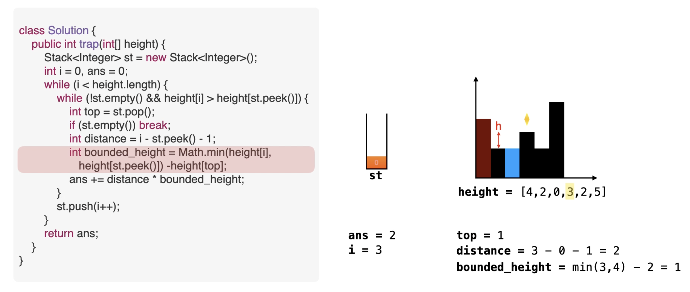

# 算法

## 基础算法


### 快速排序

```
void quick_sort(int[] nums,int l,int r){
	if(l>=r) return;
	int pow = nums[l];
	int i = l-1, j = r+1;
	while (i<j){
		while(nums[++i]<pow)
		while(nums[--j]>pow)
		if(i<j){
			swap(i,j)
		}
	}
	quick_sort(nums,l,i);
	quick_sort(nums,i+1,r);

}
```

### 归并排序

```
		static int[] tmp = new int[N];//临时数组
        static void mergeSort(int[] a,int l,int r) {
            if(l>=r) return;
            int mid = l + r>>1;
            mergeSort(a, l, mid);
            mergeSort(a, mid+1, r);
            int k=0;//临时数组tmp的下标计数
            int i=l,j=mid+1;
            while(i<=mid && j<=r) {
                if(a[i]<=a[j]) tmp[k++] = a[i++];
                else tmp[k++] = a[j++];
            }
            while(i<=mid) tmp[k++] = a[i++];
            while(j<=r) tmp[k++] = a[j++];

            for(i=l,j=0;i<=r && j<k;i++,j++) {
                a[i] = tmp[j];
            }
        }
```

### [215. 数组中的第K个最大元素](https://leetcode.cn/problems/kth-largest-element-in-an-array/)

- 方法1：快排思想

  k不变

  ```
  class Solution {
      int n;
      int[] nums;
      public int findKthLargest(int[] a, int k) {
          nums = a;
          n = a.length;
          return quick(0,n-1,n-k);
      }
  		
  		//下标是k
      int quick(int l,int r,int k){
          if(l==r) return nums[k];
          int i = l-1,j = r+1;
          int x = nums[l];
          while(i<j){
              while(nums[++i] < x);//必须加分号
              while(nums[--j] > x);
              if(i<j){
                  int t = nums[i];
                  nums[i] = nums[j];
                  nums[j] = t;
              }
          }
          
          if(k <= j) return quick(l,j,k);
          else return quick(j+1,r,k); 
      }
  }
  ```

- 方法2：堆排序

  nlogn

- 方法3：桶排序

  值域小，所有值存储

  https://leetcode.cn/problems/kth-largest-element-in-an-array/solutions/2907015/fan-ren-ti-jie-tong-ji-dao-xu-bian-li-by-yf9s/

  ```
  class Solution {
      public int findKthLargest(int[] nums, int k) {
          //base 为了防止负数时越界
          int base = 10000;
  
          int[] arr = new int[20001];
          //max 去表示数组中存在数据的最大坐标
          int max = -1;
          int ans = Integer.MIN_VALUE;
  
          for (int x : nums){
              arr[x+base]++;
              max = Math.max(max, x+base);
          }
  
          for (int i = max; i >= 0; i--) {
              if (arr[i] > 0){
                  if (arr[i] >= k){
                      ans = i-base;
                      break;
                  }
                  k -= arr[i];
              }
          }
          return ans;
      }
  }
  ```

  

### [15. 三数之和](https://leetcode.cn/problems/3sum/)


### 两个有序数组中位数*

[4. 寻找两个正序数组的中位数](https://leetcode.cn/problems/median-of-two-sorted-arrays/)

> 给定两个大小分别为 `m` 和 `n` 的正序（从小到大）数组 `nums1` 和 `nums2`。请你找出并返回这两个正序数组的 **中位数** 。
>
> 算法的时间复杂度应该为 `O(log (m+n))` 。
>
> hard

- 思路

  ```
          计算两个有序数组的中位数，转换成计算两个数组的第k小的数
  
          要干嘛：找中位数，其实就是找下标，第k小的数
  
          暴力思路：双指针，小的值就向后移动（一定不是答案）
  
          核心结论：两个升序数组找第k大的数，一定会有个数组的前k/2个会被丢弃，满足条件就二分丢弃
  
          二分思路：第k小的数，每次选取两个数组的k/2个元素，判A[k/2]和B[k/2]大小关系，小的那一批，就一定不是答案所以要去除  
          
          参考题解：https://leetcode.cn/problems/median-of-two-sorted-arrays/solutions/8999/xiang-xi-tong-su-de-si-lu-fen-xi-duo-jie-fa-by-w-2/
  
          注意点： 1.考虑某一个数组为空的情形
                  2.怎么表示一个数组(长度n)的两个中位数 left = (n+1)/2 right = (n+2)/2
                  3.递归的时候，传入左下标start，虽然要判断的是右下标（变量i,j），end表示数组的末尾下标值（常量）
                  4.递归的时候，固定nums1长度短
                  5.数组起点已经越界的判断：计算len，len==0?
                  6.递归出口：1.len =0 2.k=1表示找到
                  7.计算start1,start2此时的右端点时，要进行min(len,k/2)，保证右端点不越界
  
  ```

- 注释代码

```
class Solution {
    public double findMedianSortedArrays(int[] nums1, int[] nums2) {
        int n1 = nums1.length, n2 = nums2.length;
        int k1 = (n1+n2+1)/2;//左中位数
        int k2 = (n1+n2+2)/2;//右中位数
        

        int val1 = getKth(nums1,n1-1,0,nums2,n2-1,0,k1);
        int val2 = getKth(nums1,n1-1,0,nums2,n2-1,0,k2);

        return (val1+val2) * 0.5;
    } 

    // 计算两个有序数组的第k小的数
    // end1,end2表示两个数组的最后一个元素的下标
    // start1,start2表示两个数组下一轮开始的下标
    int getKth(int[] nums1,int end1,int start1,int[] nums2,int end2,int start2,int k){
        //计算当前start1开始距离nums1结尾的元素个数（用来判断是否有数组变成空了）
        int len1 = end1 - start1 + 1;
        int len2 = end2 - start2 + 1;
        //保证nums1短
        if (len1 > len2) return getKth(nums2,end2,start2,nums1,end1,start1,k);
        //此时数组起点已经越界了，答案一定在Nums2[start2]开始的第k个中
        if (len1==0) return nums2[start2+k-1];
        
        ///如果找最小的，就是直接返回
        if (k==1) return Math.min(nums1[start1],nums2[start2]);

        //计算两个尾节点，为了防止划分k/2时越界所以取min
        int i = start1 + Math.min(len1,k/2) - 1;
        int j = start2 + Math.min(len2,k/2) - 1;
        
        //小的被淘汰
        if (nums1[i] < nums2[j]){
            return getKth(nums1,end1,i+1,nums2,end2,start2,k-(i-start1+1));
        }else{
            return getKth(nums1,end1,start1,nums2,end2,j+1,k-(j-start2+1));
        }
    }
}
```

- 简便代码

  为了方便递归传参，直接在外面定义全局数组，和end

```
class Solution {
    int[] nums1,nums2;
    int end1,end2;

    public double findMedianSortedArrays(int[] a, int[] b) {
        nums1 = a;
        nums2 = b;
        
        int n1 = nums1.length;
        int n2 = nums2.length;

        end1 = n1-1;
        end2 = n2-1;
        int k1 = (n1+n2+1)/2;
        int k2 = (n1+n2+2)/2;

        return 0.5 * (getKth(0,0,k1) + getKth(0,0,k2));
    }

    int getKth(int start1,int start2,int k){
        int len1 = end1 - start1+1;
        int len2 = end2 - start2+1;
        if (len1==0) return nums2[start2+k-1];
        if (len2==0) return nums1[start1+k-1];
        if (k==1) return Math.min(nums1[start1],nums2[start2]);
        int i = start1 + Math.min(k/2,len1) - 1;
        int j = start2 + Math.min(k/2,len2) - 1;
        
        if (nums1[i] < nums2[j])
            return getKth(i+1,start2,k-(i-start1+1));
        else return getKth(start1,j+1,k-(j-start2+1));
        
    }
}
```


### [42. 接雨水](https://leetcode.cn/problems/trapping-rain-water/)

- 方法1：前后缀分解

  计算每个格子上方的水，计算前后缀数组

  ```
  class Solution {
      public int trap(int[] height) {
          int n = height.length;
          int ans = 0;
          int l = 0,r = n-1;
          int pre = 0,suf = 0;
          while(l<r){
              if(height[l] < height[r]){
                  pre = Math.max(pre,height[l]);
                  ans += pre - height[l];
                  l++;
              }else{
                  suf = Math.max(suf,height[r]);
                  ans += suf - height[r];
                  r--;
              }
          }
          
          return ans;
      }
  }
  ```

  

- 方法2：相向双指针

  其实不需要真的计算出两个数组，只需要维护前后缀最大值变量即可，

  因为，假设右指针指向了某个数，此时左指针指向的高度小，那么左指针位置的水已经确定了，因为右侧最大值只会变大，不会变小，所以这个位置的水已经确定。反之也是如此

  为在「谁小移动谁」的规则下，相遇的位置一定是最高的柱子，这个柱子是无法接水的。

  ```
  class Solution {
      public int trap(int[] height) {
          int n = height.length;
          int ans = 0;
          int l = 0,r = n-1;
          int pre = 0,suf = 0;
          while(l<r){
              if(height[l] < height[r]){
                  pre = Math.max(pre,height[l]);
                  ans += pre - height[l];
                  l++;
              }else{
                  suf = Math.max(suf,height[r]);
                  ans += suf - height[r];
                  r--;
              }
          }
          
          return ans;
      }
  }
  ```

  

- 方法3：单调栈

  上面的方法相当于「竖着」计算面积，单调栈的做法相当于「横着」计算面积。

  这个方法可以总结成 16 个字：找上一个更大元素，在找的过程中填坑。

  注意 while 中加了等号，这可以让栈中没有重复元素，从而在有很多重复元素的情况下，使用更少的空间。

  - 思路

    单独栈维护当前元素左边第一个比他大的数，所以递减，答案在不满足的时候出栈时更新答案，对于某个元素i的位置，此时栈中元素top比i小，那么就有水，需要出栈，出完栈后的下个元素记作left，需要根据left确定这一批水的高度，最后更新答案

  
  
  ```
  class Solution {
      public int trap(int[] height) {
          int n = height.length;
          int ans = 0;
          Stack<Integer> stk = new Stack<>();
          for(int i=0;i<n;i++){
              //单调栈维护最近做大值，内部单调减
              //贡献在所有不满足的左端点中更新
              while(stk.size()>0 && height[stk.peek()]<=height[i]){
              		//作为底平面的高度
                  int bottom = stk.pop();
                  if(stk.size()>0){
                      //左端点
                      int left = stk.peek();
                      int hei = Math.min(height[left],height[i])-height[bottom];
                      int width = i-left-1;
                      ans += hei * width;
                  }
              }
              stk.push(i);
          }
          
          return ans;
      }
  }
  ```
  
  

https://leetcode.cn/problems/trapping-rain-water/solutions/1974340/zuo-liao-nbian-huan-bu-hui-yi-ge-shi-pin-ukwm/


### [54. 螺旋矩阵](https://leetcode.cn/problems/spiral-matrix/)


## 位运算

### [136. 只出现一次的数字](https://leetcode.cn/problems/single-number/)

异或

### [137. 只出现一次的数字 II](https://leetcode.cn/problems/single-number-ii/)

> 一个数出现一次，其他数都出现三次

枚举所有位，每一位下的nums中，计算1的个数，然后取模3后，就是哪一个出现一次的数位，不是0就是1

```
func singleNumber(nums []int) int {
    //要用32位有符号整数，用int、int64报错
    var ans int32 = 0
    for i:=0;i<32;i++{
        var cnt int32 = 0
        for _,x := range nums{
            cnt += int32(x)>>i&1
        }
        cnt %= 3
        if cnt==1{
            ans |= 1<<i
        }
    }
    return int(ans)
}
```


### [260. 只出现一次的数字 III](https://leetcode.cn/problems/single-number-iii/)

> 2个数只出现一次，其他数都出现两次

所有数异或就是ans1^ans2，然后计算lowbit，根据lowbit将nums划分成两个子数组，每个数组包含一个数（因为相异得一，所以要求的两个数在这个位上一定不同，所以就可以根据这个划分）

```
func singleNumber(nums []int) []int {
    two := 0
    for _,x := range nums{
        two ^= x
    }
    lowbit := two & -two
    a := 0
    b := 0
    for _,x := range nums{
        if x & lowbit!=0{
            a ^= x
        }else{
            b ^= x
        }
    }
    return []int{a,b};
}
```


## DP


### 正则表达式匹配*

[10. 正则表达式匹配](https://leetcode.cn/problems/regular-expression-matching/)

> 给你一个字符串 `s` 和一个字符规律 `p`，请你来实现一个支持 `'.'` 和 `'*'` 的正则表达式匹配。
>
> - `'.'` 匹配任意单个字符
> - `'*'` 匹配零个或多个前面的那一个元素
>
> 所谓匹配，是要涵盖 **整个** 字符串 `s` 的，而不是部分字符串。
>
> hard

```
class Solution {
    /*
        动态规划 O(n*m)

        状态表示：dp[i][j]表示s[1~i]和p[1~j]两个子串是否匹配

        划分思路：考虑p[j]选什么

        状态计算：
                1.如果p[j]是字母
                    1.1 如果p[j]==s[i] : dp[i-1][j-1]
                    1.2 如果p[j]!=s[i] : false
                2.如果p[j]是. : dp[i-1][j-1]
                3.如果p[j]是* ,那么考虑p[j-1]怎么取值？
                    3.1如果s[i]!=p[j-1]：dp[i][j-2]
                    3.2如果s[i]==p[j-1],有两种情况，考虑*到底给不给s[i]用？
                        给，之前也会用很多次：dp[i-1][j]
                        不给，留着以后用：dp[i][j-2]
        
        错误点：
                在3.2的地方，s[i]==p[j-1]太过于粗糙，没有考虑.的情况
                会导致这种情况失效：s = "ab", p = ".*"
                解决方法：定义Match函数统一匹配
     */
    char[] s,p;
    public boolean isMatch(String ss, String pp) {
        int n = ss.length(),m = pp.length();
        //本题数组下标从1开始
        s = (" "+ss).toCharArray();
        p = (" "+pp).toCharArray();
        boolean[][] dp = new boolean[n+1][m+1];
        
        //空串满足匹配
        dp[0][0] = true;
        //s的空前缀匹配p的正则前缀，比如s=ab,p=b*ab,b*就要被抛弃，也就是s[0][2]=true
        for(int j=1;j<=m;j++){
            if (p[j]=='*')
                dp[0][j] = dp[0][j-2];
        }
        
        for(int i=1;i<=n;i++){
            for(int j=1;j<=m;j++){
                //如果s[i]和p[j]相等或者p[j]=.
                if(match(i,j))
                    dp[i][j] = dp[i-1][j-1];
                //如果s[i]和p[j]不相等并且p[j]!='*',那么正则匹配失效
                else if (p[j] != '*')
                    dp[i][j] = false;
                //如果p[j]='*'，
                else{
                    //判断p[j-1](*前面的字符)是否匹配
                    if(match(i,j-1))
                        dp[i][j] = dp[i-1][j] || dp[i][j-2];//如果匹配这个*表达式，分两种情况
                        // 用*匹配还是不用
                        // 情况1：用，前面可能还有，所以dp[i-1][j]
                        // 情况2：不用，留着以后用，dp[i][j-2]
                    // 不匹配，这个*就匹配0次
                    else dp[i][j] = dp[i][j-2];
                }
            }
        }
        return dp[n][m];
    }

    //判断s[i]与p[j]是否匹配
    boolean match(int i,int j){
        if (s[i]==p[j]) return true;
        if (p[j]=='.') return true;
        return false;
    }
}
```


### [53. 最大子数组和](https://leetcode.cn/problems/maximum-subarray)


### [5. 最长回文子串](https://leetcode.cn/problems/longest-palindromic-substring/)

- 方法1：中心枚举

  中心扩展，分为奇数长度，偶数长度，可以使用一个方法处理两种情况

  ```
  class Solution {
      int n;
      char[] s ;
      int ans_l,ans_r,ans;
      
      public String longestPalindrome(String ss) {
          n = ss.length();
          s = ss.toCharArray();
  
          for(int i=0;i<n;i++){
              match(i,i);
              if(i+1<n)
                  match(i,i+1);
          }
          return ss.substring(ans_l,ans_r+1);
      }
  
      void match(int l,int r){
          for(;l>=0 && r<n;l--,r++){
              if (s[l]!=s[r]) break;
          }
          if (r-l-1 > ans){
              ans = r-l-1;
              ans_l = l+1;
              ans_r = r-1;
          }
      }
  }
  ```

  

- 方法2：区间dp

  ```
  class Solution {
      int n;
      char[] s ;
      int ans_l,ans_r,ans;
  
      public String longestPalindrome(String ss) {
          n = ss.length();
          s = ss.toCharArray();
          boolean[][] dp = new boolean[n][n];
          for(int len=1;len<=n;len++){
              for(int i=0;i+len-1<n;i++){
                  int j = i+len-1;
                  if(len==1) dp[i][i] = true;
                  
                  else if(s[i]==s[j]) {
                      //边界处下标越界
                      if (j-i-1 < 2) dp[i][j] = true;
                      else dp[i][j] = dp[i+1][j-1];
                  }
                  if (dp[i][j] && len>ans){
                      ans = len;
                      ans_l = i;
                      ans_r = j;
                  }
              }
              
          }
          return ss.substring(ans_l,ans_r+1);
      }
  }
  ```

  

- 方法3：字符串哈希+二分

  枚举中间点，O(1)判断子串是否相等

  还没调出来

  ```
  class Solution {
      int n;
      char[] s ;
      int ans_l,ans_r,ans;
  
      //初始化字符串哈希
      long[] hash = new long[2020],pow = new long[2020];
      int P = 131;
      void init(){
          pow[0] = 1;
          hash[0] = 0;
  
          for(int i=1;i<=n;i++){
              hash[i] = hash[i-1] * P + s[i-1];
              pow[i] = pow[i-1] * P;
          }
      }
  
      long get(int l,int r){
          l++;r++;
          // System.out.println(l+" "+r+" "+(hash[r] - hash[l-1]*pow[r-l+1]));
          return hash[r] - hash[l-1]*pow[r-l+1];
      }
  
      public String longestPalindrome(String ss) {
          n = ss.length();
          s = ss.toCharArray();
          init();
          
          for(int i=0;i<n;i++){
              match(i,i);
              if(i+1<n && s[i]==s[i+1])
                  match(i,i+1);
          }
          return ss.substring(ans_l,ans_r+1);
      }
  
      //从start1和start2向左向右扩展
      void match(int start1,int start2){
          int sz = 0;
          if(start1==start2){
              start1 -= 1;
              start2 += 1;
              sz = 1;
              if(start1>=0 && start2<n && s[start1]==s[start2]) sz += 2;
              
          }else sz = 2;
  
          int l = 0,r = Math.min(start1,n-start2-1);
          while(l<r){
              int mid = l+r+1>>1;
              if(get(start1-mid,start1)==get(start2,start2+mid)) l = mid;
              else r = mid-1;
          }
          
          int end_l = start1-l,end_r = start2+l;
          // System.out.println(start1+" "+start2+" "+l);
          if (end_l<0 || end_r>=n || s[end_l]!=s[end_r]) l -= 1;
          // System.out.println(s[end_l]+" "+s[end_l]);
          // System.out.println("__:"+l);
          
          sz += Math.max(2*l,0);
          System.out.println(start1+" "+start2+" "+l+" "+sz);
          if (sz > ans){
              ans = sz;
              ans_l = start1-l;
              ans_r = start2+l;
          }
      }
      
  }
  ```

  

- 方法4：马拉车算法*O*(*n*)

  

- 方法5：有哥们用的双指针+字符串哈希：https://leetcode.cn/problems/longest-palindromic-substring/solutions/1318112/bu-xu-yao-ma-la-che-ha-xi-biao-onji-bai-j83bf/

https://leetcode.cn/problems/longest-palindromic-substring/solutions/1593072/-by-coco-e1-qjns/


### [72. 编辑距离](https://leetcode.cn/problems/edit-distance)


### 两个子数组的最大和

> 求助：不重叠的两个数组的最大和，要求遍历一次数组，时间复杂度On，空间复杂度O1，不能用前缀和。
> 例如：[1,2,-3,4,5],最大的两个数组和就是[1,2]+[4,5]=12,[1,1,-4,4,1,-2,3,-9,4,5]就是[4,1,-2,3]和[4,5]。
> 题不难，但是不知道怎么用动态规划，是快手的二面coding，想了15分钟都没有头绪，求求各位大佬解答一下!!!谢谢！！！
> 讨论链接：https://leetcode.cn/circle/discuss/SYDEGK/
>
> 题目来源：[http://poj.org/problem?id=2479](https://leetcode.cn/link/?target=http://poj.org/problem?id=2479)

- 思路1：正面解决

  分析思路：考虑第i个元素怎么放，1.单独成队（元素i单独成为第二个数组）2.和前缀一起（元素i划分到前面的前缀中）

  假设dp[i]表示要求的以i结尾的两个子数组最大值，其实第二种情况（和前缀一起），就是dp[i-1]了；而单独成队这种情况，就是求1~i的最大子数组（经典问题），所以还需要一个数组保存以i为结尾的最大值

  状态表示：dp0[i]维护以i结尾的一个子数组的最大值，dp1[i]维护1~i中的一个子数组的最大值，dp2[i]表示从前i个中挑选两个子数组并且第二个子数组以i结尾的最大和（题目要求的）

  ```
  int ans = -0x3f3f3f3f;
  for (int i = 1; i <= n; ++i) {
      read(a[i]);
      dp0[i] = max(dp0[i - 1] + a[i], a[i]);
      dp1[i] = max(dp1[i - 1], dp0[i]);
      dp2[i] = max(dp1[i - 1] + a[i], dp2[i - 1] + a[i]); //nums[i]单独成队 或者 和前缀一起
      ans = max(ans, dp2[i]);
  }
  ```

- 思路2：子数组次大和

  求连续子数组最大值的时候更新次大值。不是求所有情况的最大值，而是考虑负贡献时更新次大值

  在负贡献的时候更新，因为负贡献的时候已经跳出局部最优的情况，所以间接保证了子数组都没有交集，看着好像确实可以

  ```
  public int getMax(int[] nums) {
      int max1 = Integer.MIN_VALUE, max2 = Integer.MIN_VALUE, sum = 0, max = Integer.MIN_VALUE;
      for (int i = 0; i < nums.length; i++) {
          sum += nums[i];
          max = Math.max(max, sum);
          if (sum <= 0) { // sum小等于0说明前面这一段已经结束了, 更新前两个最大值
              if (max > max2) {
                  max1 = max2;
                  max2 = max;
              } else if (max > max1) {
                  max1 = max;
              }
              sum = 0;
              max = Integer.MIN_VALUE;
          }
      }
      // 更新最后一段
      if (max > max2) {
          max1 = max2;
          max2 = max;
      } else if (max > max1) {
          max1 = max;
      }
      return (max1 == Integer.MIN_VALUE ? 0 : max1) + (max2 == Integer.MIN_VALUE ? 0 : max2);
  }
  
  作者：Leon
  链接：https://leetcode.cn/circle/discuss/SYDEGK/view/aCbd9q/
  来源：力扣（LeetCode）
  著作权归作者所有。商业转载请联系作者获得授权，非商业转载请注明出处。
  ```

  

- 思路3：前后缀分解

  求前缀最大、后缀最大，再求和

  ```
  from typing import List
  from math import inf
  
  
  def maxSumTwoNoOverlap(nums: List[int]) -> int:
      n = len(nums)
  
      # dp[i]: 以 nums[i] 结尾的子数组最大和
      dp1 = [-inf] * n
      dp1[0] = nums[0]
      for i in range(1, n):
          if dp1[i - 1] > 0:
              dp1[i] = dp1[i - 1] + nums[i]
          else:
              dp1[i] = nums[i]
  
      # dp2[i]: 以 nums[i] 开始的子数组最大和
      dp2 = [-inf] * n
      dp2[n - 1] = nums[n - 1]
      for i in range(n - 2, -1, -1):
          if dp2[i + 1] > 0:
              dp2[i] = dp2[i + 1] + nums[i]
          else:
              dp2[i] = nums[i]
  
      # preMax[i]: dp1 前缀最大值
      preMax = [-inf] * n
      preMax[0] = dp1[0]
      for i in range(1, n):
          preMax[i] = max(preMax[i - 1], dp1[i])
  
      # sufMax[i]: dp2 后缀最大值
      sufMax = [-inf] * n
      sufMax[n - 1] = dp2[n - 1]
      for i in range(n - 2, -1, -1):
          sufMax[i] = max(sufMax[i + 1], dp2[i])
  
      res = -inf
      for i in range(n - 1):
          res = max(res, preMax[i] + sufMax[i + 1])
  
      return res
  
  
  nums1 = [1, 2, -3, 4, 5]
  nums2 = [1, 1, -4, 4, 1, -2, 3, -9, 4, 5]
  nums3 = [1, -1, 2, 2, 3, -3, 4, -4, 5, -5]
  
  print(maxSumTwoNoOverlap(nums1))    # 12
  print(maxSumTwoNoOverlap(nums2))    # 15
  print(maxSumTwoNoOverlap(nums3))    # 13
  
  
  
  作者：我爱志方小姐
  链接：https://leetcode.cn/circle/discuss/SYDEGK/view/AmmUTw/
  来源：力扣（LeetCode）
  著作权归作者所有。商业转载请联系作者获得授权，非商业转载请注明出处。
  ```


### 最长上升子序列

#### 二分+贪心

```
				//dp[i]长度是i的LIS的末尾最小值,dp[i]是单增的
        //变量len维护最大长度
        //当a[i]可以放到长度是len的后面，那么更新len和dp
        //否则，就找到离他最近比他小的元素，然后更新dp[pos+1]的最小值
```


### [119. 杨辉三角 II](https://leetcode.cn/problems/pascals-triangle-ii/)

> 给定一个非负索引 `rowIndex`，返回「杨辉三角」的第 `rowIndex` 行。

最长上升子序列动态规划

- 方法1

  时间O（n^2），空间O（n^2）

  ```
  func getRow(rowIndex int) []int {
      dp := make([][]int,rowIndex+1)
      for i := 0;i<=rowIndex;i++{
          dp[i] = make([]int,i+1)
          dp[i][0] = 1
          dp[i][i] = 1
          for j:=1;j<i;j++{
              dp[i][j] = dp[i-1][j-1] + dp[i-1][j]
          }
  
      }
      return dp[rowIndex]
  }
  ```

- 方法2

  将方法1进行状态压缩，倒序遍历

  时间O（n^2）空间O（n）

  ```
  func getRow(rowIndex int) []int {
      dp := make([]int,rowIndex+1)
      dp[0] = 1
      for i := 1;i<=rowIndex;i++{
          for j:=i;j>0;j--{
              dp[j] = dp[j-1] + dp[j]
          }
      }
      return dp
  }
  ```

- 方法3

  数学方法，一维递推关系C(n,m) = C(n,m-1) * (n-m+1)/m

  第i层是1,C(i,1),C(i,2)

  ```
  func getRow(rowIndex int) []int {
      dp := make([]int,rowIndex+1)
      dp[0] = 1
      for i := 1;i <= rowIndex;i++{
          dp[i] = dp[i-1] * (rowIndex - i + 1)/i
      }
      return dp
  }
  ```

  


# 数据结构

## 链表

### 反转链表

递归、迭代


### 链表中点


### 有限制反转链表


### 二叉树反转链表


### 链表相交节点

[面试题 02.07. 链表相交](https://leetcode.cn/problems/intersection-of-two-linked-lists-lcci/)


### [25. K 个一组翻转链表](https://leetcode.cn/problems/reverse-nodes-in-k-group/)

> hard


### [19. 删除链表的倒数第N个节点](https://leetcode.cn/problems/remove-nth-node-from-end-of-list)


### [124. 二叉树中的最大路径和](https://leetcode.cn/problems/binary-tree-maximum-path-sum)


### [315. 计算右侧小于当前元素的个数](https://leetcode.cn/problems/count-of-smaller-numbers-after-self/)


### 

# 架构设计

### 设计阻塞队列

ReentrantLock、阻塞（可以直接用ArrayBlockingQueue）

```
package algobi;

import java.util.LinkedList;
import java.util.Queue;
import java.util.concurrent.locks.Condition;
import java.util.concurrent.locks.ReentrantLock;

/*
    2024/7/31 23:48
    @author ZW
    Project Name:aJavaOJ
     
*/
public class MyBlockingQueue {

    Queue<Integer> q =  new LinkedList<>();
    int capacity;
    ReentrantLock lock = new ReentrantLock();
    Condition notFull = lock.newCondition();
    Condition notEmpty = lock.newCondition();
    
    public MyBlockingQueue(int capacity) {
        this.capacity = capacity;
    }
    
    void put(int val) throws InterruptedException {
        try {
            lock.lockInterruptibly();
            while(size()==capacity)
                notFull.await();
            q.add(val);
            notEmpty.signalAll();
    
        }finally {
            lock.unlock();
        }
    }
    
    int take() throws InterruptedException{
        try {
            lock.lockInterruptibly();
            while (size()==0)
                notEmpty.await();
            int res = q.poll();
            notFull.signalAll();
            return res;
        }finally {
            lock.unlock();
        }
    }
    
    int size() {
        return q.size();
    }
}

```


### [146. LRU缓存机制](https://leetcode.cn/problems/lru-cache)

> 

- 方法1：LinkedHashMap

  - 链表头结点最久，尾节点最新
  - mp.keySet().iterator().next();获取最旧元素的key
  - mp.put的API就是放到链表结尾

  ```
  class LRUCache {
      LinkedHashMap<Integer,Integer> mp = new LinkedHashMap<>();
      int capacity;
      public LRUCache(int capacity) {
          this.capacity = capacity;
      }
      
      public int get(int key) {
          Integer val = mp.remove(key);
          if(val!=null){
              mp.put(key,val);
              return val;
          }
          return -1;
      }
      
      public void put(int key, int value) {
          Integer val = mp.remove(key);
          if(val != null){
              mp.put(key,val);
              return ;
          }else if(this.capacity == mp.size()){
              Integer old = mp.keySet().iterator().next();
              mp.remove(old);    
          }
          mp.put(key,value);
      }
  }
  ```

- 方法2：底层

  ```
  class LRUCache {
      int capacity;
      Node head = new Node(-1,-1);
      HashMap<Integer,Node> mp = new HashMap<>();
      //尾节点存最新节点，头结点存最久
  
      public LRUCache(int capacity) {
          head.next = head;
          head.prev = head;
          this.capacity = capacity;
      }
      
      public int get(int key) {
          //1.存在，删除旧元素，更新到最后
          //2.无此元素，返回-1
          Node node = getNode(key);
          return node!=null?node.value:-1;
      }
      
      public void put(int key, int value) {
          //1.存在，删除旧值，更新到最后
          //2.不存在，先判断是否sz==cap，有就删除一个，然后再加入最后
          Node node = getNode(key);
          if(node != null) {
              node.value = value;
          }else{
              if(this.capacity==mp.size()){
                  //头结点最久
                  Node old = head.next;
                  mp.remove(old.key);
                  remove(old); 
              }
              node = new Node(key,value);
              pushBack(node);
              mp.put(key,node);
          }
              
      }
  
      //获取节点值，并更新节点到最后
      Node getNode(int key){
          if(!mp.containsKey(key)) return null;
          Node node = mp.get(key);
          remove(node);
          pushBack(node);
          return node;
      }
  
      //删除双向链表一个节点
      void remove(Node node){
          node.prev.next = node.next;
          node.next.prev = node.prev;
      }
  
      //在双向链表尾部添加节点（尾部就是head的prev）
      //尾结点最新
      void pushBack(Node node){
          node.next = head;
          node.prev = head.prev;
          head.prev.next = node;
          head.prev = node;
      }
  }
  class Node{
      int key;
      int value;
      Node next,prev;
      Node(int k,int v){
          key = k;
          value = v;
      }
  }
  ```

  


