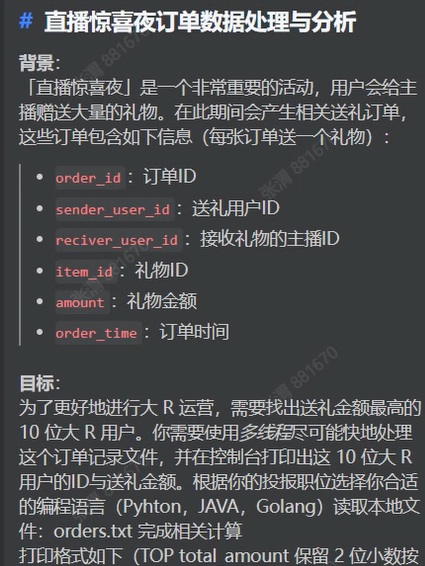

# 算法笔试


## 美团2024.6.26

美团笔试

选择题*20


编程题

### Q1：乍一看数位dp

求[l,r]中满足条件的数的个数，条件1：num是完全平方数 条件2：num的所有奇数数位比相邻的数位>=
	n = 1e10
	方法：枚举平方数的因子，只有1e5个，再判断

### Q2：求给出的复数中有多少实数

模拟题，判断有没有i，判断i前的系数是不是0

### Q3：删除后前缀和打乱

对于数组a，1. 删除其中一个数x后，再做前缀和，再打乱得到数组b；删除其中另一个数（！=x）后，再做前缀和，再打乱得到数组c

输入：数组b和数组c，输出：反求数组a

方法：贪心（前缀和数组是有序的），再反着恢复原数组b、c，最后遍历b和c，因为b中只有一个数c中没有，因为c中只有一个数b中没有但是代码只能过50%，代码如下

```
import java.util.*;

// 注意类名必须为 Main, 不要有任何 package xxx 信息
public class Main {
    static int N = 101000;
    static long[] b = new long[N],c = new long[N];
    public static void main(String[] args) {
        Scanner sc = new Scanner(System.in);
        int n = sc.nextInt();
        for(int i=0;i<n-1;i++){
            b[i] = sc.nextLong();
        }
        for(int i=0;i<n-1;i++){
            c[i] = sc.nextLong();
        }
        
        Arrays.sort(b,0,n-1);
        Arrays.sort(c,0,n-1);
        // for(int i=0;i<n-1;i++)
        //     System.out.println(b[i]+" ");
        for(int i=n-2;i>=1;i--){
            b[i] -= b[i-1];
            c[i] -= c[i-1];
        }
        for(int i=0;i<n-1;i++){
        //    System.out.println(b[i]+" "+c[i]);
            if (b[i]==c[i]) System.out.print(b[i]+" ");
            else{
                System.out.print(Math.min(b[i],c[i])+" ");
                System.out.print(Math.max(b[i],c[i])+" ");
                if(b[i]<c[i]){
                    for(int j=i+1;j<n-1;j++) System.out.print(c[j]+" ");
                }else 
                    for(int j=i+1;j<n-1;j++) System.out.print(b[j]+" ");
                break;
            }
        }
    }
}
```


## 网易2024.6.30

2024年6月30日 16:19:14机试

AC Q2、Q3，Q1拿30%

### Q1：阴阳师对战

> 小易正在参加阴阳师的斗技。已知斗技的规则是，双方各上5名式神，谁先击败对方所有角色谁就获胜了。
> 本题为了简化，可以假设每个式神均为单体攻击，每回合玩家将出动自己的一号式神，攻击对方的一号式神，当一号式神血量降到0或0以下时，则式神死亡二号变成一号。
> 当一方发动攻击时，受到攻击的式神的血量将减去攻击方的攻击力。
> 双方轮流攻击，小易先手攻击，现在小易想知道，最终谁将获得游戏胜利，胜利的一方还剩多少个存活的式神?


WA了

```
import java.util.Scanner;

// 注意类名必须为 Main, 不要有任何 package xxx 信息
public class Main {
    static int N = 10;
    static int[] a = new int[N],b = new int[N],c = new int[N],d = new int[N];
    public static void main(String[] args) {
        Scanner sc = new Scanner(System.in);
        for(int i=1;i<=5;i++) a[i] = sc.nextInt();
        for(int i=1;i<=5;i++) b[i] = sc.nextInt();
        for(int i=1;i<=5;i++) c[i] = sc.nextInt();
        for(int i=1;i<=5;i++) d[i] = sc.nextInt();
        int idx1=1,idx2=1;
        //特例：最后一次我把对方打死了，对方就打不出来了
        //这次我把对面打死了，下次就是对方先开始攻击
        int flag = 0;//flag=1表示对方先
        while(idx1<=5 && idx2<=5){
            //val2是对方第几次死
            int val2 = (int)Math.ceil((float)d[idx2]/a[idx1]);
            int val1 = (int)Math.ceil((float)b[idx2]/c[idx1]);
            //谁小，谁就先死
            if(val1<val2){
                d[idx2] -=  val1* a[idx1];
                idx1++;
                flag = 0;
            }else if(val2<val1){
                b[idx1] -= val2 * c[idx2];
                idx2++;
                flag = 1;
            }else{
                if(flag==0){//我先打，他死，我扣血
                    b[idx1] -= val1 * c[idx2];
                    idx2++;
                    flag = 1;
                }   
                else {
                    d[idx2] -= val1 * a[idx1];
                    idx1++;
                    flag = 0;
                }
                    
            }
        }
        // System.out.println(idx1+" "+idx2);
        if(idx1>5){
            System.out.println("lose");
            System.out.println(5-idx2+1);
        }else{
            System.out.println("win");
            System.out.println(5-idx1+1);
        }
    }
}
```

### Q2：小易的建筑建造

> 小易正在《明日之后》中建造自己的庄园。已知建筑材料共有石灰、砂岩、花岗岩这三种，现在给定了每个建筑这三种材料的消耗，以及该建筑可以带来的收益值。小易初始有A单位石灰，B单位砂岩，C单位花岗岩。他想知道，自己获得的收益最大值为多少?
> 每个建筑只能最多建一个


01背包、滚动数组空间优化(不用滚动数组会超内存)

```
import java.util.Scanner;

// 注意类名必须为 Main, 不要有任何 package xxx 信息
public class Main {
    static int N = 440,M = 60;
    static long[][][] dp = new long[M][M][M];
    static int[] a = new int[N],b = new int[N],c = new int[N],v = new int[N];
    public static void main(String[] args) {
        Scanner sc = new Scanner(System.in);
        int n = sc.nextInt();
        int A = sc.nextInt();
        int B = sc.nextInt();
        int C = sc.nextInt();

        for(int i=1;i<=n;i++){
            a[i] = sc.nextInt();
            b[i] = sc.nextInt();
            c[i] = sc.nextInt();
            v[i] = sc.nextInt();
        }

        for(int i=1;i<=n;i++){
            for(int j=A;j>=a[i];j--){
                for(int k=B;k>=b[i];k--){
                    for(int l=C;l>=c[i];l--){
                        dp[j][k][l] = Math.max(dp[j][k][l],dp[j-a[i]][k-b[i]][l-c[i]]+v[i]);
                    }
                }
            }
        }
        System.out.println(dp[A][B][C]);
    }
}

```

### Q3：切比雪夫距离


二维差分前缀和，y>=-500，细节：坐标偏移500*2，而不是500，因为差分时（0,-500）这个位置的最大范围是（0,-1000）

```
import java.util.Scanner;

// 注意类名必须为 Main, 不要有任何 package xxx 信息
public class Main {
    static int N = 2010,p = 1002;

    static int[][] g = new int[N][N];
    public static void main(String[] args) {
        Scanner sc = new Scanner(System.in);
        int n = sc.nextInt();
        for(int i=1;i<=n;i++){
            int x = sc.nextInt()+p;
            int y = sc.nextInt()+p;
            int r = sc.nextInt();
            int x1 = x-r;
            int y1 = y-r;
            int x2 = x+r;
            int y2 = y+r;
            g[x1][y1]+=1;
            g[x1][y2+1]-=1;
            g[x2+1][y1]-=1;
            g[x2+1][y2+1]+=1;
        }
        for(int i=1;i<N;i++)
            for(int j=1;j<N;j++){
                g[i][j] += g[i-1][j] + g[i][j-1] - g[i-1][j-1];
                // System.out.println((i-p) +" " + (j-p) +" "+ g[i][j]);
            }
                
        int q = sc.nextInt();
        while(q-->0){
            int a = sc.nextInt()+p;
            int b = sc.nextInt()+p;
            System.out.println(g[a][b]);
        }
    }
}

```

## 好未来笔试

- 括号序列
- 枚举

## 陌陌

### 找到有缘分的用户


文件读取+最短编辑距离dp+日期处理

没写完，有bug

```
# 可以引⼊的库和版本相关请参考 “环境说明”
import datetime
from typing import *
import numpy

inf = 0x3f3f3f3f

def solution(arg1: str) -> str:
    tmp = arg1.split(",")
    tg_name,tg_gender,tg_date = tmp[0],tmp[1],tmp[2]
    names = []
    genders = []
    dates = []
    # 读入数据
    with open("./final_user_list.txt", "r")as f:
        lines = f.readlines()
        print(lines[0])
        for line in lines:
            tmp = line.split(",")
            names.append(tmp[0])
            genders.append(tmp[1])
            dates.append(tmp[2])
    # print(name[0], gender[0])
    def datediff(day1,day2):
        tmp = day1.split('-')
        a = datetime.datetime(int(tmp[0]),int(tmp[1]),int(tmp[2]))
        tmp = day2.split('-')
        b = datetime.datetime(int(tmp[0]),int(tmp[1]),int(tmp[2]))
        return (a-b).days

    # def namediff(a,b):
        
    mx_datedis,mx_namedis,mxname = inf,inf,''
    ansidx = 0
    # 遍历每组数据，
    n = len(names)
    idx = 0
    for name,gender,date in zip(names,genders,dates):
        if gender != tg_gender:
            continue
        # 生日最接近
        date_dist = datediff(tg_date, date)
        # 计算姓名最短编辑距离
        # name_dist = namediff(tg_name,name)
        name_dist = -1

        if date_dist < mx_datedis or (date_dist == mx_datedis and name_dist < mx_namedis) or (date_dist == mx_datedis and name_dist == mx_namedis and (mx_namedis=="" or name < mxname)) :
            mx_datedis = date_dist
            mx_namedis = name_dist
            mx_namedis = name
            ansidx = idx
        idx += 1
    tmp = [names[ansidx],genders[ansidx],dates[ansidx]]
    return ','.join(tmp)

```


### 直播惊喜数据处理




没做

