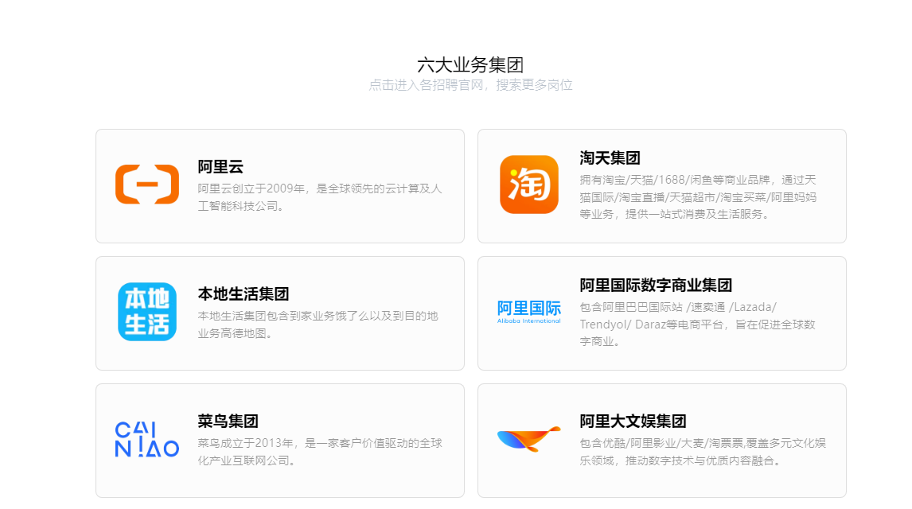
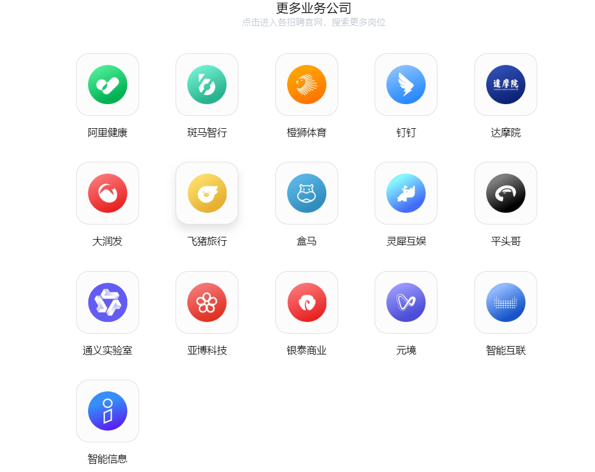
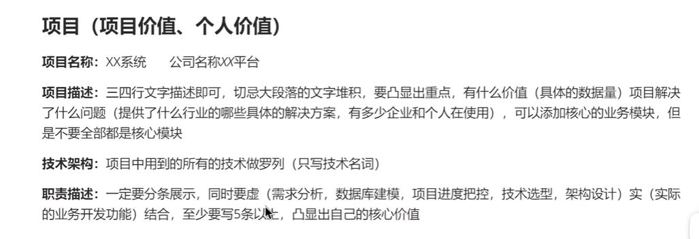
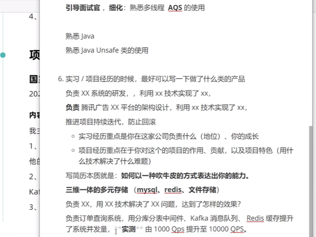

---
{}
---
- 实习25届实习秋招岗位汇总平台： [https://flowus.cn/share/f0802354-3ea7-44c1-a243-fc53c651b7a3](https://flowus.cn/share/f0802354-3ea7-44c1-a243-fc53c651b7a3 "https://flowus.cn/share/f0802354-3ea7-44c1-a243-fc53c651b7a3")

    老鱼简历实习招聘咨询：[https://www.laoyujianli.com/hc](https://www.laoyujianli.com/hc "https://www.laoyujianli.com/hc")

    国央企实习汇总.pdf公司名单：[https://www.nowcoder.com/discuss/499582997692166144](https://www.nowcoder.com/discuss/499582997692166144 "https://www.nowcoder.com/discuss/499582997692166144")

- 秋招
    - 25届SP专场：[https://www.nowcoder.com/jobs/activity/v2/special-activity/index/2025SPzc?channel=qzsy](https://www.nowcoder.com/jobs/activity/v2/special-activity/index/2025SPzc?channel=qzsy "https://www.nowcoder.com/jobs/activity/v2/special-activity/index/2025SPzc?channel=qzsy")
    - 25届硕博专场：[https://www.nowcoder.com/jobs/activity/v2/special-activity/index/sbzc?pageSource=5011](https://www.nowcoder.com/jobs/activity/v2/special-activity/index/sbzc?pageSource=5011 "https://www.nowcoder.com/jobs/activity/v2/special-activity/index/sbzc?pageSource=5011")
    
- 八股

    小林coding：[https://www.xiaolincoding.com](https://www.xiaolincoding.com "https://www.xiaolincoding.com")

    影子笔记：[https://ik3te1knhq.feishu.cn/wiki/CtXBwQ0qHioWP4k5WqNcdm5tn3d](https://ik3te1knhq.feishu.cn/wiki/CtXBwQ0qHioWP4k5WqNcdm5tn3d "https://ik3te1knhq.feishu.cn/wiki/CtXBwQ0qHioWP4k5WqNcdm5tn3d")

    图灵课堂八股：[https://www.yuque.com/tulingzhouyu/db22bv/iv84gg8i0qassv7l](https://www.yuque.com/tulingzhouyu/db22bv/iv84gg8i0qassv7l "https://www.yuque.com/tulingzhouyu/db22bv/iv84gg8i0qassv7l")

    Javaguide：[https://javaguide.cn/database/mysql/mysql-questions-01.html](https://javaguide.cn/database/mysql/mysql-questions-01.html "https://javaguide.cn/database/mysql/mysql-questions-01.html")

    牛客八股：[https://www.nowcoder.com/issue/tutorialtutorialId=94&uuid=36e2c89b4b4641f8b3c566758fdc879d](https://www.nowcoder.com/issue/tutorial?tutorialId=94&uuid=36e2c89b4b4641f8b3c566758fdc879d "https://www.nowcoder.com/issue/tutorial?tutorialId=94&uuid=36e2c89b4b4641f8b3c566758fdc879d")

    > 视频[https://www.bilibili.com/video/BV1ihVteYEEr/?spm\_id\_from=333.1007.tianma.1-1-1.click&vd\_source=9df13446957cfa1b1efd5650c5e3a393](https://www.bilibili.com/video/BV1ihVteYEEr/?spm_id_from=333.1007.tianma.1-1-1.click&vd_source=9df13446957cfa1b1efd5650c5e3a393 "https://www.bilibili.com/video/BV1ihVteYEEr/?spm_id_from=333.1007.tianma.1-1-1.click&vd_source=9df13446957cfa1b1efd5650c5e3a393")

    牛客八股刷题：[https://www.nowcoder.com/exam/intelligent?questionJobId=10&tagId=21001](https://www.nowcoder.com/exam/intelligent?questionJobId=10&tagId=21001 "https://www.nowcoder.com/exam/intelligent?questionJobId=10&tagId=21001")

- 算法

    代码随想录：[https://programmercarl.com](https://programmercarl.com "https://programmercarl.com")

    codetop：[https://codetop.cc/home（能够看到公司的lc题、每个lc题出现的频率）](https://codetop.cc/home%EF%BC%88%E8%83%BD%E5%A4%9F%E7%9C%8B%E5%88%B0%E5%85%AC%E5%8F%B8%E7%9A%84lc%E9%A2%98%E3%80%81%E6%AF%8F%E4%B8%AAlc%E9%A2%98%E5%87%BA%E7%8E%B0%E7%9A%84%E9%A2%91%E7%8E%87%EF%BC%89 "https://codetop.cc/home（能够看到公司的lc题、每个lc题出现的频率）")

- 设计模式

    kamacoder：[https://www.kamacoder.com/designpattern.php（在线编程）](https://www.kamacoder.com/designpattern.php%EF%BC%88%E5%9C%A8%E7%BA%BF%E7%BC%96%E7%A8%8B%EF%BC%89 "https://www.kamacoder.com/designpattern.php（在线编程）")

    笔记：[https://ik3te1knhq.feishu.cn/wiki/ITIPwBMAWi5PsXkp0c1cwJMrn2b](https://ik3te1knhq.feishu.cn/wiki/ITIPwBMAWi5PsXkp0c1cwJMrn2b "https://ik3te1knhq.feishu.cn/wiki/ITIPwBMAWi5PsXkp0c1cwJMrn2b")

- SQL面试题：[https://ik3te1knhq.feishu.cn/wiki/WuNQwtRsxiRXUukZGCBcVPaEn6c](https://ik3te1knhq.feishu.cn/wiki/WuNQwtRsxiRXUukZGCBcVPaEn6c "https://ik3te1knhq.feishu.cn/wiki/WuNQwtRsxiRXUukZGCBcVPaEn6c")

- 网络[https://ik3te1knhq.feishu.cn/wiki/DpPhwpksVivEwmkXn3GcfzvmnVe](https://ik3te1knhq.feishu.cn/wiki/DpPhwpksVivEwmkXn3GcfzvmnVe "https://ik3te1knhq.feishu.cn/wiki/DpPhwpksVivEwmkXn3GcfzvmnVe")

- linux命令[https://ik3te1knhq.feishu.cn/wiki/UppDwInDriKkvGka0aQc00D1nce](https://ik3te1knhq.feishu.cn/wiki/UppDwInDriKkvGka0aQc00D1nce "https://ik3te1knhq.feishu.cn/wiki/UppDwInDriKkvGka0aQc00D1nce")

- 项目鱼皮知识星球300
    - 手写RPC
    - OJ

互联网大厂后端**简历建议**：[https://www.nowcoder.com/discuss/645290253971939328](https://www.nowcoder.com/discuss/645290253971939328 "https://www.nowcoder.com/discuss/645290253971939328")

项目包装：[https://www.bilibili.com/video/BV1pA4m1N7UF/?share\_source=copy\_web&vd\_source=4d050090b394b684b27865dbb93eb184](https://www.bilibili.com/video/BV1pA4m1N7UF/?share_source=copy_web&vd_source=4d050090b394b684b27865dbb93eb184 "https://www.bilibili.com/video/BV1pA4m1N7UF/?share_source=copy_web&vd_source=4d050090b394b684b27865dbb93eb184")

手写项目亮点！分布式事务如何落地：[https://www.bilibili.com/video/BV1bd4y1A7ad/?share\_source=copy\_web&vd\_source=4d050090b394b684b27865dbb93eb184](https://www.bilibili.com/video/BV1bd4y1A7ad/?share_source=copy_web&vd_source=4d050090b394b684b27865dbb93eb184 "https://www.bilibili.com/video/BV1bd4y1A7ad/?share_source=copy_web&vd_source=4d050090b394b684b27865dbb93eb184")

**八股网站**

- **小林coding**：[图解系统介绍 | 小林coding (xiaolincoding.com)](https://gw-c.nowcoder.com/api/sparta/jump/link?link=https%3A%2F%2Fxiaolincoding.com%2Fos%2F "图解系统介绍 | 小林coding (xiaolincoding.com)")
- **阿秀笔记**：[目录 | 阿秀的学习笔记 (interviewguide.cn)](https://gw-c.nowcoder.com/api/sparta/jump/link?link=https%3A%2F%2Finterviewguide.cn%2Fnotes%2F01-guide%2Fweb-guide-reading.html "目录 | 阿秀的学习笔记 (interviewguide.cn)")
- **javaguide**：[计算机网络核心知识点 | 二哥的Java进阶之路 (javabetter.cn)](https://gw-c.nowcoder.com/api/sparta/jump/link?link=https%3A%2F%2Fjavabetter.cn%2Fcs%2Fwangluo.html "计算机网络核心知识点 | 二哥的Java进阶之路 (javabetter.cn)")
- **大厂面试题整理**：[InterviewGuide大厂面试真题](https://gw-c.nowcoder.com/api/sparta/jump/link?link=https%3A%2F%2Ftop.interviewguide.cn%2F "InterviewGuide大厂面试真题")

**Golang学习路线推荐**

- **快速入门**：[Go by Example 中文版 (gobyexample-cn.github.io)](https://gw-c.nowcoder.com/api/sparta/jump/link?link=https%3A%2F%2Fgobyexample-cn.github.io%2F "Go by Example 中文版 (gobyexample-cn.github.io)")
- [Go 程序员面试笔试宝典 | Go 程序员面试笔试宝典 (golang.design)](https://gw-c.nowcoder.com/api/sparta/jump/link?link=https%3A%2F%2Fgolang.design%2Fgo-questions%2F "Go 程序员面试笔试宝典 | Go 程序员面试笔试宝典 (golang.design)")
- [Go 语言设计与实现 | Go 语言设计与实现 (draveness.me)](https://gw-c.nowcoder.com/api/sparta/jump/link?link=https%3A%2F%2Fdraveness.me%2Fgolang%2F "Go 语言设计与实现 | Go 语言设计与实现 (draveness.me)")
- [设计模式：Easy 搞定 Golang设计模式 (yuque.com)](https://gw-c.nowcoder.com/api/sparta/jump/link?link=https%3A%2F%2Fwww.yuque.com%2Faceld%2Flfhu8y "设计模式：Easy 搞定 Golang设计模式 (yuque.com)")
- [源码剖析：小徐先生1212的个人空间-小徐先生1212个人主页-哔哩哔哩视频 (bilibili.com)](https://gw-c.nowcoder.com/api/sparta/jump/link?link=https%3A%2F%2Fspace.bilibili.com%2F317473362%3Fspm_id_from%3D333.337.0.0 "源码剖析：小徐先生1212的个人空间-小徐先生1212个人主页-哔哩哔哩视频 (bilibili.com)")

**C++学习路线推荐**

- **八股**：[基础语法-01-20 | 阿秀的学习笔记 (interviewguide.cn)](https://gw-c.nowcoder.com/api/sparta/jump/link?link=https%3A%2F%2Finterviewguide.cn%2Fnotes%2F03-hunting_job%2F02-interview%2F01-01-01-basic.html "基础语法-01-20 | 阿秀的学习笔记 (interviewguide.cn)")

**C++全栈知识体系总览**：[导航地图 - ♥C++ 全栈知识体系 概览♥ | C++ 全栈知识体系 (stibel.icu)](https://gw-c.nowcoder.com/api/sparta/jump/link?link=https%3A%2F%2Fstibel.icu%2Fmd%2Fguide%2Fguide-overview.html "导航地图 - ♥C++ 全栈知识体系 概览♥ | C++ 全栈知识体系 (stibel.icu)")

- **webserver项目地址**：[GitHub - Tyler-Wong-Boy/TinyWebServer: :fire: Linux下C++轻量级Web服务器](https://gw-c.nowcoder.com/api/sparta/jump/link?link=https%3A%2F%2Fgithub.com%2FTyler-Wong-Boy%2FTinyWebServer "GitHub - Tyler-Wong-Boy/TinyWebServer: :fire: Linux下C++轻量级Web服务器")
- **webserver八股**：[面试 | #webserver项目整理#\_牛客博客 (nowcoder.net)](https://gw-c.nowcoder.com/api/sparta/jump/link?link=https%3A%2F%2Fblog.nowcoder.net%2Fn%2Fb4f527cbf63b446d84c5367bbb904d1a%23%3A~%3Atext%3D%E5%9B%A0%E4%B8%BAHTTP%E8%A7%A3%E6%9E%90%2C%E8%AF%BB%E6%97%B6%E5%86%8D%E6%8E%A5%E7%9D%80%E5%88%A4%E6%96%AD%E3%80%82 "面试 | #webserver项目整理#_牛客博客 (nowcoder.net)")

**笔试算法学习路线**

- **参考文章**：[互联网大厂笔试攻略（算法/研发岗） - 知乎 (zhihu.com)](https://gw-c.nowcoder.com/api/sparta/jump/link?link=https%3A%2F%2Fzhuanlan.zhihu.com%2Fp%2F661665126 "互联网大厂笔试攻略（算法/研发岗） - 知乎 (zhihu.com)")
- **笔试真题网站**：[题库 - CodeFun2000](https://gw-c.nowcoder.com/api/sparta/jump/link?link=https%3A%2F%2Fcodefun2000.com%2Fp "题库 - CodeFun2000")

作者：努力开摆的小鱼  
链接：[https://www.nowcoder.com/discuss/557613094764064768?sourceSSR=search](https://www.nowcoder.com/discuss/557613094764064768?sourceSSR=search "https://www.nowcoder.com/discuss/557613094764064768?sourceSSR=search")  
来源：牛客网

### 方向

- golang推荐国外大学的raft协议

### project

- 自定义分库分表组件项目[https://gitee.com/XhyQAQ/xhy-db-router-springboot-starter](https://gitee.com/XhyQAQ/xhy-db-router-springboot-starter "https://gitee.com/XhyQAQ/xhy-db-router-springboot-starter")[https://www.bilibili.com/video/BV1Gm4y1m7Qp/?spm\_id\_from=444.41.list.card\_archive.click](https://gitee.com/link?target=https%3A%2F%2Fwww.bilibili.com%2Fvideo%2FBV1Gm4y1m7Qp%2F%3Fspm_id_from%3D444.41.list.card_archive.click "https://www.bilibili.com/video/BV1Gm4y1m7Qp/?spm_id_from=444.41.list.card_archive.click")关于视频中ThreadLocal和SPI我在扩展一下。  
    ThreadLocal：  
    是每个线程独有的(线程安全的)，其中保存的数据是弱引用(GC的时候会被回收)，但是如果被强引用所引用，那就会一直不会被回收，最后内存泄露。例如线程池中使用了ThreadLocal，因此在ThreadLocal中set()get()方法均做了扫描元素并清除的处理，但是依然在最后使用完毕后记得cler()  
    SPI机制:  
    设想如果在框架中没有SPI机制的情况下引用其他jar包中的bean该是怎样的？  
    那就得双方指定协议，然后new很多对象来存入容器并使用  
    用SPI后:  
    SpringBoot指定协议，jar包遵循协议，然后使用SPI扫描遵循协议的bean并扫描自动装配，这个协议也就是SPI中定义的接口，也就是SpringBoot中的 EnableAutoConfiguration
- 鱼皮项目
- github快速涨star[https://blog.csdn.net/BigBoySunshine/article/details/106976714](https://blog.csdn.net/BigBoySunshine/article/details/106976714 "https://blog.csdn.net/BigBoySunshine/article/details/106976714")
- golang推荐国外大学的raft协议

# Know

### 阿里子公司

[https://talent.alibaba.com/?lang=zh](https://talent.alibaba.com/?lang=zh "https://talent.alibaba.com/?lang=zh")

## 知识点

### SaaS

SaaS（Software-as-a-service）的意思是软件即服务，SaaS的中文名称为软营或软件运营。SaaS是基于互联网提供软件服务的软件应用模式。

简单说就是在线系统模式，即软件服务商提供的软件在线服务。

SaaS是一种通过Internet提供软件的模式，厂商将应用软件统一部署在自己的服务器上，客户可以根据自己实际需求，通过互联网向厂商购买所需的应用软件服务，按购买的服务多少和时间长短向厂商支付费用，并通过互联网获得厂商提供的服务。用户购买基于WEB的软件，而不是将软件安装在自己的电脑上，用户也无需对软件进行定期的维护与管理，服务提供商会全权帮你干这些事。

SaaS模式是一种以云端为基础的软件交付方式，跟传统软件相比，它具有扩展性、灵活性和成本节省等优势。传统软件需要在本地维护和升级，需要投入大量的时间和金钱，而SaaS模式可以极大地缩短这一流程

### Lab项目包装

学历：本科双非，硕士西电

方向：C++/GO后端

项目：两个实验室项目 + 两个公开课包装

算法：CCPC/ICPC省金，ICPC区域赛铜

科研：一篇专利

力扣：hot100

公开课：CS144，MIT6.S081，MIT6.824，CMU15-445

书籍：《C++ Primer plus》，《Linux高性能服务器编程》，《程序员的自我修养：链接、装载与库》，《深入理解计算机系统》（感觉没有实操的话大部分看了就忘）

八股：各种八股当小说没事看看

作者：wiik  
链接：[https://www.nowcoder.com/](https://www.nowcoder.com/ "https://www.nowcoder.com/")  
来源：牛客网

### 简历

负责XX模块，使用XX技术，解决XX问题，实现了XX效果

第一个项目是苍穹外卖，第二个黑马头条

